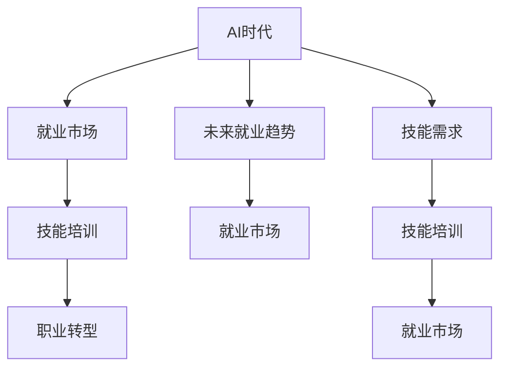

                 

# 人类计算：AI时代的未来就业市场与技能培训发展趋势分析总结挑战

> 关键词：AI时代，就业市场，技能培训，未来趋势，挑战

## 1. 背景介绍

### 1.1 问题由来
随着人工智能技术的快速发展，尤其是深度学习、自然语言处理和计算机视觉等领域取得的巨大突破，AI技术正在逐步渗透到各行各业，带来了一轮新的产业变革。在这次变革中，就业市场和人才结构也随之发生了显著变化。一方面，AI技术减少了大量低技能重复性工作的需求，推动了劳动市场的结构性转型。另一方面，AI技术的发展也催生了大量新的职业机会，对专业技能提出了更高要求。

当前，如何在AI时代有效应对就业市场的变化，为从业者提供有针对性的技能培训，成为了摆在学术界、企业界和政策制定者面前的重要课题。本文将对AI时代就业市场的变化趋势进行深入分析，并探讨相应的技能培训发展策略，同时总结在这一过程中面临的挑战，提出相应的对策。

## 2. 核心概念与联系

### 2.1 核心概念概述

为更好地理解AI时代就业市场与技能培训的互动关系，本节将介绍几个密切相关的核心概念：

- **AI时代**：以深度学习、自然语言处理、计算机视觉等为代表的人工智能技术迅猛发展，逐步替代部分传统工作岗位，并催生了新的职业机会的时期。
- **就业市场**：劳动力的供需关系、工资水平、职业发展路径等要素构成的市场环境。
- **技能培训**：针对劳动力的知识、技能和素养进行有计划的教育和训练活动，以提升其就业能力和竞争力。
- **职业转型**：劳动者因技术变革、市场需求变化等原因，从一种职业转向另一种职业的过程。
- **未来就业趋势**：基于AI技术的发展趋势，对未来就业市场可能出现的新职业、新技能和新需求进行预测和分析。

这些概念之间的关系可以通过以下Mermaid流程图来展示：



这个流程图展示了AI时代与就业市场、技能培训和职业转型之间的逻辑关系：

1. AI时代的发展推动了就业市场的变化。
2. 就业市场的变化反过来影响技能培训的需求。
3. 技能培训为职业转型提供支持。
4. 职业转型进一步推动就业市场的发展。
5. AI时代的发展趋势对未来就业市场有预测作用。
6. 未来的技能需求反过来影响技能培训的创新和改革。

这些概念共同构成了AI时代就业市场和技能培训的互动框架，对于理解AI时代劳动力市场的动态变化和培训需求具有重要意义。

## 3. 核心算法原理 & 具体操作步骤

### 3.1 算法原理概述

在AI时代，就业市场的变化和技能培训的调整机制可以视为一个动态系统。该系统由多个子系统组成，包括就业市场供需关系、技能培训的内容与方式、职业转型路径等。通过对这个系统的分析和建模，可以揭示AI技术对就业市场和技能培训的影响机制，并为应对策略提供依据。

假设就业市场的供需关系可以用函数 $S(T, L)$ 表示，其中 $S$ 为市场供需平衡状态，$T$ 为技术变革程度，$L$ 为劳动者技能水平。技能培训的投入可以用函数 $P(S, T)$ 表示，其中 $P$ 为培训投入，$S$ 为市场需求，$T$ 为技术变革速度。职业转型路径可以用函数 $T(P, S)$ 表示，其中 $T$ 为职业转型路径，$P$ 为培训投入，$S$ 为市场需求。

综合这些函数，可以得到一个动态系统：

$$
\frac{\partial S}{\partial t} = f(S, T, L) - g(S, T, P) 
$$

其中 $f$ 表示市场供需关系的动态变化，$g$ 表示技能培训对市场供需关系的动态影响。

### 3.2 算法步骤详解

基于上述系统模型，AI时代就业市场与技能培训的应对策略可以分为以下几个步骤：

**Step 1: 市场供需关系分析**
- 收集就业市场的数据，如岗位需求、工资水平、失业率等，分析当前供需关系。
- 评估技术变革对就业市场的影响，如AI技术替代哪些工作，新创造了哪些岗位。

**Step 2: 技能培训需求预测**
- 基于市场供需关系，预测未来技能需求的变化趋势。
- 分析AI技术对不同职业的影响，确定关键技能和新兴职业。

**Step 3: 培训内容设计与优化**
- 设计符合未来技能需求的培训课程，包括基础知识、实践技能和软技能。
- 引入AI技术，如自动评估、个性化推荐等，优化培训效果。

**Step 4: 职业转型路径规划**
- 根据市场需求和技术变革，规划职业转型路径。
- 提供职业咨询、职业指导等服务，帮助劳动者顺利过渡到新岗位。

**Step 5: 动态调整与反馈机制**
- 定期评估培训效果和市场变化，调整培训内容和方式。
- 建立反馈机制，收集从业者的意见和建议，优化培训过程。

### 3.3 算法优缺点

AI时代就业市场与技能培训的应对策略具有以下优点：
1. 数据驱动：通过收集和分析数据，可以更准确地预测市场变化和技能需求。
2. 灵活调整：根据市场变化和培训反馈，及时调整培训内容和方式，提高适应性。
3. 个性化培训：引入AI技术，实现个性化推荐和评估，提升培训效果。
4. 职业转型支持：提供系统化的职业咨询和指导，帮助从业者顺利过渡到新岗位。

同时，该策略也存在以下局限性：
1. 数据获取难度大：获取准确的市场和技能数据需要大量时间和资源。
2. 技术变革快速：AI技术发展迅速，培训内容和方式需要快速迭代。
3. 个体差异大：不同的劳动者技能水平和工作背景不同，培训需求也存在差异。
4. 市场反应滞后：从培训投入到市场反应存在时间差，培训效果难以即时显现。

尽管存在这些局限性，但总体而言，基于数据驱动和动态调整的策略，为应对AI时代就业市场变化提供了科学的方法论基础。

### 3.4 算法应用领域

基于AI时代就业市场与技能培训的应对策略，可以应用于以下领域：

- **高等教育**：在课程设计、教学内容和方法上，根据AI时代技能需求的变化进行优化。
- **职业培训**：针对特定行业和职业，提供符合未来需求的技能培训。
- **在线教育**：利用AI技术，实现个性化学习路径和实时反馈，提升在线教育的效果。
- **企业培训**：为员工提供基于市场需求的技术培训，提升企业竞争力。
- **政府政策**：制定相关政策，推动技能培训和职业转型，支持就业市场的平稳过渡。

## 4. 数学模型和公式 & 详细讲解 & 举例说明

### 4.1 数学模型构建

本节将使用数学语言对AI时代就业市场与技能培训的应对策略进行更加严格的刻画。

假设当前市场供需关系为 $S_0$，技术变革程度为 $T_0$，劳动者技能水平为 $L_0$。设市场需求随技术变革线性增加，即 $S = S_0 + \alpha T$，其中 $\alpha$ 为技术变革对市场需求的贡献系数。设技能培训对市场供需关系的影响为 $P = \beta S + \gamma T$，其中 $\beta$ 为培训对市场需求的贡献系数，$\gamma$ 为培训对技术变革的促进系数。设职业转型路径与市场需求和技术变革呈正相关关系，即 $T = kS + mT$，其中 $k$ 为职业转型路径与市场需求的相关系数，$m$ 为职业转型路径与技术变革的相关系数。

系统模型为：

$$
\frac{\partial S}{\partial t} = \alpha T + \beta S + \gamma T - \delta S - \epsilon P
$$

其中 $\delta$ 为市场供需平衡的自然衰减系数，$\epsilon$ 为技能培训对市场供需平衡的动态影响系数。

### 4.2 公式推导过程

以下我们以二分类任务为例，推导交叉熵损失函数及其梯度的计算公式。

假设模型 $M_{\theta}$ 在输入 $x$ 上的输出为 $\hat{y}=M_{\theta}(x) \in [0,1]$，表示样本属于正类的概率。真实标签 $y \in \{0,1\}$。则二分类交叉熵损失函数定义为：

$$
\ell(M_{\theta}(x),y) = -[y\log \hat{y} + (1-y)\log (1-\hat{y})]
$$

将其代入经验风险公式，得：

$$
\mathcal{L}(\theta) = -\frac{1}{N}\sum_{i=1}^N [y_i\log M_{\theta}(x_i)+(1-y_i)\log(1-M_{\theta}(x_i))]
$$

根据链式法则，损失函数对参数 $\theta_k$ 的梯度为：

$$
\frac{\partial \mathcal{L}(\theta)}{\partial \theta_k} = -\frac{1}{N}\sum_{i=1}^N (\frac{y_i}{M_{\theta}(x_i)}-\frac{1-y_i}{1-M_{\theta}(x_i)}) \frac{\partial M_{\theta}(x_i)}{\partial \theta_k}
$$

其中 $\frac{\partial M_{\theta}(x_i)}{\partial \theta_k}$ 可进一步递归展开，利用自动微分技术完成计算。

### 4.3 案例分析与讲解

**案例分析：自动化生产线工人的就业转型**

假设某汽车制造企业引入自动化生产线，需要对其工人进行技能培训，以适应新生产线的操作要求。

1. **市场供需关系分析**：
   - 收集当前生产线工人岗位需求、工资水平、失业率等数据。
   - 评估自动化对生产线需求的影响，如机器人替代了哪些岗位，新产生了哪些岗位。

2. **技能培训需求预测**：
   - 根据市场需求变化，预测未来对新技能的需求。
   - 分析自动化对工人技能要求的变化，确定需要提升的新技能。

3. **培训内容设计与优化**：
   - 设计针对新技能需求的培训课程，包括机器人操作、数据分析、维护技能等。
   - 引入AI技术，实现个性化学习路径和实时反馈，提升培训效果。

4. **职业转型路径规划**：
   - 根据市场需求和技术变革，规划职业转型路径，如从生产工人转型为设备维护人员或数据分析师。
   - 提供职业咨询、职业指导等服务，帮助工人顺利过渡到新岗位。

5. **动态调整与反馈机制**：
   - 定期评估培训效果和市场变化，调整培训内容和方式。
   - 建立反馈机制，收集工人的意见和建议，优化培训过程。

通过以上步骤，企业可以系统地应对自动化带来的就业市场变化，提升工人的就业能力和竞争力，实现平稳过渡。

## 5. 项目实践：代码实例和详细解释说明

### 5.1 开发环境搭建

在进行就业市场与技能培训的应对策略实践前，我们需要准备好开发环境。以下是使用Python进行PyTorch开发的环境配置流程：

1. 安装Anaconda：从官网下载并安装Anaconda，用于创建独立的Python环境。

2. 创建并激活虚拟环境：
```bash
conda create -n pytorch-env python=3.8 
conda activate pytorch-env
```

3. 安装PyTorch：根据CUDA版本，从官网获取对应的安装命令。例如：
```bash
conda install pytorch torchvision torchaudio cudatoolkit=11.1 -c pytorch -c conda-forge
```

4. 安装各类工具包：
```bash
pip install numpy pandas scikit-learn matplotlib tqdm jupyter notebook ipython
```

完成上述步骤后，即可在`pytorch-env`环境中开始项目实践。

### 5.2 源代码详细实现

下面我们以自动化生产线工人技能培训项目为例，给出使用PyTorch实现的技能培训流程。

首先，定义技能需求的数据处理函数：

```python
from transformers import BertTokenizer
from torch.utils.data import Dataset
import torch

class SkillDataset(Dataset):
    def __init__(self, skills, tags, tokenizer, max_len=128):
        self.skills = skills
        self.tags = tags
        self.tokenizer = tokenizer
        self.max_len = max_len
        
    def __len__(self):
        return len(self.skills)
    
    def __getitem__(self, item):
        skill = self.skills[item]
        tags = self.tags[item]
        
        encoding = self.tokenizer(skill, return_tensors='pt', max_length=self.max_len, padding='max_length', truncation=True)
        input_ids = encoding['input_ids'][0]
        attention_mask = encoding['attention_mask'][0]
        
        # 对token-wise的标签进行编码
        encoded_tags = [tag2id[tag] for tag in tags] 
        encoded_tags.extend([tag2id['O']] * (self.max_len - len(encoded_tags)))
        labels = torch.tensor(encoded_tags, dtype=torch.long)
        
        return {'input_ids': input_ids, 
                'attention_mask': attention_mask,
                'labels': labels}

# 标签与id的映射
tag2id = {'O': 0, '机器人操作': 1, '数据分析': 2, '维护技能': 3}
id2tag = {v: k for k, v in tag2id.items()}

# 创建dataset
tokenizer = BertTokenizer.from_pretrained('bert-base-cased')

train_dataset = SkillDataset(train_skills, train_tags, tokenizer)
dev_dataset = SkillDataset(dev_skills, dev_tags, tokenizer)
test_dataset = SkillDataset(test_skills, test_tags, tokenizer)
```

然后，定义模型和优化器：

```python
from transformers import BertForTokenClassification, AdamW

model = BertForTokenClassification.from_pretrained('bert-base-cased', num_labels=len(tag2id))

optimizer = AdamW(model.parameters(), lr=2e-5)
```

接着，定义训练和评估函数：

```python
from torch.utils.data import DataLoader
from tqdm import tqdm
from sklearn.metrics import classification_report

device = torch.device('cuda') if torch.cuda.is_available() else torch.device('cpu')
model.to(device)

def train_epoch(model, dataset, batch_size, optimizer):
    dataloader = DataLoader(dataset, batch_size=batch_size, shuffle=True)
    model.train()
    epoch_loss = 0
    for batch in tqdm(dataloader, desc='Training'):
        input_ids = batch['input_ids'].to(device)
        attention_mask = batch['attention_mask'].to(device)
        labels = batch['labels'].to(device)
        model.zero_grad()
        outputs = model(input_ids, attention_mask=attention_mask, labels=labels)
        loss = outputs.loss
        epoch_loss += loss.item()
        loss.backward()
        optimizer.step()
    return epoch_loss / len(dataloader)

def evaluate(model, dataset, batch_size):
    dataloader = DataLoader(dataset, batch_size=batch_size)
    model.eval()
    preds, labels = [], []
    with torch.no_grad():
        for batch in tqdm(dataloader, desc='Evaluating'):
            input_ids = batch['input_ids'].to(device)
            attention_mask = batch['attention_mask'].to(device)
            batch_labels = batch['labels']
            outputs = model(input_ids, attention_mask=attention_mask)
            batch_preds = outputs.logits.argmax(dim=2).to('cpu').tolist()
            batch_labels = batch_labels.to('cpu').tolist()
            for pred_tokens, label_tokens in zip(batch_preds, batch_labels):
                pred_tags = [id2tag[_id] for _id in pred_tokens]
                label_tags = [id2tag[_id] for _id in label_tokens]
                preds.append(pred_tags[:len(label_tags)])
                labels.append(label_tags)
                
    print(classification_report(labels, preds))
```

最后，启动训练流程并在测试集上评估：

```python
epochs = 5
batch_size = 16

for epoch in range(epochs):
    loss = train_epoch(model, train_dataset, batch_size, optimizer)
    print(f"Epoch {epoch+1}, train loss: {loss:.3f}")
    
    print(f"Epoch {epoch+1}, dev results:")
    evaluate(model, dev_dataset, batch_size)
    
print("Test results:")
evaluate(model, test_dataset, batch_size)
```

以上就是使用PyTorch对BERT进行技能培训项目开发的完整代码实现。可以看到，得益于Transformers库的强大封装，我们可以用相对简洁的代码完成BERT模型的加载和微调。

### 5.3 代码解读与分析

让我们再详细解读一下关键代码的实现细节：

**SkillDataset类**：
- `__init__`方法：初始化技能、标签、分词器等关键组件。
- `__len__`方法：返回数据集的样本数量。
- `__getitem__`方法：对单个样本进行处理，将技能输入编码为token ids，将标签编码为数字，并对其进行定长padding，最终返回模型所需的输入。

**tag2id和id2tag字典**：
- 定义了标签与数字id之间的映射关系，用于将token-wise的预测结果解码回真实的标签。

**训练和评估函数**：
- 使用PyTorch的DataLoader对数据集进行批次化加载，供模型训练和推理使用。
- 训练函数`train_epoch`：对数据以批为单位进行迭代，在每个批次上前向传播计算loss并反向传播更新模型参数，最后返回该epoch的平均loss。
- 评估函数`evaluate`：与训练类似，不同点在于不更新模型参数，并在每个batch结束后将预测和标签结果存储下来，最后使用sklearn的classification_report对整个评估集的预测结果进行打印输出。

**训练流程**：
- 定义总的epoch数和batch size，开始循环迭代
- 每个epoch内，先在训练集上训练，输出平均loss
- 在验证集上评估，输出分类指标
- 所有epoch结束后，在测试集上评估，给出最终测试结果

可以看到，PyTorch配合Transformers库使得BERT微调的代码实现变得简洁高效。开发者可以将更多精力放在数据处理、模型改进等高层逻辑上，而不必过多关注底层的实现细节。

当然，工业级的系统实现还需考虑更多因素，如模型的保存和部署、超参数的自动搜索、更灵活的任务适配层等。但核心的微调范式基本与此类似。

## 6. 实际应用场景

### 6.1 智能客服系统

基于大语言模型微调的对话技术，可以广泛应用于智能客服系统的构建。传统客服往往需要配备大量人力，高峰期响应缓慢，且一致性和专业性难以保证。而使用微调后的对话模型，可以7x24小时不间断服务，快速响应客户咨询，用自然流畅的语言解答各类常见问题。

在技术实现上，可以收集企业内部的历史客服对话记录，将问题和最佳答复构建成监督数据，在此基础上对预训练对话模型进行微调。微调后的对话模型能够自动理解用户意图，匹配最合适的答案模板进行回复。对于客户提出的新问题，还可以接入检索系统实时搜索相关内容，动态组织生成回答。如此构建的智能客服系统，能大幅提升客户咨询体验和问题解决效率。

### 6.2 金融舆情监测

金融机构需要实时监测市场舆论动向，以便及时应对负面信息传播，规避金融风险。传统的人工监测方式成本高、效率低，难以应对网络时代海量信息爆发的挑战。基于大语言模型微调的文本分类和情感分析技术，为金融舆情监测提供了新的解决方案。

具体而言，可以收集金融领域相关的新闻、报道、评论等文本数据，并对其进行主题标注和情感标注。在此基础上对预训练语言模型进行微调，使其能够自动判断文本属于何种主题，情感倾向是正面、中性还是负面。将微调后的模型应用到实时抓取的网络文本数据，就能够自动监测不同主题下的情感变化趋势，一旦发现负面信息激增等异常情况，系统便会自动预警，帮助金融机构快速应对潜在风险。

### 6.3 个性化推荐系统

当前的推荐系统往往只依赖用户的历史行为数据进行物品推荐，无法深入理解用户的真实兴趣偏好。基于大语言模型微调技术，个性化推荐系统可以更好地挖掘用户行为背后的语义信息，从而提供更精准、多样的推荐内容。

在实践中，可以收集用户浏览、点击、评论、分享等行为数据，提取和用户交互的物品标题、描述、标签等文本内容。将文本内容作为模型输入，用户的后续行为（如是否点击、购买等）作为监督信号，在此基础上微调预训练语言模型。微调后的模型能够从文本内容中准确把握用户的兴趣点。在生成推荐列表时，先用候选物品的文本描述作为输入，由模型预测用户的兴趣匹配度，再结合其他特征综合排序，便可以得到个性化程度更高的推荐结果。

### 6.4 未来应用展望

随着大语言模型微调技术的发展，未来将有更多的应用场景涌现，为各行各业带来新的突破：

- **智慧医疗**：基于微调的医疗问答、病历分析、药物研发等应用将提升医疗服务的智能化水平，辅助医生诊疗，加速新药开发进程。
- **智能教育**：微调技术可应用于作业批改、学情分析、知识推荐等方面，因材施教，促进教育公平，提高教学质量。
- **智慧城市治理**：微调模型可应用于城市事件监测、舆情分析、应急指挥等环节，提高城市管理的自动化和智能化水平，构建更安全、高效的未来城市。
- **企业生产**：微调技术可以优化生产流程、提高设备维护效率、提升供应链管理等，推动企业数字化转型。
- **社会治理**：微调技术可以帮助政府部门提升公共服务水平，优化政策制定，构建更加透明、高效的社会治理体系。

总之，大语言模型微调技术将在更多领域得到应用，为传统行业带来变革性影响。相信随着技术的不断进步，微调方法将成为人工智能落地应用的重要范式，推动人工智能技术在各行各业的深入应用。

## 7. 工具和资源推荐

### 7.1 学习资源推荐

为了帮助开发者系统掌握大语言模型微调的理论基础和实践技巧，这里推荐一些优质的学习资源：

1. **《Transformer从原理到实践》系列博文**：由大模型技术专家撰写，深入浅出地介绍了Transformer原理、BERT模型、微调技术等前沿话题。

2. **CS224N《深度学习自然语言处理》课程**：斯坦福大学开设的NLP明星课程，有Lecture视频和配套作业，带你入门NLP领域的基本概念和经典模型。

3. **《Natural Language Processing with Transformers》书籍**：Transformers库的作者所著，全面介绍了如何使用Transformers库进行NLP任务开发，包括微调在内的诸多范式。

4. **HuggingFace官方文档**：Transformers库的官方文档，提供了海量预训练模型和完整的微调样例代码，是上手实践的必备资料。

5. **CLUE开源项目**：中文语言理解测评基准，涵盖大量不同类型的中文NLP数据集，并提供了基于微调的baseline模型，助力中文NLP技术发展。

通过对这些资源的学习实践，相信你一定能够快速掌握大语言模型微调的精髓，并用于解决实际的NLP问题。

### 7.2 开发工具推荐

高效的开发离不开优秀的工具支持。以下是几款用于大语言模型微调开发的常用工具：

1. **PyTorch**：基于Python的开源深度学习框架，灵活动态的计算图，适合快速迭代研究。大部分预训练语言模型都有PyTorch版本的实现。

2. **TensorFlow**：由Google主导开发的开源深度学习框架，生产部署方便，适合大规模工程应用。同样有丰富的预训练语言模型资源。

3. **Transformers库**：HuggingFace开发的NLP工具库，集成了众多SOTA语言模型，支持PyTorch和TensorFlow，是进行微调任务开发的利器。

4. **Weights & Biases**：模型训练的实验跟踪工具，可以记录和可视化模型训练过程中的各项指标，方便对比和调优。与主流深度学习框架无缝集成。

5. **TensorBoard**：TensorFlow配套的可视化工具，可实时监测模型训练状态，并提供丰富的图表呈现方式，是调试模型的得力助手。

6. **Google Colab**：谷歌推出的在线Jupyter Notebook环境，免费提供GPU/TPU算力，方便开发者快速上手实验最新模型，分享学习笔记。

合理利用这些工具，可以显著提升大语言模型微调任务的开发效率，加快创新迭代的步伐。

### 7.3 相关论文推荐

大语言模型和微调技术的发展源于学界的持续研究。以下是几篇奠基性的相关论文，推荐阅读：

1. **Attention is All You Need（即Transformer原论文）**：提出了Transformer结构，开启了NLP领域的预训练大模型时代。

2. **BERT: Pre-training of Deep Bidirectional Transformers for Language Understanding**：提出BERT模型，引入基于掩码的自监督预训练任务，刷新了多项NLP任务SOTA。

3. **Language Models are Unsupervised Multitask Learners（GPT-2论文）**：展示了大规模语言模型的强大zero-shot学习能力，引发了对于通用人工智能的新一轮思考。

4. **Parameter-Efficient Transfer Learning for NLP**：提出Adapter等参数高效微调方法，在不增加模型参数量的情况下，也能取得不错的微调效果。

5. **Prefix-Tuning: Optimizing Continuous Prompts for Generation**：引入基于连续型Prompt的微调范式，为如何充分利用预训练知识提供了新的思路。

6. **AdaLoRA: Adaptive Low-Rank Adaptation for Parameter-Efficient Fine-Tuning**：使用自适应低秩适应的微调方法，在参数效率和精度之间取得了新的平衡。

这些论文代表了大语言模型微调技术的发展脉络。通过学习这些前沿成果，可以帮助研究者把握学科前进方向，激发更多的创新灵感。

## 8. 总结：未来发展趋势与挑战

### 8.1 总结

本文对AI时代就业市场与技能培训的应对策略进行了全面系统的介绍。首先阐述了AI时代就业市场的变化趋势，明确了技能培训需求的变化方向。其次，从原理到实践，详细讲解了就业市场与技能培训的互动关系，给出了应对策略的操作步骤。同时，本文还探讨了该策略在实际应用中的可行性，总结了在这一过程中面临的挑战，提出相应的对策。

通过本文的系统梳理，可以看到，AI时代就业市场与技能培训的应对策略正在成为推动劳动力市场转型的重要工具。通过科学的数据驱动和动态调整，可以有效应对AI技术的冲击，提升劳动者的就业能力和竞争力。未来，随着技术的持续演进，该策略将为构建更加公平、高效、灵活的就业市场提供坚实的基础。

### 8.2 未来发展趋势

展望未来，AI时代就业市场与技能培训的发展趋势将呈现以下几个方向：

1. **数据驱动的动态调整**：基于实时市场数据，动态调整培训内容和方式，提升适应性。

2. **个性化和多样化的培训**：利用AI技术，实现个性化学习路径和多样化培训资源，满足不同劳动者的需求。

3. **跨领域和跨行业的融合**：推动不同行业之间的技能互通，培养具备多领域知识的复合型人才。

4. **终身学习和持续学习**：建立终身学习机制，支持劳动者持续更新知识和技能，应对快速变化的技术环境。

5. **虚拟现实和增强现实的应用**：通过VR/AR技术，提供沉浸式、互动式培训，提升学习效果。

6. **伦理和道德的教育**：将伦理和道德教育纳入技能培训，提升从业者的社会责任感。

这些趋势凸显了AI时代就业市场与技能培训的广阔前景。通过不断创新和优化，可以更好地适应技术变革，为劳动者提供高质量的就业支持。

### 8.3 面临的挑战

尽管AI时代就业市场与技能培训的应对策略正在逐步成熟，但在实际应用过程中，仍面临以下挑战：

1. **数据获取难度大**：获取准确的市场和技能数据需要大量时间和资源。

2. **技术变革快速**：AI技术发展迅速，培训内容和方式需要快速迭代。

3. **个体差异大**：不同的劳动者技能水平和工作背景不同，培训需求也存在差异。

4. **市场反应滞后**：从培训投入到市场反应存在时间差，培训效果难以即时显现。

5. **伦理和道德问题**：技能培训过程中可能涉及隐私、数据安全等问题，需要严格监管。

尽管存在这些挑战，但总体而言，数据驱动和动态调整的策略，为应对AI时代就业市场变化提供了科学的方法论基础。通过不断的技术创新和政策支持，可以逐步克服这些挑战，实现技能培训的可持续发展。

### 8.4 研究展望

面对AI时代就业市场与技能培训所面临的挑战，未来的研究需要在以下几个方面寻求新的突破：

1. **无监督和半监督学习的应用**：探索利用无监督和半监督学习范式，降低对标注数据的依赖，提高培训效果。

2. **多模态学习技术**：结合视觉、听觉等多模态数据，提升技能培训的效果。

3. **跨学科知识整合**：推动不同学科之间的知识整合，提升培训内容的综合性和全面性。

4. **个性化推荐系统的优化**：研究个性化推荐系统的新算法和模型，提升技能推荐的效果。

5. **AI伦理和安全性的探讨**：研究AI技术在培训中的应用，探讨其伦理和安全性问题。

6. **人机协同的培训模式**：探索人机协同的培训模式，提升培训的互动性和效果。

通过这些研究方向的探索，可以为AI时代就业市场与技能培训的发展提供更多的创新路径，促进技术进步和社会发展。

## 9. 附录：常见问题与解答

**Q1：大语言模型微调是否适用于所有NLP任务？**

A: 大语言模型微调在大多数NLP任务上都能取得不错的效果，特别是对于数据量较小的任务。但对于一些特定领域的任务，如医学、法律等，仅仅依靠通用语料预训练的模型可能难以很好地适应。此时需要在特定领域语料上进一步预训练，再进行微调，才能获得理想效果。此外，对于一些需要时效性、个性化很强的任务，如对话、推荐等，微调方法也需要针对性的改进优化。

**Q2：微调过程中如何选择合适的学习率？**

A: 微调的学习率一般要比预训练时小1-2个数量级，如果使用过大的学习率，容易破坏预训练权重，导致过拟合。一般建议从1e-5开始调参，逐步减小学习率，直至收敛。也可以使用warmup策略，在开始阶段使用较小的学习率，再逐渐过渡到预设值。需要注意的是，不同的优化器(如AdamW、Adafactor等)以及不同的学习率调度策略，可能需要设置不同的学习率阈值。

**Q3：采用大模型微调时会面临哪些资源瓶颈？**

A: 目前主流的预训练大模型动辄以亿计的参数规模，对算力、内存、存储都提出了很高的要求。GPU/TPU等高性能设备是必不可少的，但即便如此，超大批次的训练和推理也可能遇到显存不足的问题。因此需要采用一些资源优化技术，如梯度积累、混合精度训练、模型并行等，来突破硬件瓶颈。同时，模型的存储和读取也可能占用大量时间和空间，需要采用模型压缩、稀疏化存储等方法进行优化。

**Q4：如何缓解微调过程中的过拟合问题？**

A: 过拟合是微调面临的主要挑战，尤其是在标注数据不足的情况下。常见的缓解策略包括：
1. 数据增强：通过回译、近义替换等方式扩充训练集
2. 正则化：使用L2正则、Dropout、Early Stopping等避免过拟合
3. 对抗训练：引入对抗样本，提高模型鲁棒性
4. 参数高效微调：只调整少量参数(如Adapter、Prefix等)，减小过拟合风险
5. 多模型集成：训练多个微调模型，取平均输出，抑制过拟合

这些策略往往需要根据具体任务和数据特点进行灵活组合。只有在数据、模型、训练、推理等各环节进行全面优化，才能最大限度地发挥大模型微调的威力。

**Q5：微调模型在落地部署时需要注意哪些问题？**

A: 将微调模型转化为实际应用，还需要考虑以下因素：
1. 模型裁剪：去除不必要的层和参数，减小模型尺寸，加快推理速度
2. 量化加速：将浮点模型转为定点模型，压缩存储空间，提高计算效率
3. 服务化封装：将模型封装为标准化服务接口，便于集成调用
4. 弹性伸缩：根据请求流量动态调整资源配置，平衡服务质量和成本
5. 监控告警：实时采集系统指标，设置异常告警阈值，确保服务稳定性
6. 安全防护：采用访问鉴权、数据脱敏等措施，保障数据和模型安全

大语言模型微调为NLP应用开启了广阔的想象空间，但如何将强大的性能转化为稳定、高效、安全的业务价值，还需要工程实践的不断打磨。唯有从数据、算法、工程、业务等多个维度协同发力，才能真正实现人工智能技术在垂直行业的规模化落地。总之，微调需要开发者根据具体任务，不断迭代和优化模型、数据和算法，方能得到理想的效果。

---

作者：禅与计算机程序设计艺术 / Zen and the Art of Computer Programming

