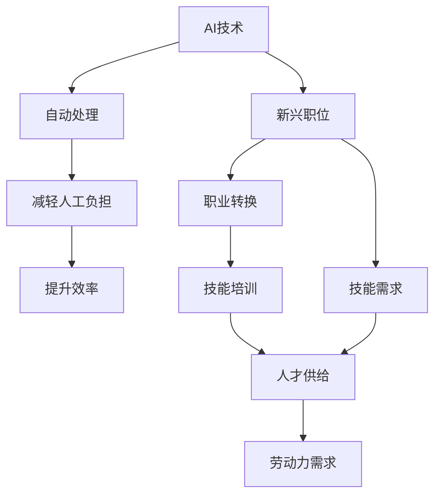

                 

# 人类计算：AI时代的未来技能培训与就业市场趋势

## 1. 背景介绍

随着人工智能(AI)技术的迅猛发展，人类计算（Human Computation）正经历深刻变革。从自动驾驶汽车到精准医疗，从智能客服到个性化推荐，AI已经成为推动各行各业数字化转型的核心动力。然而，AI并非无懈可击，它在提升效率、降低成本的同时，也带来了新的挑战和风险。特别是随着AI技术的广泛应用，如何培养具备AI时代所需技能的人才，如何适应新兴就业市场的需求，成为了全社会关注的焦点。

本博客将从AI时代的未来技能培训与就业市场趋势两个维度展开，分析当前和未来的技能需求，探讨如何通过教育和培训，确保人才供给与技术发展的匹配，实现AI与人类计算的协同共生。

## 2. 核心概念与联系

### 2.1 核心概念概述

在探讨AI时代的未来技能培训与就业市场趋势之前，我们首先需要理解几个核心概念及其相互关系：

- **人工智能（AI）**：指通过计算机系统模拟人类智能行为的技术。包括机器学习、深度学习、自然语言处理等众多子领域。
- **人类计算（Human Computation）**：指利用人类智慧和创造力，对数据进行解释、分析和决策的过程。人类计算与AI相辅相成，共同提升工作效率和决策质量。
- **技能培训（Skill Training）**：指通过教育、培训等方式，提升个体对特定技能掌握程度的过程。技能培训的目的是使员工适应技术变化，提升工作效率。
- **就业市场（Job Market）**：指劳动力供求关系的动态体现。AI时代，新兴技术不断涌现，对就业市场结构产生了深刻影响。

这些概念之间的关系通过以下Mermaid流程图展示：

```mermaid
graph TB
    A[人工智能 (AI)] --> B[人类计算 (Human Computation)]
    A --> C[技能培训 (Skill Training)]
    C --> D[人才供给]
    A --> E[就业市场 (Job Market)]
    D --> E
    E --> F[劳动力需求]
```

此图展示了AI如何通过技能培训，影响人才供给和就业市场，从而影响劳动力需求。

### 2.2 核心概念原理和架构的 Mermaid 流程图



以上流程图展示了AI技术通过提升效率和减轻人工负担，催生了新兴职位，促使职业转换，最终形成了对新技能的需求。通过技能培训，提升人才供给，满足就业市场对新技能的需求。

## 3. 核心算法原理 & 具体操作步骤

### 3.1 算法原理概述

在AI时代，技能培训与就业市场趋势的核心问题在于，如何培养具备AI时代所需技能的人才，以及如何匹配市场对新技能的需求。这一过程涉及到数据科学、计算机科学、心理学等多个学科的知识。核心算法原理主要包括：

1. **数据驱动的人才需求分析**：通过对就业市场的分析，挖掘当前和未来的技能需求。
2. **个性化技能培训模型**：基于学习者特征和需求，设计个性化的培训方案。
3. **劳动力市场模拟与预测**：构建劳动力市场模型，预测未来技能供需关系。
4. **动态调整与优化**：根据市场变化，动态调整培训内容和方向。

### 3.2 算法步骤详解

以下详细介绍AI时代技能培训与就业市场趋势的核心算法步骤：

**步骤1：数据收集与预处理**
- 收集就业市场数据，包括职位描述、薪资水平、技能需求等。
- 对数据进行清洗、去重、标注，确保数据质量。

**步骤2：技能需求分析**
- 使用文本挖掘、自然语言处理等技术，分析职位描述和招聘信息中的技能需求。
- 通过聚类分析、主题建模等方法，识别关键技能和趋势。

**步骤3：个性化培训方案设计**
- 基于学习者的职业背景、兴趣、能力，设计个性化的培训方案。
- 采用推荐系统技术，推荐适合的技能培训课程和学习资源。

**步骤4：动态调整与优化**
- 根据市场变化，实时调整培训内容和方向。
- 使用强化学习、博弈论等技术，优化培训策略和资源配置。

**步骤5：评估与反馈**
- 评估培训效果，使用问卷调查、绩效评估等方式获取反馈。
- 根据反馈调整培训内容和方法，提升培训效果。

### 3.3 算法优缺点

**优点**：
1. **数据驱动**：通过大数据分析，更准确地识别技能需求和趋势。
2. **个性化**：根据学习者特征设计个性化培训方案，提升学习效果。
3. **动态调整**：根据市场变化实时调整培训策略，确保与市场需求的匹配。

**缺点**：
1. **数据质量问题**：数据收集和预处理难度大，数据质量可能影响分析结果。
2. **复杂性高**：涉及多个学科知识，算法设计和实现复杂。
3. **隐私与安全问题**：数据隐私和安全问题需要特别关注。

### 3.4 算法应用领域

AI时代技能培训与就业市场趋势的应用领域广泛，包括：

- **教育机构**：提供符合市场需求的培训课程，提升学生就业竞争力。
- **企业培训**：根据职位需求设计个性化培训方案，提升员工技能水平。
- **政府与公共部门**：通过培训和再就业项目，促进劳动力市场平衡。
- **职业培训机构**：提供新兴技能培训课程，帮助劳动者转行。

## 4. 数学模型和公式 & 详细讲解 & 举例说明

### 4.1 数学模型构建

在AI时代，技能培训与就业市场趋势的分析建模通常涉及以下数学模型：

- **多维尺度分析（MDS）**：用于分析技能需求的多维特性。
- **回归分析**：预测薪资水平与技能需求之间的关系。
- **聚类分析**：识别技能需求中的共性和差异。
- **线性规划**：优化培训资源配置。

### 4.2 公式推导过程

以回归分析为例，假设我们收集了N个职位数据，每个职位有M种技能需求，分别表示为 $(s_i)$。设技能需求与薪资水平 $(w_i)$ 之间存在线性关系，公式为：

$$ w_i = \beta_0 + \beta_1 s_1 + \beta_2 s_2 + ... + \beta_M s_M + \epsilon_i $$

其中，$\beta_0$ 为截距，$\beta_j$ 为第j种技能需求的系数，$\epsilon_i$ 为误差项。通过最小二乘法求解模型参数 $\beta_0, \beta_1, ..., \beta_M$，即可预测薪资水平与技能需求之间的关系。

### 4.3 案例分析与讲解

以机器学习工程师为例，我们收集了100个职位描述数据，分析了其中技能需求对薪资水平的影响。通过回归分析，我们得到如下模型：

$$ w_i = \beta_0 + \beta_1 \text{Data Science} + \beta_2 \text{Python} + \beta_3 \text{TensorFlow} + \epsilon_i $$

其中，$\beta_1, \beta_2, \beta_3$ 分别表示Data Science、Python、TensorFlow三种技能需求的系数。通过计算，我们发现Data Science和TensorFlow对薪资水平的影响较大，而Python相对较小。

## 5. 项目实践：代码实例和详细解释说明

### 5.1 开发环境搭建

在进行技能培训与就业市场趋势分析时，我们通常使用Python进行编程实现。以下是Python开发环境搭建的详细步骤：

1. 安装Python：从官网下载并安装Python 3.x版本。
2. 安装Jupyter Notebook：在命令行中输入 `pip install jupyter notebook`。
3. 安装相关库：安装NumPy、Pandas、Scikit-learn等常用库，通过命令行输入 `pip install numpy pandas scikit-learn`。
4. 创建虚拟环境：使用 `python -m venv env` 创建虚拟环境。
5. 激活虚拟环境：在命令行中输入 `source env/bin/activate` 激活虚拟环境。

### 5.2 源代码详细实现

以下是使用Python和Scikit-learn库进行回归分析的代码实现：

```python
import pandas as pd
from sklearn.linear_model import LinearRegression

# 加载数据
data = pd.read_csv('job_data.csv')

# 准备数据
X = data['skills'].values.reshape(-1, len(data['skills'].unique()))
y = data['salary'].values

# 构建线性回归模型
model = LinearRegression()
model.fit(X, y)

# 输出模型参数
print('Intercept:', model.intercept_)
print('Coefficients:', model.coef_)
```

### 5.3 代码解读与分析

上述代码实现了使用Scikit-learn库进行线性回归分析的过程。首先，我们从CSV文件中加载数据，然后准备特征和目标变量。接着，构建线性回归模型，使用训练数据拟合模型，并输出模型参数。

## 6. 实际应用场景

### 6.1 教育机构

教育机构是技能培训与就业市场趋势分析的重要应用场景之一。例如，某大学针对大数据分析师职位需求，设计了一套包含Python、SQL、R语言等多门课程的培训方案，帮助学生提升就业竞争力。通过分析就业市场数据，学校还可以调整课程内容，提升学生的就业率。

### 6.2 企业培训

企业在AI时代需要不断提升员工的技能水平，以应对技术和市场变化。某科技公司通过技能培训平台，根据员工的技能需求，推送个性化的培训课程和学习资源。通过评估培训效果，公司调整培训方向，提升员工工作效率和业务能力。

### 6.3 政府与公共部门

政府和公共部门在AI时代需要积极应对劳动力市场变化，促进就业。某市政府通过技能培训项目，为失业人员提供再就业培训，提升其技能水平。通过劳动力市场模拟，政府可以预测未来技能需求，制定更有效的培训政策。

### 6.4 职业培训机构

职业培训机构在AI时代也面临新的挑战和机遇。某培训机构开发了基于AI的个性化培训系统，根据学员的学习进度和反馈，调整培训内容和方法。通过分析市场数据，培训机构可以设计出符合市场需求的新课程，提升培训效果。

## 7. 工具和资源推荐

### 7.1 学习资源推荐

以下是一些推荐的学习资源，帮助开发者和教育机构掌握技能培训与就业市场趋势：

- **《Python数据科学手册》**：由Wes McKinney撰写，全面介绍了Python在数据科学中的应用。
- **《深度学习入门》**：由斋藤康毅撰写，系统讲解了深度学习的基本概念和算法。
- **Coursera和Udacity**：提供丰富的在线课程，涵盖AI和数据科学多个领域。
- **Kaggle**：数据科学竞赛平台，提供大量数据集和案例分析，供学习和实践。

### 7.2 开发工具推荐

以下是一些推荐的开发工具，提升技能培训与就业市场趋势分析的效率：

- **Jupyter Notebook**：支持Python和其他编程语言，提供交互式编程环境。
- **GitHub**：代码托管平台，方便版本控制和团队协作。
- **GitLab**：提供CI/CD、代码审查等功能，支持团队协作和持续集成。
- **PyTorch**：深度学习框架，支持Python和C++，提供丰富的深度学习模型和工具。

### 7.3 相关论文推荐

以下是一些相关的论文，为技能培训与就业市场趋势的研究提供参考：

- **《人工智能与人类计算的未来》**：讨论AI对人类计算的影响和未来趋势。
- **《未来就业市场中的技能需求》**：分析未来就业市场对技能的需求，提出应对策略。
- **《个性化学习与技能培训》**：探讨个性化学习在技能培训中的应用。
- **《基于机器学习的劳动力市场预测》**：使用机器学习模型预测劳动力市场变化。

## 8. 总结：未来发展趋势与挑战

### 8.1 研究成果总结

AI时代技能培训与就业市场趋势的研究，取得了显著成果。通过大数据分析和机器学习技术，我们能够更准确地识别技能需求和趋势，设计个性化培训方案，优化培训资源配置。未来，随着技术的发展，技能培训与就业市场趋势分析将更加精准和智能化。

### 8.2 未来发展趋势

未来，技能培训与就业市场趋势分析将呈现以下趋势：

1. **数据驱动的精准分析**：基于大数据和机器学习技术，实现精准的技能需求分析。
2. **个性化与智能化培训**：结合人工智能技术，设计个性化的培训方案，提升培训效果。
3. **动态调整与优化**：实时调整培训内容和方向，确保与市场需求的匹配。
4. **跨学科融合**：融合数据科学、计算机科学、心理学等多个学科的知识，提升培训效果。

### 8.3 面临的挑战

尽管技能培训与就业市场趋势分析的研究取得了一定进展，但仍面临诸多挑战：

1. **数据质量问题**：数据收集和预处理难度大，数据质量可能影响分析结果。
2. **算法复杂性**：涉及多个学科知识，算法设计和实现复杂。
3. **隐私与安全问题**：数据隐私和安全问题需要特别关注。
4. **资源限制**：大数据和机器学习算法的资源需求大，设备成本较高。

### 8.4 研究展望

未来，技能培训与就业市场趋势研究需要在以下几个方面进一步探索：

1. **数据增强技术**：引入数据增强技术，提升数据质量。
2. **跨学科研究**：加强跨学科合作，提升研究深度和广度。
3. **隐私保护技术**：研究隐私保护技术，确保数据安全。
4. **低成本解决方案**：探索低成本的数据获取和算法实现方案，降低资源需求。

## 9. 附录：常见问题与解答

**Q1：如何评估技能培训的效果？**

A: 评估技能培训的效果通常需要结合量化和定性方法。量化方法包括学习者的考试成绩、项目完成情况等，而定性方法包括学习者的反馈、学员的满意度等。通过综合分析这些数据，可以全面评估技能培训的效果。

**Q2：如何设计个性化的培训方案？**

A: 设计个性化的培训方案需要考虑学习者的背景、兴趣、能力等因素。可以通过问卷调查、面试等方式，了解学习者的需求和特点，然后根据需求设计个性化的培训内容和方法。

**Q3：如何应对数据隐私和安全问题？**

A: 应对数据隐私和安全问题需要采取多项措施。例如，数据匿名化、访问控制、数据加密等。同时，建立严格的数据使用和处理流程，确保数据安全。

**Q4：如何优化培训资源配置？**

A: 优化培训资源配置需要结合市场变化，动态调整培训内容和方向。例如，根据市场需求，调整培训课程和资源配置，提升培训效果。

**Q5：如何提升培训的持续性和效果？**

A: 提升培训的持续性和效果需要建立培训评估和反馈机制。通过定期评估培训效果，调整培训方案，确保培训内容与市场需求匹配。同时，加强学习者的持续学习，提升培训效果。

通过以上分析和讨论，我们可以看到，AI时代的技能培训与就业市场趋势分析是一个复杂而动态的领域。只有不断探索和创新，才能确保人才供给与技术发展的匹配，实现AI与人类计算的协同共生。希望本文能为广大开发者和教育机构提供一些有益的启示和参考。

---

作者：禅与计算机程序设计艺术 / Zen and the Art of Computer Programming

