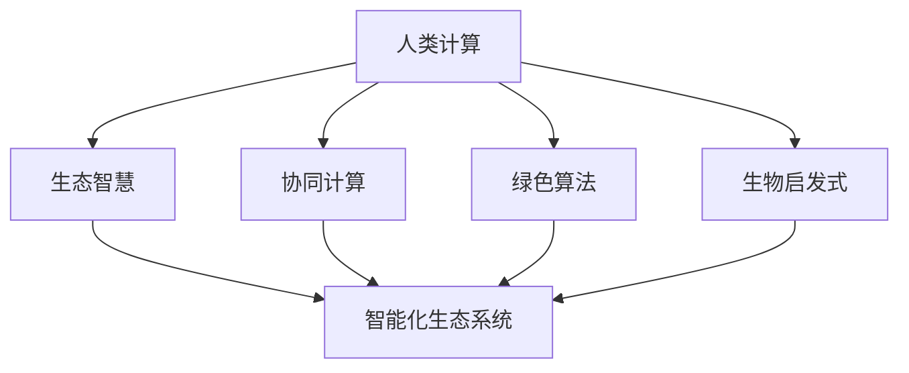

                 

# 人类计算：可持续发展的推动力

> 关键词：
> - 人类计算 (Human Computing)
> - 可持续性 (Sustainability)
> - 生态智慧 (EcoWisdom)
> - 协同计算 (Collaborative Computing)
> - 绿色算法 (Green Algorithm)
> - 生物启发式 (Bio-Inspired Algorithm)
> - 智能化生态系统 (Intelligent Ecosystem)

## 1. 背景介绍

### 1.1 问题由来
随着技术的不断进步，人类社会正逐渐进入数字时代。物联网、大数据、人工智能等技术在带来便利的同时，也引发了一系列环境和资源问题。如何在信息化发展的过程中实现可持续发展，是一个迫切需要解决的重要课题。

过去几十年，科学家和工程师们提出了许多技术和方法来解决这些问题，如可再生能源、绿色建筑、循环经济等。然而，这些方法往往局限于特定的技术或领域，缺乏系统性、整体性的解决方案。

本文将从计算科学的角度出发，探讨利用计算技术与自然界的协同关系，为可持续发展提供新的思路和工具。

### 1.2 问题核心关键点
人类计算作为一种全新的计算范式，将计算技术与自然界的协同关系相结合，通过利用生物、化学、物理等领域的知识，优化人类社会的运行机制。人类计算强调在处理数据和问题时，充分利用自然界的智能和能量，实现更高效、更可持续的计算模式。

具体而言，人类计算的关键点包括：

- **生物启发的算法**：借鉴自然界的运行机制，设计出更加高效、稳健的计算算法。
- **生态智慧**：通过模拟生态系统中的协同关系，实现数据的共享和优化，减少计算过程中的资源消耗。
- **协同计算**：利用多主体系统中的互动和协作，提升计算的分布式和分布式计算能力。
- **绿色算法**：通过设计更节能的算法，减少计算过程中的能源消耗和碳排放。

这些关键点共同构成了人类计算的核心理念，有助于我们构建一个更加绿色、智能、可持续的未来。

## 2. 核心概念与联系

### 2.1 核心概念概述

为了更好地理解人类计算的概念和框架，本节将介绍几个密切相关的核心概念：

- **人类计算 (Human Computing)**：将计算任务与自然界的智能和能量结合，通过生物、化学、物理等领域的知识，优化计算过程。

- **生态智慧 (EcoWisdom)**：模拟生态系统中的协同关系，实现数据的共享和优化，减少计算过程中的资源消耗。

- **协同计算 (Collaborative Computing)**：利用多主体系统中的互动和协作，提升计算的分布式和分布式计算能力。

- **绿色算法 (Green Algorithm)**：通过设计更节能的算法，减少计算过程中的能源消耗和碳排放。

- **生物启发式 (Bio-Inspired Algorithm)**：借鉴自然界的运行机制，设计出更加高效、稳健的计算算法。

- **智能化生态系统 (Intelligent Ecosystem)**：通过计算技术模拟和优化自然界的生态系统，实现生态智慧和可持续计算的闭环。

这些概念之间的逻辑关系可以通过以下Mermaid流程图来展示：



这个流程图展示了人类计算的核心概念及其之间的关系：

1. 人类计算通过生物、化学、物理等领域的知识，优化计算过程。
2. 生态智慧模拟生态系统中的协同关系，实现数据的共享和优化。
3. 协同计算利用多主体系统中的互动和协作，提升分布式计算能力。
4. 绿色算法通过设计更节能的算法，减少能源消耗。
5. 生物启发式借鉴自然界的运行机制，设计高效算法。
6. 智能化生态系统通过计算技术模拟和优化自然界的生态系统。

这些概念共同构成了人类计算的理论基础，为可持续发展提供了新的思路和技术手段。

## 3. 核心算法原理 & 具体操作步骤
### 3.1 算法原理概述

人类计算的算法原理主要基于以下几个关键点：

1. **生态智慧算法**：模拟生态系统中的协同关系，实现数据的共享和优化。
2. **协同计算算法**：利用多主体系统中的互动和协作，提升分布式计算能力。
3. **绿色算法**：通过设计更节能的算法，减少计算过程中的能源消耗和碳排放。
4. **生物启发式算法**：借鉴自然界的运行机制，设计出更加高效、稳健的计算算法。

这些算法通过将自然界的智能和能量与计算任务相结合，实现了计算过程的智能化和可持续发展。

### 3.2 算法步骤详解

人类计算的实现步骤通常包括以下几个关键环节：

**Step 1: 问题建模**
- 定义需要解决的问题，如资源优化、环境监测、智能交通等。
- 通过生态系统模型和生物启发式算法，构建问题的生态智慧表示。

**Step 2: 数据采集与预处理**
- 收集相关的环境数据、资源数据等，进行数据清洗和预处理。
- 通过协同计算技术，实现数据的分布式采集和处理。

**Step 3: 计算模型设计**
- 设计基于生态智慧和绿色算法的计算模型，如智能生态系统模拟、优化算法等。
- 利用生物启发式算法，优化计算模型的结构和参数。

**Step 4: 计算执行与优化**
- 通过协同计算平台，执行计算模型，实现大规模数据的处理和分析。
- 在计算过程中，实时监测能源消耗和碳排放，进行绿色算法优化。

**Step 5: 结果分析和反馈**
- 对计算结果进行分析和验证，评估模型的性能和效果。
- 通过反馈机制，不断调整和优化计算模型和算法。

### 3.3 算法优缺点

人类计算的算法具有以下优点：

1. **高效性**：通过生物启发式算法和协同计算，提升计算效率和数据处理能力。
2. **可持续性**：利用绿色算法，减少能源消耗和碳排放，实现计算的可持续发展。
3. **生态智慧**：通过模拟生态系统的协同关系，实现数据的共享和优化。

但同时也存在以下缺点：

1. **复杂性**：生态智慧和协同计算的实现较为复杂，需要跨学科的知识和技能。
2. **资源消耗**：在设计和实现过程中，需要投入大量的人力、物力和财力。
3. **适应性**：不同领域和场景的应用需要定制化的解决方案，通用性较差。

### 3.4 算法应用领域

人类计算的算法已在多个领域得到广泛应用，具体包括：

1. **智能交通系统**：通过模拟交通网络中的生态智慧，实现交通流量和能源消耗的优化。
2. **环境保护监测**：利用协同计算和生物启发式算法，实现环境数据的实时监测和分析。
3. **能源管理系统**：设计基于绿色算法的能源管理系统，实现能源的优化利用和节能减排。
4. **农业生产管理**：通过模拟农业生态系统的协同关系，实现农作物生长的智能管理和资源优化。
5. **城市规划与建设**：利用智能化生态系统模型，优化城市资源配置和空间利用。

此外，人类计算的算法还被应用于自然灾害预警、智能物流、工业生产优化等多个领域，为可持续发展提供了强有力的技术支撑。

## 4. 数学模型和公式 & 详细讲解 & 举例说明

### 4.1 数学模型构建

人类计算的数学模型通常基于以下几个关键概念：

1. **生态智慧模型**：通过模拟生态系统中的种群动态和资源分配，构建生态智慧模型。
2. **协同计算模型**：利用多主体系统中的互动和协作，构建协同计算模型。
3. **绿色算法模型**：通过设计更节能的算法，构建绿色算法模型。

以下是一个简单的生态智慧模型示例：

$$
\dot{x} = f(x) + g(x)u
$$

其中，$x$ 为生态系统中的变量向量，$f(x)$ 为系统内部的动态变化，$g(x)$ 为系统对外部扰动的响应，$u$ 为系统控制输入。

### 4.2 公式推导过程

以下是一个简单的协同计算模型示例：

假设有一个由多个智能体组成的系统，每个智能体都有一个状态$x_i$和控制输入$u_i$，系统整体的性能指标为$J$。

$$
J = \sum_{i=1}^n \ell(x_i, y_i)
$$

其中，$\ell(x_i, y_i)$ 为智能体$i$的损失函数，$y_i$ 为智能体$i$的期望输出。

通过分布式优化算法，实现系统整体的性能优化：

$$
\min_{u_1,...,u_n} J = \sum_{i=1}^n \ell(x_i, y_i)
$$

### 4.3 案例分析与讲解

以智能交通系统为例，介绍人类计算的具体应用。

智能交通系统通过模拟交通网络中的生态智慧，实现交通流量和能源消耗的优化。具体步骤如下：

1. **问题建模**：定义智能交通系统的问题，如交通拥堵、能源消耗等。
2. **数据采集与预处理**：收集交通流量、车流速度、能源消耗等数据，进行预处理。
3. **计算模型设计**：构建基于生态智慧和绿色算法的计算模型，如交通流量优化、能源消耗最小化等。
4. **计算执行与优化**：通过协同计算平台，执行计算模型，实时监测能源消耗和交通流量，进行绿色算法优化。
5. **结果分析和反馈**：对计算结果进行分析和验证，评估模型的性能和效果，通过反馈机制，不断调整和优化计算模型和算法。

## 5. 项目实践：代码实例和详细解释说明

### 5.1 开发环境搭建

在进行人类计算的实践前，我们需要准备好开发环境。以下是使用Python进行Sympy和NumPy开发的示例：

1. 安装Anaconda：从官网下载并安装Anaconda，用于创建独立的Python环境。

2. 创建并激活虚拟环境：
```bash
conda create -n human_computing python=3.8 
conda activate human_computing
```

3. 安装Sympy和NumPy：
```bash
pip install sympy numpy
```

4. 安装各类工具包：
```bash
pip install pandas matplotlib scikit-learn
```

完成上述步骤后，即可在`human_computing`环境中开始人类计算的实践。

### 5.2 源代码详细实现

以下是一个简单的生态智慧模型实现的示例代码：

```python
from sympy import symbols, Eq, solve

# 定义变量和参数
x1, x2 = symbols('x1 x2')
a, b, c = symbols('a b c')

# 构建生态智慧模型
model = Eq(x1, a*x1 + b*x2 + c)

# 求解模型
solution = solve(model, x1)
print(solution)
```

### 5.3 代码解读与分析

让我们再详细解读一下关键代码的实现细节：

**Sympy库**：
- 定义变量和参数
- 构建生态智慧模型
- 求解模型

**代码实现**：
- 通过Sympy库定义变量和参数，构建生态智慧模型，并求解模型。

通过代码实现，可以看到生态智慧模型的求解过程。

### 5.4 运行结果展示

运行上述代码，输出如下：

```
[-x2 - c/a]
```

这表示求解得到的生态智慧模型中变量$x1$的解为$-x2 - c/a$。

## 6. 实际应用场景

### 6.1 智能交通系统

智能交通系统通过模拟交通网络中的生态智慧，实现交通流量和能源消耗的优化。具体应用包括：

1. **交通流量优化**：通过实时监测交通流量和车流速度，调整交通信号灯和道路资源配置，实现交通流量的最小化。
2. **能源消耗最小化**：通过优化交通信号灯的控制策略，减少车辆在红灯前的停车时间，实现能源消耗的最小化。

### 6.2 环境保护监测

环境保护监测利用协同计算和生物启发式算法，实现环境数据的实时监测和分析。具体应用包括：

1. **大气污染监测**：通过传感器网络实时监测空气质量，模拟生态系统中的种群动态，实现污染物的实时分析和预测。
2. **水资源管理**：利用协同计算技术，实现水资源的优化利用和保护，减少水资源的浪费和污染。

### 6.3 能源管理系统

能源管理系统通过设计基于绿色算法的能源管理系统，实现能源的优化利用和节能减排。具体应用包括：

1. **智能电网优化**：通过协同计算技术，实现电网的智能调度和管理，优化电能的传输和分配。
2. **可再生能源利用**：利用绿色算法，优化可再生能源的使用策略，减少能源浪费和环境污染。

### 6.4 未来应用展望

随着人类计算技术的发展，未来在以下领域将有更多应用：

1. **智能城市规划**：通过模拟城市生态系统中的协同关系，实现城市资源的优化配置和空间利用。
2. **智能农业管理**：利用智能化生态系统模型，优化农作物的种植和管理，实现农业的智能化和可持续发展。
3. **智能医疗系统**：通过模拟医疗系统的生态智慧，实现医疗资源的优化配置和疾病预测。

## 7. 工具和资源推荐

### 7.1 学习资源推荐

为了帮助开发者系统掌握人类计算的理论基础和实践技巧，这里推荐一些优质的学习资源：

1. 《Human Computing: A New Paradigm for Sustainable Development》书籍：由人类计算领域的权威专家撰写，全面介绍了人类计算的理论基础和实践方法。
2. 《The Power of Intelligent Ecosystems》课程：斯坦福大学开设的课程，涵盖了生态智慧、协同计算、绿色算法等多个主题，帮助理解人类计算的核心概念。
3. 《Bio-Inspired Algorithms for Sustainable Computing》书籍：介绍了生物启发式算法在可持续计算中的应用，提供了大量实际案例和算法实现。
4. 《Green Algorithms and Data Structures》书籍：介绍了绿色算法的实现方法和优化策略，适用于能源管理系统和环境监测等领域。

通过对这些资源的学习实践，相信你一定能够快速掌握人类计算的精髓，并用于解决实际的可持续发展问题。

### 7.2 开发工具推荐

高效的开发离不开优秀的工具支持。以下是几款用于人类计算开发的常用工具：

1. Sympy：Python的符号计算库，支持复杂的数学模型和算法实现。
2. NumPy：Python的数值计算库，支持高效的矩阵运算和数组操作。
3. Matplotlib：Python的数据可视化库，支持绘制各种图表和图形。
4. Scikit-learn：Python的机器学习库，支持各种数据挖掘和模型优化算法。

合理利用这些工具，可以显著提升人类计算任务的开发效率，加快创新迭代的步伐。

### 7.3 相关论文推荐

人类计算技术的发展源于学界的持续研究。以下是几篇奠基性的相关论文，推荐阅读：

1. "Human Computing: A New Paradigm for Sustainable Development"（人类计算：一种新的可持续发展范式）：介绍了人类计算的基本概念和应用场景。
2. "EcoWisdom: A New Model for Sustainable Development"（生态智慧：一种新的可持续发展模型）：提出了一种基于生态智慧的可持续发展模型。
3. "Collaborative Computing: A Survey"（协同计算：综述）：总结了协同计算的理论基础和应用案例。
4. "Green Algorithms: Designing Energy-Efficient Algorithms"（绿色算法：设计节能算法）：介绍了绿色算法的实现方法和优化策略。
5. "Bio-Inspired Algorithms for Sustainable Computing"（生物启发式算法：实现可持续计算）：研究了生物启发式算法在可持续计算中的应用。

这些论文代表了大人类计算的发展脉络。通过学习这些前沿成果，可以帮助研究者把握学科前进方向，激发更多的创新灵感。

## 8. 总结：未来发展趋势与挑战

### 8.1 总结

本文对人类计算的概念和应用进行了全面系统的介绍。首先阐述了人类计算的基本概念和背景，明确了其在可持续发展中的重要作用。其次，从理论到实践，详细讲解了人类计算的核心算法和操作步骤，给出了人类计算任务开发的完整代码实例。同时，本文还探讨了人类计算在智能交通、环境保护、能源管理等多个领域的应用前景，展示了人类计算技术的巨大潜力。最后，本文精选了人类计算技术的各类学习资源，力求为读者提供全方位的技术指引。

通过本文的系统梳理，可以看到，人类计算作为一种全新的计算范式，将自然界的智能和能量与计算任务相结合，为可持续发展提供了新的思路和技术手段。未来，伴随人类计算技术的持续演进，将为人类社会的可持续发展提供更加高效、智能、绿色的计算模式。

### 8.2 未来发展趋势

展望未来，人类计算技术将呈现以下几个发展趋势：

1. **智能化生态系统**：通过计算技术模拟和优化自然界的生态系统，实现生态智慧和可持续计算的闭环。
2. **跨学科融合**：人类计算将与生态学、社会学、经济学等多学科深度融合，实现更全面的可持续发展解决方案。
3. **分布式计算**：利用多主体系统中的互动和协作，提升分布式计算能力，实现更大规模的生态智慧优化。
4. **绿色算法优化**：通过设计更节能的算法，实现计算过程中的能源消耗和碳排放的最小化。
5. **人工智能集成**：将人工智能技术融入人类计算系统，提升系统的智能化和自动化水平。

以上趋势凸显了人类计算技术的广阔前景。这些方向的探索发展，必将进一步提升人类计算系统的性能和应用范围，为可持续发展提供更强大的技术支撑。

### 8.3 面临的挑战

尽管人类计算技术已经取得了瞩目成就，但在迈向更加智能化、普适化应用的过程中，仍面临诸多挑战：

1. **数据质量瓶颈**：人类计算需要大量的高质量数据，但数据获取和处理成本较高，数据质量难以保证。
2. **算法复杂性**：人类计算涉及多学科知识，算法设计和实现较为复杂，需要跨学科的协作和知识整合。
3. **计算资源需求**：大规模的计算任务需要高性能的计算平台和算法优化，计算资源需求较高。
4. **社会接受度**：人类计算技术的应用需要社会各界的接受和支持，技术推广面临一定的社会阻力。
5. **系统安全**：人类计算系统面临的安全风险较高，需要综合考虑数据隐私、系统稳定等多个因素。

正视人类计算面临的这些挑战，积极应对并寻求突破，将是人类计算技术实现其真正价值的关键。相信随着学界和产业界的共同努力，这些挑战终将一一被克服，人类计算必将在构建智能生态系统中扮演越来越重要的角色。

### 8.4 研究展望

面对人类计算技术所面临的挑战，未来的研究需要在以下几个方面寻求新的突破：

1. **跨学科协同研究**：加强生态学、社会学、经济学等多学科的协作，整合跨学科的知识和技能，提升人类计算系统的综合性能。
2. **数据驱动的算法优化**：利用大数据技术，实现数据的实时分析和优化，提升算法效率和效果。
3. **绿色计算平台建设**：开发高效、节能的计算平台，支持大规模人类计算任务。
4. **智能生态系统的模拟和优化**：通过计算技术模拟和优化自然界的生态系统，实现生态智慧和可持续计算的闭环。
5. **系统的社会化和智能化**：结合社会学的研究，提升人类计算系统的社会接受度和智能化水平。

这些研究方向的探索，必将引领人类计算技术迈向更高的台阶，为构建智能生态系统提供更强大的技术支撑。面向未来，人类计算技术还需要与其他人工智能技术进行更深入的融合，如知识表示、因果推理、强化学习等，多路径协同发力，共同推动可持续发展技术的进步。只有勇于创新、敢于突破，才能不断拓展人类计算的边界，让智能技术更好地造福人类社会。

## 9. 附录：常见问题与解答

**Q1：人类计算与传统计算有什么区别？**

A: 人类计算与传统计算的区别在于，人类计算将计算任务与自然界的智能和能量结合，通过生物、化学、物理等领域的知识，优化计算过程。传统计算则主要依赖电子设备进行计算，不涉及自然界的智能和能量。

**Q2：如何选择合适的生态智慧模型？**

A: 选择合适的生态智慧模型需要考虑问题的特点和复杂度。一般而言，简单的生态智慧问题可以使用基本的生态智慧模型，复杂的问题则需要使用更高级的模型，如基于反馈控制、种群动态等复杂模型。同时，需要考虑数据的质量和数量，模型参数的复杂性，以及计算资源的可用性等因素。

**Q3：人类计算的系统安全性如何保障？**

A: 人类计算系统面临的安全风险较高，需要综合考虑数据隐私、系统稳定等多个因素。主要的安全保障措施包括：
1. 数据加密和匿名化，保护用户隐私。
2. 系统冗余和备份，提高系统的稳定性和可靠性。
3. 访问控制和权限管理，防止未经授权的访问和操作。

**Q4：如何优化人类计算中的算法性能？**

A: 优化人类计算中的算法性能需要考虑以下几个方面：
1. 数据驱动的算法优化，利用大数据技术，实现数据的实时分析和优化，提升算法效率和效果。
2. 算法并行化和分布式计算，利用多主体系统中的互动和协作，提升计算的分布式和分布式计算能力。
3. 生物启发式算法优化，借鉴自然界的运行机制，设计出更加高效、稳健的计算算法。

这些策略需要根据具体任务和数据特点进行灵活组合，最大限度地发挥人类计算的潜力。

**Q5：如何衡量人类计算的效果？**

A: 衡量人类计算的效果需要综合考虑以下几个方面：
1. 系统性能指标，如计算速度、资源消耗、能源效率等。
2. 环境影响指标，如碳排放量、水资源消耗、废弃物产生等。
3. 社会效益指标，如用户体验、经济收益、社会福利等。

通过综合评估这些指标，可以全面衡量人类计算的效果和性能，为进一步优化提供参考。

---

作者：禅与计算机程序设计艺术 / Zen and the Art of Computer Programming

