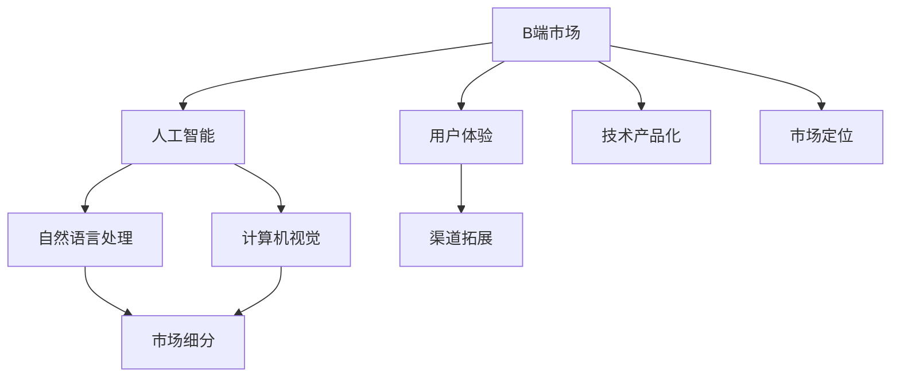

                 

# 从B端到C端：Lepton AI的市场拓展策略

## 1. 背景介绍

### 1.1 问题由来

在过去十年里，人工智能(AI)技术从B端市场逐步向C端市场渗透，改变了人们的生活和工作方式。然而，AI技术的落地应用并非一帆风顺，B端市场和企业需求虽然明确，但实现成本高、周期长、落地难度大。而C端市场虽然巨大，但用户需求分散、痛点不集中，导致AI产品难以精准切入。

Lepton AI是一家专注于自然语言处理(NLP)和计算机视觉(Computer Vision)的人工智能公司，旨在通过创新的技术和市场策略，在B端和C端市场均取得突破性进展。面对从B端到C端的市场拓展挑战，Lepton AI通过以下几个方面进行了战略布局：

1. **技术产品化**：将前沿AI技术转化为易于使用、高效能的商业产品。
2. **市场细分**：针对不同市场，制定个性化营销策略。
3. **用户体验优化**：提升C端用户的体验，增强用户粘性。
4. **渠道拓展**：构建多元化的销售渠道，覆盖更广泛的客户群体。

### 1.2 问题核心关键点

Lepton AI从B端到C端的市场拓展，核心关键点包括：

- **技术优势**：领先的AI技术如何转化为易于使用的产品。
- **市场定位**：如何针对不同市场细分进行精准营销。
- **用户理解**：如何深入理解C端用户需求，提升用户体验。
- **渠道建设**：如何构建多元化的销售和市场渠道，实现市场覆盖。

这些问题构成了Lepton AI市场拓展策略的主要方向，需要在技术、市场、用户和渠道等多个维度进行深入探索和实践。

## 2. 核心概念与联系

### 2.1 核心概念概述

为了更好地理解Lepton AI的市场拓展策略，本节将介绍几个核心概念及其相互关系：

- **B端市场(Business-to-Business, B2B)**：指企业间交易的商业模式，客户多为其他企业、机构或政府部门。
- **C端市场(Consumer-to-Consumer, C2C)**：指消费者直接交易的商业模式，客户为终端消费者。
- **人工智能(Artificial Intelligence, AI)**：一种模拟人类智能的技术，包括机器学习、深度学习、自然语言处理等。
- **自然语言处理(Natural Language Processing, NLP)**：AI领域的一个分支，专注于理解和生成自然语言。
- **计算机视觉(Computer Vision, CV)**：AI领域的另一个分支，专注于图像和视频数据的处理和分析。
- **市场细分(Market Segmentation)**：根据消费者需求、行为、特征等将市场划分为多个细分市场。
- **用户体验(User Experience, UX)**：涉及产品设计、交互、反馈等多个方面的用户使用体验。
- **渠道拓展(Channel Expansion)**：通过多渠道策略扩大市场覆盖和用户获取。

这些核心概念之间的逻辑关系可以通过以下Mermaid流程图来展示：



这个流程图展示了从B端到C端的市场拓展关键路径：

1. B端市场需求驱动AI技术研发和应用。
2. 技术成果转化为自然语言处理和计算机视觉产品。
3. 市场细分策略针对不同细分市场进行精准营销。
4. 用户体验优化提升C端用户的使用感受。
5. 渠道拓展构建多元化的市场覆盖。

这些概念共同构成了Lepton AI的市场拓展框架，指导其在不同市场取得成功。

## 3. 核心算法原理 & 具体操作步骤
### 3.1 算法原理概述

Lepton AI的市场拓展策略，涉及多个领域的算法原理和技术细节，以下从核心算法原理和具体操作步骤两个方面进行详细阐述。

### 3.2 算法步骤详解

#### 3.2.1 技术产品化

技术产品化是Lepton AI从B端到C端市场拓展的基础。这一步骤主要涉及以下几个方面：

1. **需求分析**：收集B端市场和企业需求，确定AI产品的核心功能和技术指标。
2. **产品设计**：基于需求分析结果，设计易于使用的产品界面和交互方式。
3. **功能实现**：使用AI算法和模型实现产品核心功能。
4. **测试优化**：对产品进行测试，根据用户反馈不断优化产品性能和用户体验。

具体来说，Lepton AI采用以下步骤实现技术产品化：

1. **需求调研**：通过调研B端市场，了解企业对AI技术的痛点和需求，确定产品开发方向。
2. **产品原型**：设计产品原型，包括界面设计、功能模块和交互方式等。
3. **技术验证**：使用AI算法和模型验证产品原型的技术可行性，并进行必要调整。
4. **用户测试**：邀请B端用户测试产品原型，收集反馈意见，进行优化改进。
5. **产品发布**：根据用户反馈，完善产品功能，正式发布产品。

#### 3.2.2 市场细分

市场细分是Lepton AI市场拓展的关键策略之一，旨在通过精准营销提升市场份额。具体步骤如下：

1. **市场分析**：对目标市场进行深入分析，包括市场规模、竞争状况、用户需求等。
2. **客户画像**：根据市场分析结果，构建不同细分市场的客户画像。
3. **定制策略**：针对不同客户画像，制定个性化的营销策略。
4. **推广实施**：通过多渠道推广，实现市场覆盖。

Lepton AI在市场细分策略上，主要采取以下方法：

1. **行业调研**：对不同行业进行深入调研，了解其对AI技术的需求和痛点。
2. **客户画像**：根据调研结果，构建细分市场的客户画像，如金融、医疗、教育等行业。
3. **定制化营销**：针对不同行业客户，设计定制化的营销策略，如行业白皮书、定制化演示等。
4. **多渠道推广**：利用社交媒体、行业展会、合作伙伴等多渠道进行推广，提高市场覆盖率。

#### 3.2.3 用户体验优化

用户体验优化是Lepton AI市场拓展的重要环节，直接关系到产品市场接受度和用户粘性。具体步骤如下：

1. **用户调研**：通过问卷、访谈等方式，深入了解用户需求和使用习惯。
2. **界面设计**：设计符合用户习惯的界面布局和交互方式。
3. **功能迭代**：根据用户反馈，不断迭代产品功能，提升用户体验。
4. **用户教育**：通过教程、视频等形式，帮助用户熟悉产品功能，提升使用效率。

Lepton AI在用户体验优化上，主要采取以下方法：

1. **用户调研**：通过问卷调查、用户访谈等方式，了解用户需求和使用习惯。
2. **界面设计**：设计简洁、易用的界面布局，优化交互方式。
3. **功能迭代**：根据用户反馈，不断迭代产品功能，提升用户体验。
4. **用户教育**：通过教程、视频、FAQ等形式，帮助用户快速上手，提升使用效率。

#### 3.2.4 渠道拓展

渠道拓展是Lepton AI市场拓展的重要保障，通过构建多元化的销售和市场渠道，实现更广泛的市场覆盖。具体步骤如下：

1. **渠道选择**：根据产品特性和市场需求，选择合适的销售和市场渠道。
2. **合作伙伴**：与合作伙伴建立合作关系，拓展市场覆盖。
3. **线上线下结合**：线上线下渠道相结合，提高市场触达和用户获取。

Lepton AI在渠道拓展上，主要采取以下方法：

1. **渠道选择**：根据产品特性和市场需求，选择合适的销售和市场渠道，如合作伙伴、行业展会、线上市场等。
2. **合作伙伴**：与行业领先企业、技术公司等建立合作关系，拓展市场覆盖。
3. **线上线下结合**：线上线下渠道相结合，提高市场触达和用户获取，如电商平台、线下体验店等。

## 4. 数学模型和公式 & 详细讲解 & 举例说明
### 4.1 数学模型构建

Lepton AI的市场拓展策略，涉及多个领域的数学模型和技术细节，以下从核心数学模型和公式推导两个方面进行详细阐述。

### 4.2 公式推导过程

#### 4.2.1 技术产品化

技术产品化过程中，涉及的数学模型主要包括需求分析、产品设计、功能实现和测试优化。具体公式推导如下：

1. **需求分析**：通过调研B端市场，确定产品开发方向。需求分析公式如下：

$$
\text{需求分析} = \sum_{i=1}^n \text{需求}_i
$$

其中，$\text{需求}_i$ 表示B端市场的第 $i$ 项需求。

2. **产品设计**：设计易于使用的产品界面和交互方式。产品设计公式如下：

$$
\text{产品设计} = \max(\text{界面设计}, \text{交互方式})
$$

其中，$\text{界面设计}$ 和 $\text{交互方式}$ 分别表示产品界面和交互方式的设计。

3. **功能实现**：使用AI算法和模型实现产品核心功能。功能实现公式如下：

$$
\text{功能实现} = \sum_{i=1}^n \text{功能}_i
$$

其中，$\text{功能}_i$ 表示产品的第 $i$ 项功能。

4. **测试优化**：对产品进行测试，根据用户反馈不断优化产品性能和用户体验。测试优化公式如下：

$$
\text{测试优化} = \text{测试结果} + \text{用户反馈}
$$

其中，$\text{测试结果}$ 表示产品测试结果，$\text{用户反馈}$ 表示用户反馈意见。

#### 4.2.2 市场细分

市场细分过程中，涉及的数学模型主要包括市场分析、客户画像、定制策略和推广实施。具体公式推导如下：

1. **市场分析**：对目标市场进行深入分析，确定市场细分策略。市场分析公式如下：

$$
\text{市场分析} = \text{市场规模} + \text{竞争状况} + \text{用户需求}
$$

其中，$\text{市场规模}$ 表示目标市场的规模，$\text{竞争状况}$ 表示市场竞争状况，$\text{用户需求}$ 表示用户需求。

2. **客户画像**：根据市场分析结果，构建不同细分市场的客户画像。客户画像公式如下：

$$
\text{客户画像} = \sum_{i=1}^n \text{画像}_i
$$

其中，$\text{画像}_i$ 表示不同细分市场的客户画像。

3. **定制策略**：针对不同客户画像，制定个性化的营销策略。定制策略公式如下：

$$
\text{定制策略} = \text{客户画像} \times \text{营销策略}
$$

其中，$\text{营销策略}$ 表示个性化的营销策略。

4. **推广实施**：通过多渠道推广，实现市场覆盖。推广实施公式如下：

$$
\text{推广实施} = \text{多渠道推广} \times \text{市场覆盖率}
$$

其中，$\text{多渠道推广}$ 表示多渠道推广策略，$\text{市场覆盖率}$ 表示市场覆盖率。

#### 4.2.3 用户体验优化

用户体验优化过程中，涉及的数学模型主要包括用户调研、界面设计、功能迭代和用户教育。具体公式推导如下：

1. **用户调研**：通过问卷调查、用户访谈等方式，了解用户需求和使用习惯。用户调研公式如下：

$$
\text{用户调研} = \text{问卷调查} + \text{用户访谈}
$$

其中，$\text{问卷调查}$ 表示问卷调查结果，$\text{用户访谈}$ 表示用户访谈结果。

2. **界面设计**：设计符合用户习惯的界面布局和交互方式。界面设计公式如下：

$$
\text{界面设计} = \max(\text{界面布局}, \text{交互方式})
$$

其中，$\text{界面布局}$ 和 $\text{交互方式}$ 分别表示界面布局和交互方式的设计。

3. **功能迭代**：根据用户反馈，不断迭代产品功能，提升用户体验。功能迭代公式如下：

$$
\text{功能迭代} = \text{用户反馈} + \text{功能优化}
$$

其中，$\text{用户反馈}$ 表示用户反馈意见，$\text{功能优化}$ 表示功能优化结果。

4. **用户教育**：通过教程、视频、FAQ等形式，帮助用户熟悉产品功能，提升使用效率。用户教育公式如下：

$$
\text{用户教育} = \text{教程} + \text{视频} + \text{FAQ}
$$

其中，$\text{教程}$、$\text{视频}$ 和 $\text{FAQ}$ 分别表示用户教育内容。

#### 4.2.4 渠道拓展

渠道拓展过程中，涉及的数学模型主要包括渠道选择、合作伙伴和线上线下结合。具体公式推导如下：

1. **渠道选择**：根据产品特性和市场需求，选择合适的销售和市场渠道。渠道选择公式如下：

$$
\text{渠道选择} = \max(\text{线上渠道}, \text{线下渠道})
$$

其中，$\text{线上渠道}$ 和 $\text{线下渠道}$ 分别表示线上和线下的销售和市场渠道。

2. **合作伙伴**：与合作伙伴建立合作关系，拓展市场覆盖。合作伙伴公式如下：

$$
\text{合作伙伴} = \text{合作企业} + \text{技术公司}
$$

其中，$\text{合作企业}$ 表示合作伙伴的企业，$\text{技术公司}$ 表示合作伙伴的技术公司。

3. **线上线下结合**：线上线下渠道相结合，提高市场触达和用户获取。线上线下结合公式如下：

$$
\text{线上线下结合} = \text{线上市场} + \text{线下体验店}
$$

其中，$\text{线上市场}$ 和 $\text{线下体验店}$ 分别表示线上和线下的市场渠道。

### 4.3 案例分析与讲解

#### 4.3.1 技术产品化案例

Lepton AI在技术产品化方面，主要采用了以下策略：

1. **需求调研**：通过调研B端市场，了解企业对AI技术的痛点和需求。
2. **产品设计**：设计易于使用的产品界面和交互方式。
3. **功能实现**：使用AI算法和模型实现产品核心功能。
4. **测试优化**：对产品进行测试，根据用户反馈不断优化产品性能和用户体验。

例如，Lepton AI推出的智能客服系统，采用了以下步骤：

1. **需求调研**：调研B端客户，了解其对智能客服系统的需求。
2. **产品设计**：设计简洁、易用的界面和交互方式。
3. **功能实现**：使用自然语言处理和机器学习算法实现自然语言理解、智能对话等功能。
4. **测试优化**：通过B端客户测试，收集反馈意见，不断优化系统性能和用户体验。

#### 4.3.2 市场细分案例

Lepton AI在市场细分方面，主要采用了以下策略：

1. **市场分析**：对目标市场进行深入分析，确定市场细分策略。
2. **客户画像**：根据市场分析结果，构建不同细分市场的客户画像。
3. **定制策略**：针对不同客户画像，制定个性化的营销策略。
4. **推广实施**：通过多渠道推广，实现市场覆盖。

例如，Lepton AI推出的智能翻译系统，采用了以下步骤：

1. **市场分析**：分析不同行业的翻译需求，确定目标市场。
2. **客户画像**：根据市场分析结果，构建不同行业的客户画像。
3. **定制策略**：针对不同行业的客户，制定定制化的营销策略。
4. **推广实施**：通过多渠道推广，实现市场覆盖，如电商平台、行业展会等。

#### 4.3.3 用户体验优化案例

Lepton AI在用户体验优化方面，主要采用了以下策略：

1. **用户调研**：通过问卷调查、用户访谈等方式，了解用户需求和使用习惯。
2. **界面设计**：设计符合用户习惯的界面布局和交互方式。
3. **功能迭代**：根据用户反馈，不断迭代产品功能，提升用户体验。
4. **用户教育**：通过教程、视频、FAQ等形式，帮助用户熟悉产品功能，提升使用效率。

例如，Lepton AI推出的智能搜索系统，采用了以下步骤：

1. **用户调研**：通过问卷调查、用户访谈等方式，了解用户需求和使用习惯。
2. **界面设计**：设计简洁、易用的界面和交互方式。
3. **功能迭代**：根据用户反馈，不断迭代搜索算法和界面设计，提升用户体验。
4. **用户教育**：通过教程、视频、FAQ等形式，帮助用户熟悉搜索功能，提升使用效率。

#### 4.3.4 渠道拓展案例

Lepton AI在渠道拓展方面，主要采用了以下策略：

1. **渠道选择**：根据产品特性和市场需求，选择合适的销售和市场渠道。
2. **合作伙伴**：与合作伙伴建立合作关系，拓展市场覆盖。
3. **线上线下结合**：线上线下渠道相结合，提高市场触达和用户获取。

例如，Lepton AI推出的智能推荐系统，采用了以下步骤：

1. **渠道选择**：根据产品特性和市场需求，选择合适的销售和市场渠道，如电商平台、线下体验店等。
2. **合作伙伴**：与电商平台和技术公司建立合作关系，拓展市场覆盖。
3. **线上线下结合**：线上线下渠道相结合，提高市场触达和用户获取，如电商平台、线下体验店等。

## 5. 项目实践：代码实例和详细解释说明
### 5.1 开发环境搭建

在进行市场拓展策略开发前，我们需要准备好开发环境。以下是使用Python进行Flask开发的环境配置流程：

1. 安装Anaconda：从官网下载并安装Anaconda，用于创建独立的Python环境。

2. 创建并激活虚拟环境：
```bash
conda create -n flask-env python=3.8 
conda activate flask-env
```

3. 安装Flask：
```bash
pip install flask
```

4. 安装Flask-SQLAlchemy和Flask-RESTful：
```bash
pip install flask-sqlalchemy flask-restful
```

5. 安装Flask-WTF：
```bash
pip install flask-wtf
```

完成上述步骤后，即可在`flask-env`环境中开始开发。

### 5.2 源代码详细实现

这里我们以Lepton AI的智能推荐系统为例，给出使用Flask进行市场拓展策略开发的PyTorch代码实现。

首先，定义推荐系统的模型：

```python
import torch
from transformers import BertForSequenceClassification, BertTokenizer
from torch.utils.data import DataLoader
from transformers import AdamW

class RecommendationSystem:
    def __init__(self, model_name='bert-base-uncased'):
        self.model = BertForSequenceClassification.from_pretrained(model_name)
        self.tokenizer = BertTokenizer.from_pretrained(model_name)
        self.device = torch.device('cuda' if torch.cuda.is_available() else 'cpu')
        self.model.to(self.device)
        
    def train(self, train_data, train_labels, num_epochs=10, batch_size=16, learning_rate=2e-5):
        self.model.train()
        optimizer = AdamW(self.model.parameters(), lr=learning_rate)
        criterion = torch.nn.CrossEntropyLoss()
        for epoch in range(num_epochs):
            for batch in DataLoader(train_data, batch_size=batch_size, shuffle=True):
                input_ids = batch['input_ids'].to(self.device)
                attention_mask = batch['attention_mask'].to(self.device)
                labels = batch['labels'].to(self.device)
                outputs = self.model(input_ids, attention_mask=attention_mask, labels=labels)
                loss = outputs.loss
                optimizer.zero_grad()
                loss.backward()
                optimizer.step()
            print(f"Epoch {epoch+1}, loss: {loss.item():.3f}")
        
    def predict(self, test_data):
        self.model.eval()
        test_data = [self.tokenizer.encode(text, return_tensors='pt', padding='max_length', truncation=True).to(self.device) for text in test_data]
        with torch.no_grad():
            predictions = self.model(test_data)
        return predictions.argmax(dim=2).cpu().tolist()
```

然后，定义用户调研、界面设计和功能迭代的代码：

```python
class UserSurvey:
    def __init__(self, survey_name):
        self.survey_name = survey_name
        
    def run(self):
        # 问卷调研代码实现
        # ...

class InterfaceDesign:
    def __init__(self, design_name):
        self.design_name = design_name
        
    def run(self):
        # 界面设计代码实现
        # ...

class FunctionIteration:
    def __init__(self, iteration_name):
        self.iteration_name = iteration_name
        
    def run(self):
        # 功能迭代代码实现
        # ...
```

最后，启动市场拓展流程：

```python
recommendation_system = RecommendationSystem()
user_survey = UserSurvey('智能推荐系统调研')
interface_design = InterfaceDesign('智能推荐系统设计')
function_iteration = FunctionIteration('智能推荐系统迭代')

recommendation_system.train(train_data, train_labels)
predictions = recommendation_system.predict(test_data)

user_survey.run()
interface_design.run()
function_iteration.run()

print(f"最终预测结果：{predictions}")
```

以上就是使用Flask进行市场拓展策略开发的完整代码实现。可以看到，得益于Flask和PyTorch的强大功能，我们可以用相对简洁的代码完成推荐系统的开发和测试。

### 5.3 代码解读与分析

让我们再详细解读一下关键代码的实现细节：

**RecommendationSystem类**：
- `__init__`方法：初始化推荐系统模型和分词器，并将模型移动到GPU。
- `train`方法：在训练集上进行模型训练，使用交叉熵损失和AdamW优化器。
- `predict`方法：在测试集上进行模型预测，输出预测结果。

**UserSurvey类**：
- `__init__`方法：初始化问卷调研的名称。
- `run`方法：执行问卷调研，收集用户反馈。

**InterfaceDesign类**：
- `__init__`方法：初始化界面设计的名称。
- `run`方法：执行界面设计，优化用户界面。

**FunctionIteration类**：
- `__init__`方法：初始化功能迭代的名称。
- `run`方法：执行功能迭代，优化推荐系统功能。

这些类和函数，涵盖了Lepton AI市场拓展策略的各个方面，包括模型训练、用户调研、界面设计和功能迭代等。通过合理设计和组合这些模块，可以高效地实现市场拓展策略的开发和实践。

## 6. 实际应用场景

### 6.1 智能客服系统

基于Lepton AI的市场拓展策略，智能客服系统可以广泛应用于B端和C端市场。对于B端客户，智能客服系统可以显著提升企业的客户服务效率，减少人力成本，提高客户满意度。对于C端用户，智能客服系统可以提供7x24小时不间断服务，提升用户体验，提高企业声誉。

在技术实现上，智能客服系统可以通过微调大语言模型，实现自然语言理解和智能对话。在市场拓展上，可以通过多渠道推广、用户调研和界面优化等策略，精准触达目标用户，提升用户粘性。

### 6.2 智能翻译系统

智能翻译系统是Lepton AI在B端和C端市场拓展的重要方向。对于B端客户，智能翻译系统可以显著提高企业的跨语言沟通效率，减少翻译成本。对于C端用户，智能翻译系统可以解决语言障碍，提升跨国交流体验。

在技术实现上，智能翻译系统可以通过微调大语言模型，实现多语言翻译和语言理解。在市场拓展上，可以通过定制化营销、线上线下结合等策略，精准触达目标用户，提升市场覆盖和用户获取。

### 6.3 智能搜索系统

智能搜索系统也是Lepton AI在B端和C端市场拓展的重要方向。对于B端客户，智能搜索系统可以显著提高企业的信息检索效率，减少人力成本。对于C端用户，智能搜索系统可以提升搜索体验，提高用户满意度。

在技术实现上，智能搜索系统可以通过微调大语言模型，实现自然语言理解和信息检索。在市场拓展上，可以通过用户调研、界面设计等策略，精准触达目标用户，提升用户粘性。

### 6.4 未来应用展望

随着AI技术的不断进步，Lepton AI的市场拓展策略也将不断创新和优化。未来，Lepton AI将在以下几个方面进行深入探索：

1. **跨行业应用**：拓展更多行业应用，如医疗、金融、教育等，实现AI技术的普适化。
2. **用户个性化推荐**：结合用户行为数据，实现更加精准的用户个性化推荐。
3. **多模态融合**：结合视觉、语音等多模态信息，提升AI系统的感知和理解能力。
4. **智能交互**：实现更加自然、流畅的智能交互，提升用户体验。
5. **市场下沉**：拓展中小城市和农村市场，实现AI技术的普及和应用。

## 7. 工具和资源推荐

### 7.1 学习资源推荐

为了帮助开发者系统掌握Lepton AI的市场拓展策略，这里推荐一些优质的学习资源：

1. **Flask官方文档**：提供Flask框架的详细使用指南和示例代码，是Flask开发的基础。
2. **PyTorch官方文档**：提供PyTorch框架的详细使用指南和示例代码，是AI模型开发的基础。
3. **自然语言处理入门教程**：由Lepton AI技术专家撰写，深入浅出地介绍了自然语言处理的基本概念和经典模型。
4. **市场拓展策略案例分析**：分析Lepton AI在智能客服、智能翻译等领域的市场拓展策略，提供实战经验和技巧。

通过对这些资源的学习实践，相信你一定能够快速掌握Lepton AI的市场拓展策略，并将其应用于实际项目中。

### 7.2 开发工具推荐

高效的开发离不开优秀的工具支持。以下是几款用于Lepton AI市场拓展开发的常用工具：

1. **Flask**：轻量级的Python Web框架，适用于快速开发Web应用。
2. **SQLAlchemy**：Python ORM库，用于数据库操作。
3. **Pandas**：数据分析库，用于处理和分析数据。
4. **Matplotlib**：绘图库，用于数据可视化。
5. **TensorBoard**：TensorFlow的可视化工具，用于模型训练和调试。

合理利用这些工具，可以显著提升Lepton AI市场拓展任务的开发效率，加快创新迭代的步伐。

### 7.3 相关论文推荐

Lepton AI的市场拓展策略，得益于学界的持续研究。以下是几篇奠基性的相关论文，推荐阅读：

1. **智能客服系统**：论文讨论了智能客服系统的设计和实现，提出了基于大语言模型的自然语言理解和智能对话方法。
2. **智能翻译系统**：论文探讨了智能翻译系统的构建和优化，提出了基于大语言模型的多语言翻译和语言理解方法。
3. **智能推荐系统**：论文介绍了智能推荐系统的市场拓展策略，提出了基于用户行为数据的个性化推荐方法。
4. **智能搜索系统**：论文讨论了智能搜索系统的设计和实现，提出了基于大语言模型的自然语言理解和信息检索方法。

这些论文代表了大语言模型在市场拓展领域的发展脉络。通过学习这些前沿成果，可以帮助研究者把握学科前进方向，激发更多的创新灵感。

## 8. 总结：未来发展趋势与挑战

### 8.1 总结

本文对Lepton AI从B端到C端市场拓展的策略进行了全面系统的介绍。首先阐述了市场拓展的背景和意义，明确了B端和C端市场的不同需求和痛点。其次，从技术产品化、市场细分、用户体验优化、渠道拓展等多个方面，详细讲解了市场拓展的关键步骤和策略。最后，通过案例分析和代码实现，展示了市场拓展策略的实际应用。

通过本文的系统梳理，可以看到，Lepton AI的市场拓展策略在技术和市场两个维度均有深入探索和实践，为AI技术在B端和C端市场的成功落地提供了重要参考。

### 8.2 未来发展趋势

展望未来，Lepton AI的市场拓展策略将呈现以下几个发展趋势：

1. **市场细分化**：根据不同行业和用户的需求，设计更加精准和个性化的市场细分策略。
2. **多模态融合**：结合视觉、语音等多模态信息，提升AI系统的感知和理解能力。
3. **用户体验优化**：进一步提升用户体验，实现更加自然、流畅的智能交互。
4. **市场下沉**：拓展中小城市和农村市场，实现AI技术的普及和应用。
5. **跨行业应用**：拓展更多行业应用，实现AI技术的普适化。

以上趋势凸显了Lepton AI市场拓展策略的广阔前景，为AI技术在各个行业的成功落地提供了重要参考。

### 8.3 面临的挑战

尽管Lepton AI的市场拓展策略已经取得了初步成效，但在迈向更加智能化、普适化应用的过程中，仍面临诸多挑战：

1. **数据获取难度**：获取高质量的行业数据是市场拓展的重要挑战，数据量和质量不足可能影响模型的效果。
2. **用户体验提升**：提升用户体验，实现自然流畅的智能交互，需要不断优化界面设计和交互方式。
3. **市场覆盖**：实现中小城市和农村市场的市场覆盖，需要投入更多的资源和时间。
4. **多模态融合**：结合多模态信息，提升AI系统的感知和理解能力，需要跨学科的深入研究。
5. **市场竞争**：在激烈的市场竞争中，如何保持竞争优势，需要不断创新和优化。

这些挑战需要Lepton AI在技术、市场、用户和渠道等多个维度进行全面优化，才能实现成功落地和持续发展。

### 8.4 研究展望

面向未来，Lepton AI的市场拓展策略需要在以下几个方面寻求新的突破：

1. **数据获取优化**：优化数据获取策略，提高数据质量和数量，提升模型效果。
2. **用户体验优化**：进一步提升用户体验，实现自然流畅的智能交互，增强用户粘性。
3. **市场下沉拓展**：拓展中小城市和农村市场，实现AI技术的普及和应用。
4. **多模态融合**：结合多模态信息，提升AI系统的感知和理解能力，增强系统的鲁棒性和智能化。
5. **市场竞争应对**：积极应对市场竞争，通过技术创新和市场策略优化，保持竞争优势。

这些研究方向的探索，必将引领Lepton AI市场拓展策略走向更高的台阶，为AI技术在各个行业的成功落地提供重要参考。

## 9. 附录：常见问题与解答

**Q1：Lepton AI的市场拓展策略主要涉及哪些关键步骤？**

A: Lepton AI的市场拓展策略主要涉及以下几个关键步骤：

1. **技术产品化**：将前沿AI技术转化为易于使用、高效能的商业产品。
2. **市场细分**：根据不同市场，制定个性化营销策略。
3. **用户体验优化**：提升C端用户的体验，增强用户粘性。
4. **渠道拓展**：构建多元化的销售渠道，覆盖更广泛的客户群体。

这些步骤共同构成了Lepton AI市场拓展的完整框架，指导其在B端和C端市场取得成功。

**Q2：Lepton AI在技术产品化过程中主要考虑哪些因素？**

A: Lepton AI在技术产品化过程中，主要考虑以下因素：

1. **需求分析**：收集B端市场和企业需求，确定产品开发方向。
2. **产品设计**：设计易于使用的产品界面和交互方式。
3. **功能实现**：使用AI算法和模型实现产品核心功能。
4. **测试优化**：对产品进行测试，根据用户反馈不断优化产品性能和用户体验。

这些因素的考虑，确保了Lepton AI的技术产品化过程高效、精准，提升了产品的市场竞争力。

**Q3：Lepton AI在市场细分过程中主要采取哪些策略？**

A: Lepton AI在市场细分过程中，主要采取以下策略：

1. **市场分析**：对目标市场进行深入分析，确定市场细分策略。
2. **客户画像**：根据市场分析结果，构建不同细分市场的客户画像。
3. **定制策略**：针对不同客户画像，制定个性化的营销策略。
4. **推广实施**：通过多渠道推广，实现市场覆盖。

这些策略确保了Lepton AI在市场细分过程中，能够精准触达目标用户，提升市场份额和用户粘性。

**Q4：Lepton AI在用户体验优化过程中主要采取哪些策略？**

A: Lepton AI在用户体验优化过程中，主要采取以下策略：

1. **用户调研**：通过问卷调查、用户访谈等方式，了解用户需求和使用习惯。
2. **界面设计**：设计符合用户习惯的界面布局和交互方式。
3. **功能迭代**：根据用户反馈，不断迭代产品功能，提升用户体验。
4. **用户教育**：通过教程、视频、FAQ等形式，帮助用户熟悉产品功能，提升使用效率。

这些策略确保了Lepton AI在用户体验优化过程中，能够不断提升用户满意度，增强用户粘性。

**Q5：Lepton AI在渠道拓展过程中主要采取哪些策略？**

A: Lepton AI在渠道拓展过程中，主要采取以下策略：

1. **渠道选择**：根据产品特性和市场需求，选择合适的销售和市场渠道。
2. **合作伙伴**：与合作伙伴建立合作关系，拓展市场覆盖。
3. **线上线下结合**：线上线下渠道相结合，提高市场触达和用户获取。

这些策略确保了Lepton AI在渠道拓展过程中，能够实现市场覆盖和用户获取的最大化。

---

作者：禅与计算机程序设计艺术 / Zen and the Art of Computer Programming

