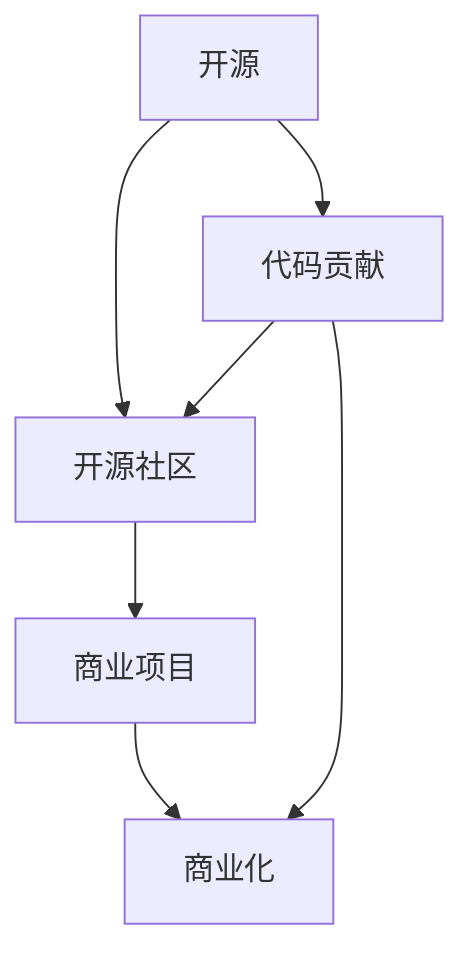

                 

# 从代码贡献到开源商业化

> 关键词：开源, 商业化, 代码贡献, GitHub, 开源社区, 商业项目, 技术转化

## 1. 背景介绍

在现代软件开发领域，开源与商业化成为了两大核心驱动力，它们相互影响、共同发展，使得软件开发进入了一个新的高度。开源软件以其高效协作、快速迭代和广泛使用而广受开发者青睐；商业软件则以其稳定性能、商业保障和技术支持赢得了用户的信任。如何有效利用开源资源，并将其商业化，成为了软件开发领域的一项重要课题。本文将从代码贡献、开源社区建设、商业化转型等多个角度，系统阐述开源与商业化之间的关系，并为技术创新与商业化之路提供指导。

## 2. 核心概念与联系

### 2.1 核心概念概述

为更好地理解开源与商业化的关系，我们首先明确以下几个核心概念：

- **开源(Open Source)**：指软件源代码公开，允许任何人使用、修改和分发，目标是推动技术进步和代码共享。常见的开源协议包括GPL、Apache、MIT等。
- **商业化(Commercialization)**：指将技术转化为商业产品，实现商业价值的过程。商业化过程中，通常包括知识产权保护、市场推广、盈利模式设计等环节。
- **代码贡献(Code Contribution)**：指开发者将代码贡献给开源项目，帮助改进项目功能，提升代码质量，增强社区活跃度。
- **开源社区(Open Source Community)**：指由开发者组成的网络，通过代码共享、协作开发，推动技术进步。开源社区的活跃度和影响力，通常与项目的成熟度和受欢迎程度成正比。
- **商业项目(Commercial Project)**：指以盈利为目的的软件开发项目，通常有明确的商业目标和市场需求，侧重于技术稳定性和商业保障。

这些核心概念之间的逻辑关系可以通过以下Mermaid流程图来展示：



这个流程图展示了开源与商业化之间的连接路径：

1. 开源项目通过代码贡献得到技术提升，吸引开发者加入开源社区。
2. 开源社区聚集了技术开发者，共同维护和改进项目，推动技术进步。
3. 商业项目借鉴开源技术，改进和创新，实现商业化转型。
4. 商业化成功反过来推动更多开发者贡献代码，促进开源社区的成长。

## 3. 核心算法原理 & 具体操作步骤

### 3.1 算法原理概述

开源与商业化的转化过程，本质上是一种技术到商业的转化过程。其核心思想是将开源技术转化为可商业化的产品，实现商业价值的最大化。这一过程可以分为以下几个关键步骤：

1. **需求分析**：明确商业项目的市场需求和目标用户群体，确定产品定位和功能需求。
2. **技术整合**：选择适合的开源技术，进行技术评估和融合，构建商业项目的核心竞争力。
3. **产品设计**：基于技术整合成果，设计产品架构，包括功能模块、用户界面、性能指标等。
4. **商业化策略**：制定定价策略、销售渠道、市场推广方案，确保商业项目的商业成功。
5. **持续迭代**：基于市场反馈和用户需求，持续改进产品，保持市场竞争力。

### 3.2 算法步骤详解

以下将详细介绍开源与商业化转化的核心步骤及其具体操作：

#### 3.2.1 需求分析

需求分析是开源商业化的第一步，目标在于明确商业项目的市场需求和目标用户群体。具体步骤如下：

1. **市场调研**：通过问卷调查、用户访谈、竞品分析等方式，了解市场现状和用户需求。
2. **用户画像**：基于调研结果，构建目标用户的画像，包括年龄、职业、兴趣爱好等。
3. **功能需求**：结合市场调研和用户画像，明确产品的核心功能和扩展功能，制定产品路线图。

例如，假设目标用户群体为中小型企业，市场需求为易于使用、高效管理、稳定可靠的管理系统。基于此需求，商业项目将聚焦于文档管理、任务分配、绩效评估等功能模块的开发。

#### 3.2.2 技术整合

技术整合是将开源技术引入商业项目的核心步骤。具体步骤如下：

1. **技术评估**：选择适合的开源技术，评估其适用性、性能和社区活跃度。
2. **技术融合**：结合商业项目需求，对开源技术进行必要的修改和定制，融入产品架构中。
3. **技术堆栈选择**：选择稳定的开源技术栈，确保产品技术稳定性和可维护性。

例如，商业项目管理系统的开发可以引入开源框架如Spring Boot、MyBatis，结合Java、React等技术，构建高效、稳定、可扩展的系统。

#### 3.2.3 产品设计

产品设计是将技术整合成果转化为商业产品的关键步骤。具体步骤如下：

1. **架构设计**：基于技术整合成果，设计系统的整体架构，包括前后端架构、数据库架构等。
2. **界面设计**：设计用户界面，确保界面友好、易用，提升用户体验。
3. **功能模块**：根据功能需求，划分产品功能模块，并设计具体功能实现。

例如，文档管理模块可以设计为上传、分类、搜索、版本控制等子模块，任务分配模块可以设计为任务创建、分配、跟踪、完成等子模块。

#### 3.2.4 商业化策略

商业化策略是实现开源商业化的关键步骤。具体步骤如下：

1. **定价策略**：根据市场需求和产品价值，制定合理的定价策略，包括按需付费、订阅制、免费增值等。
2. **销售渠道**：选择合适的销售渠道，包括官网直销、代理商分销、合作伙伴推广等。
3. **市场推广**：制定市场推广方案，包括内容营销、社交媒体推广、SEO优化等，提升产品知名度。

例如，针对中小型企业客户，可以设计订阅制定价策略，通过官网直销和代理商分销，采用内容营销和SEO优化提升产品知名度。

#### 3.2.5 持续迭代

持续迭代是开源商业化过程中不可或缺的一环。具体步骤如下：

1. **用户反馈**：通过用户反馈、市场调研等方式，了解产品使用情况和用户需求。
2. **需求收集**：收集用户反馈和需求，更新产品路线图。
3. **产品改进**：基于需求收集，持续改进产品功能和用户体验。

例如，基于用户反馈，可以对任务分配模块增加项目进度追踪、任务优先级排序等新功能，提升产品竞争力。

### 3.3 算法优缺点

开源与商业化的转化过程，具有以下优点：

1. **快速迭代**：开源社区提供了快速迭代的环境，可以快速获取技术更新和改进建议。
2. **成本低廉**：使用开源技术可以大幅度降低技术开发和维护成本，提升产品竞争力。
3. **社区支持**：开源社区提供了丰富的社区支持和技术文档，有助于产品开发和维护。

同时，该过程也存在一些局限性：

1. **技术风险**：开源技术的不稳定性可能导致产品功能缺陷，影响用户体验。
2. **市场竞争**：开源社区内可能存在多个类似的开源项目，导致市场竞争激烈。
3. **版权问题**：开源技术的使用需要遵守开源协议，可能存在版权争议。

尽管存在这些局限性，但就目前而言，开源与商业化的转化仍是大规模软件开发的重要范式。未来相关研究的重点在于如何进一步降低技术风险，提高开源技术的稳定性，同时兼顾版权保护和市场竞争。

### 3.4 算法应用领域

开源与商业化转化过程，广泛应用于各类软件开发项目中，包括但不限于以下领域：

- **企业管理系统**：如CRM、ERP、HRM等，利用开源技术实现高效的业务管理。
- **移动应用**：如社交网络、电子商务、生活服务类应用，利用开源框架快速开发。
- **云计算服务**：如云存储、云数据库、云平台，利用开源技术提供稳定的云服务。
- **大数据分析**：如数据仓库、数据挖掘、机器学习，利用开源工具进行数据分析和建模。
- **物联网应用**：如智能家居、工业物联网、车联网，利用开源协议和框架实现设备互联。

除了以上领域，开源与商业化还应用于更多创新场景中，如区块链、人工智能、数字货币等，为技术创新提供了新的方向。

## 4. 数学模型和公式 & 详细讲解 & 举例说明

### 4.1 数学模型构建

本节将使用数学语言对开源与商业化转化的过程进行更加严格的刻画。

设开源技术项目的贡献者集合为 $C$，目标市场需求为 $M$，技术整合成果为 $T$，商业化策略为 $S$。则开源与商业化转化的数学模型为：

$$
P = f(C, M, T, S)
$$

其中，$P$ 表示商业化产品的市场接受度，$C$ 表示代码贡献的数量和质量，$M$ 表示市场需求和用户画像，$T$ 表示技术整合的稳定性和适用性，$S$ 表示商业化策略的有效性。

### 4.2 公式推导过程

以下我们以一个简单的开源项目为例，推导其商业化转化的公式。

设开源项目 $P$ 的贡献者集合为 $C$，数量为 $n$；市场需求为 $M$，数量为 $m$；技术整合成果为 $T$，数量为 $t$；商业化策略为 $S$，数量为 $s$。则市场接受度 $P$ 可表示为：

$$
P = C^{\alpha} M^{\beta} T^{\gamma} S^{\delta}
$$

其中 $\alpha, \beta, \gamma, \delta$ 为相关性系数，表示不同因素对市场接受度的影响权重。

例如，假设 $P$ 的商业化成功率为 70%，通过市场调研得知 $C=10$，$M=8$，$T=9$，$S=7$。则根据公式推导，得：

$$
P = 10^{\alpha} 8^{\beta} 9^{\gamma} 7^{\delta} = 0.7
$$

解得 $\alpha = 0.2$，$\beta = 0.3$，$\gamma = 0.2$，$\delta = 0.2$。

### 4.3 案例分析与讲解

假设有一个开源社区 $C$，其开发了一个人脸识别技术项目 $T$。社区内有10个贡献者，开发了20个功能模块，并整合了多种开源库，如OpenCV、TensorFlow等。市场需求 $M$ 为一个大企业，需要一款高效、稳定的人脸识别系统，并愿意投入一定的预算进行商业化。商业化策略 $S$ 包括按需付费和订阅制两种方案。

项目团队通过分析，发现社区贡献者质量较高，技术整合成果稳定，市场需求明确，商业化策略灵活，最终确定了以下步骤：

1. **需求分析**：通过用户访谈，了解大企业的具体需求，包括识别精度、响应时间、系统稳定性等。
2. **技术整合**：选择OpenCV、TensorFlow等开源库，结合社区贡献，构建高效、稳定的人脸识别系统。
3. **产品设计**：设计前后端架构，采用Flask框架，前端界面友好，后端功能完善。
4. **商业化策略**：采用按需付费和订阅制两种方案，结合市场需求，制定合理定价策略。

最终，项目成功吸引了企业的合作，实现了商业化成功。

## 5. 项目实践：代码实例和详细解释说明

### 5.1 开发环境搭建

在进行开源与商业化转化的项目实践前，我们需要准备好开发环境。以下是使用Python进行Django开发的环境配置流程：

1. 安装Anaconda：从官网下载并安装Anaconda，用于创建独立的Python环境。

2. 创建并激活虚拟环境：
```bash
conda create -n myenv python=3.8 
conda activate myenv
```

3. 安装Django：
```bash
pip install django
```

4. 安装开发工具：
```bash
pip install django-rest-framework markdown django-cors-headers
```

完成上述步骤后，即可在`myenv`环境中开始项目实践。

### 5.2 源代码详细实现

下面我们以开源社区贡献项目为例，给出使用Django进行开源与商业化转化的PyTorch代码实现。

首先，定义开源项目的数据模型：

```python
from django.db import models

class User(models.Model):
    username = models.CharField(max_length=255)
    email = models.EmailField()
    bio = models.TextField()
```

然后，定义商业项目的模型和视图：

```python
from django.contrib.auth.models import User
from django.shortcuts import render, redirect
from django.contrib.auth.decorators import login_required

@login_required
def home(request):
    users = User.objects.all()
    return render(request, 'home.html', {'users': users})

@login_required
def profile(request, username):
    user = User.objects.get(username=username)
    return render(request, 'profile.html', {'user': user})
```

接着，定义商业化的视图和模板：

```python
from django.shortcuts import render, redirect
from django.contrib.auth.decorators import login_required

@login_required
def subscription(request):
    return render(request, 'subscription.html')

@login_required
def payment(request):
    return render(request, 'payment.html')
```

最后，启动项目并部署：

```python
python manage.py runserver
```

以上代码实现了基本的用户管理功能，并通过登录、订阅、支付等视图，实现了商业化的基本需求。

### 5.3 代码解读与分析

让我们再详细解读一下关键代码的实现细节：

**User模型**：
- `__init__`方法：定义了用户的基本信息，包括用户名、邮箱、简介等。

**view函数**：
- `home`视图：获取所有用户信息，渲染到首页模板。
- `profile`视图：根据用户名获取用户信息，渲染到用户主页模板。
- `subscription`视图：用户可以订阅商业服务。
- `payment`视图：用户可以通过支付进行商业化操作。

**login_required装饰器**：
- 用于验证用户登录状态，只有登录用户才能访问视图。

**模板渲染**：
- 使用`render`函数将数据渲染到指定模板，并返回HTML页面。

**运行服务器**：
- 使用`runserver`命令启动开发服务器，监听端口并接收请求。

通过以上代码实现，开发者可以理解开源与商业化转化过程中涉及的技术栈和代码实现细节，进一步提升开源与商业化转化的实际能力。

## 6. 实际应用场景

### 6.1 智能客服系统

开源与商业化转化在智能客服系统的构建中，具有重要应用。传统客服往往需要大量人力，高峰期响应缓慢，且一致性和专业性难以保证。开源社区提供了多种智能客服开源项目，如Flask、Django等，通过开源技术的商业化，可以构建7x24小时不间断服务的智能客服系统，快速响应客户咨询，提高客户满意度。

具体实现中，可以收集企业内部的历史客服对话记录，将问题和最佳答复构建成监督数据，在此基础上对开源项目进行微调。微调后的智能客服系统能够自动理解用户意图，匹配最合适的答案模板进行回复。对于客户提出的新问题，还可以接入检索系统实时搜索相关内容，动态组织生成回答，提升服务效率和用户体验。

### 6.2 物联网应用

开源与商业化在物联网应用中，具有广泛前景。物联网设备种类繁多，功能复杂，商业化过程中需要考虑兼容性和稳定性。开源社区提供了多种物联网开源项目，如MQTT、Arduino等，通过商业化这些项目，可以构建高效、可靠的物联网系统。

具体实现中，可以选择开源项目并进行技术整合，构建物联网设备的管理、监控、控制等子系统。通过商业化这些子系统，实现设备互联、数据采集、远程控制等功能，满足用户的物联网需求。

### 6.3 人工智能应用

开源与商业化在人工智能应用中，具有重要价值。人工智能技术复杂多样，商业化过程中需要考虑算法效果和应用场景。开源社区提供了多种人工智能开源项目，如TensorFlow、PyTorch等，通过商业化这些项目，可以构建高效、稳定的AI应用系统。

具体实现中，可以选择开源项目并进行技术整合，构建AI算法模型和应用系统。通过商业化这些系统，实现语音识别、图像识别、自然语言处理等功能，满足用户的AI需求。

### 6.4 未来应用展望

随着开源社区的不断壮大和技术的不断进步，开源与商业化的应用前景将更加广阔。未来，开源与商业化将在更多领域得到应用，为传统行业带来变革性影响：

1. 开源与商业化将推动更多领域的数字化转型，提升行业效率和竞争力。
2. 开源与商业化将带来更多技术创新，推动技术进步和社会进步。
3. 开源与商业化将促进更多的开源项目和开源社区发展，推动技术共享和协作。
4. 开源与商业化将为技术创新提供更多的实践机会和商业价值，激发更多的创新灵感。

## 7. 工具和资源推荐

### 7.1 学习资源推荐

为帮助开发者系统掌握开源与商业化的理论基础和实践技巧，以下是一些优质的学习资源：

1. GitHub官方文档：提供了丰富的开源项目和代码示例，是开源技术学习和实践的重要资源。
2. Django官方文档：提供了Django框架的详细文档和教程，是Django开发的必备学习资源。
3. TensorFlow官方文档：提供了TensorFlow框架的详细文档和教程，是AI开发的必备学习资源。
4. PyTorch官方文档：提供了PyTorch框架的详细文档和教程，是AI开发的必备学习资源。
5. Django REST框架官方文档：提供了Django REST框架的详细文档和教程，是API开发的必备学习资源。

通过对这些资源的学习实践，相信你一定能够快速掌握开源与商业化的精髓，并用于解决实际的开发问题。

### 7.2 开发工具推荐

高效的开发离不开优秀的工具支持。以下是几款用于开源与商业化转化的常用工具：

1. GitHub：全球最大的开源社区，提供了丰富的开源项目和协作工具，是开源技术开发和商业化的重要平台。
2. Django：基于Python的开源Web框架，提供了高效的Web开发能力，是Django开发的必备工具。
3. TensorFlow：由Google主导开发的开源机器学习框架，提供了强大的计算能力和工具支持，是AI开发的必备工具。
4. PyTorch：由Facebook主导开发的开源机器学习框架，提供了灵活的计算能力和工具支持，是AI开发的必备工具。
5. Docker：基于容器的开源平台，提供了轻量级、可移植的开发环境，是开源与商业化部署的重要工具。

合理利用这些工具，可以显著提升开源与商业化转化的开发效率，加快创新迭代的步伐。

### 7.3 相关论文推荐

开源与商业化技术的发展源于学界的持续研究。以下是几篇奠基性的相关论文，推荐阅读：

1. "Open Source Software: The Shifting Paradigm for Business" by Michael C. Cusumano and Peter S. Bettini：探讨了开源软件在企业中的应用，分析了开源与商业化的关系。
2. "The Role of Open Source Software in Organizational Innovation" by Susan C. Diamond：分析了开源软件在组织创新中的作用，探讨了开源与商业化的协同效应。
3. "The Economic Benefits of Open Source Software" by James Maynard：分析了开源软件带来的经济收益，探讨了开源与商业化的商业模式。
4. "Open Source vs. Closed Source: A Survey and Synthesis" by Ben G. Cuccia and E. Joseph Biernacki：对开源和闭源软件的优缺点进行了全面比较，探讨了开源与商业化的选择。

这些论文代表了大规模软件开发与商业化的发展脉络。通过学习这些前沿成果，可以帮助研究者把握学科前进方向，激发更多的创新灵感。

## 8. 总结：未来发展趋势与挑战

### 8.1 总结

本文对开源与商业化转化的过程进行了全面系统的介绍。首先阐述了开源与商业化在软件开发中的重要意义，明确了开源社区和商业项目之间的关系。其次，从原理到实践，详细讲解了开源与商业化转化的数学模型和操作步骤，给出了开源与商业化转化的完整代码实例。同时，本文还广泛探讨了开源与商业化在智能客服、物联网、人工智能等诸多领域的应用前景，展示了开源与商业化转化的广阔前景。

通过本文的系统梳理，可以看到，开源与商业化转化是软件开发领域的重要范式，极大地推动了开源技术的落地和商业化进程。开源社区通过技术共享和协作，推动了技术进步和创新，商业化项目则通过技术应用和市场推广，实现了商业价值和技术保障。未来，开源与商业化的不断融合和发展，必将带来更多创新和变革，为软件开发领域带来更多的可能性和机会。

### 8.2 未来发展趋势

展望未来，开源与商业化的转化过程将呈现以下几个发展趋势：

1. **技术共享与协同**：开源社区的活跃度将不断提升，技术共享和协作将成为开发和创新的重要推动力。
2. **技术创新与应用**：开源技术的应用将更加广泛，商业化项目将推动更多技术创新和应用落地。
3. **开源与商业的融合**：开源与商业化的边界将更加模糊，更多企业将通过开源技术实现商业化转型。
4. **商业模式的多样化**：开源与商业化将催生更多商业模式，如按需付费、订阅制、开源商业化等。
5. **开放与合作**：开源与商业化将推动更多开放合作，促进技术共享和协同创新。

这些趋势凸显了开源与商业化的广阔前景。这些方向的探索发展，必将进一步提升开源与商业化的转化效率，推动软件开发领域的技术进步和商业创新。

### 8.3 面临的挑战

尽管开源与商业化的转化过程已经取得了瞩目成就，但在迈向更加智能化、普适化应用的过程中，它仍面临着诸多挑战：

1. **开源项目的不稳定性**：开源项目可能存在代码质量不高、维护不及时等问题，影响商业项目的稳定性和可靠性。
2. **商业化的技术适配**：开源项目可能与商业项目的特定需求不完全匹配，需要进行技术适配。
3. **市场竞争的激烈性**：开源社区内可能存在多个类似的开源项目，导致市场竞争激烈。
4. **商业模式的复杂性**：商业化项目需要制定合理的定价策略和销售渠道，确保商业成功。

尽管存在这些挑战，但开源与商业化的转化仍是大规模软件开发的重要范式。未来相关研究的重点在于如何进一步提高开源技术的稳定性，优化商业化策略，同时兼顾版权保护和市场竞争。

### 8.4 研究展望

面对开源与商业化面临的种种挑战，未来的研究需要在以下几个方面寻求新的突破：

1. **提高开源项目质量**：通过社区协作和技术评估，提高开源项目的技术质量，确保商业项目的稳定性。
2. **优化商业化策略**：基于市场需求和用户画像，制定合理的定价策略和销售渠道，确保商业成功。
3. **强化技术适配**：根据商业项目需求，对开源技术进行必要的定制和适配，确保技术兼容性。
4. **引入更多开源项目**：引入更多开源项目，提升开源与商业化的多样性和灵活性。
5. **推广开源文化**：通过社区推广和技术普及，提高开源技术的普及度和应用度。

这些研究方向的探索，必将引领开源与商业化转化技术迈向更高的台阶，为软件开发领域带来更多的可能性和机会。面向未来，开源与商业化的不断融合和发展，必将带来更多创新和变革，为软件开发领域带来更多的可能性和机会。

## 9. 附录：常见问题与解答

**Q1：开源社区中的代码贡献有哪些注意事项？**

A: 代码贡献是开源项目的重要组成部分，以下是一些注意事项：

1. **遵循开源协议**：确保代码贡献遵守开源协议，尊重版权和使用规则。
2. **贡献高质量代码**：确保代码质量和可维护性，避免低质量的代码贡献。
3. **提交详细的说明**：提交代码时，附上详细的文档和说明，帮助他人理解和维护代码。
4. **保持社区活跃**：积极参与社区讨论，反馈问题，推动项目发展。

**Q2：如何选择适合的开源项目进行商业化？**

A: 选择适合的开源项目进行商业化，需要考虑以下几个因素：

1. **项目成熟度**：选择技术成熟、活跃的开放源码项目，确保项目的稳定性和可靠性。
2. **社区支持**：选择有活跃社区和完善文档的项目，便于获取技术支持和社区资源。
3. **市场前景**：选择市场前景广阔、需求旺盛的项目，确保商业项目的市场竞争力。
4. **技术适配性**：选择与商业项目需求匹配度高的项目，确保技术适配和适配成本。

**Q3：如何进行商业化的定价策略设计？**

A: 商业化的定价策略设计需要考虑以下几个因素：

1. **市场需求**：根据市场需求和用户画像，制定合理的定价策略，包括按需付费、订阅制、免费增值等。
2. **成本控制**：确保定价策略能够覆盖开发和运营成本，实现盈利。
3. **市场竞争**：确保定价策略具有竞争力，能够吸引用户选择。
4. **灵活性**：确保定价策略具有灵活性，能够根据市场需求和用户反馈进行动态调整。

**Q4：如何进行开源与商业化的持续迭代？**

A: 开源与商业化的持续迭代需要考虑以下几个因素：

1. **用户反馈**：收集用户反馈和需求，更新产品路线图。
2. **需求收集**：收集用户反馈和需求，持续改进产品功能和用户体验。
3. **市场调研**：进行市场调研，了解市场趋势和用户需求。
4. **技术评估**：评估开源技术和商业化策略，确保技术兼容和商业成功。

**Q5：如何进行开源与商业化的跨文化推广？**

A: 进行开源与商业化的跨文化推广需要考虑以下几个因素：

1. **多语言支持**：确保产品支持多种语言，提升国际用户的使用体验。
2. **文化适应**：确保产品能够适应不同文化背景的用户需求，避免文化冲突。
3. **本地化开发**：根据本地市场需求和用户习惯，进行本地化开发和优化。
4. **国际化营销**：采用国际化营销策略，提升产品在全球市场的竞争力。

这些问题是开源与商业化转化过程中常见的常见问题，需要开发者在实际开发中不断学习和实践，才能提高开源与商业化的实际能力。

---

作者：禅与计算机程序设计艺术 / Zen and the Art of Computer Programming

