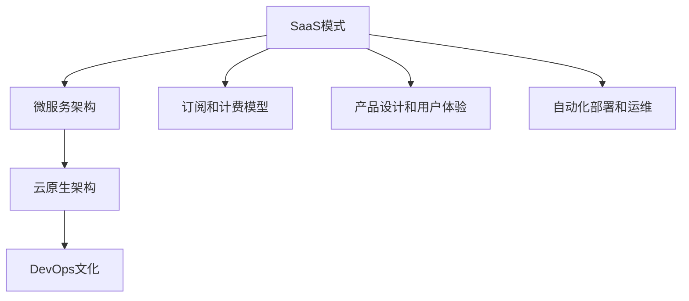

                 

# 从全栈开发到SaaS创业

## 1. 背景介绍

### 1.1 问题由来

随着互联网技术的不断演进，软件开发的范式也经历了从传统单体应用到微服务架构、再到无服务器架构的转变。但这些技术范式仍局限于企业内部系统构建，难以快速响应市场变化。而SaaS（Software as a Service）模式的出现，打破了这一困境，使得软件产品能够以按需服务和订阅计费的形式，快速触达全球用户。

SaaS模式不仅简化了软件的交付和部署过程，降低了开发和运维成本，更使得开发者能够专注于产品的核心价值和用户体验，而非底层技术细节。这为全栈开发者提供了全新的创业方向和舞台，但也带来了新的挑战。

### 1.2 问题核心关键点

从全栈开发转型到SaaS创业的核心问题，在于如何从传统的软件开发模式，快速适应SaaS架构和商业模式。具体包括以下几个关键点：

- **产品设计和用户体验**：SaaS产品的核心在于其易用性和用户粘性。产品设计是否符合用户需求，用户体验是否流畅自然，是决定SaaS产品能否成功的重要因素。
- **云架构和服务化**：SaaS产品依托于云架构，如何快速搭建云平台、优化性能、确保高可用性，是SaaS开发的关键。
- **订阅和计费模式**：SaaS产品基于订阅计费，如何设计合理的计费策略、提高用户续费率，是SaaS商业模式的难点。
- **自动化部署和运维**：SaaS产品的更新迭代频繁，如何实现自动化的部署和运维，是保障产品稳定性的重要保障。

### 1.3 问题研究意义

SaaS模式为全栈开发者提供了全新的创业机会，但同时也带来了诸多挑战。通过对SaaS创业的关键问题进行深入研究，可以为转型开发者提供有力的指导和参考，助力他们成功转型，实现商业价值和创新成果。

## 2. 核心概念与联系

### 2.1 核心概念概述

为更好地理解从全栈开发到SaaS创业的转变，本节将介绍几个密切相关的核心概念：

- **SaaS模式**：基于云计算技术，通过Internet提供软件服务的商业模式。SaaS产品以按需服务、按用计费的方式提供，大大降低了传统软件的实施成本和复杂度。
- **微服务架构**：将单体应用拆分为多个独立、自治的服务单元，每个服务负责单一职责，并通过API进行通信的架构设计。微服务架构提高了系统的灵活性和扩展性。
- **云原生架构**：以容器化为核心，结合自动化运维、服务网格、声明式API等技术，构建可弹性伸缩、自修复、自更新的云平台架构。
- **DevOps文化**：结合软件开发和运维的文化理念，强调快速部署、持续集成和持续交付，优化软件开发和运维的效率和质量。
- **订阅和计费模型**：以用户使用量为计费依据，提供灵活的定价策略，鼓励用户长期订阅和使用SaaS产品。

这些核心概念之间的逻辑关系可以通过以下Mermaid流程图来展示：



这个流程图展示了几大核心概念之间的关系：

1. SaaS模式是SaaS产品的核心商业模式。
2. 微服务架构是构建SaaS产品的关键技术。
3. 云原生架构为微服务提供弹性、自愈等能力。
4. DevOps文化是SaaS产品的管理和运营保障。
5. 订阅和计费模型是SaaS产品的收入来源。
6. 产品设计和用户体验是SaaS产品的用户粘性基础。
7. 自动化部署和运维是SaaS产品的稳定保障。

这些概念共同构成了SaaS创业的基础框架，使得全栈开发者能够全面理解和把握SaaS模式的关键要素，从而进行有针对性的创业实践。

## 3. 核心算法原理 & 具体操作步骤

### 3.1 算法原理概述

SaaS产品的开发和运营，涉及多方面的技术细节和业务需求。本节将通过案例分析，展示如何运用这些核心概念和技术，实现SaaS产品的快速构建和成功运营。

### 3.2 算法步骤详解

SaaS产品的开发和运营流程，包括以下几个关键步骤：

**Step 1: 产品规划和需求分析**
- 市场调研：了解目标用户群体的需求和使用习惯，确定产品功能方向和用户价值。
- 用户画像：构建目标用户的详细画像，明确其痛点、需求和期望。
- 竞品分析：分析同行业竞品的优缺点，明确自身的差异化竞争策略。

**Step 2: 系统架构设计**
- 选择SaaS平台：根据业务需求和预算，选择合适的云服务提供商和云平台（如AWS、Azure、Google Cloud等）。
- 设计微服务架构：将产品功能拆分为多个独立的服务单元，每个服务负责单一职责。
- 实现云原生架构：采用容器化技术（如Docker、Kubernetes），实现服务的快速部署、扩展和回收。

**Step 3: 产品开发和测试**
- 敏捷开发：采用Scrum或Kanban等敏捷开发方法，实现快速迭代和持续交付。
- 自动化测试：引入单元测试、集成测试、端到端测试，确保产品稳定性和功能完备性。
- 持续集成和持续交付：采用CI/CD工具（如Jenkins、GitLab CI、CircleCI等），实现代码的自动化构建、测试和部署。

**Step 4: 用户运营和数据管理**
- 用户管理：设计用户账户和权限管理机制，实现用户身份验证和访问控制。
- 数据管理：采用数据库管理系统（如MySQL、PostgreSQL、MongoDB等），实现数据存储、查询和管理。
- 性能优化：采用缓存、负载均衡、CDN等技术，优化系统性能和用户体验。

**Step 5: 自动化运维和监控**
- 自动化运维：采用自动化运维工具（如Prometheus、Grafana、ELK Stack等），实现系统的实时监控和故障预警。
- 故障恢复：设计灾难恢复和备份策略，确保系统的高可用性和容灾能力。
- 安全防护：采用安全防护措施（如SSL加密、防火墙、DDoS防护等），保障系统的安全性和隐私性。

### 3.3 算法优缺点

SaaS产品的开发和运营，相较于传统的单体应用，具有以下优点：

- **快速迭代和灵活扩展**：微服务架构和云原生架构提供了快速部署、弹性扩展的能力，使得产品能够快速响应市场变化。
- **高效协作和持续交付**：DevOps文化下的敏捷开发和持续集成，提高了开发效率和产品质量。
- **降低成本和提高可用性**：基于云计算的SaaS模式，降低了初始投资成本和运维复杂度，提高了系统的可用性和稳定性。
- **用户粘性和长期价值**：订阅和计费模型激励用户长期使用，通过产品迭代和用户体验优化，提升用户粘性和长期价值。

同时，SaaS产品也存在一些缺点：

- **多租户管理复杂**：每个用户的数据和配置需要独立管理，增加了系统复杂度和运维难度。
- **数据安全和隐私问题**：用户数据存储在云端，需要采取严格的安全防护措施，防止数据泄露和滥用。
- **用户流失风险**：订阅模式下的续约挑战，需要持续优化产品体验和提供增值服务，以提高续费率。
- **成本控制和定价策略**：需要精细化的成本控制和定价策略，以实现良好的盈利和市场竞争力。

### 3.4 算法应用领域

SaaS产品广泛应用于多个行业领域，如：

- 企业资源规划（ERP）：提供全面的企业管理和运营解决方案，包括财务、采购、销售、人力资源等模块。
- 客户关系管理（CRM）：帮助企业管理客户信息、销售线索和市场活动，提升客户满意度和销售转化率。
- 人力资源管理（HRM）：提供招聘、培训、绩效管理等模块，提升企业的人力资源管理水平。
- 电子商务平台：提供商品管理、订单处理、支付结算等功能，支持B2B和B2C交易。
- 项目管理工具：提供任务分配、进度跟踪、协作管理等功能，提升项目管理效率和团队协作能力。

这些领域是SaaS产品的主要应用场景，全栈开发者可以根据自身的技术背景和业务兴趣，选择相应的应用方向，进行SaaS创业。

## 4. 数学模型和公式 & 详细讲解 & 举例说明

### 4.1 数学模型构建

SaaS产品的开发和运营，涉及多个领域的数学模型和算法。本节将通过数学语言，对其中一些关键模型进行描述。

假设有一个典型的SaaS电商产品，需要设计其用户增长模型和推荐系统。该模型可以表示为：

$$
U = f(D, C, P)
$$

其中：
- $U$：用户增长率
- $D$：用户转化率
- $C$：用户复购率
- $P$：用户流失率

通过这个模型，可以计算出用户增长率$U$，进而预测未来的用户规模。

### 4.2 公式推导过程

以下是对用户增长模型公式的推导过程：

$$
U = \frac{D \times C}{P}
$$

其中：
- $D$：新用户的转化率，表示首次访问的用户中有多少成为付费用户。
- $C$：复购率，表示付费用户中有多少再次购买。
- $P$：流失率，表示付费用户中有多少在一定时间后流失。

通过这个公式，可以计算出用户增长率$U$，进而预测未来的用户规模。

### 4.3 案例分析与讲解

以某SaaS电商产品的用户增长模型为例，假设该产品的用户转化率为$D=10\%$，复购率为$C=20\%$，流失率为$P=5\%$，则用户增长率为：

$$
U = \frac{D \times C}{P} = \frac{10\% \times 20\%}{5\%} = 4
$$

这意味着，每单位时间（如每天），该SaaS电商产品的用户数会增加4倍。根据这个模型，可以预测未来的用户增长趋势，为产品规划和运营决策提供依据。

## 5. 项目实践：代码实例和详细解释说明

### 5.1 开发环境搭建

在进行SaaS产品开发前，我们需要准备好开发环境。以下是使用Python进行Django开发的环境配置流程：

1. 安装Python：从官网下载并安装Python 3.x版本。
2. 安装虚拟环境管理工具：安装`virtualenv`或`conda`，用于创建虚拟Python环境。
3. 安装Django：使用命令`pip install django`进行安装。
4. 安装数据库管理系统：安装MySQL、PostgreSQL等数据库管理系统，用于存储数据。
5. 安装Web服务器：安装Apache或Nginx，用于部署Web应用。
6. 安装云服务提供商SDK：安装AWS SDK、Azure SDK等，用于云平台的操作和监控。

完成上述步骤后，即可在虚拟环境中开始SaaS产品的开发。

### 5.2 源代码详细实现

下面我们以一个简单的SaaS电商产品为例，给出使用Django框架开发微服务架构的Python代码实现。

首先，定义SaaS产品的数据模型：

```python
from django.db import models
from django.contrib.auth.models import AbstractUser

class User(AbstractUser):
    pass

class Product(models.Model):
    name = models.CharField(max_length=100)
    price = models.DecimalField(max_digits=10, decimal_places=2)

class Order(models.Model):
    user = models.ForeignKey(User, on_delete=models.CASCADE)
    product = models.ForeignKey(Product, on_delete=models.CASCADE)
    quantity = models.IntegerField()
    created_at = models.DateTimeField(auto_now_add=True)
```

然后，定义微服务架构中的各个服务：

```python
from django.views import View
from django.http import JsonResponse

class UserView(View):
    def get(self, request):
        users = User.objects.all()
        return JsonResponse({'users': [user.serializer() for user in users]})

class ProductView(View):
    def get(self, request):
        products = Product.objects.all()
        return JsonResponse({'products': [product.serializer() for product in products]})

class OrderView(View):
    def get(self, request):
        orders = Order.objects.all()
        return JsonResponse({'orders': [order.serializer() for order in orders]})
```

接着，定义API接口的路由：

```python
from django.urls import path

urlpatterns = [
    path('users/', UserView.as_view()),
    path('products/', ProductView.as_view()),
    path('orders/', OrderView.as_view()),
]
```

最后，启动Django应用，并运行前端界面：

```python
from django.core.wsgi import get_wsgi_application
from django.urls import include, path
from django.contrib import admin

admin.site.site_header = 'SaaS Admin'
admin.site.site_title = 'SaaS Admin'
admin.site.index_title = 'SaaS Admin'

urlpatterns = [
    path('admin/', admin.site.urls),
    path('', include('api.urls')),
    path('user/', include('user.urls')),
    path('product/', include('product.urls')),
    path('order/', include('order.urls')),
]

application = get_wsgi_application()
```

以上就是使用Django框架进行微服务架构开发的基本步骤。可以看到，借助Python和Django，开发者可以非常方便地构建微服务架构，实现SaaS产品的快速开发和部署。

### 5.3 代码解读与分析

让我们再详细解读一下关键代码的实现细节：

**数据模型定义**：
- `User`模型继承自Django内置的`AbstractUser`模型，用于存储用户信息。
- `Product`模型用于存储商品信息，包括商品名称和价格。
- `Order`模型用于存储订单信息，包括用户、商品和订单数量等。

**微服务接口定义**：
- `UserView`、`ProductView`和`OrderView`继承自Django的`View`类，分别用于处理用户的增删改查、商品的增删改查和订单的增删改查。
- 接口返回的数据经过序列化后，以JSON格式响应，方便客户端进行消费。

**API路由定义**：
- 使用`path`函数定义API路由，将请求转发给对应的视图函数进行处理。
- 路由定义需要涵盖所有微服务功能的接口，以确保系统的高可用性和完整性。

**Django应用启动**：
- 通过`get_wsgi_application`函数获取Django应用的WSGI对象，以启动Web服务。
- 在应用中配置了Django Admin，方便进行用户和商品的管理。

通过以上代码示例，可以看到，Django框架提供了一套简单易用的API开发和微服务架构构建工具，极大地简化了SaaS产品的开发过程。

## 6. 实际应用场景

### 6.1 智能客服系统

SaaS智能客服系统是典型的SaaS产品，通过云平台提供智能客服解决方案，帮助企业提升客户服务质量和效率。智能客服系统通常包括以下几个关键组件：

- **NLP（自然语言处理）引擎**：用于理解客户意图和处理客户咨询，提供自动回复和人工转接服务。
- **知识库管理**：用于存储和管理企业内部和外部的知识库资源，供NLP引擎调用。
- **实时数据管理**：用于存储和管理客户咨询的记录和交互日志，进行分析和优化。
- **API集成**：通过API接口，将智能客服系统与其他业务系统（如CRM、ERP等）进行集成，实现客户服务的一体化管理。

智能客服系统的开发需要结合自然语言处理、机器学习和云计算技术，采用SaaS模式提供按需服务的解决方案。通过SaaS模式，企业可以轻松获取智能客服系统的访问权限，根据实际需求灵活配置和使用，无需进行复杂的本地部署和运维。

### 6.2 金融数据分析平台

金融数据分析平台是一种SaaS产品，通过云平台提供数据分析和可视化服务，帮助金融从业者进行市场分析、风险评估和投资决策。金融数据分析平台通常包括以下几个关键组件：

- **数据采集**：用于采集金融市场和经济数据，供数据分析引擎调用。
- **数据分析引擎**：用于进行数据清洗、特征工程和模型训练，提供各种金融指标的预测和分析。
- **可视化工具**：用于将数据分析结果进行可视化展示，方便用户进行直观理解和决策。
- **API集成**：通过API接口，将金融数据分析平台与其他金融系统（如交易系统、风险管理系统等）进行集成，实现数据的一体化管理和应用。

金融数据分析平台的开发需要结合大数据、机器学习和云计算技术，采用SaaS模式提供按需服务的解决方案。通过SaaS模式，金融从业者可以轻松获取数据分析平台的访问权限，根据实际需求灵活配置和使用，无需进行复杂的本地部署和运维。

### 6.3 在线教育平台

在线教育平台是一种SaaS产品，通过云平台提供在线课程和教育服务，帮助学生和教育机构进行远程教育和知识共享。在线教育平台通常包括以下几个关键组件：

- **课程管理**：用于管理和发布在线课程，供学生和教师使用。
- **学生管理**：用于管理和跟踪学生的学习情况，提供个性化推荐和辅导服务。
- **教师管理**：用于管理和调度教师资源，提供教师的课程开发和培训支持。
- **API集成**：通过API接口，将在线教育平台与其他教育系统（如学籍管理系统、考试系统等）进行集成，实现教育的一体化管理和应用。

在线教育平台的开发需要结合计算机视觉、自然语言处理和云计算技术，采用SaaS模式提供按需服务的解决方案。通过SaaS模式，学生和教育机构可以轻松获取在线教育平台的访问权限，根据实际需求灵活配置和使用，无需进行复杂的本地部署和运维。

### 6.4 未来应用展望

随着SaaS模式的普及和技术的不断进步，未来的SaaS产品将呈现以下几个发展趋势：

- **微服务和无服务器架构**：SaaS产品将越来越多地采用微服务和无服务器架构，实现更加灵活、高效的云平台设计。
- **云原生和安全**：SaaS产品将更多地采用云原生技术，实现自动化的部署、扩展和故障恢复。同时，数据安全和隐私保护也将成为SaaS产品的重要保障。
- **智能化和自动化**：SaaS产品将结合人工智能技术，提供更加智能化和自动化的解决方案，提升用户体验和运营效率。
- **多模态和融合**：SaaS产品将结合多种数据模态（如文本、图像、音频等），提供更加全面和深入的业务支持。
- **全栈开发和DevOps**：SaaS产品将更多地采用全栈开发和DevOps文化，实现快速迭代和持续交付，提升开发和运营的效率和质量。

SaaS模式为全栈开发者提供了全新的创业方向和舞台，但也带来了新的挑战和机会。通过对SaaS产品的深入理解和实践，相信更多的开发者将能够成功转型，实现商业价值和创新成果。

## 7. 工具和资源推荐

### 7.1 学习资源推荐

为了帮助开发者系统掌握SaaS产品的开发和运营，这里推荐一些优质的学习资源：

1. **Django官方文档**：Django官方文档提供了详细的API开发和微服务架构设计指导，是学习Django框架的最佳资源。
2. **Cloud Academy**：提供云平台和DevOps相关的在线课程，涵盖AWS、Azure、Google Cloud等云服务商。
3. **Kubernetes官方文档**：Kubernetes官方文档提供了详细的容器化和云原生架构设计指导，是学习Kubernetes的最佳资源。
4. **Docker官方文档**：Docker官方文档提供了详细的容器化和微服务架构设计指导，是学习Docker的最佳资源。
5. **DevOps.com**：DevOps.com提供了丰富的DevOps文化、工具和实践指导，是学习DevOps的最佳资源。

通过对这些资源的学习实践，相信你一定能够快速掌握SaaS产品的开发和运营技巧，构建高效、稳定、用户友好的SaaS解决方案。

### 7.2 开发工具推荐

高效的软件开发离不开优秀的工具支持。以下是几款用于SaaS产品开发的常用工具：

1. **Django框架**：Python的Web开发框架，提供丰富的API开发和微服务架构设计工具。
2. **Docker**：容器化技术，方便快速构建和部署微服务架构。
3. **Kubernetes**：容器编排工具，实现服务的自动部署、扩展和故障恢复。
4. **Prometheus**：实时监控和告警系统，确保SaaS产品的稳定性和可用性。
5. **ELK Stack**：日志收集和分析工具，帮助开发者监控和调试SaaS产品。
6. **GitLab CI/CD**：持续集成和持续交付工具，实现代码的自动化构建、测试和部署。

合理利用这些工具，可以显著提升SaaS产品的开发效率，加快创新迭代的步伐。

### 7.3 相关论文推荐

SaaS模式的发展离不开学术界的持续研究。以下是几篇奠基性的相关论文，推荐阅读：

1. **A Study of Cloud Computing Based SaaS Business Model**：研究云技术在SaaS产品中的应用，探讨了SaaS产品的商业价值和实现方法。
2. **Microservices in SaaS**：探讨了微服务架构在SaaS产品中的应用，强调了微服务的灵活性和可扩展性。
3. **Cloud Native in SaaS**：研究云原生技术在SaaS产品中的应用，强调了云原生架构的高可用性和自愈能力。
4. **DevOps in SaaS**：研究DevOps文化在SaaS产品中的应用，强调了自动化部署和持续交付的重要性。
5. **Machine Learning in SaaS**：研究人工智能技术在SaaS产品中的应用，探讨了SaaS产品的智能化和自动化解决方案。

这些论文代表了大规模云计算和SaaS模式的发展脉络。通过学习这些前沿成果，可以帮助开发者把握SaaS模式的前进方向，激发更多的创新灵感。

## 8. 总结：未来发展趋势与挑战

### 8.1 总结

本文对从全栈开发到SaaS创业的转变进行了全面系统的介绍。首先阐述了SaaS模式的发展背景和商业价值，明确了SaaS产品开发的关键要素。其次，通过案例分析，展示了如何运用微服务架构、云原生架构、DevOps文化等技术，构建SaaS产品的核心架构。最后，探讨了SaaS产品的实际应用场景，展望了未来发展的趋势和挑战。

通过本文的系统梳理，可以看到，SaaS模式为全栈开发者提供了全新的创业机会，但也带来了新的挑战。只有在技术、业务、管理等多个层面进行全面优化，才能真正实现SaaS产品的成功落地。相信随着SaaS模式的持续演进，更多的开发者将能够在这一领域大显身手，推动SaaS产品的创新和发展。

### 8.2 未来发展趋势

展望未来，SaaS产品的开发和运营将呈现以下几个发展趋势：

1. **云原生和微服务**：SaaS产品将越来越多地采用云原生和微服务架构，实现灵活、高效的云平台设计。
2. **智能化和自动化**：SaaS产品将结合人工智能技术，提供更加智能化和自动化的解决方案，提升用户体验和运营效率。
3. **全栈开发和DevOps**：SaaS产品将更多地采用全栈开发和DevOps文化，实现快速迭代和持续交付，提升开发和运营的效率和质量。
4. **多模态和融合**：SaaS产品将结合多种数据模态（如文本、图像、音频等），提供更加全面和深入的业务支持。
5. **云安全和隐私保护**：SaaS产品将结合数据安全和隐私保护技术，确保用户数据的安全和隐私。

这些趋势将为SaaS产品的开发和运营带来新的机遇和挑战。通过不断探索和实践，相信开发者能够在这一领域取得更大的突破和进展。

### 8.3 面临的挑战

尽管SaaS模式带来了诸多便利，但在实际应用中，仍面临以下挑战：

1. **多租户管理复杂**：每个用户的数据和配置需要独立管理，增加了系统复杂度和运维难度。
2. **数据安全和隐私问题**：用户数据存储在云端，需要采取严格的安全防护措施，防止数据泄露和滥用。
3. **用户流失风险**：订阅模式下的续约挑战，需要持续优化产品体验和提供增值服务，以提高续费率。
4. **成本控制和定价策略**：需要精细化的成本控制和定价策略，以实现良好的盈利和市场竞争力。

### 8.4 研究展望

面对SaaS产品面临的挑战，未来的研究需要在以下几个方面寻求新的突破：

1. **全栈开发和DevOps**：结合DevOps文化，提升SaaS产品的开发效率和质量，实现快速迭代和持续交付。
2. **云安全和隐私保护**：结合数据安全和隐私保护技术，确保用户数据的安全和隐私。
3. **智能化和自动化**：结合人工智能技术，提供更加智能化和自动化的解决方案，提升用户体验和运营效率。
4. **多模态和融合**：结合多种数据模态，提供更加全面和深入的业务支持。
5. **多租户管理和优化**：结合多租户管理技术，优化SaaS产品的配置和管理，提升系统的可扩展性和灵活性。

通过这些方向的探索和发展，相信SaaS产品将能够更好地服务于各行各业，推动企业数字化转型和智能化升级。

## 9. 附录：常见问题与解答

**Q1：SaaS产品的开发和运营需要注意哪些关键点？**

A: SaaS产品的开发和运营需要注意以下几个关键点：

- **产品设计和用户体验**：产品设计是否符合用户需求，用户体验是否流畅自然，是决定SaaS产品能否成功的重要因素。
- **云架构和服务化**：如何快速搭建云平台、优化性能、确保高可用性，是SaaS开发的关键。
- **订阅和计费模式**：如何设计合理的计费策略、提高用户续费率，是SaaS商业模式的难点。
- **自动化部署和运维**：如何实现自动化的部署和运维，是保障产品稳定性的重要保障。

**Q2：SaaS产品的优势和劣势分别是什么？**

A: SaaS产品的优势包括：

- **快速迭代和灵活扩展**：微服务架构和云原生架构提供了快速部署、弹性扩展的能力，使得产品能够快速响应市场变化。
- **高效协作和持续交付**：DevOps文化下的敏捷开发和持续集成，提高了开发效率和产品质量。
- **降低成本和提高可用性**：基于云计算的SaaS模式，降低了初始投资成本和运维复杂度，提高了系统的可用性和稳定性。

SaaS产品的劣势包括：

- **多租户管理复杂**：每个用户的数据和配置需要独立管理，增加了系统复杂度和运维难度。
- **数据安全和隐私问题**：用户数据存储在云端，需要采取严格的安全防护措施，防止数据泄露和滥用。
- **用户流失风险**：订阅模式下的续约挑战，需要持续优化产品体验和提供增值服务，以提高续费率。
- **成本控制和定价策略**：需要精细化的成本控制和定价策略，以实现良好的盈利和市场竞争力。

通过明确优势和劣势，开发者可以在SaaS产品开发和运营中，更好地应对挑战，提升竞争力。

**Q3：如何选择适合SaaS模式的应用场景？**

A: 选择适合SaaS模式的应用场景，需要考虑以下几个因素：

- **业务需求**：SaaS模式适用于业务需求变化快、用户需求多样化的场景，如电商、人力资源管理、客户关系管理等。
- **技术可行性**：SaaS模式需要高度依赖云平台和服务化架构，需要评估技术实现的可行性。
- **成本效益**：SaaS模式能够显著降低初始投资成本和运维复杂度，需要评估成本效益和盈利潜力。
- **用户接受度**：SaaS模式需要用户能够接受订阅计费和按需服务的模式，需要评估用户的接受度和使用意愿。

通过全面评估这些因素，开发者可以更好地选择适合SaaS模式的应用场景，提升产品开发和运营的成功率。

通过本文的系统梳理，可以看到，SaaS模式为全栈开发者提供了全新的创业机会，但也带来了新的挑战。只有在技术、业务、管理等多个层面进行全面优化，才能真正实现SaaS产品的成功落地。相信随着SaaS模式的持续演进，更多的开发者将能够在这一领域大显身手，推动SaaS产品的创新和发展。

---

作者：禅与计算机程序设计艺术 / Zen and the Art of Computer Programming

