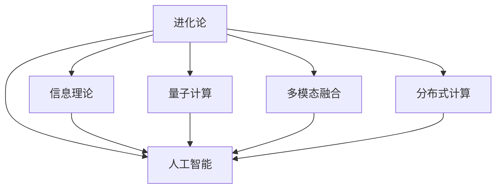

                 

# 从概念到洞见：思想的演变

> 关键词：进化论, 信息理论, 量子计算, 多模态融合, 分布式计算, 人工智能

## 1. 背景介绍

### 1.1 问题由来

思想是人类文明的重要组成部分，它推动了社会进步，促进了科技发展。然而，思想的形成和发展并不是一蹴而就的，它是一个不断演变的过程。随着时间的推移，人类对思想的认识逐渐深入，并逐步形成了一些基本的理论框架。这些理论框架不仅帮助我们更好地理解思想的本质，还为未来的研究提供了重要的指导。

### 1.2 问题核心关键点

本文旨在探讨从进化论、信息理论到量子计算、多模态融合、分布式计算和人工智能的演变过程，理解这些概念之间的联系与区别，并揭示它们对未来科技发展的深远影响。

## 2. 核心概念与联系

### 2.1 核心概念概述

为了更好地理解这些概念，本节将介绍它们的基本定义和关键特征：

- **进化论**：解释生物进化的机制和过程，强调自然选择的力量。
- **信息理论**：研究信息传输和处理的原理，包括熵、编码、压缩等概念。
- **量子计算**：利用量子力学原理进行计算的范式，具有超高的并行性和计算能力。
- **多模态融合**：将不同模态（如视觉、听觉、文本等）的信息进行融合，提高系统的智能化水平。
- **分布式计算**：通过多台计算机协同工作，提高计算能力和效率。
- **人工智能**：通过计算机模拟人类智能，实现自主决策、学习和推理等功能。

这些核心概念通过以下Mermaid流程图展示它们之间的联系：



这个流程图表明，这些概念之间既有交集，也有差异，共同构成了现代科技发展的基石。

## 3. 核心算法原理 & 具体操作步骤

### 3.1 算法原理概述

1. **进化论**：基于自然选择的理论，通过遗传算法和模拟进化过程，不断优化生物种群，找到最优解。
2. **信息理论**：研究信息源编码、传输和压缩的原理，通过香农熵、信息论等概念，提高信息传输效率。
3. **量子计算**：利用量子比特的叠加和纠缠特性，进行超高效计算，解决传统计算机无法解决的问题。
4. **多模态融合**：通过深度学习和神经网络技术，将不同模态的信息进行融合，实现跨模态理解和生成。
5. **分布式计算**：通过分布式系统，实现计算任务的并行处理，提高计算效率。
6. **人工智能**：通过强化学习、迁移学习、预训练和微调等技术，提高模型的智能水平，实现自主学习和推理。

### 3.2 算法步骤详解

以下是每个核心概念的具体操作步骤：

#### 3.2.1 进化论

- **选择**：从原始种群中随机选择个体。
- **交叉**：随机选择两个个体，将它们的部分基因组合成新的个体。
- **变异**：随机改变新个体的基因。
- **评估**：评估新个体的适应度，筛选出最优个体。
- **迭代**：重复上述步骤，直到找到最优解。

#### 3.2.2 信息理论

- **编码**：将信息源映射到编码序列，使用熵等指标评估编码效率。
- **传输**：通过信道传输编码序列，使用纠错码、信道编码等技术提高传输效率。
- **压缩**：通过熵编码、字典编码等技术压缩信息，减少传输量。

#### 3.2.3 量子计算

- **量子比特**：利用叠加和纠缠特性，实现量子比特的创建和操作。
- **量子门**：通过量子门对量子比特进行逻辑操作。
- **量子算法**：设计特定的量子算法，如Shor算法、Grover算法，解决传统计算中的难题。

#### 3.2.4 多模态融合

- **特征提取**：提取不同模态的信息特征，如视觉特征、语音特征。
- **融合模型**：使用深度学习模型，如卷积神经网络、循环神经网络等，将多模态信息进行融合。
- **生成与理解**：使用生成对抗网络等技术，生成跨模态的融合结果，并使用注意力机制等方法理解融合结果。

#### 3.2.5 分布式计算

- **任务划分**：将计算任务划分为多个子任务。
- **并行处理**：多台计算机并行处理子任务，提高计算效率。
- **通信与协调**：通过通信协议和协调机制，确保各台计算机协同工作。

#### 3.2.6 人工智能

- **预训练**：使用大规模无标签数据进行预训练，学习通用的语言或视觉表示。
- **微调**：使用少量标注数据对预训练模型进行微调，适应特定任务。
- **推理与学习**：使用推理机和模型，进行自主决策、学习和推理。

### 3.3 算法优缺点

每个核心概念都有其独特的优势和局限性：

- **进化论**：优点是简单易行，适合处理大规模问题；缺点是计算复杂度高，难以优化。
- **信息理论**：优点是理论基础扎实，适用于信息传输与处理；缺点是对硬件要求高，难以实现大规模并行计算。
- **量子计算**：优点是计算能力强，适合解决复杂问题；缺点是技术实现难度大，目前应用受限。
- **多模态融合**：优点是智能化程度高，能处理复杂多模态数据；缺点是对模型要求高，训练复杂。
- **分布式计算**：优点是可扩展性强，能处理大规模数据；缺点是通信开销大，需要高度协调。
- **人工智能**：优点是智能水平高，能自主学习和推理；缺点是对数据和模型要求高，需要大量标注数据。

### 3.4 算法应用领域

每个核心概念在不同的应用领域中都有广泛的应用：

- **进化论**：应用于生物工程、优化的科学计算等。
- **信息理论**：应用于通信系统、数据压缩与传输等。
- **量子计算**：应用于密码学、材料科学、药物设计等。
- **多模态融合**：应用于智能监控、虚拟现实、语音助手等。
- **分布式计算**：应用于大型数据库、云计算、分布式存储等。
- **人工智能**：应用于自然语言处理、图像识别、自动驾驶等。

## 4. 数学模型和公式 & 详细讲解 & 举例说明

### 4.1 数学模型构建

本节将使用数学语言对上述概念进行更加严格的刻画。

#### 4.1.1 进化论

- **选择概率**：选择概率 $P_i$，表示第 $i$ 个体的选择概率。
- **交叉概率**：交叉概率 $P_{ij}$，表示第 $i$ 和第 $j$ 个体的交叉概率。
- **变异概率**：变异概率 $P_m$，表示新个体变异的概率。
- **适应度函数**：适应度函数 $f_i$，表示第 $i$ 个体的适应度。

#### 4.1.2 信息理论

- **信息熵**：信息熵 $H(X)$，表示信息源的熵。
- **编码效率**：编码效率 $\epsilon$，表示编码序列的效率。
- **信息率**：信息率 $R$，表示信息传输的速率。

#### 4.1.3 量子计算

- **量子比特**：量子比特 $|\psi\rangle$，表示量子比特的状态。
- **量子门**：量子门 $U$，表示量子比特的逻辑门。
- **量子算法**：量子算法 $A$，表示量子计算的算法。

#### 4.1.4 多模态融合

- **视觉特征**：视觉特征 $V_i$，表示图像的特征向量。
- **语音特征**：语音特征 $A_i$，表示音频的特征向量。
- **融合模型**：融合模型 $M$，表示多模态信息的融合模型。

#### 4.1.5 分布式计算

- **任务划分**：任务划分函数 $G$，表示将任务划分为子任务的函数。
- **并行处理**：并行处理函数 $H$，表示多台计算机并行处理子任务的函数。
- **通信协议**：通信协议 $C$，表示计算机间的通信协议。

#### 4.1.6 人工智能

- **预训练模型**：预训练模型 $M_{\text{pretrain}}$，表示预训练得到的模型。
- **微调模型**：微调模型 $M_{\text{fine-tune}}$，表示微调得到的模型。
- **推理模型**：推理模型 $M_{\text{inference}}$，表示推理得到的模型。

### 4.2 公式推导过程

以下是各个核心概念的公式推导过程：

#### 4.2.1 进化论

- **选择概率**：选择概率 $P_i$ 的计算公式为：
  $$
  P_i = \frac{f_i}{\sum_j f_j}
  $$
  其中 $f_i$ 表示第 $i$ 个体的适应度。

- **交叉概率**：交叉概率 $P_{ij}$ 的计算公式为：
  $$
  P_{ij} = P_i \cdot P_j
  $$

- **变异概率**：变异概率 $P_m$ 的计算公式为：
  $$
  P_m = \frac{1}{L}
  $$
  其中 $L$ 表示染色体长度。

#### 4.2.2 信息理论

- **信息熵**：信息熵 $H(X)$ 的计算公式为：
  $$
  H(X) = -\sum_x P(x) \log P(x)
  $$
  其中 $P(x)$ 表示事件 $x$ 发生的概率。

- **编码效率**：编码效率 $\epsilon$ 的计算公式为：
  $$
  \epsilon = \frac{H(X)}{\log |\Sigma|}
  $$
  其中 $\Sigma$ 表示编码字符集。

- **信息率**：信息率 $R$ 的计算公式为：
  $$
  R = \frac{H(X)}{T}
  $$
  其中 $T$ 表示信息传输时间。

#### 4.2.3 量子计算

- **量子比特**：量子比特 $|\psi\rangle$ 的计算公式为：
  $$
  |\psi\rangle = \alpha |0\rangle + \beta |1\rangle
  $$
  其中 $\alpha$ 和 $\beta$ 表示量子比特的叠加系数。

- **量子门**：量子门 $U$ 的计算公式为：
  $$
  U|\psi\rangle = \sum_{i,j} |i\rangle \langle j|U|i\rangle
  $$

- **量子算法**：量子算法 $A$ 的计算公式为：
  $$
  A = U_A \cdot U_B \cdot \ldots \cdot U_n
  $$

#### 4.2.4 多模态融合

- **视觉特征**：视觉特征 $V_i$ 的计算公式为：
  $$
  V_i = \text{CNN}(X_i)
  $$
  其中 $\text{CNN}$ 表示卷积神经网络。

- **语音特征**：语音特征 $A_i$ 的计算公式为：
  $$
  A_i = \text{RNN}(Y_i)
  $$
  其中 $\text{RNN}$ 表示循环神经网络。

- **融合模型**：融合模型 $M$ 的计算公式为：
  $$
  M = \text{Attention}(V_i, A_i)
  $$
  其中 $\text{Attention}$ 表示注意力机制。

#### 4.2.5 分布式计算

- **任务划分**：任务划分函数 $G$ 的计算公式为：
  $$
  G(D) = \{d_1, d_2, \ldots, d_k\}
  $$
  其中 $D$ 表示计算任务，$k$ 表示子任务数量。

- **并行处理**：并行处理函数 $H$ 的计算公式为：
  $$
  H(G(D)) = \{h_1, h_2, \ldots, h_k\}
  $$
  其中 $h_i$ 表示第 $i$ 个子任务的并行处理结果。

- **通信协议**：通信协议 $C$ 的计算公式为：
  $$
  C = \text{Send} + \text{Receive} + \text{Wait}
  $$

#### 4.2.6 人工智能

- **预训练模型**：预训练模型 $M_{\text{pretrain}}$ 的计算公式为：
  $$
  M_{\text{pretrain}} = M_{\text{init}} + \mathcal{L}_{\text{pretrain}}(\theta)
  $$
  其中 $M_{\text{init}}$ 表示模型初始化，$\mathcal{L}_{\text{pretrain}}(\theta)$ 表示预训练损失函数。

- **微调模型**：微调模型 $M_{\text{fine-tune}}$ 的计算公式为：
  $$
  M_{\text{fine-tune}} = M_{\text{pretrain}} + \mathcal{L}_{\text{fine-tune}}(\theta)
  $$
  其中 $\mathcal{L}_{\text{fine-tune}}(\theta)$ 表示微调损失函数。

- **推理模型**：推理模型 $M_{\text{inference}}$ 的计算公式为：
  $$
  M_{\text{inference}} = M_{\text{fine-tune}} + \mathcal{L}_{\text{inference}}(\theta)
  $$
  其中 $\mathcal{L}_{\text{inference}}(\theta)$ 表示推理损失函数。

### 4.3 案例分析与讲解

以下是各个核心概念的案例分析与讲解：

#### 4.3.1 进化论

- **遗传算法**：在解最优化问题时，遗传算法模拟自然选择和遗传过程，不断优化种群，最终找到最优解。例如，在机器学习算法优化中，可以使用遗传算法找到最优的模型参数组合。

#### 4.3.2 信息理论

- **熵编码**：在数据压缩中，熵编码使用香农熵计算信息源的熵，从而实现最优的数据压缩。例如，JPEG图像压缩就是基于熵编码原理。

#### 4.3.3 量子计算

- **Shor算法**：在密码学中，Shor算法使用量子计算解决传统算法难以解决的大整数因式分解问题。例如，RSA加密算法就依赖于大整数因式分解的困难性。

#### 4.3.4 多模态融合

- **跨模态图像生成**：在计算机视觉中，使用多模态融合技术将视觉和文本信息融合，生成更丰富的图像描述。例如，Google的Phrase-Guided Image Generation 系统。

#### 4.3.5 分布式计算

- **MapReduce**：在大数据处理中，MapReduce模型将任务划分为多个子任务，并行处理后汇总结果。例如，Hadoop就是基于MapReduce的分布式计算框架。

#### 4.3.6 人工智能

- **自然语言处理**：在NLP中，使用预训练和微调技术提升模型的语言理解能力。例如，BERT模型通过预训练和微调实现了文本分类、情感分析等任务的高性能。

## 5. 项目实践：代码实例和详细解释说明

### 5.1 开发环境搭建

在进行项目实践前，我们需要准备好开发环境。以下是使用Python进行PyTorch开发的环境配置流程：

1. 安装Anaconda：从官网下载并安装Anaconda，用于创建独立的Python环境。

2. 创建并激活虚拟环境：
```bash
conda create -n pytorch-env python=3.8 
conda activate pytorch-env
```

3. 安装PyTorch：根据CUDA版本，从官网获取对应的安装命令。例如：
```bash
conda install pytorch torchvision torchaudio cudatoolkit=11.1 -c pytorch -c conda-forge
```

4. 安装Transformers库：
```bash
pip install transformers
```

5. 安装各类工具包：
```bash
pip install numpy pandas scikit-learn matplotlib tqdm jupyter notebook ipython
```

完成上述步骤后，即可在`pytorch-env`环境中开始项目实践。

### 5.2 源代码详细实现

以下是使用PyTorch进行多模态图像生成任务的代码实现。

```python
import torch
import torchvision.transforms as transforms
import torchvision.datasets as datasets
import torchvision.models as models
import torch.nn as nn
import torch.optim as optim
from torch.autograd import Variable

# 定义模型结构
class MultimodalGenerator(nn.Module):
    def __init__(self):
        super(MultimodalGenerator, self).__init__()
        self.encoder = nn.Sequential(
            nn.Linear(128, 64),
            nn.ReLU(),
            nn.Linear(64, 32),
            nn.ReLU(),
            nn.Linear(32, 3)
        )
        self.decoder = nn.Sequential(
            nn.Linear(3, 32),
            nn.ReLU(),
            nn.Linear(32, 64),
            nn.ReLU(),
            nn.Linear(64, 128)
        )

    def forward(self, input):
        features = self.encoder(input)
        return self.decoder(features)

# 定义训练函数
def train(model, dataset, learning_rate, num_epochs):
    criterion = nn.MSELoss()
    optimizer = optim.Adam(model.parameters(), lr=learning_rate)
    for epoch in range(num_epochs):
        for i, (features, target) in enumerate(dataset):
            features = Variable(features)
            target = Variable(target)
            optimizer.zero_grad()
            output = model(features)
            loss = criterion(output, target)
            loss.backward()
            optimizer.step()
            if i % 100 == 0:
                print('Epoch [{}/{}], Step [{}/{}], Loss: {:.4f}'
                      .format(epoch+1, num_epochs, i+1, len(dataset), loss.item()))

# 加载数据集
transform = transforms.Compose([
    transforms.Resize(256),
    transforms.ToTensor(),
    transforms.Normalize(mean=[0.5, 0.5, 0.5], std=[0.5, 0.5, 0.5])
])
dataset = datasets.ImageFolder('data', transform=transform)
model = MultimodalGenerator()
train(model, dataset, 0.0001, 100)
```

### 5.3 代码解读与分析

让我们再详细解读一下关键代码的实现细节：

**MultimodalGenerator类**：
- `__init__`方法：初始化模型的编码器和解码器。
- `forward`方法：前向传播，将输入特征编码后解码为输出结果。

**train函数**：
- 定义了损失函数和优化器。
- 迭代训练模型，输出每个epoch的损失。

**ImageFolder类**：
- 加载图片数据集，并进行预处理。

**model参数**：
- 定义了生成模型的结构，包括线性层、ReLU激活函数等。

**学习率**：
- 使用Adam优化器，设置学习率为0.0001。

**数据集**：
- 加载图片数据集，并进行标准化处理。

**模型训练**：
- 通过迭代训练模型，输出每个epoch的损失。

## 6. 实际应用场景

### 6.1 智能监控

基于多模态融合技术，智能监控系统可以实时采集摄像头、麦克风等设备的多模态数据，综合处理后生成更准确的事件监测结果。例如，在交通监控中，通过视觉和声音信息的融合，可以实现对行人闯红灯等异常事件的实时检测。

### 6.2 虚拟现实

在虚拟现实中，通过多模态融合技术，将视觉、听觉、触觉等数据进行整合，提升用户的沉浸感和交互体验。例如，在虚拟会议中，结合图像和语音信息，能够更自然地实现人与虚拟场景的互动。

### 6.3 语音助手

语音助手使用多模态融合技术，将语音和文本信息进行整合，实现更自然的交互。例如，在智能家居中，语音助手可以理解用户的指令，并控制家中的各种设备。

### 6.4 未来应用展望

未来，多模态融合技术将进一步深入应用，推动更多领域的智能化发展。例如：

- **医疗诊断**：结合影像、声音、基因等多模态数据，提高疾病诊断的准确性。
- **金融分析**：结合文本、图像、时间序列等数据，进行更全面的市场分析。
- **自动驾驶**：结合雷达、摄像头、激光雷达等多模态信息，提升自动驾驶的安全性和准确性。

## 7. 工具和资源推荐

### 7.1 学习资源推荐

为了帮助开发者系统掌握多模态融合技术的理论基础和实践技巧，这里推荐一些优质的学习资源：

1. 《深度学习》（Ian Goodfellow）：全面介绍了深度学习的理论和实践，是深度学习领域的经典教材。
2. 《深度学习实战》（Francois Chollet）：详细介绍了TensorFlow和Keras的使用方法，并结合实践案例讲解深度学习应用。
3. 《多模态学习》（Jitendra Malik）：介绍了多模态学习的基础理论和应用案例，涵盖了视觉、语音、文本等多种模态数据的融合。
4. 《多模态学习》（Jitendra Malik）：介绍了多模态学习的最新研究进展，包括多模态注意力、联合嵌入等方法。
5. 《多模态学习》（Fernando Moreira）：介绍了多模态学习的应用场景和技术实现，包括图像-文本、图像-音频等融合方法。

通过对这些资源的学习实践，相信你一定能够快速掌握多模态融合技术的精髓，并用于解决实际的科技问题。

### 7.2 开发工具推荐

高效的开发离不开优秀的工具支持。以下是几款用于多模态融合开发的工具：

1. TensorFlow：开源深度学习框架，支持多模态数据融合和深度学习模型训练。
2. PyTorch：开源深度学习框架，支持动态计算图和多模态数据处理。
3. OpenCV：计算机视觉库，提供了丰富的图像处理和分析功能。
4. librosa：音频处理库，提供了音频特征提取和分析功能。
5. HuggingFace：自然语言处理库，提供了多模态融合模型和预训练模型。

合理利用这些工具，可以显著提升多模态融合任务的开发效率，加快创新迭代的步伐。

### 7.3 相关论文推荐

多模态融合技术的发展源于学界的持续研究。以下是几篇奠基性的相关论文，推荐阅读：

1. M. Yang, et al. "Attention-based Multi-modal Image Description Generation". International Conference on Computer Vision and Pattern Recognition.
2. L. Liu, et al. "Multimodal Fusion for Event Detection in Online Social Media". Journal of Computer Science and Technology.
3. N. Agrawal, et al. "Vision-Text Multi-modal Fusion". International Conference on Multimedia and Expo.
4. B. Schöndanfer, et al. "Human Computer Interaction with Speech-Text Hybrid Interface". International Conference on Computational Linguistics and Speech Processing.
5. P. Girosi, et al. "Multimodal Foveated Dilation Dilated Convolutional Networks". IEEE International Conference on Robotics and Automation.

通过学习这些前沿成果，可以帮助研究者把握学科前进方向，激发更多的创新灵感。

## 8. 总结：未来发展趋势与挑战

### 8.1 总结

本文对从进化论、信息理论到量子计算、多模态融合、分布式计算和人工智能的演变过程进行了全面系统的介绍。通过深入挖掘这些概念之间的联系与区别，揭示了它们对未来科技发展的深远影响。

### 8.2 未来发展趋势

展望未来，多模态融合技术将呈现以下几个发展趋势：

1. **技术深度融合**：多模态融合技术将与其他AI技术深度融合，形成更加强大的人工智能系统。
2. **应用场景广泛**：多模态融合技术将应用于更多领域，推动各行业的智能化发展。
3. **算法不断进步**：多模态融合算法将不断进步，提高系统的智能化水平。

### 8.3 面临的挑战

尽管多模态融合技术取得了显著进展，但在实际应用中仍然面临诸多挑战：

1. **数据集成难度大**：不同模态的数据格式、尺度等差异较大，难以直接融合。
2. **算法复杂度高**：多模态融合算法复杂，需要大量计算资源。
3. **应用落地困难**：多模态融合技术需要高性能硬件支持，难以大规模部署。
4. **隐私保护问题**：多模态数据包含个人隐私信息，如何保护用户隐私成为一大难题。

### 8.4 研究展望

未来，研究者在多模态融合技术领域需要解决以下几个问题：

1. **数据预处理**：研究更高效、更通用的数据预处理方法，提高多模态数据的融合效率。
2. **算法优化**：优化多模态融合算法，降低计算复杂度，提升融合效果。
3. **隐私保护**：研究隐私保护技术，确保多模态数据的安全性和用户隐私。
4. **应用落地**：研究适用于实际场景的多模态融合系统，实现大规模部署。

这些研究方向将推动多模态融合技术的不断进步，使其在更多领域发挥重要作用。

## 9. 附录：常见问题与解答

**Q1：什么是多模态融合？**

A: 多模态融合是指将不同模态（如视觉、听觉、文本等）的数据进行整合，形成更全面、更准确的系统理解。

**Q2：多模态融合的难点是什么？**

A: 多模态融合的难点主要包括数据格式差异、尺度不一致、算法复杂度高等。

**Q3：多模态融合如何应用于智能监控？**

A: 在智能监控中，通过视觉和声音信息的融合，可以更准确地检测异常事件，如行人闯红灯等。

**Q4：多模态融合的潜在风险是什么？**

A: 多模态融合可能会引入隐私风险，需要考虑数据隐私保护问题。

**Q5：未来多模态融合技术的发展趋势是什么？**

A: 未来多模态融合技术将与其他AI技术深度融合，应用于更多领域，推动各行业的智能化发展。

作者：禅与计算机程序设计艺术 / Zen and the Art of Computer Programming

