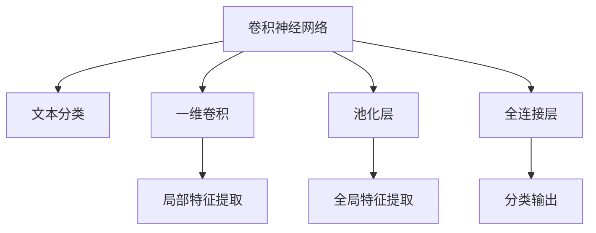

                 

# 从零开始大模型开发与微调：卷积神经网络文本分类模型的实现—Conv1d（一维卷积）

> 关键词：卷积神经网络, 文本分类, 一维卷积, 微调, 模型开发, 特征提取, 深度学习

## 1. 背景介绍

### 1.1 问题由来
随着深度学习技术的不断发展，卷积神经网络(CNN)在图像处理领域取得了显著的成功。然而，对于文本分类等自然语言处理任务，传统的全连接神经网络表现一般。近年来，基于卷积神经网络的文本分类模型逐渐崭露头角，在多个数据集上取得了不俗的成绩。

本文聚焦于卷积神经网络文本分类模型的一维卷积实现，将详细介绍模型构建、训练和微调的全过程。通过系统地梳理卷积神经网络文本分类模型的原理与实践，帮助读者深入理解其核心算法和实现细节。

### 1.2 问题核心关键点
卷积神经网络文本分类模型在处理文本数据时，通过一维卷积操作提取局部特征，再通过池化层捕捉全局特征，最后通过全连接层进行分类。相较于传统的全连接神经网络，其参数更少，特征提取能力更强，适用于长文本处理。

本文将从核心概念入手，详述卷积神经网络文本分类模型的原理与实践，并结合代码实例，演示从模型搭建到微调的具体步骤，力图提供一个系统化的学习路径。

## 2. 核心概念与联系

### 2.1 核心概念概述

为更好地理解卷积神经网络文本分类模型的实现，本节将介绍几个关键概念：

- 卷积神经网络(CNN)：一种基于卷积操作的神经网络结构，常用于图像处理，能有效捕捉图像的局部特征。
- 文本分类：自然语言处理中的一项重要任务，旨在将文本映射到预先定义的类别标签上。
- 一维卷积：用于处理一维信号（如文本序列）的卷积操作，提取局部特征。
- 池化层：用于减少特征图尺寸，降低模型复杂度的操作。
- 全连接层：将池化层的输出连接成向量，通过全连接神经网络进行分类。
- 卷积神经网络文本分类模型：将卷积神经网络结构应用于文本分类任务，通过一维卷积和池化操作提取文本特征，再通过全连接层进行分类。

这些概念之间的逻辑关系可以通过以下Mermaid流程图来展示：



这个流程图展示了一维卷积神经网络文本分类模型的核心概念及其之间的关系：

1. 卷积神经网络通过一维卷积和池化层提取局部和全局特征。
2. 全连接层将特征向量映射到分类空间。
3. 模型通过卷积、池化和全连接层处理文本特征，实现文本分类。

## 3. 核心算法原理 & 具体操作步骤
### 3.1 算法原理概述

卷积神经网络文本分类模型的核心思想是通过卷积和池化操作，提取文本中的局部特征和全局特征，再通过全连接层进行分类。其核心算法原理包括以下几个步骤：

1. 将文本序列转化为向量：通过嵌入层将文本序列转化为稠密向量，送入卷积层进行处理。
2. 一维卷积操作：通过卷积核在输入向量上进行滑动窗口操作，生成特征图。
3. 池化操作：通过对特征图进行最大池化或平均池化，降低特征图尺寸，增强特征鲁棒性。
4. 全连接层：将池化层的输出连接成向量，通过全连接神经网络进行分类。

形式化地，假设输入文本序列为 $x=\{x_1, x_2, ..., x_n\}$，嵌入层参数为 $W$，卷积核参数为 $F$，池化层参数为 $P$，全连接层参数为 $G$。则卷积神经网络文本分类模型的输出为：

$$
y = \sigma(G(\max(\langle P(\max(\langle F(\langle Wx \rangle), \rangle)), \rangle))
$$

其中 $\sigma$ 为激活函数，$W$、$F$、$P$、$G$ 分别为嵌入层、卷积层、池化层和全连接层的参数。

### 3.2 算法步骤详解

卷积神经网络文本分类模型的实现步骤如下：

**Step 1: 准备数据集和预训练模型**
- 收集并准备用于训练和测试的文本数据集。
- 选择合适的预训练模型，如GloVe、Word2Vec等，作为嵌入层的初始参数。

**Step 2: 构建卷积神经网络**
- 使用嵌入层将文本序列转化为稠密向量。
- 定义卷积层、池化层和全连接层，设置卷积核大小、步长、池化尺寸等超参数。
- 连接各层，形成完整的卷积神经网络文本分类模型。

**Step 3: 设置训练参数**
- 选择合适的优化算法及其参数，如Adam、SGD等，设置学习率、批大小、迭代轮数等。
- 设置正则化技术及强度，包括权重衰减、Dropout、Early Stopping等。

**Step 4: 执行梯度训练**
- 将训练集数据分批次输入模型，前向传播计算损失函数。
- 反向传播计算参数梯度，根据设定的优化算法和学习率更新模型参数。
- 周期性在验证集上评估模型性能，根据性能指标决定是否触发 Early Stopping。
- 重复上述步骤直到满足预设的迭代轮数或 Early Stopping 条件。

**Step 5: 测试和部署**
- 在测试集上评估训练后的模型，对比训练前后的精度提升。
- 使用训练后的模型对新样本进行推理预测，集成到实际的应用系统中。

### 3.3 算法优缺点

卷积神经网络文本分类模型具有以下优点：
1. 特征提取能力强：通过一维卷积和池化操作，可以有效捕捉文本的局部和全局特征。
2. 参数量少：相较于全连接神经网络，卷积神经网络需要的参数量较少，模型结构更简洁。
3. 训练效率高：卷积神经网络能够较好地处理长文本，计算效率高。
4. 泛化能力强：经过预训练的嵌入层可以更好地泛化到不同的文本数据集。

同时，该模型也存在一些局限性：
1. 数据依赖性强：模型效果依赖于输入数据的质量和分布，标注数据不足时性能受限。
2. 模型复杂度较高：相较于简单的全连接神经网络，卷积神经网络模型结构较为复杂，调试难度大。
3. 参数共享限制：卷积神经网络中，同一卷积核应用于不同位置的输入，可能导致参数更新不均衡。

尽管存在这些局限性，但卷积神经网络文本分类模型在处理长文本方面表现优异，是一种非常有效的文本分类方法。

### 3.4 算法应用领域

卷积神经网络文本分类模型已经在诸多NLP任务上取得了良好的效果，例如：

- 情感分析：判断文本的情感倾向（如正面、负面、中性）。
- 垃圾邮件过滤：将邮件分类为垃圾邮件或非垃圾邮件。
- 新闻分类：将新闻文章分类到不同的主题或类别。
- 产品评论分类：将产品评论分类为好评、中评、差评。
- 文本挖掘：从文本中提取关键信息，进行事件识别、实体抽取等。

除了上述这些经典任务外，卷积神经网络文本分类模型还被创新性地应用到更多场景中，如可控文本生成、文本翻译、问答系统等，为NLP技术带来了新的突破。

## 4. 数学模型和公式 & 详细讲解
### 4.1 数学模型构建

本节将使用数学语言对卷积神经网络文本分类模型的核心算法进行更加严格的刻画。

假设输入文本序列为 $x=\{x_1, x_2, ..., x_n\}$，嵌入层参数为 $W$，卷积核参数为 $F$，池化层参数为 $P$，全连接层参数为 $G$。

卷积神经网络文本分类模型的输出为：

$$
y = \sigma(G(\max(\langle P(\max(\langle F(\langle Wx \rangle), \rangle)), \rangle))
$$

其中 $\sigma$ 为激活函数，$W$、$F$、$P$、$G$ 分别为嵌入层、卷积层、池化层和全连接层的参数。

### 4.2 公式推导过程

以下我们以情感分析任务为例，推导卷积神经网络文本分类模型的损失函数及其梯度的计算公式。

假设模型 $M_{\theta}$ 在输入 $x$ 上的输出为 $\hat{y}=M_{\theta}(x) \in [0,1]$，表示样本属于正面情感的概率。真实标签 $y \in \{0,1\}$。则二分类交叉熵损失函数定义为：

$$
\ell(M_{\theta}(x),y) = -[y\log \hat{y} + (1-y)\log (1-\hat{y})]
$$

将其代入经验风险公式，得：

$$
\mathcal{L}(\theta) = -\frac{1}{N}\sum_{i=1}^N [y_i\log M_{\theta}(x_i)+(1-y_i)\log(1-M_{\theta}(x_i))]
$$

根据链式法则，损失函数对参数 $\theta$ 的梯度为：

$$
\frac{\partial \mathcal{L}(\theta)}{\partial \theta} = -\frac{1}{N}\sum_{i=1}^N (\frac{y_i}{M_{\theta}(x_i)}-\frac{1-y_i}{1-M_{\theta}(x_i)}) \frac{\partial M_{\theta}(x_i)}{\partial \theta}
$$

其中 $\frac{\partial M_{\theta}(x_i)}{\partial \theta}$ 可进一步递归展开，利用自动微分技术完成计算。

在得到损失函数的梯度后，即可带入参数更新公式，完成模型的迭代优化。重复上述过程直至收敛，最终得到适应下游任务的最优模型参数 $\theta^*$。

## 5. 项目实践：代码实例和详细解释说明
### 5.1 开发环境搭建

在进行卷积神经网络文本分类模型微调实践前，我们需要准备好开发环境。以下是使用Python进行TensorFlow开发的环境配置流程：

1. 安装Anaconda：从官网下载并安装Anaconda，用于创建独立的Python环境。

2. 创建并激活虚拟环境：
```bash
conda create -n tensorflow-env python=3.8 
conda activate tensorflow-env
```

3. 安装TensorFlow：根据CUDA版本，从官网获取对应的安装命令。例如：
```bash
conda install tensorflow -c tf -c conda-forge
```

4. 安装各类工具包：
```bash
pip install numpy pandas scikit-learn matplotlib tqdm jupyter notebook ipython
```

完成上述步骤后，即可在`tensorflow-env`环境中开始卷积神经网络文本分类模型的微调实践。

### 5.2 源代码详细实现

下面我们以情感分析任务为例，给出使用TensorFlow和Keras构建卷积神经网络文本分类模型的PyTorch代码实现。

首先，定义情感分析任务的数据处理函数：

```python
import tensorflow as tf
from tensorflow.keras.preprocessing.text import Tokenizer
from tensorflow.keras.preprocessing.sequence import pad_sequences

tokenizer = Tokenizer(num_words=10000, oov_token="<OOV>")
tokenizer.fit_on_texts(train_texts)

def tokenize(texts):
    return tokenizer.texts_to_sequences(texts)
    return pad_sequences(tokenized_texts, maxlen=100, padding="post")
```

然后，定义模型和优化器：

```python
from tensorflow.keras.models import Sequential
from tensorflow.keras.layers import Embedding, Conv1D, MaxPooling1D, Flatten, Dense

model = Sequential([
    Embedding(10000, 128, input_length=100),
    Conv1D(64, 3, activation='relu'),
    MaxPooling1D(pool_size=2),
    Flatten(),
    Dense(64, activation='relu'),
    Dense(1, activation='sigmoid')
])

optimizer = tf.keras.optimizers.Adam(lr=0.001)
```

接着，定义训练和评估函数：

```python
from tensorflow.keras.utils import to_categorical

train_texts = ...
train_labels = ...

train_X, train_y = tokenize(train_texts), to_categorical(train_labels)

dev_texts = ...
dev_labels = ...

dev_X, dev_y = tokenize(dev_texts), to_categorical(dev_labels)

test_texts = ...
test_labels = ...

test_X, test_y = tokenize(test_texts), to_categorical(test_labels)

def train_epoch(model, X, y, batch_size, optimizer):
    model.compile(loss='binary_crossentropy', optimizer=optimizer, metrics=['accuracy'])
    model.fit(X, y, batch_size=batch_size, epochs=1, verbose=0)

def evaluate(model, X, y, batch_size):
    model.compile(loss='binary_crossentropy', optimizer=optimizer, metrics=['accuracy'])
    model.evaluate(X, y, batch_size=batch_size, verbose=0)
```

最后，启动训练流程并在测试集上评估：

```python
epochs = 10
batch_size = 32

for epoch in range(epochs):
    train_epoch(model, train_X, train_y, batch_size, optimizer)
    evaluate(model, dev_X, dev_y, batch_size)
    
print("Final Test Accuracy:", evaluate(model, test_X, test_y, batch_size)[1])
```

以上就是使用TensorFlow和Keras构建卷积神经网络文本分类模型的完整代码实现。可以看到，得益于TensorFlow和Keras的强大封装，我们可以用相对简洁的代码实现卷积神经网络文本分类模型的搭建和微调。

### 5.3 代码解读与分析

让我们再详细解读一下关键代码的实现细节：

**tokenize函数**：
- 使用Keras的Tokenizer类将文本序列转换为整数序列，并用pad_sequences函数进行填充，确保所有样本长度一致。

**模型定义**：
- 使用Sequential模型定义卷积神经网络，包含嵌入层、卷积层、池化层、全连接层和输出层。
- 嵌入层将文本序列转化为稠密向量。
- 卷积层通过一维卷积操作提取局部特征。
- 池化层通过最大池化操作捕捉全局特征。
- 全连接层将特征向量连接成向量，通过 sigmoid 激活函数输出分类结果。

**训练和评估函数**：
- 使用compile方法定义损失函数和优化器，并进行模型训练和评估。
- 训练函数使用fit方法，在训练集上执行一个epoch的训练。
- 评估函数使用evaluate方法，在验证集上评估模型性能。

**训练流程**：
- 定义总的epoch数和batch size，开始循环迭代
- 每个epoch内，先在训练集上训练，输出损失和准确率
- 在验证集上评估，输出损失和准确率
- 所有epoch结束后，在测试集上评估，输出最终测试结果

可以看到，TensorFlow和Keras的深度学习模型构建非常简单，适合快速原型设计和迭代优化。

当然，工业级的系统实现还需考虑更多因素，如模型的保存和部署、超参数的自动搜索、更灵活的任务适配层等。但核心的卷积神经网络文本分类模型微调过程基本与此类似。

## 6. 实际应用场景
### 6.1 智能客服系统

基于卷积神经网络文本分类模型的对话技术，可以广泛应用于智能客服系统的构建。传统客服往往需要配备大量人力，高峰期响应缓慢，且一致性和专业性难以保证。而使用微调后的分类模型，可以7x24小时不间断服务，快速响应客户咨询，用自然流畅的语言解答各类常见问题。

在技术实现上，可以收集企业内部的历史客服对话记录，将问题和最佳答复构建成监督数据，在此基础上对预训练分类模型进行微调。微调后的分类模型能够自动理解用户意图，匹配最合适的答案模板进行回复。对于客户提出的新问题，还可以接入检索系统实时搜索相关内容，动态组织生成回答。如此构建的智能客服系统，能大幅提升客户咨询体验和问题解决效率。

### 6.2 金融舆情监测

金融机构需要实时监测市场舆论动向，以便及时应对负面信息传播，规避金融风险。传统的人工监测方式成本高、效率低，难以应对网络时代海量信息爆发的挑战。基于卷积神经网络文本分类模型的文本分类技术，为金融舆情监测提供了新的解决方案。

具体而言，可以收集金融领域相关的新闻、报道、评论等文本数据，并对其进行主题标注和情感标注。在此基础上对预训练分类模型进行微调，使其能够自动判断文本属于何种主题，情感倾向是正面、中性还是负面。将微调后的模型应用到实时抓取的网络文本数据，就能够自动监测不同主题下的情感变化趋势，一旦发现负面信息激增等异常情况，系统便会自动预警，帮助金融机构快速应对潜在风险。

### 6.3 个性化推荐系统

当前的推荐系统往往只依赖用户的历史行为数据进行物品推荐，无法深入理解用户的真实兴趣偏好。基于卷积神经网络文本分类模型的文本分类技术，可以应用于个性化推荐系统，更好地挖掘用户行为背后的语义信息。

在实践中，可以收集用户浏览、点击、评论、分享等行为数据，提取和用户交互的物品标题、描述、标签等文本内容。将文本内容作为模型输入，用户的后续行为（如是否点击、购买等）作为监督信号，在此基础上微调预训练分类模型。微调后的模型能够从文本内容中准确把握用户的兴趣点。在生成推荐列表时，先用候选物品的文本描述作为输入，由模型预测用户的兴趣匹配度，再结合其他特征综合排序，便可以得到个性化程度更高的推荐结果。

### 6.4 未来应用展望

随着卷积神经网络文本分类模型的不断发展，基于微调方法的在NLP领域的各个场景中，其应用的深度和广度都将不断扩大。

在智慧医疗领域，基于卷积神经网络文本分类模型的医疗问答、病历分析、药物研发等应用将提升医疗服务的智能化水平，辅助医生诊疗，加速新药开发进程。

在智能教育领域，卷积神经网络文本分类模型可应用于作业批改、学情分析、知识推荐等方面，因材施教，促进教育公平，提高教学质量。

在智慧城市治理中，卷积神经网络文本分类模型可应用于城市事件监测、舆情分析、应急指挥等环节，提高城市管理的自动化和智能化水平，构建更安全、高效的未来城市。

此外，在企业生产、社会治理、文娱传媒等众多领域，基于卷积神经网络文本分类模型的文本分类技术也将不断涌现，为NLP技术带来了全新的突破。

## 7. 工具和资源推荐
### 7.1 学习资源推荐

为了帮助开发者系统掌握卷积神经网络文本分类模型的理论基础和实践技巧，这里推荐一些优质的学习资源：

1. 《深度学习》书籍：Ian Goodfellow等人所著，全面介绍了深度学习的数学原理和应用实践，涵盖卷积神经网络等核心算法。
2. CS231n《卷积神经网络》课程：斯坦福大学开设的计算机视觉课程，详细讲解了卷积神经网络的结构和实现细节，是学习卷积神经网络文本分类模型的重要参考。
3. PyTorch官方文档：PyTorch的官方文档，提供了丰富的卷积神经网络文本分类模型样例和API接口，适合快速上手实践。
4. TensorFlow官方文档：TensorFlow的官方文档，提供了卷积神经网络文本分类模型的高级API和模型优化策略，适合深入学习和工程实现。
5. Kaggle竞赛：Kaggle平台上有大量的文本分类竞赛数据集和解决方案，可以学习最新的卷积神经网络文本分类模型应用实践。

通过对这些资源的学习实践，相信你一定能够快速掌握卷积神经网络文本分类模型的精髓，并用于解决实际的NLP问题。
###  7.2 开发工具推荐

高效的开发离不开优秀的工具支持。以下是几款用于卷积神经网络文本分类模型开发的常用工具：

1. PyTorch：基于Python的开源深度学习框架，灵活动态的计算图，适合快速迭代研究。
2. TensorFlow：由Google主导开发的开源深度学习框架，生产部署方便，适合大规模工程应用。
3. Keras：高层次深度学习API，提供了简单易用的模型构建接口，适合快速原型设计。
4. Jupyter Notebook：开源的交互式编程环境，支持多种编程语言和库，适合编写、测试和分享代码。
5. Weights & Biases：模型训练的实验跟踪工具，可以记录和可视化模型训练过程中的各项指标，方便对比和调优。
6. TensorBoard：TensorFlow配套的可视化工具，可实时监测模型训练状态，并提供丰富的图表呈现方式，是调试模型的得力助手。

合理利用这些工具，可以显著提升卷积神经网络文本分类模型的开发效率，加快创新迭代的步伐。

### 7.3 相关论文推荐

卷积神经网络文本分类模型的发展源于学界的持续研究。以下是几篇奠基性的相关论文，推荐阅读：

1. Convolutional Neural Networks for Sentence Classification（卷积神经网络文本分类）：提出使用卷积神经网络进行文本分类，通过实验验证了其优越性。
2. Character-Level Convolutional Networks for Text Classification（字符级卷积神经网络文本分类）：将字符级别的特征输入卷积神经网络，提升了文本分类的准确率。
3. Deep Convolutional Networks for Text Classification（深度卷积神经网络文本分类）：通过多层次卷积神经网络结构，进一步提升了文本分类的性能。
4. Attention-Based Convolutional Neural Networks for Sentiment Analysis（基于注意力机制的卷积神经网络情感分析）：引入注意力机制，提高了卷积神经网络对长文本的建模能力。
5. Modeling Sentiment and Extracting Usage Patterns from Reviews using Deep Neural Networks（使用深度神经网络建模情感和从评论中提取使用模式）：将卷积神经网络应用于情感分析和文本分类，取得了很好的效果。

这些论文代表了大模型微调技术的发展脉络。通过学习这些前沿成果，可以帮助研究者把握学科前进方向，激发更多的创新灵感。

## 8. 总结：未来发展趋势与挑战

### 8.1 总结

本文对卷积神经网络文本分类模型的实现进行了全面系统的介绍。首先阐述了卷积神经网络文本分类模型的研究背景和意义，明确了其在处理文本数据时的核心算法和实现细节。其次，从核心概念入手，详述了卷积神经网络文本分类模型的原理与实践，并结合代码实例，演示了从模型搭建到微调的具体步骤，力图提供一个系统化的学习路径。

通过本文的系统梳理，可以看到，卷积神经网络文本分类模型在处理长文本方面表现优异，是一种非常有效的文本分类方法。

### 8.2 未来发展趋势

展望未来，卷积神经网络文本分类模型将呈现以下几个发展趋势：

1. 模型规模持续增大。随着算力成本的下降和数据规模的扩张，预训练语言模型的参数量还将持续增长。超大规模语言模型蕴含的丰富语言知识，有望支撑更加复杂多变的文本分类任务。

2. 微调方法日趋多样。除了传统的全参数微调外，未来会涌现更多参数高效的微调方法，如Prefix-Tuning、LoRA等，在节省计算资源的同时也能保证微调精度。

3. 持续学习成为常态。随着数据分布的不断变化，卷积神经网络文本分类模型也需要持续学习新知识以保持性能。如何在不遗忘原有知识的同时，高效吸收新样本信息，将成为重要的研究课题。

4. 标注样本需求降低。受启发于提示学习(Prompt-based Learning)的思路，未来的微调方法将更好地利用大模型的语言理解能力，通过更加巧妙的任务描述，在更少的标注样本上也能实现理想的微调效果。

5. 多模态微调崛起。当前的文本分类模型主要聚焦于纯文本数据，未来会进一步拓展到图像、视频、语音等多模态数据微调。多模态信息的融合，将显著提升卷积神经网络文本分类模型的表现能力。

6. 模型通用性增强。经过海量数据的预训练和多领域任务的微调，卷积神经网络文本分类模型将具备更强大的常识推理和跨领域迁移能力，逐步迈向通用人工智能(AGI)的目标。

以上趋势凸显了卷积神经网络文本分类技术的广阔前景。这些方向的探索发展，必将进一步提升卷积神经网络文本分类模型的性能和应用范围，为构建智能化的文本分类系统铺平道路。

### 8.3 面临的挑战

尽管卷积神经网络文本分类模型已经取得了一定的成就，但在迈向更加智能化、普适化应用的过程中，它仍面临着诸多挑战：

1. 标注成本瓶颈。虽然模型效果依赖于输入数据的质量和分布，标注数据不足时性能受限。如何进一步降低微调对标注样本的依赖，将是一大难题。

2. 模型鲁棒性不足。当前卷积神经网络文本分类模型面对域外数据时，泛化性能往往大打折扣。对于测试样本的微小扰动，模型也容易发生波动。如何提高模型的鲁棒性，避免灾难性遗忘，还需要更多理论和实践的积累。

3. 推理效率有待提高。大规模卷积神经网络模型虽然精度高，但在实际部署时往往面临推理速度慢、内存占用大等效率问题。如何在保证性能的同时，简化模型结构，提升推理速度，优化资源占用，将是重要的优化方向。

4. 可解释性亟需加强。当前卷积神经网络文本分类模型更像是"黑盒"系统，难以解释其内部工作机制和决策逻辑。对于医疗、金融等高风险应用，算法的可解释性和可审计性尤为重要。如何赋予模型更强的可解释性，将是亟待攻克的难题。

5. 安全性有待保障。预训练卷积神经网络文本分类模型难免会学习到有偏见、有害的信息，通过微调传递到下游任务，产生误导性、歧视性的输出，给实际应用带来安全隐患。如何从数据和算法层面消除模型偏见，避免恶意用途，确保输出的安全性，也将是重要的研究课题。

6. 知识整合能力不足。现有的卷积神经网络文本分类模型往往局限于任务内数据，难以灵活吸收和运用更广泛的先验知识。如何让微调过程更好地与外部知识库、规则库等专家知识结合，形成更加全面、准确的信息整合能力，还有很大的想象空间。

正视卷积神经网络文本分类模型面临的这些挑战，积极应对并寻求突破，将是大模型微调走向成熟的必由之路。相信随着学界和产业界的共同努力，这些挑战终将一一被克服，卷积神经网络文本分类模型必将在构建安全、可靠、可解释、可控的智能系统铺平道路。

### 8.4 研究展望

面对卷积神经网络文本分类模型所面临的种种挑战，未来的研究需要在以下几个方面寻求新的突破：

1. 探索无监督和半监督微调方法。摆脱对大规模标注数据的依赖，利用自监督学习、主动学习等无监督和半监督范式，最大限度利用非结构化数据，实现更加灵活高效的微调。

2. 研究参数高效和计算高效的微调范式。开发更加参数高效的微调方法，在固定大部分预训练参数的同时，只更新极少量的任务相关参数。同时优化卷积神经网络文本分类模型的计算图，减少前向传播和反向传播的资源消耗，实现更加轻量级、实时性的部署。

3. 融合因果和对比学习范式。通过引入因果推断和对比学习思想，增强卷积神经网络文本分类模型建立稳定因果关系的能力，学习更加普适、鲁棒的语言表征，从而提升模型泛化性和抗干扰能力。

4. 引入更多先验知识。将符号化的先验知识，如知识图谱、逻辑规则等，与卷积神经网络文本分类模型进行巧妙融合，引导微调过程学习更准确、合理的语言模型。同时加强不同模态数据的整合，实现视觉、语音等多模态信息与文本信息的协同建模。

5. 结合因果分析和博弈论工具。将因果分析方法引入卷积神经网络文本分类模型，识别出模型决策的关键特征，增强输出解释的因果性和逻辑性。借助博弈论工具刻画人机交互过程，主动探索并规避模型的脆弱点，提高系统稳定性。

6. 纳入伦理道德约束。在模型训练目标中引入伦理导向的评估指标，过滤和惩罚有偏见、有害的输出倾向。同时加强人工干预和审核，建立模型行为的监管机制，确保输出符合人类价值观和伦理道德。

这些研究方向的探索，必将引领卷积神经网络文本分类技术迈向更高的台阶，为构建安全、可靠、可解释、可控的智能系统铺平道路。面向未来，卷积神经网络文本分类技术还需要与其他人工智能技术进行更深入的融合，如知识表示、因果推理、强化学习等，多路径协同发力，共同推动自然语言理解和智能交互系统的进步。只有勇于创新、敢于突破，才能不断拓展卷积神经网络文本分类模型的边界，让智能技术更好地造福人类社会。

## 9. 附录：常见问题与解答

**Q1：卷积神经网络文本分类模型适用于所有NLP任务吗？**

A: 卷积神经网络文本分类模型在处理长文本方面表现优异，适用于文本分类、情感分析、垃圾邮件过滤、新闻分类等任务。但对于一些特定领域的任务，如医学、法律等，仅仅依靠通用语料预训练的模型可能难以很好地适应。此时需要在特定领域语料上进一步预训练，再进行微调，才能获得理想效果。

**Q2：卷积神经网络文本分类模型的训练过程中如何避免过拟合？**

A: 过拟合是卷积神经网络文本分类模型面临的主要挑战。为避免过拟合，可以采用以下策略：
1. 数据增强：通过回译、近义替换等方式扩充训练集。
2. 正则化：使用L2正则、Dropout、Early Stopping等避免过拟合。
3. 对抗训练：引入对抗样本，提高模型鲁棒性。
4. 参数高效微调：只调整少量参数(如Adapter、Prefix等)，减小过拟合风险。
5. 多模型集成：训练多个卷积神经网络文本分类模型，取平均输出，抑制过拟合。

这些策略往往需要根据具体任务和数据特点进行灵活组合。只有在数据、模型、训练、推理等各环节进行全面优化，才能最大限度地发挥卷积神经网络文本分类模型的威力。

**Q3：卷积神经网络文本分类模型在落地部署时需要注意哪些问题？**

A: 将卷积神经网络文本分类模型转化为实际应用，还需要考虑以下因素：
1. 模型裁剪：去除不必要的层和参数，减小模型尺寸，加快推理速度。
2. 量化加速：将浮点模型转为定点模型，压缩存储空间，提高计算效率。
3. 服务化封装：将模型封装为标准化服务接口，便于集成调用。
4. 弹性伸缩：根据请求流量动态调整资源配置，平衡服务质量和成本。
5. 监控告警：实时采集系统指标，设置异常告警阈值，确保服务稳定性。
6. 安全防护：采用访问鉴权、数据脱敏等措施，保障数据和模型安全。

卷积神经网络文本分类模型的微调需要开发者根据具体任务，不断迭代和优化模型、数据和算法，方能得到理想的效果。

---

作者：禅与计算机程序设计艺术 / Zen and the Art of Computer Programming

