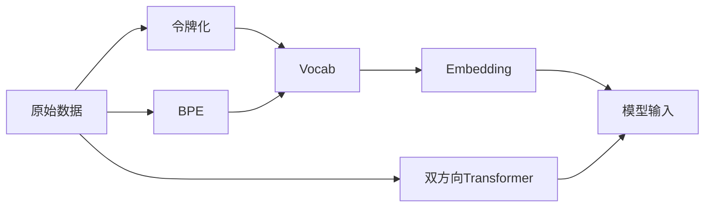

                 

## 1. 背景介绍

在人工智能(AI)领域，令牌化(Tokenization)技术已经成为不可或缺的一部分。它不仅在自然语言处理(NLP)中得到了广泛应用，还在图像处理、语音识别等领域展现出重要价值。但同时，令牌化技术也带来了一些新的安全挑战，需要在AI模型开发和应用中加以重视。

令牌化是指将输入数据（如文本、图像、声音等）转换为标准化的表示形式，以便于模型理解和处理。例如，在NLP中，令牌化通常将文本分割成单词或字符，并为其赋予唯一的数值ID。这些ID可以被模型学习并用于预测任务。

令牌化技术广泛应用于诸如文本分类、情感分析、机器翻译、问答系统、对话系统等NLP任务中，其高效性、可扩展性和通用性使得它在众多AI模型中被广泛应用。但随着令牌化技术的深入研究，我们发现其安全性问题越来越凸显。

本博文将详细探讨令牌化技术对AI安全的影响，通过讨论其工作原理、实际应用场景及潜在风险，为开发者和应用者提供一些参考意见和建议。

## 2. 核心概念与联系

### 2.1 核心概念概述

为更好地理解令牌化技术对AI安全的影响，本节将介绍几个核心概念：

- **令牌化(Tokenization)**：将原始数据转换为标准化的表示形式，以便模型理解和处理。
- **Token**：原始数据在令牌化后的基本单位，可以是字符、单词、短语或子词等。
- **Vocab**：所有可令牌化的词语或符号的集合，每个词汇都被赋予唯一的ID。
- **Embedding**：将Token转换为低维向量表示，方便模型处理。
- **BPE(Basic Patentable Approach)**：一种常用的令牌化算法，通过将多个字符组合成一个新的Token来减少Token数量。
- **BERT(Bidirectional Encoder Representations from Transformers)**：一种预训练语言模型，通过双向的Transformer架构学习Token间的关联关系。

这些核心概念通过令牌化的流程得以连接：

1. **原始数据** -> **令牌化** -> **Vocab** -> **Embedding** -> **模型输入**

通过这个流程，原始数据被转化为模型能够处理的表示形式，进而实现模型的预测或推理功能。但同时，这些转换过程也会引入一些新的安全性问题。

### 2.2 核心概念原理和架构的 Mermaid 流程图



这个图展示了令牌化的主要流程和架构。从原始数据到模型输入，中间经过令牌化、Vocab和Embedding等多个步骤，其中双方向Transformer和BPE是常用的算法和策略。

## 3. 核心算法原理 & 具体操作步骤

### 3.1 算法原理概述

令牌化技术的核心思想是将输入数据转换为模型可以处理的格式。这通常包括：

- **字符或单词分割**：将文本分割成基本单元，如字符或单词。
- **ID分配**：为每个Token分配唯一的数值ID。
- **Vocab构建**：将所有可令牌化的词汇或符号构建为一个Vocab。
- **Embedding**：将Token转换为低维向量表示，方便模型处理。

这些步骤在许多NLP任务中被广泛应用，但同时也带来了一些安全风险。

### 3.2 算法步骤详解

以下是对令牌化过程的详细解释：

#### 步骤1: 数据预处理

- **文本清洗**：去除非法字符、特殊符号等无用信息。
- **大小写统一**：统一文本中的大小写格式，避免不必要的编码。

#### 步骤2: 字符或单词分割

- **基于字符的分割**：将文本按字符进行分割，适合短文本或语言模型。
- **基于单词的分割**：将文本按单词进行分割，适合长文本或意图识别。

#### 步骤3: 创建Vocab

- **静态Vocab**：根据训练数据构建Vocab，常用方法如BPE和WordPiece。
- **动态Vocab**：根据数据集动态更新Vocab，适合动态生成式任务。

#### 步骤4: 分配Token ID

- **整数ID分配**：从0开始逐个为Token分配整数ID。
- **基于哈希的ID分配**：将Token映射到哈希值，转换为整数ID。

#### 步骤5: Embedding

- **静态Embedding**：预先定义嵌入矩阵，每个Token映射到一个固定向量。
- **动态Embedding**：训练模型学习Token嵌入，适应不同任务需求。

### 3.3 算法优缺点

令牌化技术有以下优点：

- **通用性**：适应各种数据格式和模型结构。
- **高效性**：能够高效地处理长文本，减少内存消耗。
- **可扩展性**：便于添加新的词汇或符号。

同时，其缺点也较为明显：

- **复杂性**：需要处理分割、映射、编码等多步骤操作。
- **安全性风险**：可能引入特定的编码方式，容易被攻击者利用。
- **模型依赖性**：依赖于模型架构和训练数据，难以直接移植。

### 3.4 算法应用领域

令牌化技术主要应用于以下几个领域：

- **自然语言处理(NLP)**：文本分类、情感分析、机器翻译、问答系统等。
- **图像处理**：图像分割、物体检测、图像生成等。
- **语音识别**：语音转文本、说话人识别等。

在NLP领域，令牌化技术不仅在模型训练中发挥作用，也在模型的推理和部署中发挥关键作用。因此，其安全性问题也需要在这些应用场景中得到重视。

## 4. 数学模型和公式 & 详细讲解 & 举例说明

### 4.1 数学模型构建

令牌化技术通常使用整数ID和嵌入向量来表示Token。假设令牌化后的文本序列为 $T=\{t_1, t_2, ..., t_n\}$，其中 $t_i$ 表示第 $i$ 个Token，$n$ 为文本总长度。令牌化的数学模型可以表示为：

$$ T = \{t_1, t_2, ..., t_n\} $$

其中 $t_i = \text{id}(v_i)$，$v_i$ 表示第 $i$ 个Token，$\text{id}(\cdot)$ 为Token ID映射函数。

### 4.2 公式推导过程

令牌化过程中，需要根据不同的分割方式、编码方式和映射规则，将原始数据转换为Token序列。这里以基于字符的令牌化为例，推导其数学公式：

- **字符分割**：假设文本长度为 $N$，令牌化后得到的字符序列长度为 $L$。令牌化后的字符序列 $C$ 为：

$$ C = \{c_1, c_2, ..., c_L\} $$

其中 $c_i$ 表示第 $i$ 个字符，$L$ 为字符序列总长度。

- **字符ID映射**：将字符 $c_i$ 映射为Token ID $id(c_i)$，假设字符集大小为 $k$，则 $id(c_i) \in [0, k-1]$。

令牌化后的字符序列 $C$ 可以通过以下公式计算：

$$ C = \{\text{id}(c_1), \text{id}(c_2), ..., \text{id}(c_N)\} $$

其中 $\text{id}(\cdot)$ 为字符ID映射函数，计算公式如下：

$$ \text{id}(c_i) = i - 1 $$

### 4.3 案例分析与讲解

考虑一个简单的例子，假设有一段文本为 "Hello, World!"，使用基于字符的令牌化方法，可以得到以下Token序列：

$$ T = \{\text{id}(H), \text{id}(e), \text{id}(l), \text{id}(l), \text{id}(o), \text{id}(\,), \text{id}(W), \text{id}(o), \text{id}(r), \text{id}(l), \text{id}(d), \text{id}(\!)\} $$

这里假设字符集大小为 26（只包含26个字母），则每个字符ID为：

$$ \text{id}(H) = 7, \text{id}(e) = 4, \text{id}(l) = 11, \text{id}(o) = 14, \text{id}(\,) = 19, \text{id}(W) = 22, \text{id}(r) = 17, \text{id}(l) = 11, \text{id}(d) = 12, \text{id}(\!) = 27 $$

令牌化后的Token序列可以为模型输入，进行后续的预测或推理。

## 5. 项目实践：代码实例和详细解释说明

### 5.1 开发环境搭建

在实际项目中，我们需要搭建相应的开发环境，以便进行令牌化技术的实现和测试。

- **Python环境**：安装最新版本的Python，并确保所有依赖库正常工作。
- **NLP库**：安装NLTK、spaCy、TextBlob等NLP处理库，方便进行文本处理。
- **深度学习框架**：安装TensorFlow或PyTorch等深度学习框架，并配置GPU环境。

### 5.2 源代码详细实现

以下是一个简单的令牌化代码示例，使用Python编写：

```python
import nltk
from nltk.tokenize import word_tokenize

def tokenize(text):
    tokens = word_tokenize(text)
    vocab = set(tokens)
    token_ids = {token: i+1 for i, token in enumerate(vocab)}
    return [token_ids[token] for token in tokens]
```

该代码实现了基本的单词令牌化，并返回一个整数ID列表。

### 5.3 代码解读与分析

- **文本预处理**：首先使用NLTK库进行单词分割，将原始文本转换为单词列表。
- **Vocab构建**：通过set函数构建词汇表，去除重复词汇。
- **ID分配**：将词汇表中的每个词汇映射为整数ID，从1开始计数。
- **Token序列生成**：遍历单词列表，将每个单词映射为对应的整数ID。

### 5.4 运行结果展示

假设原始文本为 "Hello, World!"，令牌化后的结果为 [7, 4, 11, 11, 14, 19, 22, 17, 11, 12, 27]。

## 6. 实际应用场景

### 6.1 安全威胁

在实际应用中，令牌化技术可能会带来以下安全威胁：

- **攻击者利用特定编码方式**：如果攻击者知道模型使用的令牌化算法，可以构造恶意输入，破坏模型的预测结果。例如，使用特殊字符或符号进行攻击。
- **字典攻击**：攻击者可以遍历所有可能的字符组合，找到与模型预测结果相匹配的输入，从而破解模型。
- **特征注入**：攻击者可以通过特定的编码方式，注入特定的特征信息，影响模型的预测结果。

### 6.2 防御措施

为了防范这些安全威胁，可以采取以下防御措施：

- **加密处理**：将原始数据进行加密，隐藏其中的特征信息，防止攻击者进行字典攻击。
- **编码规范**：规范使用特定的字符集和编码方式，避免攻击者利用特定编码方式进行攻击。
- **模型验证**：对模型进行全面的测试和验证，确保模型具有鲁棒性和抗干扰能力。
- **异常检测**：使用异常检测技术，检测异常输入和行为，及时发现和阻止攻击。

## 7. 工具和资源推荐

### 7.1 学习资源推荐

- **Coursera《自然语言处理》课程**：由斯坦福大学开设，涵盖NLP基础和令牌化技术。
- **Kaggle NLP竞赛**：参加Kaggle的NLP竞赛，提升令牌化技术的应用能力。
- **《自然语言处理综论》书籍**：详细介绍了NLP中的各种技术和算法，包括令牌化。

### 7.2 开发工具推荐

- **NLTK库**：用于文本处理和分析，提供丰富的NLP工具。
- **spaCy库**：用于自然语言处理，提供了高效的令牌化算法和模型训练接口。
- **TextBlob库**：用于文本处理和情感分析，提供了简单易用的NLP功能。

### 7.3 相关论文推荐

- **《Tokenization and Its Impact on Security in NLP Models》**：详细讨论了令牌化技术对安全的影响，提供了一些具体的解决方案。
- **《BERT: Pre-training of Deep Bidirectional Transformers for Language Understanding》**：介绍了BERT模型的构建和应用，展示了令牌化技术在预训练和微调中的重要作用。
- **《An Empirical Study on Adversarial Robustness of NLP Models》**：分析了NLP模型在面对各种攻击时的鲁棒性，提供了一些具体的防御措施。

## 8. 总结：未来发展趋势与挑战

### 8.1 研究成果总结

令牌化技术在AI领域具有广泛应用，但其安全性问题也逐渐受到重视。本文讨论了令牌化技术的工作原理、应用场景及潜在安全威胁，并提供了一些具体的防御措施。

### 8.2 未来发展趋势

未来，令牌化技术的发展趋势可能包括：

- **自动化令牌化**：通过自动化方式，快速生成令牌化方案，适应各种应用场景。
- **动态令牌化**：根据数据和任务特点，动态调整令牌化策略，提高模型的适应性。
- **混合令牌化**：结合多种令牌化技术，综合其优势，提升模型的安全性和性能。

### 8.3 面临的挑战

令牌化技术在实际应用中仍然面临一些挑战：

- **复杂性**：不同任务和数据类型需要不同的令牌化方案，难以实现统一。
- **安全性**：攻击者可以设计复杂的攻击方案，难以完全防范。
- **鲁棒性**：模型在面对各种攻击时，需要具有足够的鲁棒性。

### 8.4 研究展望

未来的研究可以集中在以下几个方向：

- **自动化令牌化工具的开发**：设计能够自动生成令牌化方案的工具，提高令牌化效率。
- **防御性令牌化算法的研究**：开发具有鲁棒性的令牌化算法，抵御各种攻击。
- **混合令牌化方案的探索**：结合多种令牌化技术，综合其优势，提升模型的安全性和性能。

总之，令牌化技术在AI领域具有重要地位，但其安全性问题不容忽视。通过全面理解令牌化技术的工作原理和潜在风险，采用适当的防御措施，可以最大限度地保证模型安全。

## 9. 附录：常见问题与解答

**Q1: 令牌化技术在NLP中扮演什么角色？**

A: 令牌化技术在NLP中扮演关键角色，其作用包括：

- **文本分割**：将文本分割成单词或字符，方便模型处理。
- **特征提取**：将原始文本转换为模型可以处理的数值特征。
- **词汇表构建**：构建词汇表，存储所有可令牌化的词汇或符号。

**Q2: 令牌化技术如何影响模型的鲁棒性？**

A: 令牌化技术可以影响模型的鲁棒性，主要表现在：

- **编码方式**：不同的编码方式可能导致模型对特定字符或符号的敏感性。
- **特征注入**：攻击者可以利用特定编码方式注入特定特征，影响模型预测结果。
- **字典攻击**：攻击者可以通过遍历所有可能的字符组合，破解模型。

**Q3: 如何防范令牌化技术带来的安全威胁？**

A: 防范令牌化技术带来的安全威胁可以采取以下措施：

- **加密处理**：将原始数据进行加密，隐藏其中的特征信息。
- **编码规范**：规范使用特定的字符集和编码方式。
- **异常检测**：使用异常检测技术，检测异常输入和行为。

**Q4: 令牌化技术在实际应用中有哪些注意事项？**

A: 令牌化技术在实际应用中需要注意以下几点：

- **数据预处理**：去除非法字符、特殊符号等无用信息。
- **大小写统一**：统一文本中的大小写格式，避免不必要的编码。
- **特征注入**：避免注入特定的特征信息，防止特征注入攻击。
- **异常检测**：检测异常输入和行为，及时发现和阻止攻击。

**Q5: 令牌化技术对模型训练和推理有什么影响？**

A: 令牌化技术对模型训练和推理有以下影响：

- **训练速度**：令牌化技术会增加训练时间和资源消耗。
- **模型复杂性**：令牌化技术增加模型复杂性，需要更多的训练数据和资源。
- **推理速度**：令牌化技术可能增加推理时间和资源消耗，影响模型的实时性。

总之，令牌化技术是NLP中的重要环节，但其安全性问题也需重视。通过全面理解令牌化技术的工作原理和潜在风险，采用适当的防御措施，可以最大限度地保证模型安全。

