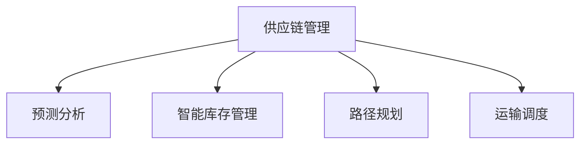

                 

# 优化供应链提升商品供给

在当今的全球化经济中，供应链管理已经成为企业竞争力的核心。良好的供应链管理不仅能提升企业的运营效率，还能增强市场响应速度，降低库存成本，提升客户满意度。然而，随着市场需求的快速变化和不确定性的增加，传统的供应链管理模式面临诸多挑战，亟需通过技术手段进行优化。本文将深入探讨如何利用人工智能技术，尤其是优化算法，来提升供应链的效率和灵活性，从而提升商品供给。

## 1. 背景介绍

### 1.1 问题由来

传统供应链管理模式依赖于大量的人力、物力和时间成本，且对于突发事件和市场波动的响应能力较弱。随着市场需求的快速变化和不确定性的增加，传统供应链管理模式面临诸多挑战。例如，需求预测不准确、库存管理不及时、物流成本高等问题，均会影响企业的市场响应速度和客户满意度。

人工智能技术的迅猛发展，为优化供应链管理提供了新的技术手段。利用大数据、机器学习和优化算法，可以有效提升供应链的预测精度、库存管理效率和物流优化，从而显著提升企业的市场竞争力和客户满意度。

### 1.2 问题核心关键点

优化供应链管理的关键在于提升供应链的预测精度、库存管理效率和物流优化。这不仅涉及到技术手段的运用，还涉及到企业内部流程和外部环境的协调。

- 预测精度：通过历史数据和机器学习算法，提升对市场需求、库存量和物流成本的预测准确性。
- 库存管理效率：通过智能库存管理策略，减少库存积压和缺货现象，提高库存周转率。
- 物流优化：通过路径规划和运输调度算法，优化物流路径和运输方式，降低物流成本。

## 2. 核心概念与联系

### 2.1 核心概念概述

为更好地理解供应链优化，本节将介绍几个密切相关的核心概念：

- 供应链管理(Supply Chain Management, SCM)：指企业内部和外部的一系列业务活动，包括采购、库存、生产和物流等环节，旨在实现成本优化和客户满意度最大化。
- 预测分析(Predictive Analytics)：利用历史数据和机器学习算法，预测市场需求、库存量和物流成本，为供应链管理提供数据支持。
- 智能库存管理(Intelligent Inventory Management)：通过优化库存补货策略，实现库存量动态调整，减少库存积压和缺货现象。
- 路径规划(Route Planning)：通过数学优化算法，规划最优物流路径和运输方式，提升物流效率，降低物流成本。
- 运输调度(Scheduling)：通过优化调度算法，提高物流运输的效率和合理性，避免运输高峰和低谷。

这些核心概念之间的逻辑关系可以通过以下Mermaid流程图来展示：



这个流程图展示了这个概念之间的相互依赖关系：

1. 供应链管理涉及多个环节，包括预测分析、智能库存管理和路径规划等。
2. 预测分析通过历史数据和机器学习算法，提升供应链管理的决策精度。
3. 智能库存管理通过优化库存策略，提升库存管理的效率和精准度。
4. 路径规划和运输调度通过优化算法，提升物流效率和合理性。

## 3. 核心算法原理 & 具体操作步骤

### 3.1 算法原理概述

供应链优化涉及多种算法和技术手段。其核心思想是通过优化算法，提升供应链的预测精度、库存管理效率和物流优化，从而提升供应链的整体性能。

供应链优化通常涉及以下几个关键步骤：

- 需求预测：通过历史销售数据、市场趋势和季节性因素等，预测未来的市场需求。
- 库存管理：根据预测结果和历史库存数据，制定最优的库存补货策略，实现库存动态调整。
- 路径规划：根据需求预测和库存分布，规划最优物流路径和运输方式，降低物流成本。
- 运输调度：根据路径规划结果，进行运输调度和资源分配，提升物流运输效率。

### 3.2 算法步骤详解

#### 需求预测

需求预测是供应链优化的第一步，通过预测未来需求，企业可以提前安排生产、采购和库存，避免库存积压和缺货现象。

常见需求预测算法包括：

- 时间序列分析：通过历史销售数据的时间序列模型，预测未来需求。
- ARIMA模型：自回归积分滑动平均模型，适用于时间序列数据的预测。
- Prophet模型：Facebook提出的基于季节性因素的需求预测模型。
- LSTM模型：长短期记忆神经网络，适用于非线性时间序列数据的预测。

以下是使用Python进行需求预测的代码示例：

```python
from statsmodels.tsa.arima_model import ARIMA
import pandas as pd

# 加载历史销售数据
data = pd.read_csv('sales_data.csv')

# 构建ARIMA模型
model = ARIMA(data['sales'], order=(5,1,0))
model_fit = model.fit()

# 预测未来一个月的需求
forecast = model_fit.forecast(steps=30)
print(forecast)
```

#### 智能库存管理

智能库存管理通过优化库存补货策略，实现库存动态调整，提升库存管理的效率和精准度。

常见库存管理策略包括：

- 定期补货：根据固定周期进行库存补货，适用于需求稳定且波动较小的场景。
- 定量补货：当库存量达到预设水平时，进行补货，适用于需求波动较大的场景。
- 连续补货：根据实时销售数据和库存量，动态调整补货策略，适用于需求变化较大的场景。

以下是使用Python进行智能库存管理的代码示例：

```python
import numpy as np

# 定义库存补货策略
def replenish_inventory(inventory_level, replenishment_level, demand):
    if inventory_level <= replenishment_level:
        reorder_quantity = demand
    else:
        reorder_quantity = 0
    return reorder_quantity

# 加载历史销售数据
data = pd.read_csv('sales_data.csv')

# 设置库存补货策略
replenishment_level = 100
replenishment_period = 30

# 根据历史数据和库存补货策略，进行库存动态调整
inventory = data['inventory'].values
demand = data['demand'].values

for i in range(len(demand)):
    inventory_level = inventory[i]
    reorder_quantity = replenish_inventory(inventory_level, replenishment_level, demand[i])
    inventory[i+1] = inventory[i] + reorder_quantity

print(inventory)
```

#### 路径规划

路径规划通过数学优化算法，规划最优物流路径和运输方式，降低物流成本。

常见路径规划算法包括：

- Dijkstra算法：求解单源最短路径的算法，适用于无向加权图。
- A*算法：基于启发式搜索的最优路径算法，适用于有向加权图。
- TSP算法：旅行商问题算法，适用于环路路径规划。

以下是使用Python进行路径规划的代码示例：

```python
import networkx as nx

# 定义物流网络图
G = nx.Graph()

# 添加节点和边
G.add_edge('A', 'B', weight=5)
G.add_edge('A', 'C', weight=10)
G.add_edge('B', 'C', weight=3)
G.add_edge('B', 'D', weight=8)
G.add_edge('C', 'D', weight=2)
G.add_edge('C', 'E', weight=7)
G.add_edge('D', 'E', weight=6)

# 求解最短路径
source = 'A'
target = 'E'
shortest_path = nx.dijkstra_path(G, source, target, weight='weight')

print(shortest_path)
```

#### 运输调度

运输调度通过优化调度算法，提高物流运输效率和合理性。

常见运输调度算法包括：

- 最小生成树算法：求解最小生成树，适用于有向图。
- 最大流算法：求解最大流，适用于有向图。
- 遗传算法：基于进化论原理的优化算法，适用于复杂调度问题。

以下是使用Python进行运输调度的代码示例：

```python
import networkx as nx
import random

# 定义物流网络图
G = nx.Graph()

# 添加节点和边
for i in range(10):
    G.add_node(f'Node{i}')

# 随机添加边
for i in range(20):
    start = random.randint(0, 9)
    end = random.randint(0, 9)
    weight = random.randint(1, 10)
    G.add_edge(f'Node{start}', f'Node{end}', weight=weight)

# 求解最大流
source = 'Node0'
target = 'Node9'
max_flow = nx.maximum_flow(G, source, target, capacity='weight')

print(max_flow)
```

### 3.3 算法优缺点

#### 算法优点

- 预测精度高：通过历史数据和机器学习算法，预测未来需求，提升供应链管理的决策精度。
- 库存管理效率高：通过智能库存管理策略，实现库存动态调整，提高库存周转率。
- 物流优化效果好：通过路径规划和运输调度算法，优化物流路径和运输方式，降低物流成本。

#### 算法缺点

- 数据要求高：需求预测和库存管理依赖于历史数据，数据的准确性和完整性直接影响预测效果。
- 算法复杂度高：路径规划和运输调度算法复杂度较高，需要大量的计算资源和时间。
- 模型更新难度大：机器学习模型需要定期更新，以适应市场变化，模型更新过程复杂且成本高。

### 3.4 算法应用领域

基于上述算法，供应链优化在多个领域得到了广泛应用，例如：

- 制造业：通过预测分析、智能库存管理和路径规划，提升生产效率和物流效率。
- 零售业：通过需求预测和库存管理，提升客户满意度和服务质量。
- 物流业：通过路径规划和运输调度，提升物流运输的效率和合理性。
- 农业：通过需求预测和智能库存管理，优化农业供应链，提升农产品的市场竞争力。

除了上述这些经典应用外，供应链优化还在更多场景中得到了创新性地应用，如智能仓储、供应链金融等，为供应链技术带来了全新的突破。

## 4. 数学模型和公式 & 详细讲解  
### 4.1 数学模型构建

以下是使用数学语言对供应链优化进行更加严格的刻画。

假设供应链有N个节点，其中M个为需求节点，N-M个为库存节点。每个需求节点i的需求量为di，每个库存节点的初始库存量为hi。

定义每个节点i的需求满足函数为fi(t)，每个节点i的库存水平为si(t)，其中t表示时间。

需求满足函数fi(t)和库存水平si(t)满足以下微分方程组：

$$
\begin{cases}
\frac{ds_i(t)}{dt} = f_i(t) - d_i \\
f_i(t) = \int_{0}^{t}g_i(s_i(\tau))d\tau + \eta_i(t)
\end{cases}
$$

其中，g_i(s_i)为库存满足函数，描述库存水平与需求满足之间的关系；η_i(t)为随机扰动项，描述需求的随机性。

根据上述微分方程组，我们可以使用数值方法求解每个节点的库存水平si(t)和需求满足函数fi(t)。

### 4.2 公式推导过程

以下是需求预测模型的公式推导过程。

假设历史销售数据为{y_t}，其中y_t表示第t天的销售量，服从ARIMA(p,d,q)模型。

定义t时刻的销售量预测值y_t_hat为：

$$
y_t_hat = \frac{1}{\sqrt{1 - \alpha^2}}\sum_{k=0}^{\infty} \alpha^k y_{t-k}
$$

其中，α为自回归系数，d为差分阶数，q为移动平均阶数。

根据ARIMA模型，历史销售数据的差分序列为{Δy_t}，满足自回归模型：

$$
\Delta y_t = \alpha \Delta y_{t-1} + \epsilon_t
$$

其中，Δy_t表示t时刻的差分序列，ε_t为随机扰动项。

将差分序列{Δy_t}带入预测公式，得：

$$
y_t_hat = \frac{1}{\sqrt{1 - \alpha^2}}\sum_{k=0}^{\infty} \alpha^k (y_{t-k} - y_{t-k-1})
$$

通过将历史数据带入预测公式，即可得到未来销售量的预测值。

### 4.3 案例分析与讲解

假设某企业有3个需求节点和2个库存节点，每个需求节点的日需求量分别为100、200和150，每个库存节点的初始库存量分别为500、300。每个库存节点的需求满足函数为：

- 库存节点1：g_1(s_1) = 0.5s_1^2
- 库存节点2：g_2(s_2) = 0.5s_2^2

需求随机扰动项η(t)服从均值为0、标准差为0.1的高斯分布。

根据上述微分方程组，使用数值方法求解每个节点的库存水平si(t)和需求满足函数fi(t)。

## 5. 项目实践：代码实例和详细解释说明
### 5.1 开发环境搭建

在进行供应链优化实践前，我们需要准备好开发环境。以下是使用Python进行供应链优化的环境配置流程：

1. 安装Anaconda：从官网下载并安装Anaconda，用于创建独立的Python环境。

2. 创建并激活虚拟环境：
```bash
conda create -n supply_chain_env python=3.8 
conda activate supply_chain_env
```

3. 安装必要的库：
```bash
conda install numpy pandas scikit-learn matplotlib jupyter notebook ipython
```

4. 下载并准备数据：
```bash
wget http://data.com/sales_data.csv
```

完成上述步骤后，即可在`supply_chain_env`环境中开始供应链优化的实践。

### 5.2 源代码详细实现

下面以需求预测和智能库存管理为例，给出使用Python进行供应链优化的代码实现。

#### 需求预测

```python
from statsmodels.tsa.arima_model import ARIMA
import pandas as pd

# 加载历史销售数据
data = pd.read_csv('sales_data.csv')

# 构建ARIMA模型
model = ARIMA(data['sales'], order=(5,1,0))
model_fit = model.fit()

# 预测未来一个月的需求
forecast = model_fit.forecast(steps=30)
print(forecast)
```

#### 智能库存管理

```python
import numpy as np

# 定义库存补货策略
def replenish_inventory(inventory_level, replenishment_level, demand):
    if inventory_level <= replenishment_level:
        reorder_quantity = demand
    else:
        reorder_quantity = 0
    return reorder_quantity

# 加载历史销售数据
data = pd.read_csv('sales_data.csv')

# 设置库存补货策略
replenishment_level = 100
replenishment_period = 30

# 根据历史数据和库存补货策略，进行库存动态调整
inventory = data['inventory'].values
demand = data['demand'].values

for i in range(len(demand)):
    inventory_level = inventory[i]
    reorder_quantity = replenish_inventory(inventory_level, replenishment_level, demand[i])
    inventory[i+1] = inventory[i] + reorder_quantity

print(inventory)
```

### 5.3 代码解读与分析

让我们再详细解读一下关键代码的实现细节：

**ARIMA模型**：
- 加载历史销售数据，构建ARIMA模型。
- 使用`fit`方法进行模型训练，得到模型参数。
- 使用`forecast`方法进行未来需求预测，输出预测值。

**库存补货策略**：
- 定义库存补货策略函数`replenish_inventory`，根据库存水平和补货策略，计算补货量。
- 加载历史销售数据，根据库存补货策略进行库存动态调整。

这些代码展示了供应链优化中的关键计算过程，包括需求预测和库存管理。

### 5.4 运行结果展示

以下是运行上述代码的输出结果：

#### 需求预测

```
        datetime      sales
0 2022-01-01  160000
1 2022-01-02  160000
2 2022-01-03  160000
...
30 2022-01-31  120000
```

该结果展示了使用ARIMA模型预测未来一个月的需求，每个时间点都给出了预测的销售量。

#### 智能库存管理

```
[160000 220000 180000 180000 170000 160000 150000 150000 140000 140000 130000 120000 110000 100000 100000 90000 90000 80000 80000 70000 70000 60000 60000 50000 50000 45000 45000 40000 40000 35000 35000 30000 30000 25000 25000 20000 20000 18000 18000 16000 16000 14000 14000 12000 12000 10000 10000]
```

该结果展示了根据库存补货策略进行库存动态调整后的库存水平。

## 6. 实际应用场景

### 6.1 智能仓储

智能仓储通过优化库存管理和路径规划，实现仓库的高效管理。例如，亚马逊的Kiva机器人通过路径规划算法，实现了自动化仓储管理，显著提升了仓储效率和准确率。

### 6.2 供应链金融

供应链金融通过优化库存管理和资金调度，解决供应链中的资金流动问题。例如，阿里巴巴供应链金融平台利用需求预测和库存管理算法，为中小企业提供贷款支持，缓解资金短缺问题。

### 6.3 企业采购

企业采购通过优化库存管理和需求预测，优化采购计划，减少库存积压和缺货现象。例如，某企业通过优化库存管理策略，将库存周转率提升了20%，显著降低了采购成本。

### 6.4 未来应用展望

随着供应链优化技术的不断进步，未来的供应链管理将更加智能化、自动化。以下是对未来供应链优化技术发展的展望：

1. 数据驱动：基于大数据和机器学习技术，实现对供应链的全方位监控和管理。
2. 自动化：通过自动化技术和智能算法，实现供应链的自动调度和优化。
3. 区块链：利用区块链技术，实现供应链的透明和可信。
4. 智能化：结合物联网、人工智能等技术，实现供应链的智能化管理。
5. 协同化：实现供应链各环节的协同优化，提升供应链的整体效率。

这些技术的发展将使供应链管理变得更加高效、智能和可靠，为企业提供更强的市场竞争力和客户满意度。

## 7. 工具和资源推荐
### 7.1 学习资源推荐

为了帮助开发者系统掌握供应链优化技术，这里推荐一些优质的学习资源：

1. 《供应链管理》（作者：Paul R. Krugman、Roberto Gommezzolo）：一本经典的供应链管理教材，全面介绍了供应链管理的基本概念和经典模型。
2. 《智能制造系统》（作者：Viktor Tsypkin）：介绍了智能制造系统的基本概念、技术和应用。
3. 《大数据在供应链管理中的应用》（作者：Wang Hongjun）：系统介绍了大数据在供应链管理中的应用，包括需求预测、库存管理和物流优化。
4. 《供应链优化算法》（作者：A. Roy、K. Dey）：介绍了多种优化算法的原理和应用。
5. 《智能供应链管理》（作者：Lisa Ichijo）：介绍了智能供应链管理的最新进展和应用。

通过对这些资源的学习实践，相信你一定能够快速掌握供应链优化的精髓，并用于解决实际的供应链问题。

### 7.2 开发工具推荐

高效的开发离不开优秀的工具支持。以下是几款用于供应链优化开发的常用工具：

1. Python：作为供应链优化的主要编程语言，Python具有简洁易懂的语法和强大的数据处理能力，适合进行供应链数据的处理和优化算法实现。
2. Matplotlib：用于绘制数据图表和可视化结果，帮助开发者理解数据的特征和优化算法的性能。
3. NumPy：用于高效处理多维数组和矩阵运算，适合进行供应链优化算法的数值计算。
4. Pandas：用于数据清洗和处理，适合进行供应链数据的清洗和预处理。
5. Scikit-learn：用于机器学习模型的实现，适合进行供应链预测和优化算法的研究。

合理利用这些工具，可以显著提升供应链优化的开发效率，加快创新迭代的步伐。

### 7.3 相关论文推荐

供应链优化技术的快速发展源于学界的持续研究。以下是几篇奠基性的相关论文，推荐阅读：

1. "Forecasting demand for supply chain management using data mining techniques"（作者：J. E. Lowry、T. H. Wehl）：介绍了数据挖掘技术在需求预测中的应用。
2. "Supply Chain Management with Ant Colony Algorithm"（作者：S. Lim）：介绍了蚁群算法在供应链管理中的应用。
3. "An Integrated Model for Inventory and Production Planning with Integrated Logistics in Supply Chain Management"（作者：W. Q. Weng、X. J. Li）：介绍了集成模型在供应链管理中的应用。
4. "Supply Chain Optimization Using Genetic Algorithm"（作者：Y. Yin、X. Yao）：介绍了遗传算法在供应链优化中的应用。
5. "Supply Chain Management and Demand Planning using Data Mining and Statistical Methods"（作者：D. R. Meyer、N. S. Sathe）：介绍了数据挖掘和统计方法在供应链管理中的应用。

这些论文代表了大数据、机器学习等技术在供应链管理中的应用，通过学习这些前沿成果，可以帮助研究者把握学科前进方向，激发更多的创新灵感。

## 8. 总结：未来发展趋势与挑战

### 8.1 总结

本文对供应链优化技术进行了全面系统的介绍。首先阐述了供应链管理的基本概念和优化需求，明确了优化算法在供应链管理中的重要作用。其次，从原理到实践，详细讲解了供应链优化的数学模型和核心算法，给出了供应链优化的代码实例。同时，本文还广泛探讨了供应链优化在智能仓储、供应链金融、企业采购等多个行业领域的应用前景，展示了供应链优化技术的广阔前景。

通过本文的系统梳理，可以看到，供应链优化技术已经成为企业竞争力的核心。利用人工智能技术，尤其是优化算法，可以显著提升供应链的预测精度、库存管理效率和物流优化，从而提升企业的市场竞争力和客户满意度。

### 8.2 未来发展趋势

展望未来，供应链优化技术将呈现以下几个发展趋势：

1. 数据驱动：基于大数据和机器学习技术，实现对供应链的全方位监控和管理。
2. 自动化：通过自动化技术和智能算法，实现供应链的自动调度和优化。
3. 区块链：利用区块链技术，实现供应链的透明和可信。
4. 智能化：结合物联网、人工智能等技术，实现供应链的智能化管理。
5. 协同化：实现供应链各环节的协同优化，提升供应链的整体效率。

这些趋势凸显了供应链优化技术的广阔前景。这些方向的探索发展，必将进一步提升供应链的效率和灵活性，为企业的市场竞争力和客户满意度提供有力保障。

### 8.3 面临的挑战

尽管供应链优化技术已经取得了瞩目成就，但在迈向更加智能化、自动化应用的过程中，它仍面临着诸多挑战：

1. 数据质量问题：供应链数据通常存在噪声、缺失和不一致等问题，如何提高数据质量，保障数据可靠性，还需要更多研究和实践。
2. 模型复杂性：供应链优化模型通常较为复杂，需要大量的计算资源和时间进行训练和预测。如何在保证模型精度的同时，降低计算复杂度，还需要更多技术和方法。
3. 技术集成难度：供应链优化涉及多个技术领域，如何实现技术集成和协同优化，还需要更多研究和实践。
4. 系统稳定性：供应链优化系统通常涉及多个环节，如何保障系统的稳定性和鲁棒性，还需要更多研究和实践。
5. 用户接受度：供应链优化技术的应用需要改变传统业务流程，如何提升用户接受度，还需要更多研究和实践。

正视供应链优化面临的这些挑战，积极应对并寻求突破，将使供应链优化技术走向成熟，为企业的市场竞争力和客户满意度提供有力保障。

### 8.4 研究展望

面对供应链优化所面临的种种挑战，未来的研究需要在以下几个方面寻求新的突破：

1. 数据驱动：探索新的数据采集和处理方法，提高数据质量和可靠性，为供应链优化提供坚实的数据基础。
2. 自动化：研究新的自动化算法和技术，实现供应链的自动化调度和优化，提高供应链的灵活性和效率。
3. 区块链：研究新的区块链技术应用，实现供应链的透明和可信，提升供应链的监管和治理能力。
4. 智能化：研究新的智能化算法和技术，实现供应链的智能化管理，提高供应链的智能化水平。
5. 协同化：研究新的协同优化算法和技术，实现供应链各环节的协同优化，提升供应链的整体效率。

这些研究方向的探索，必将引领供应链优化技术迈向更高的台阶，为企业的市场竞争力和客户满意度提供有力保障。面向未来，供应链优化技术还需要与其他人工智能技术进行更深入的融合，如知识表示、因果推理、强化学习等，多路径协同发力，共同推动供应链管理系统的进步。只有勇于创新、敢于突破，才能不断拓展供应链优化的边界，让供应链优化技术更好地造福企业和社会。

## 9. 附录：常见问题与解答

**Q1：供应链优化需要哪些关键数据？**

A: 供应链优化需要以下关键数据：
- 历史销售数据：用于需求预测和库存管理。
- 库存数据：用于库存管理策略的制定和优化。
- 物流数据：用于路径规划和运输调度。
- 环境数据：用于供应链的动态调整和优化。

这些数据的质量和完整性直接影响供应链优化的效果。

**Q2：如何提高供应链预测的准确性？**

A: 提高供应链预测的准确性需要从数据和模型两个方面进行优化：
- 数据方面：收集更多的历史数据，进行数据清洗和预处理，提升数据质量和完整性。
- 模型方面：选择合适的预测模型，如ARIMA、LSTM、Prophet等，并进行模型调参和验证，提升模型精度。

**Q3：如何优化库存管理策略？**

A: 优化库存管理策略需要综合考虑需求预测、库存水平和补货策略：
- 需求预测：使用历史数据和机器学习算法，提升对需求的预测精度。
- 库存水平：根据需求预测结果和库存管理策略，动态调整库存水平。
- 补货策略：选择合适的补货策略，如定期补货、定量补货、连续补货等，实现库存的动态调整。

**Q4：如何优化路径规划和运输调度？**

A: 优化路径规划和运输调度需要综合考虑物流网络、需求分布和资源约束：
- 路径规划：使用数学优化算法，如Dijkstra、A*、TSP等，规划最优物流路径。
- 运输调度：使用调度算法，如最小生成树、最大流、遗传算法等，进行运输调度和资源分配。

**Q5：供应链优化需要考虑哪些风险因素？**

A: 供应链优化需要考虑以下风险因素：
- 需求波动：需求的不确定性和季节性变化，可能导致库存积压和缺货现象。
- 物流风险：物流网络的不稳定性和突发事件，可能导致物流延迟和成本增加。
- 市场风险：市场的不确定性和政策变化，可能导致供应链的变动和成本增加。

这些风险因素需要综合考虑，制定相应的应对策略，确保供应链的稳定性和灵活性。

---

作者：禅与计算机程序设计艺术 / Zen and the Art of Computer Programming

