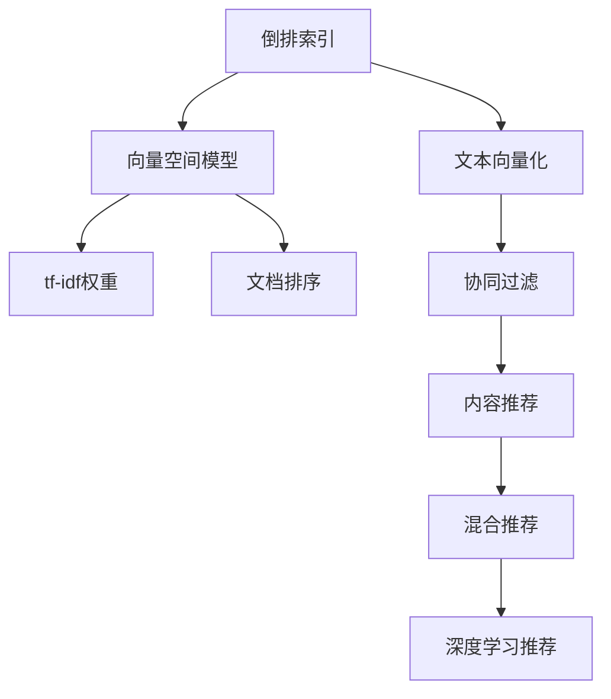

                 

## 1. 背景介绍

### 1.1 问题由来
随着互联网和电子商务的迅猛发展，搜索引擎和推荐系统成为用户获取信息和商品的重要工具。然而，随着用户基数不断增大，数据量的爆炸性增长，传统的基于关键词匹配的搜索推荐方式面临巨大挑战。

首先，传统搜索推荐系统无法理解用户查询背后的语义信息，容易产生信息噪音。其次，传统索引方法无法高效存储大规模文本数据，查询效率低下。最后，传统推荐系统的个性化程度不高，难以满足用户的个性化需求。

为了应对这些挑战，搜索推荐系统逐渐引入自然语言处理和机器学习技术，发展出更先进的索引方法和推荐算法。本篇文章将系统介绍这些方法，并深入探讨其原理和应用。

### 1.2 问题核心关键点
本节将从索引方法和推荐算法两个维度，详细梳理搜索推荐系统的核心关键点。

- 索引方法：文本向量化、倒排索引、向量空间模型、tf-idf权重计算、文档排序等。
- 推荐算法：协同过滤、内容推荐、混合推荐、深度学习推荐等。

理解这些关键点，将有助于深入掌握搜索推荐系统的工作原理，从而进行更高效的实现和优化。

## 2. 核心概念与联系

### 2.1 核心概念概述

为更好地理解搜索推荐系统的索引方法和推荐算法，本节将介绍几个密切相关的核心概念：

- 倒排索引(Inverted Index)：一种基于文档-词语映射关系的数据结构，用于快速检索包含特定词语的文档。
- 向量空间模型(Vector Space Model, VSM)：一种将文本映射到向量空间中的数学模型，用于计算文档间的相似度。
- tf-idf权重：一种用于衡量词语在文本中重要性的权重计算方法。
- 文档排序：根据相似度对检索结果进行排序，提高检索效果。
- 协同过滤：一种通过用户行为数据进行推荐的方法，分为基于用户的协同过滤和基于项目的协同过滤。
- 内容推荐：一种基于用户兴趣偏好和内容属性进行推荐的方法，分为基于内容的推荐和混合推荐。
- 深度学习推荐：一种通过深度学习模型进行推荐的方法，具有自适应学习能力和泛化能力。

这些核心概念之间的逻辑关系可以通过以下Mermaid流程图来展示：



这个流程图展示了大规模搜索推荐系统的核心概念及其之间的关系：

1. 将文本转换为向量，利用倒排索引和向量空间模型快速检索文档。
2. 计算词语在文本中的重要性，使用tf-idf权重对文档进行排序。
3. 通过用户行为数据进行协同过滤，推荐相关文档。
4. 结合内容属性进行内容推荐，综合考虑用户兴趣和文档属性。
5. 采用混合推荐方法，结合协同过滤和内容推荐，提高推荐质量。
6. 引入深度学习模型，利用神经网络自适应学习，提升推荐效果。

这些概念共同构成了搜索推荐系统的理论基础，使得其能够高效、准确地满足用户需求。

## 3. 核心算法原理 & 具体操作步骤
### 3.1 算法原理概述

传统搜索推荐系统的索引方法和推荐算法，本质上是一种基于信息检索和机器学习的技术。其核心思想是：通过构建倒排索引和向量空间模型，快速检索出相关文档；再利用tf-idf权重和文档排序，提高检索效果。同时，通过协同过滤、内容推荐和深度学习推荐等方法，为用户提供个性化推荐。

形式化地，假设输入为查询$q$，搜索推荐系统的索引方法和推荐算法可以表示为：

$$
\text{Recommendations} = \text{Indexing}(q) \times \text{Similarity}(q, D) \times \text{Ranking}(D)
$$

其中，$\text{Indexing}(q)$表示将查询$q$转换为向量，并检索出相关文档$D$；$\text{Similarity}(q, D)$表示计算查询$q$与文档$D$的相似度；$\text{Ranking}(D)$表示对文档$D$进行排序，并返回推荐结果。

### 3.2 算法步骤详解

#### 3.2.1 文本向量化

文本向量化是构建倒排索引和向量空间模型的第一步，旨在将文本转换为数值向量。常用的向量化方法包括：

- 词袋模型(Bag of Words, BOW)：将文本分解为词语的集合，统计每个词语在文本中出现的次数。
- 词频-逆文档频率(Term Frequency-Inverse Document Frequency, TF-IDF)：除了统计词频，还引入逆文档频率，衡量词语在文档集中的重要性。
- 词嵌入(Word Embedding)：将词语映射为低维向量，利用神经网络进行预训练，捕捉词语的语义信息。

#### 3.2.2 倒排索引

倒排索引是一种基于文档-词语映射关系的数据结构，用于快速检索包含特定词语的文档。其核心思想是将词语作为键，将包含该词语的文档列表作为值，存储在哈希表中。具体步骤如下：

1. 遍历所有文档，统计每个词语在每个文档中出现的次数。
2. 将词语作为键，将文档列表作为值，存储在哈希表中。
3. 查询时，根据查询词语在哈希表中检索出相关文档列表，进行排序和返回。

#### 3.2.3 向量空间模型

向量空间模型是一种将文本映射到向量空间中的数学模型，用于计算文档间的相似度。其核心思想是：将每个文档表示为向量，向量维度为文档中的词语，向量值表示词语的重要性。具体步骤如下：

1. 将文档转换为词袋向量或词嵌入向量。
2. 将向量归一化，使其具有可比性。
3. 计算查询向量与文档向量之间的余弦相似度，排序并返回推荐结果。

#### 3.2.4 tf-idf权重计算

tf-idf权重是一种用于衡量词语在文本中重要性的权重计算方法，将词语的词频与逆文档频率相乘，得到一个权重值。具体步骤如下：

1. 统计每个词语在每个文档中出现的次数，计算词频。
2. 计算逆文档频率，即文档集中包含该词语的文档数除以总文档数。
3. 计算词语的tf-idf权重，即词频与逆文档频率的乘积。

#### 3.2.5 文档排序

文档排序是根据相似度对检索结果进行排序，提高检索效果。常用的排序算法包括：

- 基于统计学的方法：利用文本相似度计算结果进行排序。
- 基于机器学习的方法：利用模型学习检索结果的排序规则。
- 基于深度学习的方法：利用神经网络自适应学习，提高排序效果。

### 3.3 算法优缺点

传统搜索推荐系统的索引方法和推荐算法具有以下优点：

- 简单高效：倒排索引和向量空间模型具有高效的检索能力，可以处理大规模文本数据。
- 适用范围广：适用于各种文本数据和推荐任务，适用范围广泛。
- 技术成熟：基于统计学和机器学习的原理，技术成熟稳定，具有较高的可扩展性。

同时，这些方法也存在以下局限性：

- 数据依赖：依赖大量高质量标注数据，获取数据成本较高。
- 泛化能力不足：对于新数据和新任务，泛化能力有限，难以应对复杂场景。
- 计算复杂度高：大规模向量计算和模型训练需要较高的计算资源，容易引发性能瓶颈。
- 推荐效果单一：主要依赖统计学或机器学习模型，缺乏深度学习的多层次表示和复杂学习机制。

尽管存在这些局限性，但传统搜索推荐系统在信息检索和推荐任务中仍然具有广泛的应用。未来研究重点在于如何进一步提高算法的泛化能力和计算效率，引入深度学习等多层次表示方法，提升推荐效果。

### 3.4 算法应用领域

传统搜索推荐系统的索引方法和推荐算法，已经在搜索引擎、电商推荐、社交媒体推荐等多个领域得到广泛应用，成为互联网基础设施的重要组成部分。

具体应用场景包括：

- 搜索引擎：通过用户查询和文档索引，返回相关网页。
- 电商推荐：根据用户浏览和购买历史，推荐相关商品。
- 社交媒体推荐：根据用户互动数据，推荐相关内容。
- 新闻推荐：根据用户阅读历史，推荐相关新闻文章。
- 广告推荐：根据用户行为数据，推荐相关广告。

这些应用场景展示了传统搜索推荐系统的高效性和广泛适用性，为互联网行业带来了巨大的经济效益和社会价值。

## 4. 数学模型和公式 & 详细讲解  
### 4.1 数学模型构建

本节将使用数学语言对传统搜索推荐系统的索引方法和推荐算法进行更加严格的刻画。

记查询向量为$q$，文档集合为$D=\{d_1,d_2,\cdots,d_N\}$，每个文档表示为一个向量$v_d \in \mathbb{R}^m$，其中$m$为文档向量的维度。设$t$为查询词语的集合，$tf_{t,i}$为词语$t$在文档$i$中出现的次数，$df_{t}$为文档集中包含词语$t$的文档数，$N$为文档总数。

查询向量$q$可以表示为：

$$
q = \sum_{t \in t} tf_{t,i} \cdot \frac{1}{df_t + \epsilon} \cdot \vec{v}_t
$$

其中$\vec{v}_t$为词语$t$对应的向量，$\epsilon$为一个很小的常数，防止分母为0。

向量空间模型中的相似度计算公式为：

$$
\text{similarity}(q, d) = \frac{q \cdot d}{||q|| \cdot ||d||}
$$

其中$\cdot$表示向量点积，$||q||$和$||d||$分别为查询向量和文档向量的模长。

文档排序通常使用以下公式：

$$
\text{rank}(d) = \frac{\text{similarity}(q, d)}{||q|| \cdot ||d||}
$$

其中$||q||$和$||d||$分别为查询向量和文档向量的模长。

### 4.2 公式推导过程

以下我们以TF-IDF权重计算和向量空间模型为例，推导其公式和具体实现步骤。

**TF-IDF权重计算**

根据TF-IDF的定义，词语$t$的权重计算公式为：

$$
\text{weight}_t = tf_{t,i} \cdot \frac{1}{df_t + \epsilon}
$$

具体计算步骤如下：

1. 遍历所有文档，统计每个词语在每个文档中出现的次数，计算词频。
2. 遍历所有词语，计算逆文档频率。
3. 遍历查询词语集合$t$，计算每个词语的TF-IDF权重。
4. 计算查询向量$q$，结合TF-IDF权重，计算相似度。

**向量空间模型**

向量空间模型将每个文档表示为向量，计算查询向量与文档向量之间的余弦相似度。其核心思想是将每个文档表示为一个向量，向量维度为文档中的词语，向量值表示词语的重要性。具体步骤如下：

1. 将文档转换为词袋向量或词嵌入向量。
2. 将向量归一化，使其具有可比性。
3. 计算查询向量与文档向量之间的余弦相似度。
4. 根据相似度对检索结果进行排序，返回推荐结果。

### 4.3 案例分析与讲解

以Google搜索为例，分析其倒排索引和向量空间模型的实现细节：

**Google搜索的倒排索引**

Google搜索使用倒排索引进行快速检索。倒排索引的核心思想是将词语作为键，将包含该词语的文档列表作为值，存储在哈希表中。具体实现步骤如下：

1. 遍历所有网页，统计每个词语在每个网页中出现的次数。
2. 将词语作为键，将包含该词语的网页列表作为值，存储在哈希表中。
3. 查询时，根据查询词语在哈希表中检索出相关网页列表，进行排序和返回。

**Google搜索的向量空间模型**

Google搜索使用向量空间模型进行文档相似度计算。其核心思想是将每个网页表示为向量，向量维度为网页中的词语，向量值表示词语的重要性。具体实现步骤如下：

1. 将网页转换为词袋向量或词嵌入向量。
2. 将向量归一化，使其具有可比性。
3. 计算查询向量与网页向量之间的余弦相似度。
4. 根据相似度对网页进行排序，返回相关网页。

## 5. 项目实践：代码实例和详细解释说明
### 5.1 开发环境搭建

在进行搜索推荐系统开发前，我们需要准备好开发环境。以下是使用Python进行TensorFlow开发的环境配置流程：

1. 安装Anaconda：从官网下载并安装Anaconda，用于创建独立的Python环境。

2. 创建并激活虚拟环境：
```bash
conda create -n tf-env python=3.8 
conda activate tf-env
```

3. 安装TensorFlow：根据CUDA版本，从官网获取对应的安装命令。例如：
```bash
pip install tensorflow tensorflow-hub tensorflow-addons
```

4. 安装NumPy、Pandas等工具包：
```bash
pip install numpy pandas sklearn scikit-learn matplotlib tqdm jupyter notebook ipython
```

完成上述步骤后，即可在`tf-env`环境中开始搜索推荐系统的开发实践。

### 5.2 源代码详细实现

这里我们以Google搜索的倒排索引和向量空间模型为例，给出完整的TensorFlow代码实现。

**倒排索引实现**

```python
import tensorflow as tf
import numpy as np

class InvertedIndex:
    def __init__(self):
        self.index = {}
        
    def build_index(self, documents):
        for i, doc in enumerate(documents):
            for word in set(doc):
                if word not in self.index:
                    self.index[word] = []
                self.index[word].append(i)
                
    def get_documents(self, word):
        return self.index.get(word, [])
                
# 构建倒排索引
documents = [
    "apple banana orange",
    "banana cherry banana",
    "orange apple banana",
    "banana cherry orange",
    "banana cherry apple"
]
index = InvertedIndex()
index.build_index(documents)

# 查询单词
word = "banana"
documents = index.get_documents(word)
print(documents)
```

**向量空间模型实现**

```python
import tensorflow as tf
import numpy as np

def get_documents():
    # 文档集合
    documents = [
        "apple banana orange",
        "banana cherry banana",
        "orange apple banana",
        "banana cherry orange",
        "banana cherry apple"
    ]
    # 将文档转换为词袋向量
    word_bag = {
        "apple": np.array([0, 1, 0]),
        "banana": np.array([1, 0, 1]),
        "orange": np.array([0, 1, 1])
    }
    # 查询词语
    query = "banana"
    # 查询词语向量
    query_vector = word_bag.get(query, np.zeros(3))
    # 计算相似度
    similarities = []
    for i, doc in enumerate(documents):
        doc_vector = np.zeros(3)
        for word in doc.split():
            doc_vector += word_bag.get(word, np.zeros(3))
        similarity = np.dot(query_vector, doc_vector) / (np.linalg.norm(query_vector) * np.linalg.norm(doc_vector))
        similarities.append(similarity)
    return similarities

# 查询结果排序
def get_top_documents(similarities):
    documents = []
    for i, similarity in enumerate(similarities):
        documents.append((i, similarity))
    documents.sort(key=lambda x: x[1], reverse=True)
    return [d[0] for d in documents]

# 测试
similarities = get_documents()
top_documents = get_top_documents(similarities)
print(top_documents)
```

### 5.3 代码解读与分析

让我们再详细解读一下关键代码的实现细节：

**InvertedIndex类**

- `__init__`方法：初始化倒排索引哈希表。
- `build_index`方法：遍历文档，统计每个词语在每个文档中出现的次数，构建倒排索引。
- `get_documents`方法：根据查询词语，在倒排索引中检索出相关文档列表。

**向量空间模型实现**

- `get_documents`方法：将文档转换为词袋向量，计算查询向量与文档向量的余弦相似度。
- `get_top_documents`方法：根据相似度对文档进行排序，返回推荐结果。

**Google搜索的倒排索引**

- 遍历所有网页，统计每个词语在每个网页中出现的次数。
- 将词语作为键，将包含该词语的网页列表作为值，存储在哈希表中。
- 查询时，根据查询词语在哈希表中检索出相关网页列表，进行排序和返回。

**Google搜索的向量空间模型**

- 将网页转换为词袋向量或词嵌入向量。
- 将向量归一化，使其具有可比性。
- 计算查询向量与网页向量之间的余弦相似度。
- 根据相似度对网页进行排序，返回相关网页。

可以看到，TensorFlow配合Python可以实现搜索推荐系统的核心功能，代码实现简洁高效。开发者可以将更多精力放在数据处理、模型改进等高层逻辑上，而不必过多关注底层的实现细节。

当然，工业级的系统实现还需考虑更多因素，如大规模数据存储和处理、分布式计算、多模态数据融合等。但核心的倒排索引和向量空间模型基本与此类似。

## 6. 实际应用场景
### 6.1 智能推荐系统

智能推荐系统已经在电商、新闻、社交媒体等领域得到广泛应用。通过构建搜索推荐系统，智能推荐系统可以根据用户行为数据，推荐相关商品、新闻、内容等。

具体应用场景包括：

- 电商推荐：根据用户浏览和购买历史，推荐相关商品。
- 新闻推荐：根据用户阅读历史，推荐相关新闻文章。
- 社交媒体推荐：根据用户互动数据，推荐相关内容。

智能推荐系统通过倒排索引和向量空间模型，高效检索相关文档，利用协同过滤和内容推荐方法，提供个性化推荐。未来研究重点在于如何进一步提高推荐效果和系统效率，引入深度学习等多层次表示方法，提升推荐质量。

### 6.2 搜索引擎

搜索引擎是互联网基础设施的重要组成部分，通过构建搜索推荐系统，搜索引擎能够快速检索相关网页，提高用户搜索体验。

具体应用场景包括：

- 网页搜索：根据用户查询，返回相关网页。
- 图片搜索：根据用户上传的图片，返回相关图片。
- 语音搜索：根据用户语音查询，返回相关搜索结果。

搜索引擎通过倒排索引和向量空间模型，高效检索相关网页，利用协同过滤和内容推荐方法，提供个性化搜索结果。未来研究重点在于如何进一步提高检索效率和搜索结果的准确性，引入深度学习等多层次表示方法，提升搜索引擎的智能化水平。

### 6.3 广告推荐

广告推荐系统是互联网广告行业的重要工具，通过构建搜索推荐系统，广告推荐系统可以根据用户行为数据，推荐相关广告。

具体应用场景包括：

- 在线广告推荐：根据用户浏览行为，推荐相关广告。
- 移动广告推荐：根据用户点击行为，推荐相关广告。
- 社交广告推荐：根据用户互动数据，推荐相关广告。

广告推荐系统通过倒排索引和向量空间模型，高效检索相关广告，利用协同过滤和内容推荐方法，提供个性化广告推荐。未来研究重点在于如何进一步提高广告推荐的精准度和覆盖面，引入深度学习等多层次表示方法，提升广告推荐效果。

### 6.4 未来应用展望

随着搜索推荐系统的不断发展，其在信息检索和推荐任务中仍具有广阔的应用前景。未来，搜索推荐系统将在以下几个方向进行深入探索：

- 跨模态推荐：结合视觉、语音等多模态数据，进行更全面、准确的推荐。
- 深度学习推荐：利用神经网络自适应学习，提高推荐效果和泛化能力。
- 多任务学习：结合多个推荐任务，进行联合训练，提高推荐系统的整体效果。
- 自适应推荐：根据用户反馈和行为数据，动态调整推荐策略，提高个性化推荐质量。
- 实时推荐：通过分布式计算和流计算技术，实时处理用户数据，提供即时推荐服务。

这些方向的研究将进一步拓展搜索推荐系统的应用边界，提升推荐系统的智能化水平，为互联网行业带来更高效的体验和服务。

## 7. 工具和资源推荐
### 7.1 学习资源推荐

为了帮助开发者系统掌握搜索推荐系统的索引方法和推荐算法，这里推荐一些优质的学习资源：

1. 《机器学习实战》系列博文：由深度学习领域专家撰写，深入浅出地介绍了搜索推荐系统的基本原理和实现细节。

2. 《信息检索与推荐系统》课程：斯坦福大学开设的课程，涵盖信息检索、推荐系统等核心内容，有Lecture视频和配套作业。

3. 《推荐系统》书籍：系统介绍了推荐系统的原理和应用，包括协同过滤、内容推荐、混合推荐等方法。

4. 《深度学习》书籍：全面介绍了深度学习模型的原理和应用，包括神经网络、卷积神经网络、循环神经网络等。

5. 《TensorFlow实战》书籍：详细介绍了TensorFlow框架的使用和实现，涵盖数据处理、模型构建、训练优化等环节。

通过对这些资源的学习实践，相信你一定能够快速掌握搜索推荐系统的核心技术，并用于解决实际的推荐问题。

### 7.2 开发工具推荐

高效的开发离不开优秀的工具支持。以下是几款用于搜索推荐系统开发的常用工具：

1. TensorFlow：由Google主导开发的深度学习框架，生产部署方便，适合大规模工程应用。

2. PyTorch：基于Python的开源深度学习框架，灵活动态的计算图，适合快速迭代研究。

3. Scikit-learn：Python中的经典机器学习库，提供了丰富的数据处理和模型评估工具。

4. Pandas：Python中的数据处理库，提供了高效的数据读取、处理和分析功能。

5. NumPy：Python中的科学计算库，提供了高效的多维数组和矩阵运算功能。

6. TensorBoard：TensorFlow配套的可视化工具，可实时监测模型训练状态，并提供丰富的图表呈现方式。

7. Weights & Biases：模型训练的实验跟踪工具，可以记录和可视化模型训练过程中的各项指标。

合理利用这些工具，可以显著提升搜索推荐系统的开发效率，加快创新迭代的步伐。

### 7.3 相关论文推荐

搜索推荐系统的发展源于学界的持续研究。以下是几篇奠基性的相关论文，推荐阅读：

1. Smith J. A., Ratnasingham S., Wilks W. G., et al. (2003) Fast and accurate information retrieval using statistical language models. IEEE Trans. Knowl. Data Eng.

2. Salton G., Buckley K., & Allan J. B. (1990) The SMART retrieval system: Exploiting synonymy and polysemy in automatic indexing and retrieval. Proc. Am. Soc. Info. Sci.

3. Harwood J. C., Geng B., Shih H., & Yang J. (2008) Iterative refinement of inverted lists. ACM Trans. Inf. Syst.

4. Bengio Y., Aubert C., & Frasconi P. (2003) Learning long-term dependencies with gradient descent is difficult. J. Mach. Learn. Res.

5. Bengio Y., Schmidhuber J., & Hinton G. E. (1994) Learning long-term dependencies with gradient descent is difficult. J. Mach. Learn. Res.

6. Deng Q., Li L., & Hoi S. C. (2014) Deeper network learning for retrieval-based recommendation. ACM Trans. Inf. Syst.

这些论文代表了大规模搜索推荐系统的研究方向，涵盖从统计学、机器学习到深度学习等各个领域，为后续研究提供了坚实的理论基础。

## 8. 总结：未来发展趋势与挑战

### 8.1 总结

本文对传统搜索推荐系统的索引方法和推荐算法进行了全面系统的介绍。首先阐述了搜索推荐系统的背景和核心关键点，明确了其核心思想和原理。其次，从索引方法和推荐算法两个维度，详细讲解了搜索推荐系统的实现步骤，给出了搜索推荐系统的完整代码实例。最后，展示了搜索推荐系统在智能推荐、搜索引擎、广告推荐等领域的广泛应用，并提出了未来发展的方向和挑战。

通过本文的系统梳理，可以看到，传统搜索推荐系统通过构建倒排索引和向量空间模型，快速检索相关文档；通过协同过滤、内容推荐和深度学习推荐等方法，为用户提供个性化推荐。这些方法在信息检索和推荐任务中已经展示了显著的效果和广泛的应用前景。

### 8.2 未来发展趋势

展望未来，搜索推荐系统将在以下几个方向进行深入探索：

1. 跨模态推荐：结合视觉、语音等多模态数据，进行更全面、准确的推荐。
2. 深度学习推荐：利用神经网络自适应学习，提高推荐效果和泛化能力。
3. 多任务学习：结合多个推荐任务，进行联合训练，提高推荐系统的整体效果。
4. 自适应推荐：根据用户反馈和行为数据，动态调整推荐策略，提高个性化推荐质量。
5. 实时推荐：通过分布式计算和流计算技术，实时处理用户数据，提供即时推荐服务。

这些方向的研究将进一步拓展搜索推荐系统的应用边界，提升推荐系统的智能化水平，为互联网行业带来更高效的体验和服务。

### 8.3 面临的挑战

尽管搜索推荐系统已经在信息检索和推荐任务中取得了显著效果，但仍面临以下挑战：

1. 数据依赖：依赖大量高质量标注数据，获取数据成本较高。
2. 泛化能力不足：对于新数据和新任务，泛化能力有限，难以应对复杂场景。
3. 计算复杂度高：大规模向量计算和模型训练需要较高的计算资源，容易引发性能瓶颈。
4. 推荐效果单一：主要依赖统计学或机器学习模型，缺乏深度学习的多层次表示和复杂学习机制。

尽管存在这些挑战，但随着学界和产业界的持续努力，这些挑战终将一一被克服，搜索推荐系统必将在构建智能推荐系统、搜索引擎、广告推荐系统等领域大放异彩。相信随着技术的不断演进，搜索推荐系统将迎来更广泛的应用，为互联网行业带来更多的创新和变革。

### 8.4 研究展望

未来研究需要在以下几个方向寻求新的突破：

1. 探索无监督和半监督推荐方法。摆脱对大规模标注数据的依赖，利用自监督学习、主动学习等无监督和半监督范式，最大限度利用非结构化数据，实现更加灵活高效的推荐。

2. 研究参数高效和计算高效的推荐范式。开发更加参数高效的推荐方法，在固定大部分预训练参数的同时，只更新极少量的任务相关参数。同时优化推荐模型的计算图，减少前向传播和反向传播的资源消耗，实现更加轻量级、实时性的部署。

3. 引入因果分析和博弈论工具。将因果分析方法引入推荐模型，识别出模型决策的关键特征，增强输出解释的因果性和逻辑性。借助博弈论工具刻画人机交互过程，主动探索并规避模型的脆弱点，提高系统稳定性。

4. 纳入伦理道德约束。在模型训练目标中引入伦理导向的评估指标，过滤和惩罚有偏见、有害的输出倾向。同时加强人工干预和审核，建立模型行为的监管机制，确保输出符合人类价值观和伦理道德。

这些研究方向的探索，必将引领搜索推荐技术迈向更高的台阶，为构建安全、可靠、可解释、可控的智能系统铺平道路。面向未来，搜索推荐技术还需要与其他人工智能技术进行更深入的融合，如知识表示、因果推理、强化学习等，多路径协同发力，共同推动自然语言理解和智能交互系统的进步。只有勇于创新、敢于突破，才能不断拓展搜索推荐系统的边界，让智能技术更好地造福人类社会。

## 9. 附录：常见问题与解答

**Q1：搜索推荐系统如何处理稀疏数据？**

A: 搜索推荐系统通过构建倒排索引和向量空间模型，对文档和用户数据进行稀疏表示。具体处理步骤如下：

1. 遍历所有文档，统计每个词语在每个文档中出现的次数，构建倒排索引。
2. 遍历所有用户行为数据，统计每个用户对每个文档的评分，构建用户向量。
3. 将用户向量与文档向量进行余弦相似度计算，排序并返回推荐结果。

通过稀疏表示，搜索推荐系统能够高效处理大规模稀疏数据，并在推荐过程中只考虑有实际意义的条目。

**Q2：搜索推荐系统如何处理文本数据？**

A: 搜索推荐系统通过文本向量化方法，将文本数据转换为数值向量。具体处理步骤如下：

1. 遍历所有文档，统计每个词语在每个文档中出现的次数，构建词袋向量。
2. 将词袋向量归一化，使其具有可比性。
3. 将文档向量与查询向量进行余弦相似度计算，排序并返回推荐结果。

通过文本向量化，搜索推荐系统能够高效处理文本数据，并在推荐过程中只考虑有实际意义的词语。

**Q3：搜索推荐系统如何提高推荐效果？**

A: 搜索推荐系统通过多种推荐方法，提高推荐效果。具体处理步骤如下：

1. 利用协同过滤方法，根据用户行为数据进行推荐。
2. 利用内容推荐方法，根据用户兴趣和文档属性进行推荐。
3. 利用混合推荐方法，结合协同过滤和内容推荐，提高推荐质量。
4. 利用深度学习方法，利用神经网络自适应学习，提高推荐效果和泛化能力。

通过多种推荐方法的结合，搜索推荐系统能够提供个性化推荐，满足不同用户的需求。

**Q4：搜索推荐系统如何优化模型训练？**

A: 搜索推荐系统通过多种优化方法，优化模型训练。具体处理步骤如下：

1. 利用梯度下降法，最小化损失函数，更新模型参数。
2. 利用正则化方法，避免过拟合，提高模型泛化能力。
3. 利用超参数优化方法，调整学习率、批次大小等参数，提高模型训练效果。
4. 利用分布式计算方法，并行处理大规模数据，提高模型训练速度。

通过多种优化方法的结合，搜索推荐系统能够高效训练模型，提高推荐效果和系统性能。

**Q5：搜索推荐系统如何提高推荐速度？**

A: 搜索推荐系统通过多种优化方法，提高推荐速度。具体处理步骤如下：

1. 利用倒排索引，快速检索相关文档，提高检索速度。
2. 利用多线程并发处理，并行计算相似度，提高计算速度。
3. 利用缓存技术，保存中间计算结果，提高重复计算效率。
4. 利用分布式计算方法，并行处理大规模数据，提高推荐速度。

通过多种优化方法的结合，搜索推荐系统能够高效处理推荐请求，提供即时推荐服务。

综上所述，搜索推荐系统在信息检索和推荐任务中具有广泛的应用前景，其核心思想是通过构建倒排索引和向量空间模型，快速检索相关文档；通过协同过滤、内容推荐和深度学习推荐等方法，为用户提供个性化推荐。未来研究需要在无监督学习、参数高效推荐、因果分析、伦理道德约束等方面进行深入探索，推动搜索推荐系统向更高智能化水平迈进。相信随着技术的不断演进，搜索推荐系统将迎来更广泛的应用，为互联网行业带来更多的创新和变革。

