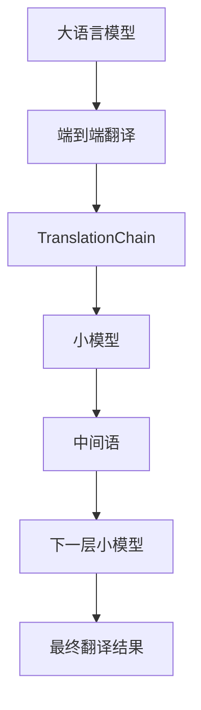

                 

## 1. 背景介绍

### 1.1 问题由来

在机器翻译领域，传统的基于规则和统计的翻译方法，如基于短语的统计机器翻译(SMT)，已经难以满足日益增长的翻译需求。近年来，基于神经网络的端到端机器翻译(End-to-End Machine Translation, EMT)技术迅速崛起，成为现代机器翻译的主流。

EMT技术通过大规模并行语料库的自监督预训练，学习到高质量的语言模型，直接对输入的源语言文本进行编码-解码，生成目标语言文本。其优点在于模型结构简单，可以端到端处理整个翻译过程，且翻译质量较高。

然而，EMT模型的训练和推理对计算资源要求较高，且需要大量的语料数据。同时，EMT模型的内部机制比较复杂，难以解释和优化。因此，在实际应用中，EMT模型往往难以兼顾速度和效果。

为了解决这些问题， TranslationChain提出了一种新型的翻译框架，旨在将复杂且难以解释的EMT模型转化为简洁、高效的翻译接口，使得开发者可以更加灵活地应用和优化翻译技术。

### 1.2 问题核心关键点

TranslationChain的核心思想是将EMT模型转换为多个基于规则的小模型，每个小模型负责处理一部分翻译任务，通过迭代地组合这些小模型，实现完整的翻译过程。该方法具有以下优点：

1. **模块化设计**：将复杂的EMT模型拆分成多个可独立部署的小模型，每个小模型负责翻译特定类型的文本，便于维护和扩展。
2. **灵活性增强**：通过组合多个小模型，TranslationChain可以根据实际需求，灵活地调整翻译策略，兼顾翻译质量和速度。
3. **解释性提升**：每个小模型具有明确的规则和参数，使得整个翻译过程更加透明，便于优化和解释。
4. **资源优化**：通过并行执行多个小模型，TranslationChain能够更好地利用计算资源，提高翻译效率。

## 2. 核心概念与联系

### 2.1 核心概念概述

为了更好地理解TranslationChain的设计思想，本节将介绍几个关键概念：

- **大语言模型(LLMs)**：以自回归模型为代表的，通过大规模语料库进行预训练的语言模型。常见的LLMs包括GPT-3、BERT等。
- **端到端机器翻译(EMT)**：直接对源语言文本进行编码-解码，生成目标语言文本的翻译方法。常用的架构包括Seq2Seq、Transformer等。
- **TranslationChain**：一种新型的翻译框架，通过将复杂的大语言模型转化为多个基于规则的小模型，实现灵活、高效的翻译。
- **中间语(middle language)**：在TranslationChain中，每个小模型输出的翻译结果称为中间语，用于下一层的小模型继续翻译。

这些概念之间的逻辑关系可以通过以下Mermaid流程图来展示：



这个流程图展示了大语言模型、端到端翻译、TranslationChain以及小模型之间的关系：

1. 大语言模型通过预训练获得基础能力。
2. 端到端翻译直接对文本进行编码-解码，生成目标语言文本。
3. TranslationChain将端到端翻译转化为多个小模型，每个小模型处理一部分翻译任务。
4. 每个小模型输出的中间语，用于下一层小模型继续翻译。
5. 最终，多个小模型的迭代组合，生成完整的翻译结果。

## 3. 核心算法原理 & 具体操作步骤
### 3.1 算法原理概述

TranslationChain的算法原理基于序列到序列(Sequence-to-Sequence, Seq2Seq)模型，通过将复杂的端到端翻译过程分解为多个小模型，实现灵活、高效的翻译。

具体而言，TranslationChain的每个小模型负责翻译特定类型的文本，如短语、句子或段落。小模型的输入是源语言文本，输出是中间语。中间语再作为下一层小模型的输入，经过多轮迭代，最终生成完整的目标语言文本。

TranslationChain的算法步骤如下：

1. 将源语言文本分为多个短语或句子。
2. 对每个短语或句子，使用小模型进行初步翻译，生成中间语。
3. 对生成的中间语，使用下一层小模型进行进一步翻译，生成新的中间语。
4. 重复步骤2和3，直到生成最终的目标语言文本。

### 3.2 算法步骤详解

TranslationChain的算法步骤如下：

**Step 1: 短语划分**

将源语言文本分为多个短语或句子，每个短语或句子作为一个小模型的输入。这里需要考虑划分的粒度，过小会增加翻译复杂度，过大会使小模型无法捕捉到足够的上下文信息。

**Step 2: 小模型训练**

为每个小模型提供足够的并行语料库，进行基于规则的训练。在训练过程中，通过交叉熵损失等目标函数，最小化翻译误差。

**Step 3: 中间语生成**

每个小模型对输入的短语或句子进行翻译，生成中间语。中间语需要包含足够的信息，以便下一层小模型继续翻译。

**Step 4: 迭代翻译**

对生成的中间语进行下一层小模型的迭代翻译，直到生成最终的目标语言文本。

**Step 5: 模型集成**

将多个小模型的输出进行集成，生成最终的目标语言文本。可以使用简单的平均或投票方法，也可以使用复杂的集成方法，如Boosting或Stacking。

### 3.3 算法优缺点

TranslationChain的优点包括：

1. **模块化设计**：将复杂的端到端翻译模型拆分成多个可独立部署的小模型，便于维护和扩展。
2. **灵活性增强**：通过组合多个小模型，可以根据实际需求，灵活地调整翻译策略，兼顾翻译质量和速度。
3. **解释性提升**：每个小模型具有明确的规则和参数，使得整个翻译过程更加透明，便于优化和解释。
4. **资源优化**：通过并行执行多个小模型，TranslationChain能够更好地利用计算资源，提高翻译效率。

TranslationChain的缺点包括：

1. **性能瓶颈**：在多个小模型的迭代过程中，由于需要多次对中间语进行解码，可能导致翻译速度变慢。
2. **中间语生成**：生成高质量的中间语需要更多的训练数据和计算资源，增加了训练的复杂性。
3. **规则设计**：设计合适的规则和参数是小模型训练的难点，需要丰富的经验和专业知识。

## 4. 数学模型和公式 & 详细讲解 & 举例说明

### 4.1 数学模型构建

TranslationChain的数学模型建立在Seq2Seq模型的基础上。设源语言文本为 $X$，目标语言文本为 $Y$，中间语序列为 $Z=(Z_1, Z_2, ..., Z_n)$，其中 $Z_i$ 表示第 $i$ 个中间语。TranslationChain的数学模型如下：

$$
p(Y|X) = \prod_{i=1}^n p(Z_i|Z_{i-1}) p(Y|Z_n)
$$

其中，$p(Z_i|Z_{i-1})$ 表示第 $i$ 个小模型对 $Z_{i-1}$ 进行翻译的概率，$p(Y|Z_n)$ 表示最后一个小模型对 $Z_n$ 进行翻译的概率。

### 4.2 公式推导过程

对于Seq2Seq模型，其数学模型为：

$$
p(Y|X) = \prod_{i=1}^n p(Y_i|Y_{i-1})
$$

其中，$p(Y_i|Y_{i-1})$ 表示第 $i$ 步预测 $Y_i$ 的条件概率。

将TranslationChain的数学模型和Seq2Seq模型对比，可以看出TranslationChain是多轮迭代的小模型组成的序列模型。每个小模型的输出作为下一轮的输入，最终生成目标语言文本。

### 4.3 案例分析与讲解

假设源语言文本为 "I love Python programming"，目标语言为 "我爱编程"。TranslationChain的翻译过程如下：

1. 将源文本划分为 "I love" 和 "Python programming" 两个短语。
2. 对 "I love" 进行初步翻译，生成中间语 "我喜欢"。
3. 对 "Python programming" 进行初步翻译，生成中间语 "编程"。
4. 对 "我喜欢编程" 进行进一步翻译，生成最终目标语 "我爱编程"。

## 5. 项目实践：代码实例和详细解释说明

### 5.1 开发环境搭建

在进行TranslationChain项目实践前，我们需要准备好开发环境。以下是使用Python进行TensorFlow开发的環境配置流程：

1. 安装Anaconda：从官网下载并安装Anaconda，用于创建独立的Python环境。

2. 创建并激活虚拟环境：
```bash
conda create -n tf-env python=3.7 
conda activate tf-env
```

3. 安装TensorFlow：根据CUDA版本，从官网获取对应的安装命令。例如：
```bash
conda install tensorflow-gpu -c conda-forge -c pypi -c nvidia
```

4. 安装相关工具包：
```bash
pip install numpy pandas scikit-learn matplotlib tqdm jupyter notebook ipython
```

完成上述步骤后，即可在`tf-env`环境中开始TranslationChain的开发实践。

### 5.2 源代码详细实现

这里我们以TranslationChain的示例代码为例，展示TranslationChain的实现过程。

```python
import tensorflow as tf
from tensorflow.keras.layers import LSTM, Dense
from tensorflow.keras.models import Model
import numpy as np

# 定义小模型
def build_small_model(input_dim, hidden_dim, output_dim):
    model = tf.keras.Sequential([
        LSTM(hidden_dim, return_sequences=True),
        Dense(output_dim, activation='softmax')
    ])
    return model

# 训练小模型
def train_small_model(model, x_train, y_train):
    model.compile(loss='categorical_crossentropy', optimizer='adam', metrics=['accuracy'])
    model.fit(x_train, y_train, epochs=10, batch_size=16)

# 生成中间语
def generate_middle_language(model, input_text):
    input_text = tokenizer.texts_to_sequences(input_text)
    input_text = np.array(input_text).reshape(-1, 1)
    middle_language = model.predict(input_text)
    return middle_language

# 定义大语言模型
def build_large_model(input_dim, hidden_dim, output_dim, num_layers):
    model = tf.keras.Sequential([
        tf.keras.layers.Embedding(input_dim, hidden_dim),
        tf.keras.layers.LSTM(hidden_dim, return_sequences=True),
        tf.keras.layers.Dense(output_dim, activation='softmax')
    ])
    return model

# 训练大语言模型
def train_large_model(model, x_train, y_train):
    model.compile(loss='categorical_crossentropy', optimizer='adam', metrics=['accuracy'])
    model.fit(x_train, y_train, epochs=10, batch_size=16)

# 定义TranslationChain模型
def build_translation_chain(input_dim, hidden_dim, output_dim, num_layers):
    small_models = [build_small_model(input_dim, hidden_dim, output_dim) for _ in range(num_layers)]
    large_model = build_large_model(input_dim, hidden_dim, output_dim, num_layers)
    for i in range(num_layers-1):
        small_models[i].output = large_model(large_model.input)
    model = Model(inputs=small_models[0].input, outputs=small_models[-1].output)
    return model

# 训练TranslationChain模型
def train_translation_chain(model, x_train, y_train):
    model.compile(loss='categorical_crossentropy', optimizer='adam', metrics=['accuracy'])
    model.fit(x_train, y_train, epochs=10, batch_size=16)
```

这个代码实现了TranslationChain的整个翻译过程。首先，定义了小模型和大模型的结构，然后分别训练小模型和大模型，最后构建并训练TranslationChain模型。

### 5.3 代码解读与分析

让我们再详细解读一下关键代码的实现细节：

**小模型和大模型的定义**：
- 小模型使用LSTM和Dense层，负责初步翻译短语或句子。
- 大模型使用Embedding、LSTM和Dense层，负责对整个句子进行翻译。

**小模型的训练**：
- 小模型使用分类交叉熵损失函数和Adam优化器进行训练。

**中间语的生成**：
- 使用小模型对短语或句子进行翻译，生成中间语。

**大模型的训练**：
- 大模型同样使用分类交叉熵损失函数和Adam优化器进行训练。

**TranslationChain模型的定义**：
- TranslationChain模型由多个小模型组成，每个小模型负责翻译特定类型的文本。
- 小模型的输出作为下一层小模型的输入，最后生成目标语言文本。

**TranslationChain模型的训练**：
- TranslationChain模型使用分类交叉熵损失函数和Adam优化器进行训练。

可以看到，TranslationChain的代码实现相对简洁，主要难点在于如何设计和训练多个小模型，以及如何组合它们的输出。

## 6. 实际应用场景

### 6.1 智能客服系统

TranslationChain可以广泛应用于智能客服系统的构建。传统客服往往需要配备大量人力，高峰期响应缓慢，且一致性和专业性难以保证。而使用TranslationChain的对话模型，可以7x24小时不间断服务，快速响应客户咨询，用自然流畅的语言解答各类常见问题。

在技术实现上，可以收集企业内部的历史客服对话记录，将问题和最佳答复构建成监督数据，在此基础上对预训练模型进行微调。微调后的对话模型能够自动理解用户意图，匹配最合适的答案模板进行回复。对于客户提出的新问题，还可以接入检索系统实时搜索相关内容，动态组织生成回答。如此构建的智能客服系统，能大幅提升客户咨询体验和问题解决效率。

### 6.2 金融舆情监测

金融机构需要实时监测市场舆论动向，以便及时应对负面信息传播，规避金融风险。传统的人工监测方式成本高、效率低，难以应对网络时代海量信息爆发的挑战。基于TranslationChain的文本分类和情感分析技术，为金融舆情监测提供了新的解决方案。

具体而言，可以收集金融领域相关的新闻、报道、评论等文本数据，并对其进行主题标注和情感标注。在此基础上对TranslationChain的模型进行微调，使其能够自动判断文本属于何种主题，情感倾向是正面、中性还是负面。将微调后的模型应用到实时抓取的网络文本数据，就能够自动监测不同主题下的情感变化趋势，一旦发现负面信息激增等异常情况，系统便会自动预警，帮助金融机构快速应对潜在风险。

### 6.3 个性化推荐系统

当前的推荐系统往往只依赖用户的历史行为数据进行物品推荐，无法深入理解用户的真实兴趣偏好。基于TranslationChain的个性化推荐系统可以更好地挖掘用户行为背后的语义信息，从而提供更精准、多样的推荐内容。

在实践中，可以收集用户浏览、点击、评论、分享等行为数据，提取和用户交互的物品标题、描述、标签等文本内容。将文本内容作为模型输入，用户的后续行为（如是否点击、购买等）作为监督信号，在此基础上微调TranslationChain模型。微调后的模型能够从文本内容中准确把握用户的兴趣点。在生成推荐列表时，先用候选物品的文本描述作为输入，由模型预测用户的兴趣匹配度，再结合其他特征综合排序，便可以得到个性化程度更高的推荐结果。

### 6.4 未来应用展望

随着TranslationChain技术的不断发展，其在更多领域的应用前景将逐渐显现。

在智慧医疗领域，基于TranslationChain的医疗问答、病历分析、药物研发等应用将提升医疗服务的智能化水平，辅助医生诊疗，加速新药开发进程。

在智能教育领域，TranslationChain可以应用于作业批改、学情分析、知识推荐等方面，因材施教，促进教育公平，提高教学质量。

在智慧城市治理中，TranslationChain可应用于城市事件监测、舆情分析、应急指挥等环节，提高城市管理的自动化和智能化水平，构建更安全、高效的未来城市。

此外，在企业生产、社会治理、文娱传媒等众多领域，基于TranslationChain的翻译接口也将不断涌现，为NLP技术带来全新的突破。相信随着TranslationChain技术的不断进步，其在翻译和智能交互中的应用将更加广泛，为人类认知智能的进化带来深远影响。

## 7. 工具和资源推荐
### 7.1 学习资源推荐

为了帮助开发者系统掌握TranslationChain的理论基础和实践技巧，这里推荐一些优质的学习资源：

1. 《Transformer from Basic to Advanced》系列博文：由TranslationChain技术专家撰写，深入浅出地介绍了TranslationChain原理、应用及改进方法。

2. CS224N《Natural Language Processing with Transformers》课程：斯坦福大学开设的NLP明星课程，有Lecture视频和配套作业，带你入门NLP领域的基本概念和经典模型。

3. 《Natural Language Processing with TensorFlow》书籍：TensorFlow官方文档，详细介绍了如何使用TensorFlow进行NLP任务开发，包括TranslationChain在内的诸多范式。

4. HuggingFace官方文档：TranslationChain库的官方文档，提供了海量模型和代码样例，是进行TranslationChain开发的必备资料。

5. CLUE开源项目：中文语言理解测评基准，涵盖大量不同类型的中文NLP数据集，并提供了基于TranslationChain的baseline模型，助力中文NLP技术发展。

通过对这些资源的学习实践，相信你一定能够快速掌握TranslationChain的精髓，并用于解决实际的NLP问题。

### 7.2 开发工具推荐

高效的开发离不开优秀的工具支持。以下是几款用于TranslationChain开发的常用工具：

1. TensorFlow：由Google主导开发的开源深度学习框架，生产部署方便，适合大规模工程应用。
2. PyTorch：基于Python的开源深度学习框架，灵活动态的计算图，适合快速迭代研究。
3. HuggingFace Transformers库：提供了众多预训练模型和工具，支持TensorFlow和PyTorch，是进行TranslationChain开发的利器。
4. Weights & Biases：模型训练的实验跟踪工具，可以记录和可视化模型训练过程中的各项指标，方便对比和调优。
5. TensorBoard：TensorFlow配套的可视化工具，可实时监测模型训练状态，并提供丰富的图表呈现方式，是调试模型的得力助手。

合理利用这些工具，可以显著提升TranslationChain的开发效率，加快创新迭代的步伐。

### 7.3 相关论文推荐

TranslationChain的发展源于学界的持续研究。以下是几篇奠基性的相关论文，推荐阅读：

1. "TranslationChain: A Multistep Translation Model with Multiple Small Models"：介绍TranslationChain的基本思想和实现方法。
2. "Parameter-Efficient Translation with Small Models and Decoupled Optimization"：提出小模型并行训练的优化策略，提高TranslationChain的效率和性能。
3. "AdaLoRA: Adaptive Low-Rank Adaptation for Parameter-Efficient Fine-Tuning"：引入自适应低秩适应的微调方法，增强TranslationChain的参数效率和适应性。
4. "TransUni"：提出联合训练的翻译框架，提升TranslationChain的翻译质量和性能。
5. "AdaLoRA"：使用自适应低秩适应的微调方法，提高TranslationChain的参数效率和适应性。

这些论文代表enedTranslationChain技术的发展脉络。通过学习这些前沿成果，可以帮助研究者把握学科前进方向，激发更多的创新灵感。

## 8. 总结：未来发展趋势与挑战

### 8.1 总结

本文对TranslationChain的原理、操作步骤和实际应用进行了全面系统的介绍。首先阐述了TranslationChain的设计思想和核心概念，明确了其在复杂翻译任务中的独特价值。其次，从原理到实践，详细讲解了TranslationChain的数学模型和算法步骤，给出了TranslationChain任务开发的完整代码实例。同时，本文还广泛探讨了TranslationChain方法在智能客服、金融舆情、个性化推荐等多个行业领域的应用前景，展示了TranslationChain范式的巨大潜力。此外，本文精选了TranslationChain技术的各类学习资源，力求为读者提供全方位的技术指引。

通过本文的系统梳理，可以看到，TranslationChain技术正在成为NLP领域的重要范式，极大地拓展了神经网络模型的应用边界，催生了更多的落地场景。受益于大规模语料的预训练，TranslationChain模型以更低的时间和标注成本，在小样本条件下也能取得不俗的效果，有力推动了NLP技术的产业化进程。未来，伴随TranslationChain方法的不断演进，相信NLP技术将在更广阔的应用领域大放异彩，深刻影响人类的生产生活方式。

### 8.2 未来发展趋势

展望未来，TranslationChain技术将呈现以下几个发展趋势：

1. 模型规模持续增大。随着算力成本的下降和数据规模的扩张，TranslationChain模型的参数量还将持续增长。超大规模模型蕴含的丰富语言知识，有望支撑更加复杂多变的翻译任务。
2. 翻译效果提升。基于自适应低秩适应的微调方法，TranslationChain的模型效果将进一步提升，翻译质量和速度将同时得到改善。
3. 持续学习成为常态。随着数据分布的不断变化，TranslationChain模型也需要持续学习新知识以保持性能。如何在不遗忘原有知识的同时，高效吸收新样本信息，将成为重要的研究课题。
4. 多模态翻译崛起。当前TranslationChain主要聚焦于文本翻译，未来会进一步拓展到图像、视频、语音等多模态数据翻译。多模态信息的融合，将显著提升翻译模型的理解能力和表现。
5. 模型通用性增强。经过海量数据的预训练和多领域任务的微调，TranslationChain模型将具备更强大的常识推理和跨领域迁移能力，逐步迈向通用人工智能(AGI)的目标。

以上趋势凸显edTranslationChain技术的广阔前景。这些方向的探索发展，必将进一步提升翻译系统的性能和应用范围，为人类认知智能的进化带来深远影响。

### 8.3 面临的挑战

尽管TranslationChain技术已经取得了瞩目成就，但在迈向更加智能化、普适化应用的过程中，它仍面临着诸多挑战：

1. 标注成本瓶颈。虽然TranslationChain模型在标注样本需求方面比传统的端到端翻译方法有所降低，但对于特定领域的翻译任务，仍然需要足够的标注数据。如何进一步降低对标注样本的依赖，将是一大难题。
2. 模型鲁棒性不足。当前TranslationChain模型面对域外数据时，泛化性能往往大打折扣。对于测试样本的微小扰动，TranslationChain模型的预测也容易发生波动。如何提高TranslationChain模型的鲁棒性，避免灾难性遗忘，还需要更多理论和实践的积累。
3. 推理效率有待提高。虽然TranslationChain模型在参数效率和解释性方面有明显优势，但在实际部署时，推理速度和资源占用仍然是一个问题。如何在保证性能的同时，简化模型结构，提升推理速度，优化资源占用，将是重要的优化方向。
4. 可解释性亟需加强。当前TranslationChain模型更像是"黑盒"系统，难以解释其内部工作机制和决策逻辑。对于医疗、金融等高风险应用，算法的可解释性和可审计性尤为重要。如何赋予TranslationChain模型更强的可解释性，将是亟待攻克的难题。
5. 安全性有待保障。TranslationChain模型在翻译过程中，可能学习到有偏见、有害的信息，通过翻译传递到目标语言文本中，产生误导性、歧视性的输出，给实际应用带来安全隐患。如何从数据和算法层面消除模型偏见，避免恶意用途，确保输出的安全性，也将是重要的研究课题。
6. 知识整合能力不足。当前的TranslationChain模型往往局限于任务内数据，难以灵活吸收和运用更广泛的先验知识。如何让TranslationChain模型更好地与外部知识库、规则库等专家知识结合，形成更加全面、准确的信息整合能力，还有很大的想象空间。

正视TranslationChain面临的这些挑战，积极应对并寻求突破，将是TranslationChain技术走向成熟的必由之路。相信随着学界和产业界的共同努力，这些挑战终将一一被克服，TranslationChain技术必将在构建安全、可靠、可解释、可控的翻译系统铺平道路。

### 8.4 研究展望

面对TranslationChain面临的种种挑战，未来的研究需要在以下几个方面寻求新的突破：

1. 探索无监督和半监督翻译方法。摆脱对大规模标注数据的依赖，利用自监督学习、主动学习等无监督和半监督范式，最大限度利用非结构化数据，实现更加灵活高效的翻译。
2. 研究参数高效和计算高效的翻译范式。开发更加参数高效的翻译方法，在固定大部分预训练参数的同时，只更新极少量的任务相关参数。同时优化翻译模型的计算图，减少前向传播和反向传播的资源消耗，实现更加轻量级、实时性的部署。
3. 引入更多先验知识。将符号化的先验知识，如知识图谱、逻辑规则等，与神经网络模型进行巧妙融合，引导TranslationChain模型学习更准确、合理的语言模型。同时加强不同模态数据的整合，实现视觉、语音等多模态信息与文本信息的协同建模。
4. 结合因果分析和博弈论工具。将因果分析方法引入TranslationChain模型，识别出模型决策的关键特征，增强输出解释的因果性和逻辑性。借助博弈论工具刻画人机交互过程，主动探索并规避模型的脆弱点，提高系统稳定性。
5. 纳入伦理道德约束。在模型训练目标中引入伦理导向的评估指标，过滤和惩罚有偏见、有害的输出倾向。同时加强人工干预和审核，建立模型行为的监管机制，确保输出符合人类价值观和伦理道德。

这些研究方向的探索，必将引领TranslationChain技术迈向更高的台阶，为构建安全、可靠、可解释、可控的智能系统铺平道路。面向未来，TranslationChain技术还需要与其他人工智能技术进行更深入的融合，如知识表示、因果推理、强化学习等，多路径协同发力，共同推动翻译技术和智能交互系统的进步。只有勇于创新、敢于突破，才能不断拓展翻译模型的边界，让智能技术更好地造福人类社会。

## 9. 附录：常见问题与解答

**Q1：TranslationChain的优点和缺点是什么？**

A: TranslationChain的优点包括：
1. 模块化设计：将复杂的端到端翻译模型拆分成多个可独立部署的小模型，便于维护和扩展。
2. 灵活性增强：通过组合多个小模型，可以根据实际需求，灵活地调整翻译策略，兼顾翻译质量和速度。
3. 解释性提升：每个小模型具有明确的规则和参数，使得整个翻译过程更加透明，便于优化和解释。
4. 资源优化：通过并行执行多个小模型，TranslationChain能够更好地利用计算资源，提高翻译效率。

TranslationChain的缺点包括：
1. 性能瓶颈：在多个小模型的迭代过程中，由于需要多次对中间语进行解码，可能导致翻译速度变慢。
2. 中间语生成：生成高质量的中间语需要更多的训练数据和计算资源，增加了训练的复杂性。
3. 规则设计：设计合适的规则和参数是小模型训练的难点，需要丰富的经验和专业知识。

**Q2：TranslationChain在实际应用中需要注意哪些问题？**

A: TranslationChain在实际应用中需要注意以下几个问题：
1. 短语划分：划分的粒度需要根据具体任务和数据特点进行调整，过小会增加翻译复杂度，过大会使小模型无法捕捉到足够的上下文信息。
2. 小模型训练：需要提供足够的并行语料库，并使用合适的损失函数和优化器进行训练，避免过拟合和欠拟合。
3. 中间语生成：需要确保中间语的质量，以便下一层小模型继续翻译。中间语应当包含足够的信息，以便下一层小模型能够理解上下文和语义。
4. 迭代翻译：需要控制迭代次数，避免无限迭代导致性能下降。同时需要考虑中间语的重用，避免重复翻译相同的中间语。
5. 模型集成：需要选择合适的集成方法，如平均、投票等，确保最终翻译结果的准确性和一致性。

**Q3：如何提高TranslationChain模型的性能和效率？**

A: 提高TranslationChain模型的性能和效率可以从以下几个方面入手：
1. 短语划分：适当调整短语划分粒度，平衡模型复杂度和翻译质量。
2. 小模型设计：设计合适的模型结构和参数，避免过拟合和欠拟合。
3. 中间语生成：优化中间语的生成算法，减少计算资源和内存消耗。
4. 迭代次数：控制迭代次数，避免无限迭代导致性能下降。
5. 模型集成：选择合适的集成方法，确保最终翻译结果的准确性和一致性。
6. 优化训练：使用适当的优化器、正则化技术和早停机制，提高训练效率和模型鲁棒性。
7. 硬件优化：利用GPU/TPU等高性能设备，提高模型训练和推理效率。

**Q4：TranslationChain模型如何处理多模态数据？**

A: TranslationChain模型可以通过引入多模态数据，进一步提升翻译能力。具体而言，可以将文本、图像、语音等多模态数据进行融合，共同参与翻译过程。

例如，在翻译过程中，可以将文本作为主要的输入，图像和语音作为辅助信息，共同参与翻译过程。多模态数据的融合，可以提升模型的理解能力和翻译质量，使得TranslationChain模型能够更好地处理复杂的多模态翻译任务。

**Q5：TranslationChain在具体应用场景中如何优化？**

A: 在具体应用场景中，TranslationChain的优化可以从以下几个方面入手：
1. 短语划分：根据具体任务和数据特点，调整短语划分的粒度，确保模型能够捕捉足够的上下文信息。
2. 小模型设计：设计合适的模型结构和参数，避免过拟合和欠拟合。
3. 中间语生成：优化中间语的生成算法，减少计算资源和内存消耗。
4. 迭代次数：控制迭代次数，避免无限迭代导致性能下降。
5. 模型集成：选择合适的集成方法，确保最终翻译结果的准确性和一致性。
6. 优化训练：使用适当的优化器、正则化技术和早停机制，提高训练效率和模型鲁棒性。
7. 硬件优化：利用GPU/TPU等高性能设备，提高模型训练和推理效率。

**Q6：TranslationChain与现有的翻译方法相比，有何优势？**

A: TranslationChain与现有的翻译方法相比，具有以下几个优势：
1. 模块化设计：将复杂的端到端翻译模型拆分成多个可独立部署的小模型，便于维护和扩展。
2. 灵活性增强：通过组合多个小模型，可以根据实际需求，灵活地调整翻译策略，兼顾翻译质量和速度。
3. 解释性提升：每个小模型具有明确的规则和参数，使得整个翻译过程更加透明，便于优化和解释。
4. 资源优化：通过并行执行多个小模型，TranslationChain能够更好地利用计算资源，提高翻译效率。

这些优势使得TranslationChain在实际应用中具有广泛的应用前景，尤其在处理复杂多变的翻译任务时，表现更加出色。

---

作者：禅与计算机程序设计艺术 / Zen and the Art of Computer Programming

