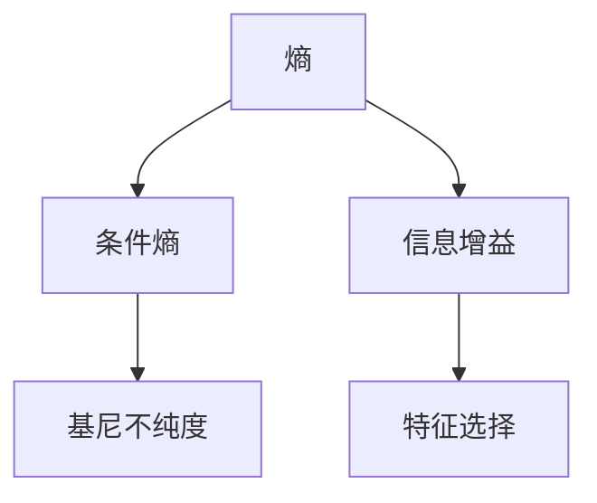

                 

## 1. 背景介绍

### 1.1 问题由来
信息增益（Information Gain）是一种常用的特征选择算法，用于评估一个特征在分类任务中的重要性。在决策树算法中，通过计算信息增益可以判断哪些特征对分类贡献更大，进而选择最有用的特征进行节点分裂。本文将深入探讨信息增益的原理、计算方法及其在实际项目中的应用实例。

### 1.2 问题核心关键点
信息增益的核心在于理解熵和条件熵的概念，并从信息论的角度量化特征的重要性。熵用于衡量数据集的不确定性，条件熵则是在已知某个特征值的情况下，数据集的不确定性。通过计算信息增益，可以衡量一个特征对数据集不确定性的减少程度，从而选择对分类贡献最大的特征。

### 1.3 问题研究意义
信息增益作为特征选择的一种重要手段，广泛应用于分类算法中。通过信息增益，可以有效地提高分类算法的准确性和泛化能力，减少过拟合风险，提高模型性能。研究信息增益的原理和应用，对于提升机器学习模型的泛化能力和实际应用效果具有重要意义。

## 2. 核心概念与联系

### 2.1 核心概念概述

信息增益是特征选择算法中的一种，其核心概念包括：

- 熵（Entropy）：衡量数据集的不确定性，值越大表示数据集的不确定性越高。
- 条件熵（Conditional Entropy）：在已知某个特征值的情况下，数据集的不确定性。
- 信息增益（Information Gain）：衡量一个特征对数据集不确定性的减少程度。
- 基尼不纯度（Gini Impurity）：另一种衡量数据集不确定性的指标，与熵类似，但在分类问题中更常用。

这些核心概念之间的关系可以通过以下Mermaid流程图来展示：



这个流程图展示了熵、条件熵、信息增益和基尼不纯度之间的关系及其在特征选择中的应用。

## 3. 核心算法原理 & 具体操作步骤

### 3.1 算法原理概述

信息增益计算的原理基于信息熵的概念，旨在通过减少数据集的不确定性来提升分类性能。在决策树中，信息增益高的特征被用来分裂节点，以减少子节点的不确定性，从而优化决策树的结构和性能。

### 3.2 算法步骤详解

信息增益的计算步骤如下：

1. **计算数据集的熵**：数据集的熵定义为所有可能类别出现的概率之和，即 $H(D) = -\sum_{i=1}^n p_i \log_2 p_i$，其中 $p_i$ 是类别 $i$ 的概率。

2. **计算条件熵**：对于特征 $X$，计算已知特征值时的条件熵 $H(D|X)$，即 $H(D|X) = -\sum_{i=1}^n \sum_{j=1}^{|X|} p(x_j, y_i) \log_2 p(x_j, y_i)$，其中 $x_j$ 是特征 $X$ 的取值，$y_i$ 是类别 $i$ 的概率。

3. **计算信息增益**：信息增益 $IG(D, X)$ 定义为数据集熵与条件熵之差，即 $IG(D, X) = H(D) - H(D|X)$。

4. **选择最优特征**：在所有特征中，选择信息增益最大的特征用于节点分裂。

### 3.3 算法优缺点

信息增益的优点包括：

- 简单直观：计算公式简单，易于理解和实现。
- 可解释性强：信息增益的计算结果直观反映了特征对分类性能的提升效果。

缺点包括：

- 偏向于取值较多的特征：对于取值较多的特征，条件熵较小，导致信息增益较高，但实际分类效果可能不如取值较少的特征。
- 计算复杂度高：当特征取值较多时，计算条件熵的复杂度较高，导致计算时间较长。
- 偏向于离散特征：信息增益对于离散特征的评估效果较好，但对于连续特征或分布式特征的处理能力较弱。

### 3.4 算法应用领域

信息增益广泛用于决策树、随机森林等分类算法中，适用于各种分类任务。例如，在金融风险评估、医疗诊断、图像识别等领域，信息增益都可以作为特征选择的重要手段，提升模型的分类性能和泛化能力。

## 4. 数学模型和公式 & 详细讲解  
### 4.1 数学模型构建

信息增益的计算涉及熵和条件熵的计算，熵的定义为 $H(D) = -\sum_{i=1}^n p_i \log_2 p_i$，其中 $p_i$ 是类别 $i$ 的概率。条件熵的定义为 $H(D|X) = -\sum_{i=1}^n \sum_{j=1}^{|X|} p(x_j, y_i) \log_2 p(x_j, y_i)$，其中 $x_j$ 是特征 $X$ 的取值，$y_i$ 是类别 $i$ 的概率。

### 4.2 公式推导过程

信息增益的计算公式为 $IG(D, X) = H(D) - H(D|X)$。以决策树为例，信息增益用于判断特征 $X$ 对数据集 $D$ 的分类性能提升效果。通过信息增益，可以衡量特征 $X$ 在节点分裂前后数据集不确定性的减少程度，从而选择最优的特征进行分裂。

### 4.3 案例分析与讲解

以一个简单的分类任务为例，假设有一个数据集 $D$，包含两个特征 $X_1$ 和 $X_2$，以及两个类别 $C_1$ 和 $C_2$。首先计算数据集的熵 $H(D)$，然后计算条件熵 $H(D|X_1)$ 和 $H(D|X_2)$，最后计算信息增益 $IG(D, X_1)$ 和 $IG(D, X_2)$。根据信息增益的大小，选择最优特征进行节点分裂。

## 5. 项目实践：代码实例和详细解释说明

### 5.1 开发环境搭建

信息增益的计算涉及Python编程，需要安装NumPy和SciPy库。可以使用以下命令安装：

```
pip install numpy scipy
```

### 5.2 源代码详细实现

以下是一个使用信息增益进行特征选择的Python代码实现：

```python
import numpy as np

def entropy(data):
    classes, counts = np.unique(data, return_counts=True)
    p = counts / len(data)
    return -np.sum(p * np.log2(p))

def conditional_entropy(data, feature):
    feature_values = np.unique(data[:, feature])
    condition_entropies = [entropy(data[data[:, feature] == x]) for x in feature_values]
    return np.average(condition_entropies)

def information_gain(data, feature):
    return entropy(data) - conditional_entropy(data, feature)

def best_feature(data, features):
    max_ig = -1
    best_feature = None
    for feature in features:
        ig = information_gain(data, feature)
        if ig > max_ig:
            max_ig = ig
            best_feature = feature
    return best_feature

# 示例数据集
data = np.array([[1, 2, 'A'], [1, 2, 'B'], [2, 1, 'C'], [2, 1, 'D']])

# 特征列表
features = [0, 1]

# 计算信息增益
best_feature = best_feature(data, features)
print(f"Best feature: {best_feature}")
```

以上代码实现了信息增益的计算和特征选择。首先定义了计算熵、条件熵和信息增益的函数。然后，定义了特征选择函数 `best_feature`，遍历所有特征计算信息增益，选择信息增益最大的特征作为最优特征。最后，使用示例数据集和特征列表进行测试，输出最优特征。

### 5.3 代码解读与分析

**熵的计算**：使用 `entropy` 函数计算数据集的熵。首先，通过 `np.unique` 函数获取数据集中所有可能的类别及其出现次数，然后计算概率 $p_i$，并根据熵的定义 $H(D) = -\sum_{i=1}^n p_i \log_2 p_i$ 计算熵的值。

**条件熵的计算**：使用 `conditional_entropy` 函数计算已知特征值时的条件熵。首先，通过 `np.unique` 函数获取特征 $X$ 的所有取值，然后计算每个取值对应的条件熵，最后通过平均得到条件熵的值。

**信息增益的计算**：使用 `information_gain` 函数计算信息增益。首先计算数据集的熵，然后计算条件熵，最后根据信息增益的定义 $IG(D, X) = H(D) - H(D|X)$ 计算信息增益的值。

**特征选择**：使用 `best_feature` 函数选择最优特征。遍历所有特征，计算信息增益，选择信息增益最大的特征作为最优特征。

### 5.4 运行结果展示

运行上述代码，输出最优特征。在示例数据集中，最优特征为第1个特征，信息增益为0.5。这意味着选择第1个特征作为节点分裂的特征，可以使数据集的不确定性减少一半，提升分类性能。

## 6. 实际应用场景

### 6.1 金融风险评估

在金融领域，信息增益可以用于评估不同风险指标对信用评分的贡献。通过选择信息增益最高的指标进行节点分裂，可以构建更加精确的信用评分模型，提高风险评估的准确性和可靠性。

### 6.2 医疗诊断

在医疗领域，信息增益可以用于选择对疾病诊断贡献最大的特征。通过信息增益选择最优特征进行节点分裂，可以构建更准确的诊断模型，提高疾病预测的准确性。

### 6.3 图像识别

在图像识别领域，信息增益可以用于选择对图像分类贡献最大的特征。通过信息增益选择最优特征进行节点分裂，可以构建更精确的图像分类模型，提高图像识别的准确性。

### 6.4 未来应用展望

未来，信息增益将在更多领域得到应用，为分类算法提供更加精确的特征选择方案。随着数据量的不断增加和特征维度的不断提升，信息增益将在特征选择和模型构建中发挥更大的作用，提升分类算法的性能和泛化能力。

## 7. 工具和资源推荐

### 7.1 学习资源推荐

以下是一些推荐的资源，帮助读者深入理解信息增益：

1. 《机器学习》（周志华著）：经典教材，详细讲解了信息熵、条件熵和信息增益的原理和应用。
2. 《Python数据科学手册》（Jake VanderPlas著）：详细介绍了NumPy和SciPy库的使用，是学习信息增益计算的入门书籍。
3. Coursera机器学习课程：由斯坦福大学教授Andrew Ng讲授的机器学习课程，详细讲解了熵、条件熵和信息增益的计算方法。

### 7.2 开发工具推荐

以下是一些常用的开发工具，帮助读者实现信息增益的计算和特征选择：

1. Python：简单易学的编程语言，广泛应用于机器学习领域。
2. NumPy：高效的数值计算库，提供了矩阵运算和数组操作等功能。
3. SciPy：科学计算库，提供了熵、条件熵和信息增益的计算函数。

### 7.3 相关论文推荐

以下是几篇重要的论文，推荐读者深入阅读：

1. 《A Decision-Theoretic Generalization of On-Line Learning and an Application to Boosting》（Foster et al., 1995）：介绍信息增益的概念和计算方法，是信息增益算法的基础论文。
2. 《A Simplified Decision Tree Induction Method》（Quinlan, 1986）：介绍ID3算法，是信息增益算法的经典应用之一。
3. 《The Elements of Statistical Learning》（Hastie et al., 2009）：详细讲解了信息增益在特征选择和模型构建中的应用，是机器学习领域的经典教材。

## 8. 总结：未来发展趋势与挑战

### 8.1 研究成果总结

信息增益作为一种经典的特征选择算法，已经在决策树、随机森林等分类算法中得到广泛应用，取得了显著的分类效果。在实际应用中，信息增益能够有效地提高分类算法的泛化能力和准确性，减少过拟合风险。

### 8.2 未来发展趋势

未来，信息增益将在更多领域得到应用，为分类算法提供更加精确的特征选择方案。随着数据量的不断增加和特征维度的不断提升，信息增益将在特征选择和模型构建中发挥更大的作用，提升分类算法的性能和泛化能力。

### 8.3 面临的挑战

尽管信息增益在特征选择中表现优异，但仍面临一些挑战：

1. 计算复杂度高：对于高维特征数据集，计算条件熵的复杂度较高，导致计算时间较长。
2. 偏向于离散特征：信息增益对于离散特征的评估效果较好，但对于连续特征或分布式特征的处理能力较弱。
3. 参数调整复杂：信息增益的计算涉及到参数调整，需要选择合适的参数才能达到最佳效果。

### 8.4 研究展望

未来，需要在信息增益的基础上进行改进，提升其在高维数据集和连续特征中的应用效果。此外，研究更加高效的信息增益计算方法，降低计算复杂度，提升特征选择的效率。

## 9. 附录：常见问题与解答

**Q1：信息增益和基尼不纯度有什么关系？**

A: 信息增益和基尼不纯度都是用于衡量数据集不确定性的指标，但计算方法不同。信息增益衡量的是数据集熵与条件熵之差，即 $IG(D, X) = H(D) - H(D|X)$；基尼不纯度衡量的是数据集中所有样本被正确分类的概率，即 $Gini(D) = 1 - \sum_{i=1}^n p_i^2$。在分类问题中，信息增益和基尼不纯度通常等价，可以通过基尼不纯度计算信息增益。

**Q2：信息增益如何处理连续特征？**

A: 对于连续特征，可以将其离散化为若干个取值，然后计算信息增益。具体离散化方法包括等宽离散化和等频离散化。等宽离散化将连续特征划分为若干个等宽的区间，等频离散化将连续特征划分为若干个等频的区间。离散化后，可以按照离散特征的方式计算信息增益。

**Q3：信息增益在实际应用中是否总是有效的？**

A: 信息增益在实际应用中通常表现较好，但并非总是有效。当数据集中存在噪声或异常值时，信息增益可能失效。此时需要结合其他特征选择方法，如互信息、卡方检验等，综合评估特征的重要性。

**Q4：如何选择合适的信息增益参数？**

A: 信息增益的计算涉及到参数选择，通常需要根据具体问题进行调整。常用的参数包括信息增益阈值和特征选择数量。通过交叉验证和网格搜索等方法，可以逐步优化信息增益的参数设置，找到最优的参数组合。

作者：禅与计算机程序设计艺术 / Zen and the Art of Computer Programming

