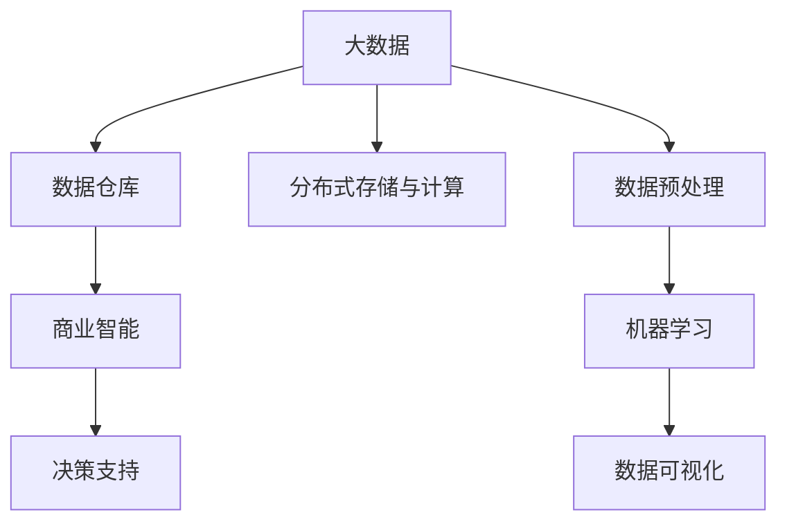

                 

# 信息差的商业决策支持：大数据如何提升决策质量

## 1. 背景介绍

### 1.1 问题由来

在现代社会，信息爆炸与信息不对称问题愈发严重。在大数据和互联网技术的推动下，信息的生产与传播速度不断加快，企业决策者面临的信息量比以往任何时候都要多。但与此同时，信息的真伪难辨、片面片面、不完整的现象屡见不鲜，这就使得决策者在做出决策时，往往存在较大的信息差。

信息差对商业决策的影响不容小觑。其不仅会带来决策失误，导致资源浪费，还会削弱企业的竞争力，影响其市场地位。为了降低信息差，提升决策质量，大数据在商业决策支持领域的应用愈发广泛。

### 1.2 问题核心关键点

大数据在商业决策支持中的应用，主要体现在以下三个方面：

- **数据收集**：通过爬虫、API、社交媒体分析等手段，收集多来源、多渠道的数据。
- **数据存储与处理**：采用分布式存储与计算技术，如Hadoop、Spark等，对海量数据进行高效处理。
- **数据分析与决策支持**：利用机器学习、数据挖掘等算法，进行数据建模与分析，支持决策者制定科学、准确的决策。

本文将深入探讨大数据在商业决策支持中的应用，特别是数据收集、存储与处理的详细技术原理，以及数据分析与决策支持的算法实现。通过系统介绍这些关键技术，希望能为读者提供深入的技术指导和实用的应用思路。

## 2. 核心概念与联系

### 2.1 核心概念概述

为更好地理解大数据在商业决策支持中的应用，我们先介绍几个核心概念：

- **大数据（Big Data）**：指数据量巨大、类型繁多、速度极快的数据集，通常以PB级别存储。
- **数据仓库（Data Warehouse）**：用于集中存储和管理企业内部及外部的数据，以便支持商业智能分析、决策支持等。
- **分布式存储与计算（Distributed Storage & Computing）**：指通过网络将数据和计算任务分布在多个节点上，实现高效的数据存储与处理。
- **数据预处理（Data Preprocessing）**：对原始数据进行清洗、转换、规范化等处理，以保证数据质量和一致性。
- **机器学习（Machine Learning）**：一种通过数据训练模型，实现预测、分类、聚类等功能的算法。
- **数据可视化（Data Visualization）**：将数据转化为直观的图表、图像，便于人们理解和分析数据。
- **商业智能（Business Intelligence）**：通过数据收集、分析和报告，为商业决策提供支持。

这些概念之间的逻辑关系可以通过以下Mermaid流程图来展示：



这个流程图展示了大数据在商业决策支持中的关键步骤：

1. 收集大数据，存储到数据仓库中。
2. 采用分布式存储与计算技术处理数据。
3. 对数据进行预处理，提升数据质量。
4. 利用机器学习进行数据分析和建模。
5. 通过数据可视化呈现结果，辅助决策。
6. 将商业智能分析结果应用到决策支持中。

## 3. 核心算法原理 & 具体操作步骤
### 3.1 算法原理概述

大数据在商业决策支持中的应用，主要基于数据收集、存储与处理以及数据分析与决策支持两大核心模块。

- **数据收集**：通过多种方式收集企业内外部的数据，存储到分布式存储系统中。
- **数据存储与处理**：采用分布式存储与计算技术，如Hadoop、Spark等，对海量数据进行高效处理。
- **数据分析与决策支持**：利用机器学习、数据挖掘等算法，进行数据建模与分析，支持决策者制定科学、准确的决策。

### 3.2 算法步骤详解

以下我们将详细介绍数据收集、存储与处理以及数据分析与决策支持的详细步骤。

**Step 1: 数据收集**

- 利用爬虫技术从互联网、社交媒体等渠道收集公开数据。
- 通过API接口获取企业内部的业务数据，如销售、财务等。
- 利用数据采集工具收集市场、用户等第三方数据。
- 将收集到的数据进行清洗、转换、规范化，确保数据质量。

**Step 2: 数据存储与处理**

- 将处理后的数据存储到分布式文件系统中，如HDFS。
- 采用分布式计算框架（如Spark）对数据进行高效处理，提取有用信息。
- 对数据进行清洗、去重、归一化等预处理，保证数据一致性和完整性。
- 进行数据分片、并行处理，提高计算效率。

**Step 3: 数据分析与决策支持**

- 利用机器学习算法（如回归、分类、聚类等）对数据进行建模与分析。
- 通过数据挖掘技术提取有用信息，如用户行为模式、市场趋势等。
- 将分析结果进行可视化，通过图表、仪表盘等形式展现，便于决策者理解。
- 结合商业智能工具，生成决策支持报告，辅助决策者做出科学决策。

### 3.3 算法优缺点

大数据在商业决策支持中，有以下优点：

- **数据丰富**：通过多渠道数据收集，能够获取更加全面、准确的信息。
- **处理高效**：采用分布式存储与计算技术，对海量数据进行处理，大大提高效率。
- **分析深入**：利用机器学习、数据挖掘等算法，深入分析数据，提取有用信息。
- **支持智能决策**：通过数据可视化、商业智能等工具，支持决策者做出科学、准确的决策。

同时，大数据在应用过程中也存在一些局限性：

- **数据隐私**：在数据收集和存储过程中，存在隐私泄露的风险。
- **计算资源需求高**：处理海量数据需要高性能的计算资源，成本较高。
- **数据质量难以保证**：数据收集和清洗过程中，难以完全消除错误和噪声。
- **算法复杂性高**：机器学习等算法的复杂性较高，对数据和算法的质量要求较高。

## 4. 数学模型和公式 & 详细讲解 & 举例说明

### 4.1 数学模型构建

在商业决策支持中，我们通常使用回归模型、分类模型、聚类模型等机器学习算法进行数据分析和建模。以下我们将以回归模型为例，详细说明其构建和应用。

假设我们要预测销售额（Y），并使用时间（X1）、季节性因素（X2）、促销活动（X3）等特征作为自变量，可以构建线性回归模型如下：

$$
Y = \beta_0 + \beta_1 X_1 + \beta_2 X_2 + \beta_3 X_3 + \epsilon
$$

其中，$\beta_0$ 为截距，$\beta_1, \beta_2, \beta_3$ 为特征系数，$\epsilon$ 为误差项。

### 4.2 公式推导过程

线性回归模型的目标是最小化预测误差。在给定训练集 $(x_i, y_i)$ 的情况下，可以使用最小二乘法求解回归系数 $\beta$。具体步骤如下：

1. 根据训练集计算出预测值 $\hat{y}_i = \beta_0 + \beta_1 x_{i1} + \beta_2 x_{i2} + \beta_3 x_{i3}$。
2. 计算预测误差 $e_i = y_i - \hat{y}_i$。
3. 最小化误差平方和 $\sum_{i=1}^N e_i^2$，即求解 $\min_{\beta_0, \beta_1, \beta_2, \beta_3} \sum_{i=1}^N (y_i - \hat{y}_i)^2$。

求解上述最小化问题，得到回归系数 $\beta = (\mathbf{X}^T \mathbf{X})^{-1} \mathbf{X}^T \mathbf{y}$，其中 $\mathbf{X}$ 为特征矩阵，$\mathbf{y}$ 为标签向量。

### 4.3 案例分析与讲解

假设某电商平台希望通过用户行为数据预测用户购买概率，收集了以下数据：

- 时间（月）
- 点击次数
- 浏览时间
- 购买次数

我们假设点击次数（X1）和浏览时间（X2）与购买次数（Y）之间存在线性关系，利用上述线性回归模型进行建模和预测。具体步骤如下：

1. 收集历史数据，得到训练集。
2. 将数据转换为特征矩阵 $\mathbf{X}$ 和标签向量 $\mathbf{y}$。
3. 使用最小二乘法求解回归系数 $\beta$。
4. 对新数据进行预测，并计算预测误差。
5. 评估模型性能，通过混淆矩阵、准确率、召回率等指标评估模型效果。

## 5. 项目实践：代码实例和详细解释说明

### 5.1 开发环境搭建

在进行项目实践前，我们需要准备好开发环境。以下是使用Python进行Pandas、NumPy、Scikit-learn等库的开发环境配置流程：

1. 安装Anaconda：从官网下载并安装Anaconda，用于创建独立的Python环境。
2. 创建并激活虚拟环境：
```bash
conda create -n pyenv python=3.8 
conda activate pyenv
```
3. 安装必要的库：
```bash
pip install pandas numpy scikit-learn matplotlib seaborn
```

完成上述步骤后，即可在`pyenv`环境中开始项目实践。

### 5.2 源代码详细实现

以下我们将以线性回归模型为例，给出使用Scikit-learn库进行回归模型训练和预测的PyTorch代码实现。

首先，定义训练集和测试集：

```python
import pandas as pd
from sklearn.model_selection import train_test_split

# 读取数据集
data = pd.read_csv('sales_data.csv')

# 提取特征和标签
X = data[['time', 'click_count', 'browsing_time']]
y = data['purchase_count']

# 划分训练集和测试集
X_train, X_test, y_train, y_test = train_test_split(X, y, test_size=0.2, random_state=42)
```

然后，定义回归模型：

```python
from sklearn.linear_model import LinearRegression

# 创建线性回归模型
model = LinearRegression()

# 训练模型
model.fit(X_train, y_train)

# 在测试集上进行预测
y_pred = model.predict(X_test)
```

最后，评估模型性能：

```python
from sklearn.metrics import mean_squared_error, r2_score

# 计算均方误差和R^2系数
mse = mean_squared_error(y_test, y_pred)
r2 = r2_score(y_test, y_pred)

# 输出评估结果
print(f"均方误差: {mse:.3f}, R^2系数: {r2:.3f}")
```

以上就是使用Scikit-learn库对线性回归模型进行训练和评估的完整代码实现。可以看到，通过简单的几行代码，我们便完成了数据加载、模型训练、预测和评估的全过程。

### 5.3 代码解读与分析

让我们再详细解读一下关键代码的实现细节：

**train_test_split方法**：
- 用于将数据集划分为训练集和测试集，默认比例为70%和30%。
- 通过设置`test_size`和`random_state`参数，可以控制划分比例和随机种子，确保数据分割的随机性和一致性。

**LinearRegression模型**：
- 使用Scikit-learn库中的线性回归模型。
- 通过`fit`方法进行模型训练，`predict`方法进行预测。
- 模型训练和预测的过程中，Scikit-learn会自动进行数据预处理和转换。

**均方误差和R^2系数**：
- 通过`mean_squared_error`和`r2_score`函数计算回归模型的均方误差和R^2系数。
- 均方误差衡量预测值与真实值之间的差异，越小表示模型越好。
- R^2系数衡量模型对数据拟合程度，越接近1表示模型越好。

**输出评估结果**：
- 通过`print`函数输出均方误差和R^2系数，直观展示模型性能。

## 6. 实际应用场景

### 6.1 客户关系管理（CRM）

在大数据和机器学习技术的支持下，客户关系管理（CRM）系统可以实现对客户数据的深度分析与挖掘，从而提高客户满意度和服务质量。具体应用场景包括：

- **客户细分**：通过分析客户数据，将客户按照行为、属性等进行细分，实现精准营销。
- **客户流失预测**：利用机器学习模型，预测客户流失的概率，及时采取挽留措施。
- **客户生命周期管理**：跟踪客户生命周期各阶段的表现，制定科学的客户管理策略。

### 6.2 供应链管理

供应链管理是一个复杂且动态的系统，需要大量的数据进行支持。大数据在供应链管理中的应用，可以提升供应链的透明度和效率。具体应用场景包括：

- **需求预测**：通过分析历史销售数据、市场趋势等，预测未来的需求，避免库存积压或缺货。
- **库存优化**：利用机器学习模型，优化库存水平，减少库存成本和缺货损失。
- **供应商评估**：通过分析供应商的绩效数据，评估供应商质量，选择最优供应商。

### 6.3 金融风险管理

金融行业的数据量庞大且复杂，利用大数据和机器学习技术，可以实现对金融风险的精准评估和管理。具体应用场景包括：

- **信用评分**：通过分析客户的历史交易数据，评估客户的信用评分，决定是否发放贷款。
- **欺诈检测**：利用机器学习模型，检测和预防欺诈行为，保护金融机构资产安全。
- **市场预测**：通过分析市场数据，预测市场趋势，辅助投资决策。

### 6.4 未来应用展望

随着大数据和机器学习技术的不断进步，其在商业决策支持中的应用将更加广泛和深入。未来可能的应用场景包括：

- **智能决策支持**：通过深度学习和自然语言处理技术，实现对多源数据的全方位分析，支持智能决策。
- **实时决策支持**：利用实时数据流处理技术，实现实时决策支持，满足业务需求。
- **跨领域决策支持**：结合多领域数据，实现跨领域决策支持，提升决策的全面性和科学性。

## 7. 工具和资源推荐

### 7.1 学习资源推荐

为了帮助开发者系统掌握大数据在商业决策支持中的应用，这里推荐一些优质的学习资源：

1. **《Python数据科学手册》**：一本系统介绍Python数据科学技术的书籍，涵盖数据处理、机器学习等诸多方面。
2. **《机器学习实战》**：一本实战性强的机器学习入门书籍，通过具体项目介绍机器学习的基本原理和应用。
3. **《大数据技术与应用》**：一本介绍大数据技术和应用的书籍，涵盖数据收集、存储、处理等诸多环节。
4. **Kaggle平台**：一个数据科学竞赛平台，通过实际项目训练机器学习模型，积累实战经验。
5. **Coursera平台**：一个在线学习平台，提供大数据和机器学习等课程，系统学习相关知识。

通过对这些资源的学习实践，相信你一定能够快速掌握大数据在商业决策支持中的应用，并用于解决实际的决策问题。

### 7.2 开发工具推荐

高效的开发离不开优秀的工具支持。以下是几款用于大数据项目开发的常用工具：

1. **Jupyter Notebook**：一个免费的开源工具，用于编写和运行Python代码，支持多格式的数据处理和可视化。
2. **Tableau**：一个流行的数据可视化工具，支持复杂的数据可视化操作，直观展示数据分析结果。
3. **Hadoop**：一个开源的分布式计算框架，用于处理大规模数据集。
4. **Spark**：一个快速、通用、可扩展的大数据处理引擎，支持大规模数据处理。
5. **PySpark**：一个Python接口的Spark，方便Python开发者进行数据处理和分析。

合理利用这些工具，可以显著提升大数据项目的开发效率，加快创新迭代的步伐。

### 7.3 相关论文推荐

大数据在商业决策支持中的应用，已有多篇研究论文进行了深入探讨。以下是几篇具有代表性的论文，推荐阅读：

1. **《A Survey on Data Warehousing and Big Data for Business Intelligence》**：介绍数据仓库和大数据在商业智能中的应用，涵盖数据收集、存储、处理等多个环节。
2. **《Data Mining for Business Intelligence: A Practical Guide》**：一本介绍数据挖掘技术在商业智能中应用的书籍，涵盖数据预处理、建模等多个方面。
3. **《A Survey on Data Mining in Business Intelligence》**：介绍数据挖掘技术在商业智能中的应用，涵盖分类、聚类等多个机器学习算法。
4. **《Business Intelligence Systems with Big Data: An Overview》**：一篇综述论文，介绍大数据在商业智能系统中的应用，涵盖数据收集、存储、处理等多个环节。
5. **《Business Intelligence with Big Data: Challenges and Opportunities》**：一篇探讨大数据在商业智能中应用的挑战与机遇的论文，涵盖技术挑战和解决方案。

这些论文代表了大数据在商业决策支持技术的应用和发展脉络。通过学习这些前沿成果，可以帮助研究者把握学科前进方向，激发更多的创新灵感。

## 8. 总结：未来发展趋势与挑战

### 8.1 总结

本文对大数据在商业决策支持中的应用进行了全面系统的介绍。首先阐述了大数据在商业决策支持中的作用和意义，明确了数据收集、存储与处理以及数据分析与决策支持的核心技术原理。其次，通过详细的代码实例，展示了机器学习算法在商业决策支持中的应用。最后，我们探讨了大数据在实际应用中可能面临的挑战，提出了一些解决方案。

通过本文的系统梳理，可以看到，大数据在商业决策支持中的应用潜力巨大。数据驱动的决策能够显著提升企业竞争力，但如何高效收集、处理和分析海量数据，仍是当前面临的主要挑战。相信随着技术的不断进步和优化，大数据将为商业决策支持带来更多创新和突破，进一步推动人工智能技术在各行各业的落地应用。

### 8.2 未来发展趋势

展望未来，大数据在商业决策支持中的应用将呈现以下几个发展趋势：

1. **数据多样化**：随着互联网和物联网的发展，数据来源将更加多样化，数据类型也将更加复杂，这将推动大数据技术的多样化发展。
2. **数据实时化**：实时数据流处理技术的发展，将使得商业决策更加及时和准确。
3. **数据智能化**：通过深度学习和自然语言处理技术，实现对多源数据的全方位分析，支持智能决策。
4. **跨领域融合**：结合多领域数据，实现跨领域决策支持，提升决策的全面性和科学性。
5. **人工智能与大数据融合**：利用人工智能技术，进一步提升大数据在商业决策支持中的效果和应用范围。

### 8.3 面临的挑战

尽管大数据在商业决策支持中取得了显著成果，但在迈向更加智能化、普适化应用的过程中，它仍面临诸多挑战：

1. **数据隐私和安全性**：在数据收集和存储过程中，存在隐私泄露和数据安全问题。
2. **数据质量和一致性**：数据收集和清洗过程中，难以完全消除错误和噪声。
3. **计算资源需求高**：处理海量数据需要高性能的计算资源，成本较高。
4. **算法复杂性高**：机器学习等算法的复杂性较高，对数据和算法的质量要求较高。
5. **技术集成难度大**：数据、算法、工具等多个环节的集成，需要高度的技术能力和协调能力。

### 8.4 研究展望

面对大数据在商业决策支持中面临的挑战，未来的研究需要在以下几个方面寻求新的突破：

1. **数据隐私保护**：开发更加高效的数据隐私保护技术，保障数据安全和隐私。
2. **数据质量提升**：研究高效的数据清洗和预处理技术，提升数据质量。
3. **计算资源优化**：优化计算资源配置，降低计算成本。
4. **算法简化**：简化机器学习等算法的实现，降低算法复杂度。
5. **技术集成优化**：研究数据、算法、工具等多个环节的集成优化，提升系统性能。

## 9. 附录：常见问题与解答

**Q1：大数据在商业决策支持中的应用主要有哪些？**

A: 大数据在商业决策支持中的应用主要包括数据收集、存储与处理以及数据分析与决策支持两大核心模块。数据收集可以通过爬虫、API、社交媒体分析等手段，从多渠道收集数据。存储与处理可以采用分布式存储与计算技术，如Hadoop、Spark等，对海量数据进行处理。分析与决策支持可以通过机器学习、数据挖掘等算法，进行数据建模与分析，支持决策者制定科学、准确的决策。

**Q2：数据收集和存储过程中需要注意哪些问题？**

A: 数据收集和存储过程中需要注意以下几个问题：

- **数据隐私**：在数据收集和存储过程中，需要采取措施保障数据隐私，避免隐私泄露。
- **数据质量**：需要确保数据的质量和一致性，避免数据错误和噪声。
- **数据安全**：需要采取措施保障数据的安全，防止数据泄露和攻击。

**Q3：数据预处理主要包括哪些步骤？**

A: 数据预处理主要包括以下几个步骤：

- **数据清洗**：去除重复数据、缺失值、异常值等。
- **数据转换**：将数据转换为统一格式，方便后续处理。
- **数据归一化**：将数据进行归一化处理，保证数据一致性。
- **数据集成**：将不同来源的数据进行整合，形成统一的数据集。

**Q4：机器学习在商业决策支持中的应用有哪些？**

A: 机器学习在商业决策支持中的应用主要包括以下几个方面：

- **预测分析**：利用回归、分类等算法，对数据进行预测，支持决策者制定科学、准确的决策。
- **数据挖掘**：通过数据挖掘技术，提取有用信息，如用户行为模式、市场趋势等。
- **异常检测**：利用异常检测算法，识别数据中的异常点，进行风险预警。

**Q5：未来大数据在商业决策支持中的应用前景如何？**

A: 未来大数据在商业决策支持中的应用前景非常广阔。随着数据技术的发展，大数据将更加多样化、实时化和智能化。数据驱动的决策将更加精准、科学，企业竞争力也将进一步提升。此外，大数据与人工智能技术的融合，将带来更多的创新应用和突破，推动商业决策支持系统向更加智能化、普适化的方向发展。

---

作者：禅与计算机程序设计艺术 / Zen and the Art of Computer Programming

