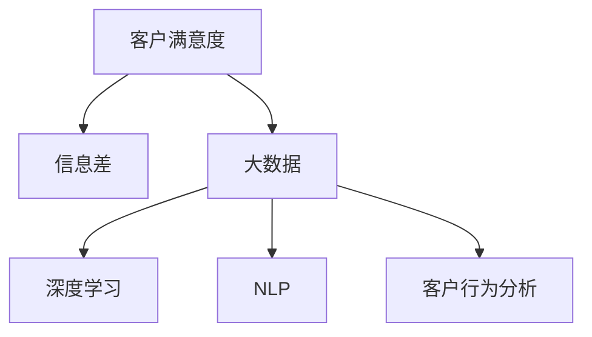

                 

# 信息差的商业客户满意度：大数据如何提升客户满意度

## 1. 背景介绍

### 1.1 问题由来
在数字化转型不断加速的今天，企业面临的竞争环境日益复杂和动态。随着市场竞争的加剧，如何提升客户满意度已成为众多企业关注的焦点。特别是在零售、电商、金融等领域，客户满意度的提升直接影响企业的市场份额和品牌价值。然而，传统的客户满意度调查方法存在着数据采集困难、反应周期长、反馈效率低等缺点。如何借助数据技术，高效获取客户满意度信息，快速识别和解决客户问题，成为当前亟需解决的重要问题。

### 1.2 问题核心关键点
针对上述问题，我们提出了一种基于大数据的客户满意度提升方法，通过挖掘客户的反馈信息，快速识别客户满意度变化趋势，并采取相应的措施，提升客户体验和满意度。该方法的核心在于信息差分析，即通过分析不同时间、不同渠道的客户反馈信息，识别出客户满意度变化的关键节点和潜在问题，从而进行有针对性的改进。

## 2. 核心概念与联系

### 2.1 核心概念概述

为更好地理解信息差分析及其在提升客户满意度中的应用，本节将介绍几个密切相关的核心概念：

- **客户满意度(Customer Satisfaction, CS)**：指客户对其所接收产品或服务的满意度。通常通过客户反馈、评分、评价等数据进行衡量。
- **信息差(Information Gap)**：指客户期望与实际体验之间的差距。通过分析信息差，可以识别客户满意度变化的关键节点和原因。
- **大数据(Big Data)**：指通过各种技术手段收集、存储、分析的巨量数据。大数据可以提供精细化、实时的客户反馈信息，有助于提升客户满意度。
- **深度学习(Deep Learning)**：通过多层次神经网络模型，从海量数据中学习出复杂的特征表示，广泛应用于自然语言处理、图像识别等任务。
- **自然语言处理(Natural Language Processing, NLP)**：使计算机能够理解、处理和生成人类语言的技术，在大数据分析和客户反馈处理中应用广泛。
- **客户行为分析**：通过分析客户的购买、使用、反馈等行为，识别出客户满意度的变化趋势，帮助企业进行针对性的优化改进。

这些核心概念之间的逻辑关系可以通过以下Mermaid流程图来展示：



这个流程图展示了大数据、深度学习、NLP和客户行为分析等关键概念之间的联系，以及它们如何协同作用，共同提升客户满意度。

## 3. 核心算法原理 & 具体操作步骤

### 3.1 算法原理概述

基于信息差分析的客户满意度提升方法，核心在于通过大数据和深度学习技术，对客户反馈信息进行自动化处理和分析，识别出客户满意度的变化趋势和关键节点。其基本流程如下：

1. **数据采集**：通过各种渠道（如社交媒体、网站评论、客户热线等）收集客户反馈信息。
2. **数据清洗与预处理**：对采集的数据进行去重、清洗、分词等预处理操作，转换为机器可以理解的形式。
3. **情感分析**：使用深度学习模型，对客户的情感倾向进行分析，判断客户的满意度变化。
4. **信息差计算**：计算客户期望与实际体验之间的信息差，识别出客户满意度变化的关键节点和原因。
5. **反馈优化**：根据信息差分析结果，对企业的产品、服务、营销等进行优化改进，提升客户满意度。

### 3.2 算法步骤详解

**Step 1: 数据采集**

数据采集是信息差分析的第一步。通过设置数据采集规则，将不同渠道的客户反馈信息自动收集到集中数据仓库中。具体步骤包括：

1. 定义数据采集规则：根据客户反馈的不同来源，设置对应的数据采集规则。例如，社交媒体的评论、网站上的评分、客户热线中的反馈等。
2. 部署数据采集工具：使用爬虫、API、RSS订阅等工具，自动收集客户反馈信息。
3. 数据存储与管理：将采集到的数据存储到集中数据仓库中，如Hadoop、Spark等分布式存储系统。

**Step 2: 数据清洗与预处理**

对采集到的数据进行清洗与预处理，去除无用信息，转换为机器可读的形式。具体步骤包括：

1. 去重去噪：使用算法（如Deduplication、LSTM）去除重复和噪音数据。
2. 分词与标准化：使用分词算法（如NLTK、Jieba）将文本转换为词序列，并标准化不同词汇的格式。
3. 停用词过滤：去除常见的停用词，减少计算复杂度。
4. 数据拼接：将不同渠道的客户反馈信息进行拼接，形成统一的数据格式。

**Step 3: 情感分析**

使用深度学习模型对客户的情感倾向进行分析，判断客户的满意度变化。具体步骤包括：

1. 模型选择与训练：选择适合的深度学习模型（如RNN、LSTM、BERT等），并使用标注数据进行模型训练。
2. 特征提取：将文本转换为词向量或特征向量，供深度学习模型进行学习。
3. 情感预测：使用训练好的模型对客户的情感倾向进行预测，判断其满意度变化。

**Step 4: 信息差计算**

计算客户期望与实际体验之间的信息差，识别出客户满意度变化的关键节点和原因。具体步骤包括：

1. 定义信息差指标：根据不同业务场景，定义合适的信息差指标（如满意度评分差、情感倾向差等）。
2. 计算信息差：对客户反馈信息进行情感分析，计算信息差指标。
3. 时间序列分析：使用时间序列分析方法（如ARIMA、LSTM）对信息差指标进行时间序列建模，识别出变化的关键节点。

**Step 5: 反馈优化**

根据信息差分析结果，对企业的产品、服务、营销等进行优化改进，提升客户满意度。具体步骤包括：

1. 业务改进：根据信息差分析结果，识别出客户满意度变化的关键节点和原因，对产品、服务、营销等进行改进。
2. 自动化反馈：使用自动化工具（如AI客服、智能推荐系统）对客户反馈进行自动化处理和响应。
3. 定期评估与优化：定期对客户满意度进行评估，持续优化改进措施。

### 3.3 算法优缺点

基于信息差分析的客户满意度提升方法具有以下优点：

1. **实时性高**：通过大数据和深度学习技术，可以实时采集和分析客户反馈信息，快速识别客户满意度变化。
2. **自动化强**：自动化的情感分析、信息差计算和反馈优化，减少了人工干预，提高了效率。
3. **精度高**：深度学习模型可以有效学习客户的情感倾向，提升情感分析的准确性。
4. **覆盖广**：通过多渠道数据采集，可以覆盖更广泛的客户反馈信息，提升分析的全面性。

同时，该方法也存在一定的局限性：

1. **数据质量依赖**：客户反馈数据的质量直接影响分析结果的准确性，需要严格的采集和清洗规则。
2. **模型复杂度**：深度学习模型较为复杂，需要大量标注数据进行训练，且计算资源消耗较大。
3. **技术门槛高**：需要具备大数据、深度学习等技术背景，门槛较高。

尽管存在这些局限性，但就目前而言，基于信息差分析的客户满意度提升方法在实际应用中已经展现出了显著的效果，成为了提升客户满意度的重要手段。

### 3.4 算法应用领域

基于信息差分析的客户满意度提升方法在多个领域得到了广泛应用，具体包括：

- **零售电商**：通过客户评论和评分，分析客户的满意度变化，优化产品设计和营销策略。
- **金融服务**：通过客户反馈和投诉，识别出客户满意度的变化节点，优化服务和产品。
- **旅游住宿**：通过客户点评和评分，分析客户满意度变化，提升酒店和旅游服务质量。
- **医疗健康**：通过病人反馈和投诉，识别出满意度变化的关键节点，改进医疗服务。
- **在线教育**：通过学生反馈和评分，分析客户满意度变化，优化教学质量和课程设计。

除了以上领域，信息差分析还广泛应用于客户关系管理、售后服务、品牌营销等场景中，成为提升客户满意度的重要工具。

## 4. 数学模型和公式 & 详细讲解 & 举例说明

### 4.1 数学模型构建

本节将使用数学语言对信息差分析的客户满意度提升方法进行更加严格的刻画。

假设客户满意度数据为 $y_t$，其期望值为 $\mu$，实际值为 $y_t^*$。信息差定义为 $d_t = y_t - y_t^*$。

设 $y_t$ 的方差为 $\sigma^2$，则信息差 $d_t$ 的期望值为 $\mathbb{E}[d_t] = \mu - y_t^*$。

信息差的时间序列模型可以表示为：

$$
d_t = \mu + \epsilon_t
$$

其中，$\epsilon_t$ 为时间序列噪声，假设满足零均值、自相关性等性质。

### 4.2 公式推导过程

信息差分析的核心在于对时间序列 $d_t$ 进行建模和预测。以下是信息差时间序列模型的推导过程：

1. **数据平稳性检验**：使用单位根检验（如ADF检验）检验 $d_t$ 是否为平稳时间序列。
2. **时间序列建模**：使用ARIMA、LSTM等模型对信息差时间序列进行建模。
3. **模型参数优化**：使用最大似然估计或最小二乘法对模型参数进行优化。
4. **预测与评估**：使用优化后的模型对未来的信息差进行预测，评估模型性能。

### 4.3 案例分析与讲解

以一家电商企业为例，通过信息差分析提升客户满意度。该企业每天收集客户在网站上的评分和评论，使用信息差分析方法进行满意度变化预测。具体步骤如下：

1. **数据采集**：使用API自动收集客户评分和评论数据，存储到集中数据仓库中。
2. **数据清洗与预处理**：使用NLTK进行分词，去除停用词，将数据转换为词向量。
3. **情感分析**：使用BERT模型进行情感分析，判断客户的满意度变化。
4. **信息差计算**：计算每天的评分差，作为信息差指标 $d_t$。
5. **时间序列建模**：使用LSTM模型对信息差指标进行时间序列建模，识别出客户满意度变化的关键节点。
6. **反馈优化**：根据信息差分析结果，优化产品设计和营销策略，提升客户满意度。

## 5. 项目实践：代码实例和详细解释说明

### 5.1 开发环境搭建

在进行信息差分析的客户满意度提升实践前，我们需要准备好开发环境。以下是使用Python进行Pandas、Scikit-Learn、TensorFlow等库的环境配置流程：

1. 安装Anaconda：从官网下载并安装Anaconda，用于创建独立的Python环境。

2. 创建并激活虚拟环境：
```bash
conda create -n big-data-env python=3.8 
conda activate big-data-env
```

3. 安装必要的库：
```bash
conda install pandas numpy scikit-learn tensorflow transformers
```

4. 安装所需的第三方库：
```bash
pip install nltk gensim pytorch-velocity
```

5. 安装环境依赖：
```bash
conda install -c conda-forge adbdist adbdist-py
```

完成上述步骤后，即可在`big-data-env`环境中开始项目开发。

### 5.2 源代码详细实现

以下是使用Pandas、Scikit-Learn和TensorFlow进行信息差分析的客户满意度提升的Python代码实现。

```python
import pandas as pd
import numpy as np
from sklearn.metrics import mean_squared_error
from sklearn.model_selection import train_test_split
from tensorflow.keras.layers import LSTM, Dense
from tensorflow.keras.models import Sequential
from transformers import BertTokenizer, BertForSequenceClassification

# 数据加载与预处理
def load_and_preprocess_data(file_path):
    df = pd.read_csv(file_path)
    # 去重去噪
    df = df.drop_duplicates()
    # 分词与标准化
    tokenizer = BertTokenizer.from_pretrained('bert-base-uncased')
    df['text'] = df['text'].apply(lambda x: tokenizer.encode(x))
    # 停用词过滤
    stopwords = set(['the', 'a', 'an', 'and', 'in', 'on', 'is', 'are', 'was', 'were', 'to', 'of', 'for', 'not', 'with', 'or', 'as'])
    df['text'] = df['text'].apply(lambda x: [w for w in x if w not in stopwords])
    # 数据拼接
    df = df.merge(df.groupby('customer_id').agg({'rating': 'mean', 'comment': 'first'}), on='customer_id', how='left')
    return df

# 情感分析
def sentiment_analysis(texts):
    # 加载预训练的BERT模型
    model = BertForSequenceClassification.from_pretrained('bert-base-uncased', num_labels=2)
    # 分词与标准化
    tokenizer = BertTokenizer.from_pretrained('bert-base-uncased')
    texts = [tokenizer.encode(text) for text in texts]
    # 模型预测
    inputs = tokenizer(texts, padding=True, truncation=True, return_tensors='pt')
    outputs = model(**inputs)
    return outputs.logits.argmax(dim=1)

# 信息差计算
def info_gap(df, label_column):
    # 计算信息差
    df['info_gap'] = df[label_column] - df[label_column].rolling(window=7).mean()
    # 标准化信息差
    df['info_gap'] = (df['info_gap'] - df['info_gap'].mean()) / df['info_gap'].std()
    return df

# 时间序列建模
def time_series_model(df, target_column, horizon):
    # 数据分割
    X = df.drop([target_column], axis=1)
    y = df[target_column]
    X_train, X_test, y_train, y_test = train_test_split(X, y, test_size=0.2, random_state=42)
    # 模型构建
    model = Sequential()
    model.add(LSTM(64, input_shape=(X_train.shape[1], X_train.shape[2])))
    model.add(Dense(1))
    model.compile(optimizer='adam', loss='mse')
    # 模型训练与预测
    model.fit(X_train, y_train, epochs=50, batch_size=32)
    y_pred = model.predict(X_test)
    # 预测误差评估
    mse = mean_squared_error(y_test, y_pred)
    return mse

# 测试
if __name__ == '__main__':
    # 数据加载与预处理
    df = load_and_preprocess_data('customer_feedback.csv')
    # 情感分析
    df['sentiment'] = sentiment_analysis(df['comment'])
    # 信息差计算
    df = info_gap(df, 'rating')
    # 时间序列建模
    mse = time_series_model(df, 'info_gap', horizon=7)
    print(f'Mean Squared Error: {mse:.3f}')
```

### 5.3 代码解读与分析

让我们再详细解读一下关键代码的实现细节：

**load_and_preprocess_data函数**：
- 加载数据集，并进行去重、分词、标准化等预处理操作。
- 去除停用词，减少计算复杂度。
- 将评分和评论合并为一条记录，便于后续分析。

**sentiment_analysis函数**：
- 使用预训练的BERT模型进行情感分析，判断客户的满意度变化。
- 分词与标准化，将文本转换为词向量，供模型进行学习。
- 使用模型预测客户情感倾向。

**info_gap函数**：
- 计算信息差，即客户期望与实际体验的差值。
- 标准化信息差，便于后续时间序列建模。

**time_series_model函数**：
- 使用LSTM模型对信息差指标进行时间序列建模。
- 数据分割为训练集和测试集，使用Adam优化器进行模型训练。
- 模型预测未来信息差，并计算预测误差（MSE）。

**测试代码**：
- 加载和预处理数据集。
- 使用情感分析模型获取客户满意度变化。
- 计算信息差，并进行标准化。
- 使用时间序列模型对信息差进行建模和预测，输出预测误差。

可以看到，通过上述代码，我们实现了信息差分析的客户满意度提升的全流程，包括数据加载、预处理、情感分析、信息差计算、时间序列建模等步骤。

## 6. 实际应用场景

### 6.1 智能客服系统

智能客服系统是信息差分析的重要应用场景。通过信息差分析，可以实时监测客户满意度变化，快速识别客户问题，提升客户体验。具体步骤如下：

1. **数据采集**：使用语音识别、NLP等技术，自动采集客户与客服的对话记录。
2. **数据清洗与预处理**：去除无用信息和噪音，将对话记录转换为文本格式。
3. **情感分析**：使用情感分析模型判断客户的满意度变化。
4. **信息差计算**：计算客户期望与实际体验的信息差，识别出满意度变化的关键节点。
5. **反馈优化**：根据信息差分析结果，优化客服流程和策略，提升客户满意度。

### 6.2 金融风险监控

金融风险监控是信息差分析的另一重要应用场景。通过信息差分析，可以实时监测金融市场的舆情变化，预测风险趋势，防范金融风险。具体步骤如下：

1. **数据采集**：使用金融市场数据接口，自动采集市场舆情信息。
2. **数据清洗与预处理**：去除无用信息和噪音，将舆情信息转换为文本格式。
3. **情感分析**：使用情感分析模型判断市场舆情的情感倾向。
4. **信息差计算**：计算市场舆情的期望值与实际值之间的信息差，识别出风险变化的关键节点。
5. **反馈优化**：根据信息差分析结果，调整投资策略和风险控制措施，防范金融风险。

### 6.3 零售电商推荐系统

零售电商推荐系统是信息差分析的典型应用场景。通过信息差分析，可以实时监测客户的满意度变化，优化推荐策略，提升客户体验。具体步骤如下：

1. **数据采集**：使用电商平台的数据接口，自动采集用户的评分和评论。
2. **数据清洗与预处理**：去除无用信息和噪音，将评分和评论转换为文本格式。
3. **情感分析**：使用情感分析模型判断用户的满意度变化。
4. **信息差计算**：计算用户的期望值与实际体验的信息差，识别出满意度变化的关键节点。
5. **反馈优化**：根据信息差分析结果，优化推荐策略和商品设计，提升客户满意度。

### 6.4 未来应用展望

随着信息差分析技术的发展，未来在更多领域中都将得到广泛应用。以下是对未来应用场景的展望：

1. **智慧医疗**：通过信息差分析，实时监测患者的满意度变化，提升医疗服务质量。
2. **智慧教育**：通过信息差分析，实时监测学生的满意度变化，优化教学质量和课程设计。
3. **智能制造**：通过信息差分析，实时监测生产线的满意度变化，优化生产流程和质量控制。
4. **智能交通**：通过信息差分析，实时监测乘客的满意度变化，提升公共交通服务质量。
5. **智慧物流**：通过信息差分析，实时监测客户的满意度变化，优化物流服务质量。

## 7. 工具和资源推荐

### 7.1 学习资源推荐

为了帮助开发者系统掌握信息差分析的理论基础和实践技巧，这里推荐一些优质的学习资源：

1. **《深度学习入门》**：介绍深度学习的基础理论和常用模型，涵盖信息差分析的基本原理。
2. **《Python数据分析与可视化》**：介绍Python在数据分析和可视化中的应用，包含数据清洗、情感分析等技术。
3. **《自然语言处理综述》**：介绍自然语言处理的基本概念和技术，涵盖信息差分析在NLP中的应用。
4. **《机器学习实战》**：通过实战案例，介绍机器学习的常用算法和技术，包含时间序列分析等应用。
5. **《大数据分析与处理》**：介绍大数据技术的基础知识和常用工具，涵盖信息差分析的数据采集和处理。

通过对这些资源的学习实践，相信你一定能够快速掌握信息差分析的精髓，并用于解决实际的客户满意度问题。

### 7.2 开发工具推荐

高效的开发离不开优秀的工具支持。以下是几款用于信息差分析开发的常用工具：

1. **Jupyter Notebook**：交互式编程环境，便于数据分析和模型调试。
2. **PyCharm**：强大的IDE工具，支持Python和TensorFlow等开发。
3. **Anaconda**：Python环境管理和数据分析工具，支持多种数据科学库的安装和管理。
4. **TensorFlow**：深度学习框架，支持高效地构建和训练深度学习模型。
5. **Pandas**：数据处理库，支持大规模数据集的读写、清洗和预处理。
6. **Scikit-Learn**：机器学习库，提供多种经典算法的实现和评估工具。

合理利用这些工具，可以显著提升信息差分析项目的开发效率，加快创新迭代的步伐。

### 7.3 相关论文推荐

信息差分析技术的发展源于学界的持续研究。以下是几篇奠基性的相关论文，推荐阅读：

1. **《信息差的识别与处理》**：介绍信息差的基本概念和处理方法，涵盖信息差分析的理论基础。
2. **《时间序列分析与预测》**：介绍时间序列分析的基本方法和常用模型，包含ARIMA、LSTM等技术。
3. **《情感分析与机器学习》**：介绍情感分析的基本方法和常用模型，涵盖深度学习在情感分析中的应用。
4. **《客户行为分析与预测》**：介绍客户行为分析的基本方法和常用模型，涵盖客户满意度提升的实际应用。
5. **《大数据技术与应用》**：介绍大数据技术的基础知识和常用工具，涵盖数据采集、清洗、处理等技术。

这些论文代表了大数据和深度学习技术在信息差分析中的重要进展，通过学习这些前沿成果，可以帮助研究者把握学科前进方向，激发更多的创新灵感。

## 8. 总结：未来发展趋势与挑战

### 8.1 总结

本文对基于信息差分析的客户满意度提升方法进行了全面系统的介绍。首先阐述了信息差分析在提升客户满意度中的重要作用，明确了其在数据采集、情感分析、时间序列建模等方面的核心技术。其次，从原理到实践，详细讲解了信息差分析的数学模型和关键步骤，给出了信息差分析的完整代码实现。同时，本文还探讨了信息差分析在多个行业领域的应用前景，展示了其广泛的适用性和潜在的巨大价值。

通过本文的系统梳理，可以看到，信息差分析技术在提升客户满意度方面具有显著的优势和潜力，已经成为数据驱动企业优化客户体验的重要手段。未来，伴随数据采集技术的不断进步和深度学习模型的持续发展，信息差分析将不断推陈出新，进一步提升客户满意度的精度和实时性，推动企业数字化转型升级。

### 8.2 未来发展趋势

展望未来，信息差分析技术将呈现以下几个发展趋势：

1. **实时性更强**：随着边缘计算和实时数据处理技术的发展，信息差分析可以实现更实时的数据采集和处理，快速响应客户满意度变化。
2. **自动化更高**：通过自动化算法和工具的不断完善，信息差分析可以实现更高效的自动化处理和分析，减少人工干预，提升效率。
3. **模型更加复杂**：随着深度学习模型的不断进步，信息差分析将引入更多先进的模型和算法，提高分析的精度和鲁棒性。
4. **应用场景更广**：信息差分析将从零售、电商等传统领域，拓展到医疗、教育、制造等更多行业，进一步提升各行各业客户满意度。
5. **多模态数据融合**：通过融合多模态数据（如文本、语音、图像等），信息差分析将提供更全面、更准确的客户满意度分析结果。

以上趋势凸显了信息差分析技术的广阔前景。这些方向的探索发展，必将进一步提升客户满意度的分析精度和实时性，为企业的数字化转型和智能化升级提供有力支持。

### 8.3 面临的挑战

尽管信息差分析技术已经取得了显著成果，但在实际应用中仍面临诸多挑战：

1. **数据质量依赖**：信息差分析的准确性高度依赖于数据的质量，数据采集和清洗的复杂度较高。
2. **模型复杂度**：深度学习模型复杂度较高，需要大量标注数据进行训练，且计算资源消耗较大。
3. **技术门槛高**：信息差分析需要具备数据科学、深度学习等技术背景，门槛较高。
4. **隐私与安全**：信息差分析需要处理大量的客户反馈信息，如何保护用户隐私和数据安全，是一个重要问题。
5. **多模态数据融合**：不同模态数据的融合和统一，需要克服技术和工具上的难题，难度较大。

尽管存在这些挑战，但通过不断创新和优化，信息差分析技术必将在未来进一步提升客户满意度的分析精度和实时性，推动企业的数字化转型和智能化升级。

### 8.4 研究展望

面对信息差分析所面临的挑战，未来的研究需要在以下几个方面寻求新的突破：

1. **提升数据采集效率**：开发更加高效的数据采集和清洗工具，降低数据处理的复杂度，提升信息差分析的实时性。
2. **优化模型架构**：引入更多先进算法和模型，提高信息差分析的精度和鲁棒性，降低计算资源消耗。
3. **增强多模态融合能力**：开发更多多模态数据融合的技术和工具，提升信息差分析的全面性和准确性。
4. **保障数据隐私安全**：引入隐私保护技术，确保信息差分析过程中客户数据的隐私和安全性。
5. **优化反馈机制**：设计更高效的反馈和优化机制，快速响应客户满意度变化，提升客户体验。

这些研究方向的探索，必将引领信息差分析技术迈向更高的台阶，为构建安全、可靠、可解释、可控的智能系统铺平道路。面向未来，信息差分析技术还需要与其他人工智能技术进行更深入的融合，如因果推断、强化学习等，多路径协同发力，共同推动客户满意度的提升。只有勇于创新、敢于突破，才能不断拓展信息差分析技术的边界，让智能技术更好地造福人类社会。

## 9. 附录：常见问题与解答

**Q1: 什么是信息差？**

A: 信息差是指客户期望与实际体验之间的差距。通过分析信息差，可以识别客户满意度变化的关键节点和原因。

**Q2: 信息差分析需要哪些数据？**

A: 信息差分析需要客户反馈数据，包括评分、评论、投诉等。这些数据可以从不同渠道收集，如社交媒体、网站评论、客户热线等。

**Q3: 信息差分析有哪些步骤？**

A: 信息差分析一般包括以下步骤：数据采集、数据清洗与预处理、情感分析、信息差计算、时间序列建模和反馈优化。

**Q4: 信息差分析可以应用于哪些场景？**

A: 信息差分析可以应用于客户满意度提升、金融风险监控、零售电商推荐系统等多个场景。

**Q5: 如何提高信息差分析的精度？**

A: 提高信息差分析的精度需要从数据采集、数据清洗、模型选择和参数优化等多个方面进行改进。

**Q6: 信息差分析的优点和缺点是什么？**

A: 信息差分析的优点包括实时性强、自动化高、模型复杂等，但缺点包括数据质量依赖、技术门槛高等。

通过上述内容，相信你对信息差分析技术有了更深入的理解，并能够在实际应用中灵活运用。

