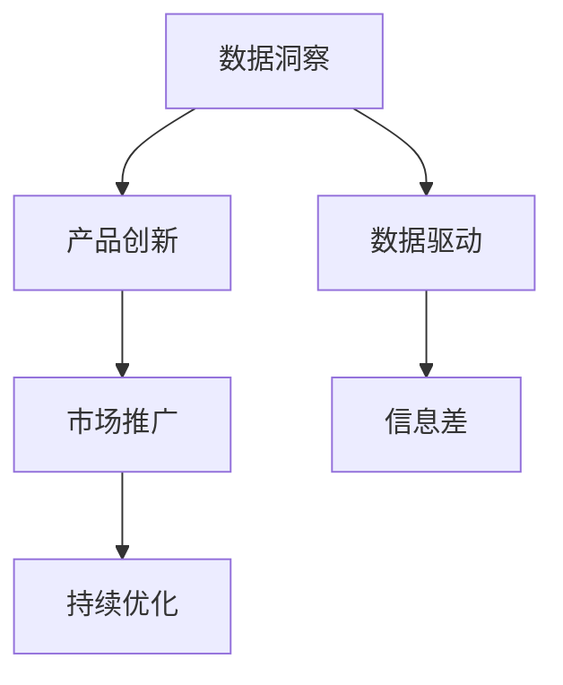

                 

# 信息差的商业模式创新之路：大数据驱动的变革之旅

> 关键词：商业模式创新, 大数据驱动, 信息差, 数据洞察, 竞争优势

## 1. 背景介绍

### 1.1 问题由来

随着互联网技术的发展，信息获取和传播变得越来越容易，企业之间的竞争也日益激烈。传统业务模式面临巨大挑战，亟需创新以适应新环境。信息差（Information Gap）作为一种新型的商业思维，通过挖掘和利用大数据，洞察用户需求和市场趋势，构建独特的商业模式，从而在竞争中获得优势。

### 1.2 问题核心关键点

信息差商业模式的核心在于利用数据洞察发现市场未被满足的需求，通过创新产品或服务，创造新的市场机会。具体而言，该模式涉及以下关键点：

- **数据洞察**：通过大数据分析技术，发现市场中的信息差，即用户需求与市场供给之间的差异。
- **产品创新**：根据数据洞察结果，设计或改进产品或服务，以满足用户未被满足的需求。
- **市场推广**：利用营销渠道，推广新方案，快速占领市场。
- **持续优化**：根据市场反馈不断调整和优化产品或服务，保持竞争优势。

### 1.3 问题研究意义

研究信息差商业模式，对于拓展企业竞争优势、提升市场份额、加速技术落地具有重要意义：

1. **提升市场竞争力**：通过数据洞察发现市场机会，可以快速定位并满足用户需求，获取市场先机。
2. **降低创新成本**：数据驱动的决策可以减少盲目投入，提高创新成功率。
3. **促进技术落地**：大数据分析技术的商业化应用，可以加速技术成果的产业化进程，推动经济增长。
4. **增强用户粘性**：基于用户数据的产品设计，更符合用户实际需求，提升用户满意度和忠诚度。

## 2. 核心概念与联系

### 2.1 核心概念概述

为更好地理解信息差商业模式，本节将介绍几个密切相关的核心概念：

- **数据洞察（Data Insight）**：通过数据挖掘和分析，发现市场中的隐性需求和趋势，为企业提供决策依据。
- **产品创新（Product Innovation）**：根据数据洞察结果，设计或改进产品或服务，以满足用户未被满足的需求。
- **市场推广（Market Promotion）**：通过各种营销渠道，推广新方案，快速占领市场。
- **持续优化（Continuous Improvement）**：根据市场反馈不断调整和优化产品或服务，保持竞争优势。
- **数据驱动（Data-Driven）**：利用数据进行决策和优化，提高决策的科学性和准确性。
- **信息差（Information Gap）**：市场供给与用户需求之间的差距，通过数据洞察可以发现并填补。

这些概念之间的逻辑关系可以通过以下Mermaid流程图来展示：



这个流程图展示了大数据驱动的信息差商业模式的逻辑流程：

1. 通过数据洞察发现市场信息差。
2. 根据数据洞察结果进行产品创新。
3. 通过市场推广快速占领市场。
4. 持续优化产品或服务，保持竞争优势。

## 3. 核心算法原理 & 具体操作步骤

### 3.1 算法原理概述

信息差商业模式的核心在于数据洞察和产品创新。其核心思想是：利用大数据分析技术，发现市场中的未被满足需求，通过创新产品或服务，填补市场信息差，获取竞争优势。

形式化地，假设市场数据集为 $D=\{(x_i,y_i)\}_{i=1}^N$，其中 $x_i$ 为市场数据特征，$y_i$ 为用户需求。信息差商业模式的目标是最大化市场份额，即最小化用户需求与市场供给之间的差距：

$$
\min_{x_i} \sum_{i=1}^N |y_i - f(x_i)|
$$

其中 $f(x_i)$ 为通过大数据分析得到的需求预测函数。通过优化该函数，可以发现市场信息差，并设计产品或服务满足用户需求。

### 3.2 算法步骤详解

信息差商业模式的大数据驱动过程主要包括以下几个关键步骤：

**Step 1: 数据准备与特征工程**

- 收集市场相关数据，如用户行为数据、交易数据、社交媒体数据等。
- 进行数据清洗和预处理，处理缺失值、异常值等。
- 设计或选择合适特征，如用户属性、时间戳、地理位置等，构建特征向量。

**Step 2: 数据分析与建模**

- 应用大数据分析工具（如Python的Pandas、Scikit-learn，或TensorFlow等深度学习框架），进行数据探索性分析。
- 选择或设计合适的模型（如回归模型、聚类模型、深度学习模型等），进行需求预测。
- 进行模型训练和验证，优化预测函数 $f(x_i)$。

**Step 3: 产品设计与迭代**

- 根据数据洞察结果，设计或改进产品或服务，满足用户未被满足的需求。
- 进行A/B测试，评估新方案的市场反应。
- 根据用户反馈和市场表现，不断调整和优化产品或服务。

**Step 4: 市场推广与销售**

- 利用各种营销渠道（如社交媒体、电商平台、线下活动等），推广新方案。
- 收集用户反馈，优化推广策略。
- 持续进行市场推广，扩大市场份额。

**Step 5: 持续优化与改进**

- 定期进行数据分析，发现新的市场信息差。
- 持续优化产品或服务，提升用户体验。
- 调整和优化市场推广策略，保持竞争优势。

### 3.3 算法优缺点

信息差商业模式具有以下优点：

1. **数据驱动**：通过数据洞察发现市场信息差，减少决策的盲目性。
2. **快速反应**：可以快速识别市场机会，快速推广新方案。
3. **灵活调整**：产品或服务可以根据市场反馈不断调整和优化，保持竞争力。
4. **降低成本**：利用数据驱动的决策，减少试错成本，提高创新成功率。

同时，该方法也存在一定的局限性：

1. **数据依赖**：对高质量数据的需求较高，数据获取和处理成本较高。
2. **数据隐私**：涉及用户隐私数据，数据采集和使用需符合隐私法规。
3. **模型复杂性**：大数据分析模型需要复杂的算法和大量计算资源。
4. **市场风险**：新方案的市场接受度不确定，推广效果难以预估。

尽管存在这些局限性，但就目前而言，大数据驱动的信息差商业模式仍是一种高效、灵活的创新手段，广泛应用在各行各业。

### 3.4 算法应用领域

信息差商业模式在多个领域得到了广泛应用，如电子商务、金融、医疗、教育等。具体而言：

- **电子商务**：通过分析用户购买行为和产品评价，发现用户未被满足的需求，如个性化的推荐系统、精准广告投放等。
- **金融**：利用大数据分析用户金融行为和信用记录，设计定制化的金融产品，如个性化贷款、保险等。
- **医疗**：通过分析患者病历和健康数据，发现未被满足的医疗需求，如智能诊断、个性化治疗方案等。
- **教育**：根据学生学习行为和成绩数据，设计个性化的学习方案，如智能推荐教材、在线辅导等。

## 4. 数学模型和公式 & 详细讲解 & 举例说明

### 4.1 数学模型构建

本节将使用数学语言对信息差商业模式的大数据驱动过程进行更加严格的刻画。

假设市场数据集为 $D=\{(x_i,y_i)\}_{i=1}^N$，其中 $x_i$ 为市场数据特征，$y_i$ 为用户需求。需求预测函数为 $f(x_i)$。

定义模型的损失函数为：

$$
\mathcal{L}(f) = \sum_{i=1}^N (y_i - f(x_i))^2
$$

目标最小化该损失函数，得到最优的需求预测函数：

$$
f_{\hat{x}} = \mathop{\arg\min}_{f} \mathcal{L}(f)
$$

其中 $\hat{x}$ 为最优的市场数据特征。

### 4.2 公式推导过程

以下我们以回归模型为例，推导需求预测函数的梯度计算公式。

假设模型 $f(x)$ 在输入 $x$ 上的输出为 $\hat{y}=f(x)$，则回归模型的梯度计算公式为：

$$
\nabla_{x}\mathcal{L}(f) = -2\sum_{i=1}^N (y_i - f(x_i)) \nabla_{x}f(x_i)
$$

将梯度代入损失函数最小化公式，得：

$$
\nabla_{x}\mathcal{L}(f) = -2\sum_{i=1}^N (y_i - f(x_i)) \nabla_{x}f(x_i)
$$

其中 $\nabla_{x}f(x_i)$ 可进一步递归展开，利用自动微分技术完成计算。

在得到梯度后，即可带入梯度下降等优化算法，更新预测函数 $f(x_i)$，最小化损失函数 $\mathcal{L}(f)$，得到最优的需求预测函数 $f_{\hat{x}}$。

### 4.3 案例分析与讲解

**案例：电商个性化推荐系统**

假设一家电商网站想要设计个性化推荐系统，通过用户浏览历史、购买记录等数据，预测用户可能感兴趣的商品。

1. **数据准备**：
   - 收集用户浏览历史、购买记录等数据。
   - 处理缺失值、异常值，构建特征向量，如用户ID、浏览商品ID、购买时间等。

2. **数据分析与建模**：
   - 利用Pandas进行数据探索性分析，绘制用户行为热力图，发现用户兴趣点和购买偏好。
   - 选择合适的模型，如协同过滤、深度学习模型等，进行需求预测。
   - 使用Scikit-learn进行模型训练和验证，优化需求预测函数。

3. **产品设计与迭代**：
   - 根据需求预测函数，设计个性化推荐系统。
   - 进行A/B测试，评估新方案的市场反应，收集用户反馈。
   - 根据市场反馈和用户评价，不断调整和优化推荐系统。

4. **市场推广与销售**：
   - 利用网站首页、邮件推送、社交媒体等渠道推广新方案。
   - 收集用户反馈，优化推广策略。
   - 持续进行市场推广，扩大市场份额。

通过上述过程，电商网站可以有效地提升用户转化率和满意度，增加销售额，实现业务增长。

## 5. 项目实践：代码实例和详细解释说明

### 5.1 开发环境搭建

在进行信息差商业模式的项目实践前，我们需要准备好开发环境。以下是使用Python进行Scikit-learn开发的环境配置流程：

1. 安装Anaconda：从官网下载并安装Anaconda，用于创建独立的Python环境。

2. 创建并激活虚拟环境：
```bash
conda create -n sklearn-env python=3.8 
conda activate sklearn-env
```

3. 安装Scikit-learn：
```bash
pip install scikit-learn
```

4. 安装各类工具包：
```bash
pip install numpy pandas scikit-learn matplotlib tqdm jupyter notebook ipython
```

完成上述步骤后，即可在`sklearn-env`环境中开始项目实践。

### 5.2 源代码详细实现

这里我们以电商个性化推荐系统为例，给出使用Scikit-learn进行需求预测的Python代码实现。

首先，定义需求预测函数：

```python
from sklearn.model_selection import train_test_split
from sklearn.linear_model import LinearRegression
from sklearn.metrics import mean_squared_error
import numpy as np

# 定义数据集
X = np.array([[1, 2, 3], [4, 5, 6], [7, 8, 9]])
y = np.array([3, 6, 9])

# 分割数据集
X_train, X_test, y_train, y_test = train_test_split(X, y, test_size=0.3, random_state=42)

# 定义回归模型
model = LinearRegression()

# 训练模型
model.fit(X_train, y_train)

# 预测并计算MSE
y_pred = model.predict(X_test)
mse = mean_squared_error(y_test, y_pred)

print(f"MSE: {mse}")
```

然后，进行需求预测：

```python
# 使用训练好的模型进行预测
new_data = np.array([[10, 11, 12]])
prediction = model.predict(new_data)

print(f"预测值：{prediction}")
```

最后，评估模型性能：

```python
# 计算R^2分数
r2 = model.score(X_test, y_test)

print(f"R^2: {r2}")
```

以上就是使用Scikit-learn对电商个性化推荐系统进行需求预测的完整代码实现。可以看到，利用Scikit-learn进行需求预测，代码实现简洁高效，适合快速迭代实验。

### 5.3 代码解读与分析

让我们再详细解读一下关键代码的实现细节：

**数据集定义**：
- 创建训练集 `X_train` 和 `y_train`，以及测试集 `X_test` 和 `y_test`。

**回归模型定义**：
- 选择线性回归模型 `LinearRegression` 作为需求预测模型。

**模型训练**：
- 使用 `fit` 方法进行模型训练，优化预测函数 $f(x_i)$。

**预测与评估**：
- 使用 `predict` 方法对新数据进行预测，计算均方误差（MSE）。
- 使用 `score` 方法计算决定系数（R^2），评估模型性能。

通过上述过程，我们得到了电商个性化推荐系统的需求预测函数 $f_{\hat{x}}$。结合实际业务场景，可以进一步设计推荐系统，满足用户未被满足的需求。

## 6. 实际应用场景

### 6.1 电商个性化推荐系统

电商企业通过大数据分析，发现用户未被满足的需求，设计个性化推荐系统。具体而言，可以通过分析用户浏览历史、购买记录等数据，预测用户可能感兴趣的商品。利用推荐系统，向用户推荐其可能感兴趣的商品，提高用户满意度和转化率。

在技术实现上，可以构建基于用户行为数据的特征向量，通过回归模型进行需求预测，设计推荐算法。同时，引入协同过滤、深度学习等高级技术，进一步提升推荐精度。通过A/B测试，不断优化推荐算法，提升用户体验。

### 6.2 金融个性化理财服务

金融机构通过大数据分析，发现用户的理财需求，设计个性化理财服务。具体而言，可以通过分析用户的金融行为、收入水平、风险偏好等数据，预测用户的理财需求。利用理财服务，向用户推荐个性化的理财方案，帮助用户进行资产管理和财富增值。

在技术实现上，可以构建基于用户理财行为的特征向量，通过回归模型进行理财需求预测，设计理财算法。同时，引入机器学习、深度学习等高级技术，进一步提升理财服务的精准度和个性化程度。通过理财服务，提高用户理财满意度，增加客户黏性。

### 6.3 医疗个性化治疗方案

医疗机构通过大数据分析，发现患者的未被满足的治疗需求，设计个性化治疗方案。具体而言，可以通过分析患者的病历、基因数据、健康记录等数据，预测患者的治疗需求。利用个性化治疗方案，向患者推荐最适合的治疗方案，提高治疗效果。

在技术实现上，可以构建基于患者医疗数据的特征向量，通过回归模型进行治疗需求预测，设计个性化治疗方案。同时，引入机器学习、深度学习等高级技术，进一步提升治疗方案的精准度和个性化程度。通过个性化治疗方案，提高患者治疗满意度，提升治疗效果。

### 6.4 未来应用展望

随着大数据技术的不断发展，信息差商业模式将有更广阔的应用前景。未来，信息差商业模式将在以下几个方面取得新的突破：

1. **大数据平台建设**：构建大数据分析平台，支持实时数据分析和计算，提高决策效率。
2. **多模态数据分析**：引入视频、音频等多模态数据，提升数据洞察能力，发现更多市场信息差。
3. **人工智能技术应用**：结合机器学习、深度学习等技术，提升产品或服务的智能化水平。
4. **区块链技术应用**：利用区块链技术保护用户数据隐私，增强数据安全性。
5. **物联网技术应用**：结合物联网设备，实时采集用户数据，提升数据洞察能力。

这些方向的应用，将使信息差商业模式更加智能化、自动化、安全化，提升企业在市场中的竞争优势。

## 7. 工具和资源推荐

### 7.1 学习资源推荐

为了帮助开发者系统掌握信息差商业模式的理论基础和实践技巧，这里推荐一些优质的学习资源：

1. **《数据科学入门》系列博文**：由数据科学家撰写，深入浅出地介绍了数据科学的基本概念和前沿技术，适合初学者和进阶者。

2. **《Python数据分析》课程**：斯坦福大学开设的Python数据分析课程，涵盖Pandas、NumPy等基本工具的使用，适合数据科学家和工程师。

3. **《机器学习实战》书籍**：通过实例讲解机器学习算法和模型应用，适合机器学习和数据科学从业者。

4. **Kaggle平台**：世界领先的机器学习竞赛平台，提供大量开源数据集和代码库，适合数据科学家和工程师实践和交流。

5. **Scikit-learn官方文档**：Scikit-learn官方文档，提供详细的算法实现和应用案例，适合使用Scikit-learn进行数据分析和建模。

通过对这些资源的学习实践，相信你一定能够快速掌握信息差商业模式的关键技术和实践方法，并用于解决实际的商业问题。

### 7.2 开发工具推荐

高效的开发离不开优秀的工具支持。以下是几款用于信息差商业模式开发的常用工具：

1. **Jupyter Notebook**：用于数据探索、模型训练和结果展示，支持Python、R等多种编程语言。

2. **PyCharm**：强大的Python开发环境，支持代码调试、版本控制、项目管理等功能。

3. **TensorFlow**：由Google主导开发的深度学习框架，支持分布式计算和GPU加速，适合大型模型和数据集。

4. **Pandas**：Python的数据分析库，支持数据清洗、特征工程和数据可视化，适合数据科学家和工程师。

5. **Scikit-learn**：Python的机器学习库，支持各类机器学习算法和模型应用，适合数据科学家和工程师。

6. **Git**：版本控制工具，支持代码版本管理和协同开发，适合软件开发和团队合作。

合理利用这些工具，可以显著提升信息差商业模式开发效率，加快创新迭代的步伐。

### 7.3 相关论文推荐

信息差商业模式的发展源于学界的持续研究。以下是几篇奠基性的相关论文，推荐阅读：

1. **《数据挖掘与统计学习基础》**：详细介绍了数据挖掘和统计学习的核心概念和算法，适合数据科学家和工程师。

2. **《信息差与商业创新》**：探讨了信息差概念在商业创新中的应用，适合企业高管和战略分析师。

3. **《大数据驱动的商业决策》**：讨论了大数据在商业决策中的应用，适合企业高管和数据科学家。

4. **《深度学习在推荐系统中的应用》**：介绍了深度学习在推荐系统中的各种应用，适合数据科学家和工程师。

这些论文代表了大数据驱动信息差商业模式的发展脉络。通过学习这些前沿成果，可以帮助研究者把握学科前进方向，激发更多的创新灵感。

## 8. 总结：未来发展趋势与挑战

### 8.1 总结

本文对信息差商业模式的大数据驱动过程进行了全面系统的介绍。首先阐述了信息差商业模式的背景和意义，明确了大数据分析在商业创新中的关键作用。其次，从原理到实践，详细讲解了信息差商业模式的数学模型和关键步骤，给出了商业实践的完整代码实例。同时，本文还广泛探讨了信息差商业模式在多个行业领域的应用前景，展示了大数据驱动商业创新的广阔前景。

通过本文的系统梳理，可以看到，信息差商业模式在大数据驱动下，能够迅速识别市场信息差，通过创新产品或服务，满足用户未被满足的需求，获取竞争优势。大数据分析技术的应用，使得信息差商业模式具备更高的灵活性和适应性，成为未来商业创新的重要手段。

### 8.2 未来发展趋势

展望未来，信息差商业模式将呈现以下几个发展趋势：

1. **大数据平台化**：大数据分析平台将逐渐普及，支持实时数据分析和计算，提高决策效率。
2. **多模态数据融合**：引入视频、音频等多模态数据，提升数据洞察能力，发现更多市场信息差。
3. **人工智能技术普及**：结合机器学习、深度学习等技术，提升产品或服务的智能化水平。
4. **隐私保护技术应用**：利用区块链、隐私计算等技术，保护用户数据隐私，增强数据安全性。
5. **实时化和大规模化**：实现实时数据分析和大规模数据处理，提升决策速度和效率。

这些方向的应用，将使信息差商业模式更加智能化、自动化、安全化，提升企业在市场中的竞争优势。

### 8.3 面临的挑战

尽管信息差商业模式已经取得了显著成效，但在迈向更加智能化、普适化应用的过程中，它仍面临诸多挑战：

1. **数据获取难度**：高质量数据获取难度较大，数据隐私问题也需注意。
2. **算法复杂度**：复杂算法和高计算资源需求，增加了开发和维护成本。
3. **市场适应性**：新方案的市场接受度不确定，推广效果难以预估。
4. **竞争压力**：市场竞争激烈，信息差商业模式需不断创新才能保持竞争优势。

尽管存在这些挑战，但信息差商业模式仍具有广阔的应用前景和潜力。面对挑战，企业需积极应对，寻求技术突破和创新，方能保持竞争优势。

### 8.4 研究展望

未来的研究需要在以下几个方面寻求新的突破：

1. **多模态数据分析**：引入视频、音频等多模态数据，提升数据洞察能力。
2. **隐私保护技术**：利用区块链、隐私计算等技术，保护用户数据隐私。
3. **实时化和大规模化**：实现实时数据分析和大规模数据处理，提升决策速度和效率。
4. **跨领域应用**：探索信息差商业模式在医疗、金融、教育等多个领域的应用。

这些方向的研究，将使信息差商业模式更加智能化、自动化、安全化，提升企业在市场中的竞争优势。相信随着技术的不断发展，信息差商业模式必将在更多领域得到应用，为经济发展注入新的动力。

## 9. 附录：常见问题与解答

**Q1：信息差商业模式如何确定市场信息差？**

A: 通过大数据分析技术，可以发现市场中的未被满足需求。具体而言，可以利用数据挖掘和统计学习技术，分析用户行为数据、交易数据等，发现用户需求与市场供给之间的差距，确定市场信息差。

**Q2：如何评估信息差商业模式的效果？**

A: 可以通过多种指标评估信息差商业模式的效果，如用户满意度、转化率、市场份额等。具体而言，可以利用回归模型预测用户需求，设计个性化推荐系统，通过A/B测试评估新方案的市场反应，收集用户反馈，不断优化产品或服务。

**Q3：信息差商业模式的优势和劣势？**

A: 信息差商业模式的优势在于利用大数据分析技术，发现市场中的未被满足需求，通过创新产品或服务，满足用户需求，获取竞争优势。劣势在于对高质量数据的需求较高，数据获取和处理成本较高，算法复杂度较高，市场适应性不确定。

**Q4：信息差商业模式如何应用在医疗行业？**

A: 医疗机构可以通过大数据分析，发现患者的未被满足的治疗需求，设计个性化治疗方案。具体而言，可以构建基于患者医疗数据的特征向量，通过回归模型进行治疗需求预测，设计个性化治疗方案，提高治疗效果。

**Q5：信息差商业模式如何应用在金融行业？**

A: 金融机构可以通过大数据分析，发现用户的理财需求，设计个性化理财服务。具体而言，可以构建基于用户理财行为的特征向量，通过回归模型进行理财需求预测，设计个性化理财方案，提高用户理财满意度，增加客户黏性。

通过以上问题和解答，可以更全面地理解信息差商业模式在实际应用中的关键点和实践方法。随着大数据技术的发展，信息差商业模式将有更广阔的应用前景和潜力，为商业创新注入新的动力。

