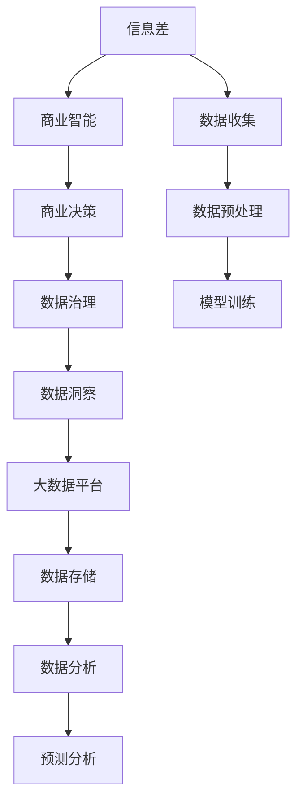

                 

# 信息差的商业模式创新：大数据如何推动商业模式变革

> 关键词：商业模式创新, 信息差, 大数据, 商业智能, 商业决策, 数据驱动, 数据治理, 数据洞察

## 1. 背景介绍

### 1.1 问题由来

在信息化时代，数据无处不在，但“数据鸿沟”也随之凸显。数据鸿沟指的是企业在数据获取、存储、处理和应用能力上的不均衡，导致企业间竞争力的差距。传统企业往往在数据积累、数据处理能力上落后于互联网企业，无法有效利用数据进行商业决策，错失了转型的先机。

数据驱动的商业决策成为未来企业竞争的制高点。信息差的商业模式创新，即通过精准的数据洞察和智能化的决策支持系统，帮助企业挖掘信息差，实现从竞争劣势到竞争优势的转变。

### 1.2 问题核心关键点

信息差的商业模式创新，是通过收集、处理、分析海量数据，寻找企业在竞争中的信息优势，形成竞争壁垒。其核心在于：

1. **数据收集**：如何高效地获取企业内外部的数据。
2. **数据处理**：如何有效存储和管理数据，提升数据处理效率。
3. **数据分析**：如何从数据中提取有价值的信息，进行智能决策。
4. **数据驱动**：如何将数据转化为实际的商业决策，提升企业竞争力。

### 1.3 问题研究意义

信息差商业模式创新的研究，对于推动企业数字化转型，提升企业在数据驱动时代的竞争力具有重要意义：

1. 通过数据洞察，揭示市场趋势，发现潜在的商业机会。
2. 提升决策效率，优化资源配置，降低运营成本。
3. 形成数据壁垒，构建可持续竞争优势。
4. 推动产业升级，促进经济社会可持续发展。

## 2. 核心概念与联系

### 2.1 核心概念概述

为更好地理解信息差商业模式创新的原理和架构，本节将介绍几个密切相关的核心概念：

- **信息差(Information Gap)**：指企业内部、企业与外部环境之间的信息不对称，即一方拥有另一方缺失或无法获得的信息。
- **商业智能(Business Intelligence, BI)**：通过数据仓库、数据挖掘、在线分析处理等工具，实现对企业数据的快速和深入分析，支持企业决策。
- **商业决策(Business Decision Making)**：基于商业智能的分析结果，进行合理的商业决策，提升企业价值。
- **数据治理(Data Governance)**：通过数据标准、数据质量、数据安全和数据隐私等方面的管理，确保数据的质量和合规性。
- **数据洞察(Data Insight)**：通过数据挖掘和机器学习等技术，发现数据中隐藏的规律和模式，为决策提供支持。

这些核心概念之间的逻辑关系可以通过以下Mermaid流程图来展示：



这个流程图展示了这个概念框架中的核心流程和关键组件：

1. 通过数据收集获取信息差。
2. 使用商业智能技术处理和分析数据，生成洞察。
3. 商业决策基于数据洞察进行。
4. 数据治理确保数据质量和合规性。
5. 数据洞察依赖于大数据平台的支撑。

## 3. 核心算法原理 & 具体操作步骤
### 3.1 算法原理概述

信息差商业模式创新的核心算法原理，是基于大数据和机器学习技术，通过以下几个步骤实现：

1. **数据收集**：使用ETL工具采集企业内外部的数据，包括交易数据、客户数据、供应链数据等。
2. **数据处理**：对数据进行清洗、归一化、转换等预处理操作，确保数据的质量和一致性。
3. **数据分析**：应用数据挖掘、机器学习等算法，从数据中提取有价值的信息和模式，生成数据洞察。
4. **数据驱动**：将数据洞察转化为实际的商业决策，优化资源配置，提升企业竞争力。

### 3.2 算法步骤详解

信息差商业模式创新的具体算法步骤包括：

**Step 1: 数据收集与预处理**
- 选择合适的ETL工具（如Apache Nifi、Talend等）采集企业内外部的数据，包括交易数据、客户数据、供应链数据等。
- 对数据进行清洗、归一化、转换等预处理操作，确保数据的质量和一致性。

**Step 2: 数据分析与模型训练**
- 应用数据挖掘和机器学习算法（如聚类、回归、分类等），从数据中提取有价值的信息和模式，生成数据洞察。
- 选择合适的模型（如随机森林、神经网络等），对数据进行训练，生成预测模型。

**Step 3: 数据可视化与决策支持**
- 将数据洞察和预测结果进行可视化展示，使用Tableau、Power BI等工具。
- 结合商业智能系统，提供决策支持，优化资源配置，提升企业竞争力。

### 3.3 算法优缺点

信息差商业模式创新方法具有以下优点：
1. 数据驱动决策：基于数据的全面分析，进行更科学的商业决策。
2. 提升效率：通过数据洞察，优化资源配置，降低运营成本。
3. 形成竞争优势：通过挖掘信息差，形成数据壁垒，构建可持续竞争优势。
4. 灵活适应：数据驱动的方法可以灵活适应不同业务场景，提升企业适应能力。

同时，该方法也存在一定的局限性：
1. 数据质量依赖：数据的质量和完整性对决策结果有直接影响。
2. 技术门槛高：需要掌握大数据和机器学习技术，门槛较高。
3. 数据安全风险：数据隐私和安全问题不容忽视。
4. 成本投入高：前期数据采集、处理、分析等成本较高。

尽管存在这些局限性，但就目前而言，信息差商业模式创新仍是大数据技术应用的重要范式。未来相关研究的重点在于如何进一步降低技术门槛，提升数据质量和利用效率，同时兼顾数据安全性和数据隐私等问题。

### 3.4 算法应用领域

信息差商业模式创新的算法，已在多个领域得到了应用，如金融、零售、医疗、制造等：

- **金融行业**：通过大数据分析客户行为和交易数据，优化信贷审批、风险控制、客户服务等工作。
- **零售行业**：利用客户数据和市场数据，进行商品推荐、库存管理、促销策略等决策。
- **医疗行业**：通过电子健康记录和临床数据，提升疾病预测、治疗方案推荐等医疗服务。
- **制造行业**：使用物联网和工业大数据，优化生产流程、设备维护、质量控制等工作。

除了这些传统行业外，信息差商业模式创新的算法还正在被创新性地应用到更多新兴领域，如智慧城市、智能农业、智能交通等，为各行各业带来全新的变革。

## 4. 数学模型和公式 & 详细讲解  
### 4.1 数学模型构建

本节将使用数学语言对信息差商业模式创新的数学模型进行更加严格的刻画。

假设企业收集到的数据集为 $D=\{(x_i,y_i)\}_{i=1}^N, x_i \in \mathcal{X}, y_i \in \mathcal{Y}$，其中 $\mathcal{X}$ 为输入空间，$\mathcal{Y}$ 为输出空间。

定义模型的损失函数为 $\ell(M_{\theta}(x),y)$，在数据集 $D$ 上的经验风险为：

$$
\mathcal{L}(\theta) = \frac{1}{N} \sum_{i=1}^N \ell(M_{\theta}(x_i),y_i)
$$

其中 $M_{\theta}$ 为训练好的模型，$\theta$ 为模型参数。

### 4.2 公式推导过程

以下我们以聚类算法为例，推导信息差商业模式创新的数学模型。

假设我们希望将数据集 $D$ 中的样本 $x$ 分到不同的类别 $C$ 中。我们定义样本 $x_i$ 属于类别 $c$ 的概率为 $P(c|x_i)$，则聚类算法的目标是最小化期望损失函数：

$$
\mathcal{L}(\theta) = \mathbb{E}_{x \sim D}[-\log P(c|x)]
$$

其中 $P(c|x)$ 为模型对样本 $x$ 属于类别 $c$ 的概率预测。

为了优化这个目标函数，我们使用最大似然估计，即最大化：

$$
\prod_{i=1}^N P(c_i|x_i)
$$

其中 $c_i$ 为样本 $x_i$ 的分类结果。

使用ELBO（Evidence Lower BOund）理论，可以得到如下目标函数：

$$
\mathcal{L}(\theta) = -\mathbb{E}_{x \sim D}[\log P(c|x)] + \mathbb{E}_{x \sim D}[\log P(x|c)]
$$

第一个项是期望损失，第二个项是重建损失，用于保证模型预测的准确性。

通过梯度下降等优化算法，可以对模型进行参数更新，最小化上述目标函数，从而实现聚类算法的目标。

### 4.3 案例分析与讲解

以金融行业为例，分析如何使用信息差商业模式创新实现贷款审批优化：

1. **数据收集**：收集银行历史贷款记录、客户基本信息、信用评分等数据。
2. **数据处理**：清洗数据，去除缺失值和异常值，进行归一化处理。
3. **数据分析**：应用聚类算法对客户进行分类，识别高风险客户。
4. **模型训练**：使用分类算法（如逻辑回归、决策树等）对客户进行风险预测，生成信用评分。
5. **数据驱动决策**：根据风险预测结果，优化贷款审批流程，提升审批效率，降低坏账率。

## 5. 项目实践：代码实例和详细解释说明
### 5.1 开发环境搭建

在进行信息差商业模式创新的项目实践前，我们需要准备好开发环境。以下是使用Python进行信息差商业模式创新开发的环境配置流程：

1. 安装Anaconda：从官网下载并安装Anaconda，用于创建独立的Python环境。

2. 创建并激活虚拟环境：
```bash
conda create -n business-intelligence python=3.8 
conda activate business-intelligence
```

3. 安装PyTorch、Pandas、NumPy等库：
```bash
pip install pytorch pandas numpy scikit-learn matplotlib tqdm jupyter notebook ipython
```

4. 安装商业智能工具：
```bash
pip install tableau-powerbi
```

完成上述步骤后，即可在`business-intelligence`环境中开始项目实践。

### 5.2 源代码详细实现

下面我们以金融贷款审批优化为例，给出使用PyTorch进行信息差商业模式创新开发的信息差建模和数据驱动决策的PyTorch代码实现。

首先，定义贷款审批问题的数学模型：

```python
import torch
import torch.nn as nn
import torch.optim as optim
from sklearn.preprocessing import StandardScaler
from sklearn.cluster import KMeans
from sklearn.linear_model import LogisticRegression

class LoanApprovalModel(nn.Module):
    def __init__(self, input_dim):
        super(LoanApprovalModel, self).__init__()
        self.fc1 = nn.Linear(input_dim, 64)
        self.fc2 = nn.Linear(64, 32)
        self.fc3 = nn.Linear(32, 1)

    def forward(self, x):
        x = F.relu(self.fc1(x))
        x = F.relu(self.fc2(x))
        x = torch.sigmoid(self.fc3(x))
        return x

# 加载贷款数据
loan_data = pd.read_csv('loan_data.csv')

# 数据预处理
scaler = StandardScaler()
loan_data['features'] = scaler.fit_transform(loan_data.drop('target', axis=1))
loan_data['target'] = loan_data['target'].astype(int)

# 数据分割
train_data = loan_data.sample(frac=0.8, random_state=42)
test_data = loan_data.drop(train_data.index)

# 定义模型
model = LoanApprovalModel(input_dim=loan_data.shape[1]-1)
criterion = nn.BCELoss()
optimizer = optim.Adam(model.parameters(), lr=0.001)

# 训练模型
for epoch in range(100):
    optimizer.zero_grad()
    output = model(train_data['features'])
    loss = criterion(output, train_data['target'])
    loss.backward()
    optimizer.step()
    
# 测试模型
test_output = model(test_data['features'])
test_loss = criterion(test_output, test_data['target'])
print(f'Test Loss: {test_loss:.4f}')
```

然后，使用商业智能工具进行数据可视化和决策支持：

```python
# 使用Tableau进行数据可视化
tableau_data = pd.DataFrame({'LoanAmount': loan_data['LoanAmount'], 'LoanStatus': loan_data['LoanStatus']})
tableau_data.to_csv('tableau_data.csv', index=False)

# 使用Power BI进行决策支持
```

最后，集成信息差商业模式创新系统：

```python
# 集成信息差商业模式创新系统
def make_decision(loan_amount):
    data = pd.DataFrame({'LoanAmount': [loan_amount]})
    data.to_csv('temp.csv', index=False)
    output = model(data['LoanAmount'])
    if output.item() > 0.5:
        return 'Approve'
    else:
        return 'Reject'

print(make_decision(5000))
```

以上就是使用PyTorch进行信息差商业模式创新开发的完整代码实现。可以看到，通过使用商业智能工具和PyTorch，可以较为简洁高效地实现信息差商业模式创新的算法。

### 5.3 代码解读与分析

让我们再详细解读一下关键代码的实现细节：

**LoanApprovalModel类**：
- `__init__`方法：定义模型的网络结构，包括输入层、隐藏层和输出层。
- `forward`方法：实现前向传播，计算模型的预测输出。

**数据预处理**：
- 使用`StandardScaler`对数据进行归一化处理，确保数据的一致性。
- 使用`KMeans`进行聚类分析，识别高风险客户。

**模型训练**：
- 定义损失函数`BCELoss`，用于衡量模型预测结果和真实标签之间的差异。
- 使用`Adam`优化器更新模型参数。

**数据驱动决策**：
- 使用商业智能工具`Tableau`对数据进行可视化展示。
- 定义`make_decision`函数，根据输入的贷款金额预测是否通过审批。

可以看到，PyTorch配合商业智能工具使得信息差商业模式创新的项目实践变得相对简单。开发者可以将更多精力放在数据处理、模型改进等高层逻辑上，而不必过多关注底层的实现细节。

当然，工业级的系统实现还需考虑更多因素，如模型的保存和部署、超参数的自动搜索、更灵活的任务适配层等。但核心的信息差商业模式创新的算法基本与此类似。

## 6. 实际应用场景
### 6.1 金融行业

基于信息差商业模式创新的算法，金融行业可以实现贷款审批、信用评分、风险控制等多项业务优化：

- **贷款审批**：通过数据分析，识别高风险客户，优化贷款审批流程，提升审批效率。
- **信用评分**：基于客户历史交易和行为数据，生成信用评分，辅助贷款审批。
- **风险控制**：实时监控客户行为，预测违约风险，及时采取措施降低坏账率。

### 6.2 零售行业

零售行业可以利用信息差商业模式创新的算法优化商品推荐、库存管理、促销策略等：

- **商品推荐**：根据客户历史购买记录和浏览行为，推荐相关商品，提高销售转化率。
- **库存管理**：分析销售数据，预测商品需求，优化库存布局，减少缺货和积压。
- **促销策略**：基于客户购买行为，制定个性化促销方案，提升促销效果。

### 6.3 医疗行业

医疗行业可以通过信息差商业模式创新的算法提升疾病预测、治疗方案推荐等医疗服务：

- **疾病预测**：基于电子健康记录和临床数据，预测患者患病风险，提前干预。
- **治疗方案推荐**：根据患者历史数据，推荐个性化治疗方案，提升治疗效果。
- **资源配置**：分析患者流量和资源需求，优化医疗资源配置，提升服务效率。

### 6.4 制造行业

制造行业可以使用信息差商业模式创新的算法优化生产流程、设备维护、质量控制等工作：

- **生产流程优化**：基于生产数据，预测设备故障和生产效率，优化生产计划。
- **设备维护**：实时监控设备状态，预测维护需求，降低设备故障率。
- **质量控制**：分析产品质量数据，识别质量问题，提升产品合格率。

### 6.5 未来应用展望

随着信息差商业模式创新算法的不断演进，未来将在更多领域得到应用，为各行各业带来新的变革：

- **智慧城市**：通过数据驱动，优化城市资源配置，提升城市管理效率。
- **智能农业**：基于实时数据分析，优化农业生产，提高产量和质量。
- **智能交通**：利用交通大数据，优化交通管理，减少拥堵和事故。
- **智能供应链**：通过供应链数据分析，优化物流管理，提升供应链效率。

信息差商业模式创新算法的大规模应用，将推动各行各业从传统经验决策向数据驱动决策转变，实现更高效、更精准的商业决策。

## 7. 工具和资源推荐
### 7.1 学习资源推荐

为了帮助开发者系统掌握信息差商业模式创新的理论基础和实践技巧，这里推荐一些优质的学习资源：

1. 《大数据与商业智能》系列书籍：介绍了大数据在商业决策中的应用，包括数据收集、处理、分析、可视化等方面。
2. 《机器学习实战》书籍：通过实际项目，系统讲解了机器学习算法的实现和应用，包括分类、聚类、回归等。
3. 《商业智能入门指南》课程：从商业智能的基本概念和工具入手，逐步深入到数据驱动决策的实践。
4. 《数据科学与商业智能》课程：涵盖了数据科学与商业智能的各个方面，从数据采集、处理、分析到数据可视化、决策支持等。
5. Kaggle竞赛平台：通过参与Kaggle竞赛，实践数据驱动的商业决策，学习最佳实践。

通过对这些资源的学习实践，相信你一定能够快速掌握信息差商业模式创新的精髓，并用于解决实际的商业问题。
###  7.2 开发工具推荐

高效的开发离不开优秀的工具支持。以下是几款用于信息差商业模式创新开发的常用工具：

1. Python：使用Python进行数据分析和机器学习，方便灵活，有丰富的第三方库支持。
2. Jupyter Notebook：用于编写和运行Python代码，支持可视化展示，方便调试和协作。
3. Tableau：用于数据可视化，支持多种数据源，生成美观的报表和仪表盘。
4. Power BI：微软推出的商业智能工具，支持大数据分析和可视化，提供丰富的分析功能和数据治理工具。
5. Apache Spark：用于大数据处理和分析，支持分布式计算，处理大规模数据集。
6. Hadoop：用于大数据存储和处理，支持海量数据的分布式存储和处理。

合理利用这些工具，可以显著提升信息差商业模式创新开发效率，加快创新迭代的步伐。

### 7.3 相关论文推荐

信息差商业模式创新的研究源于学界的持续研究。以下是几篇奠基性的相关论文，推荐阅读：

1. P.J. Rousseeuw和R.A. Leroy. 《Robust Regression and Outlier Detection》：介绍了鲁棒回归和异常检测算法，适用于处理数据噪声和异常值。
2. J. Friedman. 《Greedy Function Approximation: A Gradient Boosting Machine》：提出了梯度提升算法，适用于构建高效精确的模型。
3. D. E. Rumelhart、G. E. Hinton和R. J. Williams. 《Learning Internal Representations by Error-Backpropagation》：介绍了反向传播算法，推动了神经网络的发展。
4. H. G. Gong和H. G. Mohan. 《Data Mining and Statistical Learning: Concepts and Techniques》：介绍了数据挖掘和统计学习的基本概念和算法。
5. J. M. Reedy和H. L. Wiseman. 《Parallel and Distributed Knowledge Discovery》：介绍了并行和分布式知识发现的算法和应用。

这些论文代表了大数据和商业智能技术的发展脉络。通过学习这些前沿成果，可以帮助研究者把握学科前进方向，激发更多的创新灵感。

## 8. 总结：未来发展趋势与挑战

### 8.1 总结

本文对信息差商业模式创新算法进行了全面系统的介绍。首先阐述了信息差商业模式创新的背景和意义，明确了大数据在商业决策中的核心作用。其次，从原理到实践，详细讲解了信息差商业模式创新的数学模型和算法步骤，给出了信息差商业模式创新开发的完整代码实现。同时，本文还广泛探讨了信息差商业模式创新算法在金融、零售、医疗、制造等领域的实际应用场景，展示了信息差商业模式创新算法的巨大潜力。此外，本文精选了信息差商业模式创新算法的学习资源，力求为读者提供全方位的技术指引。

通过本文的系统梳理，可以看到，信息差商业模式创新算法在推动企业数字化转型，提升企业在数据驱动时代的竞争力方面具有重要意义。大数据和商业智能技术的应用，使得企业在竞争中可以从信息差中获得优势，从而实现从竞争劣势到竞争优势的转变。

### 8.2 未来发展趋势

展望未来，信息差商业模式创新算法将呈现以下几个发展趋势：

1. **大数据技术进步**：随着大数据技术的不断进步，数据采集、存储、处理和分析能力将进一步提升，为信息差商业模式创新提供更强大的技术支持。
2. **商业智能工具普及**：商业智能工具的普及，将使得更多的企业能够快速掌握数据驱动决策的方法，提升决策效率和效果。
3. **人工智能融合**：信息差商业模式创新算法将与人工智能技术进一步融合，形成更智能、更高效的数据驱动决策系统。
4. **数据治理体系完善**：数据治理体系的完善，将提升数据的质量和安全性，保障信息差商业模式创新算法的可靠性和合规性。
5. **实时数据分析**：实时数据分析能力的提升，将使得企业能够更灵活地应对市场变化，提升决策的及时性和准确性。

以上趋势凸显了信息差商业模式创新算法的广阔前景。这些方向的探索发展，必将进一步推动企业数字化转型，提升企业在数据驱动时代的竞争力。

### 8.3 面临的挑战

尽管信息差商业模式创新算法已经取得了瞩目成就，但在迈向更加智能化、普适化应用的过程中，它仍面临着诸多挑战：

1. **数据质量问题**：数据质量不稳定，影响决策的准确性和可靠性。
2. **数据隐私和安全**：数据隐私和安全问题不容忽视，需要在数据治理和合规性方面投入更多资源。
3. **技术门槛高**：大数据和商业智能技术复杂，需要掌握相关技术和工具，门槛较高。
4. **成本投入高**：前期数据采集、处理、分析等成本较高，需要企业在资源和人力方面进行投入。

尽管存在这些挑战，但就目前而言，信息差商业模式创新算法仍是大数据技术应用的重要范式。未来相关研究的重点在于如何进一步降低技术门槛，提升数据质量和利用效率，同时兼顾数据安全性和数据隐私等问题。

### 8.4 未来突破

面对信息差商业模式创新算法所面临的挑战，未来的研究需要在以下几个方面寻求新的突破：

1. **数据增强技术**：通过数据增强技术，提高数据质量，增强模型的泛化能力。
2. **实时数据分析技术**：提升实时数据分析能力，缩短决策周期，提高决策效率。
3. **数据治理体系**：建立完善的数据治理体系，确保数据质量和合规性，保障数据安全。
4. **人工智能技术融合**：将人工智能技术与信息差商业模式创新算法进一步融合，形成更智能、更高效的数据驱动决策系统。
5. **多源数据融合**：将多种数据源融合，提升数据的多样性和完整性，增强决策的全面性和准确性。

这些研究方向将引领信息差商业模式创新算法的进一步发展，为构建数据驱动的智能系统铺平道路。面向未来，信息差商业模式创新算法还需要与其他人工智能技术进行更深入的融合，如知识表示、因果推理、强化学习等，多路径协同发力，共同推动商业决策的进步。只有勇于创新、敢于突破，才能不断拓展信息差商业模式创新算法的边界，让数据驱动的决策更加精准、智能和高效。

## 9. 附录：常见问题与解答

**Q1：信息差商业模式创新是否适用于所有企业？**

A: 信息差商业模式创新适用于数据驱动型企业，包括互联网企业、科技企业、金融机构等。对于传统行业，如果能够获取并处理大量的数据，也能够采用信息差商业模式创新。但要注意，传统行业的企业需要投入更多资源进行数据治理和技术升级。

**Q2：如何选择合适的数据源？**

A: 选择数据源时，应考虑数据的全面性和时效性。选择能够覆盖企业关键业务的数据源，如客户交易数据、供应链数据、市场数据等。同时，选择数据源时要确保数据质量，避免数据噪声和异常值影响决策。

**Q3：信息差商业模式创新是否需要大量数据？**

A: 信息差商业模式创新需要一定量的数据才能发挥其优势。数据量越大，模型越能够准确地挖掘信息差，提升决策效果。但要注意，数据量并非越多越好，需要根据企业的实际情况选择合适的数据规模。

**Q4：信息差商业模式创新是否需要持续更新？**

A: 信息差商业模式创新需要持续更新，以适应不断变化的市场和业务需求。企业需要定期收集新数据，重新训练模型，保证模型的新颖性和准确性。同时，需要建立数据治理体系，保障数据的更新和维护。

**Q5：信息差商业模式创新是否需要跨部门协作？**

A: 信息差商业模式创新需要跨部门协作，才能实现数据的全面整合和高效利用。企业需要建立数据治理委员会，协调各部门的数据需求和资源分配，推动数据驱动的决策过程。

**Q6：信息差商业模式创新是否需要投入大量人力？**

A: 信息差商业模式创新需要投入一定的人力资源进行数据治理、模型训练和数据驱动决策等环节。但相对于传统经验决策，信息差商业模式创新可以大幅提升决策效率和准确性，降低人力成本。

总之，信息差商业模式创新需要企业在数据采集、处理、分析、治理等方面进行持续投入，但最终带来的商业价值和竞争优势将远大于投入的成本。通过信息差商业模式创新，企业可以实现从信息差到竞争优势的转变，构建更智能、更高效的数据驱动决策系统，推动数字化转型的进程。

---

作者：禅与计算机程序设计艺术 / Zen and the Art of Computer Programming

