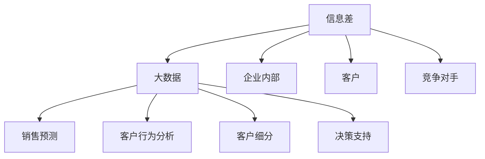

                 

# 信息差的商业销售管理：大数据如何提升销售管理

> 关键词：信息差,商业销售管理,大数据,销售优化,销售预测

## 1. 背景介绍

在信息爆炸的时代，信息差（Information Gap）对于企业来说既是挑战也是机遇。信息差指的是企业内部、企业与客户之间，以及客户自身对产品、市场、竞争对手等信息的了解程度存在差异。这种信息不对称常常导致资源错配、决策失误、客户流失等问题，严重影响企业的市场竞争力。本文将深入探讨如何通过大数据技术，精准识别和弥合信息差，提升商业销售管理的效率和效果。

## 2. 核心概念与联系

### 2.1 核心概念概述

- **信息差（Information Gap）**：企业内部、企业与客户之间，以及客户自身对产品、市场、竞争对手等信息的了解程度存在差异。
- **商业销售管理（Business Sales Management）**：指通过计划、执行、监控、评估等手段，实现销售目标的过程。
- **大数据（Big Data）**：指的是数据量大、种类多、来源广泛的数据集合，可用于挖掘信息，发现商业机会，优化决策过程。

### 2.2 核心概念原理和架构的 Mermaid 流程图



信息差、大数据与商业销售管理之间的联系通过上述流程图展现。企业内部、客户与竞争对手的信息差被大数据技术精准识别，进而通过销售预测、客户行为分析、客户细分、决策支持等手段，优化销售管理流程，提升销售效率和效果。

## 3. 核心算法原理 & 具体操作步骤

### 3.1 算法原理概述

信息差在大数据驱动的商业销售管理中，主要体现在以下几个方面：

1. **客户画像构建**：通过对客户购买行为、偏好、历史记录等数据进行分析，构建完整的客户画像。
2. **市场需求预测**：利用历史销售数据和市场趋势，预测未来市场需求。
3. **竞品分析**：通过分析竞争对手的营销策略、产品特性、市场份额等数据，制定差异化竞争策略。
4. **销售资源优化**：结合市场销售数据和客户画像，优化销售团队的资源分配，提升销售效率。

### 3.2 算法步骤详解

#### 步骤 1：数据收集与整合

1. **客户数据**：收集客户的基本信息、购买历史、行为数据、社交媒体信息等。
2. **市场数据**：收集市场趋势、竞争对手信息、政策法规等。
3. **内部数据**：收集企业内部的销售数据、库存数据、财务数据等。

#### 步骤 2：数据清洗与预处理

1. **数据清洗**：去除重复、缺失、异常数据，保证数据质量。
2. **特征工程**：通过数据转换、归一化、编码等方式，提取有效特征。
3. **数据融合**：将客户数据、市场数据、内部数据等进行融合，构建统一的数据视图。

#### 步骤 3：数据挖掘与分析

1. **客户画像构建**：利用聚类算法、关联规则挖掘等方法，构建客户画像，识别不同客户群体的特征。
2. **市场需求预测**：采用时间序列分析、机器学习等方法，预测未来市场需求。
3. **竞品分析**：通过文本分析、图像识别等技术，分析竞争对手的营销策略、产品特性等。

#### 步骤 4：销售优化与决策支持

1. **销售预测**：通过预测模型输出销售预测结果，指导销售决策。
2. **客户细分**：根据客户画像和需求预测结果，进行客户细分，制定差异化营销策略。
3. **资源优化**：通过优化销售资源分配，提高销售效率和效果。
4. **决策支持**：结合预测结果、市场分析、客户需求等数据，提供决策支持，辅助销售团队做出更科学的决策。

### 3.3 算法优缺点

#### 优点

1. **全面精准**：大数据可以整合多源数据，提供全面精准的销售洞察。
2. **实时动态**：大数据技术可以快速处理实时数据，及时反映市场动态。
3. **预测准确**：通过先进的数据分析模型，预测结果具有较高的准确性。
4. **客户导向**：基于客户画像和需求预测，制定客户导向的营销策略。

#### 缺点

1. **数据隐私**：大数据涉及客户隐私，需要严格的数据保护措施。
2. **数据质量**：数据质量和完整性对分析结果有重要影响，需要严格的数据清洗和预处理。
3. **计算复杂**：大数据分析涉及复杂的计算过程，对计算资源要求较高。
4. **技术门槛**：需要专业技术人员进行数据分析和模型开发。

### 3.4 算法应用领域

大数据技术在商业销售管理中的应用非常广泛，涵盖以下几个主要领域：

- **零售行业**：通过大数据分析客户行为和需求，优化库存管理，提高销售额。
- **制造业**：通过大数据预测市场需求和客户需求，优化生产计划，提升生产效率。
- **金融行业**：通过大数据分析市场趋势和客户风险，制定合理的贷款和投资策略。
- **房地产行业**：通过大数据分析客户需求和市场趋势，制定精准的营销策略，提高销售效果。
- **医疗行业**：通过大数据分析患者需求和市场趋势，优化医疗资源配置，提升服务质量。

## 4. 数学模型和公式 & 详细讲解

### 4.1 数学模型构建

假设企业有$N$个客户，每个客户有$m$个特征，企业的历史销售数据有$t$个时间点，竞争对手的市场份额为$s_{comp}$。

客户画像构建可以采用$K$-means聚类算法，其数学模型为：

$$
\min_{K, \mu_k, \sigma_k} \sum_{i=1}^N \sum_{k=1}^K \delta(x_i, \mu_k, \sigma_k)
$$

其中，$\delta$为聚类损失函数，$K$为聚类数目，$\mu_k$为聚类中心，$\sigma_k$为聚类方差。

市场需求预测可以采用ARIMA模型，其数学模型为：

$$
Y_t = \sum_{i=1}^p a_i Y_{t-i} + \sum_{i=1}^d b_i \Delta^i Y_t + \sum_{i=1}^q c_i \epsilon_{t-i} + \epsilon_t
$$

其中，$Y_t$为销售数据，$a_i$、$b_i$、$c_i$为模型参数，$\Delta^i$为差分算子，$\epsilon_t$为随机误差。

竞品分析可以采用文本分析和图像识别技术，对竞争对手的市场营销策略进行识别和分析。例如，通过文本分析识别竞争对手的市场策略，通过图像识别分析竞争对手的产品特性等。

### 4.2 公式推导过程

#### 客户画像构建

- **K-means聚类算法**：将$N$个客户分为$K$个簇，每个簇中心为$\mu_k$，簇方差为$\sigma_k$。最小化簇内平方和损失函数：

$$
J = \sum_{i=1}^N \min_{k=1,...,K} ||x_i - \mu_k||^2
$$

推导过程：

1. 初始化$K$个簇中心$\mu_k$。
2. 对每个客户$x_i$，计算其与每个簇中心的距离$d_k$。
3. 将$x_i$分配到距离最近的簇$k$。
4. 更新簇中心$\mu_k$和簇方差$\sigma_k$。
5. 重复步骤2-4，直至收敛。

#### 市场需求预测

- **ARIMA模型**：通过差分和移动平均线性回归，预测销售数据$Y_t$。模型的自回归、差分和移动平均参数分别为$a_i$、$b_i$、$c_i$。

推导过程：

1. 将原始销售数据进行差分，得到平稳序列。
2. 构建ARIMA模型，使用最小二乘法估计参数。
3. 预测未来的销售数据。

#### 竞品分析

- **文本分析**：通过文本挖掘算法，从竞争对手的营销材料中提取关键信息，如策略、市场定位等。

推导过程：

1. 将营销材料转换为向量表示。
2. 利用TF-IDF算法计算文本特征向量。
3. 使用分类算法，如SVM、LSTM等，识别和分析营销策略。

### 4.3 案例分析与讲解

#### 案例一：零售行业客户细分

某零售企业有1000个客户，每个客户有10个特征，包括年龄、性别、购买频率等。通过聚类算法，将客户分为5个簇，每个簇包含200个客户。分析不同簇的客户特征和需求，制定针对性的营销策略。

推导过程：

1. 收集客户数据，每个客户有10个特征。
2. 使用K-means聚类算法，将客户分为5个簇。
3. 分析每个簇的客户特征和需求，制定营销策略。

#### 案例二：制造业市场预测

某制造企业有3年销售数据，每年有12个月，共有36个月数据。利用ARIMA模型预测未来3个月的市场需求。

推导过程：

1. 收集历史销售数据，每个月份有需求数据。
2. 将销售数据进行差分，得到平稳序列。
3. 构建ARIMA模型，预测未来3个月的需求数据。

## 5. 项目实践：代码实例和详细解释说明

### 5.1 开发环境搭建

1. **Python环境**：安装Python 3.x版本，建议3.6以上版本。
2. **数据库**：安装MySQL或MongoDB数据库，用于存储和查询数据。
3. **数据处理库**：安装Pandas、NumPy等数据处理库。
4. **机器学习库**：安装Scikit-learn、TensorFlow等机器学习库。
5. **可视化库**：安装Matplotlib、Seaborn等可视化库。

### 5.2 源代码详细实现

#### 案例一：客户画像构建

```python
import pandas as pd
from sklearn.cluster import KMeans

# 加载客户数据
data = pd.read_csv('customer_data.csv')

# 数据预处理
data = data.dropna().drop_duplicates()

# 构建聚类模型
kmeans = KMeans(n_clusters=5, random_state=0)
kmeans.fit(data)

# 输出聚类结果
for i, label in enumerate(kmeans.labels_):
    print(f"客户{i+1} 的簇号为{label}")
```

#### 案例二：市场需求预测

```python
import pandas as pd
from statsmodels.tsa.arima_model import ARIMA

# 加载销售数据
sales_data = pd.read_csv('sales_data.csv')

# 数据预处理
sales_data = sales_data.dropna().reset_index(drop=True)

# 构建ARIMA模型
model = ARIMA(sales_data, order=(1,1,1))
model_fit = model.fit()

# 预测未来3个月的需求
forecast = model_fit.forecast(steps=3)
print(f"未来3个月的需求预测为：{forecast}")
```

### 5.3 代码解读与分析

#### 客户画像构建

- **数据加载与预处理**：使用Pandas库加载客户数据，并进行去重、去空操作，保证数据质量。
- **K-means聚类**：使用Scikit-learn库的KMeans算法，将客户分为5个簇。
- **输出聚类结果**：遍历每个客户，输出其所属的簇号。

#### 市场需求预测

- **数据加载与预处理**：使用Pandas库加载销售数据，并进行去重、去空操作，保证数据质量。
- **ARIMA模型**：使用statsmodels库的ARIMA模型，预测未来3个月的需求数据。
- **输出预测结果**：输出预测的销售需求数据。

## 6. 实际应用场景

### 6.1 智能推荐系统

在智能推荐系统中，大数据技术可以精准识别客户画像和需求，结合市场趋势，为客户提供个性化的商品推荐。例如，通过分析客户的购买历史和行为数据，构建客户画像，利用聚类算法将客户分为不同群体，针对不同群体进行个性化推荐。

### 6.2 市场细分与定位

在市场细分与定位中，大数据技术可以识别出具有相似需求和特征的客户群体，帮助企业进行市场细分和精准定位。例如，通过分析客户的购买行为和偏好，使用聚类算法将客户分为不同群体，制定针对不同群体的营销策略，提高市场推广效果。

### 6.3 风险管理与决策支持

在风险管理与决策支持中，大数据技术可以分析市场趋势和客户需求，制定合理的营销策略和决策方案。例如，通过分析历史销售数据和市场趋势，使用ARIMA模型预测未来市场需求，制定相应的营销策略和资源分配方案。

## 7. 工具和资源推荐

### 7.1 学习资源推荐

- **《Python数据科学手册》**：详细介绍Python在数据科学中的应用，包括Pandas、NumPy、Scikit-learn等库的使用。
- **《机器学习实战》**：通过实际案例，讲解机器学习算法和模型，适合入门学习。
- **《数据科学与大数据实战》**：详细介绍大数据技术的应用，包括数据采集、处理、分析等。

### 7.2 开发工具推荐

- **Jupyter Notebook**：交互式数据处理和机器学习平台，支持Python、R等多种编程语言。
- **PyCharm**：Python开发环境，提供丰富的代码编辑、调试和测试工具。
- **Anaconda**：数据科学和机器学习环境管理工具，支持Python、R、Scala等多种语言。

### 7.3 相关论文推荐

- **《大数据驱动的商业智能系统》**：介绍了大数据技术在商业智能中的应用，涵盖数据收集、处理、分析等环节。
- **《基于大数据的销售预测模型研究》**：通过实际案例，讲解了基于大数据的销售预测模型。
- **《客户画像构建与分析》**：详细介绍了客户画像的构建方法和应用场景。

## 8. 总结：未来发展趋势与挑战

### 8.1 研究成果总结

本文深入探讨了大数据技术在商业销售管理中的应用，通过客户画像构建、市场需求预测、竞品分析等手段，精准识别和弥合信息差，提升销售管理的效率和效果。大数据技术在多个实际应用场景中表现出色，已逐渐成为企业销售管理的核心工具。

### 8.2 未来发展趋势

1. **数据驱动的智能决策**：大数据技术将进一步深入企业决策过程中，提供全面、精准的数据支持，辅助决策制定。
2. **实时动态的销售预测**：利用实时数据流，进行动态销售预测，及时调整市场策略。
3. **客户画像的精准构建**：通过更复杂的算法和更丰富的数据源，构建更全面、准确的客户画像。
4. **竞品分析的深度挖掘**：利用文本分析、图像识别等技术，深度挖掘竞争对手的市场策略和产品特性。
5. **多模态数据的融合**：结合文本、图像、视频等多模态数据，提供更加全面、丰富的商业洞察。

### 8.3 面临的挑战

1. **数据质量与隐私**：大数据分析依赖于高质量的数据，数据质量和隐私保护是关键挑战。
2. **计算资源**：大数据分析涉及复杂的计算过程，对计算资源要求较高。
3. **技术门槛**：需要专业技术人员进行数据分析和模型开发。
4. **模型解释性**：部分大数据模型如深度学习模型的可解释性较差，需要改进。

### 8.4 研究展望

未来，大数据技术在商业销售管理中的应用将更加广泛和深入。以下是几个值得关注的研究方向：

1. **分布式计算与存储**：利用分布式计算和存储技术，处理海量数据，提高数据处理效率。
2. **联邦学习**：通过联邦学习技术，保护数据隐私，实现分布式数据协同学习。
3. **实时流处理**：利用实时流处理技术，进行动态数据更新和实时预测。
4. **模型解释性**：通过可解释性技术，提高模型的可解释性和可解释性，增强决策信任。
5. **跨领域应用**：探索大数据技术在更多领域的应用，如医疗、教育、制造等。

综上所述，大数据技术在大商业销售管理中具有广泛的应用前景和巨大的潜力。通过不断优化和改进大数据分析方法，我们有望在多个实际应用场景中，实现精准的信息差识别与弥合，大幅提升销售管理效率和效果。

## 9. 附录：常见问题与解答

**Q1：大数据技术在商业销售管理中的应用有哪些？**

A: 大数据技术在商业销售管理中的应用非常广泛，涵盖以下几个主要领域：
1. 客户画像构建与分析
2. 市场需求预测
3. 竞品分析与市场细分
4. 销售预测与资源优化
5. 实时动态决策支持

**Q2：如何使用大数据技术进行客户画像构建？**

A: 客户画像构建是利用大数据技术，通过聚类算法、关联规则挖掘等方法，构建客户画像，识别不同客户群体的特征。具体步骤如下：
1. 收集客户数据，包括基本信息、购买历史、行为数据等。
2. 使用K-means聚类算法，将客户分为不同群体。
3. 分析每个簇的客户特征，构建客户画像。

**Q3：市场需求预测的数学模型有哪些？**

A: 市场需求预测的数学模型主要有以下几种：
1. ARIMA模型：利用自回归、差分、移动平均等方法，预测未来需求。
2. 回归分析：通过线性回归、多项式回归等方法，建立需求预测模型。
3. 时间序列分析：利用时间序列数据，建立预测模型。

**Q4：竞品分析的主要技术手段有哪些？**

A: 竞品分析的主要技术手段有以下几种：
1. 文本分析：通过文本挖掘算法，从竞争对手的营销材料中提取关键信息。
2. 图像识别：通过图像识别技术，分析竞争对手的产品特性。
3. 社交媒体分析：通过社交媒体数据分析，了解竞争对手的市场策略。
4. 客户反馈分析：通过客户反馈数据分析，了解竞争对手的优缺点。

综上所述，大数据技术在商业销售管理中的应用具有广泛的应用前景和巨大的潜力。通过不断优化和改进大数据分析方法，我们有望在多个实际应用场景中，实现精准的信息差识别与弥合，大幅提升销售管理效率和效果。

