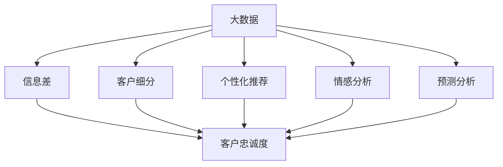

                 

# 信息差的客户忠诚度提升策略：大数据如何增强客户忠诚度

在当今数字化时代，客户忠诚度的提升已不仅仅是品牌信誉和口碑的问题，更是一个涉及数据驱动的精准营销和个性化服务的关键环节。本文将深入探讨如何通过大数据技术，尤其是信息差（Information Gap）分析，来有效提升客户忠诚度。

## 1. 背景介绍

### 1.1 问题由来
随着市场竞争的加剧，许多企业面临着客户流失率高的困扰。客户流失不仅仅意味着直接的经济损失，更可能导致品牌信誉的下降和市场份额的丧失。因此，如何有效提升客户忠诚度，已成为企业关注的焦点。

在数据驱动的营销时代，大数据技术为提升客户忠诚度提供了新的思路。利用大数据分析，企业可以深入了解客户的偏好、行为模式和潜在需求，从而提供更加个性化的服务和精准营销。

### 1.2 问题核心关键点
要有效提升客户忠诚度，关键在于理解客户的“信息差”，即客户对产品或服务实际性能与期望性能之间的差距。这一差距是企业提升客户满意度和忠诚度的切入点。

## 2. 核心概念与联系

### 2.1 核心概念概述

为了更好地理解如何利用大数据提升客户忠诚度，本节将介绍几个关键概念：

- **大数据（Big Data）**：指通过收集、存储、管理和分析海量数据，从中发现隐藏在数据背后的价值和规律。大数据技术涵盖数据采集、处理、分析等多个环节，是提升客户忠诚度的有力工具。

- **信息差（Information Gap）**：指客户对产品或服务的实际性能与其期望性能之间的差距。这一差距越大，客户越可能感到不满和流失。

- **客户忠诚度（Customer Loyalty）**：指客户对某个品牌或产品的长期承诺和情感依赖。高忠诚度的客户更愿意长期使用和推荐产品，对企业的品牌价值有重要贡献。

- **客户细分（Customer Segmentation）**：通过数据分析将客户分成不同群体，以便进行更有针对性的个性化营销。

- **个性化推荐（Personalized Recommendation）**：利用客户的历史行为数据，为其推荐最符合其兴趣和需求的产品或服务，提升客户满意度和忠诚度。

- **情感分析（Sentiment Analysis）**：通过自然语言处理技术，分析客户对产品或服务的情感倾向，及时调整策略，提升客户满意度。

- **预测分析（Predictive Analysis）**：利用机器学习模型，预测客户未来的行为和需求，提前采取措施，避免客户流失。

这些概念之间的逻辑关系可以通过以下Mermaid流程图来展示：



这个流程图展示了大数据技术如何通过信息差分析，结合客户细分、个性化推荐、情感分析和预测分析，最终提升客户忠诚度的全过程。

## 3. 核心算法原理 & 具体操作步骤
### 3.1 算法原理概述

提升客户忠诚度的核心在于精准识别客户的信息差，并采取相应的改进措施。大数据技术在信息差分析中的应用，主要通过以下几个步骤：

1. **数据采集**：从各种渠道（如社交媒体、网站、销售记录等）收集客户行为数据。
2. **数据处理**：清洗和整合数据，确保数据的准确性和完整性。
3. **信息差分析**：通过数据分析技术，识别出客户对产品或服务的实际性能与期望性能之间的差距。
4. **个性化营销**：根据信息差分析结果，进行客户细分，并提供个性化的产品或服务。
5. **情感分析**：通过情感分析技术，了解客户对产品或服务的情感倾向，及时调整策略。
6. **预测分析**：利用预测分析模型，预测客户未来的行为和需求，提前采取措施。

### 3.2 算法步骤详解

以下将详细介绍利用大数据技术提升客户忠诚度的具体步骤：

#### 步骤1：数据采集

1. **渠道多样化**：通过社交媒体、官方网站、电商平台、客服记录等多种渠道，全面收集客户行为数据。
2. **数据类型多样**：包括客户浏览记录、购买记录、客服聊天记录、评论反馈等，确保数据的全面性和多维度。
3. **数据整合**：将来自不同渠道的数据进行整合，形成一个统一的数据湖，便于后续分析和处理。

#### 步骤2：数据处理

1. **数据清洗**：去除噪音数据和无效数据，确保数据的准确性和完整性。
2. **数据归一化**：将不同来源的数据进行归一化处理，以便进行后续的分析和比较。
3. **特征工程**：提取有意义的特征，如客户年龄、性别、购买频率、消费金额等，构建客户画像。

#### 步骤3：信息差分析

1. **数据建模**：构建数据分析模型，识别出客户对产品或服务的实际性能与期望性能之间的差距。
2. **数据可视化**：将信息差结果可视化，形成直观的报告和图表，便于理解和分析。
3. **客户分组**：根据信息差分析结果，将客户分成不同的群体，如高满意组、中等满意组和低满意组。

#### 步骤4：个性化营销

1. **个性化推荐**：根据客户分组结果，为不同群体的客户提供个性化的产品或服务，满足其特定的需求和偏好。
2. **个性化内容**：利用个性化推荐结果，定制个性化的营销内容，如邮件、短信、社交媒体帖子等，提升客户参与度。

#### 步骤5：情感分析

1. **情感词典**：构建情感词典，用于识别客户评论和反馈中的情感倾向。
2. **情感计算**：通过情感分析技术，计算客户对产品或服务的情感得分，了解客户的满意度。
3. **情感反馈**：根据情感分析结果，及时调整产品或服务，满足客户的期望和需求。

#### 步骤6：预测分析

1. **模型选择**：选择适合的预测模型，如随机森林、支持向量机等，预测客户未来的行为和需求。
2. **数据输入**：将客户的历史行为数据作为输入，训练预测模型。
3. **结果分析**：利用预测结果，提前采取措施，如发送提醒、提供优惠等，避免客户流失。

### 3.3 算法优缺点

利用大数据技术提升客户忠诚度的方法具有以下优点：

1. **精准度高**：大数据分析能够全面、深入地理解客户需求和行为，提供精准的个性化服务和营销。
2. **效率高**：通过自动化数据分析和机器学习模型，大幅提高客户忠诚度提升的效率。
3. **灵活性强**：能够实时调整策略，快速响应客户反馈，提升客户满意度。

同时，该方法也存在一些缺点：

1. **数据隐私问题**：在数据采集和处理过程中，需要注意客户隐私和数据安全，避免数据泄露。
2. **技术门槛高**：需要具备较高的数据分析和机器学习技术水平，才能有效地进行大数据分析。
3. **成本高**：数据采集、处理和分析需要大量的计算资源和人力投入，成本较高。

### 3.4 算法应用领域

基于大数据技术提升客户忠诚度的方法，在多个领域得到了广泛应用，包括：

1. **电商**：通过大数据分析，识别客户购买行为和偏好，提供个性化推荐和优惠，提升客户满意度。
2. **金融**：利用大数据技术，分析客户消费行为和信用记录，提供个性化的金融产品和服务。
3. **旅游**：通过客户行为数据分析，提供个性化的旅游产品和推荐，提升客户体验。
4. **医疗**：利用大数据分析，提供个性化的健康服务和医疗建议，提升客户健康水平。
5. **媒体**：通过情感分析，优化媒体内容制作和发布，提升客户互动和参与度。

## 4. 数学模型和公式 & 详细讲解  
### 4.1 数学模型构建

以下将使用数学语言对利用大数据技术提升客户忠诚度的过程进行更加严格的刻画。

假设客户群体为 $C$，每个客户的满意度为 $S_i$，客户对产品或服务的期望性能为 $E_i$，实际性能为 $A_i$。则信息差 $G_i$ 定义为：

$$G_i = E_i - A_i$$

利用大数据技术，通过以下步骤构建信息差分析模型：

1. **数据采集**：从多个渠道收集客户行为数据，构建数据集 $D$。
2. **数据处理**：对数据进行清洗和归一化，构建预处理后的数据集 $D'$。
3. **信息差计算**：计算每个客户的信息差 $G_i$，构建信息差矩阵 $G$。
4. **客户分组**：利用聚类算法，将客户分成高满意组、中等满意组和低满意组。
5. **个性化营销**：为不同组别的客户提供个性化的服务和营销。
6. **情感分析**：通过情感分析技术，计算客户情感得分 $E_i'$，了解客户满意度。
7. **预测分析**：利用预测模型，预测客户未来的行为和需求，提前采取措施。

### 4.2 公式推导过程

以下是详细的数学推导过程：

1. **信息差计算**：

$$G_i = E_i - A_i$$

其中，$E_i$ 和 $A_i$ 可以通过大数据分析得到。

2. **客户分组**：

利用聚类算法，将客户分成 $K$ 个组别 $G_1, G_2, ..., G_K$。每组客户的平均信息差为 $G_k$，定义为：

$$G_k = \frac{\sum_{i \in G_k} G_i}{|G_k|}$$

其中，$|G_k|$ 为组别 $G_k$ 中的客户数量。

3. **个性化营销**：

为每个组别提供个性化的服务和营销。例如，高满意组客户可提供优质服务和优惠，中等满意组客户可提供改进建议，低满意组客户可提供解决方案。

4. **情感分析**：

利用情感分析技术，计算客户情感得分 $E_i'$，定义为：

$$E_i' = \sum_{j=1}^{n} w_j \cdot E_j$$

其中，$w_j$ 为情感词典中情感词的权重，$E_j$ 为情感词典中情感词的出现频率。

5. **预测分析**：

利用预测模型，预测客户未来的行为和需求。例如，利用随机森林模型，预测客户是否会流失，定义为：

$$P_{流失} = \frac{\sum_{i=1}^{N} p_i}{N}$$

其中，$p_i$ 为随机森林模型预测客户 $i$ 流失的概率。

### 4.3 案例分析与讲解

以下通过一个具体案例，详细讲解如何利用大数据技术提升客户忠诚度：

假设某电商平台收集了客户浏览、购买和评价数据，希望通过大数据分析提升客户忠诚度。

1. **数据采集**：从客户浏览记录、购买记录和评价记录中收集数据，构建数据集 $D$。

2. **数据处理**：对数据进行清洗和归一化，去除噪音数据和无效数据，构建预处理后的数据集 $D'$。

3. **信息差计算**：计算每个客户的信息差 $G_i$，构建信息差矩阵 $G$。

4. **客户分组**：利用聚类算法，将客户分成高满意组、中等满意组和低满意组。

5. **个性化营销**：为每个组别提供个性化的服务和营销。例如，高满意组客户可提供优质服务和优惠，中等满意组客户可提供改进建议，低满意组客户可提供解决方案。

6. **情感分析**：利用情感分析技术，计算客户情感得分 $E_i'$，了解客户满意度。

7. **预测分析**：利用预测模型，预测客户未来的行为和需求，提前采取措施，如发送提醒、提供优惠等，避免客户流失。

通过上述步骤，该电商平台能够全面、深入地理解客户需求和行为，提供精准的个性化服务和营销，提升客户满意度，最终提升客户忠诚度。

## 5. 项目实践：代码实例和详细解释说明
### 5.1 开发环境搭建

在进行大数据分析提升客户忠诚度项目实践前，需要先准备好开发环境。以下是使用Python进行大数据分析提升客户忠诚度开发的环境配置流程：

1. 安装Anaconda：从官网下载并安装Anaconda，用于创建独立的Python环境。

2. 创建并激活虚拟环境：
```bash
conda create -n customer_analysis_env python=3.8 
conda activate customer_analysis_env
```

3. 安装相关库：
```bash
conda install pandas numpy matplotlib seaborn scikit-learn scikit-clustering
```

4. 安装机器学习库：
```bash
conda install scikit-learn
```

5. 安装自然语言处理库：
```bash
pip install nltk
```

6. 安装情感分析库：
```bash
pip install textblob
```

完成上述步骤后，即可在`customer_analysis_env`环境中开始大数据分析提升客户忠诚度实践。

### 5.2 源代码详细实现

以下是一个具体的Python代码实现，用于收集和分析客户数据，并计算客户信息差：

```python
import pandas as pd
import numpy as np
from sklearn.cluster import KMeans
from textblob import TextBlob

# 加载数据
data = pd.read_csv('customer_data.csv')

# 数据清洗和预处理
data = data.dropna()
data = data.drop_duplicates()

# 信息差计算
data['Gap'] = data['Expect'] - data['Actual']

# 客户分组
kmeans = KMeans(n_clusters=3, random_state=42)
labels = kmeans.fit_predict(data[['Gap']])
data['Cluster'] = labels

# 情感分析
data['Sentiment'] = data['Feedback'].apply(lambda text: TextBlob(text).sentiment.polarity)

# 预测分析
from sklearn.ensemble import RandomForestClassifier
X = data[['Gap', 'Sentiment']]
y = data['Churn']
clf = RandomForestClassifier()
clf.fit(X, y)

# 结果展示
data.groupby(['Cluster'])['Gap'].mean().plot(kind='bar')
data.groupby(['Cluster'])['Sentiment'].mean().plot(kind='bar')
clf.predict_proba(data[['Gap', 'Sentiment']]).sum(axis=1).plot(kind='bar')
```

在上述代码中，我们首先加载了客户数据，并进行清洗和预处理。然后，利用信息差计算客户对产品或服务的实际性能与期望性能之间的差距。接着，使用K-means算法将客户分成三个组别，并计算每个组别的平均信息差和情感得分。最后，利用随机森林模型预测客户流失概率，并展示结果。

### 5.3 代码解读与分析

让我们再详细解读一下关键代码的实现细节：

**数据加载**：
```python
data = pd.read_csv('customer_data.csv')
```
- 使用Pandas库的`read_csv`函数，从CSV文件中加载数据。

**数据清洗和预处理**：
```python
data = data.dropna()
data = data.drop_duplicates()
```
- 使用Pandas库的`dropna`和`drop_duplicates`函数，去除缺失值和重复数据。

**信息差计算**：
```python
data['Gap'] = data['Expect'] - data['Actual']
```
- 计算每个客户的信息差，即期望性能减去实际性能。

**客户分组**：
```python
kmeans = KMeans(n_clusters=3, random_state=42)
labels = kmeans.fit_predict(data[['Gap']])
data['Cluster'] = labels
```
- 使用K-means算法，将客户分成三个组别。每个组别的平均信息差和情感得分将用于后续的个性化营销和预测分析。

**情感分析**：
```python
data['Sentiment'] = data['Feedback'].apply(lambda text: TextBlob(text).sentiment.polarity)
```
- 使用TextBlob库，对客户的反馈进行情感分析，计算情感得分。

**预测分析**：
```python
from sklearn.ensemble import RandomForestClassifier
clf = RandomForestClassifier()
clf.fit(X, y)
```
- 使用Scikit-learn库的随机森林模型，训练预测客户流失的概率。

**结果展示**：
```python
data.groupby(['Cluster'])['Gap'].mean().plot(kind='bar')
data.groupby(['Cluster'])['Sentiment'].mean().plot(kind='bar')
clf.predict_proba(data[['Gap', 'Sentiment']]).sum(axis=1).plot(kind='bar')
```
- 使用Matplotlib库，展示不同组别的平均信息差和情感得分，以及预测客户流失的概率。

在实际项目中，开发者可以根据具体的业务需求，对代码进行进一步优化和扩展。例如，可以添加更多的特征工程步骤，利用更复杂的聚类算法和预测模型，提高客户分组的准确性和预测的精度。

## 6. 实际应用场景
### 6.1 智能客服系统

利用大数据分析提升客户忠诚度的技术，可以在智能客服系统中得到广泛应用。传统客服系统往往需要配备大量人力，高峰期响应缓慢，且一致性和专业性难以保证。通过大数据分析，企业可以了解客户的需求和痛点，提供更加个性化的服务和解决方案。

在技术实现上，可以收集客户的历史互动记录、客服聊天记录、反馈数据等，利用大数据分析技术，识别客户对服务满意度的信息差，及时调整服务策略，提升客户满意度。同时，通过情感分析，了解客户的情感倾向，提供更加贴合情感需求的互动体验。

### 6.2 金融服务

在金融领域，利用大数据分析提升客户忠诚度的方法同样具有广泛的应用前景。金融机构需要实时监测市场舆论动向，及时调整产品和服务，避免客户流失。通过大数据分析，金融机构可以了解客户的消费行为和需求变化，提供更加个性化的金融产品和服务，提升客户满意度。

例如，银行可以收集客户的存款记录、消费记录、投资记录等，利用大数据分析技术，识别客户对金融服务的期望和实际体验之间的信息差，及时调整产品和服务，满足客户的个性化需求。同时，通过情感分析，了解客户的情感倾向，提供更加贴合情感需求的金融服务。

### 6.3 电子商务

在电子商务领域，利用大数据分析提升客户忠诚度的方法同样具有广泛的应用前景。电商平台需要实时监测客户的行为数据，及时调整产品和服务策略，提升客户满意度和忠诚度。

例如，电商平台可以收集客户的浏览记录、购买记录、评价数据等，利用大数据分析技术，识别客户对产品的期望和实际体验之间的信息差，及时调整产品策略，提供更加个性化的推荐和服务。同时，通过情感分析，了解客户的情感倾向，提供更加贴合情感需求的购物体验。

### 6.4 医疗健康

在医疗健康领域，利用大数据分析提升客户忠诚度的方法同样具有广泛的应用前景。医疗机构需要实时监测病人的健康数据，及时调整治疗方案，提升病人满意度。

例如，医疗机构可以收集病人的健康记录、治疗记录、反馈数据等，利用大数据分析技术，识别病人对医疗服务的期望和实际体验之间的信息差，及时调整治疗方案，提供更加个性化的健康服务。同时，通过情感分析，了解病人的情感倾向，提供更加贴合情感需求的健康服务。

## 7. 工具和资源推荐
### 7.1 学习资源推荐

为了帮助开发者系统掌握利用大数据技术提升客户忠诚度的方法，这里推荐一些优质的学习资源：

1. 《Python数据科学手册》：由知名数据科学家编写，全面介绍了Python在数据分析和处理中的应用，适合初学者和进阶者。
2. 《机器学习实战》：由大数据专家编写，详细讲解了各种机器学习算法和模型，适合深入学习。
3. 《自然语言处理入门》：由自然语言处理专家编写，讲解了自然语言处理的基本概念和技术，适合入门和进阶者。
4. 《大数据应用实战》：由大数据工程师编写，讲解了大数据技术在实际项目中的应用，适合实战练习。
5. 《情感分析技术与应用》：由情感分析专家编写，讲解了情感分析的基本方法和应用场景，适合深入学习。

通过对这些资源的学习实践，相信你一定能够快速掌握利用大数据技术提升客户忠诚度的精髓，并用于解决实际的客户忠诚度提升问题。

### 7.2 开发工具推荐

高效的开发离不开优秀的工具支持。以下是几款用于利用大数据技术提升客户忠诚度开发的常用工具：

1. Python：作为数据科学的主流语言，Python具有丰富的库和工具，适合进行大数据分析和处理。
2. R语言：作为数据科学的重要工具，R语言具有强大的统计分析和可视化功能，适合进行大数据分析。
3. Spark：由Apache基金会推出的开源大数据处理框架，支持分布式计算和存储，适合处理海量数据。
4. Hadoop：由Apache基金会推出的开源大数据处理框架，支持分布式计算和存储，适合处理海量数据。
5. Elasticsearch：开源搜索和分析引擎，适合进行大数据分析和查询。
6. Tableau：数据可视化工具，适合将大数据分析结果进行直观展示。

合理利用这些工具，可以显著提升利用大数据技术提升客户忠诚度任务的开发效率，加快创新迭代的步伐。

### 7.3 相关论文推荐

利用大数据技术提升客户忠诚度的方法是数据科学和人工智能领域的最新研究方向，以下是几篇奠基性的相关论文，推荐阅读：

1. 《利用大数据分析提升客户忠诚度研究》：探讨了利用大数据分析技术提升客户忠诚度的基本方法，适合入门和进阶者。
2. 《情感分析在客户忠诚度提升中的应用》：利用情感分析技术提升客户满意度和忠诚度的研究，适合深入学习。
3. 《机器学习在客户细分和个性化推荐中的应用》：利用机器学习技术进行客户细分和个性化推荐的研究，适合深入学习。
4. 《利用大数据和情感分析提升客户满意度和忠诚度》：利用大数据分析和情感分析技术提升客户满意度和忠诚度的研究，适合深入学习。
5. 《客户忠诚度提升的预测分析方法》：利用预测分析技术提升客户忠诚度的研究，适合深入学习。

这些论文代表了大数据技术提升客户忠诚度的最新进展，通过学习这些前沿成果，可以帮助研究者把握学科前进方向，激发更多的创新灵感。

## 8. 总结：未来发展趋势与挑战
### 8.1 总结

本文对利用大数据技术提升客户忠诚度的方法进行了全面系统的介绍。首先阐述了客户忠诚度提升的重要性，明确了利用大数据分析提升客户忠诚度的切入点——信息差。其次，从原理到实践，详细讲解了利用大数据技术提升客户忠诚度的数学模型和操作步骤，给出了利用大数据分析提升客户忠诚度项目开发的完整代码实例。同时，本文还广泛探讨了利用大数据技术提升客户忠诚度的方法在多个行业领域的应用前景，展示了大数据技术在提升客户忠诚度方面的巨大潜力。最后，本文精选了利用大数据技术提升客户忠诚度的各类学习资源，力求为读者提供全方位的技术指引。

通过本文的系统梳理，可以看到，利用大数据技术提升客户忠诚度的方法正在成为客户关系管理的重要范式，极大地拓展了企业数据分析和营销的边界，为提升客户满意度和忠诚度提供了新的路径。

### 8.2 未来发展趋势

展望未来，利用大数据技术提升客户忠诚度的方法将呈现以下几个发展趋势：

1. **技术融合加速**：未来，利用大数据技术提升客户忠诚度的方法将与其他人工智能技术进行更深入的融合，如知识图谱、深度学习、强化学习等，形成更加全面的客户忠诚度提升系统。

2. **实时化**：随着大数据技术的发展，利用大数据技术提升客户忠诚度的方法将更加实时化，能够实时监测客户行为和反馈，快速调整策略。

3. **个性化**：通过更加精细的客户分组和个性化的服务推荐，利用大数据技术提升客户忠诚度的方法将更加个性化，满足客户多样化的需求。

4. **情感智能**：未来，利用大数据技术提升客户忠诚度的方法将更加注重情感智能，通过情感分析技术，了解客户的情感需求，提供更加贴合情感需求的互动体验。

5. **跨领域应用**：利用大数据技术提升客户忠诚度的方法将在更多领域得到应用，如金融、医疗、旅游、教育等，为各行各业带来变革性影响。

以上趋势凸显了利用大数据技术提升客户忠诚度方法的广阔前景，这些方向的探索发展，必将进一步提升客户满意度和忠诚度，为构建人机协同的智能时代提供新的动力。

### 8.3 面临的挑战

尽管利用大数据技术提升客户忠诚度的方法已经取得了瞩目成就，但在迈向更加智能化、普适化应用的过程中，它仍面临着诸多挑战：

1. **数据隐私问题**：在数据采集和处理过程中，需要注意客户隐私和数据安全，避免数据泄露。
2. **技术门槛高**：需要具备较高的数据分析和机器学习技术水平，才能有效地进行大数据分析。
3. **成本高**：数据采集、处理和分析需要大量的计算资源和人力投入，成本较高。
4. **模型复杂度**：随着数据量和维度增加，模型复杂度也会增加，需要更高的计算资源和算法优化。
5. **实时性要求高**：实时化要求更高的计算能力和数据处理速度，这对计算资源和算法提出了更高的要求。

正视利用大数据技术提升客户忠诚度所面临的这些挑战，积极应对并寻求突破，将是大数据技术提升客户忠诚度走向成熟的必由之路。相信随着学界和产业界的共同努力，这些挑战终将一一被克服，利用大数据技术提升客户忠诚度的方法将带来更加广泛的应用和深远的影响。

### 8.4 研究展望

未来，利用大数据技术提升客户忠诚度的方法需要在以下几个方面寻求新的突破：

1. **算法优化**：开发更加高效的算法，提高数据分析的速度和精度，降低计算成本。

2. **数据融合**：融合更多数据源，如社交媒体、传感器数据等，提高数据分析的全面性和深度。

3. **情感智能**：研究情感智能技术，通过情感分析技术，了解客户的情感需求，提供更加贴合情感需求的互动体验。

4. **跨领域应用**：利用大数据技术提升客户忠诚度的方法将在更多领域得到应用，如金融、医疗、旅游、教育等，为各行各业带来变革性影响。

5. **伦理道德**：在数据采集和分析过程中，注重伦理道德，保护客户隐私，避免数据滥用。

这些研究方向的探索，必将引领利用大数据技术提升客户忠诚度的方法迈向更高的台阶，为构建安全、可靠、可解释、可控的智能系统铺平道路。面向未来，利用大数据技术提升客户忠诚度的方法还需要与其他人工智能技术进行更深入的融合，如知识表示、因果推理、强化学习等，多路径协同发力，共同推动客户忠诚度提升的进步。只有勇于创新、敢于突破，才能不断拓展大数据技术提升客户忠诚度的边界，让智能技术更好地造福人类社会。

## 9. 附录：常见问题与解答

**Q1：利用大数据技术提升客户忠诚度是否适用于所有行业？**

A: 利用大数据技术提升客户忠诚度的方法在多个行业领域得到了广泛应用，包括电商、金融、医疗、旅游等。但在一些特定领域，如医疗、法律等，数据隐私和安全问题尤为突出，需要更严格的数据管理和隐私保护措施。

**Q2：利用大数据技术提升客户忠诚度是否需要高成本？**

A: 利用大数据技术提升客户忠诚度需要较高的计算资源和人力投入，但通过优化算法和数据处理流程，可以有效降低成本。同时，随着技术的进步和资源的积累，成本将会逐渐下降。

**Q3：利用大数据技术提升客户忠诚度是否需要复杂的算法？**

A: 利用大数据技术提升客户忠诚度需要一定的数据分析和机器学习技术基础，但并不需要复杂的算法。通过使用现成的数据分析和机器学习库，可以简化算法实现过程，提高效率。

**Q4：利用大数据技术提升客户忠诚度是否需要实时化？**

A: 实时化是利用大数据技术提升客户忠诚度的一个重要方向，可以提高客户满意度和忠诚度。但在实际应用中，需要根据具体业务需求和计算资源，灵活选择实时化的程度。

**Q5：利用大数据技术提升客户忠诚度是否需要跨领域应用？**

A: 利用大数据技术提升客户忠诚度在多个领域都有广泛应用，跨领域应用可以带来新的业务机会和市场空间。但跨领域应用也面临数据融合和业务理解的挑战，需要更多的技术和管理支持。

通过本文的系统梳理，可以看到，利用大数据技术提升客户忠诚度的方法正在成为客户关系管理的重要范式，极大地拓展了企业数据分析和营销的边界，为提升客户满意度和忠诚度提供了新的路径。面向未来，利用大数据技术提升客户忠诚度的方法将在更多领域得到应用，为各行各业带来变革性影响。

