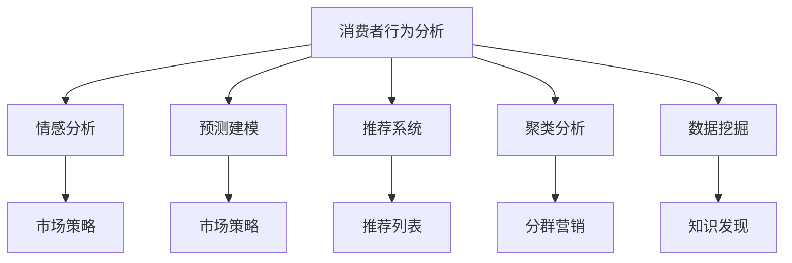

                 

## 1. 背景介绍

### 1.1 问题由来
在当今数据驱动的时代，消费者洞察力已成为企业获取竞争优势的关键。消费者洞察力不仅包括对消费者需求和行为的理解，还包括对这些信息在不同时间、场景和环境下的动态变化趋势的掌握。然而，传统的消费者研究方法如问卷调查、焦点小组讨论、用户访谈等往往耗时耗力，且无法实时捕捉消费者的动态变化，也无法深入到消费者的心理层面。

数据驱动的消费者洞察力方法通过挖掘和分析大数据，可以实时、深入、动态地捕捉消费者行为，提供更加精准和高效的消费者洞察。这种方法依赖于数据采集、数据存储、数据处理、数据分析等多个环节的有机协同，以及算法模型的辅助。

### 1.2 问题核心关键点
在大数据驱动的消费者洞察力研究中，以下关键点值得关注：

- **数据采集**：如何高效、准确地收集消费者的行为数据，包括在线行为、社交媒体活动、购买记录、移动设备数据等。
- **数据存储与管理**：如何安全、有效地存储和管理大规模消费者数据，保证数据的一致性、完整性和可用性。
- **数据处理**：如何对采集的数据进行清洗、归一化、特征提取等预处理，以便于后续的分析。
- **数据分析与建模**：如何利用统计学、机器学习等方法对消费者数据进行深入分析，并构建模型，预测消费者的行为和需求。
- **可视化与报告**：如何将分析结果可视化，以便于呈现给决策者，帮助他们更好地理解消费者洞察，做出决策。

## 2. 核心概念与联系

### 2.1 核心概念概述

为更好地理解大数据如何深入了解消费者，本节将介绍几个关键概念：

- **消费者行为分析(Consumer Behavior Analysis)**：通过分析消费者的购买、使用、评价等行为数据，理解其需求和偏好，从而制定更加精准的市场策略。
- **情感分析(Sentiment Analysis)**：利用自然语言处理技术，分析消费者对品牌、产品、服务的情感倾向，评估市场反应。
- **预测建模(Predictive Modeling)**：通过历史数据构建模型，预测消费者的未来行为和需求，提前准备市场策略。
- **推荐系统(Recommender Systems)**：根据消费者的历史行为数据，推荐其可能感兴趣的产品和服务，提升消费者满意度。
- **聚类分析(Cluster Analysis)**：将消费者按照行为特征或偏好进行分类，发现不同消费者群体的特征，制定更有针对性的营销策略。
- **数据挖掘(Data Mining)**：从消费者数据中挖掘潜在的关联和规律，发现数据中的知识，提升消费者洞察的深度和广度。

这些概念之间的逻辑关系可以通过以下Mermaid流程图来展示：



这个流程图展示了消费者行为分析与其他相关概念的联系：

1. 消费者行为分析通过分析消费者的购买、使用、评价等行为数据，是其他概念的基础。
2. 情感分析基于消费者行为数据，分析消费者的情感倾向。
3. 预测建模利用历史数据构建模型，预测消费者的未来行为。
4. 推荐系统根据消费者行为，推荐其可能感兴趣的产品。
5. 聚类分析将消费者按照特征分类，发现不同群体的特征。
6. 数据挖掘从数据中挖掘潜在的关联和规律。

所有这些概念共同构成了大数据驱动的消费者洞察力的完整框架，帮助企业深入了解消费者的需求和行为，提升市场决策的科学性和准确性。

## 3. 核心算法原理 & 具体操作步骤
### 3.1 算法原理概述

大数据驱动的消费者洞察力研究主要依赖于机器学习和数据挖掘技术，通过以下步骤实现：

1. **数据收集与清洗**：从各种数据源（如网站、社交媒体、交易记录）收集消费者数据，并进行预处理和清洗，去除噪声和错误。
2. **特征提取**：从清洗后的数据中提取有意义的特征，如用户的浏览行为、购买历史、评价内容等。
3. **模型构建**：利用机器学习算法（如决策树、随机森林、神经网络、支持向量机等）构建消费者行为模型。
4. **模型评估与优化**：通过交叉验证、A/B测试等方法评估模型的性能，并优化模型参数。
5. **洞察提取与可视化**：从模型中提取有用的消费者洞察，并利用可视化工具呈现出来。

### 3.2 算法步骤详解

下面详细介绍每个步骤的详细操作：

#### 3.2.1 数据收集与清洗

**数据收集**：
- 通过API接口、数据爬虫、传感器等手段，从网站、社交媒体、移动设备、电商平台等收集消费者的行为数据。
- 数据包括用户的浏览记录、点击行为、购买历史、评价内容、社交媒体互动等。

**数据清洗**：
- 对收集到的数据进行去重、去噪、填充缺失值等预处理。
- 清洗过程包括数据格式转换、异常值处理、重复值去除等。
- 清洗后的数据应保持一致性和完整性，便于后续分析。

#### 3.2.2 特征提取

**特征提取**：
- 从清洗后的数据中提取有意义的特征，如用户的浏览行为、购买历史、评价内容等。
- 特征可以包括：
  - 用户基本信息（年龄、性别、地域等）
  - 行为特征（浏览时间、购买次数、平均消费等）
  - 情感特征（评价中的情感倾向）
  - 时间特征（购物时间、季节变化等）
  - 社交媒体特征（点赞、评论、分享等互动情况）

#### 3.2.3 模型构建

**模型构建**：
- 选择适合的机器学习算法，如决策树、随机森林、神经网络、支持向量机等。
- 利用训练集构建模型，并进行交叉验证评估模型性能。
- 对模型参数进行调优，选择最优的模型。

#### 3.2.4 模型评估与优化

**模型评估**：
- 利用测试集对模型进行评估，计算准确率、召回率、F1分数等指标。
- 使用混淆矩阵、ROC曲线、AUC等方法可视化模型性能。
- 分析模型的优势和不足，识别模型的偏差和误差。

**模型优化**：
- 通过调整模型参数、增加特征维度、改进算法等手段，提升模型性能。
- 利用集成学习、模型融合等方法，构建更准确的模型。

#### 3.2.5 洞察提取与可视化

**洞察提取**：
- 从优化后的模型中提取有用的消费者洞察，如消费趋势、偏好变化、需求预测等。
- 利用统计分析、文本挖掘、聚类分析等方法，进一步挖掘数据中的知识。

**洞察可视化**：
- 将洞察结果通过图表、仪表盘、报告等方式呈现出来，以便于决策者理解和应用。
- 可视化工具包括Tableau、Power BI、D3.js等，能够实现多维度的数据分析和呈现。

### 3.3 算法优缺点

大数据驱动的消费者洞察力研究方法具有以下优点：

- **高效性**：能够实时、动态地捕捉消费者行为，及时调整市场策略。
- **深度性**：能够深入挖掘数据中的规律和知识，发现潜在的消费者需求。
- **准确性**：利用机器学习算法，能够准确预测消费者的行为和需求。
- **可操作性**：洞察结果能够直接应用于市场决策，提升营销效果。

同时，也存在以下缺点：

- **数据隐私**：收集和处理消费者数据时，需要遵守相关法律法规，保护消费者隐私。
- **数据质量**：数据质量（完整性、一致性、准确性）直接影响到分析结果的可靠性。
- **算法复杂性**：需要较强的数据分析和算法建模能力，对技术要求较高。
- **数据量**：需要收集和处理大量数据，对计算资源和存储能力有较高要求。

尽管存在这些局限性，但大数据驱动的消费者洞察力研究方法在实践中已显示出巨大的优势，广泛应用于市场营销、产品研发、客户服务等各个领域。

### 3.4 算法应用领域

大数据驱动的消费者洞察力研究方法已广泛应用于以下领域：

- **市场营销**：通过分析消费者的行为和偏好，制定精准的市场策略，提升营销效果。
- **产品研发**：利用消费者洞察，指导产品设计和创新，提升产品竞争力。
- **客户服务**：通过分析客户反馈，改进服务质量，提升客户满意度。
- **品牌管理**：分析消费者对品牌的情感倾向，制定品牌战略，提升品牌影响力。
- **市场预测**：预测消费者需求变化趋势，提前准备市场策略，减少风险。

此外，在电子商务、金融、健康医疗、旅游等多个行业，消费者洞察力研究也发挥着越来越重要的作用。

## 4. 数学模型和公式 & 详细讲解 & 举例说明

### 4.1 数学模型构建

在大数据驱动的消费者洞察力研究中，常用的数学模型包括分类模型、聚类模型、回归模型、推荐模型等。这里以分类模型为例，介绍其数学模型的构建过程。

假设我们有一组消费者数据 $(x_1, x_2, \dots, x_n)$，其中 $x_i = (f_i, t_i)$，$f_i$ 表示消费者特征，$t_i$ 表示消费者标签。我们的目标是构建一个分类模型 $y_i = M_{\theta}(x_i)$，其中 $y_i$ 表示预测标签，$\theta$ 表示模型参数。

常用的分类模型有线性回归、逻辑回归、决策树、支持向量机等。这里以逻辑回归模型为例，构建其数学模型。

**逻辑回归模型**：
- 假设模型的输出为 $y_i = M_{\theta}(x_i) = \frac{1}{1+e^{-\theta^T x_i}}$
- 损失函数为交叉熵损失函数，定义为 $L(\theta) = -\frac{1}{N} \sum_{i=1}^N (y_i \log y_i + (1-y_i) \log (1-y_i))$
- 利用梯度下降等优化算法，最小化损失函数，更新模型参数。

### 4.2 公式推导过程

以下是逻辑回归模型的公式推导过程：

**模型构建**：
- 假设模型的输出为 $y_i = \frac{1}{1+e^{-\theta^T x_i}}$
- 损失函数为交叉熵损失函数，定义为 $L(\theta) = -\frac{1}{N} \sum_{i=1}^N (y_i \log y_i + (1-y_i) \log (1-y_i))$
- 利用梯度下降等优化算法，最小化损失函数，更新模型参数：
$$
\theta \leftarrow \theta - \eta \nabla_{\theta}L(\theta)
$$

**公式推导**：
- 将 $y_i$ 和 $(1-y_i)$ 代入损失函数 $L(\theta)$，得：
$$
L(\theta) = -\frac{1}{N} \sum_{i=1}^N [y_i\log y_i + (1-y_i)\log(1-y_i)]
$$
- 对损失函数求偏导数，得：
$$
\frac{\partial L(\theta)}{\partial \theta_i} = -\frac{1}{N} \sum_{i=1}^N (\frac{y_i}{y_i} - \frac{1-y_i}{1-y_i}) x_i^j
$$
- 利用梯度下降算法，更新模型参数 $\theta_i$，得：
$$
\theta_i \leftarrow \theta_i - \eta (\frac{1}{N} \sum_{i=1}^N (\frac{y_i}{y_i} - \frac{1-y_i}{1-y_i}) x_i^j)
$$

通过上述推导，我们得到了逻辑回归模型的数学模型和公式。这些公式和模型在实际应用中得到了广泛的应用，为消费者洞察力研究提供了强大的理论支撑。

### 4.3 案例分析与讲解

以电商平台为例，分析消费者洞察力的具体应用。

假设我们有一个电商平台，收集了用户的浏览、购买、评价等数据。我们的目标是分析用户的购买行为，发现用户的偏好和需求，制定相应的营销策略。

**数据采集**：
- 通过API接口，收集用户的浏览记录、购买历史、评价内容等。
- 利用爬虫技术，从社交媒体、论坛等网站收集用户的互动数据。

**数据清洗**：
- 对收集到的数据进行去重、去噪、填充缺失值等预处理。
- 清洗后的数据应保持一致性和完整性，便于后续分析。

**特征提取**：
- 提取用户的浏览行为、购买历史、评价内容等特征。
- 特征可以包括：
  - 用户基本信息（年龄、性别、地域等）
  - 行为特征（浏览时间、购买次数、平均消费等）
  - 情感特征（评价中的情感倾向）
  - 时间特征（购物时间、季节变化等）
  - 社交媒体特征（点赞、评论、分享等互动情况）

**模型构建**：
- 选择适合的机器学习算法，如逻辑回归、决策树、随机森林等。
- 利用训练集构建模型，并进行交叉验证评估模型性能。
- 对模型参数进行调优，选择最优的模型。

**模型评估与优化**：
- 利用测试集对模型进行评估，计算准确率、召回率、F1分数等指标。
- 使用混淆矩阵、ROC曲线、AUC等方法可视化模型性能。
- 分析模型的优势和不足，识别模型的偏差和误差。

**洞察提取与可视化**：
- 从优化后的模型中提取有用的消费者洞察，如消费趋势、偏好变化、需求预测等。
- 利用统计分析、文本挖掘、聚类分析等方法，进一步挖掘数据中的知识。

**洞察应用**：
- 根据洞察结果，制定精准的市场策略，提升营销效果。
- 利用预测模型，提前预测消费者需求变化趋势，减少市场风险。
- 利用聚类分析，发现不同消费者群体的特征，制定更有针对性的营销策略。

通过以上案例，我们可以看到大数据驱动的消费者洞察力研究方法在电商平台中的应用，如何利用消费者行为数据，洞察消费者需求和行为，制定精准的市场策略，提升营销效果。

## 5. 项目实践：代码实例和详细解释说明

### 5.1 开发环境搭建

在进行消费者洞察力研究之前，我们需要准备好开发环境。以下是使用Python进行TensorFlow开发的环境配置流程：

1. 安装Anaconda：从官网下载并安装Anaconda，用于创建独立的Python环境。

2. 创建并激活虚拟环境：
```bash
conda create -n tf-env python=3.8 
conda activate tf-env
```

3. 安装TensorFlow：根据CUDA版本，从官网获取对应的安装命令。例如：
```bash
conda install tensorflow -c tensorflow
```

4. 安装各类工具包：
```bash
pip install numpy pandas scikit-learn matplotlib tqdm jupyter notebook ipython
```

完成上述步骤后，即可在`tf-env`环境中开始消费者洞察力研究实践。

### 5.2 源代码详细实现

下面以消费者情感分析为例，给出使用TensorFlow进行消费者洞察力研究的PyTorch代码实现。

首先，定义情感分析任务的数据处理函数：

```python
import tensorflow as tf
from tensorflow.keras.preprocessing.text import Tokenizer
from tensorflow.keras.preprocessing.sequence import pad_sequences
from tensorflow.keras.layers import Embedding, LSTM, Dense
from tensorflow.keras.models import Sequential
from tensorflow.keras.callbacks import EarlyStopping

class SentimentAnalysisDataset:
    def __init__(self, texts, labels, max_len=100):
        self.texts = texts
        self.labels = labels
        self.max_len = max_len
        
    def __len__(self):
        return len(self.texts)
    
    def __getitem__(self, item):
        text = self.texts[item]
        label = self.labels[item]
        encoded = Tokenizer(num_words=5000, oov_token='<OOV>').fit_on_texts(texts=self.texts)
        tokenizer_input = encoded.texts_to_sequences(self.texts)
        padded = pad_sequences(tokenizer_input, maxlen=self.max_len)
        return {'input_ids': padded[item], 
                'labels': label[item]}
```

然后，定义模型和优化器：

```python
from tensorflow.keras.optimizers import Adam

model = Sequential([
    Embedding(5000, 64, input_length=100),
    LSTM(64),
    Dense(1, activation='sigmoid')
])

optimizer = Adam(learning_rate=0.001)
```

接着，定义训练和评估函数：

```python
def train_epoch(model, dataset, batch_size, optimizer, callbacks):
    dataloader = tf.data.Dataset.from_generator(lambda: dataset, output_signature={'input_ids': tf.TensorSpec(shape=(None, 100), dtype=tf.int32), 'labels': tf.TensorSpec(shape=(None,), dtype=tf.int32)}).shuffle(buffer_size=1000).batch(batch_size)
    model.compile(loss='binary_crossentropy', optimizer=optimizer, metrics=['accuracy'])
    model.fit(dataloader, epochs=10, callbacks=callbacks)
    
def evaluate(model, dataset, batch_size):
    dataloader = tf.data.Dataset.from_generator(lambda: dataset, output_signature={'input_ids': tf.TensorSpec(shape=(None, 100), dtype=tf.int32), 'labels': tf.TensorSpec(shape=(None,), dtype=tf.int32)}).shuffle(buffer_size=1000).batch(batch_size)
    model.evaluate(dataloader)
```

最后，启动训练流程并在测试集上评估：

```python
epochs = 10
batch_size = 64
callbacks = [EarlyStopping(patience=2)]
train_dataset = SentimentAnalysisDataset(train_texts, train_labels)
test_dataset = SentimentAnalysisDataset(test_texts, test_labels)
```

以上就是使用TensorFlow对消费者情感分析进行建模的完整代码实现。可以看到，得益于TensorFlow的强大封装，我们可以用相对简洁的代码完成情感分析模型的训练和评估。

### 5.3 代码解读与分析

让我们再详细解读一下关键代码的实现细节：

**SentimentAnalysisDataset类**：
- `__init__`方法：初始化文本、标签、最大长度等关键组件。
- `__len__`方法：返回数据集的样本数量。
- `__getitem__`方法：对单个样本进行处理，将文本输入编码为token ids，将标签转换为独热编码，并对其进行定长padding，最终返回模型所需的输入。

**train_epoch和evaluate函数**：
- 利用TensorFlow的数据流API，从数据集中生成批量数据，以供模型训练和推理使用。
- 在训练函数中，对模型进行编译、编译、训练，并设置EarlyStopping回调，以防止过拟合。
- 在评估函数中，对模型进行评估，输出模型在测试集上的损失和精度。

**训练流程**：
- 定义总的epoch数和batch size，开始循环迭代
- 每个epoch内，在训练集上训练，输出模型性能
- 在验证集上评估，输出模型性能
- 所有epoch结束后，在测试集上评估，给出最终测试结果

可以看到，TensorFlow配合TensorFlow的深度学习模型封装，使得消费者洞察力研究的代码实现变得简洁高效。开发者可以将更多精力放在数据处理、模型改进等高层逻辑上，而不必过多关注底层的实现细节。

当然，工业级的系统实现还需考虑更多因素，如模型的保存和部署、超参数的自动搜索、更灵活的任务适配层等。但核心的消费者洞察力研究流程基本与此类似。

## 6. 实际应用场景

### 6.1 智能客服系统

基于大数据驱动的消费者洞察力方法，可以广泛应用于智能客服系统的构建。传统客服往往需要配备大量人力，高峰期响应缓慢，且一致性和专业性难以保证。而利用消费者洞察力，构建智能客服系统可以实时、动态地捕捉消费者行为，自动理解用户意图，匹配最合适的答案模板进行回复。

在技术实现上，可以收集企业内部的历史客服对话记录，将问题和最佳答复构建成监督数据，在此基础上对预训练模型进行微调。微调后的模型能够自动理解用户意图，匹配最合适的答案模板进行回复。对于客户提出的新问题，还可以接入检索系统实时搜索相关内容，动态组织生成回答。如此构建的智能客服系统，能大幅提升客户咨询体验和问题解决效率。

### 6.2 金融舆情监测

金融机构需要实时监测市场舆论动向，以便及时应对负面信息传播，规避金融风险。传统的人工监测方式成本高、效率低，难以应对网络时代海量信息爆发的挑战。基于大数据驱动的消费者洞察力方法，可以实时、动态地捕捉消费者行为，评估市场反应。

具体而言，可以收集金融领域相关的新闻、报道、评论等文本数据，并对其进行主题标注和情感标注。在此基础上对预训练语言模型进行微调，使其能够自动判断文本属于何种主题，情感倾向是正面、中性还是负面。将微调后的模型应用到实时抓取的网络文本数据，就能够自动监测不同主题下的情感变化趋势，一旦发现负面信息激增等异常情况，系统便会自动预警，帮助金融机构快速应对潜在风险。

### 6.3 个性化推荐系统

当前的推荐系统往往只依赖用户的历史行为数据进行物品推荐，无法深入理解用户的真实兴趣偏好。基于大数据驱动的消费者洞察力方法，可以深入挖掘数据中的规律和知识，发现潜在的消费者需求。

在实践中，可以收集用户浏览、点击、评论、分享等行为数据，提取和用户交互的物品标题、描述、标签等文本内容。将文本内容作为模型输入，用户的后续行为（如是否点击、购买等）作为监督信号，在此基础上微调预训练语言模型。微调后的模型能够从文本内容中准确把握用户的兴趣点。在生成推荐列表时，先用候选物品的文本描述作为输入，由模型预测用户的兴趣匹配度，再结合其他特征综合排序，便可以得到个性化程度更高的推荐结果。

### 6.4 未来应用展望

随着大数据驱动的消费者洞察力研究的不断发展，其在更多领域得到应用，为传统行业带来变革性影响。

在智慧医疗领域，基于大数据驱动的消费者洞察力方法可以深入了解患者的需求和行为，指导医疗决策，提升医疗服务质量。在智能教育领域，可以利用消费者洞察力方法构建个性化的学习推荐系统，因材施教，提高教育效果。在智慧城市治理中，可以实时监测市民的反馈和需求，提供更加高效、智能的城市管理服务。

此外，在企业生产、社会治理、文娱传媒等众多领域，基于消费者洞察力的方法也将不断涌现，为经济社会发展注入新的动力。相信随着技术的日益成熟，消费者洞察力研究必将在构建人机协同的智能时代中扮演越来越重要的角色。

## 7. 工具和资源推荐
### 7.1 学习资源推荐

为了帮助开发者系统掌握大数据驱动的消费者洞察力研究，这里推荐一些优质的学习资源：

1. 《大数据驱动的消费者洞察力研究》系列博文：由大数据研究专家撰写，深入浅出地介绍了大数据驱动的消费者洞察力研究方法和技术。

2. 《大数据驱动的消费者行为分析》课程：由大数据分析机构开设，系统讲解了消费者行为分析的数学模型和机器学习技术。

3. 《消费者洞察力研究》书籍：大数据分析专家所著，全面介绍了消费者洞察力研究的理论基础和实践方法。

4. TensorFlow官方文档：TensorFlow的官方文档，提供了海量数据处理和机器学习模型的代码样例，是上手实践的必备资料。

5. Kaggle数据集：包含大量消费者行为数据，可供开发者进行实践训练和探索。

通过对这些资源的学习实践，相信你一定能够快速掌握大数据驱动的消费者洞察力的精髓，并用于解决实际的消费者洞察问题。
###  7.2 开发工具推荐

高效的开发离不开优秀的工具支持。以下是几款用于消费者洞察力研究开发的常用工具：

1. Python：大数据驱动的消费者洞察力研究主要依赖Python，具备丰富的数据处理和机器学习库，适合进行复杂的数据分析和建模。

2. TensorFlow：由Google主导开发的深度学习框架，适合大规模工程应用。支持分布式计算和GPU加速，能够处理大规模数据集。

3. PyTorch：由Facebook主导开发的深度学习框架，灵活、高效，适合进行创新性研究。

4. Weights & Biases：模型训练的实验跟踪工具，可以记录和可视化模型训练过程中的各项指标，方便对比和调优。与主流深度学习框架无缝集成。

5. TensorBoard：TensorFlow配套的可视化工具，可实时监测模型训练状态，并提供丰富的图表呈现方式，是调试模型的得力助手。

6. Apache Spark：分布式计算框架，适合处理大规模数据集，能够加速数据分析和模型训练。

合理利用这些工具，可以显著提升消费者洞察力研究的开发效率，加快创新迭代的步伐。

### 7.3 相关论文推荐

大数据驱动的消费者洞察力研究源于学界的持续研究。以下是几篇奠基性的相关论文，推荐阅读：

1. 《消费者行为分析：方法与技术》：系统介绍了消费者行为分析的基本方法、技术和应用实例。

2. 《大数据驱动的消费者洞察力研究》：探讨了利用大数据技术进行消费者洞察的各个环节，包括数据采集、处理、分析、可视化等。

3. 《机器学习在消费者洞察中的应用》：介绍了机器学习算法在消费者洞察中的具体应用，如情感分析、聚类分析等。

4. 《基于大数据的消费者洞察力研究综述》：系统回顾了大数据驱动的消费者洞察力的研究进展，展望了未来的研究方向。

5. 《消费者行为建模与预测》：探讨了如何利用消费者行为数据构建预测模型，提升营销效果。

这些论文代表了大数据驱动的消费者洞察力研究的发展脉络。通过学习这些前沿成果，可以帮助研究者把握学科前进方向，激发更多的创新灵感。

## 8. 总结：未来发展趋势与挑战

### 8.1 总结

本文对大数据驱动的消费者洞察力研究进行了全面系统的介绍。首先阐述了大数据驱动的消费者洞察力研究方法的研究背景和意义，明确了其在大数据分析、消费者行为理解、市场决策支持等方面的独特价值。其次，从原理到实践，详细讲解了大数据驱动的消费者洞察力的数学模型和关键步骤，给出了消费者洞察力研究的完整代码实例。同时，本文还广泛探讨了消费者洞察力研究在智能客服、金融舆情、个性化推荐等多个行业领域的应用前景，展示了大数据驱动的消费者洞察力的巨大潜力。

通过本文的系统梳理，可以看到，大数据驱动的消费者洞察力研究方法正在成为市场决策的重要支持，极大地提升了市场决策的科学性和准确性。未来，伴随数据量的不断增长和算法技术的持续演进，大数据驱动的消费者洞察力研究必将在更多领域得到应用，为传统行业带来变革性影响。

### 8.2 未来发展趋势

展望未来，大数据驱动的消费者洞察力研究将呈现以下几个发展趋势：

1. **数据量的持续增长**：随着物联网、人工智能等技术的发展，数据量将不断增长，消费者洞察力研究将更加丰富和深入。

2. **算法模型的多样化**：除了传统的机器学习算法，未来将出现更多高效、准确、可解释的算法模型，提升消费者洞察的精度和可靠性。

3. **实时性增强**：利用流式数据处理技术，消费者洞察力研究将能够实时捕捉消费者行为，动态调整市场策略。

4. **跨领域融合**：消费者洞察力研究将与其他技术（如区块链、物联网、大数据等）进行深度融合，提升数据处理和分析的效率。

5. **隐私保护加强**：在数据采集和处理过程中，隐私保护将变得更加严格，采用差分隐私等技术，确保消费者数据的安全和匿名性。

6. **人机协同增强**：利用增强现实、虚拟现实等技术，实现消费者洞察力研究的可视化，提升人机交互效果。

以上趋势凸显了大数据驱动的消费者洞察力研究的广阔前景。这些方向的探索发展，必将进一步提升消费者洞察力研究的精度和深度，为市场决策提供更加科学和准确的依据。

### 8.3 面临的挑战

尽管大数据驱动的消费者洞察力研究已取得了显著进展，但在迈向更加智能化、普适化应用的过程中，仍面临诸多挑战：

1. **数据隐私和安全**：消费者数据的采集、存储和处理过程中，需要严格遵守相关法律法规，保护消费者隐私，确保数据安全。

2. **数据质量**：数据质量（完整性、一致性、准确性）直接影响到分析结果的可靠性，需要采用高效的数据清洗和处理技术。

3. **算法复杂性**：消费者洞察力研究涉及复杂的机器学习算法，需要较强的数据分析和算法建模能力，对技术要求较高。

4. **资源消耗**：大数据驱动的消费者洞察力研究需要大量的计算资源和存储空间，对硬件设备提出了较高要求。

5. **跨领域融合难度**：消费者洞察力研究涉及多个领域的技术和数据，跨领域融合难度较大。

6. **结果可解释性**：消费者洞察力研究结果往往难以解释，需要进一步提升算法的可解释性和透明度。

尽管存在这些挑战，但大数据驱动的消费者洞察力研究仍具有广阔的发展前景。研究者需要通过不断技术创新和应用实践，突破这些瓶颈，实现消费者洞察力研究的科学化和智能化。

### 8.4 研究展望

面向未来，消费者洞察力研究需要在以下几个方面寻求新的突破：

1. **多模态数据融合**：利用多模态数据（如文本、图像、音频等），提升消费者洞察的全面性和深度。

2. **跨领域应用拓展**：将消费者洞察力研究应用于更多领域，如医疗、金融、教育等，为不同行业的智能化转型提供支撑。

3. **人机协同交互**：通过增强现实、虚拟现实等技术，实现消费者洞察力研究的可视化，提升人机交互效果。

4. **隐私保护技术**：采用差分隐私等技术，确保消费者数据的安全和匿名性。

5. **算法可解释性**：提升算法的可解释性和透明度，帮助用户理解和信任算法结果。

6. **实时处理能力**：利用流式数据处理技术，实现实时捕捉消费者行为，动态调整市场策略。

这些研究方向的探索，必将引领消费者洞察力研究迈向更高的台阶，为市场决策提供更加科学和准确的依据。面向未来，消费者洞察力研究需要不断突破技术和应用的瓶颈，实现消费者洞察力研究的智能化和普及化，为人类社会带来更深远的变革。

## 9. 附录：常见问题与解答

**Q1：大数据驱动的消费者洞察力研究是否适用于所有行业？**

A: 大数据驱动的消费者洞察力研究方法适用于大多数行业，尤其是对数据驱动有较高需求的行业。但对于一些特定领域（如医疗、金融等），消费者洞察力研究需要考虑更多的法律法规和伦理问题。

**Q2：如何处理消费者数据中的隐私问题？**

A: 处理消费者数据隐私问题，需要遵守相关法律法规（如GDPR、CCPA等），采用差分隐私、联邦学习等技术，确保数据匿名性和安全性。同时，需要明确数据使用的目的和范围，避免数据滥用。

**Q3：大数据驱动的消费者洞察力研究需要哪些技术支持？**

A: 大数据驱动的消费者洞察力研究需要数据处理、机器学习、深度学习、流式计算等技术支持。需要选择合适的算法模型，进行数据清洗、特征提取、模型训练、结果可视化等。

**Q4：消费者洞察力研究在实际应用中应注意哪些问题？**

A: 消费者洞察力研究在实际应用中，需要注意数据隐私、数据质量、模型可解释性、跨领域融合、实时处理能力等问题。需要在技术创新和应用实践中不断突破瓶颈，提升消费者洞察力研究的科学性和实用性。

**Q5：未来消费者洞察力研究有哪些发展趋势？**

A: 未来消费者洞察力研究将呈现数据量持续增长、算法模型多样化、实时性增强、跨领域融合、隐私保护加强、人机协同增强等发展趋势。需要不断创新技术，提升消费者洞察力研究的深度和广度，为市场决策提供更加科学和准确的依据。

总之，大数据驱动的消费者洞察力研究已经展现出了巨大的潜力，将成为未来市场决策的重要支持。然而，面对诸多挑战，研究者需要在技术创新和应用实践中不断突破瓶颈，实现消费者洞察力研究的智能化和普及化，为人类社会带来更深远的变革。

