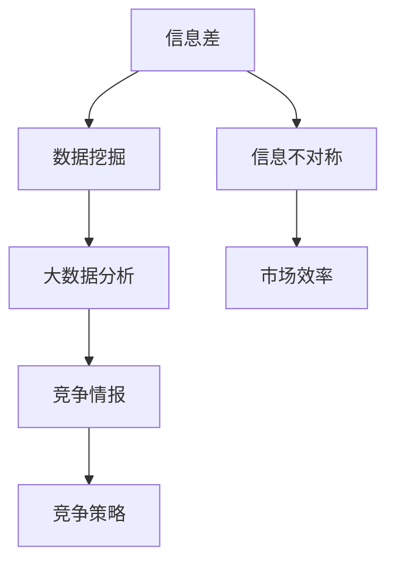

                 

# 信息差：信息不对称与竞争情报

> 关键词：信息差, 信息不对称, 竞争情报, 人工智能, 数据挖掘, 大数据分析

## 1. 背景介绍

在当今数字化时代，信息不对称是普遍存在的现象。无论是商业竞争、个人决策，还是社会治理，信息的不对称都可能导致决策失准、资源配置失衡等问题。因此，如何有效获取、分析和利用信息差（即不同信息持有者之间的差异性信息），成为了各方争夺优势的重要手段。竞争情报（Competitive Intelligence）即是指通过收集、分析和利用竞争对手的信息，来制定和调整竞争策略，从而获取或维持竞争优势。

### 1.1 问题由来

随着信息技术的飞速发展，信息量呈爆炸式增长，信息的不对称性日益凸显。消费者通过社交媒体、搜索引擎等平台，可以轻松获取产品评价、价格变化等信息，而企业往往难以及时全面了解市场动态。在商业竞争中，谁能够更早地识别出有价值的信息差，并迅速做出反应，往往决定了最终的胜败。因此，信息差与竞争情报成为了企业战略决策中的重要工具。

### 1.2 问题核心关键点

- **信息差识别**：如何通过数据挖掘和分析技术，从海量数据中识别出有用的信息差。
- **竞争情报生成**：如何将信息差转化为具体的竞争情报，帮助企业制定战略决策。
- **竞争情报利用**：如何结合内部资源和外部环境，制定并实施有效的竞争策略。

这些核心关键点构成了信息差与竞争情报的基础，同时也体现了人工智能和大数据技术在企业决策中的重要应用。

## 2. 核心概念与联系

### 2.1 核心概念概述

信息差与竞争情报涉及多个核心概念，如下：

- **信息差**：指不同信息持有者之间的差异性信息，通常是商业决策中的关键因素。
- **信息不对称**：指市场参与者之间对相关信息的了解程度存在差异，影响市场效率和公平性。
- **竞争情报**：通过收集和分析竞争对手的信息，来制定和调整竞争策略，获取或维持竞争优势。
- **数据挖掘**：从数据中挖掘有用信息和知识的过程，通常用于发现信息差。
- **大数据分析**：通过处理和分析海量数据，识别潜在的信息差和竞争趋势。
- **人工智能**：运用机器学习、深度学习等技术，进行自动化的信息差识别和竞争情报生成。

这些概念之间的关系可以通过以下Mermaid流程图来展示：



这个流程图展示了信息差与竞争情报的核心概念及其之间的关系：

1. 信息差通过数据挖掘从海量数据中提取出来。
2. 数据挖掘的结果经过大数据分析，进一步挖掘和分析潜在信息差。
3. 信息差与市场效率之间存在直接关联。
4. 通过竞争情报，企业可以制定和调整竞争策略。
5. 竞争情报的应用直接影响企业的竞争优势和市场地位。

## 3. 核心算法原理 & 具体操作步骤

### 3.1 算法原理概述

竞争情报的生成主要基于以下步骤：

1. **数据收集**：从公开和半公开的渠道（如社交媒体、新闻、行业报告等）收集关于竞争对手的信息。
2. **信息差识别**：通过数据挖掘和分析，识别出竞争对手的优势和劣势，找出自身的差距。
3. **竞争情报生成**：将识别出的信息差转化为具体的竞争情报，制定相应的战略决策。
4. **竞争情报应用**：将竞争情报融入企业的运营管理中，调整业务策略以获取竞争优势。

### 3.2 算法步骤详解

1. **数据收集**：
   - 使用网络爬虫、API接口等方式，收集竞争对手的公开信息，如网站流量、社交媒体动态、新闻报道等。
   - 收集半公开信息，如行业报告、市场分析等，这些信息往往更加详细和有深度。

2. **信息差识别**：
   - 使用文本挖掘和情感分析技术，从收集到的文本中提取关键信息，如竞争对手的客户反馈、市场趋势等。
   - 使用可视化工具，如图谱、仪表盘等，直观展示信息差的分布和变化。
   - 使用机器学习模型，如分类器、聚类算法等，对信息进行自动化的分类和分析。

3. **竞争情报生成**：
   - 根据信息差的特点和趋势，结合行业知识，生成有针对性的竞争情报。
   - 通过专家评审或模拟实验，验证情报的准确性和有效性。
   - 将情报转化为具体的行动计划，如市场定位、产品创新、供应链调整等。

4. **竞争情报应用**：
   - 将情报纳入企业的战略规划，制定长期和短期的竞争策略。
   - 动态监控竞争对手的动态，实时调整竞争情报和策略。
   - 结合内部资源和外部环境，综合考虑情报的应用效果。

### 3.3 算法优缺点

竞争情报的生成算法具有以下优点：

- **自动化**：通过机器学习和大数据技术，自动化信息差识别和情报生成，提高效率。
- **多维度**：综合考虑多源数据，分析信息差的多维度特征，提供全面的竞争视角。
- **实时性**：通过动态监控和实时更新，保持竞争情报的最新性，适应市场变化。

同时，该算法也存在一定的局限性：

- **数据质量**：依赖于数据源的质量和完整性，信息差识别和分析的准确性受数据质量影响。
- **模型依赖**：模型选择和参数调整对情报生成的质量有重要影响，需要专业知识和经验。
- **策略执行**：情报的转化为具体的策略实施，受企业内部资源和外部环境的影响，执行效果存在不确定性。

### 3.4 算法应用领域

竞争情报技术广泛应用于多个领域，包括但不限于：

- **商业竞争**：帮助企业了解竞争对手的动态，制定差异化的竞争策略，保持市场优势。
- **行业分析**：分析行业发展趋势，识别市场机会和潜在威胁，指导企业的战略决策。
- **风险管理**：通过信息差分析，识别和评估潜在风险，制定相应的风险应对策略。
- **品牌管理**：监测品牌在市场上的表现，识别品牌差异化的信息差，提升品牌竞争力。
- **供应链管理**：了解供应链中的信息差，优化供应链管理，降低成本，提升效率。

这些应用场景展示了竞争情报的广泛应用，同时也体现了其为企业决策提供的重要支持。

## 4. 数学模型和公式 & 详细讲解 & 举例说明

### 4.1 数学模型构建

信息差与竞争情报的生成过程可以用以下数学模型来描述：

$$
C_I = f(D, K, E)
$$

其中，$C_I$ 表示竞争情报，$D$ 表示收集到的原始数据，$K$ 表示知识库，$E$ 表示企业资源。该模型表示，竞争情报是数据、知识和企业资源综合作用的结果。

### 4.2 公式推导过程

通过信息差识别和情报生成的步骤，可以将公式进一步展开为：

$$
C_I = f_{D}(D) + f_{K}(K) + f_{E}(E)
$$

其中，$f_{D}(D)$ 表示从数据中提取信息差的过程，$f_{K}(K)$ 表示从知识库中提取信息差的过程，$f_{E}(E)$ 表示将信息差转化为竞争情报的过程。

### 4.3 案例分析与讲解

假设某电子商务平台收集到竞争对手的销售数据和客户评价，通过数据挖掘和情感分析，识别出竞争对手在特定市场中的优势和劣势。同时，结合企业自身的市场定位和产品特点，生成具体的竞争情报，如调整价格策略、优化产品功能等。最终，通过动态监控和实时调整，确保竞争情报的有效性，帮助企业保持市场竞争力。

## 5. 项目实践：代码实例和详细解释说明

### 5.1 开发环境搭建

为了进行信息差与竞争情报的实践，需要搭建一个具备数据处理和分析能力的环境。以下是使用Python进行数据处理和分析的环境配置流程：

1. 安装Anaconda：从官网下载并安装Anaconda，用于创建独立的Python环境。

2. 创建并激活虚拟环境：
```bash
conda create -n competition-intelligence python=3.8 
conda activate competition-intelligence
```

3. 安装必要的Python包：
```bash
pip install pandas numpy scikit-learn tensorflow transformers nltk
```

4. 安装数据挖掘和分析工具：
```bash
pip install seaborn matplotlib plotly beautifulsoup4
```

完成上述步骤后，即可在`competition-intelligence`环境中开始信息差与竞争情报的实践。

### 5.2 源代码详细实现

以下是使用Python和TensorFlow进行信息差与竞争情报生成的代码实现：

```python
import pandas as pd
import tensorflow as tf
from sklearn.feature_extraction.text import TfidfVectorizer
from sklearn.decomposition import NMF

# 加载数据
data = pd.read_csv('competition_data.csv')

# 数据清洗和预处理
# ...

# 信息差识别
tfidf = TfidfVectorizer()
tfidf_matrix = tfidf.fit_transform(data['text'])

nmf = NMF(n_components=5, random_state=42)
nmf_matrix = nmf.fit_transform(tfidf_matrix)

# 可视化信息差
import seaborn as sns
sns.heatmap(nmf_matrix, annot=True)

# 信息差应用
# ...
```

在这个代码示例中，我们首先加载了关于竞争对手的数据，进行了数据清洗和预处理，然后使用TF-IDF向量化和NMF模型识别信息差。最后，使用可视化工具展示信息差的分布，并根据识别出的信息差生成竞争情报。

### 5.3 代码解读与分析

让我们再详细解读一下关键代码的实现细节：

**数据加载和预处理**：
- `pd.read_csv()`函数：从CSV文件中读取数据，并进行初步的清洗和预处理。

**信息差识别**：
- `TfidfVectorizer()`：将文本数据转化为TF-IDF向量，用于计算信息差。
- `NMF()`模型：使用非负矩阵分解模型，识别信息差的主成分。
- `sns.heatmap()`：使用Seaborn库可视化信息差的分布。

**信息差应用**：
- 根据信息差的特点和趋势，生成具体的竞争情报。例如，识别竞争对手的优势和劣势，制定差异化的竞争策略。

可以看到，通过Python和TensorFlow等工具，信息差与竞争情报的生成变得相对简单高效。开发者可以将更多精力放在数据处理、模型改进等高层逻辑上，而不必过多关注底层的实现细节。

## 6. 实际应用场景

### 6.1 商业竞争

在商业竞争中，信息差与竞争情报是企业决策的重要依据。通过收集和分析竞争对手的市场动态、产品信息、客户反馈等，企业可以及时调整策略，获得市场优势。例如，某电商平台可以通过分析竞争对手的销售数据和客户评价，识别出竞争对手的价格策略、产品特点等信息差，从而制定有针对性的促销活动和产品改进方案。

### 6.2 行业分析

行业分析是信息差与竞争情报的重要应用场景。通过对行业内的主要企业进行信息差识别，可以洞察行业发展趋势，识别市场机会和潜在威胁。例如，某咨询公司可以通过分析行业内的主要企业信息，识别出新兴技术、市场趋势等信息差，为企业的战略决策提供支持。

### 6.3 风险管理

风险管理是信息差与竞争情报的重要应用场景。通过分析竞争对手的风险信息，企业可以及时调整风险应对策略，降低风险损失。例如，某金融机构可以通过分析竞争对手的市场表现和客户反馈，识别出潜在的信用风险和市场波动，从而制定相应的风险应对策略。

### 6.4 未来应用展望

未来，随着信息技术的进一步发展，信息差与竞争情报的应用将更加广泛和深入。以下趋势值得关注：

1. **智能化升级**：随着AI技术的进步，信息差与竞争情报的生成将更加智能化和自动化。通过深度学习模型，可以实现更加精准的信息差识别和情报生成。
2. **多源数据融合**：结合多源数据（如社交媒体、新闻、物联网等），进行综合分析和信息差识别，提升情报的全面性和准确性。
3. **实时化处理**：通过实时数据采集和处理，实现信息差与竞争情报的动态更新，保持情报的时效性。
4. **跨行业应用**：信息差与竞争情报的应用将超越传统行业，进入更多新兴领域（如医疗、教育、交通等），提供更加多样化的服务和支持。

这些趋势展示了信息差与竞争情报技术的广阔前景，同时也提出了新的挑战和机遇。

## 7. 工具和资源推荐

### 7.1 学习资源推荐

为了帮助开发者系统掌握信息差与竞争情报的理论基础和实践技巧，这里推荐一些优质的学习资源：

1. **《信息差与竞争情报》课程**：由行业专家开设的在线课程，深入讲解信息差识别、情报生成等核心概念和实践技巧。

2. **《大数据分析与竞争情报》书籍**：详细介绍了大数据技术在信息差与竞争情报中的应用，包括数据挖掘、文本分析等技术。

3. **《AI时代下的竞争情报》白皮书**：由知名咨询机构发布的报告，分析了AI技术对信息差与竞争情报的影响，提供了最新的行业洞察。

4. **Competitive Intelligence Journal**：国际领先的竞争情报期刊，定期发布最新的研究论文和技术进展，是了解行业前沿的重要渠道。

通过对这些资源的学习实践，相信你一定能够快速掌握信息差与竞争情报的精髓，并用于解决实际的商业问题。

### 7.2 开发工具推荐

高效的信息差与竞争情报开发离不开优秀的工具支持。以下是几款用于信息差与竞争情报开发的常用工具：

1. **Python**：基于Python的开源编程语言，灵活易用，广泛支持各种数据处理和分析库。

2. **TensorFlow**：由Google开发的深度学习框架，支持多种神经网络模型，适用于信息差识别和情报生成等复杂任务。

3. **Transformers库**：HuggingFace开发的NLP工具库，集成了多种预训练语言模型，支持快速的信息差识别和情报生成。

4. **Scikit-learn**：Python的机器学习库，提供了丰富的分类、聚类、回归等算法，适用于信息差分析。

5. **Seaborn、Matplotlib、Plotly**：数据可视化工具，适用于信息差分布和情报展示。

合理利用这些工具，可以显著提升信息差与竞争情报的开发效率，加快创新迭代的步伐。

### 7.3 相关论文推荐

信息差与竞争情报的发展源于学界的持续研究。以下是几篇奠基性的相关论文，推荐阅读：

1. **《利用信息差进行竞争情报分析》**：详细介绍了信息差与竞争情报的基本概念和生成方法。

2. **《大数据驱动的信息差与竞争情报应用》**：分析了大数据技术在信息差识别和情报生成中的应用，提供了实证案例。

3. **《信息差与竞争情报的深度学习应用》**：介绍了深度学习在信息差识别和情报生成中的应用，展示了最新的技术进展。

这些论文代表了大数据和AI技术在信息差与竞争情报中的应用方向，提供了宝贵的理论和技术支持。

## 8. 总结：未来发展趋势与挑战

### 8.1 总结

本文对信息差与竞争情报的生成过程进行了全面系统的介绍。首先阐述了信息差与竞争情报的研究背景和意义，明确了其在工作决策中的重要价值。其次，从原理到实践，详细讲解了信息差识别和竞争情报生成的数学模型和操作步骤，给出了具体的代码实例。同时，本文还探讨了信息差与竞争情报在商业竞争、行业分析、风险管理等多个场景中的应用，展示了其广泛的实际应用前景。最后，本文精选了信息差与竞争情报的相关学习资源、开发工具和研究论文，力求为读者提供全方位的技术指引。

通过本文的系统梳理，可以看到，信息差与竞争情报技术在商业决策中发挥了重要作用，提升了企业的市场竞争力和决策准确性。未来，伴随技术的不断进步和应用领域的扩展，信息差与竞争情报必将在更多场景中发挥关键作用，推动企业战略决策的科学化、精准化。

### 8.2 未来发展趋势

展望未来，信息差与竞争情报技术将呈现以下几个发展趋势：

1. **智能化升级**：随着AI技术的进步，信息差与竞争情报的生成将更加智能化和自动化。通过深度学习模型，可以实现更加精准的信息差识别和情报生成。

2. **多源数据融合**：结合多源数据（如社交媒体、新闻、物联网等），进行综合分析和信息差识别，提升情报的全面性和准确性。

3. **实时化处理**：通过实时数据采集和处理，实现信息差与竞争情报的动态更新，保持情报的时效性。

4. **跨行业应用**：信息差与竞争情报的应用将超越传统行业，进入更多新兴领域（如医疗、教育、交通等），提供更加多样化的服务和支持。

这些趋势展示了信息差与竞争情报技术的广阔前景，同时也提出了新的挑战和机遇。

### 8.3 面临的挑战

尽管信息差与竞争情报技术已经取得了瞩目成就，但在迈向更加智能化、普适化应用的过程中，它仍面临着诸多挑战：

1. **数据质量瓶颈**：信息差识别和分析的准确性受数据质量影响，如何获取和处理高质量数据是一大挑战。

2. **模型依赖性**：模型选择和参数调整对情报生成的质量有重要影响，需要专业知识和经验。

3. **策略执行困难**：情报的转化为具体的策略实施，受企业内部资源和外部环境的影响，执行效果存在不确定性。

4. **隐私和安全问题**：在收集和分析信息差时，需要保护数据隐私和信息安全，避免泄露敏感信息。

5. **技术复杂性**：信息差与竞争情报的生成涉及多种技术和算法，技术实现复杂性较高。

6. **跨领域应用挑战**：在不同领域应用信息差与竞争情报时，需要结合领域知识，进行模型优化和参数调整。

这些挑战需要学界和产业界共同努力，积极探索和克服，才能使信息差与竞争情报技术发挥更大的价值。

### 8.4 研究展望

面对信息差与竞争情报所面临的挑战，未来的研究需要在以下几个方面寻求新的突破：

1. **跨领域知识融合**：结合领域知识，优化信息差识别和情报生成的模型和算法，提升情报的针对性和有效性。

2. **隐私保护技术**：开发隐私保护技术，确保数据安全和隐私，保障信息差与竞争情报的合法合规应用。

3. **实时数据处理**：研究和应用实时数据处理技术，实现信息差与竞争情报的动态更新和即时分析。

4. **模型优化和调优**：针对不同行业和应用场景，进行模型优化和调优，提升信息差与竞争情报的生成效率和质量。

5. **AI与大数据结合**：结合AI技术和大数据分析，提升信息差与竞争情报的智能化和自动化水平，降低人工干预和复杂性。

这些研究方向的探索，将引领信息差与竞争情报技术迈向更高的台阶，为构建智能化的决策支持系统提供新的动力。面向未来，信息差与竞争情报技术还需要与其他人工智能技术进行更深入的融合，如知识表示、因果推理、强化学习等，多路径协同发力，共同推动信息差与竞争情报技术的持续演进。

## 9. 附录：常见问题与解答

**Q1：信息差与竞争情报的生成过程需要哪些关键步骤？**

A: 信息差与竞争情报的生成过程主要包括以下关键步骤：

1. **数据收集**：从公开和半公开的渠道收集关于竞争对手的信息。

2. **信息差识别**：通过数据挖掘和分析，识别出竞争对手的优势和劣势。

3. **竞争情报生成**：将识别出的信息差转化为具体的竞争情报，制定相应的战略决策。

4. **竞争情报应用**：将情报纳入企业的运营管理中，调整业务策略以获取竞争优势。

这些步骤构成了信息差与竞争情报生成的主流程，各步骤之间紧密关联，缺一不可。

**Q2：如何选择合适的信息差识别算法？**

A: 信息差识别的算法选择主要取决于数据类型和分析需求。常见算法包括：

1. **文本挖掘和情感分析**：适用于文本数据，如客户评价、社交媒体动态等。

2. **网络分析**：适用于网络数据，如网站流量、社交网络关系等。

3. **数据挖掘和聚类**：适用于结构化数据，如销售数据、市场分析报告等。

4. **深度学习模型**：适用于复杂的数据类型和分析需求，如图像、视频等。

选择合适的算法需要结合具体的业务场景和数据类型，通过实验和评估找到最优方案。

**Q3：信息差与竞争情报在实际应用中需要注意哪些问题？**

A: 信息差与竞争情报在实际应用中需要注意以下问题：

1. **数据隐私和伦理**：在收集和分析信息差时，需要保护数据隐私和信息安全，避免泄露敏感信息。

2. **数据质量控制**：确保数据源的质量和完整性，避免因数据质量问题影响分析结果。

3. **模型鲁棒性**：选择合适的模型和算法，确保情报生成的鲁棒性和准确性。

4. **实时性和时效性**：确保情报的实时更新和时效性，适应市场变化。

5. **跨领域应用**：结合领域知识，进行模型优化和调优，提升情报的针对性和有效性。

这些问题的解决需要从数据管理、模型选择、技术实现等多个方面进行综合考虑，才能确保信息差与竞争情报的生成和应用效果。

**Q4：信息差与竞争情报在商业决策中的应用有哪些？**

A: 信息差与竞争情报在商业决策中的应用包括但不限于：

1. **市场动态分析**：识别市场趋势和竞争对手动态，制定市场进入和退出策略。

2. **产品创新和改进**：识别竞争对手的产品特点和客户反馈，指导产品创新和改进。

3. **客户关系管理**：分析客户评价和反馈，优化客户体验和关系维护。

4. **供应链优化**：分析供应链中的信息差，优化供应链管理，降低成本，提升效率。

5. **品牌管理**：监测品牌在市场上的表现，识别品牌差异化的信息差，提升品牌竞争力。

这些应用展示了信息差与竞争情报在商业决策中的广泛应用，同时也体现了其对企业战略决策的重要支持。

---

作者：禅与计算机程序设计艺术 / Zen and the Art of Computer Programming

