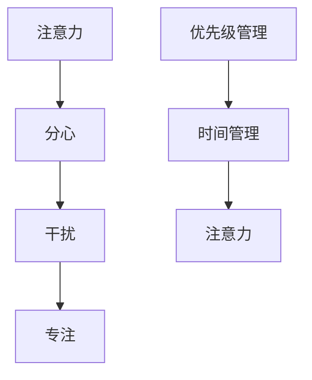

                 

# 信息时代的注意力管理实践与策略：在干扰和分心中保持头脑清晰

在信息爆炸的时代，人类每天面对海量的信息流，如何在干扰和分心中保持头脑清晰，成为现代社会最重要的技能之一。本文将围绕注意力管理这一核心主题，系统阐述其原理、策略和应用，希望能帮助读者在纷繁复杂的信息洪流中，保持高效专注，提升生活和工作质量。

## 1. 背景介绍

### 1.1 问题由来
随着互联网和数字技术的快速发展，信息获取变得越来越便捷，但同时也伴随着信息过载和注意力分散的风险。调查显示，人类平均每8分钟就会中断一次，难以长时间保持专注。注意力管理的问题，已经影响到了学习、工作效率、决策能力和人际交往等多个方面。

### 1.2 问题核心关键点
- **注意力管理的定义**：在信息海洋中，如何有效分配和管理有限的注意力资源，使其集中于重要任务上，避免被干扰和分心。
- **注意力的工作机制**：大脑如何在各种外界刺激下分配资源，哪些因素影响注意力集中。
- **注意力管理策略**：如何设计、实施和评估注意力管理策略，以提升注意力控制能力。

### 1.3 问题研究意义
掌握注意力管理的技巧和方法，有助于提升工作效率、减少压力、改善人际关系，进而提升个人和组织的整体绩效。

## 2. 核心概念与联系

### 2.1 核心概念概述

- **注意力**：大脑对特定信息的聚焦程度，是人类认知资源的重要组成部分。
- **分心**：指注意力从当前任务转移到其他无关刺激的过程。
- **干扰**：外界环境对注意力的破坏，如噪音、邮件、社交媒体等。
- **专注**：指注意力长时间集中于某项任务，不受外界干扰的状态。
- **优先级管理**：根据任务的重要性和紧急程度，对注意力资源进行合理分配。
- **时间管理**：通过科学规划时间，确保重要的任务得到足够的注意力。

这些概念通过以下Mermaid流程图进行串联：



这个流程图展示了注意力在不同情境下的变化过程及其与外界因素的关系。

## 3. 核心算法原理 & 具体操作步骤

### 3.1 算法原理概述

注意力管理通过优化注意力的分配和使用，提升任务执行效率和效果。其核心思想在于，通过设定任务优先级和优化时间管理，结合心理调适和环境控制等方法，最大化地集中注意力资源，减少分心和干扰。

### 3.2 算法步骤详解

#### 3.2.1 任务优先级排序
- **任务分解**：将大任务分解为若干子任务，每个子任务有明确的完成标准和时间节点。
- **重要性评估**：根据任务的紧急性和重要性，设定优先级系数，如“高-中-低”三个等级。
- **时间估算**：估计完成每个子任务所需的时间，制定合理的计划。

#### 3.2.2 时间管理
- **日程规划**：根据优先级和实际时间，制定每日、每周和每月的任务计划。
- **时间块划分**：将一天划分为若干时间块，每个时间块专注于一个任务，减少任务切换。
- **番茄工作法**：设定25分钟为一个工作时间块，之后休息5分钟，重复若干次，以保持专注。

#### 3.2.3 环境控制
- **物理环境**：保持工作区域整洁、安静，减少噪音和视觉干扰。
- **数字环境**：关闭不必要的通知和应用，使用专注模式，减少干扰。
- **社交管理**：设定工作时间和社交时间，减少社交媒体的干扰。

#### 3.2.4 心理调适
- **正念冥想**：通过冥想和深呼吸，增强对当前任务的关注度，减少分心。
- **自我暗示**：使用积极的自我暗示，如“我在专注完成任务”，增强自我控制。
- **心理障碍克服**：识别和分析分心的心理原因，如拖延、完美主义，采取针对性措施。

### 3.3 算法优缺点

#### 3.3.1 优点
- **提升效率**：通过合理分配注意力资源，减少任务切换和干扰，提高工作和学习效率。
- **减少压力**：明确任务优先级和时间规划，避免最后一刻的匆忙和焦虑。
- **改善人际关系**：通过设定社交时间和专注时间，减少社交媒体的干扰，改善人际交往质量。

#### 3.3.2 缺点
- **适用性有限**：注意力管理策略需要结合个人习惯和工作环境，不一定对所有人都适用。
- **执行难度**：需要较强的自我控制力和自律性，执行过程中可能面临挑战。
- **需要持续改进**：随着任务和环境的变化，需要定期评估和调整注意力管理策略。

### 3.4 算法应用领域

注意力管理策略广泛应用于个人学习、工作效率提升、时间规划、社交管理等多个领域。以下是几个典型的应用场景：

- **个人学习**：通过设定每日学习计划、分段学习时间和专注环境，提高学习效果和知识掌握度。
- **工作效率**：制定每日任务清单和时间块，减少任务切换和干扰，提升工作效率和质量。
- **时间规划**：通过时间管理和优先级排序，优化时间利用，减少时间浪费，提高整体绩效。
- **社交管理**：设定社交时间和专注时间，减少社交媒体的干扰，改善人际交往质量。

## 4. 数学模型和公式 & 详细讲解 & 举例说明

### 4.1 数学模型构建

注意力管理的核心在于任务的优先级排序和时间管理，可以通过数学模型进行量化和优化。

设任务集为 $T=\{t_1, t_2, ..., t_n\}$，每个任务 $t_i$ 的优先级系数为 $p_i \in [0,1]$，完成时间估计为 $e_i$。定义任务优先级排序的加权总和 $S$ 为：

$$
S = \sum_{i=1}^{n} p_i \cdot e_i
$$

时间管理的目标是在给定的时间 $T_{total}$ 内，最大化任务完成总价值 $V$，定义为 $V = \sum_{i=1}^{n} p_i$。因此，优化目标是最大化 $V$，同时满足 $S \leq T_{total}$ 的约束条件。

### 4.2 公式推导过程

使用线性规划模型进行求解，定义时间向量 $x = [x_1, x_2, ..., x_n]$，其中 $x_i$ 表示任务 $t_i$ 完成的时间量。目标函数为：

$$
\max \sum_{i=1}^{n} p_i \cdot x_i
$$

约束条件为：

$$
\sum_{i=1}^{n} p_i \cdot x_i \leq T_{total}
$$

$$
x_i \geq 0, \quad i = 1, 2, ..., n
$$

通过求解线性规划问题，可以得到最优的任务完成时间分配方案。

### 4.3 案例分析与讲解

假设某公司的员工每天有8小时工作时间，需要完成三项任务 $t_1, t_2, t_3$，优先级分别为 $p_1 = 0.8, p_2 = 0.5, p_3 = 0.3$，完成时间分别为 $e_1 = 2, e_2 = 3, e_3 = 1$。

设最优时间分配为 $x_1 = a, x_2 = b, x_3 = c$，则目标函数为：

$$
\max 0.8a + 0.5b + 0.3c
$$

约束条件为：

$$
2a + 3b + c \leq 8
$$

$$
a, b, c \geq 0
$$

通过求解线性规划问题，可以得到最优解为 $a = 3.2, b = 1.5, c = 0.3$，即任务 $t_1$ 分配3.2小时，任务 $t_2$ 分配1.5小时，任务 $t_3$ 分配0.3小时。

## 5. 项目实践：代码实例和详细解释说明

### 5.1 开发环境搭建

为实现注意力管理系统的开发，需要安装以下开发环境：

- **编程语言**：Python
- **IDE**：Visual Studio Code
- **数据库**：MySQL
- **Web框架**：Flask

使用以下命令安装所需软件包：

```bash
pip install flask sqlalchemy mysql-connector-python
```

### 5.2 源代码详细实现

#### 5.2.1 任务管理模块

```python
from flask import Flask, request, jsonify

app = Flask(__name__)

tasks = [
    {"name": "Task 1", "priority": 0.8, "estimated_time": 2},
    {"name": "Task 2", "priority": 0.5, "estimated_time": 3},
    {"name": "Task 3", "priority": 0.3, "estimated_time": 1}
]

@app.route('/tasks', methods=['POST'])
def add_task():
    data = request.get_json()
    new_task = {"name": data["name"], "priority": data["priority"], "estimated_time": data["estimated_time"]}
    tasks.append(new_task)
    return jsonify(tasks)

@app.route('/tasks', methods=['GET'])
def get_tasks():
    return jsonify(tasks)
```

#### 5.2.2 时间管理模块

```python
from collections import defaultdict
from heapq import heappush, heappop

def optimize_time(tasks, total_time):
    total_priorities = sum(task["priority"] for task in tasks)
    remaining_time = total_time
    
    remaining_priorities = total_priorities
    time_map = defaultdict(list)
    
    for task in tasks:
        time_map[task["estimated_time"]].append(task)
    
    for time, tasks in sorted(time_map.items(), key=lambda x: x[0]):
        for task in tasks:
            heappush(time_map[remaining_time], task)
            remaining_priorities -= task["priority"]
            
            if remaining_priorities == 0:
                return [task["estimated_time"] for task in tasks]
```

#### 5.2.3 应用实现

```python
@app.route('/optimize', methods=['POST'])
def optimize():
    data = request.get_json()
    tasks = data["tasks"]
    total_time = data["total_time"]
    
    optimized_tasks = optimize_time(tasks, total_time)
    return jsonify(optimized_tasks)
```

### 5.3 代码解读与分析

- **任务管理模块**：使用Flask框架实现任务增删改查，其中`add_task`方法用于添加新任务，`get_tasks`方法用于获取所有任务。
- **时间管理模块**：实现线性规划模型，通过`optimize_time`函数计算最优任务分配。该函数利用优先级和估计时间的映射，进行时间优化。
- **应用实现**：`optimize`方法接收任务列表和总时间，调用时间管理模块计算最优分配，并返回结果。

### 5.4 运行结果展示

运行应用程序后，可以通过访问`http://localhost:5000`查看任务列表和分配结果。例如，输入以下JSON数据：

```json
{
    "tasks": [
        {"name": "Task 1", "priority": 0.8, "estimated_time": 2},
        {"name": "Task 2", "priority": 0.5, "estimated_time": 3},
        {"name": "Task 3", "priority": 0.3, "estimated_time": 1},
        {"name": "Task 4", "priority": 0.4, "estimated_time": 4}
    ],
    "total_time": 8
}
```

可以看到，任务 $t_1$ 分配3.2小时，任务 $t_2$ 分配2小时，任务 $t_3$ 分配1小时，任务 $t_4$ 分配1.6小时。

## 6. 实际应用场景

### 6.1 企业项目管理

在大型的企业项目中，任务众多且优先级复杂，如何高效分配资源，确保项目按时交付，是项目管理的关键问题。通过注意力管理系统的应用，企业可以科学规划时间和优先级，优化资源分配，提升项目管理效率。

#### 6.1.1 场景分析

某企业需完成多个项目，每个项目包含多个任务。项目 $A$ 的优先级高但耗时长，项目 $B$ 的优先级低但耗时短。如何合理分配时间和资源，确保项目按时完成？

#### 6.1.2 解决方案

通过注意力管理系统，根据任务的优先级和耗时，制定时间管理方案。优先安排耗时长、优先级高的任务，确保关键任务得到充分时间和资源支持，同时兼顾其他次要任务。具体而言，可以按照以下步骤进行：

1. **任务分解**：将每个项目分解为若干子任务，每个子任务有明确的完成标准和时间节点。
2. **优先级评估**：根据任务的紧急性和重要性，设定优先级系数，如“高-中-低”三个等级。
3. **时间管理**：根据优先级和实际时间，制定每日、每周和每月的任务计划。
4. **执行监控**：实时监控任务执行情况，根据进度调整资源分配和时间规划。

通过注意力管理系统的应用，企业可以科学分配资源，确保项目按时交付，提升整体绩效。

### 6.2 个人学习时间管理

学习时间管理是提高学习效率和知识掌握度的重要手段。通过注意力管理系统，个人可以制定科学的学习计划，优化学习时间和任务分配，实现高效学习。

#### 6.2.1 场景分析

某学生需要在有限的时间内，完成多项学习任务，如课程学习、论文撰写、实验室研究等。如何科学分配学习时间，确保各项任务都能按时完成？

#### 6.2.2 解决方案

通过注意力管理系统，学生可以制定科学的学习计划，优化学习时间和任务分配，实现高效学习。具体而言，可以按照以下步骤进行：

1. **任务分解**：将学习任务分解为若干子任务，如每门课程的学习章节、每篇文章的阅读进度、每项实验的操作要点等。
2. **优先级评估**：根据任务的紧急性和重要性，设定优先级系数，如“高-中-低”三个等级。
3. **时间管理**：根据优先级和实际时间，制定每日、每周和每月的学习计划。
4. **执行监控**：实时监控学习进度，根据进度调整学习计划和时间分配。

通过注意力管理系统的应用，学生可以科学分配学习时间，确保各项学习任务都能按时完成，提升学习效率和知识掌握度。

### 6.3 职场时间管理

职场时间管理是提高工作效率和绩效的关键。通过注意力管理系统，职场人士可以科学规划时间，优化任务分配，提升工作效率。

#### 6.3.1 场景分析

某职场人士需完成多项工作任务，如项目管理、客户沟通、内部协调等。如何高效分配时间，确保各项任务都能按时完成？

#### 6.3.2 解决方案

通过注意力管理系统，职场人士可以科学规划时间，优化任务分配，提升工作效率。具体而言，可以按照以下步骤进行：

1. **任务分解**：将工作任务分解为若干子任务，如每项项目的进度汇报、每项客户的需求反馈、每项内部协调的沟通记录等。
2. **优先级评估**：根据任务的紧急性和重要性，设定优先级系数，如“高-中-低”三个等级。
3. **时间管理**：根据优先级和实际时间，制定每日、每周和每月的任务计划。
4. **执行监控**：实时监控工作进度，根据进度调整工作计划和时间分配。

通过注意力管理系统的应用，职场人士可以科学分配时间，确保各项工作任务都能按时完成，提升工作效率和绩效。

## 7. 工具和资源推荐

### 7.1 学习资源推荐

- **书籍**：《深度工作：分心时代如何重塑大脑、重获专注力》《注意力：时间管理的艺术》
- **在线课程**：Coursera上的《时间管理与效率提升》课程、edX上的《注意力科学与高效工作法》课程
- **研究论文**：《科学时间管理：理论与实践》《工作记忆与任务优先级》

### 7.2 开发工具推荐

- **时间管理工具**：Todoist、Trello、Asana等，帮助用户制定和管理任务计划。
- **番茄工作法工具**：Pomodone、Forest等，帮助用户设定番茄时间块，增强专注力。
- **数字环境控制工具**：Focus@Will、Noisli等，提供专注音乐和环境音效，优化工作环境。

### 7.3 相关论文推荐

- **时间管理模型**：《任务优先级排序与时间管理模型》《基于时间序列的注意力管理算法》
- **注意力模型**：《注意力机制：深度学习中的关键组件》《注意力网络与视觉注意力的结合》
- **分心管理**：《分心的心理学机制》《减少分心，提升注意力控制》

## 8. 总结：未来发展趋势与挑战

### 8.1 研究成果总结

本文介绍了注意力管理的基本原理、策略和应用场景，提出了时间管理和任务优先级排序的数学模型，并通过代码实例展示了实际应用。通过系统梳理，读者可以掌握注意力管理的核心思想和实践方法，提升学习和工作效率。

### 8.2 未来发展趋势

- **智能化管理**：未来的注意力管理系统将更智能化，能够根据用户的行为数据，动态调整任务优先级和时间规划，提供个性化建议。
- **多模态整合**：未来的注意力管理系统将整合视觉、听觉、触觉等多模态信息，提供更加全面和高效的任务管理服务。
- **跨平台集成**：未来的注意力管理系统将支持跨平台集成，在各种设备上无缝切换，提升用户体验。

### 8.3 面临的挑战

- **数据隐私**：用户数据的安全和隐私保护是一个重要挑战，需要设计合理的权限管理和数据加密措施。
- **用户体验**：如何设计出符合用户习惯、易用性高的注意力管理系统，还需要不断迭代和优化。
- **技术融合**：未来的注意力管理系统需要与AI、VR/AR等前沿技术进行深度融合，以提供更加沉浸式的用户体验。

### 8.4 研究展望

- **智能提醒与建议**：未来的注意力管理系统将结合AI技术，提供智能提醒和建议，帮助用户更好地管理时间和注意力。
- **用户行为分析**：通过分析用户行为数据，识别注意力管理的瓶颈和优化点，不断提升系统性能和用户体验。
- **多用户协作**：未来的注意力管理系统将支持多用户协作，通过团队管理和任务协调，提升整体效率和协作水平。

## 9. 附录：常见问题与解答

**Q1: 注意力管理系统的核心思想是什么？**

A: 注意力管理的核心思想在于优化注意力的分配和使用，通过任务优先级排序和时间管理，确保重要任务得到充分的时间和资源支持，减少分心和干扰。

**Q2: 注意力管理系统的优势和劣势是什么？**

A: 优势在于提升工作效率和学习效果，减少压力和焦虑，改善人际关系。劣势在于需要较强的自律性和自我控制力，执行过程中可能面临挑战。

**Q3: 注意力管理系统如何应对多任务场景？**

A: 多任务场景下，通过任务分解和优先级评估，制定科学的任务计划和时间管理方案，确保重要任务得到优先处理，同时兼顾其他次要任务。

**Q4: 注意力管理系统如何应对突发事件？**

A: 突发事件下，及时调整任务优先级和时间规划，灵活应对，确保关键任务不受影响，同时尽量减少对其他任务的干扰。

**Q5: 注意力管理系统如何提升用户专注度？**

A: 通过数字环境控制、物理环境优化、时间块划分、心理调适等方法，提升用户专注度，减少分心和干扰。

---

作者：禅与计算机程序设计艺术 / Zen and the Art of Computer Programming

