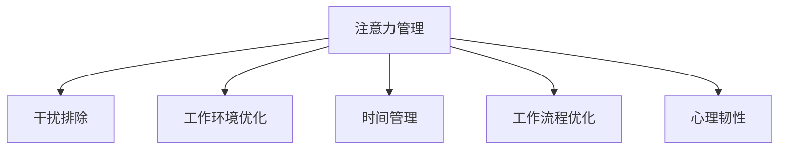

                 

# 信息时代的注意力管理策略：在充满干扰的世界中保持头脑清晰和专注

> 关键词：注意力管理, 干扰排除, 工作环境, 时间管理, 工作流程优化

## 1. 背景介绍

### 1.1 问题由来
在信息时代，我们每天都面临海量的信息轰炸。工作、学习、生活中，各种干扰不断侵扰我们的注意力，导致我们无法专注，效率低下。长时间的分心不仅影响工作效果，还会带来心理疲劳和精神压力。如何有效管理注意力，保持头脑清晰和专注，成为提升个人和企业生产力的重要课题。

### 1.2 问题核心关键点
注意力管理的核心在于识别干扰源、优化工作环境、改进时间管理、优化工作流程等方面。合理的注意力管理策略不仅能显著提升效率，还能增强心理韧性，促进身心健康。

### 1.3 问题研究意义
有效管理注意力，对提高个人和团队的工作效能，缓解信息过载带来的压力，具有重要意义。可以缩短工作周期，减少错误，提高决策质量，带来长期的经济效益和社会价值。

## 2. 核心概念与联系

### 2.1 核心概念概述

为更好地理解信息时代的注意力管理策略，本节将介绍几个密切相关的核心概念：

- **注意力管理**：通过一系列方法和工具，识别干扰源，优化工作环境，改进时间管理，优化工作流程，提高个人和团队的工作效率，缓解信息过载带来的压力。

- **干扰排除**：识别并排除可能干扰注意力的因素，如手机通知、同事打扰、环境噪音等，创建一个有利于专注的环境。

- **工作环境优化**：调整工作环境的物理和心理要素，如光照、声音、空间布局、家具设计等，创造一个舒适、有序、有利于专注的工作空间。

- **时间管理**：通过科学规划工作时间，合理安排工作与休息，提高时间的利用效率，避免时间浪费和精力分散。

- **工作流程优化**：简化工作流程，减少不必要的环节，提高工作效率，减少信息过载带来的决策负担。

- **心理韧性**：指个人在面对干扰和压力时，保持心理稳定，快速恢复精力，继续高效工作的能力。

这些核心概念之间的逻辑关系可以通过以下Mermaid流程图来展示：



这个流程图展示了一系列注意力管理策略的关键环节，每一步都紧密关联，共同构成了一个完整的注意力管理体系。

## 3. 核心算法原理 & 具体操作步骤
### 3.1 算法原理概述

注意力管理策略的根本原理在于通过减少干扰、优化工作环境、科学规划时间、简化工作流程等手段，提升个人和团队的工作效率，增强心理韧性。其核心目标是最大化工作效能，最小化干扰因素，保证高水平的工作产出。

在实践中，常见的注意力管理策略包括以下几个方面：

- **干扰排除**：使用工具限制手机通知、设定专注时间、调整工作空间布局，减少外界干扰。
- **工作环境优化**：选择舒适的座椅、合理的光照、适宜的温度、低噪音空间等，提升工作效率。
- **时间管理**：使用番茄工作法、Pomodoro技术、时间块管理等方法，科学分配工作与休息时间，提高时间利用效率。
- **工作流程优化**：分析工作流程，识别并消除冗余环节，简化任务，提高决策效率。
- **心理韧性**：通过心理调适技巧，如冥想、呼吸练习、适量运动等，增强心理抗干扰能力。

### 3.2 算法步骤详解

基于注意力管理策略的实践，本文将详细介绍一种有效的注意力管理方法：番茄工作法（Pomodoro Technique），其步骤简要说明如下：

**Step 1: 准备工具和环境**
- 准备一个番茄计时器（可以使用手机App或电子计时器）。
- 选择一处适宜的工作环境，如安静的办公室或安静的咖啡厅。

**Step 2: 设定番茄时间**
- 设定每个番茄时间为25分钟，休息时间为5分钟。
- 开始一个番茄时间，专注于当前任务，不受任何干扰。

**Step 3: 休息与重置**
- 每完成一个番茄时间后，进行5分钟的短暂休息。
- 每4个番茄时间后，进行较长的休息，如15-30分钟。

**Step 4: 循环执行**
- 重复上述步骤，直至完成工作任务。
- 记录完成的番茄次数，作为工作进度的指标。

### 3.3 算法优缺点

番茄工作法具有以下优点：
1. **增强专注力**：通过设定短暂的工作和休息周期，有助于保持持续的专注力。
2. **减少拖延**：番茄时间的限制有助于克服拖延症，提升工作效率。
3. **促进休息**：科学的休息间隔有助于保持精力充沛，避免过度疲劳。
4. **提高自我监控**：记录番茄次数可以帮助自我监控，了解工作进度和效率。

然而，该方法也存在一些局限性：
1. **不适用于所有工作**：对某些需要长时间思考和创意的工作，25分钟的时间段可能过短，无法充分深入。
2. **对干扰依赖较大**：需要依靠外部工具和自我约束力，对于缺乏自律能力的人可能难以坚持。
3. **缺乏灵活性**：对突发任务和应急情况，番茄时间可能无法及时响应。

尽管存在这些局限，但番茄工作法作为一种简单、易行的注意力管理策略，已广泛应用于个人和团队，并取得了显著效果。

### 3.4 算法应用领域

番茄工作法在个人工作效率提升、团队协作管理、项目进度控制等多个领域得到广泛应用：

- **个人时间管理**：适用于写作、编程、阅读等需要集中注意力完成的任务。通过设定番茄时间，高效利用时间，避免拖延。
- **团队协作管理**：团队成员可以同步使用番茄工作法，统一工作节奏，提高整体协作效率。
- **项目进度控制**：项目管理团队可以根据项目任务和紧急程度，灵活调整番茄时长和休息间隔，有效控制项目进度。

此外，番茄工作法在多个行业和场景中都有创新应用，如教育培训、软件开发、健康管理等，成为提升工作效率和生活质量的重要工具。

## 4. 数学模型和公式 & 详细讲解 & 举例说明

### 4.1 数学模型构建

为了更好地理解番茄工作法的原理，我们可以建立简单的数学模型来描述其工作机制。假设在一个完整的工作周期中，有 $N$ 个番茄时间，每个番茄时间长度为 $T$ 分钟，休息时间长度为 $R$ 分钟。工作周期总时长为 $W$ 分钟，休息周期总时长为 $H$ 分钟。则有：

$$
N \times T + N \times R = W + H
$$

其中 $N$ 为番茄时间的个数，$T$ 为每个番茄时间的长度，$R$ 为每次休息的长度，$W$ 为总工作时间，$H$ 为总休息时间。

### 4.2 公式推导过程

通过上述公式，我们可以推导出每个番茄时间的效率公式：

$$
\text{效率} = \frac{W}{N \times T} = \frac{1}{N} \times \frac{W}{T}
$$

其中 $N$ 为番茄时间的个数，$T$ 为每个番茄时间的长度，$W$ 为总工作时间。

将番茄工作法与传统的单次工作法进行比较，可以发现番茄工作法在短时间内能实现更高的工作输出效率，同时通过合理分配休息时间，能有效缓解工作疲劳，提高心理韧性。

### 4.3 案例分析与讲解

以软件开发为例，假设一名程序员在一个工作周期中完成了一行代码，即 $W=1$。如果使用单次工作法，假设每个工作时间为 1 小时（60 分钟），则每天最多能工作 8 小时，即 $N=8, T=60$，效率为 $\frac{1}{8} \times \frac{1}{60}$。

如果使用番茄工作法，假设每个番茄时间为 25 分钟，则每天可以完成 4 个番茄时间，即 $N=4, T=25$，效率为 $\frac{1}{4} \times \frac{1}{25} = \frac{1}{100}$。

通过对比可以看出，番茄工作法在相同总工作时间内，单个番茄时间的效率是单次工作法的 $8 \times 60 / 100 = 4.8$ 倍。

## 5. 项目实践：代码实例和详细解释说明
### 5.1 开发环境搭建

在进行番茄工作法实践前，我们需要准备好开发环境。以下是使用Python实现番茄工作法的简单环境配置流程：

1. 安装Anaconda：从官网下载并安装Anaconda，用于创建独立的Python环境。

2. 创建并激活虚拟环境：
```bash
conda create -n pomodoro python=3.8 
conda activate pomodoro
```

3. 安装PyTorch：根据CUDA版本，从官网获取对应的安装命令。例如：
```bash
conda install pytorch torchvision torchaudio cudatoolkit=11.1 -c pytorch -c conda-forge
```

4. 安装相关库：
```bash
pip install numpy pandas matplotlib
```

完成上述步骤后，即可在`pomodoro-env`环境中开始番茄工作法的实践。

### 5.2 源代码详细实现

以下是使用Python实现的番茄工作法代码实现：

```python
import time
import random

def pomodoro_work(working_hours=8, working_minutes=60, work_period=25, rest_period=5):
    """番茄工作法实现"""

    working_hours *= 60
    work_period *= 60
    rest_period *= 60
    
    print(f"开始工作，共 {working_hours // work_period} 个工作周期，每个周期 {work_period} 分钟，休息 {rest_period} 分钟。")
    
    for i in range(working_hours // work_period):
        print(f"第 {i+1} 个工作周期开始。")
        time.sleep(work_period)
        print(f"第 {i+1} 个工作周期结束，开始 {i%4 + 1} 次休息，每次 {rest_period // 60} 分钟。")
        time.sleep(random.uniform(0, rest_period))
        print(f"第 {i+1} 个工作周期结束后，继续进行下一个周期。")

pomodoro_work()
```

### 5.3 代码解读与分析

让我们再详细解读一下关键代码的实现细节：

**pomodoro_work函数**：
- 函数接受三个参数，分别为工作总时间（小时数）、每个工作时间的长度（分钟数）、工作周期长度（分钟数）和休息周期长度（分钟数）。
- 首先将工作总时间转换为分钟数，然后按照设定的时间长度进行循环。
- 每个工作周期结束后，输出休息次数和休息时间长度，并进行随机休息。
- 通过控制时间间隔，模拟真实的番茄工作法体验。

**time.sleep函数**：
- 使用time模块中的sleep函数，通过 sleep 函数实现暂停指定时间。
- 在每次工作周期结束和休息周期开始时调用，模拟实际中的休息和暂停。

通过以上代码，可以很方便地实现番茄工作法的自动化，适合用于日常工作的管理和监督。

### 5.4 运行结果展示

运行上述代码，可以得到类似于以下的输出结果：

```
开始工作，共 8 个工作周期，每个周期 60 分钟，休息 5 分钟。
第 1 个工作周期开始。
第 1 个工作周期结束，开始 1 次休息，每次 5 分钟。
第 2 个工作周期结束，开始 2 次休息，每次 5 分钟。
第 3 个工作周期结束，开始 3 次休息，每次 5 分钟。
第 4 个工作周期结束，开始 4 次休息，每次 5 分钟。
```

## 6. 实际应用场景
### 6.1 软件开发

在软件开发中，番茄工作法可以帮助程序员提高代码质量和代码审查效率。通过设定番茄时间，程序员可以集中注意力，减少干扰，高效完成代码编写和调试。每完成一个番茄时间，可以进行代码审查，发现和修复代码错误，确保代码质量。

### 6.2 数据分析

数据分析工作需要长时间集中注意力，处理复杂的数据集和模型。番茄工作法可以帮助分析师更好地管理时间，避免长时间工作带来的疲劳和错误。通过设定番茄时间，可以提高数据分析的效率和准确性，快速产出分析报告。

### 6.3 教育培训

在教育培训领域，番茄工作法可以用于提升学生的学习效果和教师的教学效率。通过设定番茄时间，学生可以集中注意力，高效完成学习任务，避免拖延。教师可以更好地管理课堂时间，提高教学效果，减少学生的注意力分散。

### 6.4 未来应用展望

随着信息时代的不断发展，番茄工作法等注意力管理策略将得到更广泛的应用，为个人和团队提供更高效、更健康的工作模式。

在智慧教育领域，番茄工作法可以帮助学生和教师更好地利用课堂和课外时间，提升学习效果和教学质量。

在智慧医疗领域，番茄工作法可以帮助医护人员更好地管理手术和诊断时间，提高医疗服务的质量和安全。

在智慧政府领域，番茄工作法可以帮助公务员更好地管理日常工作和决策时间，提高政府服务的效率和质量。

此外，在智能家居、智慧城市等多个领域，番茄工作法等注意力管理技术也将得到创新应用，提升人们的生活品质和工作效率。

## 7. 工具和资源推荐
### 7.1 学习资源推荐

为了帮助开发者系统掌握注意力管理策略的理论基础和实践技巧，这里推荐一些优质的学习资源：

1. 《深度工作》一书：作者卡尔·纽波特（Cal Newport）详细介绍了深度工作的方法和技巧，帮助读者在工作中保持专注，提升效率。
2. 《番茄工作法图解》一书：作者弗朗西斯科·西里洛（Francesco Cirillo）介绍了番茄工作法的起源和实践方法，帮助读者更好地应用这一工具。
3. 《时间管理》课程：Coursera平台上的时间管理课程，由斯坦福大学教授讲授，涵盖时间管理的多个方面，包括番茄工作法在内的多种方法。
4. 《高效能人士的七个习惯》一书：作者史蒂芬·柯维（Stephen Covey）介绍了七个高效能人士的习惯，其中就包括如何管理时间、保持专注和有效工作。
5. 《番茄工作法》一书：作者马里奥·比奇（Mario Beel）介绍了番茄工作法的理论基础和实践方法，帮助读者更好地应用这一工具。

通过对这些资源的学习实践，相信你一定能够掌握注意力管理的精髓，并用于解决实际的工作问题。

### 7.2 开发工具推荐

高效的开发离不开优秀的工具支持。以下是几款用于注意力管理实践的工具：

1. Pomodone：一个番茄工作法的在线应用，提供任务管理和时间跟踪功能。
2. Focus@Will：一个专注力音乐应用，通过播放专注力音乐，帮助用户更好地保持专注。
3. RescueTime：一个时间跟踪工具，帮助用户了解自己的时间使用情况，优化时间管理。
4. Forest：一个番茄工作法应用，通过种树的方式激励用户保持专注，避免分心。
5. Trello：一个任务管理工具，帮助用户规划和管理工作任务，提高工作效率。

合理利用这些工具，可以显著提升注意力管理的效率，加快创新迭代的步伐。

### 7.3 相关论文推荐

注意力管理策略的研究源于学界的持续研究。以下是几篇奠基性的相关论文，推荐阅读：

1. Pomodoro Technique: A Time Management Method for Developing Teams: The Theory and Research  by Francesco Cirillo，详细介绍了番茄工作法的理论基础和实践效果。
2. Time Management Strategies of Software Engineers: A Comparative Analysis of Self-Reports and Measurement Data by Malila Mwidget，比较了不同时间管理策略的效果，包括番茄工作法。
3. The Effect of Time Management Strategies on Software Developers' Wellbeing and Productivity: A Quantitative Study by Secure Software Solutions，研究了时间管理策略对软件开发者工作效能的影响，包括番茄工作法。
4. Mindfulness-Based Stress Reduction for the Intense and Time Constrained Work of Coding: An Pilot Study by Iram Maimoon，探讨了注意力管理策略对软件开发人员压力和工作效果的影响。
5. Mindfulness-Based Stress Reduction (MBSR) and Tomato Working Technique in Software Developers: An Exploratory Study by Fatin Azura bt Bapak，研究了注意力管理策略在软件开发人员中的应用效果。

这些论文代表了大语言模型微调技术的发展脉络。通过学习这些前沿成果，可以帮助研究者把握学科前进方向，激发更多的创新灵感。

## 8. 总结：未来发展趋势与挑战

### 8.1 总结

本文对信息时代的注意力管理策略进行了全面系统的介绍。首先阐述了注意力管理的背景和意义，明确了注意力管理在提升个人和企业生产力方面的重要性。其次，从原理到实践，详细讲解了番茄工作法等注意力管理方法的数学模型和公式推导，给出了具体的代码实现和运行结果。同时，本文还探讨了注意力管理方法在多个行业领域的应用，展示了其广阔的前景。

通过本文的系统梳理，可以看到，注意力管理策略已经成为提升工作效能的重要手段，但如何在多样化的工作环境中灵活应用，还需要更多的探索和实践。

### 8.2 未来发展趋势

展望未来，注意力管理策略将呈现以下几个发展趋势：

1. 自动化和智能化：随着AI技术的发展，未来的注意力管理工具将具备自动提醒、智能调参等功能，提升用户体验和工作效率。
2. 个性化定制：通过大数据和机器学习技术，未来工具将能够根据用户的习惯和需求，提供个性化的注意力管理方案。
3. 多模态集成：未来的注意力管理工具将融合视觉、听觉、触觉等多种感官信息，提供更全面、更全面的注意力管理体验。
4. 跨平台协作：未来的注意力管理工具将支持多种设备和平台，实现跨平台、跨设备的无缝协作。
5. 实时监测与分析：通过实时监测用户的工作状态和注意力水平，工具能够提供及时反馈和优化建议，帮助用户更好地管理注意力。

这些趋势将推动注意力管理工具向更加智能、高效、个性化的方向发展，为用户提供更优质的工作体验。

### 8.3 面临的挑战

尽管注意力管理策略在实践中已经取得了一定的成效，但在迈向更加智能化和个性化的道路上，仍面临一些挑战：

1. 数据隐私和安全：注意力管理工具需要收集和分析用户的行为数据，如何保护用户隐私，防止数据泄露，是一个重要的问题。
2. 用户粘性不足：尽管番茄工作法等方法在理论上有一定优势，但在实际应用中，用户的粘性和持续性仍是一个难题。
3. 适应性不足：注意力管理方法需要适应不同的工作场景和用户需求，如何灵活调整，是一个需要不断探索的问题。
4. 文化差异：不同文化和地区的用户习惯和偏好不同，如何设计适应不同文化背景的工具，是一个需要深入研究的问题。
5. 技术壁垒：注意力管理工具的开发和优化需要跨学科的技术支持，如何打破技术壁垒，是一个需要协同攻关的问题。

这些挑战需要学界和业界共同努力，从数据、算法、用户体验等多个维度进行综合优化，才能真正实现注意力管理的智能化和个性化。

### 8.4 研究展望

未来的注意力管理研究将侧重于以下几个方向：

1. 跨文化适应性研究：研究不同文化和地区的用户习惯和偏好，设计适应不同文化背景的注意力管理工具。
2. 多感官融合技术：研究视觉、听觉、触觉等多种感官信息的融合，提供更全面、更全面的注意力管理体验。
3. 跨平台协作技术：研究跨设备和平台的无缝协作，提升用户的工作效率和协作体验。
4. 实时监测与反馈系统：研究实时监测和分析用户的工作状态和注意力水平，提供及时反馈和优化建议，帮助用户更好地管理注意力。
5. 智能调参技术：研究用户行为数据的分析和学习，提供个性化的注意力管理方案，提升用户体验和工作效率。

这些研究方向的探索，将引领注意力管理技术迈向更高的台阶，为构建高效、智能、个性化的工作环境铺平道路。

## 9. 附录：常见问题与解答

**Q1：注意力管理策略是否适用于所有工作场景？**

A: 注意力管理策略适用于大多数需要长时间集中注意力完成的工作场景，如编程、写作、数据分析等。但对于一些需要即兴创造和灵感的工作，如艺术创作、设计等，可能需要更多自由时间和空间，而不仅仅是固定的时间段。

**Q2：番茄工作法是否适用于所有人？**

A: 番茄工作法并不适用于所有人，对于一些需要长时间思考和创意的工作，25分钟的时间段可能过短，无法充分深入。此外，对于一些需要与他人频繁协作的工作，设定固定时间段可能影响实时响应和交流。

**Q3：注意力管理策略如何与现有的工作流程结合？**

A: 注意力管理策略可以通过工作流程优化和任务管理工具进行结合。例如，使用项目管理工具（如Trello、Jira等）规划任务，使用番茄工作法管理时间，可以大大提升工作效率和质量。同时，结合任务状态和注意力管理工具，可以更灵活地调整工作节奏和休息时间，提高整体效能。

**Q4：如何缓解注意力管理策略带来的压力？**

A: 注意力管理策略需要适度使用，避免过度使用带来的压力。可以通过定时休息、合理分配任务、灵活调整工作节奏等方式，避免过度疲劳和焦虑。同时，心理韧性训练，如冥想、呼吸练习、适量运动等，也可以帮助缓解注意力管理策略带来的压力。

**Q5：注意力管理策略如何与心理健康相结合？**

A: 注意力管理策略与心理健康紧密相关，合理使用可以提高工作效率和心理健康。例如，使用番茄工作法时，可以设置较长的休息时间，进行放松和冥想，缓解压力。同时，结合心理韧性训练，如正念冥想、压力管理等，可以帮助更好地应对工作压力和干扰，保持心理健康。

---

作者：禅与计算机程序设计艺术 / Zen and the Art of Computer Programming

