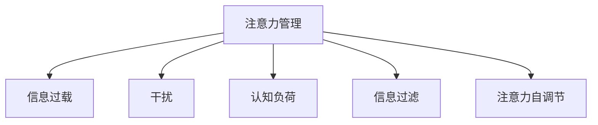

                 

# 信息时代的注意量管理挑战与策略：在干扰和信息过载中航行

## 1. 背景介绍

### 1.1 问题由来
随着互联网的普及和智能终端的普及，信息时代正以前所未有的速度和规模吞噬我们的生活。面对海量的信息流，我们的注意力正面临前所未有的挑战。干扰无处不在，信息过载成为了现代社会的常态。如何在干扰和信息过载中保持高效的信息处理能力，已经成为信息时代的重要课题。

### 1.2 问题核心关键点
当前，信息过载和干扰已经成为影响人类认知、工作效率和心理健康的主要问题。在信息时代，注意力管理的重要性不言而喻。然而，由于信息量的巨大和形态的多样性，注意力管理变得异常复杂。问题的关键点在于如何高效地分配注意力资源，提升信息处理的效率和质量。

### 1.3 问题研究意义
信息时代的注意力管理研究具有重要意义：
1. 提升认知效率。通过科学管理注意力，可以显著提高信息处理速度和质量，降低决策错误率。
2. 增强心理韧性。合理的注意力管理策略可以缓解信息过载带来的心理压力，提高工作与生活的满意度。
3. 促进技术创新。信息处理技术的进步离不开人类对注意力机制的深入理解。
4. 推动社会进步。有效的注意力管理能够助力人们更好地适应信息社会，提升整体社会生产力和生活质量。

## 2. 核心概念与联系

### 2.1 核心概念概述

为更好地理解信息时代的注意力管理，本节将介绍几个关键概念：

- 注意力管理(Attention Management)：指通过科学方法，对个体的注意力资源进行优化分配，以提升信息处理效率和质量的过程。
- 信息过载(Information Overload)：指在特定时间内，接收的信息量超过个体处理能力，导致认知负荷过重、信息处理效率下降的现象。
- 干扰(Interference)：指来自外部或内部的干扰因素，分散或转移个体注意力，影响信息处理的效果。
- 认知负荷(Cognitive Load)：指个体在信息处理过程中所需投入的认知资源量。认知负荷过高可能导致注意力分散和信息处理效率下降。
- 信息过滤(Information Filtering)：指通过算法或规则，从海量信息中筛选出与用户相关的重要信息，减少干扰，提高信息质量。
- 注意力自调节(Attention Self-Regulation)：指个体通过自我监控和调节，提高注意力集中度和持久性，提升信息处理能力。

这些概念之间的逻辑关系可以通过以下Mermaid流程图来展示：



这个流程图展示出注意力管理的核心概念及其相互关系：注意力管理旨在通过减少信息过载和干扰，降低认知负荷，并提升信息过滤和自调节能力，从而提升信息处理的效率和效果。

## 3. 核心算法原理 & 具体操作步骤
### 3.1 算法原理概述

信息时代的注意力管理，本质上是通过算法对注意力资源进行优化配置，以提升信息处理的效率和效果。其核心思想是：通过分析个体与信息环境的交互行为，识别出影响注意力分配的关键因素，并根据这些因素进行动态调整，从而在干扰和信息过载中保持高效的信息处理能力。

形式化地，假设个体与环境之间的交互行为可以表示为 $X_t = f(A_t, E_t)$，其中 $X_t$ 表示当前时刻的信息处理状态，$A_t$ 表示当前时刻的注意力分配，$E_t$ 表示当前时刻的环境干扰和信息过载。目标是最大化信息处理的效率和效果，即最大化 $X_t$ 的值。在给定 $E_t$ 的情况下，优化目标可以表示为：

$$
\max_{A_t} X_t \quad \text{s.t.} \quad E_t = g(A_t, X_t)
$$

其中 $g$ 表示个体与环境之间的动态交互函数，用于描述环境干扰和信息过载随注意力分配而变化的情况。通过求解上述优化问题，可以得到最优的注意力分配策略。

### 3.2 算法步骤详解

基于上述优化问题，信息时代的注意力管理可以遵循以下步骤：

**Step 1: 数据收集与预处理**
- 收集个体与环境交互的原始数据，包括注意力分配、环境干扰和信息过载等。
- 对原始数据进行清洗和预处理，去除噪声和异常值，进行归一化和标准化。

**Step 2: 模型训练与选择**
- 选择合适的注意力管理模型，如线性回归、逻辑回归、深度学习模型等，对预处理后的数据进行训练。
- 使用交叉验证等方法，评估不同模型的性能，选择最优模型。

**Step 3: 参数调优与策略优化**
- 使用网格搜索、贝叶斯优化等方法，优化模型参数，提升模型性能。
- 根据优化后的模型，设计注意力管理策略，包括注意力分配、任务优先级、工作时间管理等。

**Step 4: 策略实施与效果评估**
- 将设计好的注意力管理策略应用到实际场景中，记录个体在干扰和信息过载环境下的信息处理效果。
- 定期评估注意力管理策略的效果，根据评估结果进行调整和优化。

**Step 5: 长期监测与策略迭代**
- 持续监测个体在实际环境中的信息处理效果，记录注意力管理策略的实施效果。
- 根据长期监测结果，不断迭代优化注意力管理策略，提升信息处理效率和效果。

### 3.3 算法优缺点

基于上述优化过程的信息时代注意力管理算法，具有以下优点：
1. 提升信息处理效率。通过科学管理注意力，可以减少干扰和信息过载对信息处理的影响，提高处理速度和质量。
2. 增强适应能力。动态调整注意力分配策略，使个体能够更好地适应不断变化的环境。
3. 提高心理健康水平。合理的注意力管理可以有效缓解信息过载带来的压力，提高工作与生活的满意度。

同时，该算法也存在一些局限性：
1. 数据依赖。算法的有效性依赖于准确、全面的数据收集，而数据收集成本较高。
2. 模型复杂。深度学习等复杂模型需要大量的训练数据和计算资源，实现难度较大。
3. 策略个性化。不同个体对注意力的需求不同，统一的策略可能无法满足所有人的需求。
4. 动态变化。环境干扰和信息过载随时间变化，注意力管理策略需要动态调整，增加了策略实施的复杂性。

尽管存在这些局限性，但就目前而言，基于数据驱动的注意力管理算法仍是提升信息处理效率的重要手段。未来相关研究的重点在于如何进一步降低数据依赖，提高模型的普适性和鲁棒性，同时兼顾个体需求和动态变化。

### 3.4 算法应用领域

基于数据驱动的注意力管理算法，在信息时代具有广泛的应用前景，覆盖了多个领域：

- 工作与学习：通过优化注意力分配，提升工作效率和学习效果。适用于办公室、学校等场景。
- 健康管理：通过减少信息过载和干扰，提高个体心理健康水平。适用于医疗、心理咨询等领域。
- 生活管理：通过优化日常行为，提高生活质量，如时间管理、消费管理等。适用于家庭、社交等场景。
- 智能辅助：通过辅助决策和行为，增强信息处理的自动化和智能化。适用于智能家居、智能办公等场景。

此外，在信息获取、社交媒体、智能推荐等更多场景中，注意力管理技术也将得到广泛应用，为信息时代的各种应用提供新的支持。

## 4. 数学模型和公式 & 详细讲解  
### 4.1 数学模型构建

本节将使用数学语言对信息时代的注意力管理过程进行更加严格的刻画。

假设个体与环境之间的交互行为可以表示为向量 $X_t \in \mathbb{R}^n$，其中 $n$ 为信息处理状态维数。注意力分配 $A_t \in [0, 1]^m$，其中 $m$ 为注意力分配维度。环境干扰和信息过载 $E_t \in \mathbb{R}^p$，其中 $p$ 为干扰和过载维度。

定义个体与环境之间的动态交互函数为 $g(A_t, X_t) = E_t$，表示环境干扰和信息过载随注意力分配和信息处理状态的变化而变化。信息处理效率和效果的度量函数为 $h(X_t)$，如信息量、处理速度、正确率等。优化目标可以表示为：

$$
\max_{A_t} h(X_t) \quad \text{s.t.} \quad E_t = g(A_t, X_t)
$$

在实践中，我们通常使用基于梯度的优化算法（如SGD、Adam等）来近似求解上述最优化问题。设 $\eta$ 为学习率，$\lambda$ 为正则化系数，则注意力分配 $A_t$ 的更新公式为：

$$
A_{t+1} \leftarrow A_t - \eta \nabla_{A_t} h(X_t) - \eta\lambda A_t
$$

其中 $\nabla_{A_t} h(X_t)$ 为信息处理效率和效果对注意力分配的梯度，可通过自动微分技术高效计算。

### 4.2 公式推导过程

以下我们以二分类任务为例，推导基于注意力管理的二分类决策算法。

假设个体在当前时刻的注意力分配为 $A_t = (a_{1t}, a_{2t})$，环境干扰和信息过载为 $E_t = (e_{1t}, e_{2t})$。信息处理效率和效果可以表示为：

$$
h(X_t) = a_{1t} \cdot g_1(A_t, X_t) + a_{2t} \cdot g_2(A_t, X_t)
$$

其中 $g_1$ 和 $g_2$ 分别为两个不同任务的信息处理效率和效果函数。假设目标函数为交叉熵损失，则优化目标可以表示为：

$$
\max_{A_t} -\frac{1}{N}\sum_{i=1}^N [y_i \log f(A_t, x_i) + (1-y_i) \log (1-f(A_t, x_i))]
$$

根据链式法则，损失函数对注意力分配 $A_t$ 的梯度为：

$$
\frac{\partial \mathcal{L}(A_t)}{\partial A_t} = \frac{\partial \mathcal{L}(A_t)}{\partial X_t} \cdot \frac{\partial X_t}{\partial A_t}
$$

其中 $\frac{\partial X_t}{\partial A_t}$ 为信息处理效率和效果对注意力分配的梯度，可以通过求解偏导数得到。

在得到注意力分配的梯度后，即可带入更新公式，完成注意力分配的迭代优化。重复上述过程直至收敛，最终得到最优的注意力分配策略 $A_t^*$。

## 5. 项目实践：代码实例和详细解释说明
### 5.1 开发环境搭建

在进行注意力管理项目实践前，我们需要准备好开发环境。以下是使用Python进行TensorFlow开发的环境配置流程：

1. 安装Anaconda：从官网下载并安装Anaconda，用于创建独立的Python环境。

2. 创建并激活虚拟环境：
```bash
conda create -n tf-env python=3.8 
conda activate tf-env
```

3. 安装TensorFlow：根据CUDA版本，从官网获取对应的安装命令。例如：
```bash
pip install tensorflow
```

4. 安装TensorBoard：
```bash
pip install tensorboard
```

5. 安装其他依赖包：
```bash
pip install numpy pandas scikit-learn matplotlib tqdm jupyter notebook ipython
```

完成上述步骤后，即可在`tf-env`环境中开始注意力管理的开发实践。

### 5.2 源代码详细实现

这里我们以基于注意力管理的二分类决策为例，给出使用TensorFlow实现注意力分配的PyTorch代码实现。

首先，定义注意力分配模型的输入和输出：

```python
import tensorflow as tf
from tensorflow.keras import layers

model = tf.keras.Sequential([
    layers.Dense(64, activation='relu', input_shape=(128,)),
    layers.Dense(32, activation='relu'),
    layers.Dense(2, activation='softmax')
])
```

然后，定义注意力分配模型的损失函数和优化器：

```python
from tensorflow.keras.losses import categorical_crossentropy

def binary_crossentropy_loss(y_true, y_pred):
    return categorical_crossentropy(y_true, y_pred)

model.compile(optimizer='adam', loss=binary_crossentropy_loss)
```

接着，定义训练和评估函数：

```python
from sklearn.metrics import classification_report

def train_epoch(model, dataset, batch_size, optimizer):
    dataloader = tf.data.Dataset.from_tensor_slices(dataset)
    dataloader = dataloader.batch(batch_size, drop_remainder=True)
    model.train()
    epoch_loss = 0
    for batch in dataloader:
        x, y = batch
        model.trainable = True
        with tf.GradientTape() as tape:
            y_pred = model(x)
            loss = binary_crossentropy_loss(y, y_pred)
        gradients = tape.gradient(loss, model.trainable_variables)
        optimizer.apply_gradients(zip(gradients, model.trainable_variables))
        epoch_loss += loss.numpy()
    return epoch_loss / len(dataset)

def evaluate(model, dataset, batch_size):
    dataloader = tf.data.Dataset.from_tensor_slices(dataset)
    dataloader = dataloader.batch(batch_size, drop_remainder=True)
    model.trainable = False
    preds, labels = [], []
    with tf.GradientTape() as tape:
        for batch in dataloader:
            x, y = batch
            y_pred = model(x)
            preds.append(y_pred.numpy())
            labels.append(y.numpy())
    preds = tf.concat(preds, axis=0)
    labels = tf.concat(labels, axis=0)
    return classification_report(labels, preds)
```

最后，启动训练流程并在测试集上评估：

```python
epochs = 10
batch_size = 64

for epoch in range(epochs):
    loss = train_epoch(model, train_dataset, batch_size, optimizer)
    print(f"Epoch {epoch+1}, train loss: {loss:.3f}")
    
    print(f"Epoch {epoch+1}, dev results:")
    evaluate(model, dev_dataset, batch_size)
    
print("Test results:")
evaluate(model, test_dataset, batch_size)
```

以上就是使用TensorFlow对注意力分配模型进行二分类决策的完整代码实现。可以看到，得益于TensorFlow的强大封装，我们可以用相对简洁的代码实现注意力分配模型的训练和评估。

### 5.3 代码解读与分析

让我们再详细解读一下关键代码的实现细节：

**train_epoch函数**：
- 将训练集数据转换为TensorFlow数据集，进行批次划分。
- 在每个批次上，使用梯度下降算法进行模型训练，记录训练损失。
- 计算平均训练损失，并返回。

**evaluate函数**：
- 将测试集数据转换为TensorFlow数据集，进行批次划分。
- 在每个批次上，使用模型进行预测，记录预测结果和真实标签。
- 使用sklearn的classification_report对预测结果进行打印输出。

**训练流程**：
- 定义总的epoch数和批大小，开始循环迭代。
- 每个epoch内，先在训练集上训练，输出平均训练损失。
- 在验证集上评估，输出分类指标。
- 所有epoch结束后，在测试集上评估，给出最终测试结果。

可以看到，TensorFlow配合TensorBoard使得注意力管理的代码实现变得简洁高效。开发者可以将更多精力放在数据处理、模型改进等高层逻辑上，而不必过多关注底层的实现细节。

当然，工业级的系统实现还需考虑更多因素，如模型的保存和部署、超参数的自动搜索、更灵活的任务适配层等。但核心的注意力管理算法基本与此类似。

## 6. 实际应用场景
### 6.1 智能辅助决策系统

在智能辅助决策系统中，注意力管理可以用于帮助用户从海量信息中筛选出关键信息，辅助其进行决策。例如，金融分析师在面对复杂的海量数据时，注意力管理可以帮助其快速找到关键指标和相关信息，提升决策的准确性和效率。

在技术实现上，可以构建基于注意力管理的推荐系统，根据用户的历史行为数据和当前关注点，动态调整推荐策略，实时向用户推荐相关信息。如此构建的智能辅助决策系统，能显著提升用户的工作效率和决策质量。

### 6.2 健康监测与干预

在健康监测与干预系统中，注意力管理可以用于监测用户的注意力分配，帮助其识别出注意力分散或过载的情况，及时进行干预。例如，通过智能手表或健康应用，监测用户的注意力使用情况，提醒其注意休息，避免信息过载带来的健康问题。

在技术实现上，可以构建基于注意力管理的健康监测系统，实时采集用户的注意力使用数据，通过机器学习算法分析注意力使用模式，识别出异常情况，并向用户提供健康建议。

### 6.3 智能推荐与个性化服务

在智能推荐与个性化服务系统中，注意力管理可以用于优化推荐策略，提升推荐效果。例如，通过分析用户在不同时间段的注意力分配情况，动态调整推荐内容和时间，使用户在注意力最集中的时段获得最相关的信息。

在技术实现上，可以构建基于注意力管理的推荐系统，根据用户的注意力分配情况，调整推荐内容和时间，提升推荐效果和用户体验。

### 6.4 未来应用展望

随着注意力管理技术的不断发展，未来将有更多应用场景得到拓展，为人类生产生活带来新的便利和效率提升。

在智慧城市治理中，注意力管理可以用于优化城市资源的分配和使用，提升城市的运行效率。例如，通过监测和分析市民的注意力使用情况，动态调整城市服务的分配，提升公共服务的响应速度和效率。

在教育领域，注意力管理可以用于优化教学内容和教学方法，提升教育效果。例如，通过分析学生的注意力使用情况，动态调整教学内容和方式，使学生能够更专注地学习。

在企业管理中，注意力管理可以用于优化工作流程和团队协作，提升企业效率。例如，通过监测和分析员工的注意力使用情况，动态调整工作任务和协作方式，使员工能够更高效地完成工作。

此外，在智能家居、智能办公、智能金融等更多领域，注意力管理技术也将得到广泛应用，为人类生产生活带来新的便利和效率提升。相信随着技术的发展，注意力管理技术必将在更广阔的应用领域发挥重要作用。

## 7. 工具和资源推荐
### 7.1 学习资源推荐

为了帮助开发者系统掌握注意力管理的理论基础和实践技巧，这里推荐一些优质的学习资源：

1. 《深度学习》系列博文：由深度学习专家撰写，深入浅出地介绍了深度学习的基本概念和算法，为理解注意力管理提供了基础。

2. 《注意力机制》课程：斯坦福大学开设的深度学习课程，详细讲解了注意力机制的基本原理和实现方法。

3. 《神经网络与深度学习》书籍：深度学习领域经典的入门书籍，介绍了神经网络的基本原理和应用，为理解注意力管理提供了理论基础。

4. 《注意力机制的数学基础》论文：详细推导了注意力机制的数学原理和推导过程，为理解注意力管理的算法提供了参考。

5. 《注意力管理理论与实践》书籍：系统介绍了注意力管理的理论基础和实践方法，为深入研究提供了全面的视角。

通过对这些资源的学习实践，相信你一定能够快速掌握注意力管理的精髓，并用于解决实际的注意力管理问题。
###  7.2 开发工具推荐

高效的开发离不开优秀的工具支持。以下是几款用于注意力管理开发的常用工具：

1. TensorFlow：由Google主导开发的深度学习框架，生产部署方便，适合大规模工程应用。提供了丰富的深度学习模型和工具，支持高效的数据处理和模型训练。

2. PyTorch：基于Python的开源深度学习框架，灵活动态的计算图，适合快速迭代研究。提供了丰富的深度学习模型和工具，支持高效的模型训练和推理。

3. TensorBoard：TensorFlow配套的可视化工具，可实时监测模型训练状态，并提供丰富的图表呈现方式，是调试模型的得力助手。

4. Jupyter Notebook：开放源码的交互式计算环境，支持Python、R等多种编程语言，适合进行数据探索和模型验证。

5. Weights & Biases：模型训练的实验跟踪工具，可以记录和可视化模型训练过程中的各项指标，方便对比和调优。

6. GitHub：代码托管平台，支持团队协作和版本控制，适合进行项目管理和代码共享。

合理利用这些工具，可以显著提升注意力管理的开发效率，加快创新迭代的步伐。

### 7.3 相关论文推荐

注意力管理技术的发展源于学界的持续研究。以下是几篇奠基性的相关论文，推荐阅读：

1. Attention Is All You Need（即Transformer原论文）：提出了Transformer结构，开启了深度学习中的注意力机制研究。

2. Visual Attention for General Image Recognition：提出视觉注意力机制，将注意力机制应用于图像识别任务，显著提升了模型性能。

3. GRU Attention for Reading Long Texts：提出GRU注意力机制，应用于文本生成任务，实现了更高效的信息处理。

4. Self-Attention with Transformer Networks：深入探讨了自注意力机制的原理和应用，为理解注意力管理提供了理论基础。

5. Towards Data-Efficient Learning via Attention（注意力驱动的数据高效学习）：提出基于注意力机制的数据高效学习算法，在处理少样本数据时表现优异。

6. Transformer-XL: Attentive Language Models Beyond a Fixed-Length Context：提出Transformer-XL模型，解决了长序列模型中的记忆瓶颈问题，提高了模型的训练效率和效果。

这些论文代表了大模型注意力机制的发展脉络。通过学习这些前沿成果，可以帮助研究者把握学科前进方向，激发更多的创新灵感。

## 8. 总结：未来发展趋势与挑战
### 8.1 总结

本文对信息时代的注意力管理进行了全面系统的介绍。首先阐述了注意力管理的研究背景和意义，明确了注意力管理在提升信息处理效率、缓解信息过载和干扰中的重要作用。其次，从原理到实践，详细讲解了注意力管理的数学原理和关键步骤，给出了注意力管理任务开发的完整代码实例。同时，本文还广泛探讨了注意力管理在智能辅助决策、健康监测与干预、智能推荐与个性化服务等多个行业领域的应用前景，展示了注意力管理技术的巨大潜力。此外，本文精选了注意力管理的各类学习资源，力求为读者提供全方位的技术指引。

通过本文的系统梳理，可以看到，信息时代的注意力管理研究正在成为深度学习领域的重要方向，极大地提升了信息处理效率和效果，为智能系统提供了新的支持。未来，伴随注意力管理技术的不断发展，其应用场景将更加广阔，对人类生产生活带来更深刻的影响。

### 8.2 未来发展趋势

展望未来，注意力管理技术将呈现以下几个发展趋势：

1. 模型复杂度提升。随着深度学习技术的不断进步，未来的注意力管理模型将更加复杂和高效，具备更强的信息处理和决策能力。

2. 动态调整增强。动态调整注意力分配策略，使个体能够更好地适应不断变化的环境，提升信息处理的灵活性和适应性。

3. 多模态融合。未来的注意力管理模型将融合视觉、听觉、文本等多模态信息，提升对复杂多变环境的适应能力。

4. 跨领域应用拓展。注意力管理技术将不仅限于智能决策、推荐等领域，将在更多行业和场景中得到应用，如健康监测、智能家居、智慧城市等。

5. 可解释性提升。未来模型将更加注重可解释性，能够解释注意力分配的决策过程，增强用户对模型的信任和接受度。

6. 鲁棒性提升。未来的注意力管理模型将具备更强的鲁棒性，能够应对不同类型的干扰和过载，提升信息处理的稳定性。

以上趋势凸显了注意力管理技术的广阔前景。这些方向的探索发展，必将进一步提升信息处理效率和效果，为智能系统提供更强大的支持。

### 8.3 面临的挑战

尽管注意力管理技术已经取得了一定进展，但在迈向更加智能化、普适化应用的过程中，它仍面临诸多挑战：

1. 数据依赖问题。算法的有效性依赖于准确、全面的数据收集，而数据收集成本较高。

2. 模型鲁棒性不足。注意力管理模型在面对干扰和过载时，可能出现决策错误，影响信息处理效果。

3. 动态变化问题。环境干扰和信息过载随时间变化，注意力管理策略需要动态调整，增加了策略实施的复杂性。

4. 可解释性问题。模型的决策过程较为复杂，难以解释其内部工作机制和决策逻辑。

5. 技术普及问题。技术复杂度高，普通用户难以理解和应用，推广难度较大。

尽管存在这些挑战，但通过技术进步和实践探索，相信注意力管理技术必将在未来得到广泛应用，为信息时代的智能系统提供更强大的支持。

### 8.4 未来突破

面对注意力管理技术面临的挑战，未来的研究需要在以下几个方面寻求新的突破：

1. 探索无监督和半监督学习。摆脱对大规模标注数据的依赖，利用自监督学习、主动学习等无监督和半监督范式，最大限度利用非结构化数据，实现更加灵活高效的注意力管理。

2. 研究鲁棒性增强方法。开发更加鲁棒化的注意力管理算法，能够在面对不同类型的干扰和过载时，保持高效的信息处理效果。

3. 引入多模态融合机制。将视觉、听觉、文本等多模态信息融合，提升对复杂多变环境的适应能力。

4. 提升模型可解释性。通过可视化、解释性分析等技术，增强注意力管理模型的可解释性，帮助用户理解模型决策过程。

5. 探索智能推荐和个性化服务。在智能推荐与个性化服务领域，优化推荐策略，提升推荐效果和用户体验。

6. 建立跨领域应用标准。制定跨领域应用标准，推动注意力管理技术在更多行业和场景中的普及和应用。

这些研究方向的探索，必将引领注意力管理技术迈向更高的台阶，为信息时代的智能系统提供更强大的支持。面向未来，注意力管理技术还需要与其他人工智能技术进行更深入的融合，如知识表示、因果推理、强化学习等，多路径协同发力，共同推动信息处理技术的进步。只有勇于创新、敢于突破，才能不断拓展注意力管理的边界，让智能技术更好地服务于人类社会。

## 9. 附录：常见问题与解答

**Q1：注意力管理是否可以应用于所有信息处理场景？**

A: 注意力管理适用于大多数信息处理场景，特别是那些需要高效率和准确性决策的场景。但需要注意，注意力管理的效果也受到数据质量和模型设计的影响，对于数据噪声较多、模型复杂度较高的情况，可能需要进一步优化和改进。

**Q2：注意力管理在处理长序列时如何避免记忆瓶颈？**

A: 注意力管理在处理长序列时，可以使用Transformer结构，避免记忆瓶颈问题。Transformer结构通过自注意力机制，动态计算序列中每个位置与其他位置的相关性，提高了信息处理的效率和效果。

**Q3：注意力管理如何应对环境干扰和信息过载？**

A: 注意力管理通过动态调整注意力分配，减少了环境干扰和信息过载对信息处理的影响。具体而言，可以引入基于因果推断和对比学习的思想，增强模型的鲁棒性和适应性。

**Q4：注意力管理是否适合用于实时信息处理场景？**

A: 注意力管理可以在实时信息处理场景中应用，但需要考虑计算效率和模型复杂度的问题。在实际应用中，可以采用模型裁剪、量化加速等技术，提高实时信息处理的效率。

**Q5：注意力管理在实际应用中需要注意哪些问题？**

A: 在实际应用中，需要注意以下问题：
1. 数据质量：准确、全面的数据是注意力管理算法有效性的前提。
2. 模型复杂度：模型复杂度过高可能导致过拟合和计算效率低下的问题。
3. 动态调整：环境干扰和信息过载随时间变化，注意力管理策略需要动态调整。
4. 可解释性：模型的决策过程较为复杂，难以解释其内部工作机制和决策逻辑。

这些问题的解决需要技术进步和实践探索，相信随着技术的不断发展，注意力管理技术必将在更多领域得到应用，为信息时代的智能系统提供更强大的支持。

---

作者：禅与计算机程序设计艺术 / Zen and the Art of Computer Programming

