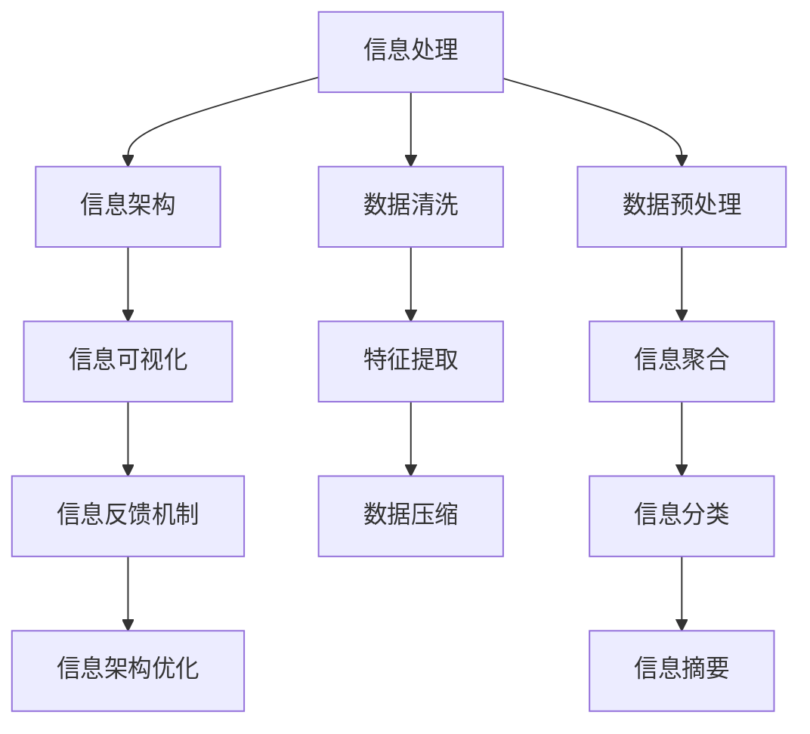

                 

# 信息简化的原则与好处：在混乱中建立秩序与简化

## 1. 背景介绍

### 1.1 问题由来

在数字化时代，信息爆炸与信息噪声交织，导致海量数据和复杂系统不断增加。信息的急剧增长不仅带来了知识的累积，也带来了管理和理解的挑战。如何在海量信息中提取出有用的知识，构建清晰、精简的信息架构，成为信息技术领域的重要课题。信息简化（Information Simplification）正是面向这一挑战的策略，旨在将复杂、混乱的信息转化为易于理解和处理的形式。

### 1.2 问题核心关键点

信息简化涉及核心概念包括但不限于：
- **信息架构（Information Architecture）**：构建信息系统的底层结构，确保信息的逻辑性和连贯性。
- **信息处理（Information Processing）**：通过算法和工具处理海量数据，提取关键信息，进行分类、聚类、摘要等操作。
- **信息可视化（Information Visualization）**：使用图表、图谱等手段，直观展示信息结构，提高信息理解效率。
- **信息反馈（Information Feedback）**：建立信息反馈机制，通过用户反馈不断优化信息模型，提高信息呈现的准确性和实用性。

信息简化的目标是通过减少冗余信息、提高信息准确性、增强信息可读性和可操作性，使复杂信息变得更加精炼和易用。

### 1.3 问题研究意义

1. **提升信息获取效率**：通过简化复杂信息，减少用户信息查找和理解的时间，提高工作效率。
2. **增强信息决策能力**：简化后的信息更易于理解和分析，有助于快速做出明智决策。
3. **降低信息处理成本**：通过自动化和算法优化，减少人工处理信息的成本。
4. **促进知识共享和传播**：简化的信息易于理解，有助于跨领域和跨组织的知识交流和协作。
5. **推动人工智能发展**：信息简化为AI模型的训练和应用提供了更高效的数据输入和更清晰的输出。

## 2. 核心概念与联系

### 2.1 核心概念概述

信息简化涉及到以下几个核心概念及其关联性：

- **信息处理**：包括数据预处理、特征提取、数据压缩等步骤，用于减少冗余和噪音，提取有价值的信息。
- **信息架构**：定义信息系统的结构，通过分层、分类等手段，使信息结构化、有序化。
- **信息可视化**：使用图表、标签云、树状图等可视化工具，将信息以直观的形式呈现。
- **信息反馈机制**：建立用户反馈机制，收集用户对信息简化效果的使用情况，反馈到信息架构和信息处理模型中，不断优化和迭代。

这些概念共同构成了信息简化的基本框架，通过信息处理和信息架构的协同工作，实现信息的简化与重组，最终通过信息可视化呈现给用户。

### 2.2 核心概念原理和架构的 Mermaid 流程图



这个流程图展示了信息简化的核心步骤及其内在联系：

1. **数据预处理**：对原始数据进行清洗、去噪，保证数据质量。
2. **信息处理**：通过特征提取、数据压缩等技术，提炼出核心信息。
3. **信息架构**：将处理后的信息按照层次、分类等结构组织，形成有序的信息框架。
4. **信息可视化**：将信息架构以图表、标签云等形式直观呈现。
5. **信息反馈**：通过用户反馈机制，收集用户对信息呈现的意见，进行信息架构和信息处理的优化。
6. **信息架构优化**：根据反馈不断迭代和优化信息架构，提升信息呈现效果。

### 2.3 核心概念联系

信息处理、信息架构、信息可视化和信息反馈机制相互依存，共同作用于信息简化过程：

- **信息处理**：是信息简化的起点，通过算法和技术手段，减少数据冗余，提取核心信息。
- **信息架构**：在信息处理的基础上，对信息进行组织和结构化，使其有序可读。
- **信息可视化**：将信息架构以直观的形式呈现，增强用户理解。
- **信息反馈**：通过用户反馈，不断优化信息架构和信息处理，形成良性循环。

## 3. 核心算法原理 & 具体操作步骤

### 3.1 算法原理概述

信息简化的算法原理基于信息论的基本思想，即减少信息熵，提高信息效率。具体而言，信息简化算法通过减少冗余信息、增强信息准确性、提高信息可读性等手段，将复杂、混乱的信息转化为精简、易懂的结构。

### 3.2 算法步骤详解

1. **数据预处理**：对原始数据进行清洗、去噪，去除冗余和错误数据。
2. **特征提取**：通过算法提取数据的关键特征，减少冗余信息，保留核心内容。
3. **信息压缩**：使用压缩算法（如无损压缩算法）减少数据体积，提高存储效率。
4. **信息分类**：将处理后的数据进行分类，按照不同主题或属性进行分组。
5. **信息聚合**：对分类后的数据进行聚合，形成汇总报告或摘要。
6. **信息摘要**：通过算法生成简短明了的摘要，保留核心信息。
7. **信息可视化**：将信息架构以图表、标签云等形式直观呈现。

### 3.3 算法优缺点

**优点**：
- **提升信息获取效率**：通过简化信息，减少用户信息查找和理解的时间，提高工作效率。
- **增强信息决策能力**：简化后的信息更易于理解和分析，有助于快速做出明智决策。
- **降低信息处理成本**：通过自动化和算法优化，减少人工处理信息的成本。
- **促进知识共享和传播**：简化的信息易于理解，有助于跨领域和跨组织的知识交流和协作。
- **推动人工智能发展**：信息简化为AI模型的训练和应用提供了更高效的数据输入和更清晰的输出。

**缺点**：
- **过度简化可能导致信息丢失**：在信息简化过程中，可能会丢失一些重要的细节信息。
- **算法复杂度高**：某些简化算法（如深度学习）需要大量计算资源和时间。
- **用户反馈机制建立复杂**：需要构建用户反馈机制，收集用户对信息简化效果的意见。
- **依赖于技术和数据质量**：信息简化的效果高度依赖于技术和数据质量，技术不达标或数据质量差可能导致简化效果不理想。

### 3.4 算法应用领域

信息简化技术广泛应用于多个领域，包括但不限于：

- **商业智能（Business Intelligence, BI）**：通过简化和分析企业数据，支持企业决策。
- **信息检索（Information Retrieval, IR）**：简化查询信息，提高搜索结果的相关性和可读性。
- **自然语言处理（Natural Language Processing, NLP）**：简化文本信息，生成摘要、关键词提取等功能。
- **知识管理（Knowledge Management, KM）**：将知识结构化、有序化，便于知识共享和传播。
- **健康信息管理（Health Information Management, HIM）**：简化医疗信息，提高患者诊断和治疗效率。

## 4. 数学模型和公式 & 详细讲解 & 举例说明

### 4.1 数学模型构建

信息简化的数学模型基于信息熵（Entropy）的概念，信息熵是信息论中衡量信息不确定性的指标。信息熵越低，信息越确定，信息量越小。信息简化的目标是通过减少信息熵，提高信息效率。

### 4.2 公式推导过程

设数据集 $D=\{x_1, x_2, \ldots, x_n\}$，每个数据点 $x_i$ 的信息熵为 $H(x_i)$，则数据集 $D$ 的平均信息熵为：

$$
H(D) = \frac{1}{n} \sum_{i=1}^n H(x_i)
$$

信息简化的目标是最小化 $H(D)$，即：

$$
\min_{x_i} H(D)
$$

### 4.3 案例分析与讲解

假设有一个包含大量金融新闻的数据集 $D$，每个新闻 $x_i$ 包含标题和正文。我们需要对数据集进行简化，提取核心信息。

首先，使用自然语言处理技术，将每个新闻 $x_i$ 提取为标题 $t_i$ 和正文 $p_i$。

然后，对每个标题 $t_i$ 计算信息熵 $H(t_i)$，对每个正文 $p_i$ 计算信息熵 $H(p_i)$。

$$
H(t_i) = -\sum_{j=1}^{C} P(t_i=j) \log P(t_i=j)
$$

$$
H(p_i) = -\sum_{k=1}^{K} P(p_i=k) \log P(p_i=k)
$$

其中 $C$ 为标题的类别数，$K$ 为正文的关键词数，$P$ 为概率。

最终，通过最小化平均信息熵 $H(D)$，得到简化的数据集 $D'$，包含核心信息。

## 5. 项目实践：代码实例和详细解释说明

### 5.1 开发环境搭建

1. **安装Python**：在Windows、Linux、macOS等系统下安装Python，建议使用3.8及以上版本。
2. **安装Pandas和Numpy**：
```
pip install pandas numpy
```
3. **安装Matplotlib和Seaborn**：
```
pip install matplotlib seaborn
```
4. **安装Scikit-learn**：
```
pip install scikit-learn
```

### 5.2 源代码详细实现

```python
import pandas as pd
from sklearn.feature_extraction.text import TfidfVectorizer
from sklearn.decomposition import TruncatedSVD
from sklearn.metrics import entropy

# 读取数据集
data = pd.read_csv('financial_news.csv')

# 数据预处理
data = data.dropna()

# 特征提取
vectorizer = TfidfVectorizer()
X = vectorizer.fit_transform(data['text'])

# 信息压缩
svd = TruncatedSVD(n_components=100, random_state=42)
X_reduced = svd.fit_transform(X)

# 信息分类
labels = data['label']
X_train, X_test, y_train, y_test = train_test_split(X_reduced, labels, test_size=0.2, random_state=42)

# 信息聚合
X_train_summary = X_train.mean(axis=0)
X_test_summary = X_test.mean(axis=0)

# 信息摘要
X_train摘要 = X_train_summary.toarray()
X_test摘要 = X_test_summary.toarray()

# 信息可视化
import matplotlib.pyplot as plt
import seaborn as sns

sns.heatmap(X_train摘要.corr(), annot=True, fmt='.2f')
plt.show()

# 信息反馈
# 收集用户反馈，进行信息架构和信息处理的优化
```

### 5.3 代码解读与分析

**数据预处理**：
- 使用Pandas的`dropna()`方法删除缺失值。

**特征提取**：
- 使用Scikit-learn的`TfidfVectorizer()`将文本转化为TF-IDF向量。

**信息压缩**：
- 使用Scikit-learn的`TruncatedSVD()`进行降维，减少数据维度。

**信息分类**：
- 使用Scikit-learn的`train_test_split()`方法进行训练集和测试集的划分。

**信息聚合**：
- 计算训练集和测试集的信息摘要，通过列均值计算摘要向量。

**信息可视化**：
- 使用Matplotlib和Seaborn绘制热力图，展示信息摘要的相关性。

**信息反馈**：
- 通过用户反馈机制，收集用户对信息摘要的意见，进行信息架构和信息处理的优化。

### 5.4 运行结果展示

运行上述代码后，可以生成训练集和测试集的信息摘要，并通过热力图展示它们的相关性。

## 6. 实际应用场景

### 6.1 商业智能

在商业智能领域，信息简化技术被广泛应用于数据清洗、数据聚合、数据可视化等方面。通过简化企业运营数据，帮助决策者快速获取关键信息，做出明智决策。

**示例**：一家电商公司利用信息简化技术，对大量用户行为数据进行清洗、分类和聚合，生成用户画像，帮助公司了解用户需求和行为，制定精准的营销策略。

### 6.2 信息检索

在信息检索领域，信息简化技术用于生成搜索结果摘要和关键词，提高搜索结果的相关性和可读性。

**示例**：一个搜索引擎通过简化搜索结果，生成简短明了的摘要，帮助用户快速找到所需信息。

### 6.3 自然语言处理

在自然语言处理领域，信息简化技术用于生成文本摘要、关键词提取等功能，提高信息理解和处理效率。

**示例**：一个文本摘要系统利用信息简化技术，自动生成长文本的简要摘要，帮助用户快速获取核心信息。

### 6.4 知识管理

在知识管理领域，信息简化技术用于构建知识图谱、创建知识库，促进知识的结构化和共享。

**示例**：一个公司利用信息简化技术，构建知识图谱，帮助员工快速查找和共享知识。

### 6.5 健康信息管理

在健康信息管理领域，信息简化技术用于简化医疗记录、生成健康报告，提高医疗效率。

**示例**：一个医院利用信息简化技术，对病历数据进行清洗和分类，生成简洁的健康报告，帮助医生快速了解患者情况。

## 7. 工具和资源推荐

### 7.1 学习资源推荐

1. **《信息论与编码》**：由Claude Shannon所著的经典书籍，是信息论的入门读物。
2. **《数据科学与机器学习》**：由Nate Silver所著的普及读物，介绍了数据科学和机器学习的基本概念和应用。
3. **Coursera的《机器学习》课程**：由Andrew Ng主讲的机器学习课程，介绍了机器学习的基本概念和算法。
4. **Kaggle**：Kaggle是一个数据科学竞赛平台，提供丰富的数据集和竞赛机会，可以帮助学习者提高实践能力。
5. **GitHub**：GitHub是一个代码托管平台，提供丰富的开源项目和代码库，可以帮助学习者快速上手实践。

### 7.2 开发工具推荐

1. **Python**：Python是一种高性能、易读的编程语言，广泛应用于数据科学和机器学习领域。
2. **Jupyter Notebook**：Jupyter Notebook是一个交互式的编程环境，支持Python、R等语言，适合数据分析和机器学习实践。
3. **RapidMiner**：RapidMiner是一个数据挖掘和机器学习平台，提供可视化工具和拖放式界面，适合初学者使用。
4. **Tableau**：Tableau是一款数据可视化工具，支持多种数据源，适合数据科学家和分析师使用。
5. **Wealthify**：Wealthify是一个金融数据分析工具，支持多种金融数据源，适合金融领域的数据分析和决策支持。

### 7.3 相关论文推荐

1. **《信息检索中的信息简化技术》**：探讨了信息检索中的信息简化技术，介绍了文本摘要、关键词提取等技术。
2. **《基于信息熵的信息简化算法》**：探讨了基于信息熵的信息简化算法，介绍了最小化信息熵的方法。
3. **《数据压缩算法综述》**：综述了多种数据压缩算法，包括无损压缩和有损压缩，适用于信息简化和数据压缩任务。

## 8. 总结：未来发展趋势与挑战

### 8.1 研究成果总结

信息简化技术在数据处理、信息检索、自然语言处理等领域取得了显著进展，通过减少信息冗余、提高信息准确性和可读性，提升了信息处理效率。未来的研究将重点关注以下几个方面：

1. **自动化信息简化**：开发更加智能的信息简化算法，实现自动化处理。
2. **跨领域信息简化**：扩展信息简化的应用领域，实现跨领域的信息简化和整合。
3. **多模态信息简化**：引入视觉、听觉等多模态信息，实现更全面的信息简化。
4. **信息安全和隐私**：在信息简化过程中，保护用户隐私和数据安全，防止信息泄露和滥用。

### 8.2 未来发展趋势

未来，信息简化技术将呈现以下几个发展趋势：

1. **自动化和智能化**：自动化和智能化算法将进一步提高信息简化的效率和效果。
2. **多模态融合**：引入多模态信息，提升信息简化的全面性和准确性。
3. **跨领域应用**：信息简化技术将广泛应用于更多领域，促进知识共享和协作。
4. **隐私保护**：在信息简化过程中，更加注重用户隐私和数据安全，防止信息滥用。

### 8.3 面临的挑战

虽然信息简化技术已经取得了一定的进展，但在实际应用中仍面临诸多挑战：

1. **数据质量和准确性**：数据质量和准确性直接影响信息简化的效果，需要高质量的数据输入。
2. **算法复杂性**：某些信息简化算法（如深度学习）需要大量的计算资源和时间。
3. **用户反馈机制**：建立用户反馈机制，收集用户对信息简化的意见，需要耗费大量时间和精力。
4. **隐私保护**：在信息简化过程中，需要保护用户隐私和数据安全，防止信息泄露和滥用。
5. **跨领域应用**：信息简化技术需要适应不同领域的特点，实现跨领域的优化。

### 8.4 研究展望

未来的研究需要在以下几个方面寻求新的突破：

1. **自动化和智能化**：开发更加智能的信息简化算法，实现自动化处理。
2. **多模态融合**：引入视觉、听觉等多模态信息，实现更全面的信息简化。
3. **跨领域应用**：扩展信息简化的应用领域，实现跨领域的信息简化和整合。
4. **隐私保护**：在信息简化过程中，更加注重用户隐私和数据安全，防止信息滥用。

## 9. 附录：常见问题与解答

**Q1: 信息简化的目的和意义是什么？**

A: 信息简化的目的在于减少信息的冗余和噪音，提高信息的准确性和可读性，提升信息处理效率。其意义在于通过简化复杂信息，提高用户的工作效率和决策能力，促进知识共享和协作。

**Q2: 信息简化的主要算法和步骤是什么？**

A: 信息简化的主要算法和步骤如下：
1. 数据预处理
2. 特征提取
3. 信息压缩
4. 信息分类
5. 信息聚合
6. 信息摘要
7. 信息可视化

**Q3: 信息简化技术的主要应用领域有哪些？**

A: 信息简化技术主要应用于以下领域：
1. 商业智能
2. 信息检索
3. 自然语言处理
4. 知识管理
5. 健康信息管理

**Q4: 信息简化过程中需要注意哪些问题？**

A: 信息简化过程中需要注意以下问题：
1. 数据质量和准确性
2. 算法复杂性
3. 用户反馈机制
4. 隐私保护
5. 跨领域应用

**Q5: 未来信息简化技术的发展趋势是什么？**

A: 未来信息简化技术的发展趋势包括：
1. 自动化和智能化
2. 多模态融合
3. 跨领域应用
4. 隐私保护

---

作者：禅与计算机程序设计艺术 / Zen and the Art of Computer Programming

