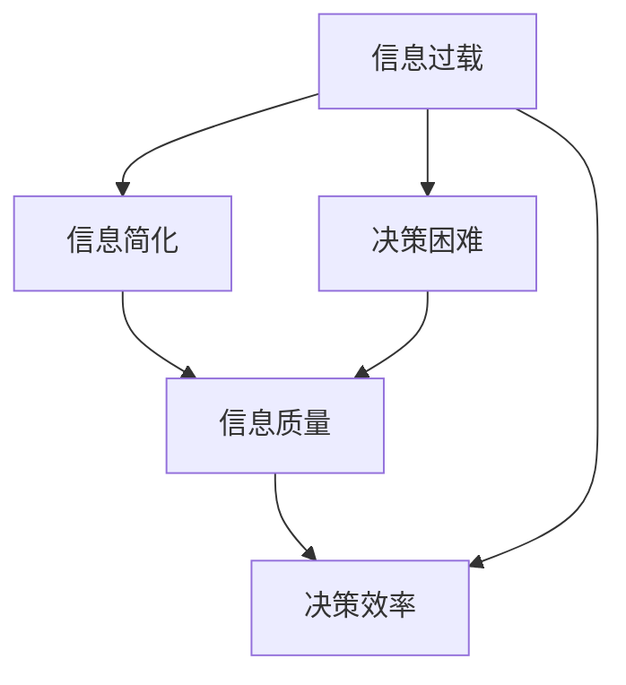

                 

# 信息简化的好处：在复杂世界中简化以改善决策和效率

## 1. 背景介绍

### 1.1 问题由来

在信息爆炸的今天，我们每天都面临海量信息的冲击，诸如新闻、社交媒体、报告、邮件等。虽然信息丰富，但常常导致决策过程复杂化、效率低下、甚至是信息过载。如何在繁杂的信息中提取关键点、简化信息，以高效决策成为现代社会的重大需求。

### 1.2 问题核心关键点

1. **信息过载与决策困难**：过量的信息可能导致人们无法高效处理，从而影响决策的准确性和及时性。
2. **信息质量与决策可靠性**：质量不高的信息可能误导决策，高质量信息虽重要，但成本高、获取难度大。
3. **信息简化与决策效率**：简化信息，可以更快、更准确地做出决策，提高决策效率和质量。
4. **信息获取与利用方式**：如何有效、高效地获取和利用信息，也是提升决策效率的重要环节。

## 2. 核心概念与联系

### 2.1 核心概念概述

为深入理解信息简化如何改善决策和效率，我们先明确几个核心概念：

- **信息简化**：从繁杂的信息中提取关键点，去除无关内容，使得信息更加易于理解和处理。
- **决策过程**：从信息输入到决策输出的过程，包括数据收集、信息处理、决策制定和执行等环节。
- **信息质量**：信息的准确性、完整性、时效性和相关性，影响决策的正确性和可靠性。
- **信息检索**：从海量信息中快速检索出有价值的信息，是信息简化的重要环节。

这些概念之间的逻辑关系可以通过以下Mermaid流程图来展示：



这个流程图展示了信息简化与决策过程的关键关联：

1. 信息过载是决策困难的原因。
2. 信息简化能显著提升信息质量。
3. 高信息质量有助于高效决策。

## 3. 核心算法原理 & 具体操作步骤

### 3.1 算法原理概述

信息简化算法主要利用人工智能和自然语言处理技术，从大量文本中提取关键信息，去除无关内容。核心原理基于以下两点：

1. **自然语言处理技术**：通过分词、命名实体识别、句法分析等技术，对文本进行结构化处理，提取重要元素。
2. **机器学习算法**：通过训练模型，学习哪些信息更可能对决策有帮助，从而进行筛选和简化。

### 3.2 算法步骤详解

以下详细介绍信息简化的核心算法步骤：

**Step 1: 数据预处理**
- 收集和整理需要简化的信息源，如新闻报道、市场分析、研究报告等。
- 对原始数据进行去重、清洗、分词、停用词过滤等预处理。

**Step 2: 特征提取**
- 利用TF-IDF、词频、词向量化等方法，提取文本中的关键特征。
- 通过自然语言处理技术，识别关键词、命名实体等关键信息。

**Step 3: 模型训练**
- 选择合适的机器学习模型，如逻辑回归、支持向量机、深度学习模型等，用于训练数据。
- 对模型进行参数调优，选择最合适的算法和参数。

**Step 4: 信息筛选**
- 利用训练好的模型，对信息进行筛选和排序，保留高质量、相关性高的信息。
- 使用阈值或评分机制，确定保留信息的优先级。

**Step 5: 信息呈现**
- 将简化后的信息以易于理解的方式呈现给决策者。
- 通过可视化的图表、摘要等方式，使得复杂的信息更易理解。

### 3.3 算法优缺点

信息简化算法主要优点包括：

- **高效性**：自动化处理大量信息，显著提高处理速度。
- **准确性**：机器学习模型通过训练可以识别重要信息，提高筛选的准确性。
- **易用性**：算法输出易于理解和使用，方便决策者快速获得关键信息。

同时，算法也存在一些缺点：

- **数据质量依赖**：算法的输出质量高度依赖于输入数据的质量。
- **模型泛化能力**：模型对特定领域的适应能力可能有限，需要针对不同领域进行调整。
- **误识别风险**：机器学习模型可能误识别关键信息，导致决策失误。
- **资源消耗**：预处理和模型训练需要计算资源，对于小规模数据可能不经济。

### 3.4 算法应用领域

信息简化算法在多个领域都有广泛应用，例如：

- **商业决策**：通过分析市场数据、客户反馈等，简化信息辅助高层决策。
- **政策制定**：从海量文献中提取关键数据，辅助政策研究和制定。
- **法律分析**：从法律文档和案例中提取关键信息，支持法律咨询和案例研究。
- **健康医疗**：从大量病历中提取关键症状和诊断信息，辅助医生诊断和治疗。
- **安全监测**：从日志数据中提取关键事件和异常行为，提高安全监测效率。

## 4. 数学模型和公式 & 详细讲解 & 举例说明

### 4.1 数学模型构建

信息简化的数学模型主要基于文本处理和机器学习框架。以TF-IDF为例，构建信息简化的基本数学模型：

1. **文本向量化**：将文本转换为向量表示。例如，使用词袋模型或TF-IDF模型将文本转换为向量。
   $$
   x_i = \text{vector}(t_i)
   $$

2. **特征加权**：对每个词向量进行加权，计算其在整个文档中的重要性。
   $$
   x_i = w_i \cdot x_i
   $$

3. **模型训练**：使用机器学习模型（如逻辑回归、SVM等）对特征向量进行训练，学习权重。
   $$
   \theta = \mathop{\arg\min}_{\theta} \frac{1}{N}\sum_{i=1}^N \ell(y_i, M(x_i; \theta))
   $$

其中 $y_i$ 为标签，$M(x_i; \theta)$ 为模型输出，$\ell$ 为损失函数。

### 4.2 公式推导过程

以下以TF-IDF模型为例，推导其计算公式：

**TF-IDF计算公式**：
$$
TF_{ij} = \frac{c_i}{\sum_{k=1}^{n} c_k}, \quad IDF_{ij} = \log\frac{N}{c_i+1}, \quad TF-IDF_{ij} = TF_{ij} \cdot IDF_{ij}
$$

- **词频**（Term Frequency, TF）：
  $$
  TF_{ij} = \frac{c_i}{\sum_{k=1}^{n} c_k}
  $$
  其中 $c_i$ 为单词 $i$ 在文档 $j$ 中出现的次数。

- **逆文档频率**（Inverse Document Frequency, IDF）：
  $$
  IDF_{ij} = \log\frac{N}{c_i+1}
  $$
  其中 $N$ 为文档总数，$c_i$ 为单词 $i$ 出现的文档数。

- **TF-IDF**：
  $$
  TF-IDF_{ij} = TF_{ij} \cdot IDF_{ij}
  $$

**特征向量的计算**：
$$
x_j = (TF-IDF_{ij})
$$

**训练模型的损失函数**：
$$
\mathcal{L}(\theta) = \frac{1}{N}\sum_{i=1}^N \ell(y_i, M(x_i; \theta))
$$

通过训练模型 $\theta$，可以得到最终的权重向量。

### 4.3 案例分析与讲解

以金融市场分析为例，展示信息简化的具体应用：

**数据集准备**：收集金融市场的历史数据、新闻报道、公司财报等。

**预处理**：清洗数据，去除噪声，分词和去停用词，提取关键词。

**特征提取**：计算TF-IDF值，筛选出权重高的关键词和短语。

**模型训练**：训练SVM模型，学习哪些特征对决策更有帮助。

**信息简化**：筛选出高权重信息，生成简化的摘要和报告。

**结果呈现**：以可视化的方式呈现简化后的信息，辅助高层决策。

## 5. 项目实践：代码实例和详细解释说明

### 5.1 开发环境搭建

进行信息简化项目开发，首先需要搭建好Python开发环境。以下是搭建环境的具体步骤：

1. **安装Python**：从官网下载并安装Python 3.x版本。
2. **安装Pip**：在Python安装路径下运行 `python -m ensurepip --default-pip` 安装pip。
3. **安装必要的库**：使用pip安装必要的库，如NLTK、Scikit-Learn、TensorFlow等。

### 5.2 源代码详细实现

以下是一个简单的信息简化的Python代码实现，以TF-IDF模型为例：

```python
import nltk
from sklearn.feature_extraction.text import TfidfVectorizer
from sklearn.model_selection import train_test_split
from sklearn.svm import SVC

# 数据预处理
# 假设已经准备好原始数据集data，其中每个元素是一个文档
data = ...

# 分词和去除停用词
tokenizer = nltk.WordNetLemmatizer()
stop_words = set(nltk.corpus.stopwords.words('english'))

def preprocess(text):
    tokens = tokenizer.tokenize(text.lower())
    tokens = [token for token in tokens if token not in stop_words]
    return ' '.join(tokens)

data = [preprocess(doc) for doc in data]

# 特征提取
vectorizer = TfidfVectorizer()
X = vectorizer.fit_transform(data)

# 训练模型
X_train, X_test, y_train, y_test = train_test_split(X, labels, test_size=0.2)
clf = SVC(kernel='linear')
clf.fit(X_train, y_train)

# 信息筛选
pred = clf.predict(X_test)

# 输出简化后的信息
top_n = 10
for i, doc in enumerate(data):
    if pred[i] == 1:
        print(doc[:top_n])
```

### 5.3 代码解读与分析

**数据预处理**：
- 使用NLTK库进行分词和去除停用词。
- 将所有文档转换为小写，并去除停用词。

**特征提取**：
- 使用TF-IDF模型对文本进行向量化。
- 计算每个文档的TF-IDF向量。

**模型训练**：
- 使用SVM模型训练数据。
- 对模型进行交叉验证，划分训练集和测试集。

**信息筛选**：
- 利用训练好的模型对测试集进行分类。
- 筛选出分类为正例的信息。

**结果输出**：
- 输出最相关的文档内容。

## 6. 实际应用场景

### 6.1 商业决策支持

在商业决策中，信息简化的应用可以显著提高决策效率和准确性。例如，企业可以使用信息简化的算法处理大量市场数据，提取出关键的销售趋势、客户反馈等，辅助高层管理者快速做出决策。

### 6.2 政策制定研究

政府机构在制定政策时，通常需要分析大量文献和报告。通过信息简化，可以从海量文献中提取关键数据，辅助研究政策的可行性和影响，提高政策制定的科学性和公正性。

### 6.3 法律咨询与分析

律师事务所和法律顾问可以借助信息简化技术，从大量案例和法律文献中提取关键信息，为客户的法律问题提供高效准确的咨询。

### 6.4 健康医疗诊断

在医疗领域，医生和医院可以使用信息简化技术处理大量病历数据，提取关键症状和诊断信息，辅助快速诊断和治疗。

### 6.5 安全监测与预警

安全机构可以利用信息简化技术，从大量的日志数据中提取关键事件和异常行为，实现实时监控和预警。

## 7. 工具和资源推荐

### 7.1 学习资源推荐

1. **《信息检索基础》**：介绍了信息检索的基本原理和方法，适合初学者入门。
2. **《自然语言处理综论》**：详细介绍了自然语言处理的技术和应用，包含信息简化在内的多个关键内容。
3. **NLTK库官方文档**：提供了NLTK库的全面使用指南，适合实践学习。
4. **Scikit-Learn官方文档**：介绍了Scikit-Learn库的使用方法和案例，适合学习机器学习算法。
5. **TensorFlow官方文档**：介绍了TensorFlow的使用方法，包含深度学习模型的训练和优化。

### 7.2 开发工具推荐

1. **PyCharm**：优秀的Python开发环境，支持多种框架和库，适合信息简化的开发。
2. **Jupyter Notebook**：交互式的Python开发环境，支持代码块和数学公式的混合编辑。
3. **Google Colab**：免费的Google云端Jupyter Notebook环境，适合实验和共享学习笔记。

### 7.3 相关论文推荐

1. **《信息检索与数据挖掘》**：介绍了信息检索和数据挖掘的原理和应用，是信息简化研究的重要参考资料。
2. **《基于文本挖掘的商业决策支持系统》**：详细介绍了商业决策支持系统的构建和应用，包含信息简化的相关内容。
3. **《法律信息检索与分析技术》**：介绍了法律信息检索和分析的技术和方法，适合法律应用场景。
4. **《健康信息抽取与分析技术》**：详细介绍了健康信息抽取和分析的技术和方法，适合医疗应用场景。
5. **《安全信息监测与预警系统》**：介绍了安全信息监测和预警系统的构建和应用，适合安全应用场景。

## 8. 总结：未来发展趋势与挑战

### 8.1 总结

本文对信息简化的核心概念和算法进行了详细讲解，并结合实际案例展示了其在多个领域的广泛应用。通过系统梳理，可以明确信息简化的重要性，并掌握其实现方法和应用场景。

### 8.2 未来发展趋势

1. **自动化程度提高**：未来的信息简化算法将更加自动化，能够自动处理更多类型的信息，包括图像、视频等。
2. **智能推荐系统**：结合推荐系统，可以更智能地筛选信息，提供个性化的信息摘要。
3. **多模态信息融合**：信息简化算法将更多地融合多模态信息，提升决策的全面性和准确性。
4. **实时性增强**：未来的信息简化算法将能够实时处理和筛选信息，满足实时决策的需求。

### 8.3 面临的挑战

尽管信息简化技术已经取得了显著进展，但在实际应用中仍面临诸多挑战：

1. **数据质量依赖**：算法输出的质量高度依赖于输入数据的质量，难以解决数据噪声和缺失的问题。
2. **模型泛化能力**：算法对特定领域的适应能力有限，需要针对不同领域进行调整和优化。
3. **计算资源消耗**：信息简化算法需要大量的计算资源，对于小规模数据可能不经济。
4. **算法公平性**：需要关注算法在数据偏见方面的公平性和透明性。

### 8.4 研究展望

未来的研究需要在以下几个方面进行深入探索：

1. **无监督和半监督学习**：开发更高效的无监督和半监督学习方法，减少对标注数据的依赖。
2. **多模态信息融合**：研究多模态信息融合的技术，提升决策的全面性和准确性。
3. **实时处理技术**：开发实时处理技术，提高信息简化的响应速度。
4. **公平性和透明性**：关注算法在公平性和透明性方面的问题，提升算法的可信度。

总之，信息简化技术在提升决策效率和质量方面具有重要意义，未来需要在算法优化、资源利用和应用场景拓展等方面进行深入研究，推动信息简化技术的不断进步。

## 9. 附录：常见问题与解答

**Q1：信息简化的效果如何衡量？**

A: 信息简化的效果可以通过多种指标进行衡量，例如：
1. **准确性**：简化的信息是否保留了关键内容。
2. **相关性**：简化的信息是否与任务相关，是否有助于决策。
3. **简洁性**：简化的信息是否简短、易读、易理解。

**Q2：信息简化的算法有哪些？**

A: 常见的信息简化算法包括：
1. **TF-IDF**：计算单词或短语在文档中的重要性。
2. **信息增益**：通过计算信息增益，选择最重要的特征。
3. **LDA主题模型**：通过主题模型，提取文档中的主题信息。

**Q3：如何处理大规模数据集？**

A: 处理大规模数据集需要考虑以下几点：
1. **分布式计算**：使用分布式计算框架，如Hadoop、Spark等，提高计算效率。
2. **内存优化**：使用内存优化技术，如分块加载、延迟加载等，减少内存占用。
3. **高效算法**：选择高效的算法，减少计算时间和资源消耗。

**Q4：信息简化的应用场景有哪些？**

A: 信息简化的应用场景非常广泛，包括但不限于：
1. **商业决策**：处理市场数据和客户反馈。
2. **政策制定**：处理文献和报告。
3. **法律咨询**：处理案例和法律文献。
4. **健康医疗**：处理病历和诊断数据。
5. **安全监测**：处理日志数据。

**Q5：信息简化的关键步骤有哪些？**

A: 信息简化的关键步骤包括：
1. **数据预处理**：清洗、分词、去除停用词等。
2. **特征提取**：计算TF-IDF、信息增益等特征。
3. **模型训练**：选择机器学习模型，如SVM、LDA等。
4. **信息筛选**：使用训练好的模型筛选重要信息。
5. **结果输出**：将简化后的信息呈现给决策者。

---

作者：禅与计算机程序设计艺术 / Zen and the Art of Computer Programming

