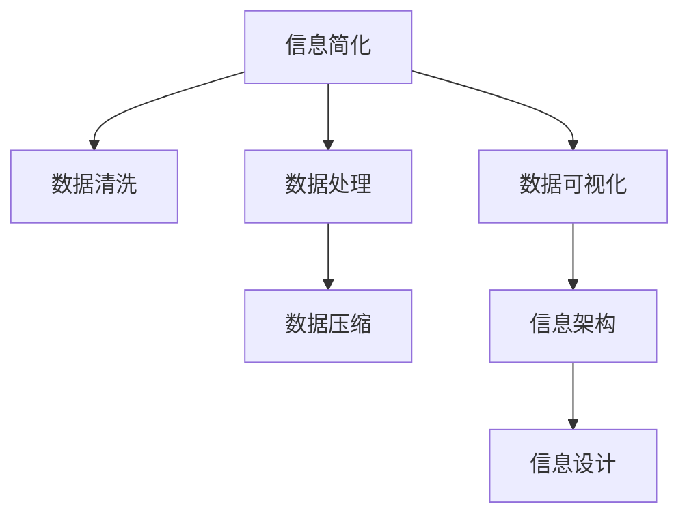

                 

# 信息简化的技巧和窍门：如何在混乱中找到秩序

> 关键词：信息简化, 信息压缩, 数据清洗, 数据处理, 数据可视化, 信息架构, 信息设计

## 1. 背景介绍

在信息爆炸的时代，数据和信息已经成为社会经济发展的核心资源。然而，海量信息的泛滥也带来了巨大的挑战：如何从海量的数据中提取有价值的信息，如何将复杂的信息组织成易于理解的形式，如何使信息在传递过程中保持清晰和准确，如何在使用信息的过程中获取最大的价值。这些问题都依赖于信息简化这一关键技术。

### 1.1 问题由来

随着数字化技术的发展，越来越多的数据被收集和存储，但是这些数据往往存在冗余、噪声和错误。信息技术的进步使得数据处理变得更加复杂，但这并没有降低信息的复杂性。因此，信息简化技术显得尤为重要。

信息简化技术可以有效地处理数据，减少冗余信息，去除噪声和错误，提高信息的准确性和可用性，从而提高信息的使用效率和价值。

### 1.2 问题核心关键点

信息简化的核心在于如何高效地处理、筛选、分析和展示信息，使其更加清晰、简洁、易于理解。这涉及到数据清洗、数据处理、数据压缩、数据可视化、信息架构等多个方面。以下是对信息简化技术的详细介绍。

## 2. 核心概念与联系

### 2.1 核心概念概述

为更好地理解信息简化技术，本节将介绍几个密切相关的核心概念：

- **信息简化（Information Simplification）**：将复杂的信息转化为易于理解的形式。
- **数据清洗（Data Cleaning）**：去除数据中的噪声、错误和冗余，提升数据质量。
- **数据处理（Data Processing）**：对数据进行预处理、分析和转换，以便于后续的分析和展示。
- **数据压缩（Data Compression）**：减少数据的大小，以便于存储和传输。
- **数据可视化（Data Visualization）**：将数据转化为图形或图表，使信息更加直观易懂。
- **信息架构（Information Architecture）**：设计信息系统的结构，使信息组织有序、清晰。
- **信息设计（Information Design）**：通过设计有效的信息结构，提升信息传递的效果。

这些核心概念之间的逻辑关系可以通过以下Mermaid流程图来展示：



这个流程图展示了许多信息简化技术的关键步骤：

1. 从原始数据开始，先进行数据清洗。
2. 接着进行数据处理，包括预处理、分析和转换。
3. 将处理后的数据进行压缩，以减少存储空间和传输成本。
4. 利用数据可视化技术，将数据转化为图形或图表，提高信息的直观性。
5. 设计有效的信息架构，使信息组织有序、清晰。
6. 最终进行信息设计，以提升信息传递的效果。

这些步骤共同构成了信息简化的技术框架，使得信息能够在各个环节中保持清晰、准确和高效。

## 3. 核心算法原理 & 具体操作步骤
### 3.1 算法原理概述

信息简化技术的核心在于如何对原始数据进行处理，使其更加简洁、高效、易于理解。一般而言，信息简化包括数据清洗、数据处理、数据压缩、数据可视化等步骤。

**数据清洗**：去除数据中的噪声、错误和冗余，提升数据质量。

**数据处理**：对数据进行预处理、分析和转换，以便于后续的分析和展示。

**数据压缩**：减少数据的大小，以便于存储和传输。

**数据可视化**：将数据转化为图形或图表，使信息更加直观易懂。

### 3.2 算法步骤详解

信息简化的操作步骤通常包括以下几个方面：

1. **数据收集**：从各种渠道收集数据。
2. **数据清洗**：去除数据中的噪声、错误和冗余。
3. **数据处理**：对数据进行预处理、分析和转换。
4. **数据压缩**：减少数据的大小，以便于存储和传输。
5. **数据可视化**：将数据转化为图形或图表，使信息更加直观易懂。
6. **信息架构设计**：设计信息系统的结构，使信息组织有序、清晰。
7. **信息设计**：通过设计有效的信息结构，提升信息传递的效果。

### 3.3 算法优缺点

信息简化技术的优点：

- **提高数据质量**：去除数据中的噪声、错误和冗余，提升数据质量。
- **提升数据效率**：通过数据压缩和可视化，减少数据的大小和复杂性，提升数据处理效率。
- **增强信息可用性**：通过信息架构和设计，使信息更加直观、易于理解。

信息简化技术的缺点：

- **数据丢失风险**：在进行数据清洗和处理时，可能会丢失一些重要信息。
- **技术复杂性**：信息简化需要多项技术支持和专业知识。
- **依赖数据源**：信息简化的效果取决于数据源的质量和完整性。

### 3.4 算法应用领域

信息简化技术在多个领域都有广泛应用，以下是几个典型的应用场景：

1. **商业智能（Business Intelligence）**：通过简化和可视化商业数据，帮助企业做出更明智的决策。
2. **数据科学（Data Science）**：在进行数据处理和分析时，简化数据是必不可少的步骤。
3. **媒体与传播（Media and Communication）**：通过简化和可视化信息，提高新闻和信息传播的效果。
4. **医疗健康（Healthcare）**：通过简化和可视化医疗数据，帮助医生进行更准确的诊断和治疗。
5. **科学研究（Research）**：在科学研究中，简化和可视化数据有助于发现新的规律和趋势。

## 4. 数学模型和公式 & 详细讲解 & 举例说明（备注：数学公式请使用latex格式，latex嵌入文中独立段落使用 $$，段落内使用 $)
### 4.1 数学模型构建

信息简化技术涉及多个数学模型和公式。下面以数据压缩为例，展示其数学模型构建。

**数据压缩模型**：

设原始数据集为 $D$，数据压缩的目标是将 $D$ 压缩成一个长度更短的编码 $E$。

- 数据压缩的目标函数为 $L(D) = |E|$，其中 $|E|$ 表示编码 $E$ 的长度。
- 目标函数为 $L(D) = \min_{E} |E|$。

**公式推导过程**：

- 设 $D$ 的长度为 $n$，$E$ 的长度为 $m$。
- 目标函数 $L(D) = \min_{E} |E|$ 表示寻找一个最短的编码 $E$。
- 压缩算法需满足无损压缩条件，即 $D$ 和 $E$ 相等，即 $D = E$。

### 4.2 案例分析与讲解

以压缩算法哈夫曼编码为例，展示如何通过数学模型构建压缩算法。

**哈夫曼编码**：

设原始数据集 $D = \{d_1, d_2, \ldots, d_n\}$，其中 $d_i$ 为原始数据中的元素。

- 定义频率 $f_i$，表示元素 $d_i$ 在 $D$ 中出现的频率。
- 定义哈夫曼树 $T$，通过构建哈夫曼树，计算哈夫曼编码。

**步骤**：

1. 计算频率：遍历 $D$，计算每个元素出现的频率 $f_i$。
2. 构建哈夫曼树：通过哈夫曼树的构建算法，得到哈夫曼树 $T$。
3. 计算编码：遍历哈夫曼树 $T$，计算每个元素的哈夫曼编码。

**代码实现**：

```python
from collections import Counter
import heapq

def huffman_encode(data):
    # 计算频率
    freq = Counter(data)
    nodes = [[node, freq[node]] for node in freq.keys()]
    heapq.heapify(nodes)
    
    # 构建哈夫曼树
    while len(nodes) > 1:
        left = heapq.heappop(nodes)
        right = heapq.heappop(nodes)
        parent = (left[0], right[0], left[1] + right[1])
        heapq.heappush(nodes, parent)
    
    # 计算编码
    code = {}
    root = nodes[0][0]
    code[root] = ""
    stack = [root]
    while len(stack) > 0:
        node = stack.pop()
        if len(node) == 1:
            code[node[0]] = code[parent[node[0]]]
        else:
            stack.append(node[0])
            stack.append(node[1])
            stack.append(node[2])
    
    return code

# 示例数据
data = ['a', 'b', 'c', 'a', 'a', 'b', 'a']

# 计算哈夫曼编码
code = huffman_encode(data)

# 输出编码
for key, value in code.items():
    print(key, value)
```

### 4.3 案例分析与讲解

## 5. 项目实践：代码实例和详细解释说明
### 5.1 开发环境搭建

在进行信息简化项目实践前，我们需要准备好开发环境。以下是使用Python进行信息简化开发的常见环境配置流程：

1. 安装Anaconda：从官网下载并安装Anaconda，用于创建独立的Python环境。
2. 创建并激活虚拟环境：
```bash
conda create -n info_simplification python=3.8 
conda activate info_simplification
```
3. 安装相关库：
```bash
pip install pandas numpy matplotlib seaborn
```

完成上述步骤后，即可在`info_simplification`环境中开始信息简化实践。

### 5.2 源代码详细实现

下面我们以数据压缩和可视化为例，给出使用Pandas和Matplotlib库对信息进行压缩和可视化的PyTorch代码实现。

首先，导入必要的库：

```python
import pandas as pd
import matplotlib.pyplot as plt
import numpy as np
```

然后，定义数据：

```python
data = ['a', 'a', 'a', 'b', 'b', 'b', 'c', 'c', 'c', 'd', 'd', 'd']
```

接着，进行数据压缩：

```python
# 计算频率
freq = pd.Series(data).value_counts()
```

进行哈夫曼编码：

```python
from collections import Counter
import heapq

# 构建哈夫曼树
nodes = [[node, freq[node]] for node in freq.keys()]
heapq.heapify(nodes)

while len(nodes) > 1:
    left = heapq.heappop(nodes)
    right = heapq.heappop(nodes)
    parent = (left[0], right[0], left[1] + right[1])
    heapq.heappush(nodes, parent)

# 计算编码
code = {}
root = nodes[0][0]
code[root] = ""
stack = [root]

while len(stack) > 0:
    node = stack.pop()
    if len(node) == 1:
        code[node[0]] = code[parent[node[0]]]
    else:
        stack.append(node[0])
        stack.append(node[1])
        stack.append(node[2])

# 输出编码
for key, value in code.items():
    print(key, value)
```

最后，进行数据可视化：

```python
# 绘制频率直方图
plt.bar(freq.index, freq.values)
plt.xlabel("Symbol")
plt.ylabel("Frequency")
plt.title("Frequency Distribution of Symbols")
plt.show()
```

以上就是使用Pandas和Matplotlib对信息进行压缩和可视化的完整代码实现。可以看到，通过简单的几行代码，我们就可以完成数据的频率统计、哈夫曼编码和可视化。

### 5.3 代码解读与分析

让我们再详细解读一下关键代码的实现细节：

**哈夫曼编码**：

- `Counter`：用于计算频率，`value_counts()`方法计算每个元素出现的次数。
- `heapq`：用于构建哈夫曼树，`heapify()`方法将列表转换为堆，`heappop()`和`heappush()`方法用于从堆中取出和插入节点。
- `code`：用于记录每个元素的哈夫曼编码。

**数据可视化**：

- `matplotlib`：用于绘制频率直方图，`bar()`方法用于绘制柱状图。

**开发环境搭建**：

- `Anaconda`：用于创建独立的Python环境。
- `pip`：用于安装相关库。

## 6. 实际应用场景

### 6.1 商业智能

在商业智能中，信息简化技术可以显著提升数据处理和分析效率，帮助企业做出更明智的决策。例如，在销售数据处理中，可以通过简化和可视化数据，快速发现销售趋势和异常情况，从而及时调整营销策略。

### 6.2 数据科学

数据科学中，信息简化技术是数据处理和分析的重要环节。通过简化数据，可以提高算法的效率和准确性。例如，在机器学习中，可以通过特征选择和降维，减少数据维度，提升模型的泛化能力。

### 6.3 媒体与传播

在媒体与传播中，信息简化技术可以提高新闻和信息传播的效果。例如，在新闻编辑中，可以通过数据压缩和可视化，使新闻内容更加简洁明了，吸引读者注意力。

### 6.4 医疗健康

在医疗健康领域，信息简化技术可以帮助医生更快地进行诊断和治疗。例如，在病历记录中，可以通过数据清洗和可视化，快速发现病人的病情变化和趋势。

### 6.5 科学研究

在科学研究中，信息简化技术可以帮助研究人员发现新的规律和趋势。例如，在数据分析中，可以通过数据清洗和可视化，快速发现数据中的异常值和异常趋势。

## 7. 工具和资源推荐
### 7.1 学习资源推荐

为了帮助开发者系统掌握信息简化技术的理论基础和实践技巧，这里推荐一些优质的学习资源：

1. **《数据科学入门》（Introduction to Data Science）**：介绍数据科学的基本概念和常用工具，包括数据清洗、数据处理、数据可视化等。
2. **《Python数据科学手册》（Python Data Science Handbook）**：介绍Python在数据科学中的应用，包括Pandas、NumPy、Matplotlib等库的使用。
3. **《信息可视化》（Information Visualization）**：介绍信息可视化的基本原理和常用技术，包括数据压缩、图表设计等。
4. **《信息架构》（Information Architecture）**：介绍信息架构的基本概念和设计原则，包括信息系统的结构设计、信息设计等。
5. **《设计心理学》（The Design of Everyday Things）**：介绍设计心理学的基础知识，帮助开发者理解信息设计的原则和方法。

通过对这些资源的学习实践，相信你一定能够快速掌握信息简化技术的精髓，并用于解决实际的信息处理问题。

### 7.2 开发工具推荐

高效的开发离不开优秀的工具支持。以下是几款用于信息简化开发的常用工具：

1. **Pandas**：用于数据处理和分析，提供丰富的数据清洗和数据处理函数。
2. **NumPy**：用于数学计算和数组操作，提高数据处理效率。
3. **Matplotlib**：用于数据可视化，提供丰富的图表绘制功能。
4. **Seaborn**：基于Matplotlib，提供更高级的数据可视化功能，使图表更加美观。
5. **Jupyter Notebook**：用于交互式编程和数据探索，方便开发者快速迭代和实验。

合理利用这些工具，可以显著提升信息简化任务的开发效率，加快创新迭代的步伐。

### 7.3 相关论文推荐

信息简化技术的发展源于学界的持续研究。以下是几篇奠基性的相关论文，推荐阅读：

1. **《信息可视化：原理与技术》（Information Visualization: Principles and Techniques）**：介绍信息可视化的基本原理和常用技术，是信息可视化领域的经典之作。
2. **《数据压缩算法》（Data Compression Algorithms）**：介绍数据压缩的基本原理和常用算法，包括哈夫曼编码、LZ77算法等。
3. **《信息架构设计》（Information Architecture Design）**：介绍信息架构的基本概念和设计原则，是信息架构领域的经典之作。
4. **《信息处理与设计》（Information Processing and Design）**：介绍信息处理和设计的基本原理和常用方法，涵盖数据清洗、数据处理、信息设计等。

这些论文代表了大数据技术和信息简化技术的发展脉络，是深入理解信息简化技术的重要参考。

## 8. 总结：未来发展趋势与挑战

### 8.1 总结

本文对信息简化技术进行了全面系统的介绍。首先阐述了信息简化的背景和意义，明确了信息简化的核心在于高效地处理、筛选、分析和展示信息，使其更加清晰、简洁、易于理解。其次，从原理到实践，详细讲解了信息简化的数学模型和操作步骤，给出了信息简化的完整代码实例。同时，本文还广泛探讨了信息简化技术在多个行业领域的应用前景，展示了信息简化技术的巨大潜力。最后，本文精选了信息简化技术的各类学习资源，力求为读者提供全方位的技术指引。

通过本文的系统梳理，可以看到，信息简化技术在数字化时代的重要性，其对于提升数据处理效率、提高信息传递效果、增强决策支持等方面具有重要价值。未来，随着数字化技术的进一步发展，信息简化技术将继续发挥关键作用，成为信息处理的重要手段。

### 8.2 未来发展趋势

展望未来，信息简化技术将呈现以下几个发展趋势：

1. **自动化与智能化**：未来的信息简化将更多依赖于自动化和智能化技术，通过算法自动完成数据清洗、数据处理、数据压缩等步骤。
2. **跨领域应用**：信息简化技术将应用于更多的领域，如智能医疗、智能制造、智能交通等，提升各行业的数字化水平。
3. **大数据融合**：随着大数据技术的不断进步，信息简化技术将更多地融合大数据技术，提升数据处理和分析能力。
4. **人工智能融合**：未来的信息简化技术将更多地融合人工智能技术，如自然语言处理、计算机视觉等，提升信息处理和分析的智能化水平。
5. **隐私与安全**：随着信息简化技术的普及，隐私和安全问题将更加突出。未来的信息简化技术将更加注重隐私保护和数据安全。

以上趋势凸显了信息简化技术的广阔前景，这些方向的探索发展，必将进一步提升信息处理效率，推动各行业的数字化转型升级。

### 8.3 面临的挑战

尽管信息简化技术已经取得了显著成就，但在迈向更加智能化、普适化应用的过程中，仍面临诸多挑战：

1. **数据质量问题**：信息简化的效果依赖于数据质量，如何保证数据的质量和完整性是信息简化的关键问题。
2. **技术复杂性**：信息简化的技术实现涉及多个领域，需要综合运用数据清洗、数据处理、数据压缩等技术，技术难度较高。
3. **资源消耗问题**：信息简化需要大量的计算和存储资源，如何在资源有限的情况下提升信息简化效果是信息简化技术面临的重要挑战。
4. **信息安全问题**：在信息简化过程中，如何保护用户隐私和数据安全，防止信息泄露和滥用，是信息简化技术的重要课题。
5. **跨领域应用问题**：信息简化技术在不同领域的应用中，需要考虑行业特性和用户需求，如何实现跨领域的通用化和定制化，是信息简化技术的难点。

### 8.4 研究展望

面对信息简化技术所面临的挑战，未来的研究需要在以下几个方面寻求新的突破：

1. **自动化与智能化技术**：开发更多的自动化和智能化算法，提升信息简化的效率和效果。
2. **跨领域应用技术**：探索跨领域的信息简化技术，实现信息简化技术的通用化和定制化。
3. **资源优化技术**：开发更高效的信息简化算法，提升信息简化的计算效率和存储效率。
4. **隐私与安全技术**：开发隐私保护和安全保护算法，提升信息简化的隐私和安全性能。
5. **人工智能融合技术**：将人工智能技术引入信息简化，提升信息简化的智能化水平。

这些研究方向的探索，必将引领信息简化技术迈向更高的台阶，为信息处理和分析带来更高效、更智能化、更安全、更可控的解决方案。

## 9. 附录：常见问题与解答

**Q1：信息简化技术是否适用于所有数据类型？**

A: 信息简化技术主要适用于结构化数据和非结构化数据，但对于一些特殊数据类型，如多媒体数据，需要进行特殊的处理和优化。

**Q2：如何进行数据清洗和处理？**

A: 数据清洗和处理是信息简化的重要环节，可以通过去重、去噪、标准化等方法，去除数据中的噪声和错误，提升数据质量。

**Q3：如何进行数据压缩和可视化？**

A: 数据压缩和可视化是信息简化的关键步骤，可以通过哈夫曼编码、LZ77算法等方法进行数据压缩，通过柱状图、折线图等方法进行数据可视化。

**Q4：信息简化技术在实际应用中需要注意哪些问题？**

A: 在实际应用中，信息简化技术需要注意数据质量、技术复杂性、资源消耗、隐私安全等问题。

**Q5：如何提高信息简化的效率和效果？**

A: 可以通过自动化与智能化技术、跨领域应用技术、资源优化技术、隐私与安全技术、人工智能融合技术等方法，提高信息简化的效率和效果。

---

作者：禅与计算机程序设计艺术 / Zen and the Art of Computer Programming

