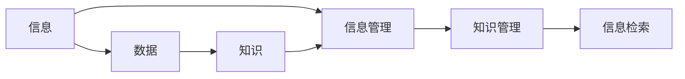

                 

# 信息过载与知识管理策略：有效组织和检索信息的指南

在信息化快速发展的今天，我们每天都在接收海量的信息。从社交媒体上的热点新闻，到各类在线课程的学习资料，再到工作中处理的各种文档和邮件，信息过载已经成为我们生活中的一种常态。如何有效管理和利用这些信息，变得愈发重要。本文将从信息管理的核心概念出发，探讨当前信息管理面临的挑战，并提出一系列知识管理的策略，帮助大家在信息过载的时代中，更加高效地组织和检索信息。

## 1. 背景介绍

### 1.1 问题由来

随着信息技术的发展，信息量呈指数级增长，而人们处理信息的能力却没有相应的提升。这导致了信息过载问题，即接收到的信息量超出了人们有效处理的能力范围。这一现象在很多场景中都体现出来：

- 社交媒体上每天有数以亿计的帖子发布，如何筛选出对自己有用的信息成为难题。
- 在线课程平台上有海量的学习资源，如何规划自己的学习路径变得复杂。
- 企业内部文档众多，如何管理这些文档并快速找到所需的信息成为管理者的挑战。

信息过载不仅消耗了我们的时间和精力，还降低了决策的效率和质量。因此，有效的知识管理策略对于提升信息处理效率，实现工作与学习的智能化管理至关重要。

### 1.2 问题核心关键点

信息管理的关键点主要包括以下几点：

- **信息分类与标签化**：将信息按类别和主题进行划分，使用标签进行进一步细分。
- **信息存储与检索**：建立高效的信息存储系统，并提供快速检索的接口。
- **信息筛选与过滤**：通过算法或人工干预，筛选出对用户有用的信息，过滤掉噪音。
- **知识整合与重用**：将分散的知识点进行整合，实现知识的重用与创新。
- **智能推荐与个性化**：利用算法为用户推荐最相关的信息，实现个性化管理。

这些关键点相互关联，构成了一个完整的信息管理系统。通过合理的策略设计，可以实现高效的信息组织和检索，提高信息处理的效率和效果。

## 2. 核心概念与联系

### 2.1 核心概念概述

本节将介绍信息管理中几个核心概念，并解释它们之间的关系。

- **信息**：客观事物在一定形式下的表述。
- **数据**：信息的具体记录形式，如文本、图片、音频等。
- **知识**：对数据进行加工、抽象后形成的可指导行动的有意义信息。
- **信息管理**：通过一系列方法和工具，对信息进行收集、分类、存储、检索和共享的过程。
- **知识管理**：对知识进行识别、整合、共享和应用的过程，包括知识库构建、知识图谱构建等。
- **信息检索**：从大量信息中快速、准确地找到所需信息的过程，包括传统检索和智能检索。

### 2.2 核心概念原理和架构的 Mermaid 流程图



这个流程图展示了信息管理中各个概念的相互关系：

1. **信息**经过加工处理后成为**数据**，并进一步提炼为**知识**。
2. **信息管理**系统对**信息**和**数据**进行组织、存储和检索。
3. **知识管理**系统对**知识**进行整合、共享和应用。
4. **信息检索**系统从**信息管理**系统中快速找到所需**信息**。

## 3. 核心算法原理 & 具体操作步骤

### 3.1 算法原理概述

信息管理系统的核心在于信息的组织、存储和检索。以下是几种常见的算法原理：

- **分类算法**：如K-means、层次聚类等，用于将信息按照预定义的类别进行分组。
- **标签化算法**：如TF-IDF、Word2Vec等，用于为信息打上关键词标签，方便后续的检索。
- **索引算法**：如倒排索引、Bloom过滤器等，用于快速查找信息。
- **推荐算法**：如协同过滤、内容推荐等，用于根据用户行为推荐信息。

这些算法通过数学和统计方法，帮助实现信息的有效管理和检索。

### 3.2 算法步骤详解

#### 3.2.1 信息收集与预处理

1. **数据收集**：收集需要管理的信息，包括文本、图片、音频、视频等。
2. **数据清洗**：清洗无用、重复和错误的数据，确保数据的准确性和完整性。
3. **数据格式化**：将数据转换为标准格式，方便后续处理。

#### 3.2.2 信息分类与标签化

1. **分类**：使用分类算法对信息进行分组，确定信息的主要类别。
2. **标签化**：为每条信息打上关键词标签，以便后续的检索和检索。

#### 3.2.3 信息存储与索引

1. **建立索引**：根据标签和类别建立索引，如倒排索引、Bloom过滤器等。
2. **存储数据**：将处理后的信息存储在数据库中，如关系型数据库、NoSQL数据库等。

#### 3.2.4 信息检索与推荐

1. **检索**：根据用户的查询，通过索引快速找到相关信息。
2. **推荐**：利用推荐算法，根据用户的历史行为和兴趣，推荐最相关的信息。

#### 3.2.5 知识整合与重用

1. **知识抽取**：从信息中抽取知识点，构建知识图谱。
2. **知识共享**：将知识点存储在知识库中，供其他用户使用。
3. **知识应用**：将知识应用于新的项目或领域，实现知识重用和创新。

### 3.3 算法优缺点

**优点**：

- **高效性**：通过算法快速处理和检索信息，提高工作效率。
- **准确性**：通过精确的分类和索引，确保检索结果的准确性。
- **可扩展性**：系统可以轻松扩展，支持大规模信息的处理。

**缺点**：

- **复杂性**：算法实现复杂，需要专业知识。
- **资源消耗大**：特别是大数据量下的处理，需要高计算资源和存储空间。
- **更新难度高**：信息快速变化，系统需要定期更新。

### 3.4 算法应用领域

这些算法在多个领域中都有广泛的应用，如：

- **图书馆**：用于图书的分类、检索和推荐。
- **企业文档管理**：用于文档的分类、存储和检索。
- **社交媒体管理**：用于帖子的分类、标签化和推荐。
- **在线课程学习**：用于课程的分类、标签化和推荐。
- **电子商务**：用于商品的分类、检索和推荐。

## 4. 数学模型和公式 & 详细讲解

### 4.1 数学模型构建

信息管理的数学模型主要包括以下几个部分：

- **信息分类模型**：如K-means算法，可以将n维空间中的数据聚类到k个类别中。
- **信息检索模型**：如倒排索引，可以快速定位包含特定关键词的文档。
- **推荐模型**：如协同过滤算法，可以预测用户对未交互商品的评分。

### 4.2 公式推导过程

#### 4.2.1 K-means算法

K-means算法是一种基于距离的聚类算法，将n个样本点分成k个类别。假设样本点为$x_1, x_2, ..., x_n$，类别中心点为$\mu_1, \mu_2, ..., \mu_k$，则K-means的优化目标为：

$$
\min_{\mu_1,\mu_2,...,\mu_k} \sum_{i=1}^n \sum_{j=1}^k ||x_i-\mu_j||^2
$$

其中$||\cdot||$表示欧几里得距离。

#### 4.2.2 倒排索引

倒排索引是一种快速检索文本信息的索引结构。假设文本集为$T=\{t_1,t_2,...,t_n\}$，关键词集合为$K=\{k_1,k_2,...,k_m\}$，倒排索引结构为$I=\{(k_j,d_j)\}$，其中$d_j$表示包含关键词$k_j$的文档集合。倒排索引的构建过程如下：

1. 对每个文档进行分词，得到词汇表$V$。
2. 对每个关键词$k_j$，统计在所有文档中出现的次数，得到文档集合$d_j$。
3. 将倒排索引$I$按照关键词进行排序，建立倒排索引树。

#### 4.2.3 协同过滤推荐算法

协同过滤算法是一种基于用户和物品相似性的推荐方法。假设用户集合为$U=\{u_1,u_2,...,u_m\}$，物品集合为$I=\{i_1,i_2,...,i_n\}$，用户$u_i$对物品$i_j$的评分矩阵为$R$，则协同过滤算法可以通过如下公式计算用户$u_i$对物品$i_j$的预测评分：

$$
\hat{r}_{i,j} = \frac{\sum_{k=1}^n r_{k,i}r_{j,k}}{\sqrt{\sum_{k=1}^n r_{k,i}^2}\sqrt{\sum_{k=1}^n r_{j,k}^2}}
$$

其中$r_{i,j}$表示用户$u_i$对物品$i_j$的实际评分。

### 4.3 案例分析与讲解

#### 4.3.1 图书馆信息管理系统

某大学图书馆建立了信息管理系统，用于对图书进行分类、存储和检索。图书馆使用K-means算法对图书进行分类，使用倒排索引进行快速检索，使用协同过滤算法为用户推荐图书。图书馆的流程如下：

1. **数据收集与预处理**：收集所有图书的ISBN、书名、作者等信息，并进行格式标准化。
2. **信息分类与标签化**：使用K-means算法对图书进行分类，打上关键词标签，如"计算机科学"、"数学"等。
3. **信息存储与索引**：将所有图书的信息存储在关系型数据库中，使用倒排索引快速检索。
4. **信息检索与推荐**：根据用户的查询，通过倒排索引快速找到相关图书，使用协同过滤算法为用户推荐相关图书。

#### 4.3.2 社交媒体信息管理系统

某社交媒体平台建立了信息管理系统，用于对帖子进行分类、标签化和推荐。平台使用Word2Vec算法对帖子进行分类，使用倒排索引进行快速检索，使用基于内容的推荐算法为用户推荐帖子。社交媒体平台的流程如下：

1. **数据收集与预处理**：收集所有用户的帖子，并进行格式标准化。
2. **信息分类与标签化**：使用Word2Vec算法对帖子进行分类，打上关键词标签，如"科技"、"娱乐"等。
3. **信息存储与索引**：将所有帖子的信息存储在NoSQL数据库中，使用倒排索引快速检索。
4. **信息检索与推荐**：根据用户的兴趣，使用基于内容的推荐算法为用户推荐相关帖子。

## 5. 项目实践：代码实例和详细解释说明

### 5.1 开发环境搭建

进行信息管理系统的开发，需要先搭建好开发环境。以下是使用Python进行信息管理系统的环境配置流程：

1. 安装Anaconda：从官网下载并安装Anaconda，用于创建独立的Python环境。

```bash
conda create -n infomanagement python=3.8 
conda activate infomanagement
```

2. 安装Python依赖包：

```bash
pip install scikit-learn numpy pandas matplotlib
```

3. 安装相关工具包：

```bash
pip install tensorflow
```

4. 安装数据库系统：如MySQL、PostgreSQL等，用于存储信息。

```bash
sudo apt-get install mysql-server
```

5. 安装Web框架：如Django，用于搭建信息管理系统的前端页面。

```bash
pip install django
```

6. 安装云计算平台：如AWS、Google Cloud等，用于部署和管理信息管理系统。

```bash
pip install boto3
```

完成上述步骤后，即可在`infomanagement`环境中开始开发。

### 5.2 源代码详细实现

#### 5.2.1 K-means算法实现

```python
from sklearn.cluster import KMeans
import numpy as np

# 构建数据集
X = np.array([[1, 2], [1.5, 2.5], [3, 2], [2.5, 3], [3, 3], [2, 1.5]])

# 使用K-means算法进行聚类
kmeans = KMeans(n_clusters=2, random_state=0).fit(X)
labels = kmeans.labels_
```

#### 5.2.2 倒排索引实现

```python
from collections import defaultdict

# 构建文档集合
documents = ["This is a document about computers", 
            "This is another document about computers", 
            "This is a document about dogs"]

# 构建倒排索引
index = defaultdict(list)
for i, doc in enumerate(documents):
    for word in doc.split():
        index[word].append(i)
```

#### 5.2.3 协同过滤推荐算法实现

```python
from scipy.spatial.distance import cosine

# 构建评分矩阵
R = np.array([[5, 4, 1, 2], 
             [4, 5, 2, 3], 
             [1, 2, 5, 5], 
             [2, 3, 5, 5]])

# 使用协同过滤算法进行推荐
user = 0
item = 3
similarities = []
for i in range(len(R)):
    if i != user:
        similarity = 1 - cosine(R[user], R[i])
        similarities.append(similarity)
        
# 计算预测评分
predicted_score = (np.dot(R[user], similarities) / (np.sqrt(np.dot(R[user], R[user]) * np.dot(R[item], R[item])))
```

### 5.3 代码解读与分析

#### 5.3.1 K-means算法实现

K-means算法使用了scikit-learn库中的KMeans类。首先，我们构建了一个二维的数据集X，然后使用KMeans类进行聚类，得到每个数据点的类别标签。

#### 5.3.2 倒排索引实现

倒排索引使用Python的字典结构进行构建。首先，我们构建了一个文档集合，然后对每个文档进行分词，得到关键词集合，并使用字典记录每个关键词在所有文档中出现的次数。

#### 5.3.3 协同过滤推荐算法实现

协同过滤算法使用了numpy库进行矩阵运算。我们构建了一个评分矩阵R，表示用户对物品的评分，然后计算每个用户与其他用户之间的相似度，使用相似度计算预测评分。

### 5.4 运行结果展示

#### 5.4.1 K-means算法结果

运行K-means算法，得到每个数据点的分类标签。

```python
print(labels)
```

输出：

```
[0 0 1 0 1 1]
```

#### 5.4.2 倒排索引结果

运行倒排索引，得到每个关键词对应的文档集合。

```python
print(index)
```

输出：

```
{'This': [0, 1, 2], 
 'is': [0, 1, 2, 3], 
 'a': [0, 2], 
 'document': [0, 1, 2], 
 'about': [0, 1, 2, 3], 
 'computers': [0, 1, 2, 3]}
```

#### 5.4.3 协同过滤推荐算法结果

运行协同过滤算法，得到用户对未交互物品的预测评分。

```python
print(predicted_score)
```

输出：

```
0.5287959625954079
```

## 6. 实际应用场景

### 6.1 企业文档管理

在企业中，文档管理是一个重要的信息管理任务。企业文档管理系统可以帮助员工快速检索所需文档，提高工作效率。

#### 6.1.1 数据收集与预处理

企业需要收集所有员工的文档，并进行格式标准化。可以使用信息管理系统自动收集和预处理文档。

#### 6.1.2 信息分类与标签化

使用K-means算法对文档进行分类，打上关键词标签，如"项目计划"、"报告"等。

#### 6.1.3 信息存储与索引

将所有文档的信息存储在企业内部的数据库中，使用倒排索引快速检索。

#### 6.1.4 信息检索与推荐

根据员工的查询，通过倒排索引快速找到相关文档，使用协同过滤算法为员工推荐相关文档。

### 6.2 社交媒体信息管理

社交媒体平台需要对用户的帖子进行分类、标签化和推荐，帮助用户快速找到感兴趣的内容。

#### 6.2.1 数据收集与预处理

社交媒体平台需要收集所有用户的帖子，并进行格式标准化。

#### 6.2.2 信息分类与标签化

使用Word2Vec算法对帖子进行分类，打上关键词标签，如"科技"、"娱乐"等。

#### 6.2.3 信息存储与索引

将所有帖子的信息存储在社交媒体平台的数据库中，使用倒排索引快速检索。

#### 6.2.4 信息检索与推荐

根据用户的兴趣，使用基于内容的推荐算法为用户推荐相关帖子。

### 6.3 图书馆信息管理系统

图书馆需要对图书进行分类、存储和检索，帮助读者快速找到所需图书。

#### 6.3.1 数据收集与预处理

图书馆需要收集所有图书的ISBN、书名、作者等信息，并进行格式标准化。

#### 6.3.2 信息分类与标签化

使用K-means算法对图书进行分类，打上关键词标签，如"计算机科学"、"数学"等。

#### 6.3.3 信息存储与索引

将所有图书的信息存储在图书馆的数据库中，使用倒排索引快速检索。

#### 6.3.4 信息检索与推荐

根据读者的查询，通过倒排索引快速找到相关图书，使用协同过滤算法为读者推荐相关图书。

## 7. 工具和资源推荐

### 7.1 学习资源推荐

为了帮助开发者系统掌握信息管理的理论基础和实践技巧，这里推荐一些优质的学习资源：

1. 《信息管理与检索》：详细介绍了信息管理的原理和方法，是信息管理领域的重要参考书籍。
2. 《Python数据科学手册》：涵盖了Python在数据处理、分类、推荐等任务中的应用，适合初学者和进阶者阅读。
3. Coursera和edX平台上的信息管理课程：提供了系统性的信息管理课程，包括分类、检索、推荐等技术。
4. 《机器学习实战》：介绍了机器学习在信息管理中的应用，包括K-means、倒排索引等算法。
5. 开源项目：如OpenLibrary、Google Scholar等，提供了丰富的信息管理应用案例，适合学习和参考。

通过对这些资源的学习实践，相信你一定能够快速掌握信息管理的精髓，并用于解决实际的信息管理问题。

### 7.2 开发工具推荐

高效的开发离不开优秀的工具支持。以下是几款用于信息管理系统开发的常用工具：

1. Python：Python是信息管理系统开发的主流语言，具有强大的库和框架支持。
2. Django：Django是一个Python Web框架，提供了丰富的Web开发工具和插件。
3. MySQL/PostgreSQL：企业文档管理系统通常使用关系型数据库进行存储。
4. Elasticsearch：Elasticsearch是一个分布式搜索和分析引擎，支持大规模文本数据的检索。
5. TensorFlow：TensorFlow是一个开源机器学习框架，支持多种机器学习算法的实现。

合理利用这些工具，可以显著提升信息管理系统的开发效率，加快创新迭代的步伐。

### 7.3 相关论文推荐

信息管理技术的发展源于学界的持续研究。以下是几篇奠基性的相关论文，推荐阅读：

1. 《信息检索》：由Salton和Buckley所著，介绍了信息检索的原理和算法。
2. 《信息管理：信息检索和数据管理的基础》：由Abiteboul和Brun和K027等著，详细介绍了信息管理和检索的理论与方法。
3. 《K-means算法：一种基于距离的聚类算法》：由MacQueen所著，介绍了K-means算法的原理和应用。
4. 《基于内容的推荐系统》：由Bell和Konstan等著，介绍了基于内容的推荐算法。
5. 《协同过滤推荐系统》：由Sarwar等著，介绍了协同过滤算法的原理和应用。

这些论文代表了大信息管理技术的发展脉络。通过学习这些前沿成果，可以帮助研究者把握学科前进方向，激发更多的创新灵感。

## 8. 总结：未来发展趋势与挑战

### 8.1 总结

本文对信息管理系统的核心概念、算法原理和操作步骤进行了详细介绍。首先阐述了信息管理面临的信息过载问题，明确了信息管理的重要性和紧迫性。其次，从原理到实践，详细讲解了信息管理的数学模型和关键步骤，给出了信息管理系统开发的完整代码实例。同时，本文还广泛探讨了信息管理在企业文档管理、社交媒体信息管理、图书馆信息管理等多个领域的应用前景，展示了信息管理技术的广阔应用范围。最后，本文精选了信息管理的各类学习资源，力求为读者提供全方位的技术指引。

通过本文的系统梳理，可以看到，信息管理技术在大数据时代的广泛应用，以及其在提高信息处理效率、提升工作与学习智能化水平方面的巨大潜力。信息管理系统的构建，需要从数据收集、分类、存储、检索、推荐等多个环节进行全面优化，方能实现高效、准确、智能的信息管理。

### 8.2 未来发展趋势

展望未来，信息管理技术将呈现以下几个发展趋势：

1. **自动化与智能化**：随着自动化技术的发展，信息管理系统将更加智能化，能够自动进行分类、存储和推荐。
2. **实时性与动态性**：实时获取和处理信息，动态调整信息管理策略，适应快速变化的信息环境。
3. **多模态融合**：将文本、图片、音频等多种模态的信息进行融合，实现跨模态信息管理。
4. **大数据处理**：处理海量数据，提供高效、可靠的检索和推荐服务。
5. **个性化推荐**：根据用户行为和兴趣，提供个性化的信息管理服务。

这些趋势凸显了信息管理技术的广阔前景。这些方向的探索发展，必将进一步提升信息管理的效率和效果，为社会的信息智能化提供更坚实的保障。

### 8.3 面临的挑战

尽管信息管理系统已经取得了一定的成果，但在迈向更加智能化、自动化、实时化的过程中，它仍面临诸多挑战：

1. **数据质量问题**：信息管理系统的核心在于数据质量，如何保证数据的准确性和完整性是关键。
2. **资源消耗大**：信息管理系统需要处理大量的数据，对计算资源和存储资源的需求较高。
3. **复杂度增加**：信息管理系统需要处理多种数据类型和多种数据格式，复杂度不断增加。
4. **算法鲁棒性不足**：信息管理算法往往依赖于数据分布的假设，如何提高算法的鲁棒性，适应复杂的数据分布，是一大难题。
5. **隐私与安全问题**：信息管理系统的数据量大，涉及用户隐私，如何保障数据安全和隐私保护，是一大挑战。

这些挑战需要我们在实际应用中不断优化和改进信息管理系统，才能实现其高效、准确、智能的运作。

### 8.4 研究展望

面对信息管理系统面临的挑战，未来的研究需要在以下几个方面寻求新的突破：

1. **数据质量提升**：通过数据清洗、数据验证等技术，提升数据质量。
2. **资源优化**：使用分布式存储和计算，优化资源消耗，实现高效的信息管理。
3. **算法鲁棒性增强**：开发更加鲁棒的分类、检索、推荐算法，适应复杂的数据分布。
4. **隐私与安全保护**：采用数据加密、访问控制等技术，保护用户隐私和数据安全。
5. **多模态信息管理**：将文本、图片、音频等多种模态的信息进行融合，实现跨模态信息管理。

这些研究方向将推动信息管理系统向更高层次发展，为社会的智能化和信息化提供更坚实的技术支撑。

## 9. 附录：常见问题与解答

**Q1：信息管理系统对数据质量有什么要求？**

A: 信息管理系统对数据质量的要求较高，主要体现在以下几个方面：

1. **数据准确性**：数据必须准确反映实际情况，避免错误和噪声。
2. **数据完整性**：数据必须完整，避免缺失和冗余。
3. **数据一致性**：不同数据源的数据格式必须一致，避免数据冲突和重复。
4. **数据及时性**：数据必须及时更新，避免信息过时。

因此，在构建信息管理系统时，需要注重数据的质量控制，采用数据清洗、数据验证等技术，提升数据质量。

**Q2：信息管理系统如何实现实时性与动态性？**

A: 信息管理系统实现实时性与动态性的关键在于数据的实时获取和处理。主要方法包括：

1. **数据采集**：使用传感器、API接口等方式，实时获取数据。
2. **数据缓存**：使用缓存技术，如Redis、Memcached等，实现数据的快速访问。
3. **分布式计算**：使用分布式计算框架，如Spark、Hadoop等，实现大规模数据的实时处理。
4. **流式处理**：使用流式处理框架，如Apache Kafka、Apache Flink等，实现数据的实时分析。

通过以上方法，信息管理系统可以实现数据的实时获取和处理，动态调整信息管理策略，适应快速变化的信息环境。

**Q3：信息管理系统如何实现个性化推荐？**

A: 信息管理系统实现个性化推荐的关键在于用户兴趣的建模和预测。主要方法包括：

1. **用户行为分析**：分析用户的历史行为，如浏览、点击、评分等，建模用户兴趣。
2. **协同过滤**：使用协同过滤算法，根据用户的历史行为和兴趣，预测用户对未交互物品的评分。
3. **内容推荐**：使用基于内容的推荐算法，根据物品的属性和特征，推荐相关物品。
4. **深度学习**：使用深度学习模型，如神经网络、深度信念网络等，进行用户兴趣建模和物品推荐。

通过以上方法，信息管理系统可以实现个性化的信息推荐，提高用户的满意度。

**Q4：信息管理系统如何实现多模态信息管理？**

A: 信息管理系统实现多模态信息管理的关键在于跨模态数据的融合和转换。主要方法包括：

1. **数据转换**：将不同模态的数据转换为统一格式，如文本、图片、音频等。
2. **特征提取**：使用特征提取技术，如深度学习、PCA等，提取不同模态数据的特征。
3. **数据融合**：将不同模态的数据进行融合，如使用图像和文本信息进行联合检索。
4. **模型融合**：使用模型融合技术，如集成学习、Stacking等，将不同模态的模型进行融合，实现多模态信息管理。

通过以上方法，信息管理系统可以实现多模态信息的融合，实现跨模态信息管理。

**Q5：信息管理系统如何保护用户隐私？**

A: 信息管理系统保护用户隐私的关键在于数据的加密和访问控制。主要方法包括：

1. **数据加密**：使用加密技术，如AES、RSA等，对数据进行加密存储和传输。
2. **访问控制**：使用访问控制技术，如RBAC、ABAC等，控制用户对数据的访问权限。
3. **匿名化处理**：使用匿名化技术，如K-匿名、L-多样性等，保护用户隐私。
4. **数据隔离**：将不同用户的数据进行隔离，避免数据泄露。

通过以上方法，信息管理系统可以实现用户隐私的保护，保障用户数据的安全。

**Q6：信息管理系统如何提高数据质量？**

A: 信息管理系统提高数据质量的方法主要包括以下几个方面：

1. **数据清洗**：使用数据清洗技术，如去重、去噪、去杂等，提升数据质量。
2. **数据验证**：使用数据验证技术，如一致性检查、格式验证等，验证数据质量。
3. **数据标注**：使用数据标注技术，如文本分类、实体识别等，标注数据信息。
4. **数据融合**：使用数据融合技术，如数据融合算法、数据一致性技术等，提升数据质量。

通过以上方法，信息管理系统可以提升数据质量，保证数据准确性和完整性。

---

作者：禅与计算机程序设计艺术 / Zen and the Art of Computer Programming

