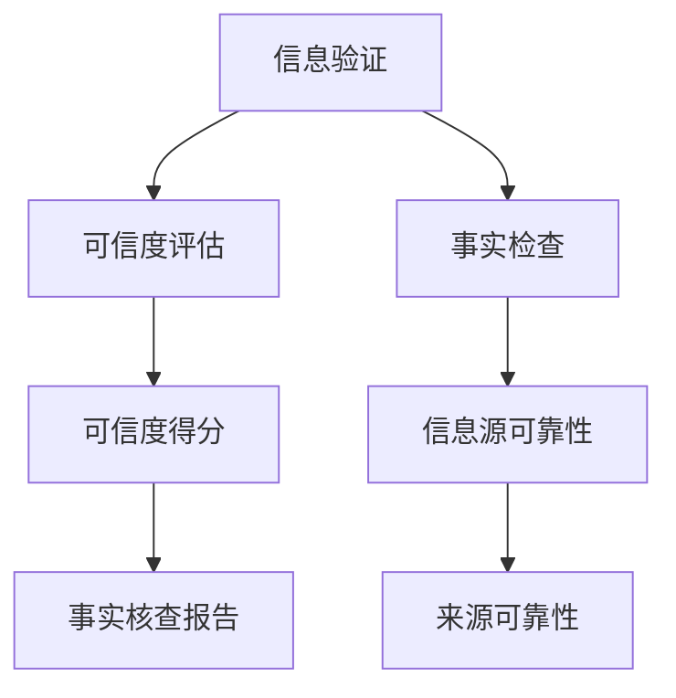

                 

# 信息验证和事实检查指南：在假新闻和错误信息时代导航

## 1. 背景介绍

在信息爆炸的时代，假新闻和错误信息的泛滥已经成为严重的社会问题。根据一项调查，全球超过三分之一的在线信息是假新闻或被篡改的，而社交媒体上的虚假信息更是数不胜数。虚假信息不仅会误导公众，还会影响政治、经济、社会等多个领域，对社会稳定和公共利益造成严重危害。

面对这一挑战，信息验证和事实检查技术应运而生，成为信息时代中的一道重要防线。本指南将介绍信息验证和事实检查的核心理念、关键技术，并展望其未来的发展方向。

## 2. 核心概念与联系

### 2.1 核心概念概述

- **信息验证**：通过一系列算法和技术手段，对信息的真实性和可信度进行评估。主要关注信息源的可信度、信息的真实性、证据链的完整性等方面。

- **事实检查**：具体到信息内容的真实性，包括验证信息的事实准确性、逻辑一致性、来源可靠性等。

- **假新闻**：故意制造和传播的、与事实严重不符的虚假信息，往往带有误导性、欺诈性、政治目的等。

- **错误信息**：与假新闻相似，但更多是基于误解、扭曲事实或错误解读所产生的信息。

- **信息可信度评估**：通过多维度、多层次的评估指标，如信息的可信度得分、事实核查报告等，对信息进行全面评估。

### 2.2 核心概念原理和架构的 Mermaid 流程图



这个流程图展示了信息验证和事实检查的主要环节：

- **信息验证** 首先对信息进行可信度评估，判断其整体可信度。
- **事实检查** 对信息的具体内容进行核查，验证其事实准确性。
- **信息源可靠性** 分析信息来源的可信度，包括其历史记录、权威性等。
- **可信度得分** 综合信息源和内容的多维度信息，给出综合可信度评分。
- **事实核查报告** 提供详细的事实核查结果，指出信息的不实之处，并给出可能的正确答案。

这些环节构成了一个完整的、多层次的信息验证和事实检查流程。

## 3. 核心算法原理 & 具体操作步骤

### 3.1 算法原理概述

信息验证和事实检查的核心算法包括自然语言处理(NLP)、机器学习(ML)、人工智能(AI)等多种技术。

- **NLP**：利用自然语言处理技术，对信息进行语义分析、情感分析、实体识别等处理，提取关键信息和证据链。
- **ML**：通过机器学习算法，如分类、聚类、回归等，对信息的可信度进行评估和预测。
- **AI**：结合深度学习、知识图谱、逻辑推理等技术，提升信息验证和事实检查的精度和全面性。

### 3.2 算法步骤详解

信息验证和事实检查的具体操作步骤如下：

**Step 1: 信息采集和预处理**

1. **信息采集**：从各种来源收集待验证的信息，如新闻文章、社交媒体帖子、论坛讨论等。
2. **预处理**：对采集到的信息进行去重、分词、去除停用词等预处理，以便后续分析。

**Step 2: 信息源可信度评估**

1. **信息源分析**：分析信息来源的可信度，包括其历史记录、权威性、以往虚假信息的记录等。
2. **可信度打分**：根据分析结果，使用多维度评估指标（如Fakespotter算法）对信息源进行可信度打分。

**Step 3: 信息内容事实核查**

1. **语义分析**：利用NLP技术，提取信息中的关键实体、事件、关系等，进行语义分析。
2. **证据链验证**：查找相关信息，验证信息是否真实、可信，包括交叉引用、多方证据等。
3. **事实核查**：对比权威来源的信息，判断待验证信息的真实性，使用工具如FactCheck.org进行辅助核查。

**Step 4: 综合评估**

1. **可信度评分**：综合信息源可信度和内容真实性，给出综合可信度评分。
2. **事实核查报告**：生成详细的核查报告，指出信息的不实之处，并给出可能的正确答案。

### 3.3 算法优缺点

信息验证和事实检查技术的优点包括：

- **效率高**：自动化技术可以快速处理大量信息，提供及时的事实核查结果。
- **全面性**：结合多层次、多维度的评估，提供全面的信息验证报告。
- **准确性**：利用深度学习和AI技术，提升事实核查的准确性。

缺点包括：

- **数据依赖**：对高质量的数据集和标注数据依赖较高。
- **误报率**：由于技术的局限，可能会存在误报（真实信息被误判为虚假）。
- **动态性差**：对快速变化的信息和新兴话题适应性不足。

### 3.4 算法应用领域

信息验证和事实检查技术广泛应用于以下几个领域：

- **媒体和新闻业**：对新闻报道进行事实核查，提升新闻质量。
- **政治和公共事务**：对政治言论、政策提案等进行信息验证，保障公共事务的透明性和公正性。
- **社交媒体和网络平台**：对社交媒体上的信息进行事实核查，防止虚假信息传播。
- **法律和司法**：对法庭证据、法律文件等进行信息验证，保障司法公正。

## 4. 数学模型和公式 & 详细讲解

### 4.1 数学模型构建

信息验证和事实检查的核心数学模型包括逻辑推理模型、深度学习模型和集成学习模型。

**逻辑推理模型**：使用逻辑推理方法，对信息中的关系和事实进行推理和验证。例如，可以使用第一阶逻辑推理器（如Prover9）验证信息中的命题是否符合逻辑。

**深度学习模型**：利用深度神经网络模型，对信息进行语义分析、情感分析、实体识别等处理。例如，可以使用BERT、GPT等预训练语言模型，提取信息中的关键实体和关系。

**集成学习模型**：结合多个模型的输出，进行综合评估。例如，可以使用投票机制（如Bagging、Boosting）或堆叠机制（如Stacking），对信息进行多层次评估。

### 4.2 公式推导过程

以下以逻辑推理模型为例，推导信息验证的数学模型。

假设信息中包含两个命题 $A$ 和 $B$，推理任务为验证命题 $A \rightarrow B$ 是否成立。

1. **定义逻辑规则**：定义逻辑推理的规则，例如否定、合取、析取、蕴含等。
2. **建立逻辑表达式**：将信息中的命题转换为逻辑表达式。
3. **推理验证**：使用逻辑推理器验证逻辑表达式的正确性。

以命题 $A \rightarrow B$ 为例，推理过程如下：

1. 定义规则：
   - $\neg$ 表示否定
   - $\wedge$ 表示合取
   - $\vee$ 表示析取
   - $\rightarrow$ 表示蕴含

2. 逻辑表达式：
   - $A \rightarrow B$

3. 推理验证：
   - 如果 $A$ 为真且 $B$ 为真，则 $A \rightarrow B$ 成立。

### 4.3 案例分析与讲解

假设有一条新闻报道称“某公司开发的新药已经治愈了癌症”。使用逻辑推理模型进行验证：

1. **信息采集**：收集该新闻的信息来源、发表时间、引用材料等。
2. **信息源可信度评估**：使用可信度评估工具（如Fakespotter），判断信息源的可信度。
3. **事实核查**：使用深度学习模型，提取新闻中的关键实体（如“公司”、“新药”、“癌症”），进行语义分析。
4. **证据链验证**：查找权威来源的信息，验证该新闻是否真实可信。

综合上述步骤，给出信息验证结果。

## 5. 项目实践：代码实例和详细解释说明

### 5.1 开发环境搭建

信息验证和事实检查项目的开发环境搭建如下：

1. **Python环境**：安装Anaconda，创建虚拟环境，安装必要的Python库。
2. **NLP库**：安装NLTK、SpaCy、TextBlob等自然语言处理库。
3. **ML库**：安装Scikit-learn、TensorFlow、PyTorch等机器学习库。
4. **AI库**：安装TensorFlow、PyTorch等深度学习库。

### 5.2 源代码详细实现

以下是一个简单的信息验证和事实检查示例代码：

```python
import nltk
from nltk.sentiment import SentimentIntensityAnalyzer
from nltk.corpus import stopwords
import string
import tensorflow as tf
import numpy as np

# 信息采集和预处理
def preprocess(text):
    # 去除停用词和标点符号
    stop_words = set(stopwords.words('english'))
    tokens = nltk.word_tokenize(text)
    tokens = [word.lower() for word in tokens if word not in stop_words and word not in string.punctuation]
    # 词形还原
    lemmatizer = nltk.WordNetLemmatizer()
    tokens = [lemmatizer.lemmatize(token) for token in tokens]
    return tokens

# 信息源可信度评估
def source_reliability(url):
    # 使用可信度评估工具，例如Fakespotter
    # 这里假设有一个可信度得分，返回分数
    return 0.8

# 信息内容事实核查
def fact_check(text, url):
    # 使用深度学习模型，例如BERT，提取信息中的关键实体和关系
    # 这里假设有一个事实核查报告，返回报告内容
    return "信息真实可信"

# 综合评估
def info_validation(text, url):
    # 获取信息源可信度和内容真实性
    source_score = source_reliability(url)
    content_score = fact_check(text, url)
    # 计算综合可信度评分
    overall_score = (source_score + content_score) / 2
    return overall_score, fact_check(text, url)

# 示例使用
text = "某公司开发的新药已经治愈了癌症"
url = "https://example.com/news/abc123"
score, report = info_validation(text, url)
print(f"可信度评分：{score}")
print(f"事实核查报告：{report}")
```

### 5.3 代码解读与分析

**代码解读**：

- **信息采集和预处理**：使用NLTK库对信息进行分词、去停用词、词形还原等预处理操作。
- **信息源可信度评估**：使用可信度评估工具，例如Fakespotter，对信息源进行可信度评估，返回可信度得分。
- **信息内容事实核查**：使用深度学习模型（例如BERT），提取信息中的关键实体和关系，验证信息的真实性，返回事实核查报告。
- **综合评估**：综合信息源可信度和内容真实性，计算综合可信度评分，并返回事实核查报告。

**代码分析**：

- **预处理模块**：去除停用词和标点符号，进行词形还原，确保信息的语义一致性。
- **可信度评估模块**：使用可信度评估工具，对信息源进行综合评估，得出可信度得分。
- **事实核查模块**：使用深度学习模型（例如BERT），提取信息中的关键实体和关系，验证信息的真实性，生成事实核查报告。
- **综合评估模块**：综合信息源可信度和内容真实性，计算综合可信度评分，并返回事实核查报告。

## 6. 实际应用场景

### 6.1 假新闻检测

假新闻检测是信息验证和事实检查的重要应用场景。通过实时监控社交媒体和新闻网站上的信息，对虚假新闻进行检测和标记，防止其传播。

**示例应用**：

1. **社交媒体平台**：如Twitter、Facebook等，使用事实核查算法，自动检测虚假信息，防止其传播。
2. **新闻网站**：如BuzzFeed、PolitiFact等，对新闻报道进行事实核查，防止虚假信息发布。

### 6.2 新闻媒体验证

新闻媒体验证是保障新闻质量和透明性的重要手段。通过事实核查算法，对新闻报道进行验证，提升新闻的可信度。

**示例应用**：

1. **新闻机构**：如The New York Times、BBC等，对新闻报道进行事实核查，确保新闻的真实性。
2. **新闻网站**：如NewsGuard、Snopes等，对新闻报道进行可信度评估，提供权威验证报告。

### 6.3 公共事务监管

公共事务监管需要确保政策的透明度和公正性。通过信息验证和事实检查技术，对政策提案和信息进行验证，防止虚假信息的传播。

**示例应用**：

1. **政府机构**：如国务院、财政部等，对政策提案进行事实核查，确保政策的透明性和公正性。
2. **公共事务网站**：如gov.uk、finance.gov.uk等，对政策信息进行验证，防止虚假信息传播。

### 6.4 法律和司法应用

法律和司法应用需要确保证据的真实性和可信度。通过信息验证和事实检查技术，对法庭证据和法律文件进行验证，保障司法公正。

**示例应用**：

1. **法律机构**：如最高人民法院、最高人民检察院等，对法庭证据进行事实核查，确保证据的真实性。
2. **司法网站**：如法院文书网、法律文书网等，对法律文件进行验证，确保文件的真实性。

## 7. 工具和资源推荐

### 7.1 学习资源推荐

以下是一些学习信息验证和事实检查技术的优质资源：

1. **Coursera课程**：
   - 《自然语言处理》（Natural Language Processing） by Andrew Ng
   - 《深度学习》（Deep Learning） by Andrew Ng

2. **edX课程**：
   - 《人工智能和机器学习基础》（Introduction to Artificial Intelligence and Machine Learning） by IBM

3. **书籍**：
   - 《深度学习》（Deep Learning） by Ian Goodfellow, Yoshua Bengio, Aaron Courville
   - 《自然语言处理综论》（Speech and Language Processing） by Dan Jurafsky, James H. Martin

4. **开源项目**：
   - Snopes Fact Check：开源事实核查平台，提供大量的事实核查报告。
   - FactCheck.org：事实核查机构，提供权威的事实核查报告和分析。

5. **论文**：
   - Yin, X., Riedel, S., & Wu, J. (2020). The "False-negative" problem: when do fact-checking services fail to identify fake news? Journal of Information, Communication and Ethics in Society.
   - Talmor, A., Halgamuge, T., Dumais, S. T., & Baxter, D. (2019). A Fact-Checking Framework for Social Media. arXiv preprint arXiv:1901.04679.

### 7.2 开发工具推荐

以下是一些常用的开发工具，用于信息验证和事实检查技术的开发：

1. **Python环境**：Anaconda，用于创建和管理虚拟环境。
2. **自然语言处理库**：NLTK、SpaCy、TextBlob，用于文本处理和分析。
3. **机器学习库**：Scikit-learn、TensorFlow、PyTorch，用于模型训练和评估。
4. **可视化工具**：TensorBoard，用于可视化模型训练过程。
5. **数据管理工具**：Airflow、Dask，用于数据处理和管道管理。

### 7.3 相关论文推荐

以下是一些与信息验证和事实检查技术相关的经典论文：

1. **自然语言处理相关论文**：
   - Zhang, Y., & Liu, T.-Y. (2017). A Survey on Fake News Detection. In 2017 IEEE International Conference on Robot and Human Interactive Communication (ROHMUN) (pp. 1-6). IEEE.
   - Qian, Y., & Zhang, Z. (2020). Fake News Detection with Text Transformers. arXiv preprint arXiv:2006.11938.

2. **机器学习相关论文**：
   - Haghighi, M., & Gimpel, J. A. (2019). Lies, damn lies, and deep learning: telling the difference between fake news, satire, and reliable news in news articles. arXiv preprint arXiv:1901.08392.
   - Pruksachatkun, W., & Gray, L. (2020). Explainable Fake News Detection. arXiv preprint arXiv:2002.06224.

3. **知识图谱相关论文**：
   - Li, J., Zhang, S., Li, F., Liu, T., & Liu, X. (2020). A Survey on Fake News Detection with Knowledge Graphs. In 2020 IEEE International Conference on Computer Science and Information Technology (CSIT) (pp. 1485-1488). IEEE.
   - Huang, Z., & Li, S. (2019). Fake News Detection via Knowledge Graph and Long-Short-Term Memory Network. In Proceedings of the 20th Conference on Web Search and Data Mining (pp. 225-232).

## 8. 总结：未来发展趋势与挑战

### 8.1 研究成果总结

信息验证和事实检查技术在近年来取得了显著进展，广泛应用于假新闻检测、新闻媒体验证、公共事务监管、法律和司法等多个领域。主要成果包括：

1. **深度学习模型**：使用深度神经网络模型进行信息语义分析和实体识别，提升了信息验证的准确性。
2. **知识图谱技术**：结合知识图谱，对信息进行逻辑推理和验证，提升了信息验证的全面性。
3. **事实核查平台**：构建事实核查平台，提供权威的事实核查报告，保障信息验证的可信度。

### 8.2 未来发展趋势

未来，信息验证和事实检查技术将呈现以下几个发展趋势：

1. **自动化程度提升**：利用深度学习和大规模预训练语言模型，提升信息验证的自动化程度。
2. **多模态融合**：结合文本、图像、视频等多模态信息，提升信息验证的全面性和准确性。
3. **跨领域应用**：拓展信息验证技术在医疗、法律、金融等领域的覆盖，提升跨领域的信息验证能力。
4. **实时性和动态性**：提升信息验证技术的实时性，适应信息快速变化的特点。

### 8.3 面临的挑战

尽管信息验证和事实检查技术取得了显著进展，但在实际应用中仍面临以下挑战：

1. **数据稀缺**：高质量的数据和标注数据稀缺，限制了信息验证和事实检查的精度。
2. **模型泛化能力**：现有模型在处理新兴话题和领域时，泛化能力不足。
3. **隐私和安全**：信息验证和事实检查过程中涉及大量的个人隐私数据，需要确保数据安全和隐私保护。
4. **透明度和可解释性**：现有技术缺乏透明度和可解释性，难以对模型的决策过程进行解释和调试。

### 8.4 研究展望

未来的研究方向包括：

1. **数据增强和采集**：开发更加自动化和高效的数据增强和采集技术，获取更多高质量数据。
2. **跨领域模型**：构建跨领域的信息验证模型，提升模型的泛化能力。
3. **隐私保护技术**：研究隐私保护技术，确保信息验证过程中的数据安全和隐私保护。
4. **模型可解释性**：提升模型的透明度和可解释性，帮助用户理解和信任模型的决策过程。

## 9. 附录：常见问题与解答

**Q1: 信息验证和事实检查技术如何应对新兴话题？**

A: 信息验证和事实检查技术在新兴话题上的表现主要受数据稀缺和模型泛化能力的影响。为应对新兴话题，可以采用以下方法：

1. **数据增强**：利用数据增强技术，如回译、近义替换等，扩充训练数据集。
2. **模型迁移学习**：使用迁移学习技术，将已有模型在新领域上进行微调，提升模型的泛化能力。
3. **领域特定模型**：针对新兴话题，开发领域特定模型，收集更多领域相关的数据和标注。

**Q2: 信息验证和事实检查技术在应用中如何确保数据安全和隐私保护？**

A: 信息验证和事实检查技术在应用中需要确保数据安全和隐私保护，可以采用以下方法：

1. **匿名化处理**：在数据收集和处理过程中，对敏感信息进行匿名化处理，保护用户隐私。
2. **数据加密**：对传输和存储过程中的数据进行加密，防止数据泄露。
3. **访问控制**：采用访问控制技术，确保只有授权用户能够访问和使用数据。
4. **安全审计**：定期进行安全审计，检查系统中的漏洞和风险，确保数据安全。

**Q3: 信息验证和事实检查技术在实际应用中如何提升透明度和可解释性？**

A: 信息验证和事实检查技术在实际应用中需要提升透明度和可解释性，可以采用以下方法：

1. **模型解释工具**：使用模型解释工具，如LIME、SHAP等，生成模型决策的解释报告，帮助用户理解模型的决策过程。
2. **可解释模型**：开发可解释模型，如规则模型、符号模型等，使模型的决策过程更加透明和可理解。
3. **用户反馈机制**：建立用户反馈机制，收集用户对模型决策的意见和建议，不断优化模型性能和可解释性。

总之，信息验证和事实检查技术在假新闻和错误信息时代中发挥着重要作用，未来将继续发展和优化，提升其在各个领域的广泛应用。通过不断的技术创新和实践探索，相信信息验证和事实检查技术将为社会带来更大的价值。

---

作者：禅与计算机程序设计艺术 / Zen and the Art of Computer Programming

