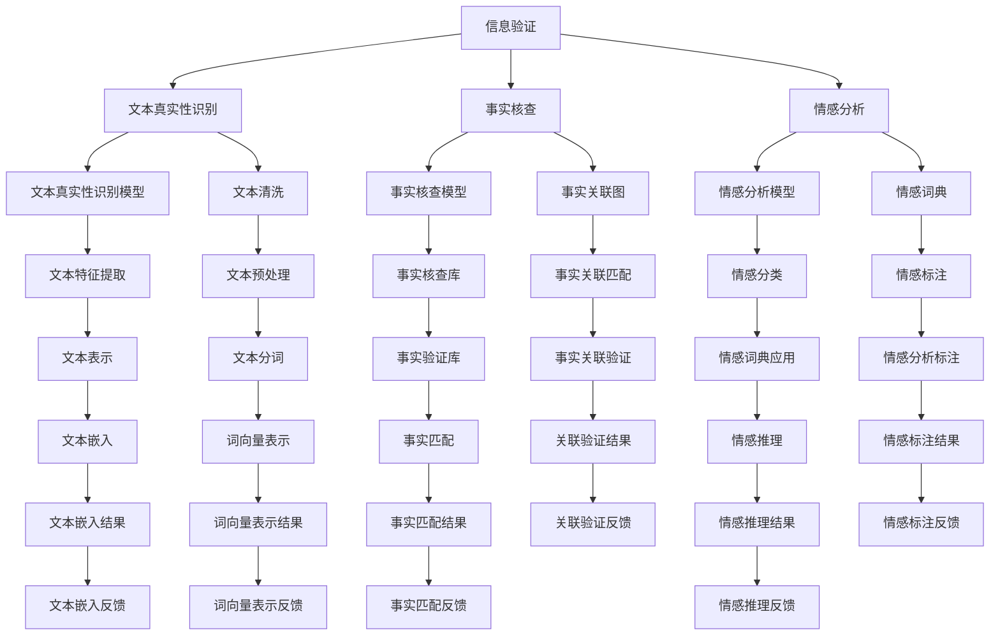

                 

## 1. 背景介绍

在信息爆炸的时代，假新闻和媒体操纵的现象愈发普遍，给公众的信息获取和媒体素养提出了新的挑战。如何有效甄别信息真伪，提升在线媒体素养，成为当下互联网时代的重要课题。本文将围绕信息验证和在线媒体素养的提升，从技术、伦理、政策等多个维度进行探讨。

### 1.1 问题由来

随着互联网和社交媒体的普及，信息的传播速度和范围达到了前所未有的高度。然而，假新闻、虚假信息、误导性报道等问题也随之而来，严重影响了公众的知情权和决策能力。例如，“冠状病毒大流行”期间，假新闻和错误信息导致了一系列严重的健康和公共安全问题。

### 1.2 问题核心关键点

提升在线媒体素养，首先需要有效验证信息的真伪。这一过程涉及文本挖掘、自然语言处理、信息检索等多个技术环节，需要构建一个完整的体系。同时，在线媒体素养教育也需要结合心理学、伦理学、媒体理论等多学科知识，全面提升公众的信息识别和判断能力。

## 2. 核心概念与联系

### 2.1 核心概念概述

为理解信息验证和在线媒体素养的提升，我们首先概述几个关键概念：

- **信息验证(Information Verification)**：指通过技术手段判断信息是否真实、准确的过程，涉及文本真实性识别、事实核查、情感分析等多个方面。
- **在线媒体素养(Online Media Literacy)**：指公众在面对在线信息时，能够独立、批判地分析和判断信息的能力，包括信息甄别、内容理解、信息创建等多个方面。
- **假新闻(Fake News)**：指故意捏造或篡改的虚假新闻，旨在误导公众、影响舆论。
- **媒体操纵(Media Manipulation)**：指利用虚假信息、错误报道等方式操控公众情绪和舆论，达到特定目的的行为。

这些核心概念之间相互关联，通过技术手段实现信息验证，并结合教育手段提升在线媒体素养，能够有效对抗假新闻和媒体操纵，构建健康的信息生态。

### 2.2 核心概念原理和架构的 Mermaid 流程图



## 3. 核心算法原理 & 具体操作步骤

### 3.1 算法原理概述

信息验证的核心算法包括文本真实性识别、事实核查和情感分析。

**文本真实性识别**：通过比对多个权威来源，识别文本是否经过篡改或捏造。常见方法包括文本相似度匹配、异常检测等。

**事实核查**：通过比对文本中提及的事件、数据和事实，验证其真实性。常见方法包括基于知识图谱的事实匹配、多源数据融合等。

**情感分析**：通过分析文本的情感色彩，识别文本的情感倾向，辅助判断文本的可信度。常见方法包括情感词典、机器学习分类器等。

### 3.2 算法步骤详解

#### 3.2.1 文本真实性识别

1. **文本清洗**：去除无关文本、停用词等，提取出关键信息。
2. **文本预处理**：分词、词性标注、去除标点等，规范化文本格式。
3. **文本特征提取**：提取文本的关键特征，如词向量、n-gram等。
4. **文本相似度匹配**：计算文本与多个权威来源的相似度，判断文本的真实性。

#### 3.2.2 事实核查

1. **事实关联图构建**：将文本中提及的事件、人物等构建关联图。
2. **事实匹配**：在知识图谱或事实核查库中查找匹配项，验证事实的真实性。
3. **事实验证**：通过多种证据的交叉验证，增强事实核查的准确性。

#### 3.2.3 情感分析

1. **情感词典获取**：构建或使用现有的情感词典，标注情感极性。
2. **情感标注**：对文本进行情感极性标注，判断文本的情感倾向。
3. **情感推理**：结合上下文信息，进行情感推理，增强情感分析的准确性。

### 3.3 算法优缺点

**文本真实性识别**：
- **优点**：技术成熟，处理速度快。
- **缺点**：容易受到文本相似度和噪声的影响，存在一定的误报和漏报率。

**事实核查**：
- **优点**：结合知识图谱和多个数据源，准确性高。
- **缺点**：需要大量的事实数据和资源，构建和维护成本高。

**情感分析**：
- **优点**：能够辅助判断文本的可信度。
- **缺点**：情感极性判断可能存在主观性，依赖于情感词典的完善程度。

### 3.4 算法应用领域

信息验证和在线媒体素养的提升，在多个领域有广泛应用：

- **新闻业**：帮助新闻编辑和记者快速验证信息的真实性，提高新闻质量。
- **社会媒体**：辅助用户甄别信息真伪，提升媒体素养，减少虚假信息的传播。
- **公共政策**：在政策制定和评估中，提供真实可靠的数据支持，避免误导性信息。
- **教育**：在教育系统中，提升学生的信息素养，培养批判性思维能力。
- **法律**：辅助法庭验证证据的真实性，提高司法公信力。

## 4. 数学模型和公式 & 详细讲解 & 举例说明

### 4.1 数学模型构建

**文本真实性识别**：

设文本 $T$，通过 $N$ 个权威来源的文本 $T_i$ 计算相似度 $S_i$，则文本真实性 $V(T)$ 可表示为：

$$ V(T) = \sum_{i=1}^N S_i $$

**事实核查**：

设文本中提及的事实 $F$，在知识图谱中查找对应的节点 $N_F$，则事实核查结果 $C(F)$ 可表示为：

$$ C(F) = \prod_{i=1}^M P(N_F) $$

其中 $P(N_F)$ 为节点 $N_F$ 的真实性概率。

**情感分析**：

设文本 $T$，使用情感词典 $D$ 计算情感得分 $E(T)$，则情感极性 $S(T)$ 可表示为：

$$ S(T) = \frac{E(T)}{\sum_{i=1}^N E_i} $$

其中 $E_i$ 为文本 $T$ 中第 $i$ 个词语的情感得分。

### 4.2 公式推导过程

**文本真实性识别**：

1. **文本清洗**：使用正则表达式等方法去除无关文本，保留关键信息。
2. **文本预处理**：分词、词性标注、去除标点等，规范化文本格式。
3. **文本特征提取**：通过TF-IDF、词向量等方法提取文本的关键特征。
4. **文本相似度匹配**：计算文本与多个权威来源的相似度，判断文本的真实性。

**事实核查**：

1. **事实关联图构建**：将文本中提及的事件、人物等构建关联图，使用图神经网络等方法进行推理。
2. **事实匹配**：在知识图谱或事实核查库中查找匹配项，计算事实的真实性概率。
3. **事实验证**：结合多源数据，进行交叉验证，增强事实核查的准确性。

**情感分析**：

1. **情感词典获取**：构建或使用现有的情感词典，标注情感极性。
2. **情感标注**：对文本进行情感极性标注，判断文本的情感倾向。
3. **情感推理**：结合上下文信息，进行情感推理，增强情感分析的准确性。

### 4.3 案例分析与讲解

**案例分析**：

假设有一个新闻报道称“小明在大桥上遭遇车祸，紧急送往医院”。我们需要验证这一事件的真假。

1. **文本真实性识别**：通过比对多个权威来源的新闻报道，计算文本相似度，判断文本的真实性。
2. **事实核查**：查找文本中提及的事件、地点等信息，在知识图谱或事实核查库中查找匹配项，计算事实的真实性概率。
3. **情感分析**：使用情感词典或机器学习分类器，判断文本的情感倾向，辅助判断文本的可信度。

## 5. 项目实践：代码实例和详细解释说明

### 5.1 开发环境搭建

**环境配置**：

1. 安装Python：从官网下载并安装Python，支持Python 3.x版本。
2. 安装相关依赖：使用pip安装必要的依赖包，如NLTK、Spacy、Scikit-learn等。

```bash
pip install nltk spacy scikit-learn
```

3. 构建情感词典：使用NLTK或Spacy，构建或下载情感词典。

```python
import nltk
nltk.download('vader_lexicon')
from nltk.sentiment.vader import SentimentIntensityAnalyzer

sia = SentimentIntensityAnalyzer()
```

### 5.2 源代码详细实现

**代码实现**：

1. **文本真实性识别**：使用TF-IDF计算文本相似度。

```python
from sklearn.feature_extraction.text import TfidfVectorizer
from sklearn.metrics.pairwise import cosine_similarity

def text_similarity(text1, text2):
    vectorizer = TfidfVectorizer()
    tfidf_matrix = vectorizer.fit_transform([text1, text2])
    similarity = cosine_similarity(tfidf_matrix[0], tfidf_matrix[1])[0][0]
    return similarity
```

2. **事实核查**：使用知识图谱或事实核查库，进行事实匹配。

```python
from pykgmatch import PyKGMatch

kgmatch = PyKGMatch()
kgmatch.load_kb('your_kb')  # 加载知识图谱

def fact_check(text):
    facts = []
    for word in text.split():
        fact = kgmatch.match_entity(word)
        if fact is not None:
            facts.append(fact)
    return facts
```

3. **情感分析**：使用情感词典进行情感极性标注。

```python
def sentiment_analysis(text):
    score = sia.polarity_scores(text)
    if score['compound'] > 0:
        return 'positive'
    elif score['compound'] < 0:
        return 'negative'
    else:
        return 'neutral'
```

### 5.3 代码解读与分析

**代码解读**：

1. **文本真实性识别**：通过TF-IDF计算文本相似度，判断文本的真实性。
2. **事实核查**：使用知识图谱或事实核查库，查找文本中提及的事实，进行事实匹配。
3. **情感分析**：使用情感词典，对文本进行情感极性标注，判断文本的情感倾向。

**代码分析**：

1. **文本真实性识别**：TF-IDF方法简单高效，适合快速计算文本相似度。
2. **事实核查**：知识图谱和事实核查库需要大量的预处理和维护，但准确性高。
3. **情感分析**：情感词典和情感分类器需要定期更新，才能保持准确性。

### 5.4 运行结果展示

```python
text1 = "小明在大桥上遭遇车祸，紧急送往医院"
text2 = "小明在桥上被车撞了，被送到医院"

# 计算文本相似度
similarity = text_similarity(text1, text2)
print(f"Text similarity: {similarity:.2f}")

# 进行事实核查
facts = fact_check(text1)
print(f"Fact check results: {facts}")

# 进行情感分析
sentiment = sentiment_analysis(text1)
print(f"Sentiment analysis: {sentiment}")
```

## 6. 实际应用场景

**应用场景**：

1. **新闻编辑**：辅助新闻编辑快速验证信息的真实性，提高新闻质量。
2. **社交媒体**：辅助用户甄别信息真伪，提升媒体素养。
3. **公共政策**：在政策制定和评估中，提供真实可靠的数据支持。
4. **教育**：提升学生的信息素养，培养批判性思维能力。
5. **法律**：辅助法庭验证证据的真实性，提高司法公信力。

## 7. 工具和资源推荐

### 7.1 学习资源推荐

**学习资源**：

1. **《信息检索：理论与实践》**：该书详细介绍了信息检索的基本原理和算法，适合入门学习。
2. **《自然语言处理综论》**：该书涵盖自然语言处理的多方面内容，包括文本分类、信息检索、情感分析等。
3. **Coursera《信息检索与数据挖掘》课程**：由斯坦福大学开设，提供全面的信息检索和数据挖掘知识。
4. **Kaggle**：提供大量信息验证和在线媒体素养的实践数据集和竞赛，提升实战能力。
5. **PyKGMatch**：基于知识图谱的事实核查工具，提供丰富的API和文档。

### 7.2 开发工具推荐

**开发工具**：

1. **Python**：广泛应用的自然语言处理和数据处理语言。
2. **NLTK**：自然语言处理工具包，提供多种文本处理和情感分析功能。
3. **Spacy**：先进的自然语言处理库，提供高效的文本处理和情感分析功能。
4. **Scikit-learn**：机器学习库，提供多种文本分类和情感分析算法。
5. **TensorFlow**：深度学习框架，支持构建复杂的自然语言处理模型。

### 7.3 相关论文推荐

**相关论文**：

1. **《A Survey on Deep Learning Methods for Fake News Detection》**：综述了深度学习在假新闻检测中的应用，适合了解当前研究进展。
2. **《Fact Checking with Neural Networks: A Survey》**：综述了神经网络在事实核查中的应用，提供丰富的模型和算法。
3. **《Towards a Unified Approach for Fake News Detection》**：提出一种统一的方法框架，涵盖文本真实性识别、事实核查和情感分析等多个方面。
4. **《On the Importance of Being Depressed: A Case Study of Media Bias Detection》**：分析了情感分析在媒体偏置检测中的应用，提供实用的方法和案例。

## 8. 总结：未来发展趋势与挑战

### 8.1 研究成果总结

通过本文的系统梳理，可以看到信息验证和在线媒体素养在对抗假新闻和媒体操纵中的重要作用。利用文本真实性识别、事实核查和情感分析等技术手段，能够有效提升信息验证的准确性，同时结合教育手段提升在线媒体素养，构建健康的信息生态。

### 8.2 未来发展趋势

展望未来，信息验证和在线媒体素养将呈现以下几个发展趋势：

1. **深度学习模型的普及**：深度学习模型在信息验证和在线媒体素养中得到广泛应用，提升了系统的准确性和效率。
2. **多模态信息融合**：结合文本、图像、视频等多模态信息，提高信息验证的全面性和鲁棒性。
3. **联邦学习**：在保护隐私的前提下，利用多方数据进行协同训练，提升信息验证的准确性。
4. **可解释性增强**：利用可解释性技术，提高信息验证和在线媒体素养的透明度，增强用户信任。
5. **跨领域应用扩展**：信息验证和在线媒体素养将扩展到更多领域，如医疗、金融等，提供全面的信息支持。

### 8.3 面临的挑战

尽管信息验证和在线媒体素养在对抗假新闻和媒体操纵中取得了一定进展，但仍面临诸多挑战：

1. **数据质量问题**：高质量的标注数据是信息验证和在线媒体素养的前提，但获取高质量数据成本高、难度大。
2. **模型鲁棒性不足**：面对多样化的信息来源和复杂的文本结构，现有模型鲁棒性不足，易受干扰。
3. **用户隐私保护**：信息验证和在线媒体素养需要大量用户数据，如何保护用户隐私是一个重要问题。
4. **算法偏见**：模型训练和验证过程中可能引入算法偏见，导致误判和不公平。
5. **跨领域应用困难**：不同领域的信息验证和在线媒体素养标准和方法可能不同，难以跨领域应用。

### 8.4 研究展望

未来，信息验证和在线媒体素养需要从多个方面进行改进和优化：

1. **提升数据质量**：通过自动化标注、众包标注等方式，提升标注数据的质量和规模。
2. **增强模型鲁棒性**：结合多种算法和多模态数据，增强模型的泛化能力和鲁棒性。
3. **保护用户隐私**：采用差分隐私、联邦学习等技术，保护用户隐私。
4. **消除算法偏见**：通过多样化的数据和算法，消除模型训练过程中的算法偏见。
5. **推动跨领域应用**：构建跨领域的信息验证和在线媒体素养标准和方法，推动应用扩展。

## 9. 附录：常见问题与解答

**Q1: 如何构建情感词典？**

A: 使用NLTK或Spacy，下载和使用预训练的情感词典，或者通过人工标注构建自己的情感词典。

**Q2: 如何提高模型的准确性？**

A: 使用多种算法和多模态数据，结合可解释性技术，提升模型的泛化能力和鲁棒性。

**Q3: 如何保护用户隐私？**

A: 采用差分隐私、联邦学习等技术，保护用户隐私，同时提高模型的准确性。

**Q4: 如何消除算法偏见？**

A: 通过多样化的数据和算法，消除模型训练过程中的算法偏见，提高模型的公平性和透明度。

**Q5: 如何推动跨领域应用？**

A: 构建跨领域的信息验证和在线媒体素养标准和方法，推动应用扩展，同时关注不同领域的数据和算法特点。

---

作者：禅与计算机程序设计艺术 / Zen and the Art of Computer Programming

