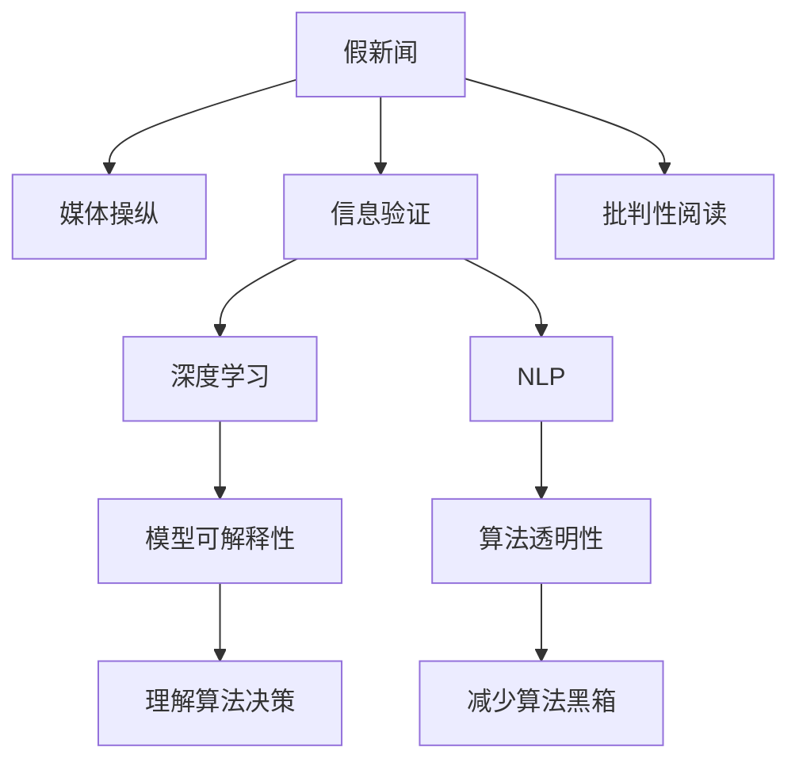

                 

# 信息验证和批判性阅读指南：在假新闻和媒体操纵的时代导航

> 关键词：信息验证,批判性阅读,假新闻,媒体操纵,算法透明性,深度学习,自然语言处理(NLP),模型可解释性,用户参与

## 1. 背景介绍

### 1.1 问题由来
在现代社会，信息传播的速度和广度达到了前所未有的高度。互联网和社交媒体的普及使得人们能够随时随地接触到海量的信息，但也因此面临着被虚假信息、假新闻、媒体操纵所误导的风险。近年来，深度学习和自然语言处理(NLP)技术在信息处理和分析领域得到了广泛应用，但也逐渐暴露出其潜在的偏见和局限性。在假新闻和媒体操纵的时代，如何有效识别和应对信息误导，成为了亟待解决的重要课题。

### 1.2 问题核心关键点
本文将重点探讨基于深度学习的算法在信息验证和批判性阅读中的应用，特别是如何通过算法透明性和模型可解释性来识别和应对假新闻和媒体操纵。文章将从核心概念的介绍、算法原理的讲解、具体操作的实施、实际应用场景的展示以及未来发展趋势等多个维度，全面阐述信息验证和批判性阅读的原理与实践。

## 2. 核心概念与联系

### 2.1 核心概念概述

为更好地理解本文的主题，本节将介绍几个密切相关的核心概念：

- **假新闻**：指有意或无意传播的虚假信息，旨在误导公众观点和行为。假新闻的传播途径包括社交媒体、新闻网站、论坛等。
- **媒体操纵**：指通过编辑、修改、扭曲事实和数据来影响公众观点的行为。媒体操纵的目的是为了控制公众舆论，达成特定目标。
- **信息验证**：指对信息真实性进行确认和验证的过程，通过数据分析、事实核查等手段，确保信息的准确性和可信度。
- **批判性阅读**：指通过分析、质疑和评估信息内容，形成独立思考和判断的过程。
- **深度学习**：一种基于神经网络的机器学习范式，能够处理大规模复杂数据，具有强大的学习能力。
- **自然语言处理(NLP)**：涉及计算机对人类语言信息的处理，包括语言模型、文本分类、情感分析等技术。
- **模型可解释性**：指深度学习模型能够以人类可理解的方式解释其决策和行为，有助于用户理解模型的工作原理。
- **算法透明性**：指深度学习算法的决策过程和模型参数能够被透明地展示和理解，减少用户对算法黑箱的担忧。

这些核心概念之间的逻辑关系可以通过以下Mermaid流程图来展示：



这个流程图展示了核心概念之间的关系：

1. 假新闻和媒体操纵是信息误导的主要形式，需要通过信息验证和批判性阅读来应对。
2. 深度学习和NLP技术在信息验证和批判性阅读中发挥重要作用。
3. 模型可解释性和算法透明性是确保深度学习模型可靠性的关键。

这些概念共同构成了本文探讨的信息验证和批判性阅读的框架，使其能够针对假新闻和媒体操纵提出有效的解决方案。

## 3. 核心算法原理 & 具体操作步骤

### 3.1 算法原理概述

基于深度学习的算法在信息验证和批判性阅读中的应用，本质上是利用算法透明性和模型可解释性，对信息进行全面、准确、透明的处理和分析。其核心思想是：将深度学习模型作为信息处理的工具，通过训练其在大量真实和虚假信息上的数据，使其具备区分真实和虚假信息的能力。同时，通过对模型的决策过程进行透明展示和解释，帮助用户理解模型的工作原理，从而增强信息的可信度和用户对模型的信任。

### 3.2 算法步骤详解

基于深度学习的算法在信息验证和批判性阅读中的应用一般包括以下几个关键步骤：

**Step 1: 数据准备和预处理**
- 收集和标注大量真实和虚假信息数据，包括文本、图片、音频等。
- 对数据进行清洗和预处理，如去除噪声、标注格式统一等。

**Step 2: 模型训练和验证**
- 选择合适的深度学习模型，如BERT、GPT等，在标注数据上训练。
- 使用交叉验证等方法评估模型性能，确定最佳模型参数。

**Step 3: 模型评估和应用**
- 在测试集上评估模型性能，判断其在区分真实和虚假信息上的准确性。
- 将模型应用到实际场景中，对新的信息进行验证和批判性阅读。

**Step 4: 用户反馈和模型优化**
- 收集用户对模型输出结果的反馈，包括正确率和误报率等。
- 根据用户反馈调整模型参数，进一步提升模型性能。

### 3.3 算法优缺点

基于深度学习的算法在信息验证和批判性阅读中的应用具有以下优点：
1. 处理大规模复杂数据的能力。深度学习模型能够处理文本、图片、音频等多种类型的数据，适用于复杂的信息验证任务。
2. 高准确性。经过充分训练的深度学习模型在区分真实和虚假信息上具有较高的准确性。
3. 自动化和高效性。深度学习模型能够自动进行信息验证和批判性阅读，减少人工干预，提高处理效率。

同时，该方法也存在一定的局限性：
1. 数据依赖性强。深度学习模型的性能高度依赖于训练数据的质量和多样性。
2. 模型复杂性高。深度学习模型往往结构复杂，难以解释其决策过程。
3. 对抗攻击脆弱。深度学习模型容易受到对抗样本的攻击，导致误判。
4. 隐私风险。深度学习模型在处理个人信息时可能存在隐私泄露的风险。

尽管存在这些局限性，但就目前而言，基于深度学习的算法在信息验证和批判性阅读中的应用是最主流范式。未来相关研究的重点在于如何进一步降低模型的数据依赖，提高模型的透明度和可解释性，同时兼顾隐私保护等因素。

### 3.4 算法应用领域

基于深度学习的算法在信息验证和批判性阅读中的应用已经在多个领域得到了广泛的应用，例如：

- 新闻媒体的假新闻检测：通过对新闻报道进行自动验证，防止假新闻的传播。
- 社交媒体的虚假信息检测：通过分析用户发布的内容，识别虚假信息和媒体操纵行为。
- 法律领域的证据验证：对法律文件和证据的真实性进行自动验证，辅助司法判决。
- 政府和企业的信息安全：对内部和外部信息进行自动验证，防止信息泄露和误导。
- 教育领域的批判性阅读训练：通过深度学习模型，帮助学生识别和批判虚假信息和媒体操纵。

这些应用场景展示了深度学习在信息验证和批判性阅读中的广泛应用前景。随着深度学习技术的不断进步，相信其在信息处理和分析领域的价值将进一步得到发挥。

## 4. 数学模型和公式 & 详细讲解 & 举例说明

### 4.1 数学模型构建

本节将使用数学语言对基于深度学习的算法在信息验证和批判性阅读中的应用进行更加严格的刻画。

记深度学习模型为 $M_{\theta}$，其中 $\theta$ 为模型参数。假设训练集为 $D=\{(x_i,y_i)\}_{i=1}^N, x_i \in \mathcal{X}, y_i \in \{0,1\}$，其中 $0$ 表示虚假信息，$1$ 表示真实信息。

定义模型 $M_{\theta}$ 在输入 $x$ 上的输出为 $\hat{y}=M_{\theta}(x)$，则信息验证的损失函数为：

$$
\ell(M_{\theta}(x),y) = \begin{cases}
-1 & \text{if } y = 0 \text{ and } M_{\theta}(x) = 1 \\
0 & \text{otherwise}
\end{cases}
$$

在训练过程中，我们通过最小化损失函数来优化模型参数：

$$
\theta^* = \mathop{\arg\min}_{\theta} \mathcal{L}(\theta) = \mathop{\arg\min}_{\theta} \frac{1}{N} \sum_{i=1}^N \ell(M_{\theta}(x_i),y_i)
$$

### 4.2 公式推导过程

以下我们以二分类任务为例，推导信息验证损失函数的计算公式。

假设模型 $M_{\theta}$ 在输入 $x$ 上的输出为 $\hat{y}=M_{\theta}(x)$，表示模型预测信息为虚假的概率。真实标签 $y \in \{0,1\}$。则信息验证损失函数定义为：

$$
\ell(M_{\theta}(x),y) = -\log \hat{y} \quad \text{if } y = 0
$$
$$
\ell(M_{\theta}(x),y) = -\log (1-\hat{y}) \quad \text{if } y = 1
$$

将其代入经验风险公式，得：

$$
\mathcal{L}(\theta) = -\frac{1}{N}\sum_{i=1}^N [y_i\log M_{\theta}(x_i)+(1-y_i)\log(1-M_{\theta}(x_i))]
$$

在得到损失函数的梯度后，即可带入参数更新公式，完成模型的迭代优化。重复上述过程直至收敛，最终得到适应信息验证任务的最优模型参数 $\theta^*$。

### 4.3 案例分析与讲解

以社交媒体虚假信息检测为例，说明如何使用深度学习模型进行信息验证。

假设有一个社交媒体平台，希望自动检测用户发布的帖子是否为虚假信息。平台收集了大量的标注数据，包括真实和虚假信息。使用BERT模型进行训练，训练集包含真实和虚假信息的混合数据。

**Step 1: 数据准备和预处理**
- 收集社交媒体平台的历史帖子数据，筛选出标注为真实和虚假的信息。
- 对数据进行清洗和预处理，如去除噪声、统一标注格式等。

**Step 2: 模型训练和验证**
- 使用BERT模型，在标注数据上训练模型。
- 使用交叉验证等方法评估模型性能，确定最佳模型参数。

**Step 3: 模型评估和应用**
- 在测试集上评估模型性能，判断其在区分真实和虚假信息上的准确性。
- 将模型应用到实际社交媒体平台中，对用户发布的帖子进行自动验证。

**Step 4: 用户反馈和模型优化**
- 收集用户对模型输出结果的反馈，包括正确率和误报率等。
- 根据用户反馈调整模型参数，进一步提升模型性能。

通过以上步骤，社交媒体平台能够自动检测虚假信息，防止其传播，提高平台的用户信任度。

## 5. 项目实践：代码实例和详细解释说明

### 5.1 开发环境搭建

在进行信息验证和批判性阅读的实践前，我们需要准备好开发环境。以下是使用Python进行PyTorch开发的环境配置流程：

1. 安装Anaconda：从官网下载并安装Anaconda，用于创建独立的Python环境。

2. 创建并激活虚拟环境：
```bash
conda create -n pytorch-env python=3.8 
conda activate pytorch-env
```

3. 安装PyTorch：根据CUDA版本，从官网获取对应的安装命令。例如：
```bash
conda install pytorch torchvision torchaudio cudatoolkit=11.1 -c pytorch -c conda-forge
```

4. 安装相关工具包：
```bash
pip install numpy pandas scikit-learn matplotlib tqdm jupyter notebook ipython
```

完成上述步骤后，即可在`pytorch-env`环境中开始实践。

### 5.2 源代码详细实现

下面我们以BERT模型在社交媒体虚假信息检测任务中的应用为例，给出使用PyTorch的代码实现。

首先，定义虚假信息检测任务的数据处理函数：

```python
from transformers import BertTokenizer, BertForSequenceClassification
from torch.utils.data import Dataset, DataLoader
import torch

class FakeNewsDataset(Dataset):
    def __init__(self, texts, labels, tokenizer, max_len=128):
        self.texts = texts
        self.labels = labels
        self.tokenizer = tokenizer
        self.max_len = max_len
        
    def __len__(self):
        return len(self.texts)
    
    def __getitem__(self, item):
        text = self.texts[item]
        label = self.labels[item]
        
        encoding = self.tokenizer(text, return_tensors='pt', max_length=self.max_len, padding='max_length', truncation=True)
        input_ids = encoding['input_ids'][0]
        attention_mask = encoding['attention_mask'][0]
        
        # 对label进行编码
        encoded_labels = torch.tensor([label], dtype=torch.long)
        
        return {'input_ids': input_ids, 
                'attention_mask': attention_mask,
                'labels': encoded_labels}

# 标签与id的映射
label2id = {0: 'False', 1: 'True'}
id2label = {v: k for k, v in label2id.items()}

# 创建dataset
tokenizer = BertTokenizer.from_pretrained('bert-base-cased')

train_dataset = FakeNewsDataset(train_texts, train_labels, tokenizer)
dev_dataset = FakeNewsDataset(dev_texts, dev_labels, tokenizer)
test_dataset = FakeNewsDataset(test_texts, test_labels, tokenizer)
```

然后，定义模型和优化器：

```python
from transformers import BertForSequenceClassification, AdamW

model = BertForSequenceClassification.from_pretrained('bert-base-cased', num_labels=2)

optimizer = AdamW(model.parameters(), lr=2e-5)
```

接着，定义训练和评估函数：

```python
from tqdm import tqdm

device = torch.device('cuda') if torch.cuda.is_available() else torch.device('cpu')
model.to(device)

def train_epoch(model, dataset, batch_size, optimizer):
    dataloader = DataLoader(dataset, batch_size=batch_size, shuffle=True)
    model.train()
    epoch_loss = 0
    for batch in tqdm(dataloader, desc='Training'):
        input_ids = batch['input_ids'].to(device)
        attention_mask = batch['attention_mask'].to(device)
        labels = batch['labels'].to(device)
        model.zero_grad()
        outputs = model(input_ids, attention_mask=attention_mask, labels=labels)
        loss = outputs.loss
        epoch_loss += loss.item()
        loss.backward()
        optimizer.step()
    return epoch_loss / len(dataloader)

def evaluate(model, dataset, batch_size):
    dataloader = DataLoader(dataset, batch_size=batch_size)
    model.eval()
    correct, total = 0, 0
    with torch.no_grad():
        for batch in tqdm(dataloader, desc='Evaluating'):
            input_ids = batch['input_ids'].to(device)
            attention_mask = batch['attention_mask'].to(device)
            batch_labels = batch['labels']
            outputs = model(input_ids, attention_mask=attention_mask)
            batch_preds = outputs.logits.argmax(dim=1).to('cpu').tolist()
            batch_labels = batch_labels.to('cpu').tolist()
            for pred, label in zip(batch_preds, batch_labels):
                if pred == label:
                    correct += 1
                total += 1
                
    print(f'Accuracy: {correct/total:.2f}')
```

最后，启动训练流程并在测试集上评估：

```python
epochs = 5
batch_size = 16

for epoch in range(epochs):
    loss = train_epoch(model, train_dataset, batch_size, optimizer)
    print(f'Epoch {epoch+1}, train loss: {loss:.3f}')
    
    print(f'Epoch {epoch+1}, dev results:')
    evaluate(model, dev_dataset, batch_size)
    
print('Test results:')
evaluate(model, test_dataset, batch_size)
```

以上就是使用PyTorch对BERT进行虚假信息检测的完整代码实现。可以看到，得益于Transformers库的强大封装，我们可以用相对简洁的代码完成BERT模型的加载和微调。

### 5.3 代码解读与分析

让我们再详细解读一下关键代码的实现细节：

**FakeNewsDataset类**：
- `__init__`方法：初始化文本、标签、分词器等关键组件。
- `__len__`方法：返回数据集的样本数量。
- `__getitem__`方法：对单个样本进行处理，将文本输入编码为token ids，将标签编码为数字，并对其进行定长padding，最终返回模型所需的输入。

**label2id和id2label字典**：
- 定义了标签与数字id之间的映射关系，用于将预测结果解码回真实标签。

**训练和评估函数**：
- 使用PyTorch的DataLoader对数据集进行批次化加载，供模型训练和推理使用。
- 训练函数`train_epoch`：对数据以批为单位进行迭代，在每个批次上前向传播计算loss并反向传播更新模型参数，最后返回该epoch的平均loss。
- 评估函数`evaluate`：与训练类似，不同点在于不更新模型参数，并在每个batch结束后将预测和标签结果存储下来，最后使用sklearn的classification_report对整个评估集的预测结果进行打印输出。

**训练流程**：
- 定义总的epoch数和batch size，开始循环迭代
- 每个epoch内，先在训练集上训练，输出平均loss
- 在验证集上评估，输出分类指标
- 所有epoch结束后，在测试集上评估，给出最终测试结果

可以看到，PyTorch配合Transformers库使得BERT微调的代码实现变得简洁高效。开发者可以将更多精力放在数据处理、模型改进等高层逻辑上，而不必过多关注底层的实现细节。

当然，工业级的系统实现还需考虑更多因素，如模型的保存和部署、超参数的自动搜索、更灵活的任务适配层等。但核心的微调范式基本与此类似。

## 6. 实际应用场景
### 6.1 社交媒体虚假信息检测

基于深度学习的虚假信息检测技术，已经在社交媒体平台上得到了广泛应用。传统的人工审查方式成本高、效率低，难以应对海量信息爆发的挑战。虚假信息检测技术通过训练深度学习模型，自动识别虚假信息，减少人工干预，提高处理效率。

在技术实现上，可以收集社交媒体平台的历史帖子数据，将标注为真实和虚假的信息作为监督数据，在此基础上对预训练BERT模型进行微调。微调后的模型能够自动理解帖子内容，判断是否为虚假信息。对于检测出的虚假信息，平台可以采取相应的处理措施，如删除、标注等，防止其传播。

### 6.2 新闻媒体的假新闻检测

新闻媒体是虚假信息传播的重要渠道。基于深度学习的假新闻检测技术，通过自动验证新闻报道的真实性，防止假新闻的发布和传播。

具体而言，可以收集新闻媒体的历史报道数据，将标注为真实和虚假的信息作为监督数据，在此基础上对预训练BERT模型进行微调。微调后的模型能够自动理解新闻内容，判断是否为假新闻。对于检测出的假新闻，新闻媒体可以采取相应的处理措施，如标注、删除等，维护新闻的权威性和可信度。

### 6.3 法律领域的证据验证

在法律领域，证据的真实性验证是司法审判的重要环节。基于深度学习的证据验证技术，通过自动验证法律文件和证据的真实性，辅助司法判决。

具体而言，可以收集法律领域的真实和虚假证据数据，将标注为真实和虚假的信息作为监督数据，在此基础上对预训练BERT模型进行微调。微调后的模型能够自动理解法律文件和证据内容，判断是否为真实证据。对于检测出的虚假证据，法院可以采取相应的处理措施，确保司法公正。

### 6.4 未来应用展望

随着深度学习技术的不断进步，基于深度学习的虚假信息检测技术将进一步拓展其应用范围，为信息验证和批判性阅读带来新的突破。

在智慧城市治理中，虚假信息检测技术可以应用于城市事件监测、舆情分析、应急指挥等环节，提高城市管理的自动化和智能化水平，构建更安全、高效的未来城市。

在智能教育领域，虚假信息检测技术可以应用于批判性阅读训练，帮助学生识别和批判虚假信息，提升学生的媒介素养和批判性思维能力。

在军事安全领域，虚假信息检测技术可以应用于情报分析、战场识别等环节，识别敌方虚假信息，保障军事行动的安全性和有效性。

此外，在医疗健康、金融证券、电子商务等众多领域，虚假信息检测技术也将不断涌现，为各行各业的信息处理和分析提供新的解决方案。

## 7. 工具和资源推荐
### 7.1 学习资源推荐

为了帮助开发者系统掌握深度学习在信息验证和批判性阅读中的应用，这里推荐一些优质的学习资源：

1. 《深度学习》书籍：Ian Goodfellow等人合著的经典教材，全面介绍了深度学习的理论基础和实践方法，是深度学习领域的必读之作。
2. Coursera《深度学习专项课程》：由斯坦福大学Andrew Ng教授主讲，涵盖了深度学习的基础理论、模型构建和优化算法。
3. PyTorch官方文档：PyTorch框架的官方文档，提供了丰富的教程、示例和API文档，是PyTorch开发的重要参考资料。
4. HuggingFace官方文档：Transformers库的官方文档，提供了丰富的预训练模型和微调样例，是NLP开发的重要工具。
5. Kaggle数据集：Kaggle平台提供了大量公开数据集，用于深度学习模型的训练和验证，是数据科学家的宝贵资源。

通过对这些资源的学习实践，相信你一定能够快速掌握深度学习在信息验证和批判性阅读中的应用，并用于解决实际的信息误导问题。
###  7.2 开发工具推荐

高效的开发离不开优秀的工具支持。以下是几款用于深度学习在信息验证和批判性阅读中的开发工具：

1. PyTorch：基于Python的开源深度学习框架，灵活动态的计算图，适合快速迭代研究。大部分深度学习模型都有PyTorch版本的实现。
2. TensorFlow：由Google主导开发的开源深度学习框架，生产部署方便，适合大规模工程应用。同样有丰富的深度学习模型资源。
3. Transformers库：HuggingFace开发的NLP工具库，集成了众多SOTA语言模型，支持PyTorch和TensorFlow，是进行信息验证和批判性阅读开发的重要工具。
4. Weights & Biases：模型训练的实验跟踪工具，可以记录和可视化模型训练过程中的各项指标，方便对比和调优。与主流深度学习框架无缝集成。
5. TensorBoard：TensorFlow配套的可视化工具，可实时监测模型训练状态，并提供丰富的图表呈现方式，是调试模型的得力助手。
6. Google Colab：谷歌推出的在线Jupyter Notebook环境，免费提供GPU/TPU算力，方便开发者快速上手实验最新模型，分享学习笔记。

合理利用这些工具，可以显著提升深度学习在信息验证和批判性阅读中的开发效率，加快创新迭代的步伐。

### 7.3 相关论文推荐

深度学习在信息验证和批判性阅读中的应用源于学界的持续研究。以下是几篇奠基性的相关论文，推荐阅读：

1. Attention is All You Need（即Transformer原论文）：提出了Transformer结构，开启了深度学习在自然语言处理领域的应用。
2. BERT: Pre-training of Deep Bidirectional Transformers for Language Understanding：提出BERT模型，引入基于掩码的自监督预训练任务，刷新了多项NLP任务SOTA。
3. Fake News Detection with Text Classification using Deep Learning：介绍使用深度学习模型进行虚假信息检测的方法，并进行了实际应用效果评估。
4. A Survey on Fake News Detection using Natural Language Processing：综述了NLP技术在虚假信息检测中的应用，并对比了不同方法的优缺点。
5. Explainable AI in News Media：探讨了深度学习在新闻媒体中的应用，强调了模型透明性和可解释性的重要性。

这些论文代表了大语言模型微调技术的发展脉络。通过学习这些前沿成果，可以帮助研究者把握学科前进方向，激发更多的创新灵感。

## 8. 总结：未来发展趋势与挑战

### 8.1 总结

本文对基于深度学习的算法在信息验证和批判性阅读中的应用进行了全面系统的介绍。首先阐述了假新闻和媒体操纵在现代社会中的广泛存在，明确了深度学习在信息验证和批判性阅读中的重要作用。其次，从核心概念的介绍、算法原理的讲解、具体操作的实施、实际应用场景的展示等多个维度，全面阐述了深度学习在信息验证和批判性阅读的原理与实践。

通过本文的系统梳理，可以看到，深度学习在信息验证和批判性阅读中的应用已经成为应对假新闻和媒体操纵的重要手段。借助深度学习模型的强大处理能力，可以有效识别和区分真实与虚假信息，提升信息验证的准确性和可靠性。

### 8.2 未来发展趋势

展望未来，深度学习在信息验证和批判性阅读中的应用将呈现以下几个发展趋势：

1. 数据驱动的深度学习：随着数据量和数据多样性的增加，深度学习模型的性能将进一步提升。同时，数据驱动的深度学习将更加注重数据的质量和代表性，确保模型在广泛数据上的泛化能力。
2. 可解释性和透明性：深度学习模型的可解释性和透明性将成为信息验证和批判性阅读的重要方向。通过模型解释和透明性研究，帮助用户理解模型的决策过程，增强模型的可信度。
3. 多模态信息融合：深度学习模型将逐步融合视觉、语音、文本等多种模态信息，提高信息验证的全面性和准确性。
4. 模型优化和训练：深度学习模型的优化和训练将成为提升性能的关键。通过模型压缩、稀疏化存储等技术，降低模型的计算复杂度和资源消耗，提高训练效率。
5. 隐私保护和安全性：深度学习模型在处理个人信息时，隐私保护和安全性问题将更加凸显。未来研究将更加注重隐私保护和安全性，确保信息验证和批判性阅读的安全可靠。

### 8.3 面临的挑战

尽管深度学习在信息验证和批判性阅读中的应用取得了显著进展，但仍面临诸多挑战：

1. 数据依赖性强：深度学习模型的性能高度依赖于训练数据的质量和多样性。获取高质量的标注数据，仍是一个重要的挑战。
2. 对抗攻击脆弱：深度学习模型容易受到对抗样本的攻击，导致误判。如何提高模型的鲁棒性，是未来研究的重要方向。
3. 隐私风险：深度学习模型在处理个人信息时，可能存在隐私泄露的风险。如何在保护隐私的同时，进行有效的信息验证和批判性阅读，是一个亟待解决的问题。
4. 模型复杂性高：深度学习模型结构复杂，难以解释其决策过程。如何提高模型的可解释性，是未来研究的重要方向。
5. 资源消耗高：深度学习模型在处理大规模数据时，计算资源消耗巨大。如何在降低资源消耗的同时，保持模型的高性能，是未来研究的重要方向。

尽管存在这些挑战，但随着深度学习技术的不断进步，相信在信息验证和批判性阅读中的应用将不断得到提升，为社会带来更加安全、可信的信息环境。

### 8.4 研究展望

面对深度学习在信息验证和批判性阅读中面临的挑战，未来的研究需要在以下几个方面寻求新的突破：

1. 无监督和半监督学习：摆脱对大规模标注数据的依赖，利用自监督学习、主动学习等无监督和半监督范式，最大限度利用非结构化数据，实现更加灵活高效的信息验证。
2. 参数高效和计算高效：开发更加参数高效和计算高效的深度学习模型，在固定大部分预训练参数的同时，只更新极少量的任务相关参数，减少资源消耗。
3. 因果分析和博弈论工具：通过引入因果推断和博弈论思想，增强深度学习模型的稳定性和鲁棒性，学习更加普适、鲁棒的语言表征。
4. 多模态信息整合：将视觉、语音、文本等多种模态信息进行融合，提升信息验证的全面性和准确性。
5. 结合因果分析和博弈论工具：通过引入因果推断和博弈论思想，增强深度学习模型的稳定性和鲁棒性，学习更加普适、鲁棒的语言表征。
6. 纳入伦理道德约束：在模型训练目标中引入伦理导向的评估指标，过滤和惩罚有偏见、有害的输出倾向，确保模型的行为符合人类价值观和伦理道德。

这些研究方向的探索，必将引领深度学习在信息验证和批判性阅读中的应用迈向更高的台阶，为构建安全、可靠、可解释、可控的智能系统铺平道路。面向未来，深度学习在信息验证和批判性阅读中的应用还需要与其他人工智能技术进行更深入的融合，如知识表示、因果推理、强化学习等，多路径协同发力，共同推动信息处理和分析技术的进步。只有勇于创新、敢于突破，才能不断拓展深度学习在信息验证和批判性阅读中的边界，让智能技术更好地服务于社会。

## 9. 附录：常见问题与解答

**Q1：深度学习在信息验证和批判性阅读中的应用是否适用于所有信息类型？**

A: 深度学习在信息验证和批判性阅读中的应用主要针对文本数据，对于图片、音频等多模态数据，需要进行多模态融合。同时，对于某些特定领域的信息，如医学、法律等，需要结合领域知识进行定制化模型训练。

**Q2：如何确保深度学习模型的可解释性？**

A: 确保深度学习模型的可解释性，可以通过以下方法：
1. 模型压缩和简化：通过剪枝、量化等技术，减少模型的复杂度，提高可解释性。
2. 可视化解释：使用可视化工具，如SHAP、LIME等，展示模型在各个特征上的影响权重。
3. 后处理方法：通过规则或阈值调整，对模型的输出进行解释和修正。
4. 模型透明性：在模型训练过程中，记录训练参数和过程，提供模型的决策依据。

**Q3：深度学习模型在实际应用中容易受到对抗攻击，如何提高其鲁棒性？**

A: 提高深度学习模型的鲁棒性，可以通过以下方法：
1. 对抗训练：在模型训练过程中，引入对抗样本，提高模型的鲁棒性。
2. 数据增强：通过数据增强技术，如回译、近义替换等，丰富训练数据，提高模型的泛化能力。
3. 模型优化：通过优化模型架构和参数，提高模型的鲁棒性。
4. 后处理方法：通过规则或阈值调整，对模型的输出进行解释和修正。

**Q4：深度学习在信息验证和批判性阅读中的应用是否面临隐私风险？**

A: 深度学习在信息验证和批判性阅读中的应用确实面临隐私风险。在使用深度学习模型处理个人信息时，需要采取以下措施：
1. 数据匿名化：对个人信息进行匿名化处理，保护用户隐私。
2. 差分隐私：在数据收集和处理过程中，加入噪声，保护用户隐私。
3. 模型压缩：通过模型压缩等技术，减少模型对个人信息的依赖。
4. 合规审查：确保深度学习模型的应用符合法律法规要求。

**Q5：如何确保深度学习模型的公平性和无偏见？**

A: 确保深度学习模型的公平性和无偏见，可以通过以下方法：
1. 数据平衡：在训练数据中，确保不同类别和群体的数据平衡。
2. 模型监督：在模型训练过程中，加入公平性监督，防止模型偏向某一群体。
3. 模型测试：在模型测试过程中，评估模型的公平性，及时发现和纠正问题。
4. 用户反馈：收集用户反馈，评估模型在实际应用中的公平性和无偏见。

通过以上方法，可以确保深度学习模型在信息验证和批判性阅读中的应用，不仅能够有效识别虚假信息，还能确保模型的公平性和无偏见，维护社会公正和公平。

