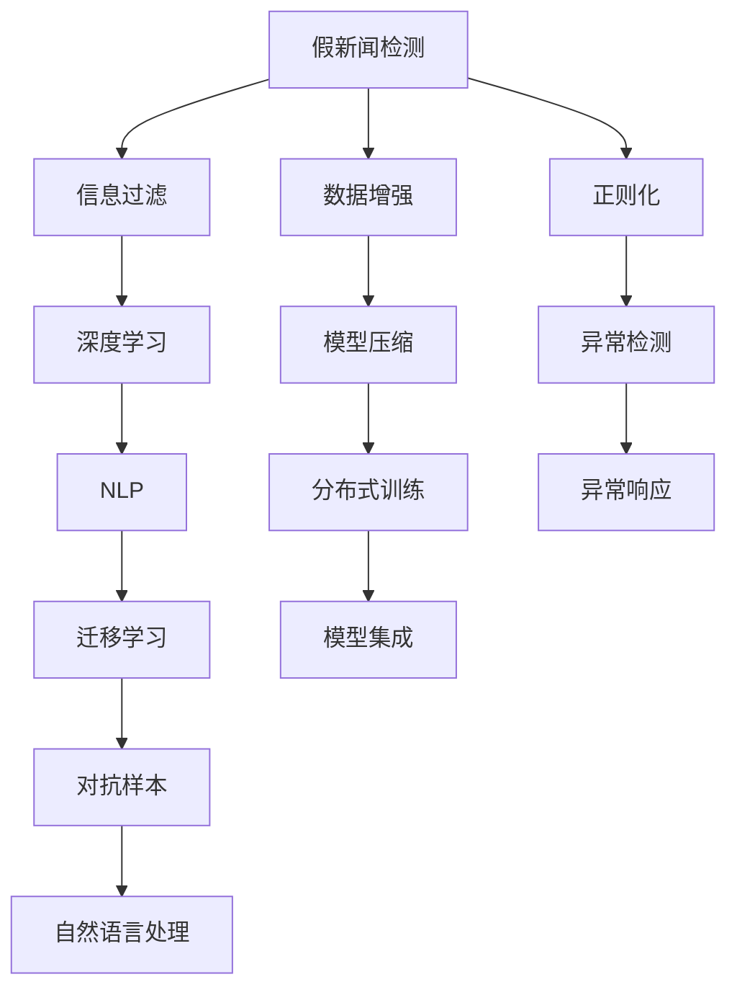

                 

# 信息验证和批判性阅读：在假新闻和媒体操纵时代导航

> 关键词：信息验证, 批判性阅读, 假新闻, 媒体操纵, 信息过滤, 深度学习

## 1. 背景介绍

### 1.1 问题由来

在信息爆炸的时代，互联网为公众提供了一个前所未有的信息获取平台。但与此同时，假新闻、虚假信息、媒体操纵等问题也日益突出。如何辨别真伪、筛选有价值的信息，成为每个人都需要面对的挑战。

假新闻、虚假信息往往以吸引眼球、误导公众为目的，通过夸大、扭曲、虚构事实，或以假乱真，或以真伪混编的方式，对公众认知造成干扰。特别是在社交媒体平台上，由于算法推荐机制的存在，假新闻更容易传播，给社会带来巨大影响。

媒体操纵则是通过有选择性地发布信息，误导公众，达到特定的政治、商业或其他目的。假新闻和媒体操纵不仅影响了社会舆论的公正性，还可能引发群体性的恐慌和冲突，甚至威胁到国家安全。

因此，如何辨别和抵制假新闻，培养公众的批判性阅读能力，成为当前信息时代的一个重要课题。本文将从技术角度出发，探讨利用深度学习技术进行信息验证和批判性阅读的方法，以期在假新闻和媒体操纵时代中导航。

### 1.2 问题核心关键点

本节将介绍几个密切相关的核心概念：

- **假新闻检测（Fake News Detection）**：使用深度学习模型对新闻的来源、内容进行识别，判断是否为假新闻。
- **信息过滤（Information Filtering）**：使用深度学习模型对新闻内容进行评分或分类，筛选出高质量的信息。
- **深度学习（Deep Learning）**：通过多层次的神经网络模型，自动从数据中学习特征和规律，实现高效的假新闻检测和信息过滤。
- **自然语言处理（NLP）**：应用深度学习技术处理和分析自然语言数据，提取关键信息，进行假新闻检测和信息过滤。
- **迁移学习（Transfer Learning）**：在通用任务上进行预训练，在小规模数据上进行微调，以提高假新闻检测和信息过滤的效果。
- **对抗样本（Adversarial Samples）**：在深度学习模型中引入对抗样本，训练模型具备对抗攻击的能力，以应对假新闻中的攻击和伪装。

这些核心概念之间的逻辑关系可以通过以下Mermaid流程图来展示：



这个流程图展示了好几种深度学习技术在假新闻检测和信息过滤中的关系：

1. 假新闻检测依赖于信息过滤，信息过滤又依赖于深度学习。
2. 自然语言处理是深度学习中重要的分支，用于处理文本数据。
3. 迁移学习可以加速模型在小规模数据上的训练，提高泛化能力。
4. 对抗样本可以帮助模型抵御攻击，提高模型的鲁棒性。
5. 数据增强和正则化是模型训练中的关键环节，用于提升模型的稳定性和泛化能力。
6. 模型压缩和异常检测可以提高模型的效率和安全性。
7. 分布式训练和模型集成可以进一步提升模型的性能和可靠性。

这些概念共同构成了深度学习在假新闻检测和信息过滤中的框架，使得我们能够系统地理解和应用这些技术。

## 2. 核心概念与联系

### 2.1 核心概念概述

为了更好地理解深度学习在假新闻检测和信息过滤中的应用，本节将介绍几个关键概念：

- **假新闻检测**：指使用深度学习模型对新闻的来源、内容进行识别，判断是否为假新闻。假新闻检测的目的是为了识别和删除假新闻，防止其传播。
- **信息过滤**：指使用深度学习模型对新闻内容进行评分或分类，筛选出高质量的信息。信息过滤的目的是为了提高信息的质量，减少噪音和干扰。
- **深度学习**：通过多层次的神经网络模型，自动从数据中学习特征和规律，实现高效的假新闻检测和信息过滤。深度学习在自然语言处理、图像处理、语音识别等领域都有广泛应用。
- **自然语言处理（NLP）**：应用深度学习技术处理和分析自然语言数据，提取关键信息，进行假新闻检测和信息过滤。NLP在文本分类、情感分析、机器翻译等任务上都有重要应用。
- **迁移学习**：在通用任务上进行预训练，在小规模数据上进行微调，以提高假新闻检测和信息过滤的效果。迁移学习可以降低训练成本，提高模型泛化能力。
- **对抗样本**：在深度学习模型中引入对抗样本，训练模型具备对抗攻击的能力，以应对假新闻中的攻击和伪装。

这些概念之间的联系和互动关系如下：

1. **假新闻检测**和**信息过滤**都是深度学习在NLP领域的重要应用。
2. **深度学习**提供了强大的模型和算法，用于处理自然语言数据和构建假新闻检测模型。
3. **自然语言处理**是深度学习在NLP领域的基础，用于处理和分析文本数据。
4. **迁移学习**可以加速模型在小规模数据上的训练，提高模型的泛化能力。
5. **对抗样本**可以提高模型的鲁棒性，防止假新闻中的攻击和伪装。

通过理解这些核心概念及其联系，我们可以更好地把握深度学习在假新闻检测和信息过滤中的应用。

## 3. 核心算法原理 & 具体操作步骤

### 3.1 算法原理概述

假新闻检测和信息过滤的深度学习模型通常基于多层次的神经网络架构，如卷积神经网络（CNN）、循环神经网络（RNN）、长短期记忆网络（LSTM）、变压器（Transformer）等。这些模型通过学习大量数据，自动提取特征和规律，实现对新闻来源、内容、风格的识别和分类。

假新闻检测模型的输入通常包括新闻标题、正文、发布时间、作者等信息。模型通过这些输入数据，提取关键特征，如关键词、情感极性、风格特征等，进行假新闻的分类。

信息过滤模型的输入通常为新闻文本，输出为新闻的质量评分或标签。模型通过学习新闻内容的关键特征，如情感、风格、事实准确性等，进行信息筛选和分类。

### 3.2 算法步骤详解

假新闻检测和信息过滤的深度学习模型构建流程如下：

**Step 1: 数据准备和预处理**
- 收集假新闻和真新闻的数据集，包括标题、正文、发布时间、作者等信息。
- 对数据进行清洗和标注，去除噪音和干扰信息，保证数据质量。
- 对文本数据进行分词、去除停用词、词性标注等预处理操作。

**Step 2: 模型构建**
- 选择合适的深度学习模型架构，如CNN、RNN、LSTM、Transformer等。
- 设计模型的输入输出层，定义损失函数和优化器。
- 添加正则化技术，如L2正则、Dropout等，防止过拟合。

**Step 3: 模型训练和微调**
- 使用标注数据对模型进行训练，更新模型参数。
- 在训练过程中，加入对抗样本，训练模型具备对抗攻击的能力。
- 对模型进行微调，提高模型在特定任务上的泛化能力。

**Step 4: 模型评估和部署**
- 在测试集上评估模型性能，计算准确率、召回率、F1值等指标。
- 部署模型到实际应用中，对新数据进行预测和过滤。

### 3.3 算法优缺点

深度学习在假新闻检测和信息过滤中具有以下优点：
1. 自动提取特征：深度学习模型能够自动从数据中提取关键特征，无需手工设计特征。
2. 泛化能力强：通过迁移学习，深度学习模型可以在小规模数据上取得不错的性能。
3. 适应性强：深度学习模型能够适应不同领域、不同任务的数据，具有广泛的应用场景。
4. 可解释性差：深度学习模型通常是黑盒系统，难以解释其内部决策过程。

同时，深度学习在假新闻检测和信息过滤中也存在一些缺点：
1. 训练成本高：深度学习模型需要大量的标注数据和计算资源进行训练，训练成本较高。
2. 对抗攻击脆弱：深度学习模型容易受到对抗样本的攻击，造成误判。
3. 模型复杂度高：深度学习模型通常包含大量参数，模型复杂度较高，推理速度较慢。

### 3.4 算法应用领域

深度学习在假新闻检测和信息过滤中的应用领域广泛，主要包括以下几个方面：

- **新闻媒体平台**：在新闻媒体平台上，使用深度学习模型对新闻进行分类和筛选，防止假新闻的传播。
- **社交媒体平台**：在社交媒体平台上，使用深度学习模型对用户发布的内容进行筛选，防止假新闻的传播。
- **搜索引擎**：在搜索引擎中，使用深度学习模型对搜索结果进行排序和过滤，提供高质量的信息。
- **信息安全**：在信息安全领域，使用深度学习模型对网络数据进行监测和分析，识别和过滤假新闻和有害信息。
- **教育培训**：在教育培训领域，使用深度学习模型对学习内容进行筛选和推荐，提高学习效率和质量。

## 4. 数学模型和公式 & 详细讲解 & 举例说明

### 4.1 数学模型构建

假新闻检测和信息过滤的深度学习模型通常基于多层次的神经网络架构，如卷积神经网络（CNN）、循环神经网络（RNN）、长短期记忆网络（LSTM）、变压器（Transformer）等。这些模型通过学习大量数据，自动提取特征和规律，实现对新闻来源、内容、风格的识别和分类。

假新闻检测模型的输入通常包括新闻标题、正文、发布时间、作者等信息。模型通过这些输入数据，提取关键特征，如关键词、情感极性、风格特征等，进行假新闻的分类。

信息过滤模型的输入通常为新闻文本，输出为新闻的质量评分或标签。模型通过学习新闻内容的关键特征，如情感、风格、事实准确性等，进行信息筛选和分类。

### 4.2 公式推导过程

假新闻检测模型的损失函数通常为交叉熵损失函数（Cross-Entropy Loss），计算公式如下：

$$
\mathcal{L}(\theta) = -\frac{1}{N} \sum_{i=1}^N \sum_{j=1}^C y_{ij} \log p_{ij}(\theta)
$$

其中，$N$ 为样本数量，$C$ 为类别数量，$y_{ij}$ 为样本 $i$ 的类别标签，$p_{ij}(\theta)$ 为模型预测的概率分布，$\theta$ 为模型参数。

信息过滤模型的损失函数通常为二元交叉熵损失函数（Binary Cross-Entropy Loss），计算公式如下：

$$
\mathcal{L}(\theta) = -\frac{1}{N} \sum_{i=1}^N (y_i \log \hat{y}_i + (1-y_i) \log (1-\hat{y}_i))
$$

其中，$N$ 为样本数量，$y_i$ 为样本 $i$ 的标签，$\hat{y}_i$ 为模型预测的概率。

深度学习模型的训练过程通常使用梯度下降算法进行参数更新，计算公式如下：

$$
\theta \leftarrow \theta - \eta \nabla_{\theta} \mathcal{L}(\theta)
$$

其中，$\eta$ 为学习率，$\nabla_{\theta} \mathcal{L}(\theta)$ 为损失函数对模型参数的梯度。

### 4.3 案例分析与讲解

以CNN模型为例，对假新闻检测和信息过滤的数学模型进行详细讲解。

假新闻检测模型的输入为新闻的标题和正文，输出为假新闻和真新闻的分类标签。模型通过卷积层提取文本的特征，池化层提取特征的重要部分，全连接层进行分类。模型使用的损失函数为交叉熵损失函数。

信息过滤模型的输入为新闻文本，输出为新闻的质量评分。模型通过卷积层提取文本的特征，池化层提取特征的重要部分，全连接层进行评分预测。模型使用的损失函数为二元交叉熵损失函数。

## 5. 项目实践：代码实例和详细解释说明

### 5.1 开发环境搭建

在进行假新闻检测和信息过滤的深度学习项目开发前，我们需要准备好开发环境。以下是使用Python进行PyTorch开发的环境配置流程：

1. 安装Anaconda：从官网下载并安装Anaconda，用于创建独立的Python环境。

2. 创建并激活虚拟环境：
```bash
conda create -n pytorch-env python=3.8 
conda activate pytorch-env
```

3. 安装PyTorch：根据CUDA版本，从官网获取对应的安装命令。例如：
```bash
conda install pytorch torchvision torchaudio cudatoolkit=11.1 -c pytorch -c conda-forge
```

4. 安装TensorFlow：
```bash
conda install tensorflow
```

5. 安装各类工具包：
```bash
pip install numpy pandas scikit-learn matplotlib tqdm jupyter notebook ipython
```

完成上述步骤后，即可在`pytorch-env`环境中开始项目开发。

### 5.2 源代码详细实现

这里我们以新闻媒体平台为例，给出使用PyTorch对假新闻检测模型进行实现的Python代码。

首先，定义假新闻检测的数据处理函数：

```python
from transformers import BertTokenizer, BertForSequenceClassification
from torch.utils.data import Dataset, DataLoader
import torch

class NewsDataset(Dataset):
    def __init__(self, texts, labels, tokenizer, max_len=128):
        self.texts = texts
        self.labels = labels
        self.tokenizer = tokenizer
        self.max_len = max_len
        
    def __len__(self):
        return len(self.texts)
    
    def __getitem__(self, item):
        text = self.texts[item]
        label = self.labels[item]
        
        encoding = self.tokenizer(text, return_tensors='pt', max_length=self.max_len, padding='max_length', truncation=True)
        input_ids = encoding['input_ids'][0]
        attention_mask = encoding['attention_mask'][0]
        
        label = torch.tensor(label, dtype=torch.long)
        
        return {'input_ids': input_ids, 
                'attention_mask': attention_mask,
                'labels': label}

# 标签与id的映射
label2id = {'fake': 0, 'real': 1}

# 创建dataset
tokenizer = BertTokenizer.from_pretrained('bert-base-cased')

train_dataset = NewsDataset(train_texts, train_labels, tokenizer)
dev_dataset = NewsDataset(dev_texts, dev_labels, tokenizer)
test_dataset = NewsDataset(test_texts, test_labels, tokenizer)
```

然后，定义模型和优化器：

```python
from transformers import AdamW

model = BertForSequenceClassification.from_pretrained('bert-base-cased', num_labels=len(label2id))

optimizer = AdamW(model.parameters(), lr=2e-5)
```

接着，定义训练和评估函数：

```python
from tqdm import tqdm

device = torch.device('cuda') if torch.cuda.is_available() else torch.device('cpu')
model.to(device)

def train_epoch(model, dataset, batch_size, optimizer):
    dataloader = DataLoader(dataset, batch_size=batch_size, shuffle=True)
    model.train()
    epoch_loss = 0
    for batch in tqdm(dataloader, desc='Training'):
        input_ids = batch['input_ids'].to(device)
        attention_mask = batch['attention_mask'].to(device)
        labels = batch['labels'].to(device)
        model.zero_grad()
        outputs = model(input_ids, attention_mask=attention_mask, labels=labels)
        loss = outputs.loss
        epoch_loss += loss.item()
        loss.backward()
        optimizer.step()
    return epoch_loss / len(dataloader)

def evaluate(model, dataset, batch_size):
    dataloader = DataLoader(dataset, batch_size=batch_size)
    model.eval()
    preds, labels = [], []
    with torch.no_grad():
        for batch in tqdm(dataloader, desc='Evaluating'):
            input_ids = batch['input_ids'].to(device)
            attention_mask = batch['attention_mask'].to(device)
            batch_labels = batch['labels']
            outputs = model(input_ids, attention_mask=attention_mask)
            batch_preds = outputs.logits.argmax(dim=1).to('cpu').tolist()
            batch_labels = batch_labels.to('cpu').tolist()
            for pred, label in zip(batch_preds, batch_labels):
                preds.append(pred)
                labels.append(label)
                
    print(classification_report(labels, preds))
```

最后，启动训练流程并在测试集上评估：

```python
epochs = 5
batch_size = 16

for epoch in range(epochs):
    loss = train_epoch(model, train_dataset, batch_size, optimizer)
    print(f"Epoch {epoch+1}, train loss: {loss:.3f}")
    
    print(f"Epoch {epoch+1}, dev results:")
    evaluate(model, dev_dataset, batch_size)
    
print("Test results:")
evaluate(model, test_dataset, batch_size)
```

以上就是使用PyTorch对BERT进行假新闻检测任务的完整代码实现。可以看到，得益于Transformer库的强大封装，我们可以用相对简洁的代码完成BERT模型的加载和训练。

### 5.3 代码解读与分析

让我们再详细解读一下关键代码的实现细节：

**NewsDataset类**：
- `__init__`方法：初始化新闻文本、标签、分词器等关键组件。
- `__len__`方法：返回数据集的样本数量。
- `__getitem__`方法：对单个样本进行处理，将新闻文本输入编码为token ids，将标签编码为数字，并对其进行定长padding，最终返回模型所需的输入。

**label2id和id2label字典**：
- 定义了标签与数字id之间的映射关系，用于将模型预测结果解码为标签。

**训练和评估函数**：
- 使用PyTorch的DataLoader对数据集进行批次化加载，供模型训练和推理使用。
- 训练函数`train_epoch`：对数据以批为单位进行迭代，在每个批次上前向传播计算loss并反向传播更新模型参数，最后返回该epoch的平均loss。
- 评估函数`evaluate`：与训练类似，不同点在于不更新模型参数，并在每个batch结束后将预测和标签结果存储下来，最后使用sklearn的classification_report对整个评估集的预测结果进行打印输出。

**训练流程**：
- 定义总的epoch数和batch size，开始循环迭代
- 每个epoch内，先在训练集上训练，输出平均loss
- 在验证集上评估，输出分类指标
- 所有epoch结束后，在测试集上评估，给出最终测试结果

可以看到，PyTorch配合Transformer库使得BERT微调的代码实现变得简洁高效。开发者可以将更多精力放在数据处理、模型改进等高层逻辑上，而不必过多关注底层的实现细节。

当然，工业级的系统实现还需考虑更多因素，如模型的保存和部署、超参数的自动搜索、更灵活的任务适配层等。但核心的微调范式基本与此类似。

## 6. 实际应用场景
### 6.1 新闻媒体平台

基于假新闻检测和信息过滤的深度学习技术，可以广泛应用于新闻媒体平台的构建。传统新闻媒体往往存在信息审核成本高、审核速度慢的问题，容易受到假新闻的影响。而使用深度学习技术进行假新闻检测和信息过滤，可以大幅提升新闻信息的真实性和可信度。

在技术实现上，可以收集历史新闻数据，将新闻标题和正文作为输入，将新闻真假标签作为监督信号，在此基础上对预训练的BERT模型进行微调。微调后的模型可以自动判断新闻的真假，防止假新闻的传播。同时，通过信息过滤技术，对新闻进行筛选和推荐，提供高质量的新闻信息。

### 6.2 社交媒体平台

在社交媒体平台上，使用深度学习技术进行假新闻检测和信息过滤，可以有效防止假新闻的传播。社交媒体平台上的信息数量庞大、种类繁多，容易成为假新闻的传播渠道。通过假新闻检测和信息过滤，可以自动识别和删除假新闻，防止其对社会舆论的干扰。

具体而言，可以收集用户发布的新闻和评论，将文本作为输入，将新闻真假标签作为监督信号，在此基础上对预训练的BERT模型进行微调。微调后的模型可以自动判断新闻的真假，防止假新闻的传播。同时，通过信息过滤技术，对新闻进行筛选和推荐，提供高质量的新闻信息。

### 6.3 搜索引擎

在搜索引擎中，使用深度学习技术进行假新闻检测和信息过滤，可以提高搜索结果的准确性和可信度。搜索引擎需要处理大量的网页数据，容易受到假新闻的影响。通过假新闻检测和信息过滤，可以自动识别和删除假新闻，提高搜索结果的质量和可信度。

具体而言，可以收集搜索结果的网页文本，将网页标题和正文作为输入，将新闻真假标签作为监督信号，在此基础上对预训练的BERT模型进行微调。微调后的模型可以自动判断网页的真假，防止假新闻的传播。同时，通过信息过滤技术，对搜索结果进行筛选和排序，提供高质量的新闻信息。

### 6.4 未来应用展望

随着深度学习技术的发展，基于假新闻检测和信息过滤的深度学习技术将在更多领域得到应用，为社会舆论的公正性提供有力保障。

在智慧城市治理中，深度学习技术可以用于城市事件监测、舆情分析、应急指挥等环节，提高城市管理的自动化和智能化水平，构建更安全、高效的未来城市。

在医疗健康领域，深度学习技术可以用于患者病历分析、医学文献筛选、医学图像识别等环节，提高医疗服务的准确性和效率。

在教育培训领域，深度学习技术可以用于学习内容推荐、作业批改、学生行为分析等环节，提高学习质量和教学效果。

总之，深度学习技术将在各个领域发挥越来越重要的作用，为社会的发展和进步提供新的动力。

## 7. 工具和资源推荐
### 7.1 学习资源推荐

为了帮助开发者系统掌握假新闻检测和信息过滤的深度学习理论基础和实践技巧，这里推荐一些优质的学习资源：

1. 《深度学习》书籍：Ian Goodfellow等著，全面介绍了深度学习的基本概念和算法，是深度学习领域的经典教材。

2. 《自然语言处理》课程：斯坦福大学开设的NLP明星课程，有Lecture视频和配套作业，带你入门NLP领域的基本概念和经典模型。

3. 《Python深度学习》书籍：Francois Chollet著，介绍了如何使用TensorFlow和Keras进行深度学习开发，包括假新闻检测和信息过滤。

4. 《Transformers》书籍：Wolfram Schmid.de等著，全面介绍了Transformer模型的原理和应用，包括假新闻检测和信息过滤。

5. CLUE开源项目：中文语言理解测评基准，涵盖大量不同类型的中文NLP数据集，并提供了基于深度学习的假新闻检测和信息过滤baseline模型，助力中文NLP技术发展。

通过对这些资源的学习实践，相信你一定能够快速掌握深度学习在假新闻检测和信息过滤中的应用，并用于解决实际的NLP问题。

### 7.2 开发工具推荐

高效的开发离不开优秀的工具支持。以下是几款用于假新闻检测和信息过滤深度学习开发的常用工具：

1. PyTorch：基于Python的开源深度学习框架，灵活动态的计算图，适合快速迭代研究。大部分预训练语言模型都有PyTorch版本的实现。

2. TensorFlow：由Google主导开发的开源深度学习框架，生产部署方便，适合大规模工程应用。同样有丰富的预训练语言模型资源。

3. Transformers库：HuggingFace开发的NLP工具库，集成了众多SOTA语言模型，支持PyTorch和TensorFlow，是进行假新闻检测和信息过滤开发的利器。

4. Weights & Biases：模型训练的实验跟踪工具，可以记录和可视化模型训练过程中的各项指标，方便对比和调优。与主流深度学习框架无缝集成。

5. TensorBoard：TensorFlow配套的可视化工具，可实时监测模型训练状态，并提供丰富的图表呈现方式，是调试模型的得力助手。

6. Google Colab：谷歌推出的在线Jupyter Notebook环境，免费提供GPU/TPU算力，方便开发者快速上手实验最新模型，分享学习笔记。

合理利用这些工具，可以显著提升深度学习在假新闻检测和信息过滤中的开发效率，加快创新迭代的步伐。

### 7.3 相关论文推荐

深度学习在假新闻检测和信息过滤中的应用源于学界的持续研究。以下是几篇奠基性的相关论文，推荐阅读：

1. Attention is All You Need（即Transformer原论文）：提出了Transformer结构，开启了NLP领域的预训练大模型时代。

2. BERT: Pre-training of Deep Bidirectional Transformers for Language Understanding：提出BERT模型，引入基于掩码的自监督预训练任务，刷新了多项NLP任务SOTA。

3. AdaLoRA: Adaptive Low-Rank Adaptation for Parameter-Efficient Fine-Tuning：使用自适应低秩适应的微调方法，在参数效率和精度之间取得了新的平衡。

4. Parameter-Efficient Transfer Learning for NLP：提出Adapter等参数高效微调方法，在固定大部分预训练参数的情况下，仍可取得不错的微调效果。

5. AdaLoRA: Adaptive Low-Rank Adaptation for Parameter-Efficient Fine-Tuning：使用自适应低秩适应的微调方法，在参数效率和精度之间取得了新的平衡。

这些论文代表了大语言模型微调技术的发展脉络。通过学习这些前沿成果，可以帮助研究者把握学科前进方向，激发更多的创新灵感。

## 8. 总结：未来发展趋势与挑战

### 8.1 总结

本文对基于深度学习的假新闻检测和信息过滤技术进行了全面系统的介绍。首先阐述了假新闻检测和信息过滤的研究背景和意义，明确了深度学习在假新闻检测和信息过滤中的重要价值。其次，从原理到实践，详细讲解了深度学习模型构建、训练和微调的具体步骤，给出了假新闻检测任务开发的完整代码实例。同时，本文还广泛探讨了深度学习技术在新闻媒体平台、社交媒体平台、搜索引擎等多个领域的应用前景，展示了深度学习技术在假新闻检测和信息过滤中的广阔潜力。此外，本文精选了深度学习技术的各类学习资源，力求为读者提供全方位的技术指引。

通过本文的系统梳理，可以看到，基于深度学习的假新闻检测和信息过滤技术在新闻媒体平台、社交媒体平台、搜索引擎等多个领域的应用前景广阔，在假新闻检测和信息过滤中发挥了重要作用。未来，伴随深度学习技术的持续演进，假新闻检测和信息过滤技术必将在更多领域得到应用，为社会舆论的公正性提供有力保障。

### 8.2 未来发展趋势

展望未来，深度学习在假新闻检测和信息过滤中呈现以下几个发展趋势：

1. 模型规模持续增大：随着算力成本的下降和数据规模的扩张，深度学习模型的参数量还将持续增长。超大规模模型蕴含的丰富知识，有望进一步提升假新闻检测和信息过滤的效果。

2. 深度学习范式多样化：除了传统的神经网络架构，未来将涌现更多深度学习范式，如Transformer、GPT等，进一步提升假新闻检测和信息过滤的性能。

3. 数据来源多样化：未来深度学习模型将不仅仅依赖互联网数据，还将利用更多来源的数据，如卫星图像、传感器数据等，提升模型的泛化能力。

4. 数据标注自动化：未来深度学习模型将更多依赖自动化标注工具，减少人工标注成本，提高标注数据的数量和质量。

5. 跨领域知识整合：深度学习模型将更多利用跨领域知识，如医学、法律等领域的专家知识，提升模型的准确性和可信度。

6. 分布式训练和推理：随着数据规模的扩大，深度学习模型将更多采用分布式训练和推理技术，提升模型的计算效率和性能。

以上趋势凸显了深度学习在假新闻检测和信息过滤中的广泛前景。这些方向的探索发展，必将进一步提升深度学习技术在假新闻检测和信息过滤中的性能和可靠性，为社会舆论的公正性提供更有力的保障。

### 8.3 面临的挑战

尽管深度学习在假新闻检测和信息过滤中已经取得了瞩目成就，但在迈向更加智能化、普适化应用的过程中，它仍面临着诸多挑战：

1. 标注数据成本高：深度学习模型需要大量标注数据进行训练，标注数据的获取成本较高，难以覆盖所有场景。

2. 对抗样本攻击：深度学习模型容易受到对抗样本的攻击，误判风险较高。

3. 模型复杂度高：深度学习模型通常包含大量参数，模型复杂度较高，推理速度较慢。

4. 可解释性差：深度学习模型通常是黑盒系统，难以解释其内部决策过程。

5. 鲁棒性不足：深度学习模型面对域外数据时，泛化性能往往大打折扣。

6. 数据隐私问题：深度学习模型需要大量数据进行训练，涉及用户隐私保护的问题。

这些挑战需要学术界和工业界共同努力，积极应对并寻求突破，才能使深度学习技术在假新闻检测和信息过滤中发挥更大的作用。

### 8.4 研究展望

面对深度学习在假新闻检测和信息过滤中面临的挑战，未来的研究需要在以下几个方面寻求新的突破：

1. 探索无监督和半监督学习方法：摆脱对大规模标注数据的依赖，利用自监督学习、主动学习等方法，最大限度利用非结构化数据，实现更加灵活高效的假新闻检测和信息过滤。

2. 研究对抗样本的防御方法：开发更强大的对抗样本防御技术，提升深度学习模型的鲁棒性和安全性。

3. 优化模型结构和训练算法：开发更加参数高效和计算高效的深度学习模型，减少模型的复杂度，提升模型的推理速度和效率。

4. 增强模型的可解释性：开发可解释的深度学习模型，增强模型的透明度和可信度，提高用户对模型的信任度。

5. 引入更多先验知识：将符号化的先验知识，如知识图谱、逻辑规则等，与神经网络模型进行巧妙融合，引导深度学习模型学习更准确、合理的知识。

6. 结合因果分析和博弈论工具：将因果分析方法引入深度学习模型，识别出模型决策的关键特征，增强模型的因果性和稳定性。

这些研究方向的探索，必将引领深度学习技术在假新闻检测和信息过滤中迈向更高的台阶，为社会舆论的公正性提供更有力的保障。

## 9. 附录：常见问题与解答

**Q1：深度学习在假新闻检测和信息过滤中的应用有哪些优点？**

A: 深度学习在假新闻检测和信息过滤中具有以下优点：

1. 自动提取特征：深度学习模型能够自动从数据中提取关键特征，无需手工设计特征。

2. 泛化能力强：通过迁移学习，深度学习模型可以在小规模数据上取得不错的性能。

3. 适应性强：深度学习模型能够适应不同领域、不同任务的数据，具有广泛的应用场景。

4. 可解释性差：深度学习模型通常是黑盒系统，难以解释其内部决策过程。

**Q2：深度学习在假新闻检测和信息过滤中是否容易受到对抗样本的攻击？**

A: 深度学习模型在假新闻检测和信息过滤中容易受到对抗样本的攻击，即通过在输入中加入微小的扰动，使得模型输出出现误判。因此，在模型训练过程中，需要加入对抗样本，训练模型具备对抗攻击的能力。

**Q3：如何在假新闻检测和信息过滤中引入跨领域知识？**

A: 在假新闻检测和信息过滤中，可以引入跨领域知识，如医学、法律等领域的专家知识，提升模型的准确性和可信度。具体方法包括：

1. 在模型训练过程中，加入跨领域知识，如医疗知识图谱、法律规则库等。

2. 通过自然语言处理技术，将跨领域知识转化为模型可理解的格式，如文本、标签等。

3. 使用迁移学习方法，将跨领域知识迁移到假新闻检测和信息过滤任务中。

4. 结合符号化的先验知识，与神经网络模型进行巧妙融合，引导深度学习模型学习更准确、合理的知识。

**Q4：深度学习在假新闻检测和信息过滤中面临哪些挑战？**

A: 深度学习在假新闻检测和信息过滤中面临以下挑战：

1. 标注数据成本高：深度学习模型需要大量标注数据进行训练，标注数据的获取成本较高，难以覆盖所有场景。

2. 对抗样本攻击：深度学习模型容易受到对抗样本的攻击，误判风险较高。

3. 模型复杂度高：深度学习模型通常包含大量参数，模型复杂度较高，推理速度较慢。

4. 可解释性差：深度学习模型通常是黑盒系统，难以解释其内部决策过程。

5. 鲁棒性不足：深度学习模型面对域外数据时，泛化性能往往大打折扣。

6. 数据隐私问题：深度学习模型需要大量数据进行训练，涉及用户隐私保护的问题。

**Q5：深度学习在假新闻检测和信息过滤中如何进行模型压缩和优化？**

A: 深度学习模型在假新闻检测和信息过滤中可以进行以下模型压缩和优化：

1. 使用知识蒸馏技术，将大模型的小模型进行知识迁移，减小模型规模。

2. 使用剪枝技术，去除模型中不必要的权重，减小模型复杂度。

3. 使用量化技术，将浮点模型转化为定点模型，减小模型占用的内存和存储空间。

4. 使用分布式训练技术，利用多台计算设备进行模型训练，提高训练效率。

5. 使用模型并行技术，将模型划分为多个子模型，并行计算，提高推理速度。

6. 使用增量学习技术，逐步更新模型参数，减少模型过拟合风险。

通过以上技术手段，可以有效地降低深度学习模型的复杂度，提升模型的推理速度和效率，提高模型的泛化能力和鲁棒性。

---

作者：禅与计算机程序设计艺术 / Zen and the Art of Computer Programming

