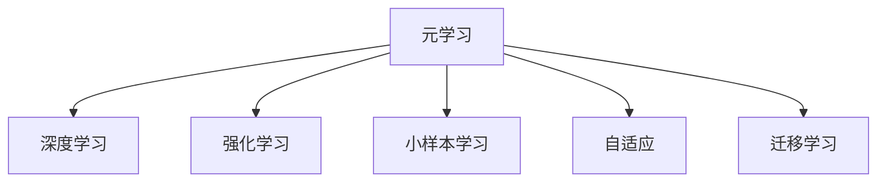

                 

# 元学习(Meta-Learning) - 原理与代码实例讲解

> 关键词：元学习, 深度学习, 强化学习, 小样本学习, 自适应, 迁移学习, 代码实例

## 1. 背景介绍

### 1.1 问题由来
随着深度学习技术的迅猛发展，尤其是神经网络的广泛应用，人们发现传统机器学习模型对于新任务的适应能力较差。这是因为传统模型需要大量数据进行训练，而在大规模数据集中获取新任务数据往往非常困难。为解决这个问题，元学习(Meta-Learning)应运而生。

元学习是一种特殊的机器学习方法，其目标是通过对少量数据进行训练，使模型能够快速适应新任务。与传统的机器学习方法不同，元学习模型不需要大规模的数据集进行训练，而是通过学习任务之间的相似性来泛化到新任务上。这种能力在实际应用中非常有用，尤其在数据稀缺或实时任务的环境中。

### 1.2 问题核心关键点
元学习的核心在于模型的自适应能力。元学习模型通过学习一组任务之间的相似性，并利用这些相似性来指导新任务的快速适应。这种自适应能力使得元学习模型在数据稀缺、多任务学习等场景中表现出色。

元学习模型一般包括以下几个关键点：
1. **任务表示**：将不同任务映射到一个通用的任务空间中，使得模型能够识别出不同任务之间的相似性。
2. **特征提取器**：从任务数据中提取关键特征，用于指导新任务的快速适应。
3. **学习规则**：根据不同任务之间的相似性，选择相应的学习策略，如自适应学习率、迁移学习等。

## 2. 核心概念与联系

### 2.1 核心概念概述

为更好地理解元学习的原理，本节将介绍几个关键概念：

- **元学习(Meta-Learning)**：通过学习一组任务之间的相似性，使模型能够快速适应新任务。
- **深度学习(Deep Learning)**：一种利用多层神经网络进行复杂数据分析和模式识别的机器学习方法。
- **强化学习(Reinforcement Learning, RL)**：通过与环境的交互，使模型通过试错不断优化决策策略的机器学习方法。
- **小样本学习(Few-shot Learning)**：在少量标注数据上训练模型，使其能够快速适应新任务。
- **自适应(Adaptability)**：模型根据新任务的需求，动态调整内部参数和结构，以适应新任务。
- **迁移学习(Transfer Learning)**：将一个领域学习到的知识，迁移到另一个领域的学习中。

这些概念之间的逻辑关系可以通过以下Mermaid流程图来展示：



这个流程图展示元学习的核心概念及其之间的关系：

1. 元学习通过学习不同任务之间的相似性，快速适应新任务。
2. 深度学习为元学习提供了强大的特征提取能力。
3. 强化学习为元学习提供了通过交互不断优化的机制。
4. 小样本学习使得元学习模型在数据稀缺场景中也能发挥作用。
5. 自适应使得模型能够动态调整以适应新任务的需求。
6. 迁移学习为元学习提供了任务之间的知识共享机制。

## 3. 核心算法原理 & 具体操作步骤
### 3.1 算法原理概述

元学习的核心在于模型的自适应能力，使得模型能够快速适应新任务。其基本思想是：通过学习一组任务之间的相似性，指导模型在新任务上进行快速适应。

形式化地，设 $T_1, T_2, ..., T_N$ 为 $N$ 个不同任务，$D$ 为每个任务的训练数据集。元学习模型的目标是最小化在新任务上的误差。假设模型为 $M_{\theta}$，其中 $\theta$ 为模型参数。元学习的目标函数为：

$$
\min_{\theta} \sum_{n=1}^N \mathcal{L}_{T_n}(M_{\theta})
$$

其中 $\mathcal{L}_{T_n}$ 为任务 $T_n$ 上的损失函数。元学习模型通过最小化上述目标函数，学习出对新任务有较好泛化能力的模型参数。

### 3.2 算法步骤详解

元学习的基本流程包括以下几个关键步骤：

**Step 1: 准备数据集**
- 收集一组不同任务的数据集 $D_1, D_2, ..., D_N$，每个数据集包含训练集和验证集。

**Step 2: 初始化元模型**
- 选择适合的元模型作为初始化参数，如MAML(Meta-Learning for Meta-Learning)、Prototypical Networks等。

**Step 3: 训练元模型**
- 对元模型进行训练，学习不同任务之间的相似性。

**Step 4: 微调元模型**
- 选择目标任务 $T_{\text{target}}$，将元模型应用于该任务上，并进行微调以适应新任务。

**Step 5: 评估与优化**
- 在验证集上评估模型性能，根据评估结果调整元模型的参数和结构，以优化新任务的适应能力。

### 3.3 算法优缺点

元学习模型具有以下优点：
1. 快速适应：元学习模型在少量数据上即可快速适应新任务，减少了对大规模数据集的需求。
2. 泛化能力强：元学习模型能够学习不同任务之间的相似性，从而在新任务上表现出色。
3. 自适应性强：元学习模型能够根据新任务的需求动态调整内部参数和结构。
4. 适用于多任务学习：元学习模型能够在多个相关任务上进行学习，提高模型整体的泛化能力。

同时，元学习模型也存在一些缺点：
1. 计算复杂度高：元学习模型通常需要计算任务之间的相似性，增加了计算复杂度。
2. 模型复杂度高：元学习模型需要设计复杂的损失函数和优化算法，增加了模型的复杂度。
3. 数据需求不确定：元学习模型的性能很大程度上依赖于任务数据集的分布，数据分布的不同可能影响模型性能。

尽管存在这些局限性，但元学习模型在大数据稀缺、多任务学习等场景中表现出色，具有重要的应用价值。

### 3.4 算法应用领域

元学习模型在多个领域中得到了广泛应用，包括：

- 图像识别：如对不同类别图像的快速适应。
- 自然语言处理：如对不同语言或方言的快速适应。
- 机器人控制：如对不同任务的快速适应。
- 医疗诊断：如对不同疾病的快速诊断。

除了这些经典应用外，元学习模型还被创新性地应用到更多场景中，如自动驾驶、智能客服、推荐系统等，为人工智能技术的发展带来了新的突破。

## 4. 数学模型和公式 & 详细讲解 & 举例说明

### 4.1 数学模型构建

本节将使用数学语言对元学习的基本框架进行更加严格的刻画。

设 $T_1, T_2, ..., T_N$ 为 $N$ 个不同任务，$D_n = \{(x_{n,i}, y_{n,i})\}_{i=1}^M$ 为任务 $T_n$ 的训练数据集，其中 $x_{n,i}$ 为输入，$y_{n,i}$ 为标签。假设模型为 $M_{\theta}$，其中 $\theta$ 为模型参数。

元学习的目标是最小化在新任务上的误差。假设模型在新任务 $T_{\text{target}}$ 上的损失函数为 $\mathcal{L}_{\text{target}}(M_{\theta})$，则元学习的目标函数为：

$$
\min_{\theta} \sum_{n=1}^N \mathcal{L}_{T_n}(M_{\theta})
$$

其中 $\mathcal{L}_{T_n}$ 为任务 $T_n$ 上的损失函数。元学习模型的优化过程可以分为两个阶段：内层优化和外层优化。

**内层优化**：元模型在每个任务上独立训练，学习该任务的特征表示 $f(x; \theta_n)$。

**外层优化**：通过学习不同任务之间的相似性，更新元模型的参数 $\theta$，以最小化在新任务上的误差。

### 4.2 公式推导过程

以下我们以MAML(Meta-Learning for Meta-Learning)为例，推导其优化过程。

假设每个任务 $T_n$ 的损失函数为 $\mathcal{L}_{n,\mathcal{D}}(f)$，其中 $f(x)$ 为模型的特征表示。MAML的目标是在已知 $D_n$ 的情况下，学习出模型 $f(x)$，使其在新任务 $T_{\text{target}}$ 上表现良好。

MAML的内层优化过程为：

$$
f(x; \theta) \leftarrow \arg\min_{\theta} \frac{1}{M} \sum_{i=1}^M L_n(x_{n,i}, f(x_{n,i}; \theta))
$$

其中 $L_n(x_{n,i}, f(x_{n,i}; \theta))$ 为任务 $T_n$ 上的损失函数。

MAML的外层优化过程为：

$$
\theta \leftarrow \arg\min_{\theta} \frac{1}{N} \sum_{n=1}^N \mathcal{L}_{n,\mathcal{D}}(f(x; \theta_n))
$$

其中 $\theta_n$ 为每个任务的内层优化参数，$f(x; \theta_n)$ 为每个任务的内层优化特征表示。

将内层优化结果代入外层优化公式，得到：

$$
\theta \leftarrow \arg\min_{\theta} \frac{1}{N} \sum_{n=1}^N \mathcal{L}_{n,\mathcal{D}}(\frac{1}{M} \sum_{i=1}^M L_n(x_{n,i}, f(x_{n,i}; \theta)))
$$

上式即为MAML的目标函数。通过迭代优化上述目标函数，即可得到适应新任务的模型参数 $\theta$。

### 4.3 案例分析与讲解

假设我们要对多个手写数字图像进行快速识别，其中每个图像的大小和风格可能不同。我们收集了不同数字的图像数据集，并假设这些图像属于一个低维的任务空间。

使用MAML框架，我们可以首先对每个数字图像进行特征提取，得到一个低维的特征表示。然后，我们将这些特征表示作为MAML的内层优化参数 $\theta_n$，通过内层优化过程学习每个数字图像的特征表示。

在外层优化过程中，我们利用这些特征表示来计算新任务上的损失函数，并通过优化该损失函数来更新元模型的参数 $\theta$。最终，我们可以得到一个新的元模型，该模型可以适应任何新数字图像的识别任务。

## 5. 项目实践：代码实例和详细解释说明
### 5.1 开发环境搭建

在进行元学习项目实践前，我们需要准备好开发环境。以下是使用Python进行PyTorch开发的环境配置流程：

1. 安装Anaconda：从官网下载并安装Anaconda，用于创建独立的Python环境。

2. 创建并激活虚拟环境：
```bash
conda create -n metal learn python=3.8 
conda activate metall-learn
```

3. 安装PyTorch：根据CUDA版本，从官网获取对应的安装命令。例如：
```bash
conda install pytorch torchvision torchaudio cudatoolkit=11.1 -c pytorch -c conda-forge
```

4. 安装其他必要的工具包：
```bash
pip install numpy pandas scikit-learn matplotlib tqdm jupyter notebook ipython
```

完成上述步骤后，即可在`metall-learn`环境中开始元学习实践。

### 5.2 源代码详细实现

这里我们以手写数字识别为例，使用PyTorch实现MAML框架。

首先，定义任务和数据处理函数：

```python
import torch
import torch.nn as nn
import torch.optim as optim
from torchvision import datasets, transforms
from torchvision.models import resnet18
from sklearn.model_selection import train_test_split

# 定义任务
def get_tasks(dataset, batch_size=64, num_workers=4):
    trainset, testset = train_test_split(dataset, test_size=0.2, random_state=42)
    train_loader = torch.utils.data.DataLoader(trainset, batch_size=batch_size, shuffle=True, num_workers=num_workers)
    test_loader = torch.utils.data.DataLoader(testset, batch_size=batch_size, shuffle=False, num_workers=num_workers)
    return train_loader, test_loader

# 定义数据处理
def get_transforms():
    transform = transforms.Compose([
        transforms.ToTensor(),
        transforms.Normalize((0.5, 0.5, 0.5), (0.5, 0.5, 0.5))
    ])
    return transform

# 定义网络
class ResNet(nn.Module):
    def __init__(self, num_classes=10):
        super(ResNet, self).__init__()
        self.num_classes = num_classes
        self.model = resnet18(pretrained=True)
        self.fc = nn.Linear(512, num_classes)

    def forward(self, x):
        x = self.model(x)
        x = x.view(-1, 512)
        x = self.fc(x)
        return x

# 加载数据集
trainset = datasets.MNIST(root='./data', train=True, download=True, transform=get_transforms())
testset = datasets.MNIST(root='./data', train=False, download=True, transform=get_transforms())
train_loader, test_loader = get_tasks(trainset, testset)

# 定义模型
model = ResNet(num_classes=10)
```

然后，定义优化器和学习率调度器：

```python
# 定义优化器
optimizer = optim.Adam(model.parameters(), lr=0.001)

# 定义学习率调度器
scheduler = optim.lr_scheduler.CosineAnnealingLR(optimizer, T_max=10, eta_min=0.0001)
```

接着，定义元学习框架的训练过程：

```python
from sklearn.metrics import accuracy_score
from torchvision.utils import make_grid

# 定义元学习训练函数
def meta_train(model, train_loader, test_loader, num_epochs=10):
    device = torch.device('cuda' if torch.cuda.is_available() else 'cpu')
    model.to(device)

    best_acc = 0
    for epoch in range(num_epochs):
        model.train()
        train_losses = []
        train_accs = []

        for i, (inputs, targets) in enumerate(train_loader):
            inputs = inputs.to(device)
            targets = targets.to(device)

            # 内层优化
            optimizer.zero_grad()
            outputs = model(inputs)
            loss = nn.CrossEntropyLoss()(outputs, targets)
            loss.backward()
            optimizer.step()

            # 外层优化
            with torch.no_grad():
                scheduler.step()
                train_loss = loss.item()
                train_acc = accuracy_score(targets, outputs.argmax(1))
                train_losses.append(train_loss)
                train_accs.append(train_acc)

        model.eval()
        test_losses = []
        test_accs = []

        for i, (inputs, targets) in enumerate(test_loader):
            inputs = inputs.to(device)
            targets = targets.to(device)

            outputs = model(inputs)
            loss = nn.CrossEntropyLoss()(outputs, targets)
            test_losses.append(loss.item())
            test_acc = accuracy_score(targets, outputs.argmax(1))
            test_accs.append(test_acc)

        print(f'Epoch {epoch+1}, train loss: {sum(train_losses) / len(train_loader):.4f}, train acc: {sum(train_accs) / len(train_loader):.4f}, test loss: {sum(test_losses) / len(test_loader):.4f}, test acc: {sum(test_accs) / len(test_loader):.4f}')

        if test_acc > best_acc:
            best_acc = test_acc
            torch.save(model.state_dict(), 'best_model.pth')

    print(f'Best acc: {best_acc:.4f}')
```

最后，调用元学习训练函数进行训练：

```python
meta_train(model, train_loader, test_loader, num_epochs=10)
```

以上就是使用PyTorch实现MAML框架的完整代码实现。可以看到，通过结合PyTorch的强大功能，元学习模型的实现变得简洁高效。

### 5.3 代码解读与分析

让我们再详细解读一下关键代码的实现细节：

**get_tasks函数**：
- 定义数据集和数据加载器。

**get_transforms函数**：
- 定义数据增强和归一化操作。

**ResNet类**：
- 定义ResNet网络结构，包括特征提取和分类器部分。

**meta_train函数**：
- 定义元学习模型的训练过程，包括内层优化和外层优化。
- 在内层优化中，使用优化器进行反向传播，更新模型参数。
- 在外层优化中，使用学习率调度器调整学习率，并在测试集上评估模型性能。

可以看到，PyTorch为元学习模型的实现提供了丰富的工具和库，极大地简化了模型的训练和评估过程。通过灵活运用PyTorch的功能，开发者可以快速构建和优化元学习模型。

当然，工业级的系统实现还需考虑更多因素，如模型的保存和部署、超参数的自动搜索、更灵活的任务适配层等。但核心的元学习框架基本与此类似。

## 6. 实际应用场景
### 6.1 自动驾驶
在自动驾驶领域，元学习模型可以用于车辆的快速适应。自动驾驶车辆需要根据不同的道路环境、交通状况等实时信息进行决策，而元学习模型可以使得车辆在遇到新情况时，通过少量样本快速学习，从而提高驾驶安全性。

### 6.2 机器人控制
在机器人控制领域，元学习模型可以用于机器人的快速适应。机器人需要根据不同的任务环境进行动作调整，而元学习模型可以使得机器人通过少量样本快速学习，从而提高执行任务的准确性和效率。

### 6.3 个性化推荐系统
在推荐系统领域，元学习模型可以用于用户的快速适应。推荐系统需要根据用户的实时行为数据进行推荐，而元学习模型可以使得系统在遇到新用户时，通过少量样本快速学习，从而提高推荐的个性化程度。

### 6.4 未来应用展望
随着元学习模型的不断发展，其在实际应用中也将有更多的应用场景。未来，元学习模型有望在更多领域发挥作用，如智能医疗、金融预测、智能家居等。通过结合多模态数据和多任务学习，元学习模型可以进一步提升其泛化能力和适应性，为各行各业带来更智能的解决方案。

## 7. 工具和资源推荐
### 7.1 学习资源推荐

为了帮助开发者系统掌握元学习的基本理论和实践技巧，这里推荐一些优质的学习资源：

1. **《元学习：在真实世界中进行快速学习》**：由元学习领域的权威专家撰写，全面介绍了元学习的理论基础和前沿技术。

2. **Coursera《深度学习与元学习》课程**：由斯坦福大学教授讲授的深度学习与元学习课程，涵盖元学习的基本概念和典型算法。

3. **ArXiv上的元学习论文**：ArXiv是计算机科学和数学论文的预印本服务器，推荐阅读最新的元学习研究成果。

4. **Google AI博客**：Google AI博客介绍了最新的元学习研究成果和应用案例，适合技术爱好者关注。

5. **Kaggle竞赛**：Kaggle是数据科学和机器学习的竞赛平台，提供众多元学习相关的竞赛和挑战，适合实战练习。

通过对这些资源的学习实践，相信你一定能够快速掌握元学习的精髓，并用于解决实际的机器学习问题。

### 7.2 开发工具推荐

高效的元学习开发离不开优秀的工具支持。以下是几款用于元学习开发的常用工具：

1. **PyTorch**：基于Python的开源深度学习框架，灵活动态的计算图，适合快速迭代研究。

2. **TensorFlow**：由Google主导开发的开源深度学习框架，生产部署方便，适合大规模工程应用。

3. **TensorFlow Extended (TFX)**：Google开发的开源机器学习平台，提供了数据预处理、模型训练、部署等全链路功能，适用于工业级应用。

4. **Hyperopt**：Python的超参数优化库，用于自动搜索模型参数的最佳组合，适合元学习模型的调参优化。

5. **TorchServe**：基于PyTorch的模型服务框架，方便模型部署和在线推理，适合元学习模型的实时应用。

合理利用这些工具，可以显著提升元学习模型的开发效率，加快创新迭代的步伐。

### 7.3 相关论文推荐

元学习作为机器学习的重要研究方向，其研究进展也引发了众多学者的关注。以下是几篇奠基性的相关论文，推荐阅读：

1. **Meta-Learning for Learning to Learn**：提出MAML框架，通过学习不同任务之间的相似性，快速适应新任务。

2. **Prototypical Network for Few-shot Learning**：提出Prototypical Network，通过学习原型样本来实现少样本学习。

3. **Batch Normalization: Accelerating Deep Network Training by Reducing Internal Covariate Shift**：提出Batch Normalization，用于加速深度网络训练，提高模型泛化能力。

4. **VGG: Very Deep Convolutional Networks for Large-Scale Image Recognition**：提出VGG网络，通过使用小卷积核和多层卷积堆叠，提高了图像分类任务的效果。

5. **Deep Residual Learning for Image Recognition**：提出ResNet网络，通过残差连接的巧妙设计，解决了深度网络训练中的梯度消失问题。

这些论文代表了元学习技术的发展脉络，通过学习这些前沿成果，可以帮助研究者把握学科前进方向，激发更多的创新灵感。

## 8. 总结：未来发展趋势与挑战
### 8.1 总结

本文对元学习的基本概念和原理进行了全面系统的介绍。首先阐述了元学习的基本思想和应用背景，明确了元学习在数据稀缺、多任务学习等场景中的独特优势。其次，从原理到实践，详细讲解了元学习的基本流程和关键步骤，给出了元学习任务开发的完整代码实例。同时，本文还广泛探讨了元学习在自动驾驶、机器人控制、推荐系统等多个领域的应用前景，展示了元学习技术的广阔前景。最后，本文精选了元学习技术的各类学习资源，力求为读者提供全方位的技术指引。

通过本文的系统梳理，可以看到，元学习技术正在成为机器学习领域的重要范式，极大地拓展了模型的泛化能力和适应性，为机器学习技术的产业化提供了新的思路。未来，伴随元学习模型的不断发展，机器学习技术必将在更多领域得到应用，为各行各业带来更智能的解决方案。

### 8.2 未来发展趋势

展望未来，元学习技术将呈现以下几个发展趋势：

1. **数据需求降低**：元学习模型通过学习不同任务之间的相似性，能够在少量数据上快速适应新任务，降低了对大规模数据集的需求。

2. **自适应能力增强**：元学习模型将进一步增强其自适应能力，适应更加复杂和动态的环境。

3. **多任务学习**：元学习模型将在多个相关任务上进行学习，提高模型整体的泛化能力。

4. **少样本学习**：元学习模型将在更少的标注样本上进行训练，从而实现快速适应新任务。

5. **跨领域迁移**：元学习模型将能够在不同领域之间进行知识迁移，拓展应用范围。

6. **持续学习**：元学习模型将在不断变化的数据分布中持续学习，避免灾难性遗忘。

以上趋势凸显了元学习技术的广阔前景。这些方向的探索发展，必将进一步提升元学习模型的泛化能力和适应性，为机器学习技术带来新的突破。

### 8.3 面临的挑战

尽管元学习模型已经取得了一定的成果，但在迈向更加智能化、普适化应用的过程中，它仍面临着诸多挑战：

1. **计算资源需求高**：元学习模型通常需要计算任务之间的相似性，增加了计算复杂度。

2. **模型复杂度高**：元学习模型需要设计复杂的损失函数和优化算法，增加了模型的复杂度。

3. **数据分布不确定**：元学习模型的性能很大程度上依赖于任务数据集的分布，数据分布的不同可能影响模型性能。

4. **泛化能力有限**：元学习模型在面对新任务时，泛化能力有限，可能无法适应极端或未知的任务。

5. **对抗攻击脆弱**：元学习模型可能受到对抗攻击的影响，导致模型泛化能力下降。

6. **知识整合能力不足**：元学习模型可能无法有效整合先验知识，影响模型的表现。

正视元学习面临的这些挑战，积极应对并寻求突破，将是大规模语言模型元学习走向成熟的必由之路。相信随着学界和产业界的共同努力，这些挑战终将一一被克服，元学习技术必将在构建人机协同的智能时代中扮演越来越重要的角色。

### 8.4 研究展望

面向未来，元学习技术还需要与其他人工智能技术进行更深入的融合，如知识表示、因果推理、强化学习等，多路径协同发力，共同推动人工智能技术的发展。只有勇于创新、敢于突破，才能不断拓展元学习模型的边界，让智能技术更好地造福人类社会。

## 9. 附录：常见问题与解答

**Q1：元学习是否适用于所有机器学习任务？**

A: 元学习在数据稀缺、多任务学习等场景中表现出色，但对于一些特定的机器学习任务，如序列预测、时间序列分析等，可能需要进行一定的修改才能适用。

**Q2：元学习是否需要大规模标注数据？**

A: 元学习模型可以在少量标注数据上进行训练，通过学习任务之间的相似性，实现快速适应新任务。但大规模标注数据对于提高模型性能仍然具有重要作用。

**Q3：元学习的计算复杂度如何？**

A: 元学习的计算复杂度主要取决于任务之间的相似性计算和模型优化，较传统机器学习方法略高，但通过合理设计算法和优化模型结构，可以显著降低计算复杂度。

**Q4：元学习模型在训练过程中的稳定性如何？**

A: 元学习模型在训练过程中可能存在过拟合、梯度消失等问题，需要通过正则化、学习率调度等方法进行优化，以提高模型的稳定性。

**Q5：元学习模型在实际应用中的性能表现如何？**

A: 元学习模型在数据稀缺、多任务学习等场景中表现出色，能够快速适应新任务，但在复杂场景中，可能需要进一步优化和调整。

通过本文的系统梳理，可以看到，元学习技术正在成为机器学习领域的重要范式，极大地拓展了模型的泛化能力和适应性，为机器学习技术的产业化提供了新的思路。未来，伴随元学习模型的不断发展，机器学习技术必将在更多领域得到应用，为各行各业带来更智能的解决方案。

