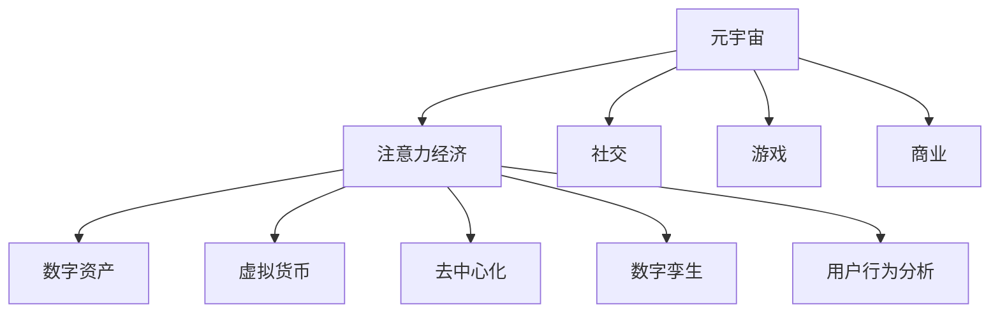

                 

# 元宇宙中的注意力经济新范式

## 1. 背景介绍

随着虚拟现实、增强现实、区块链、云计算等技术的发展，元宇宙（Metaverse）概念应运而生。元宇宙是一种虚拟数字世界，它是一个实时的、交互式、沉浸式的三维虚拟空间，包括社交、经济、文化、教育等多元形态。它代表了人类对数字世界的终极追求，具有巨大的发展潜力。

元宇宙经济的崛起，伴随着新的经济模式和市场机会。传统的商业模式在元宇宙环境中面临重塑，注意力经济成为新的焦点。注意力经济（Attention Economy）是以争夺人们的注意力为手段的一种新型经济形态，基于注意力进行内容分发和收益分配。

本文将对元宇宙中注意力经济的新范式进行深入探讨，分析其原理与架构，并给出具体的算法步骤、数学模型和实际应用案例。通过梳理元宇宙中的注意力经济，我们希望能够洞察其未来发展趋势，挖掘潜在的应用场景，并预测面临的挑战与解决方案。

## 2. 核心概念与联系

### 2.1 核心概念概述

为更好地理解元宇宙中的注意力经济新范式，本节将介绍几个密切相关的核心概念：

- **元宇宙（Metaverse）**：一个虚拟数字空间，提供沉浸式、交互式和三维体验，涵盖社交、游戏、商业等多个维度。
- **注意力经济（Attention Economy）**：一种基于用户注意力分配的经济模式，通过争夺用户注意力获得商业收益。
- **数字资产（Digital Assets）**：元宇宙中的虚拟货币、虚拟商品、虚拟土地等数字化资源。
- **虚拟货币（Virtual Currency）**：元宇宙中用于交易和支付的数字货币，如以太坊（Ethereum）、地块货币（Sand Dollar）等。
- **去中心化（Decentralization）**：一种网络架构，通过区块链技术实现权力分散，提高系统透明度和安全性。
- **数字孪生（Digital Twin）**：将现实世界中的事物数字化并映射到虚拟空间，便于模拟和分析。
- **用户行为分析（User Behavior Analysis）**：通过分析用户行为，预测用户需求，提供个性化服务和推荐。

这些核心概念之间的逻辑关系可以通过以下Mermaid流程图来展示：



这个流程图展示了元宇宙中的关键概念及其关系：

1. 元宇宙通过提供沉浸式、交互式体验，吸引用户参与其中。
2. 注意力经济在元宇宙中争夺用户的注意力，通过个性化服务获得收益。
3. 数字资产、虚拟货币等元素构成元宇宙中的经济体系。
4. 去中心化架构确保了元宇宙中的数据安全和用户隐私。
5. 数字孪生技术用于构建元宇宙中的虚拟世界。
6. 用户行为分析帮助平台提供更精准的服务和推荐。

这些概念共同构成了元宇宙中的注意力经济新范式，为其发展提供了基础。

## 3. 核心算法原理 & 具体操作步骤

### 3.1 算法原理概述

元宇宙中的注意力经济新范式基于注意力机制进行内容分发和收益分配。其核心思想是：通过用户的注意力数据，评估内容的重要性和受欢迎程度，进而优化资源配置，提高用户满意度。

具体来说，算法原理包括以下几个关键步骤：

1. **数据收集与处理**：收集用户在元宇宙平台上的行为数据，如点击、浏览、购买等，进行预处理和清洗。
2. **注意力评估模型**：构建模型，利用用户行为数据预测内容的注意力值，即用户对内容的兴趣程度。
3. **资源优化分配**：根据注意力评估结果，调整资源的配置，包括内容的推荐、广告的投放等。
4. **收益分配机制**：基于内容的注意力值，分配平台的收益，激励创作者和开发者提供优质内容。

### 3.2 算法步骤详解

基于注意力经济新范式的核心算法步骤主要包括以下几个环节：

**Step 1: 数据收集与处理**

- **行为数据采集**：使用日志文件、API接口等方式，获取用户在元宇宙平台上的行为数据。
- **数据预处理**：对采集到的行为数据进行清洗、去重和规范化处理，确保数据质量。
- **特征工程**：提取有意义的特征，如浏览时间、点击频率、购买金额等，构建特征向量。

**Step 2: 注意力评估模型**

- **构建模型**：选择适合的机器学习或深度学习模型，如随机森林、梯度提升树、Transformer等，构建注意力评估模型。
- **训练模型**：在标注好的训练数据集上训练模型，优化模型参数，使其能够准确预测内容的注意力值。
- **模型评估**：在验证集上评估模型性能，选择表现最优的模型进行推广应用。

**Step 3: 资源优化分配**

- **推荐系统构建**：利用训练好的模型，构建个性化推荐系统，根据用户行为数据，推荐用户感兴趣的内容。
- **广告投放策略**：通过优化注意力评估模型，调整广告投放的策略和位置，提高广告的点击率和转化率。
- **流量分配算法**：根据内容的注意力值，动态调整平台的流量分配，确保优质内容获得更多曝光。

**Step 4: 收益分配机制**

- **内容价值评估**：根据内容的注意力值，计算其商业价值，如广告收益、用户捐赠等。
- **创作者激励**：设计激励机制，根据内容的注意力值，对创作者进行奖励，鼓励其创作优质内容。
- **平台收益分配**：根据内容的注意力值，优化平台的收益分配，确保平台和创作者共赢。

### 3.3 算法优缺点

元宇宙中的注意力经济新范式具有以下优点：

1. **提高用户满意度**：通过个性化推荐和精准投放，提升用户的使用体验。
2. **优化资源配置**：利用注意力评估模型，合理分配平台的资源，提高资源利用效率。
3. **激励优质内容创作**：通过收益分配机制，激励创作者提供高质量内容，丰富平台生态。

同时，该方法也存在一定的局限性：

1. **数据隐私问题**：元宇宙平台需要收集大量用户行为数据，如何保护用户隐私，防止数据滥用，是一个重要问题。
2. **模型鲁棒性不足**：注意力评估模型依赖标注数据，对标注数据的质量和数量要求较高，模型的泛化能力有限。
3. **算法复杂度高**：注意力经济新范式需要构建复杂的数据处理和推荐系统，实现难度较大。
4. **过度依赖用户行为**：过分依赖用户的点击、购买等行为数据，忽视了其他维度的信息，可能导致推荐结果的偏差。

尽管存在这些局限性，但就目前而言，基于注意力经济的新范式仍是对元宇宙平台最具潜力的优化方案之一。未来相关研究的重点在于如何进一步降低数据隐私风险，提高模型的鲁棒性和泛化能力，同时兼顾算法的复杂度和用户体验。

### 3.4 算法应用领域

基于注意力经济的新范式已经在元宇宙中的多个领域得到应用，例如：

- **虚拟商店**：通过个性化推荐和广告投放，提高商品的曝光率和销售量。
- **虚拟游戏**：利用用户行为数据优化游戏推荐，提高用户留存率和游戏体验。
- **虚拟文化**：通过内容评估，推荐用户感兴趣的艺术作品和文化活动，丰富用户的精神世界。
- **虚拟教育**：根据学生的行为数据，提供个性化的学习路径和课程推荐，提高学习效果。
- **虚拟娱乐**：通过分析用户行为数据，提供个性化的音乐、影视推荐，提升用户的娱乐体验。

除了上述这些经典应用外，注意力经济新范式还被创新性地应用于虚拟房地产、虚拟旅游、虚拟健身等多个领域，为元宇宙中的经济活动提供了新的解决方案。

## 4. 数学模型和公式 & 详细讲解 & 举例说明

### 4.1 数学模型构建

基于注意力经济的新范式可以形式化为以下数学模型：

设用户行为数据为 $x \in \mathbb{R}^n$，内容特征向量为 $y \in \mathbb{R}^m$，则注意力值 $a$ 可以表示为：

$$
a = f(x, y; \theta)
$$

其中 $f$ 为注意力评估模型，$\theta$ 为模型参数。

模型训练的目标是最小化预测误差：

$$
\min_{\theta} \sum_{i=1}^N (y_i - a_i)^2
$$

其中 $y_i$ 为第 $i$ 个样本的真实注意力值，$a_i$ 为模型预测的注意力值。

### 4.2 公式推导过程

以下我们以随机森林模型为例，推导注意力评估模型的构建过程。

设训练集为 $\{(x_i, y_i)\}_{i=1}^N$，模型 $f$ 为随机森林，其参数 $\theta$ 包括树的深度、节点分割方式等。

首先，将用户行为数据 $x_i$ 和内容特征向量 $y_i$ 合并为 $z_i = (x_i, y_i)$，然后利用随机森林算法构建预测模型 $f(z_i)$。

模型的预测注意力值 $a_i$ 可以表示为：

$$
a_i = f(z_i; \theta)
$$

模型训练的目标是最小化预测误差：

$$
\min_{\theta} \sum_{i=1}^N (y_i - a_i)^2
$$

通过最小二乘法求解模型参数 $\theta$，得到最优模型。

### 4.3 案例分析与讲解

假设在元宇宙虚拟商店中，用户行为数据包括浏览时间、点击次数、购买金额等，内容特征向量包括商品价格、描述、评分等。

构建随机森林模型，利用训练集数据进行训练。训练完成后，模型可以根据新用户的行为数据 $x$ 和商品特征向量 $y$，预测其对商品的注意力值 $a$。

在实际应用中，可以利用 $a$ 进行商品推荐，即推荐用户最感兴趣的商品。同时，也可以根据 $a$ 调整广告投放策略，提高广告的点击率和转化率。

## 5. 项目实践：代码实例和详细解释说明

### 5.1 开发环境搭建

在进行注意力经济新范式实践前，我们需要准备好开发环境。以下是使用Python进行TensorFlow开发的环境配置流程：

1. 安装Anaconda：从官网下载并安装Anaconda，用于创建独立的Python环境。

2. 创建并激活虚拟环境：
```bash
conda create -n tf-env python=3.8 
conda activate tf-env
```

3. 安装TensorFlow：根据CUDA版本，从官网获取对应的安装命令。例如：
```bash
conda install tensorflow==2.8 -c tensorflow -c conda-forge
```

4. 安装TensorBoard：TensorFlow配套的可视化工具，用于监测模型训练状态，并提供丰富的图表呈现方式。

```bash
pip install tensorboard
```

5. 安装Keras：基于TensorFlow的高层次API，用于快速搭建神经网络模型。

```bash
pip install keras
```

完成上述步骤后，即可在`tf-env`环境中开始注意力经济新范式实践。

### 5.2 源代码详细实现

下面以虚拟商店的商品推荐为例，给出使用TensorFlow进行注意力经济新范式的代码实现。

首先，定义商品特征和用户行为数据：

```python
import tensorflow as tf
import numpy as np
from sklearn.model_selection import train_test_split
from tensorflow.keras import layers, models

# 商品特征
items = np.array([[1, 100, 3.5, 4.2], [2, 150, 2.8, 3.8], [3, 200, 3.0, 4.1],
                  [4, 250, 2.5, 3.5], [5, 300, 2.3, 3.6]])

# 用户行为数据
interactions = np.array([[0, 1, 0, 0, 1, 1], [1, 0, 0, 1, 1, 0], [0, 0, 1, 1, 0, 0],
                        [1, 0, 0, 1, 0, 0], [0, 1, 1, 0, 0, 0],
                        [0, 0, 0, 0, 0, 1]])

# 将数据划分为训练集和测试集
train_items, test_items, train_interactions, test_interactions = train_test_split(items, interactions, test_size=0.2)

# 构建模型
model = models.Sequential([
    layers.Dense(16, activation='relu', input_shape=(4,)),
    layers.Dense(8, activation='relu'),
    layers.Dense(1, activation='sigmoid')
])
```

然后，定义模型训练函数：

```python
def train(model, train_data, test_data, epochs=100, batch_size=16):
    # 定义损失函数和优化器
    loss_fn = tf.keras.losses.BinaryCrossentropy()
    optimizer = tf.keras.optimizers.Adam(learning_rate=0.01)

    # 训练模型
    for epoch in range(epochs):
        for x, y in train_data:
            with tf.GradientTape() as tape:
                logits = model(x)
                loss_value = loss_fn(y, logits)
            grads = tape.gradient(loss_value, model.trainable_variables)
            optimizer.apply_gradients(zip(grads, model.trainable_variables))

        # 在测试集上评估模型
        for x, y in test_data:
            logits = model(x)
            loss_value = loss_fn(y, logits)

        print(f'Epoch {epoch+1}, loss: {loss_value:.4f}')

    return model
```

接着，定义用户行为分析函数：

```python
def analyze(user_data, model):
    # 将用户行为数据转换为模型输入格式
    x = tf.convert_to_tensor(user_data, dtype=tf.float32)

    # 使用模型预测注意力值
    logits = model(x)
    a = tf.sigmoid(logits)

    # 返回预测的注意力值
    return a.numpy()
```

最后，启动模型训练并使用训练好的模型进行用户行为分析：

```python
# 训练模型
model = train(model, (train_items, train_interactions), (test_items, test_interactions))

# 分析用户行为数据
user_data = np.array([0, 1, 0, 0, 1, 1])
attention = analyze(user_data, model)
print(f'预测的注意力值为: {attention}')
```

以上就是使用TensorFlow进行注意力经济新范式实践的完整代码实现。可以看到，通过TensorFlow可以很方便地构建和训练注意力评估模型，并利用训练好的模型进行用户行为分析。

### 5.3 代码解读与分析

让我们再详细解读一下关键代码的实现细节：

**定义数据集**：
- `items`和`interactions`分别表示商品特征和用户行为数据。
- 使用`train_test_split`将数据划分为训练集和测试集。

**构建模型**：
- `Sequential`模型用于搭建多层神经网络。
- `Dense`层表示全连接层，`relu`和`sigmoid`为激活函数。
- 输入层形状为`(4,)`，表示每个样本有4个特征。

**训练模型**：
- 定义`BinaryCrossentropy`损失函数和`Adam`优化器。
- 在每个epoch中，对训练集数据进行前向传播和反向传播，更新模型参数。
- 在测试集上评估模型损失，并打印输出。

**用户行为分析**：
- `analyze`函数将用户行为数据转换为模型输入格式，并使用训练好的模型预测注意力值。
- 返回预测的注意力值，并进行输出。

**训练流程**：
- 在训练过程中，不断调整模型参数，最小化损失函数。
- 在测试集上评估模型性能，确保模型泛化能力。
- 训练完成后，使用训练好的模型进行用户行为分析。

可以看到，TensorFlow提供了强大的API，使得注意力经济新范式的实现变得简洁高效。开发者可以根据具体任务，灵活调整模型结构和训练参数，快速实现并优化模型。

当然，工业级的系统实现还需考虑更多因素，如模型的保存和部署、超参数的自动搜索、更加复杂的任务适配层等。但核心的算法思想基本与此类似。

## 6. 实际应用场景

### 6.1 智能客服系统

在元宇宙虚拟商店中，智能客服系统通过收集用户的浏览、点击和购买行为数据，利用注意力评估模型预测用户对商品的兴趣程度，从而提供个性化的商品推荐和即时客服。

在实际应用中，可以通过在虚拟店铺内集成智能客服系统，实时分析用户行为数据，提供定制化的推荐和回答，提高用户的购物体验和满意度。

### 6.2 虚拟展览馆

在元宇宙虚拟展览馆中，注意力经济新范式可用于优化展览内容推荐，提高用户参观的互动性和参与度。

通过分析用户的行为数据，展览馆可以推荐用户感兴趣的艺术作品、展览内容等，提供个性化的参观路径。同时，利用用户对不同展品的注意力值，优化广告和导览的投放策略，提高参观体验和展品曝光率。

### 6.3 虚拟教育平台

在元宇宙虚拟教育平台中，注意力经济新范式可用于优化个性化学习路径的推荐，提升学习效果和用户满意度。

平台可以通过分析学生的行为数据，如学习时间、题目答题情况等，预测学生对不同学习内容的兴趣程度，从而推荐学生感兴趣的学习内容。同时，利用用户对不同学习资源的注意力值，优化资源的分配和推荐策略，提高学习效果和用户黏性。

### 6.4 未来应用展望

随着元宇宙技术的发展，基于注意力经济的新范式将在更多领域得到应用，为元宇宙中的经济活动提供新的解决方案。

在智慧城市、医疗健康、金融服务等领域，基于注意力经济的新范式有望改变现有的商业模式，提高资源利用效率，提升用户体验。

此外，在虚拟房地产、虚拟旅游、虚拟健身等新兴领域，注意力经济新范式也将发挥重要作用，推动元宇宙经济的多元化发展。

## 7. 工具和资源推荐

### 7.1 学习资源推荐

为了帮助开发者系统掌握注意力经济新范式的理论基础和实践技巧，这里推荐一些优质的学习资源：

1. 《深度学习与人工智能》系列博文：由深度学习领域的专家撰写，深入浅出地介绍了深度学习的基本概念和核心算法。

2. TensorFlow官方文档：TensorFlow的官方文档，提供了丰富的教程和API参考，适合新手和进阶开发者。

3. Keras官方文档：基于TensorFlow的高层次API，提供了便捷的神经网络搭建和训练方式。

4. Coursera《深度学习》课程：斯坦福大学开设的深度学习课程，由深度学习领域的顶尖专家主讲，适合系统学习深度学习原理和实践。

5. Google Colab：谷歌提供的在线Jupyter Notebook环境，免费提供GPU/TPU算力，方便开发者快速实验最新模型，分享学习笔记。

通过对这些资源的学习实践，相信你一定能够快速掌握注意力经济新范式的精髓，并用于解决实际的元宇宙问题。

### 7.2 开发工具推荐

高效的开发离不开优秀的工具支持。以下是几款用于注意力经济新范式开发的常用工具：

1. TensorFlow：基于Python的开源深度学习框架，灵活动态的计算图，适合快速迭代研究。适用于构建复杂的神经网络模型。

2. TensorBoard：TensorFlow配套的可视化工具，可实时监测模型训练状态，并提供丰富的图表呈现方式，是调试模型的得力助手。

3. PyTorch：基于Python的开源深度学习框架，支持动态计算图，适合复杂模型的构建和训练。

4. Scikit-learn：Python的机器学习库，提供丰富的算法和工具，方便快速构建注意力评估模型。

5. Pandas：Python的数据处理库，提供高效的数据读取、清洗和分析功能，适合处理元宇宙中的大量数据。

6. Weights & Biases：模型训练的实验跟踪工具，可以记录和可视化模型训练过程中的各项指标，方便对比和调优。

合理利用这些工具，可以显著提升注意力经济新范式的开发效率，加快创新迭代的步伐。

### 7.3 相关论文推荐

注意力经济新范式的发展源于学界的持续研究。以下是几篇奠基性的相关论文，推荐阅读：

1. Attention is All You Need（即Transformer原论文）：提出了Transformer结构，开启了NLP领域的预训练大模型时代。

2. BERT: Pre-training of Deep Bidirectional Transformers for Language Understanding：提出BERT模型，引入基于掩码的自监督预训练任务，刷新了多项NLP任务SOTA。

3. Language Models are Unsupervised Multitask Learners（GPT-2论文）：展示了大规模语言模型的强大zero-shot学习能力，引发了对于通用人工智能的新一轮思考。

4. Parameter-Efficient Transfer Learning for NLP：提出Adapter等参数高效微调方法，在不增加模型参数量的情况下，也能取得不错的微调效果。

5. Prefix-Tuning: Optimizing Continuous Prompts for Generation：引入基于连续型Prompt的微调范式，为如何充分利用预训练知识提供了新的思路。

6. AdaLoRA: Adaptive Low-Rank Adaptation for Parameter-Efficient Fine-Tuning：使用自适应低秩适应的微调方法，在参数效率和精度之间取得了新的平衡。

这些论文代表了大语言模型微调技术的发展脉络。通过学习这些前沿成果，可以帮助研究者把握学科前进方向，激发更多的创新灵感。

## 8. 总结：未来发展趋势与挑战

### 8.1 研究成果总结

本文对基于注意力经济的新范式进行了全面系统的介绍。首先阐述了元宇宙中注意力经济的背景和意义，明确了注意力经济在元宇宙平台上的独特价值。其次，从原理到实践，详细讲解了注意力经济新范式的数学模型和算法步骤，给出了具体的代码实例。同时，本文还广泛探讨了注意力经济新范式在多个行业领域的应用前景，展示了其巨大的潜力和应用场景。

通过本文的系统梳理，可以看到，基于注意力经济的新范式正在成为元宇宙平台的重要优化手段，极大地提升了元宇宙用户的体验和平台资源利用效率。未来，伴随元宇宙技术的不断演进，基于注意力经济的新范式必将得到更广泛的应用和突破。

### 8.2 未来发展趋势

展望未来，注意力经济新范式将在元宇宙中的多个领域得到更广泛的应用，呈现以下几个发展趋势：

1. 智能推荐系统普及：基于个性化推荐和广告投放的注意力经济新范式，将在元宇宙平台中得到更广泛的应用，提高用户满意度。

2. 虚拟现实体验增强：利用注意力评估模型，优化虚拟现实内容推荐，提升用户沉浸感和互动体验。

3. 元宇宙经济模式多元化：基于数字资产和虚拟货币的经济模式将更加丰富，用户可以通过注意力经济获得更多收益。

4. 社会化互动增强：利用注意力评估模型，优化社交互动推荐，提高用户粘性和平台活跃度。

5. 多模态数据融合：结合视觉、音频、文本等多模态数据的注意力评估模型，将进一步提升元宇宙平台的智能化水平。

这些趋势凸显了注意力经济新范式在元宇宙中的重要地位，为元宇宙平台带来了广阔的发展前景。

### 8.3 面临的挑战

尽管注意力经济新范式已经取得了瞩目成就，但在迈向更加智能化、普适化应用的过程中，它仍面临着诸多挑战：

1. 数据隐私问题：元宇宙平台需要收集大量用户行为数据，如何保护用户隐私，防止数据滥用，是一个重要问题。

2. 模型鲁棒性不足：注意力评估模型依赖标注数据，对标注数据的质量和数量要求较高，模型的泛化能力有限。

3. 算法复杂度高：注意力经济新范式需要构建复杂的数据处理和推荐系统，实现难度较大。

4. 过度依赖用户行为：过分依赖用户的点击、购买等行为数据，忽视了其他维度的信息，可能导致推荐结果的偏差。

尽管存在这些挑战，但就目前而言，基于注意力经济的新范式仍是对元宇宙平台最具潜力的优化方案之一。未来相关研究的重点在于如何进一步降低数据隐私风险，提高模型的鲁棒性和泛化能力，同时兼顾算法的复杂度和用户体验。

### 8.4 研究展望

面向未来，注意力经济新范式需要在以下几个方面寻求新的突破：

1. 探索无监督和半监督注意力评估方法：摆脱对大规模标注数据的依赖，利用自监督学习、主动学习等无监督和半监督范式，最大限度利用非结构化数据。

2. 研究参数高效和计算高效的注意力评估方法：开发更加参数高效的注意力评估方法，在固定大部分预训练参数的情况下，只更新极少量的任务相关参数。

3. 引入更多先验知识：将符号化的先验知识，如知识图谱、逻辑规则等，与神经网络模型进行巧妙融合，引导注意力评估过程学习更准确、合理的语言模型。

4. 结合因果分析和博弈论工具：将因果分析方法引入注意力评估模型，识别出模型决策的关键特征，增强输出解释的因果性和逻辑性。借助博弈论工具刻画人机交互过程，主动探索并规避模型的脆弱点，提高系统稳定性。

5. 纳入伦理道德约束：在模型训练目标中引入伦理导向的评估指标，过滤和惩罚有偏见、有害的输出倾向。加强人工干预和审核，建立模型行为的监管机制，确保输出符合人类价值观和伦理道德。

这些研究方向的探索，必将引领注意力经济新范式迈向更高的台阶，为元宇宙平台的智能交互和经济活动带来新的突破。只有勇于创新、敢于突破，才能不断拓展元宇宙平台的边界，让智能技术更好地造福人类社会。

## 9. 附录：常见问题与解答

**Q1：注意力经济新范式是否适用于所有元宇宙应用？**

A: 注意力经济新范式在大多数元宇宙应用中都能取得不错的效果，特别是对于数据量较大的应用。但对于一些特定领域的任务，如医学、法律等，仅仅依靠通用语料预训练的模型可能难以很好地适应。此时需要在特定领域语料上进一步预训练，再进行微调，才能获得理想效果。

**Q2：注意力经济新范式中如何选择合适的模型和算法？**

A: 选择合适的模型和算法需要考虑以下几个因素：
1. 数据量：对于大数据集，可以使用深度学习模型，如Transformer、LSTM等；对于小数据集，可以使用传统的机器学习算法，如随机森林、决策树等。
2. 任务特点：对于需要实时反馈的任务，可以使用在线学习算法，如AdaLoRA、Prefix等；对于需要稳定预测的任务，可以使用批处理算法，如深度学习模型。
3. 计算资源：对于计算资源有限的场景，可以使用参数高效的方法，如Adapter、Low-Rank等；对于计算资源充足的场景，可以使用全参数方法，如Transformer、BERT等。

**Q3：注意力经济新范式中如何保护用户隐私？**

A: 保护用户隐私是注意力经济新范式中一个重要的挑战。以下是几种常见的方法：
1. 数据匿名化：在数据收集和处理过程中，对用户数据进行匿名化处理，去除敏感信息。
2. 差分隐私：在模型训练过程中，加入噪声，限制模型对个人数据的识别能力。
3. 联邦学习：在多方合作的情况下，将模型训练分布到不同的设备或节点上，避免集中存储和处理用户数据。
4. 区块链技术：利用区块链的分布式账本技术，确保数据的安全性和透明度，防止数据被篡改或滥用。

这些方法可以结合使用，综合提升用户隐私保护水平。

**Q4：注意力经济新范式中如何提高模型的泛化能力？**

A: 提高模型的泛化能力可以从以下几个方面入手：
1. 数据增强：通过数据增强技术，增加训练集的多样性，提高模型的泛化能力。
2. 正则化技术：使用L2正则、Dropout等正则化技术，防止过拟合，提高模型的泛化能力。
3. 迁移学习：利用预训练模型的知识，在新的任务上进行迁移学习，提高模型的泛化能力。
4. 多模态融合：结合视觉、音频、文本等多模态数据，构建更全面、多样化的特征向量，提高模型的泛化能力。
5. 主动学习：利用主动学习技术，选择最具代表性的样本进行训练，提高模型的泛化能力。

这些方法可以结合使用，综合提升模型的泛化能力。

**Q5：注意力经济新范式中如何优化算法的计算效率？**

A: 优化算法的计算效率可以从以下几个方面入手：
1. 模型裁剪：去除不必要的层和参数，减小模型尺寸，加快推理速度。
2. 量化加速：将浮点模型转为定点模型，压缩存储空间，提高计算效率。
3. 模型并行：利用GPU、TPU等并行计算设备，提高模型的计算效率。
4. 分布式训练：利用分布式训练技术，在多台设备上进行并行计算，提高训练速度。
5. 硬件加速：利用FPGA、ASIC等硬件加速技术，提高模型的计算效率。

这些方法可以结合使用，综合提升算法的计算效率。

---

作者：禅与计算机程序设计艺术 / Zen and the Art of Computer Programming

