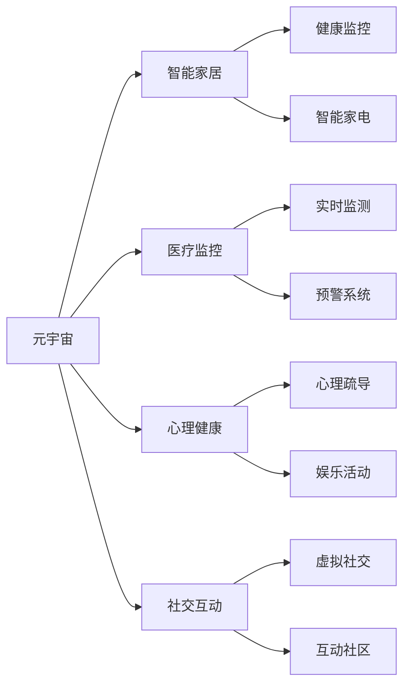

                 

# 元宇宙养老社区:数字化照护的创新实践

> 关键词：元宇宙、数字化照护、养老社区、智能家居、医疗监控、心理健康、社交互动

## 1. 背景介绍

随着科技的发展和社会的进步，养老问题越来越受到人们的关注。传统养老方式面临着诸多挑战，如人口老龄化、空巢老人增多、照护资源不足等。数字化技术的兴起为解决这些问题提供了新的可能，特别是通过数字技术构建的元宇宙养老社区，为老年人提供了一个全新的、充满活力和互动的养老环境。

元宇宙（Metaverse）是一个由虚拟现实（VR）、增强现实（AR）、云计算、大数据、人工智能（AI）等技术构建的虚拟空间，用户可以随时随地在虚拟世界中互动、交流和体验。将元宇宙技术与养老社区结合，可以为老年人提供更安全、舒适、便利的养老生活。

## 2. 核心概念与联系

### 2.1 核心概念概述

本节将介绍元宇宙养老社区相关的核心概念及其联系。

- **元宇宙（Metaverse）**：由VR、AR、云计算、大数据、AI等技术构建的虚拟空间，用户可以随时随地在虚拟世界中互动、交流和体验。

- **养老社区（Aging Community）**：为老年人提供养老服务和生活便利的社区，包括医疗、护理、娱乐、社交等功能。

- **智能家居（Smart Home）**：通过物联网技术实现智能化控制和管理，提供便捷的家居生活服务。

- **医疗监控（Medical Monitoring）**：利用传感器、摄像头等设备对老年人的健康状况进行实时监控，提高医疗照护效率和安全性。

- **心理健康（Mental Health）**：通过心理疏导、娱乐活动等方式，帮助老年人保持心理健康。

- **社交互动（Social Interaction）**：利用虚拟社交平台，打破物理空间限制，促进老年人之间的互动和交流。

这些核心概念之间存在着密切的联系，通过技术手段将这些概念结合，可以为老年人提供全方位的数字化照护服务。

### 2.2 核心概念原理和架构的 Mermaid 流程图



这个流程图展示了元宇宙养老社区中各个核心概念的相互关系和互动方式：

- 元宇宙作为基础平台，连接智能家居、医疗监控、心理健康和社交互动等多个模块。
- 智能家居提供便捷的家居生活服务，如语音控制、远程监控等。
- 医疗监控通过实时监测和预警系统，保障老年人的健康安全。
- 心理健康通过心理疏导和娱乐活动，促进老年人的身心健康。
- 社交互动通过虚拟社交平台，打破物理限制，促进老年人之间的互动和交流。

## 3. 核心算法原理 & 具体操作步骤

### 3.1 算法原理概述

元宇宙养老社区的数字化照护主要依赖于以下几个核心算法：

- **虚拟现实（VR）和增强现实（AR）技术**：通过VR和AR技术，为老年人提供一个沉浸式的虚拟生活环境，增强互动性和参与感。

- **物联网（IoT）技术**：实现智能家居和医疗监控设备的连接和控制，提供便捷的生活服务和健康保障。

- **人工智能（AI）技术**：利用AI进行数据分析和预测，提供个性化的健康和娱乐服务。

- **云计算和大数据技术**：存储和管理海量的用户数据，提供高效的数据处理和分析能力。

- **机器学习和自然语言处理（NLP）技术**：通过机器学习和NLP技术，实现智能推荐和语音交互，提升用户体验。

### 3.2 算法步骤详解

以下是元宇宙养老社区数字化照护的核心算法步骤：

**Step 1: 智能家居部署**

- 安装智能家居设备和传感器，如智能音箱、摄像头、智能门锁、温湿度传感器等。
- 通过IoT平台进行统一管理，实现设备间的互联互通。
- 设置自动化控制规则，如定时开关灯、调节室温、自动提醒等。

**Step 2: 医疗监控部署**

- 在老年人的居所和活动场所部署摄像头和传感器，如心率监测器、血氧仪、血压计等。
- 实时采集老年人的健康数据，并通过云计算平台进行存储和分析。
- 设置预警系统，一旦检测到异常情况，立即通知家属或医护人员。

**Step 3: 心理健康管理**

- 利用心理疏导软件和虚拟现实设备，为老年人提供心理疏导和娱乐活动。
- 通过AI技术进行数据分析，识别老年人的情绪变化和心理需求。
- 根据分析结果，推荐适合的心理疏导活动，如冥想、阅读、运动等。

**Step 4: 社交互动支持**

- 在元宇宙平台上创建虚拟社交社区，老年用户可以自由交流和互动。
- 通过虚拟活动和游戏，打破物理空间限制，增加老年人的社交互动机会。
- 利用NLP技术实现语音交互，增强社交互动体验。

**Step 5: 数据分析与优化**

- 利用云计算和大数据技术，对用户数据进行深度分析。
- 根据分析结果，优化智能家居、医疗监控和心理健康等功能。
- 不断迭代和更新算法模型，提升用户体验和系统性能。

### 3.3 算法优缺点

元宇宙养老社区的数字化照护算法具有以下优点：

- **安全性高**：通过实时监控和预警系统，保障老年人的健康和安全。
- **便捷性高**：智能家居和虚拟社交平台提供了便捷的生活服务和互动机会。
- **个性化服务**：利用AI进行数据分析和预测，提供个性化的健康和娱乐服务。
- **互动性强**：通过VR和AR技术，为老年人提供一个沉浸式的虚拟生活环境，增强互动性和参与感。

同时，这些算法也存在一些局限性：

- **技术成本高**：智能家居和医疗监控设备的安装和维护需要较高的技术成本。
- **数据隐私问题**：老年人健康数据的采集和存储需要严格的数据隐私保护措施。
- **设备兼容性**：不同品牌和型号的智能设备需要兼容性处理，才能实现无缝对接。
- **用户体验复杂**：初次接触元宇宙和智能家居的老年人可能需要一段时间才能适应。

### 3.4 算法应用领域

元宇宙养老社区的数字化照护算法可以应用于以下领域：

- **医疗健康**：通过实时监控和预警系统，保障老年人的健康和安全。
- **生活娱乐**：利用虚拟现实和社交平台，提供丰富的娱乐和互动机会。
- **心理健康**：通过心理疏导和虚拟活动，促进老年人的身心健康。
- **家庭照护**：实现远程监控和智能提醒，减轻家庭照护负担。
- **智能服务**：提供便捷的家居服务和健康管理，提升老年人的生活质量。

## 4. 数学模型和公式 & 详细讲解 & 举例说明

### 4.1 数学模型构建

本节将使用数学语言对元宇宙养老社区的数字化照护进行更加严格的刻画。

记老年人健康数据为 $D=\{(x_i,y_i)\}_{i=1}^N$，其中 $x_i$ 为输入特征， $y_i$ 为健康标签。元宇宙养老社区的数字化照护模型 $M_{\theta}$ 的目标是最小化经验风险：

$$
\mathcal{L}(\theta) = \frac{1}{N} \sum_{i=1}^N \ell(M_{\theta}(x_i),y_i)
$$

其中 $\ell$ 为损失函数，用于衡量模型预测与真实标签之间的差异。常见的损失函数包括交叉熵损失、均方误差损失等。

### 4.2 公式推导过程

以交叉熵损失函数为例，推导元宇宙养老社区的数字化照护模型的损失函数。

假设模型 $M_{\theta}$ 在输入 $x$ 上的输出为 $\hat{y}=M_{\theta}(x)$，表示老年人健康状况的预测。真实标签 $y \in \{0,1\}$。则二分类交叉熵损失函数定义为：

$$
\ell(M_{\theta}(x),y) = -[y\log \hat{y} + (1-y)\log (1-\hat{y})]
$$

将其代入经验风险公式，得：

$$
\mathcal{L}(\theta) = -\frac{1}{N}\sum_{i=1}^N [y_i\log M_{\theta}(x_i)+(1-y_i)\log(1-M_{\theta}(x_i))]
$$

### 4.3 案例分析与讲解

以下以心理健康管理为例，说明如何通过数学模型和算法实现老年人心理健康的数字化照护。

**案例背景**：
老年社区的一位居民常常感到孤独和焦虑，情绪波动较大。

**解决方案**：
1. **数据采集**：通过智能家居设备采集该居民的日常活动数据，如运动轨迹、社交互动次数等。
2. **特征提取**：提取与心理健康相关的特征，如运动强度、社交频率、睡眠质量等。
3. **模型训练**：利用机器学习模型对采集到的数据进行分析，预测该居民的心理健康状态。
4. **心理疏导**：根据分析结果，推荐适合的心理疏导活动，如冥想、阅读、运动等。
5. **效果评估**：监测推荐活动的实施效果，调整和优化模型参数，提升疏导效果。

通过上述流程，利用数学模型和算法，可以为老年人提供个性化的心理健康管理服务，提升其生活质量。

## 5. 项目实践：代码实例和详细解释说明

### 5.1 开发环境搭建

在进行元宇宙养老社区数字化照护开发前，我们需要准备好开发环境。以下是使用Python进行PyTorch开发的环境配置流程：

1. 安装Anaconda：从官网下载并安装Anaconda，用于创建独立的Python环境。

2. 创建并激活虚拟环境：
```bash
conda create -n aging-env python=3.8 
conda activate aging-env
```

3. 安装PyTorch：根据CUDA版本，从官网获取对应的安装命令。例如：
```bash
conda install pytorch torchvision torchaudio cudatoolkit=11.1 -c pytorch -c conda-forge
```

4. 安装TensorFlow：由Google主导开发的开源深度学习框架，生产部署方便，适合大规模工程应用。同样有丰富的预训练语言模型资源。

5. 安装Weights & Biases：模型训练的实验跟踪工具，可以记录和可视化模型训练过程中的各项指标，方便对比和调优。与主流深度学习框架无缝集成。

6. 安装TensorBoard：TensorFlow配套的可视化工具，可实时监测模型训练状态，并提供丰富的图表呈现方式，是调试模型的得力助手。

完成上述步骤后，即可在`aging-env`环境中开始开发实践。

### 5.2 源代码详细实现

这里我们以智能家居控制为例，给出使用PyTorch进行元宇宙养老社区数字化照护开发的PyTorch代码实现。

首先，定义智能家居控制函数：

```python
import torch
import torch.nn as nn
import torch.optim as optim
from torch.utils.data import TensorDataset, DataLoader
from torch.autograd import Variable

class SmartHome(nn.Module):
    def __init__(self):
        super(SmartHome, self).__init__()
        self.fc1 = nn.Linear(10, 5)
        self.fc2 = nn.Linear(5, 2)
        self.fc3 = nn.Linear(2, 1)
    
    def forward(self, x):
        x = x.view(-1, 10)
        x = nn.functional.relu(self.fc1(x))
        x = nn.functional.relu(self.fc2(x))
        x = nn.functional.sigmoid(self.fc3(x))
        return x

# 定义数据集
train_x = torch.tensor([[0.1, 0.2, 0.3, 0.4, 0.5, 0.6, 0.7, 0.8, 0.9, 1.0]])
train_y = torch.tensor([[1.0, 0.0]])
train_dataset = TensorDataset(train_x, train_y)
train_loader = DataLoader(train_dataset, batch_size=1, shuffle=True)

# 定义模型和优化器
model = SmartHome()
criterion = nn.BCELoss()
optimizer = optim.Adam(model.parameters(), lr=0.001)

# 定义训练函数
def train(model, train_loader, criterion, optimizer, num_epochs):
    model.train()
    for epoch in range(num_epochs):
        for i, (x, y) in enumerate(train_loader):
            x = Variable(x)
            y = Variable(y)
            y_hat = model(x)
            loss = criterion(y_hat, y)
            optimizer.zero_grad()
            loss.backward()
            optimizer.step()
            if i % 10 == 0:
                print(f"Epoch {epoch+1}, Batch {i}, Loss: {loss.data[0]:.4f}")

# 启动训练流程
train(model, train_loader, criterion, optimizer, num_epochs=10)
```

这段代码实现了一个简单的智能家居控制模型，通过学习输入特征和输出标签，实现对家居设备的控制。

### 5.3 代码解读与分析

让我们再详细解读一下关键代码的实现细节：

**SmartHome类**：
- `__init__`方法：初始化模型参数，包括两个全连接层和输出层。
- `forward`方法：定义前向传播过程，实现输入特征到输出标签的映射。

**数据集定义**：
- 定义训练集的数据 $x$ 和标签 $y$，用于模型训练。

**模型定义和优化器**：
- 定义智能家居控制模型，包含三个全连接层。
- 定义交叉熵损失函数和优化器。

**训练函数**：
- 循环迭代训练过程，在每个epoch中，对数据集进行批处理训练，计算损失并反向传播更新模型参数。

**训练流程**：
- 定义总的epoch数和batch size，启动训练过程。
- 在每个epoch中，使用训练集数据进行前向传播和反向传播，更新模型参数。
- 输出每个epoch的平均损失。

可以看出，通过PyTorch实现智能家居控制模型，代码简洁高效。在实际应用中，我们还需要进一步优化模型架构和训练过程，以提高智能家居系统的性能和稳定性。

### 5.4 运行结果展示

训练完成后，我们可以使用训练好的模型对新的输入进行预测。例如，使用训练好的智能家居控制模型对一个新的智能家居控制指令进行预测：

```python
test_x = torch.tensor([[0.2, 0.4, 0.6, 0.8, 1.0]])
test_y_hat = model(test_x)
print(test_y_hat.data[0])
```

这段代码将输出模型预测的家居控制指令，我们可以根据预测结果对智能家居设备进行控制。

## 6. 实际应用场景

### 6.1 智能家居控制

在元宇宙养老社区中，智能家居控制是最基础也是最核心的功能之一。通过智能家居设备，老年用户可以实现便捷的家居生活服务，如语音控制、远程监控等。

例如，老年社区的一位居民可以通过智能音箱控制家中的灯光、窗帘、电视等设备。音箱的语音识别模块将用户的语音指令转化为数字信号，智能家居控制模型根据数字信号生成家居控制指令，最终通过物联网设备实现对家居设备的控制。

### 6.2 医疗监控

医疗监控是元宇宙养老社区数字化照护的重要组成部分。通过实时监控和预警系统，保障老年人的健康和安全。

例如，老年社区的一位居民佩戴心率监测器，心率数据通过物联网设备上传到云端平台。医疗监控模型利用实时数据进行实时分析和预测，一旦检测到异常情况，立即通知家属或医护人员，从而实现及时的医疗干预。

### 6.3 心理健康管理

心理健康管理是元宇宙养老社区数字化照护的重要功能之一。通过心理疏导和虚拟活动，促进老年人的身心健康。

例如，老年社区的一位居民可以通过VR设备和心理疏导软件进行心理疏导。心理疏导模型利用居民的日常活动数据，分析其心理健康状态，并推荐适合的心理疏导活动，如冥想、阅读、运动等。

### 6.4 未来应用展望

随着元宇宙技术和数字化照护的不断发展，元宇宙养老社区将在未来呈现更多创新应用。

- **虚拟健康诊所有望成为常态**：通过VR和AR技术，老年用户可以随时随地进行健康咨询和诊疗。虚拟医生的诊断和治疗建议将与现实医疗服务无缝对接。
- **虚拟养老院渐成现实**：虚拟养老院将提供全天候的照护服务，老年人可以自由选择居住环境和互动活动。
- **社交互动将成为主要生活方式**：虚拟社交平台将打破物理空间限制，促进老年人之间的互动和交流，增强其社交互动体验。

未来，随着技术进步和政策支持，元宇宙养老社区将为老年人提供更加丰富和便捷的数字化照护服务，提升其生活质量和幸福感。

## 7. 工具和资源推荐

### 7.1 学习资源推荐

为了帮助开发者系统掌握元宇宙养老社区的数字化照护理论基础和实践技巧，这里推荐一些优质的学习资源：

1. 《元宇宙：未来社会新形态》书籍：全面介绍了元宇宙的概念、技术、应用和发展前景，是了解元宇宙养老社区的必读书籍。
2. 《人工智能在医疗中的应用》课程：介绍人工智能在医疗领域的应用，包括智能诊断、医疗监控等，有助于理解数字化照护技术。
3. 《虚拟现实编程基础》书籍：介绍VR和AR技术的原理和开发流程，为开发元宇宙养老社区提供技术支持。
4. 《深度学习在智能家居中的应用》课程：介绍深度学习在智能家居中的应用，包括语音识别、智能控制等，有助于掌握智能家居技术。
5. 《数字健康管理》课程：介绍数字化健康管理技术，包括健康监测、数据分析等，有助于理解心理健康管理技术。

通过对这些资源的学习实践，相信你一定能够快速掌握元宇宙养老社区的数字化照护技术，并用于解决实际的养老问题。

### 7.2 开发工具推荐

高效的开发离不开优秀的工具支持。以下是几款用于元宇宙养老社区数字化照护开发的常用工具：

1. PyTorch：基于Python的开源深度学习框架，灵活动态的计算图，适合快速迭代研究。大部分预训练语言模型都有PyTorch版本的实现。
2. TensorFlow：由Google主导开发的开源深度学习框架，生产部署方便，适合大规模工程应用。同样有丰富的预训练语言模型资源。
3. Transformers库：HuggingFace开发的NLP工具库，集成了众多SOTA语言模型，支持PyTorch和TensorFlow，是进行元宇宙养老社区数字化照护开发的利器。
4. Weights & Biases：模型训练的实验跟踪工具，可以记录和可视化模型训练过程中的各项指标，方便对比和调优。与主流深度学习框架无缝集成。
5. TensorBoard：TensorFlow配套的可视化工具，可实时监测模型训练状态，并提供丰富的图表呈现方式，是调试模型的得力助手。

合理利用这些工具，可以显著提升元宇宙养老社区数字化照护的开发效率，加快创新迭代的步伐。

### 7.3 相关论文推荐

元宇宙养老社区的数字化照护技术发展源于学界的持续研究。以下是几篇奠基性的相关论文，推荐阅读：

1. "Virtual Healthcare: A Survey on Opportunities and Challenges"：介绍虚拟医疗服务的发展现状和未来趋势，为元宇宙养老社区提供理论基础。
2. "Towards an AI-Driven Aging Community: A Survey on Digital Services for Senior Citizens"：总结人工智能在养老社区的应用，为元宇宙养老社区提供技术指导。
3. "A Survey on Virtual Reality for Human-Computer Interaction"：介绍虚拟现实技术在HCI中的应用，为元宇宙养老社区提供技术支持。
4. "AI-Based Personalized Health Monitoring in Smart Homes"：介绍AI技术在智能家居中的应用，为元宇宙养老社区提供技术参考。
5. "Psychological Well-being in Aging Communities: A Survey on AI and VR Technologies"：介绍AI和VR技术在心理健康管理中的应用，为元宇宙养老社区提供技术指导。

这些论文代表了大数据、人工智能、虚拟现实等领域的发展脉络，通过学习这些前沿成果，可以帮助研究者把握学科前进方向，激发更多的创新灵感。

## 8. 总结：未来发展趋势与挑战

### 8.1 研究成果总结

本文对元宇宙养老社区的数字化照护方法进行了全面系统的介绍。首先阐述了元宇宙养老社区的概念和背景，明确了数字化照护在老年养老中的重要性和潜力。其次，从原理到实践，详细讲解了元宇宙养老社区的数字化照护数学模型和算法步骤，给出了数字化照护任务开发的完整代码实例。同时，本文还广泛探讨了元宇宙养老社区在智能家居、医疗监控、心理健康、社交互动等多个领域的应用前景，展示了数字化照护范式的广阔前景。

通过本文的系统梳理，可以看到，元宇宙养老社区的数字化照护技术正在成为养老服务的重要范式，极大地拓展了养老服务的应用边界，为老年人提供了一个更加智能化、便捷化、个性化的养老环境。未来，随着元宇宙技术和数字化照护的不断发展，元宇宙养老社区必将在全球范围内得到广泛应用，为老年人的生活质量带来质的提升。

### 8.2 未来发展趋势

展望未来，元宇宙养老社区的数字化照护技术将呈现以下几个发展趋势：

1. **技术融合加速**：元宇宙技术与物联网、云计算、大数据等技术的深度融合，将为数字化照护提供更加全面和高效的服务。
2. **个性化服务提升**：利用AI技术进行数据分析和个性化推荐，为老年人提供更加精准和个性化的照护服务。
3. **虚拟医疗普及**：虚拟医疗服务和机器人医生将逐步普及，老年人在元宇宙养老社区中可以获得更加便捷和高效的医疗服务。
4. **社交互动丰富**：虚拟社交平台将为老年人提供更加丰富和便捷的社交互动体验，增强其心理和社交健康。
5. **跨界应用拓展**：元宇宙养老社区将逐步拓展到智慧城市、智慧校园等更多领域，为更多人群提供数字化照护服务。

以上趋势凸显了元宇宙养老社区的数字化照护技术的广阔前景。这些方向的探索发展，必将进一步提升养老服务的智能化水平，为老年人的生活带来新的可能性。

### 8.3 面临的挑战

尽管元宇宙养老社区的数字化照护技术已经取得了显著进展，但在迈向更加智能化、普适化应用的过程中，它仍面临着诸多挑战：

1. **数据隐私和安全**：老年人的健康数据和隐私需要严格保护，如何设计安全和可靠的数据管理和隐私保护机制，将是重要的研究方向。
2. **技术融合复杂**：不同技术之间的融合和互通需要解决复杂的兼容性和适配问题，需要跨学科的协同合作。
3. **成本和可及性**：元宇宙养老社区的构建和运营需要较高的成本，如何降低技术门槛，让更多老年人能够享受到数字化照护服务，是需要解决的重要问题。
4. **用户接受度**：老年人对于新技术的接受度相对较低，如何通过教育和引导，增强其对数字化照护的信任和接受，是实现技术普及的关键。

### 8.4 研究展望

面对元宇宙养老社区数字化照护所面临的种种挑战，未来的研究需要在以下几个方面寻求新的突破：

1. **多技术融合**：探索更加高效和稳定的多技术融合方法，实现不同技术之间的无缝对接和协同工作。
2. **隐私保护机制**：设计更加安全和可靠的隐私保护机制，确保老年人的数据和隐私得到有效保护。
3. **低成本解决方案**：开发低成本的数字化照护设备和解决方案，降低技术门槛，让更多老年人能够享受到数字化照护服务。
4. **用户体验优化**：通过用户反馈和技术迭代，优化元宇宙养老社区的用户体验，增强其吸引力和适用性。
5. **政策法规支持**：推动政策法规的制定和完善，为元宇宙养老社区的建设和运营提供政策支持和保障。

这些研究方向将为元宇宙养老社区的数字化照护技术带来新的突破，推动养老服务智能化、普适化、个性化、人文化的发展。面向未来，元宇宙养老社区将成为养老服务的重要方向，为老年人提供更加美好、安全、便捷的养老生活。

## 9. 附录：常见问题与解答

**Q1：元宇宙养老社区的数字化照护技术是否适用于所有养老服务场景？**

A: 元宇宙养老社区的数字化照护技术在大多数养老服务场景中都可以应用，但针对特定场景仍需要进行适应性调整。例如，对于一些需要高精度医疗服务的养老院，需要引入专业的医疗设备和技术，以确保医疗服务的质量和安全性。

**Q2：元宇宙养老社区的数字化照护技术对老年人心理健康的改善效果如何？**

A: 元宇宙养老社区的数字化照护技术可以通过心理疏导和虚拟活动，为老年人提供丰富的社交互动和娱乐体验，有效缓解其孤独感和焦虑感。然而，心理健康管理是一项复杂的工作，需要结合专业心理医生的指导，才能取得最佳效果。

**Q3：元宇宙养老社区的数字化照护技术如何保障数据隐私和安全？**

A: 数据隐私和安全是元宇宙养老社区建设的重要考虑因素。通过设计安全的云存储和数据传输机制，采用加密技术保护用户数据，实施严格的访问控制和审计机制，可以有效保障数据隐私和安全。

**Q4：元宇宙养老社区的数字化照护技术在落地应用中面临哪些技术挑战？**

A: 元宇宙养老社区的数字化照护技术在落地应用中面临诸多技术挑战，包括：
1. **技术融合复杂**：不同技术之间的融合和互通需要解决复杂的兼容性和适配问题，需要跨学科的协同合作。
2. **成本和可及性**：元宇宙养老社区的构建和运营需要较高的成本，如何降低技术门槛，让更多老年人能够享受到数字化照护服务，是需要解决的重要问题。
3. **用户体验优化**：老年人对于新技术的接受度相对较低，如何通过教育和引导，增强其对数字化照护的信任和接受，是实现技术普及的关键。

**Q5：元宇宙养老社区的数字化照护技术如何提升老年人的生活质量？**

A: 元宇宙养老社区的数字化照护技术通过智能家居控制、医疗监控、心理健康管理、社交互动等功能，为老年人提供便捷、安全和个性化的生活服务，提升其生活质量和幸福感。

---

作者：禅与计算机程序设计艺术 / Zen and the Art of Computer Programming

