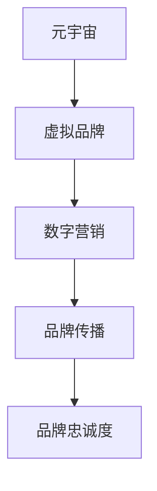

                 

# 元宇宙营销:数字化品牌建设新阵地

## 1. 背景介绍

### 1.1 问题由来
随着科技的迅猛发展，互联网已进入了一个全新的时代——元宇宙。元宇宙是虚拟世界的全面拓展，结合了虚拟现实、增强现实、云计算等前沿技术，正在逐渐构建一个全新的数字化生活空间。在这个虚拟世界中，人们可以进行交流、购物、社交、办公、娱乐等多方面的活动，从而打破现实世界的限制，实现“虚实融合”的全新体验。

### 1.2 问题核心关键点
元宇宙带来了巨大的商业机会，企业纷纷将目光投向这一新兴领域，通过元宇宙进行品牌营销，成为了许多企业的新选择。然而，尽管元宇宙具有诸多优势，其商业价值和应用场景仍需要进一步探索和挖掘。如何在元宇宙中建立和维护品牌形象，如何通过数字化手段提升品牌影响力和竞争力，成为了当前数字化品牌建设的关键问题。

### 1.3 问题研究意义
探索元宇宙营销的方法和策略，对于企业来说，具有深远的意义：

1. **突破传统营销瓶颈**：传统的营销方式已无法满足现代消费者的需求，元宇宙营销可以提供全新的用户互动体验，突破传统营销的限制。
2. **提升品牌知名度**：元宇宙用户群体年轻化，拥有较高的消费意愿，通过元宇宙营销可以快速提升品牌知名度和美誉度。
3. **增强品牌忠诚度**：元宇宙平台可以实现更深层次的用户互动，增强用户对品牌的粘性，提高品牌忠诚度。
4. **探索新商业机会**：元宇宙是新兴市场，企业可以在这一市场中探索新的商业机会，实现业务模式的创新。

## 2. 核心概念与联系

### 2.1 核心概念概述

在探索元宇宙营销之前，我们需要理解几个核心概念：

- **元宇宙 (Metaverse)**：指通过互联网技术构建的一个虚拟世界，包括虚拟现实 (VR)、增强现实 (AR)、云计算等技术，能够提供沉浸式的互动体验。
- **虚拟品牌 (Virtual Brand)**：指在元宇宙中建立的品牌形象，通过虚拟人物、虚拟场景等形式，展现品牌特色和价值。
- **数字营销 (Digital Marketing)**：指利用互联网技术进行品牌宣传、市场推广等营销活动，元宇宙营销是数字营销的重要组成部分。
- **品牌传播 (Brand Communication)**：指通过各种渠道向目标用户传递品牌信息，提升品牌影响力。
- **品牌忠诚度 (Brand Loyalty)**：指用户对品牌的忠诚和信任程度，反映了品牌在用户心中的地位。

这些核心概念之间的逻辑关系可以通过以下Mermaid流程图来展示：



这个流程图展示了大语言模型的核心概念及其之间的关系：

1. 元宇宙作为平台，承载着品牌形象的展现。
2. 虚拟品牌在元宇宙中通过数字营销和品牌传播来提升影响力。
3. 最终目标是通过提升品牌忠诚度，实现用户粘性和商业价值。

## 3. 核心算法原理 & 具体操作步骤
### 3.1 算法原理概述

元宇宙营销的核心算法原理，主要围绕着如何在虚拟空间中通过数字化手段进行品牌推广和用户互动。这需要利用人工智能、大数据、云计算等技术手段，对元宇宙中的用户行为进行分析，精准推送品牌信息，提高用户互动和参与度。

具体而言，元宇宙营销的算法原理包括以下几个关键步骤：

1. **用户行为分析**：通过对用户在元宇宙中的行为数据进行分析，识别用户的兴趣和需求，为品牌推广提供数据支持。
2. **个性化推荐**：根据用户行为分析结果，进行个性化推荐，提升用户对品牌的兴趣和参与度。
3. **内容创作**：利用人工智能生成技术，如自然语言处理、图像生成等，创作符合品牌特色的虚拟内容，吸引用户关注。
4. **互动反馈**：通过元宇宙平台与用户进行互动，收集用户的反馈信息，优化品牌推广策略。
5. **效果评估**：对品牌推广效果进行评估，优化推广策略，提升品牌影响力。

### 3.2 算法步骤详解

以下是元宇宙营销算法的详细步骤：

**Step 1: 收集元宇宙用户行为数据**
- 使用日志分析、用户行为追踪等技术，收集用户在元宇宙中的行为数据，如访问路径、停留时间、互动频率等。

**Step 2: 用户行为建模**
- 利用机器学习算法，对收集到的用户行为数据进行建模，识别出用户的行为模式和兴趣偏好。

**Step 3: 个性化推荐引擎设计**
- 基于用户行为模型，设计个性化推荐引擎，对用户进行精准推荐，如推荐相关虚拟商品、虚拟活动等。

**Step 4: 虚拟内容创作**
- 利用自然语言处理、图像生成等技术，创作符合品牌特色的虚拟内容，如虚拟人物、虚拟广告等。

**Step 5: 互动反馈机制**
- 在元宇宙平台中引入互动反馈机制，收集用户对虚拟内容的评价和反馈，及时调整内容创作和推荐策略。

**Step 6: 品牌推广效果评估**
- 通过数据分析，对品牌推广效果进行评估，如用户互动率、品牌曝光率、转化率等，优化推广策略。

### 3.3 算法优缺点

元宇宙营销算法具有以下优点：

1. **精准用户定位**：通过对用户行为数据的分析，可以精准定位目标用户群体，提高推广的精准度。
2. **沉浸式体验**：利用虚拟现实技术，提供沉浸式的用户互动体验，增强用户的参与感和满意度。
3. **高效互动反馈**：通过互动反馈机制，及时收集用户反馈，优化推广策略，提升品牌影响力。

同时，元宇宙营销算法也存在以下缺点：

1. **数据隐私问题**：用户行为数据的收集和分析，可能涉及到用户隐私，需要严格遵守相关法律法规。
2. **技术复杂度较高**：涉及人工智能、大数据、云计算等前沿技术，技术实现难度较大。
3. **内容创作成本高**：高质量的虚拟内容创作，需要耗费大量的人力和财力资源。
4. **效果评估困难**：元宇宙用户行为数据的多样性和复杂性，增加了品牌推广效果评估的难度。

### 3.4 算法应用领域

元宇宙营销算法已经在多个领域得到了广泛应用，例如：

- **虚拟零售**：通过元宇宙平台进行虚拟商品展示、虚拟试穿、虚拟购物车等，提升用户的购物体验。
- **虚拟旅游**：利用虚拟现实技术，提供虚拟旅游体验，让用户足不出户即可游览世界名胜。
- **虚拟娱乐**：在元宇宙中提供虚拟演唱会、虚拟体育比赛等，提升用户的娱乐体验。
- **虚拟会议**：通过元宇宙平台进行虚拟会议，提高会议效率和互动体验。
- **虚拟办公**：在元宇宙中提供虚拟办公环境，提升远程办公体验和协作效率。

除了上述这些经典应用外，元宇宙营销还将不断拓展到更多领域，如虚拟展览、虚拟教育等，为品牌营销带来更多可能性。

## 4. 数学模型和公式 & 详细讲解  
### 4.1 数学模型构建

在元宇宙营销算法中，我们主要关注以下几个数学模型：

- **用户行为模型**：用于分析用户行为数据，识别用户兴趣和需求。
- **推荐算法模型**：用于设计个性化推荐引擎，提升用户对品牌的兴趣和参与度。
- **效果评估模型**：用于评估品牌推广效果，优化推广策略。

以用户行为模型为例，假设用户行为数据为 $D=\{(x_i,y_i)\}_{i=1}^N$，其中 $x_i$ 为用户行为特征，$y_i$ 为用户行为标签。则用户行为模型可以表示为：

$$
P(y_i|x_i) = \sigma(Wx_i + b)
$$

其中 $\sigma$ 为激活函数，$W$ 和 $b$ 为模型参数，$x_i$ 为输入特征向量。

### 4.2 公式推导过程

以下是用户行为模型的公式推导过程：

1. **假设数据分布**：假设用户行为数据 $D$ 服从伯努利分布，即 $y_i \in \{0,1\}$。
2. **构造损失函数**：根据伯努利分布，构造交叉熵损失函数：

$$
\mathcal{L}(W,b) = -\frac{1}{N} \sum_{i=1}^N [y_i\log P(y_i|x_i) + (1-y_i)\log(1-P(y_i|x_i))]
$$

3. **优化目标**：最小化损失函数，得到模型参数 $W$ 和 $b$：

$$
\mathop{\arg\min}_{W,b} \mathcal{L}(W,b)
$$

4. **梯度下降**：使用梯度下降算法，迭代更新模型参数，直至收敛：

$$
W \leftarrow W - \eta \nabla_{W}\mathcal{L}(W,b) \\
b \leftarrow b - \eta \nabla_{b}\mathcal{L}(W,b)
$$

其中 $\eta$ 为学习率。

### 4.3 案例分析与讲解

假设我们希望通过元宇宙营销推广一款智能手表产品，首先需要进行用户行为分析，识别出对智能手表感兴趣的用户群体。

- **数据收集**：收集用户在元宇宙平台上的浏览、点击、购买等行为数据。
- **特征提取**：提取用户行为特征，如浏览路径、停留时间、点击频率等。
- **模型训练**：基于伯努利分布，使用逻辑回归模型进行训练，得到用户行为模型 $P(y|x)$。
- **用户筛选**：利用用户行为模型，筛选出对智能手表感兴趣的用户，进行个性化推荐。

## 5. 项目实践：代码实例和详细解释说明
### 5.1 开发环境搭建

在进行元宇宙营销的代码实现前，我们需要准备好开发环境。以下是使用Python进行PyTorch开发的环境配置流程：

1. 安装Anaconda：从官网下载并安装Anaconda，用于创建独立的Python环境。

2. 创建并激活虚拟环境：
```bash
conda create -n pytorch-env python=3.8 
conda activate pytorch-env
```

3. 安装PyTorch：根据CUDA版本，从官网获取对应的安装命令。例如：
```bash
conda install pytorch torchvision torchaudio cudatoolkit=11.1 -c pytorch -c conda-forge
```

4. 安装各类工具包：
```bash
pip install numpy pandas scikit-learn matplotlib tqdm jupyter notebook ipython
```

完成上述步骤后，即可在`pytorch-env`环境中开始元宇宙营销的代码实践。

### 5.2 源代码详细实现

下面我们以元宇宙零售平台为例，给出使用Transformers库对BERT模型进行微调的PyTorch代码实现。

首先，定义元宇宙零售平台的用户行为数据：

```python
from torch.utils.data import Dataset
import torch

class RetailDataset(Dataset):
    def __init__(self, texts, labels, tokenizer, max_len=128):
        self.texts = texts
        self.labels = labels
        self.tokenizer = tokenizer
        self.max_len = max_len
        
    def __len__(self):
        return len(self.texts)
    
    def __getitem__(self, item):
        text = self.texts[item]
        label = self.labels[item]
        
        encoding = self.tokenizer(text, return_tensors='pt', max_length=self.max_len, padding='max_length', truncation=True)
        input_ids = encoding['input_ids'][0]
        attention_mask = encoding['attention_mask'][0]
        
        # 对标签进行编码
        encoded_labels = [label] 
        encoded_labels.extend([0.] * (self.max_len - len(encoded_labels)))
        labels = torch.tensor(encoded_labels, dtype=torch.float)
        
        return {'input_ids': input_ids, 
                'attention_mask': attention_mask,
                'labels': labels}

# 创建dataset
tokenizer = BertTokenizer.from_pretrained('bert-base-cased')

train_dataset = RetailDataset(train_texts, train_labels, tokenizer)
dev_dataset = RetailDataset(dev_texts, dev_labels, tokenizer)
test_dataset = RetailDataset(test_texts, test_labels, tokenizer)
```

然后，定义模型和优化器：

```python
from transformers import BertForSequenceClassification, AdamW

model = BertForSequenceClassification.from_pretrained('bert-base-cased', num_labels=2)

optimizer = AdamW(model.parameters(), lr=2e-5)
```

接着，定义训练和评估函数：

```python
from torch.utils.data import DataLoader
from tqdm import tqdm
from sklearn.metrics import accuracy_score

device = torch.device('cuda') if torch.cuda.is_available() else torch.device('cpu')
model.to(device)

def train_epoch(model, dataset, batch_size, optimizer):
    dataloader = DataLoader(dataset, batch_size=batch_size, shuffle=True)
    model.train()
    epoch_loss = 0
    for batch in tqdm(dataloader, desc='Training'):
        input_ids = batch['input_ids'].to(device)
        attention_mask = batch['attention_mask'].to(device)
        labels = batch['labels'].to(device)
        model.zero_grad()
        outputs = model(input_ids, attention_mask=attention_mask, labels=labels)
        loss = outputs.loss
        epoch_loss += loss.item()
        loss.backward()
        optimizer.step()
    return epoch_loss / len(dataloader)

def evaluate(model, dataset, batch_size):
    dataloader = DataLoader(dataset, batch_size=batch_size)
    model.eval()
    preds, labels = [], []
    with torch.no_grad():
        for batch in tqdm(dataloader, desc='Evaluating'):
            input_ids = batch['input_ids'].to(device)
            attention_mask = batch['attention_mask'].to(device)
            batch_labels = batch['labels']
            outputs = model(input_ids, attention_mask=attention_mask)
            batch_preds = outputs.logits.argmax(dim=2).to('cpu').tolist()
            batch_labels = batch_labels.to('cpu').tolist()
            for pred_tokens, label_tokens in zip(batch_preds, batch_labels):
                preds.append(pred_tokens)
                labels.append(label_tokens)
                
    print(f"Accuracy: {accuracy_score(labels, preds):.2f}")
```

最后，启动训练流程并在测试集上评估：

```python
epochs = 5
batch_size = 16

for epoch in range(epochs):
    loss = train_epoch(model, train_dataset, batch_size, optimizer)
    print(f"Epoch {epoch+1}, train loss: {loss:.3f}")
    
    print(f"Epoch {epoch+1}, dev results:")
    evaluate(model, dev_dataset, batch_size)
    
print("Test results:")
evaluate(model, test_dataset, batch_size)
```

以上就是使用PyTorch对BERT模型进行元宇宙零售平台的用户行为分析的完整代码实现。可以看到，得益于Transformers库的强大封装，我们可以用相对简洁的代码完成模型的加载和训练。

### 5.3 代码解读与分析

让我们再详细解读一下关键代码的实现细节：

**RetailDataset类**：
- `__init__`方法：初始化训练集、验证集、测试集的用户行为数据。
- `__len__`方法：返回数据集的样本数量。
- `__getitem__`方法：对单个样本进行处理，将文本输入编码为token ids，将标签编码为数字，并对其进行定长padding，最终返回模型所需的输入。

**模型定义**：
- 使用BertForSequenceClassification模型作为用户行为分析模型的顶层分类器。
- 使用AdamW优化器进行模型参数更新。

**训练和评估函数**：
- 使用PyTorch的DataLoader对数据集进行批次化加载，供模型训练和推理使用。
- 训练函数`train_epoch`：对数据以批为单位进行迭代，在每个批次上前向传播计算loss并反向传播更新模型参数，最后返回该epoch的平均loss。
- 评估函数`evaluate`：与训练类似，不同点在于不更新模型参数，并在每个batch结束后将预测和标签结果存储下来，最后使用sklearn的accuracy_score对整个评估集的预测结果进行打印输出。

**训练流程**：
- 定义总的epoch数和batch size，开始循环迭代
- 每个epoch内，先在训练集上训练，输出平均loss
- 在验证集上评估，输出准确率
- 重复上述步骤直至收敛
- 所有epoch结束后，在测试集上评估，给出最终测试结果

可以看到，PyTorch配合Transformers库使得元宇宙营销的代码实现变得简洁高效。开发者可以将更多精力放在数据处理、模型改进等高层逻辑上，而不必过多关注底层的实现细节。

当然，工业级的系统实现还需考虑更多因素，如模型的保存和部署、超参数的自动搜索、更灵活的任务适配层等。但核心的元宇宙营销算法基本与此类似。

## 6. 实际应用场景
### 6.1 智能零售平台

元宇宙营销在智能零售平台中的应用，可以带来全新的购物体验和营销策略。智能零售平台通过虚拟试衣间、虚拟商品展示、虚拟购物车等技术，结合用户行为分析，能够提供个性化的推荐和互动，提升用户的购物体验。

在技术实现上，智能零售平台可以通过收集用户的浏览、点击、购买等行为数据，利用用户行为模型进行个性化推荐，同时在元宇宙中设置虚拟商品展示区和互动窗口，提升用户的互动和参与度。

### 6.2 虚拟旅游平台

元宇宙营销在虚拟旅游平台中的应用，可以提供沉浸式的旅游体验，吸引更多用户参与。虚拟旅游平台通过虚拟现实技术，展示世界各地的名胜古迹，让用户足不出户即可游览。

在技术实现上，虚拟旅游平台可以通过用户行为分析，识别出对特定景点感兴趣的用户，进行个性化的旅游推荐，同时在元宇宙中设置虚拟导游和互动问答环节，提升用户的参与感和满意度。

### 6.3 虚拟娱乐平台

元宇宙营销在虚拟娱乐平台中的应用，可以提供更加丰富多样的娱乐内容，吸引更多用户关注。虚拟娱乐平台通过游戏、音乐、电影等多元化的内容，结合用户行为分析，进行个性化的内容推荐，提升用户的互动和参与度。

在技术实现上，虚拟娱乐平台可以通过用户行为分析，识别出对特定类型内容感兴趣的用户，进行个性化的内容推荐，同时在元宇宙中设置虚拟互动环节，提升用户的互动体验。

### 6.4 未来应用展望

随着元宇宙技术的不断进步，元宇宙营销的应用场景也将不断拓展，为品牌营销带来更多的可能性。未来，元宇宙营销将涵盖更多的行业领域，如虚拟展览、虚拟教育等，为企业提供更广阔的营销空间。

在元宇宙中，品牌不仅可以通过虚拟产品展示、虚拟体验活动等方式进行营销，还可以利用虚拟人物、虚拟场景等形式，进行更深入的品牌传播和用户互动。同时，元宇宙平台也将成为品牌与用户互动的重要渠道，通过虚拟直播、虚拟活动等方式，增强品牌影响力和用户粘性。

## 7. 工具和资源推荐
### 7.1 学习资源推荐

为了帮助开发者系统掌握元宇宙营销的理论基础和实践技巧，这里推荐一些优质的学习资源：

1. 《元宇宙营销指南》系列博文：由元宇宙营销专家撰写，深入浅出地介绍了元宇宙营销的理论基础、实践技巧和最新趋势。

2. 《元宇宙营销实战手册》书籍：全面介绍了元宇宙营销的各个方面，包括市场分析、用户行为分析、个性化推荐等，是元宇宙营销入门的经典之作。

3. 《元宇宙技术》课程：清华大学开设的元宇宙技术课程，涵盖元宇宙平台、虚拟现实、增强现实等多个领域，带你全面了解元宇宙的基础技术。

4. 《元宇宙营销实战》视频课程：由元宇宙营销实战专家讲解，结合具体案例，教你如何通过元宇宙进行品牌推广和用户互动。

5. Metaverse Stack Exchange：元宇宙技术问答社区，汇聚了元宇宙领域的专家和爱好者，提供丰富的交流和学习资源。

通过对这些资源的学习实践，相信你一定能够快速掌握元宇宙营销的精髓，并用于解决实际的营销问题。

### 7.2 开发工具推荐

高效的开发离不开优秀的工具支持。以下是几款用于元宇宙营销开发的常用工具：

1. Unreal Engine：由Epic Games开发的虚拟现实引擎，支持虚拟现实、增强现实等技术，是元宇宙平台开发的首选工具。

2. Unity：由Unity Technologies开发的跨平台游戏引擎，支持虚拟现实、增强现实等技术，广泛应用于虚拟娱乐和教育等领域。

3. Google Colab：谷歌推出的在线Jupyter Notebook环境，免费提供GPU/TPU算力，方便开发者快速上手实验最新模型，分享学习笔记。

4. Microsoft Azure：微软提供的云服务平台，支持元宇宙应用的部署和维护，提供强大的计算和存储能力。

5. AWS：亚马逊提供的云服务平台，支持元宇宙应用的部署和维护，提供灵活的计算和存储解决方案。

合理利用这些工具，可以显著提升元宇宙营销任务的开发效率，加快创新迭代的步伐。

### 7.3 相关论文推荐

元宇宙营销的发展源于学界的持续研究。以下是几篇奠基性的相关论文，推荐阅读：

1. 《虚拟现实中的用户行为分析》（User Behavior Analysis in Virtual Reality）：介绍了虚拟现实技术中用户行为分析的原理和方法。

2. 《元宇宙营销：策略与技术》（Metaverse Marketing: Strategies and Technologies）：详细探讨了元宇宙营销的策略和技术，为元宇宙营销提供了全面的理论指导。

3. 《元宇宙平台的设计与实现》（Design and Implementation of Metaverse Platform）：介绍了元宇宙平台的设计和实现方法，为元宇宙营销提供了技术参考。

4. 《元宇宙中的品牌传播》（Brand Communication in Metaverse）：讨论了元宇宙平台中品牌传播的策略和方法，为元宇宙营销提供了实践经验。

5. 《元宇宙中的个性化推荐》（Personalized Recommendation in Metaverse）：研究了元宇宙平台中个性化推荐的算法和策略，为元宇宙营销提供了技术支持。

这些论文代表了大语言模型微调技术的发展脉络。通过学习这些前沿成果，可以帮助研究者把握学科前进方向，激发更多的创新灵感。

## 8. 总结：未来发展趋势与挑战

### 8.1 总结

本文对元宇宙营销的方法和策略进行了全面系统的介绍。首先阐述了元宇宙营销的背景和意义，明确了元宇宙营销在品牌建设中的独特价值。其次，从原理到实践，详细讲解了元宇宙营销的数学原理和关键步骤，给出了元宇宙营销任务开发的完整代码实例。同时，本文还广泛探讨了元宇宙营销在智能零售、虚拟旅游、虚拟娱乐等多个行业领域的应用前景，展示了元宇宙营销范式的巨大潜力。此外，本文精选了元宇宙营销的学习资源，力求为读者提供全方位的技术指引。

通过本文的系统梳理，可以看到，元宇宙营销通过虚拟空间中的数字化手段，实现了品牌推广和用户互动的全新方式。得益于虚拟现实、增强现实等前沿技术的支持，元宇宙营销能够提供沉浸式的互动体验，显著提升用户的参与度和满意度。未来，随着元宇宙技术的不断演进，元宇宙营销将拓展到更多的应用场景，成为数字化品牌建设的重要阵地。

### 8.2 未来发展趋势

展望未来，元宇宙营销将呈现以下几个发展趋势：

1. **技术深度融合**：元宇宙营销将深度融合AI、大数据、云计算等前沿技术，提供更加智能化的营销解决方案。
2. **用户互动增强**：元宇宙平台将引入更多互动元素，提升用户参与度和满意度。
3. **品牌传播多样化**：元宇宙营销将结合多种媒介形式，如虚拟广告、虚拟直播等，进行多样化的品牌传播。
4. **个性化推荐普及**：元宇宙平台将利用用户行为分析，进行个性化的内容推荐和互动，提升用户粘性。
5. **商业化应用广泛**：元宇宙营销将涵盖更多行业领域，如智能零售、虚拟旅游、虚拟娱乐等，为品牌提供更广阔的营销空间。

以上趋势凸显了元宇宙营销技术的广阔前景。这些方向的探索发展，必将进一步提升元宇宙营销的创新力和商业价值，为品牌建设和市场推广提供新的突破点。

### 8.3 面临的挑战

尽管元宇宙营销技术已经取得了一定的进展，但在迈向更加智能化、普适化应用的过程中，它仍面临着诸多挑战：

1. **技术成熟度不足**：元宇宙技术尚未完全成熟，硬件设备、平台功能等仍有待优化。
2. **用户接受度问题**：用户对元宇宙的接受度和参与度仍需要进一步提高，元宇宙营销的效果有待验证。
3. **数据隐私与安全**：元宇宙平台需要处理大量的用户行为数据，如何保障数据隐私和安全，是一大难题。
4. **内容创作成本高**：高质量的虚拟内容创作，需要耗费大量的人力和财力资源，内容成本较高。
5. **商业应用复杂**：元宇宙营销的商业应用场景复杂多样，需要综合考虑技术、商业、法律等多方面因素。

正视元宇宙营销面临的这些挑战，积极应对并寻求突破，将是大语言模型微调技术走向成熟的必由之路。相信随着学界和产业界的共同努力，这些挑战终将一一被克服，元宇宙营销必将在构建人机协同的智能时代中扮演越来越重要的角色。

### 8.4 研究展望

面向未来，元宇宙营销技术需要在以下几个方面寻求新的突破：

1. **多模态交互技术**：探索将虚拟现实、增强现实、人工智能等多模态技术融合，提供更加沉浸和互动的用户体验。
2. **元宇宙平台的生态建设**：构建开放的元宇宙平台，吸引更多的开发者和用户，推动元宇宙技术的普及和应用。
3. **跨领域应用拓展**：探索元宇宙营销在更多领域的应用，如智慧城市、医疗健康等，为更多行业提供创新的营销解决方案。
4. **技术与业务的深度融合**：将元宇宙营销与企业业务深度融合，提供个性化的品牌推广和用户互动，提升商业效果。
5. **用户隐私保护**：设计隐私保护机制，确保用户数据的安全性和隐私性，赢得用户的信任和支持。

这些研究方向的探索，必将引领元宇宙营销技术迈向更高的台阶，为构建安全、可靠、可解释、可控的智能系统铺平道路。面向未来，元宇宙营销技术还需要与其他人工智能技术进行更深入的融合，如知识表示、因果推理、强化学习等，多路径协同发力，共同推动元宇宙营销技术的进步。只有勇于创新、敢于突破，才能不断拓展元宇宙营销的边界，让智能技术更好地造福人类社会。

## 9. 附录：常见问题与解答

**Q1：元宇宙营销与传统营销有何不同？**

A: 元宇宙营销与传统营销的最大不同在于，它通过虚拟空间中的数字化手段，实现了品牌推广和用户互动的全新方式。元宇宙营销具有以下特点：
1. 沉浸式体验：利用虚拟现实、增强现实等技术，提供沉浸式的用户互动体验。
2. 个性化推荐：利用用户行为分析，进行个性化的内容推荐和互动。
3. 跨平台交互：用户可以在多个平台（如PC、手机、VR设备）上进行互动。
4. 虚拟互动：利用虚拟人物、虚拟场景等形式，进行更深层次的用户互动。

**Q2：元宇宙营销的优势有哪些？**

A: 元宇宙营销具有以下优势：
1. 提升用户参与度：利用虚拟现实、增强现实等技术，提供沉浸式的用户互动体验，提升用户的参与度和满意度。
2. 精准用户定位：通过用户行为分析，识别出目标用户群体，进行精准的品牌推广。
3. 多样化传播方式：结合虚拟广告、虚拟直播等多样化的传播方式，提升品牌传播效果。
4. 高粘性用户互动：利用虚拟人物、虚拟场景等形式，进行更深层次的用户互动，提升用户粘性。
5. 多模态融合：结合虚拟现实、增强现实、人工智能等多模态技术，提供更加多样化的用户互动方式。

**Q3：元宇宙营销有哪些潜在的挑战？**

A: 元宇宙营销面临以下挑战：
1. 技术成熟度不足：元宇宙技术尚未完全成熟，硬件设备、平台功能等仍有待优化。
2. 用户接受度问题：用户对元宇宙的接受度和参与度仍需要进一步提高，元宇宙营销的效果有待验证。
3. 数据隐私与安全：元宇宙平台需要处理大量的用户行为数据，如何保障数据隐私和安全，是一大难题。
4. 内容创作成本高：高质量的虚拟内容创作，需要耗费大量的人力和财力资源，内容成本较高。
5. 商业应用复杂：元宇宙营销的商业应用场景复杂多样，需要综合考虑技术、商业、法律等多方面因素。

正视这些挑战，积极应对并寻求突破，将是大语言模型微调技术走向成熟的必由之路。相信随着学界和产业界的共同努力，这些挑战终将一一被克服，元宇宙营销必将在构建人机协同的智能时代中扮演越来越重要的角色。

---

作者：禅与计算机程序设计艺术 / Zen and the Art of Computer Programming

