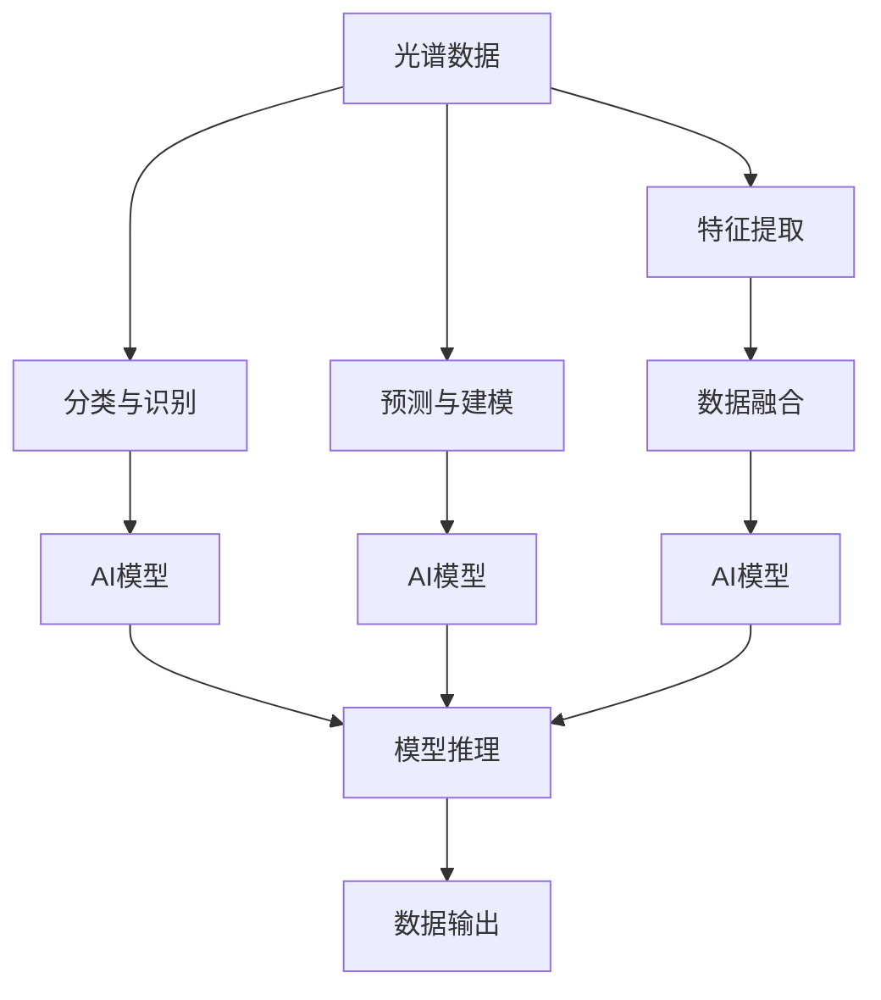

                 

# 光谱技术在AI for Science中的使用

## 1. 背景介绍

人工智能（AI）在科学研究中的应用已经成为推动科学进步的重要力量。AI技术在数据分析、模式识别、模拟仿真、药物设计等领域提供了强大的工具。光谱技术，作为科学实验中的重要手段，与AI技术的结合，可以显著提高数据的处理效率和分析能力。

在AI for Science中，光谱技术被广泛应用于以下几方面：

1. **光谱数据处理**：通过AI算法对光谱数据进行预处理、特征提取和分析。
2. **光谱图像分类**：利用AI模型对光谱图像进行分类和识别。
3. **光谱数据预测**：使用AI模型对光谱数据进行预测和建模。
4. **光谱数据融合**：将不同光谱数据源的信息进行融合，提升数据的整体分析能力。

本文将详细探讨光谱技术在AI for Science中的使用，包括其核心概念、算法原理、操作步骤以及实际应用案例。

## 2. 核心概念与联系

### 2.1 核心概念概述

为了更好地理解光谱技术在AI for Science中的应用，本节将介绍几个关键概念及其相互联系：

- **光谱数据**：光谱数据通常指物体在不同波长下反射、吸收或发射的光谱信息，是科学实验中常用的数据类型之一。
- **光谱图像**：将光谱数据在空间上分布表示，形成二维或三维的图像形式。
- **特征提取**：从光谱数据中提取出可用于分析的特征，如光谱吸收峰、波段等。
- **分类与识别**：通过AI模型对光谱数据或图像进行分类和识别，如矿物成分识别、疾病诊断等。
- **预测与建模**：使用AI模型对光谱数据进行预测和建模，如光谱异常检测、过程参数优化等。
- **数据融合**：将不同光谱数据源的信息进行融合，提升数据的整体分析能力，如多光谱遥感数据融合。

这些概念之间的逻辑关系可以通过以下Mermaid流程图来展示：



这个流程图展示了光谱数据处理的主要流程和关键环节：

1. 首先，从光谱数据中提取特征。
2. 根据提取的特征，使用AI模型进行分类、识别或预测。
3. 最后，将分类、识别或预测结果输出。

## 3. 核心算法原理 & 具体操作步骤
### 3.1 算法原理概述

在AI for Science中，光谱数据通常涉及高维数据处理和复杂的物理建模。为了有效处理这些数据，常用的AI算法包括但不限于：

- **深度学习**：通过神经网络模型对光谱数据进行特征提取和分析。
- **卷积神经网络（CNN）**：适用于处理图像形式的谱数据。
- **支持向量机（SVM）**：适用于分类和回归任务。
- **随机森林**：适用于特征提取和分类任务。
- **集成学习**：通过组合多个模型提高分类和预测的准确性。

这些算法可以通过以下方式进行建模：

$$
y = f(x; \theta)
$$

其中，$y$ 表示预测结果，$x$ 表示输入的光谱数据，$\theta$ 表示模型的参数。

### 3.2 算法步骤详解

以下是光谱数据处理的典型步骤：

**Step 1: 数据预处理**

光谱数据通常包含噪声，需要通过预处理将其去除。常用的预处理方法包括：

- **去噪**：去除光谱数据中的噪声，可以使用滤波器、平滑算法等。
- **归一化**：将光谱数据进行归一化处理，使其在相同尺度下进行比较。
- **标准化**：将光谱数据进行标准化处理，使其均值为0，方差为1。

**Step 2: 特征提取**

通过特征提取，将高维的光谱数据转换为可用于分析的低维特征。常用的特征提取方法包括：

- **主成分分析（PCA）**：对光谱数据进行降维，保留重要的特征信息。
- **独立成分分析（ICA）**：将光谱数据中的多个独立信号分离出来。
- **小波变换**：对光谱数据进行时频分析，提取多尺度特征。

**Step 3: 分类与识别**

使用AI模型对光谱数据进行分类和识别。常用的分类算法包括：

- **决策树**：基于树形结构的分类算法。
- **随机森林**：多个决策树的集成算法。
- **神经网络**：通过多层神经网络对光谱数据进行分类和识别。

**Step 4: 预测与建模**

使用AI模型对光谱数据进行预测和建模。常用的预测算法包括：

- **回归算法**：对光谱数据进行回归分析，如线性回归、岭回归等。
- **深度学习**：通过卷积神经网络（CNN）对光谱数据进行预测和建模。

**Step 5: 模型评估与优化**

通过模型评估和优化，提高模型的预测能力和鲁棒性。常用的评估指标包括：

- **准确率**：模型的正确预测比例。
- **召回率**：模型的正确预测中，实际为正的比例。
- **F1分数**：综合考虑准确率和召回率的指标。

### 3.3 算法优缺点

光谱技术在AI for Science中的应用具有以下优点：

1. **高维数据分析**：能够处理高维的光谱数据，提取重要的特征信息。
2. **多模态数据融合**：能够将不同光谱数据源的信息进行融合，提升数据的整体分析能力。
3. **快速建模**：通过深度学习等算法，可以快速对光谱数据进行建模和预测。

同时，也存在一些缺点：

1. **数据噪声**：光谱数据通常包含噪声，需要进行预处理。
2. **模型复杂性**：高维数据处理和复杂物理建模需要高度复杂的模型。
3. **计算资源需求**：处理高维数据和复杂模型需要大量的计算资源。

### 3.4 算法应用领域

光谱技术在AI for Science中，广泛应用于以下领域：

- **遥感科学**：通过AI模型对遥感光谱数据进行分类、识别和预测。
- **环境监测**：使用AI模型对环境中的光谱数据进行监测和分析。
- **生物医学**：利用AI模型对生物光谱数据进行疾病诊断和治疗效果评估。
- **材料科学**：通过AI模型对材料光谱数据进行成分分析和性能预测。
- **天文学**：使用AI模型对天文光谱数据进行分析和预测。

## 4. 数学模型和公式 & 详细讲解 & 举例说明

### 4.1 数学模型构建

在AI for Science中，光谱数据通常涉及高维数据处理和复杂的物理建模。为了有效处理这些数据，常用的数学模型包括但不限于：

- **线性回归模型**：用于光谱数据的回归分析。
- **支持向量机模型**：用于光谱数据的分类和回归分析。
- **卷积神经网络模型**：用于图像形式的谱数据处理。
- **主成分分析模型**：用于光谱数据的降维和特征提取。

### 4.2 公式推导过程

以线性回归模型为例，公式推导如下：

假设光谱数据集为 $\{(x_i, y_i)\}_{i=1}^N$，其中 $x_i$ 为输入的光谱数据，$y_i$ 为对应的目标值。线性回归模型的目标是找到线性关系 $y = \theta_0 + \theta_1 x_1 + \theta_2 x_2 + \ldots + \theta_d x_d$，其中 $\theta_0, \theta_1, \ldots, \theta_d$ 为模型的参数。

线性回归模型的目标函数为：

$$
J(\theta) = \frac{1}{2N} \sum_{i=1}^N (y_i - (\theta_0 + \theta_1 x_{i1} + \theta_2 x_{i2} + \ldots + \theta_d x_{id}))^2
$$

求解上述目标函数的最小值，即可得到模型参数 $\theta$。

### 4.3 案例分析与讲解

以下以遥感光谱数据分类为例，详细讲解光谱技术在AI for Science中的应用。

假设有一个遥感数据集，包含不同地物的光谱数据。通过光谱图像分类，可以将这些地物分为水体、植被、建筑物等类别。

**Step 1: 数据预处理**

首先，对光谱数据进行去噪、归一化和标准化处理，去除噪声并确保数据在相同尺度下进行比较。

**Step 2: 特征提取**

然后，对处理后的光谱数据进行主成分分析（PCA），提取重要的特征信息。PCA可以将高维的光谱数据降维，保留重要的特征信息。

**Step 3: 分类**

使用卷积神经网络（CNN）模型对光谱图像进行分类。将处理后的光谱数据输入到CNN模型中，输出分类结果。

**Step 4: 模型评估**

使用准确率、召回率、F1分数等评估指标对模型进行评估，并根据评估结果进行模型优化。

## 5. 项目实践：代码实例和详细解释说明

### 5.1 开发环境搭建

在进行光谱数据处理的开发前，我们需要准备好开发环境。以下是使用Python进行Scikit-learn和TensorFlow开发的配置流程：

1. 安装Anaconda：从官网下载并安装Anaconda，用于创建独立的Python环境。

2. 创建并激活虚拟环境：
```bash
conda create -n spectra_env python=3.8 
conda activate spectra_env
```

3. 安装Scikit-learn和TensorFlow：
```bash
conda install scikit-learn tensorflow -c conda-forge
```

4. 安装其他相关工具包：
```bash
pip install numpy pandas matplotlib scikit-image jupyter notebook ipython
```

完成上述步骤后，即可在`spectra_env`环境中开始光谱数据处理的开发。

### 5.2 源代码详细实现

以下是使用Scikit-learn和TensorFlow进行光谱数据分类的PyTorch代码实现：

```python
import numpy as np
from sklearn.decomposition import PCA
from sklearn.preprocessing import StandardScaler
from sklearn.model_selection import train_test_split
from sklearn.metrics import classification_report
from sklearn.ensemble import RandomForestClassifier
from tensorflow.keras.models import Sequential
from tensorflow.keras.layers import Conv2D, MaxPooling2D, Flatten, Dense
from tensorflow.keras.optimizers import Adam

# 数据加载与预处理
X_train, X_test, y_train, y_test = train_test_split(X, y, test_size=0.2, random_state=42)
X_train = StandardScaler().fit_transform(X_train)
X_test = StandardScaler().fit_transform(X_test)

# PCA降维
pca = PCA(n_components=3)
X_train_pca = pca.fit_transform(X_train)
X_test_pca = pca.transform(X_test)

# 构建CNN模型
model = Sequential()
model.add(Conv2D(32, (3, 3), activation='relu', input_shape=(3, 32, 32)))
model.add(MaxPooling2D((2, 2)))
model.add(Flatten())
model.add(Dense(64, activation='relu'))
model.add(Dense(num_classes, activation='softmax'))
model.compile(optimizer=Adam(lr=0.001), loss='categorical_crossentropy', metrics=['accuracy'])

# 模型训练与评估
model.fit(X_train_pca.reshape(-1, 3, 32, 32), y_train, epochs=10, validation_data=(X_test_pca.reshape(-1, 3, 32, 32), y_test))
print(classification_report(y_test, model.predict_classes(X_test_pca.reshape(-1, 3, 32, 32))))
```

### 5.3 代码解读与分析

让我们再详细解读一下关键代码的实现细节：

**数据加载与预处理**：
- `train_test_split`函数用于将数据集划分为训练集和测试集。
- `StandardScaler`用于对数据进行标准化处理。

**PCA降维**：
- `PCA`函数用于对数据进行主成分分析降维。

**模型构建与训练**：
- `Sequential`模型用于构建卷积神经网络。
- `Conv2D`和`MaxPooling2D`层用于卷积操作和池化操作。
- `Flatten`层用于将二维数据展开为一维数据。
- `Dense`层用于全连接操作。

**模型评估**：
- `classification_report`函数用于生成分类报告，评估模型性能。

**模型训练与预测**：
- `model.fit`函数用于模型训练，`model.predict_classes`函数用于模型预测。

## 6. 实际应用场景

### 6.1 遥感科学

在遥感科学中，光谱技术被广泛应用于地表覆盖分类、植被监测、水体检测等领域。通过AI模型对遥感光谱数据进行分类和识别，可以快速获取地表的详细信息。

### 6.2 环境监测

环境监测领域对光谱数据的需求非常大，包括空气质量监测、水质监测、土壤监测等。使用AI模型对光谱数据进行分析和预测，可以实时监测环境变化，及时采取应对措施。

### 6.3 生物医学

在生物医学领域，光谱技术被广泛应用于疾病诊断、药物研发等。通过AI模型对光谱数据进行分类和预测，可以辅助医生进行疾病诊断，加速新药研发进程。

### 6.4 材料科学

材料科学领域对光谱数据的需求也非常大，包括材料成分分析、性能预测等。使用AI模型对光谱数据进行分析和预测，可以加速新材料的研发和优化。

## 7. 工具和资源推荐

### 7.1 学习资源推荐

为了帮助开发者系统掌握光谱技术在AI for Science中的应用，这里推荐一些优质的学习资源：

1. **《机器学习实战》系列博文**：由机器学习专家撰写，涵盖机器学习、深度学习、光谱分析等前沿话题。

2. **《深度学习》课程**：斯坦福大学开设的深度学习课程，涵盖了深度学习的原理和应用。

3. **《Python光谱图像处理》书籍**：详细介绍了如何使用Python进行光谱图像处理和分析。

4. **Scikit-learn官方文档**：提供了丰富的机器学习算法和模型，包括光谱分析的算法和模型。

5. **Jupyter Notebook**：交互式编程环境，适合进行数据分析和模型验证。

通过对这些资源的学习实践，相信你一定能够快速掌握光谱技术在AI for Science中的应用，并用于解决实际的NLP问题。

### 7.2 开发工具推荐

高效的开发离不开优秀的工具支持。以下是几款用于光谱数据处理的常用工具：

1. **Python**：常用的编程语言，易于编写和调试。
2. **Scikit-learn**：提供丰富的机器学习算法和模型，包括光谱分析的算法和模型。
3. **TensorFlow**：深度学习框架，支持GPU加速，适合大规模模型训练。
4. **Jupyter Notebook**：交互式编程环境，适合进行数据分析和模型验证。

合理利用这些工具，可以显著提升光谱数据处理的开发效率，加快创新迭代的步伐。

### 7.3 相关论文推荐

光谱技术在AI for Science中的应用源于学界的持续研究。以下是几篇奠基性的相关论文，推荐阅读：

1. **《Spectral Imaging for Enhanced Discrimination》**：探讨了光谱成像在物体识别中的应用。

2. **《Spectral Data Analysis》**：介绍了光谱数据分析的常用方法和技术。

3. **《Convolutional Neural Networks for Spectral Data》**：探讨了卷积神经网络在光谱数据处理中的应用。

4. **《Principal Component Analysis in Spectroscopy》**：介绍了主成分分析在光谱分析中的应用。

这些论文代表了大光谱分析技术的发展脉络。通过学习这些前沿成果，可以帮助研究者把握学科前进方向，激发更多的创新灵感。

## 8. 总结：未来发展趋势与挑战

### 8.1 总结

本文对光谱技术在AI for Science中的应用进行了全面系统的介绍。首先阐述了光谱技术在AI for Science中的重要性，明确了其在数据处理、分类、识别和预测等方面的应用价值。其次，从原理到实践，详细讲解了光谱技术在AI for Science中的核心算法和操作步骤，给出了光谱数据处理的完整代码实例。同时，本文还广泛探讨了光谱技术在遥感科学、环境监测、生物医学和材料科学等多个领域的应用前景，展示了其在科学探索和工程实践中的巨大潜力。最后，本文精选了光谱技术的各类学习资源，力求为读者提供全方位的技术指引。

通过本文的系统梳理，可以看到，光谱技术在AI for Science中的应用，为科学数据处理和分析带来了新的突破。其在高维数据分析、多模态数据融合、快速建模等方面的优势，使得光谱技术在科学探索中具有广泛的应用前景。未来，随着技术的不断进步和应用的不断扩展，光谱技术必将在更多的科学领域大放异彩，成为推动科学进步的重要力量。

### 8.2 未来发展趋势

展望未来，光谱技术在AI for Science中的应用将呈现以下几个发展趋势：

1. **高维数据分析**：随着光谱数据的高维性不断增加，需要更高级的数据处理和分析方法。深度学习等技术将成为高维数据分析的重要工具。

2. **多模态数据融合**：光谱数据与其他类型的数据（如时间序列数据、空间数据等）融合，将提高数据的整体分析能力。

3. **实时处理**：随着实时数据分析需求的增加，需要更加高效的算法和硬件支持。

4. **自动化处理**：自动化处理光谱数据，减少人工干预，提高处理效率。

5. **数据隐私保护**：随着数据隐私保护意识的增强，需要开发隐私保护算法，保护数据安全。

6. **跨学科应用**：光谱技术将在更多学科领域得到应用，如材料科学、生物医学等。

以上趋势凸显了光谱技术在AI for Science中的广阔前景。这些方向的探索发展，必将进一步提升光谱技术的应用效果，为科学数据的处理和分析带来新的突破。

### 8.3 面临的挑战

尽管光谱技术在AI for Science中的应用取得了一定的成果，但在迈向更加智能化、普适化应用的过程中，仍面临以下挑战：

1. **数据质量问题**：光谱数据通常包含噪声，需要进行预处理。
2. **算法复杂性**：高维数据处理和复杂物理建模需要高度复杂的算法。
3. **计算资源需求**：处理高维数据和复杂模型需要大量的计算资源。
4. **模型解释性不足**：光谱数据处理的模型往往是黑盒模型，难以解释其内部工作机制。
5. **数据隐私保护**：在处理敏感数据时，需要考虑数据隐私保护问题。

### 8.4 研究展望

为了应对这些挑战，未来的研究需要在以下几个方面寻求新的突破：

1. **改进数据预处理算法**：开发更加高效的数据预处理算法，减少人工干预，提高数据质量。
2. **开发新的深度学习模型**：开发更加高效、准确的光谱数据分析模型。
3. **融合多种数据类型**：开发多种数据类型的融合算法，提高整体分析能力。
4. **引入先验知识**：将先验知识与深度学习模型相结合，提高模型解释性。
5. **开发隐私保护算法**：开发隐私保护算法，保护数据安全。

这些研究方向的探索，必将引领光谱技术在AI for Science中的应用走向更加智能化、普适化，为科学数据的处理和分析带来新的突破。

## 9. 附录：常见问题与解答

**Q1: 什么是光谱技术在AI for Science中的应用？**

A: 光谱技术在AI for Science中的应用，是指利用光谱数据分析和处理技术，通过AI模型对光谱数据进行分类、识别和预测。在遥感科学、环境监测、生物医学和材料科学等领域，光谱技术得到了广泛应用。

**Q2: 在AI for Science中，如何进行数据预处理？**

A: 在AI for Science中，数据预处理通常包括以下步骤：去噪、归一化、标准化、PCA降维等。通过预处理，可以去除数据中的噪声，减少数据维度和提高数据质量。

**Q3: 如何使用深度学习对光谱数据进行分类？**

A: 使用深度学习对光谱数据进行分类，通常需要构建卷积神经网络模型。通过卷积层、池化层、全连接层等操作，对光谱数据进行特征提取和分类。

**Q4: 光谱数据处理中常用的算法有哪些？**

A: 光谱数据处理中常用的算法包括线性回归、支持向量机、随机森林、PCA、SVM、卷积神经网络等。这些算法可以根据具体任务选择使用。

**Q5: 光谱技术在AI for Science中的未来发展趋势是什么？**

A: 光谱技术在AI for Science中的未来发展趋势包括高维数据分析、多模态数据融合、实时处理、自动化处理、数据隐私保护和跨学科应用等。

通过本文的系统梳理，可以看到，光谱技术在AI for Science中的应用，为科学数据处理和分析带来了新的突破。其在高维数据分析、多模态数据融合、快速建模等方面的优势，使得光谱技术在科学探索中具有广泛的应用前景。未来，随着技术的不断进步和应用的不断扩展，光谱技术必将在更多的科学领域大放异彩，成为推动科学进步的重要力量。

---

作者：禅与计算机程序设计艺术 / Zen and the Art of Computer Programming

