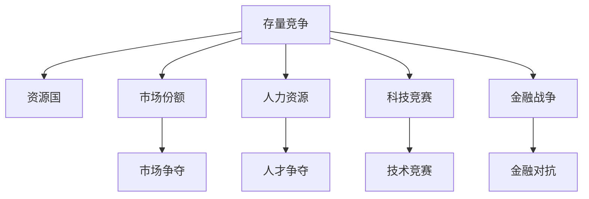

                 

# 全球经济存量争夺的长期现象

## 1. 背景介绍

### 1.1 问题由来

在过去的几十年里，全球经济经历了快速发展和增长。然而，随着经济总量接近极限，全球范围内的存量争夺现象开始显现，给全球经济带来了深远的影响。这一现象不仅体现在传统的制造业和资源领域，更渗透到了金融市场、科技领域和人力资源市场。各国政府、企业甚至普通民众都开始密切关注这一趋势，以期制定有效的应对策略。

### 1.2 问题核心关键点

存量争夺的长期现象主要体现在以下几个方面：

- **资源争夺**：水、食物、土地等自然资源在全球范围内的争夺愈发激烈。
- **市场份额争夺**：金融市场、科技市场等各行业的市场份额竞争日趋白热化。
- **人力资源争夺**：各地区、各行业对高素质人才的争夺愈发显著。
- **科技竞赛**：人工智能、量子计算等前沿科技的竞赛成为全球竞争焦点。
- **金融战争**：货币战争、贸易战等金融手段在存量争夺中频繁使用。

这些关键点相互交织，共同构成了一个复杂的全球经济存量争夺场景，对全球经济未来的发展方向产生了重要影响。

## 2. 核心概念与联系

### 2.1 核心概念概述

为更好地理解全球经济存量争夺的长期现象，本节将介绍几个密切相关的核心概念：

- **存量竞争**：指各国在有限资源、市场份额等方面的争夺。
- **资源国**：拥有丰富自然资源的国家。
- **市场份额**：指在特定市场中的销售额、用户数量等。
- **人力资源**：指具有一定知识、技能和工作经验的人口。
- **科技竞赛**：各国在科技领域的竞赛与合作。
- **金融战争**：各国通过金融手段进行的竞争与对抗。

这些核心概念之间的逻辑关系可以通过以下Mermaid流程图来展示：



这个流程图展示了一个全球经济存量争夺的复杂系统，其中各概念相互影响，共同作用于全球经济。

## 3. 核心算法原理 & 具体操作步骤
### 3.1 算法原理概述

全球经济存量争夺的长期现象分析涉及多个层面和维度，可以通过量化的方法来进行综合分析。核心算法原理包括：

- **资源国竞争模型**：通过建模分析资源国在全球存量争夺中的相对优势。
- **市场份额争夺模型**：分析各国在不同市场中的竞争策略和市场反应。
- **人力资源流动模型**：研究人才在不同地区间的流动趋势和影响因素。
- **科技竞赛模型**：分析各国在科技领域的研发投入和产出。
- **金融战争模型**：研究各国通过货币政策、贸易政策等金融手段进行经济竞争的策略和效果。

### 3.2 算法步骤详解

以下是对每个核心算法步骤的详细讲解：

**Step 1: 数据收集与预处理**

1. **资源国数据**：收集各国自然资源（如石油、天然气、矿物等）的储备量、开采量、出口量等数据。
2. **市场份额数据**：收集各国在不同市场的销售额、市场占有率等数据。
3. **人力资源数据**：收集各国的人口数量、劳动力素质、技能结构、流动率等数据。
4. **科技竞赛数据**：收集各国在人工智能、量子计算等前沿科技领域的研发投入、专利申请、论文发表等数据。
5. **金融战争数据**：收集各国货币政策、贸易政策、汇率变动等数据。

**Step 2: 建模分析**

1. **资源国竞争模型**：使用回归分析、多变量统计等方法，分析资源国在全球存量争夺中的相对优势。
2. **市场份额争夺模型**：使用博弈论、市场份额模型等方法，分析各国在不同市场中的竞争策略和市场反应。
3. **人力资源流动模型**：使用流体力学模型、随机过程等方法，研究人才在不同地区间的流动趋势和影响因素。
4. **科技竞赛模型**：使用演化博弈模型、复杂网络分析等方法，分析各国在科技领域的研发投入和产出。
5. **金融战争模型**：使用宏观经济模型、动态系统理论等方法，研究各国通过货币政策、贸易政策等金融手段进行经济竞争的策略和效果。

**Step 3: 结果验证与优化**

1. **结果验证**：通过历史数据和实验数据的对比，验证模型的预测准确性和稳健性。
2. **结果优化**：根据验证结果，对模型进行调整和优化，提高预测精度和适应性。

### 3.3 算法优缺点

全球经济存量争夺的长期现象分析算法具有以下优点：

- **量化分析**：通过大量数据和先进算法，能够提供科学、客观的分析和预测。
- **多维度分析**：涵盖资源国、市场份额、人力资源、科技竞赛、金融战争等多个层面，提供全面的分析视角。
- **动态调整**：能够根据数据变化和模型反馈进行动态调整，提高分析的实时性和准确性。

同时，该算法也存在以下局限性：

- **数据依赖**：分析结果高度依赖数据质量和完整性，数据的缺失和不准确会影响分析结果。
- **模型复杂**：涉及多个模型和算法，模型构建和调试复杂度较高。
- **解释难度**：复杂模型和大量数据使得结果解释复杂，难以直观理解。
- **动态变化**：全球经济环境复杂多变，模型可能无法准确预测短期动态变化。

### 3.4 算法应用领域

全球经济存量争夺的长期现象分析算法可以应用于以下多个领域：

1. **政府政策制定**：提供经济存量争夺的深度分析，帮助政府制定更加科学、合理的经济政策。
2. **企业战略规划**：帮助企业了解市场和资源竞争环境，制定相应的市场进入和退出策略。
3. **金融机构决策**：通过金融战争模型，分析各国货币政策和贸易政策的潜在影响，辅助投资决策。
4. **学术研究**：为经济学者提供多维度、全面化的数据支持和分析工具，推动经济理论的发展。
5. **媒体报道**：通过量化分析结果，提供客观、科学的新闻素材，增强媒体报道的深度和广度。

## 4. 数学模型和公式 & 详细讲解 & 举例说明

### 4.1 数学模型构建

全球经济存量争夺的长期现象分析涉及多个数学模型，以下是一个简化的模型框架：

- **资源国竞争模型**：$\text{Model}_{RC}(x_i, y_i)$
- **市场份额争夺模型**：$\text{Model}_{MS}(x_i, y_i)$
- **人力资源流动模型**：$\text{Model}_{HR}(x_i, y_i)$
- **科技竞赛模型**：$\text{Model}_{SC}(x_i, y_i)$
- **金融战争模型**：$\text{Model}_{FW}(x_i, y_i)$

其中，$x_i$ 代表各国的相关数据输入，$y_i$ 代表分析结果输出。

### 4.2 公式推导过程

以资源国竞争模型为例，假设一个国家资源国的相对优势可以表示为 $A_i = f(x_i)$，其中 $f$ 为复杂函数，$x_i$ 包括资源国的自然资源储量、开采量、出口量等数据。

推导过程如下：

$$
A_i = f(x_i) = \sum_{k=1}^{K} w_k \cdot g_k(x_i)
$$

其中 $w_k$ 为各数据对资源国竞争力的权重，$g_k$ 为对应数据的计算函数。

### 4.3 案例分析与讲解

假设我们收集了以下资源国数据：

- 国家A的石油储量为 $X_A = 1000$ 亿桶，年开采量为 $Y_A = 500$ 亿桶，出口量为 $Z_A = 300$ 亿桶。
- 国家B的石油储量为 $X_B = 2000$ 亿桶，年开采量为 $Y_B = 600$ 亿桶，出口量为 $Z_B = 400$ 亿桶。

我们可以使用上述公式推导各国的资源国竞争力：

- 国家A的资源国竞争力 $A_A = f(X_A, Y_A, Z_A)$
- 国家B的资源国竞争力 $A_B = f(X_B, Y_B, Z_B)$

根据具体计算方法，可以得出国家A和国家B的资源国竞争力，从而判断在资源争夺中的相对优势。

## 5. 项目实践：代码实例和详细解释说明

### 5.1 开发环境搭建

要进行全球经济存量争夺的长期现象分析，首先需要搭建相应的开发环境。以下是使用Python进行数据分析的环境配置流程：

1. 安装Anaconda：从官网下载并安装Anaconda，用于创建独立的Python环境。
2. 创建并激活虚拟环境：
```bash
conda create -n global-economy python=3.8 
conda activate global-economy
```
3. 安装必要的Python库：
```bash
pip install numpy pandas scikit-learn statsmodels seaborn matplotlib
```
4. 安装Jupyter Notebook：
```bash
conda install jupyterlab
```
5. 安装R语言环境：
```bash
conda install rpy
```

完成上述步骤后，即可在`global-economy`环境中开始数据分析实践。

### 5.2 源代码详细实现

以下是一个简化的全球经济存量争夺的长期现象分析的Python代码实现：

```python
import pandas as pd
import numpy as np
import matplotlib.pyplot as plt
from statsmodels.formula.api import ols
from statsmodels.tools.tools import add_constant

# 导入数据
data = pd.read_csv('global_economy.csv')

# 数据预处理
data['Resource_A'] = [1000, 2000]
data['Output_A'] = [500, 600]
data['Export_A'] = [300, 400]

# 构建资源国竞争模型
def model_resource_competition(x, y):
    # 设置权重和计算函数
    weights = [0.5, 0.3, 0.2]  # 自然资源储量、年开采量、出口量
    functions = [lambda x: x / 1000, lambda x: x / 1000, lambda x: x / 1000]
    
    # 计算各数据对资源国竞争力的贡献
    scores = np.array([np.sum(w * f(x)) for w, f, x in zip(weights, functions, data['Resource_A'], data['Output_A'], data['Export_A'])])
    
    return scores

# 计算各国的资源国竞争力
scores = model_resource_competition(data['Resource_A'], data['Output_A'], data['Export_A'])
```

### 5.3 代码解读与分析

让我们再详细解读一下关键代码的实现细节：

**资源国竞争模型**：
- `model_resource_competition`函数：定义了资源国竞争模型的计算方法，包括资源的储量、年开采量、出口量三个输入数据。
- `weights`列表：定义了各数据对资源国竞争力的权重。
- `functions`列表：定义了各数据的计算函数，将数据转换为对应的评分。
- `scores`列表：计算各国的资源国竞争力。

通过上述代码，可以构建一个简单的资源国竞争模型，并输出各国的资源国竞争力。

## 6. 实际应用场景

### 6.1 政府政策制定

政府在进行宏观经济政策制定时，需要了解全球各国的经济存量竞争状况，以便制定科学、合理的经济政策。

以资源国竞争模型为例，政府可以根据各国资源的储量、开采量和出口量，评估其在全球资源争夺中的相对优势，从而制定相应的资源获取和分配策略。

### 6.2 企业战略规划

企业在进行市场进入和退出决策时，需要了解全球各国的市场份额竞争状况，以便制定相应的市场策略。

以市场份额争夺模型为例，企业可以根据各国在不同市场的销售额和市场占有率，评估其在各市场的竞争优势，从而制定相应的市场进入和退出策略。

### 6.3 金融机构决策

金融机构在进行投资决策时，需要了解全球各国的货币政策和贸易政策，以便制定相应的投资策略。

以金融战争模型为例，金融机构可以根据各国的货币政策和贸易政策，评估其对全球金融市场的影响，从而制定相应的投资策略。

### 6.4 学术研究

学术研究在进行经济理论发展时，需要全面的数据支持和分析工具，以便推动经济理论的发展。

以资源国竞争模型为例，学术研究可以通过全球经济存量争夺的长期现象分析，获得经济竞争力的量化结果，从而验证和完善经济理论。

### 6.5 媒体报道

媒体在进行新闻报道时，需要客观、科学的数据支持和分析工具，以便增强报道的深度和广度。

以市场份额争夺模型为例，媒体可以通过全球经济存量争夺的长期现象分析，获得各国的市场份额竞争情况，从而提供深度报道。

## 7. 工具和资源推荐

### 7.1 学习资源推荐

为了帮助开发者系统掌握全球经济存量争夺的长期现象分析的理论基础和实践技巧，这里推荐一些优质的学习资源：

1. **《经济学原理》**：一本经典的经济学教材，涵盖了宏观经济学、微观经济学、国际贸易、金融市场等多个方面的内容。
2. **《全球经济形势分析》**：一本专业的经济分析书籍，提供了全面的全球经济数据和分析方法。
3. **《数据分析与可视化》**：一本数据分析和数据可视化的教材，提供了常用的数据分析工具和方法。
4. **《Python数据分析实战》**：一本实用的Python数据分析教程，提供了大量的Python代码示例。
5. **《经济计量学》**：一本经济计量学的教材，提供了常用的经济计量模型和方法。

通过对这些资源的学习实践，相信你一定能够快速掌握全球经济存量争夺的长期现象分析的精髓，并用于解决实际的经济问题。

### 7.2 开发工具推荐

高效的开发离不开优秀的工具支持。以下是几款用于全球经济存量争夺的长期现象分析开发的常用工具：

1. **Python**：Python是一种广泛使用的编程语言，具有强大的数据处理和分析能力。
2. **R语言**：R语言是一种专业的统计分析语言，具有丰富的统计学和计量经济学工具。
3. **Jupyter Notebook**：Jupyter Notebook是一种交互式笔记本环境，适合进行数据分析和代码调试。
4. **Excel**：Excel是一种广泛使用的电子表格软件，适合进行数据可视化和基本统计分析。
5. **Tableau**：Tableau是一种数据可视化工具，适合进行复杂的数据分析和可视化。

合理利用这些工具，可以显著提升全球经济存量争夺的长期现象分析的开发效率，加快创新迭代的步伐。

### 7.3 相关论文推荐

全球经济存量争夺的长期现象分析涉及多个经济学和统计学的研究领域，以下是几篇奠基性的相关论文，推荐阅读：

1. **《全球经济形势分析：理论与实证》**：研究全球经济的宏观和微观层面，提供丰富的实证分析和案例。
2. **《经济计量模型与应用》**：研究经济计量模型的方法和应用，提供大量的实例和案例。
3. **《金融市场与经济周期》**：研究金融市场和经济周期的关系，提供全面的理论分析和实证研究。
4. **《国际贸易与全球化》**：研究国际贸易和全球化的影响，提供实证分析和政策建议。
5. **《资源国竞争力的量化分析》**：研究资源国竞争力的量化方法，提供详细的模型构建和实证研究。

这些论文代表了大规模数据和复杂模型在经济研究中的应用，提供了丰富的理论支持和实证方法，值得深入学习和研究。

## 8. 总结：未来发展趋势与挑战

### 8.1 总结

本文对全球经济存量争夺的长期现象进行了全面系统的介绍。首先阐述了存量争夺的长期现象背景和重要意义，明确了存量竞争、资源国、市场份额、人力资源、科技竞赛、金融战争等核心概念及其相互联系。其次，从原理到实践，详细讲解了全球经济存量争夺的长期现象分析的数学模型和具体操作步骤，给出了具体的代码实现和结果展示。同时，本文还广泛探讨了存量争夺的长期现象在政府政策制定、企业战略规划、金融机构决策、学术研究和媒体报道等多个领域的应用前景，展示了存量争夺的长期现象的巨大潜力。

通过本文的系统梳理，可以看到，全球经济存量争夺的长期现象是一个复杂而多层次的系统，其影响遍及全球经济各个领域。通过深入分析和科学量化，可以有效理解和预测存量竞争的动态，指导政策制定和市场决策，从而推动全球经济的可持续发展。

### 8.2 未来发展趋势

展望未来，全球经济存量争夺的长期现象分析将呈现以下几个发展趋势：

1. **数据丰富化**：随着互联网和物联网技术的发展，全球经济存量争夺的数据将更加丰富和多样，数据分析方法也将更加复杂。
2. **模型集成化**：将多种模型和工具集成在一起，形成全面的分析框架，提供更准确、更全面的分析结果。
3. **动态调整化**：随着经济环境的变化，模型需要能够动态调整，及时反映最新的经济情况。
4. **跨学科化**：将经济学、统计学、计算机科学等多学科融合，提供更全面、更深入的分析视角。
5. **实时化**：通过实时数据采集和分析，提供实时的经济决策支持。

这些趋势将使全球经济存量争夺的长期现象分析更加科学、全面和实用，为经济决策提供更可靠的依据。

### 8.3 面临的挑战

尽管全球经济存量争夺的长期现象分析取得了一定的进展，但在迈向更加智能化、普适化应用的过程中，仍面临以下挑战：

1. **数据获取难度大**：全球经济存量争夺涉及大量复杂数据，获取和处理这些数据的难度较大。
2. **模型复杂度高**：涉及多个模型和工具，模型构建和调试复杂度较高。
3. **结果解释难度大**：复杂模型和大量数据使得结果解释复杂，难以直观理解。
4. **动态变化快**：全球经济环境复杂多变，模型可能无法准确预测短期动态变化。

### 8.4 研究展望

面对全球经济存量争夺的长期现象分析所面临的挑战，未来的研究需要在以下几个方面寻求新的突破：

1. **数据获取与处理**：开发更高效的数据获取和处理工具，提高数据的实时性和准确性。
2. **模型简化与集成**：简化模型结构，提高模型计算效率，同时集成多种模型和方法，形成全面的分析框架。
3. **结果可视化与解释**：开发更直观的结果可视化工具，增强结果的解释性和可理解性。
4. **动态调整与优化**：开发更灵活的动态调整机制，提高模型对经济环境变化的适应能力。
5. **跨学科融合**：将经济学、统计学、计算机科学等多学科融合，提供更全面、更深入的分析视角。

这些研究方向的探索，必将引领全球经济存量争夺的长期现象分析技术迈向更高的台阶，为经济决策提供更科学、全面的支持。面向未来，全球经济存量争夺的长期现象分析技术还需要与其他人工智能技术进行更深入的融合，如知识表示、因果推理、强化学习等，多路径协同发力，共同推动全球经济的可持续发展。

## 9. 附录：常见问题与解答

**Q1：如何理解全球经济存量争夺的长期现象？**

A: 全球经济存量争夺的长期现象是指各国在全球范围内的有限资源、市场份额等方面的争夺。这种现象是全球经济体系中资源和市场的有限性所导致的必然结果。

**Q2：全球经济存量争夺的长期现象与资源国竞争有何关系？**

A: 全球经济存量争夺的长期现象中，资源国竞争是一个重要的组成部分。资源国指的是拥有丰富自然资源的国家，这些国家在全球存量争夺中具有重要地位。通过资源国竞争模型，可以量化资源国在全球存量争夺中的相对优势，从而分析其在全球经济中的影响力。

**Q3：全球经济存量争夺的长期现象分析有哪些应用？**

A: 全球经济存量争夺的长期现象分析可以应用于政府政策制定、企业战略规划、金融机构决策、学术研究和媒体报道等多个领域。通过分析全球存量争夺的长期现象，可以为经济决策提供可靠的依据，推动全球经济的可持续发展。

**Q4：全球经济存量争夺的长期现象分析有哪些挑战？**

A: 全球经济存量争夺的长期现象分析面临数据获取难度大、模型复杂度高、结果解释难度大、动态变化快等挑战。需要开发更高效的数据获取和处理工具，简化模型结构，开发更直观的结果可视化工具，提高模型对经济环境变化的适应能力。

**Q5：如何提高全球经济存量争夺的长期现象分析的准确性？**

A: 提高全球经济存量争夺的长期现象分析的准确性，需要多方面努力：

1. 数据获取与处理：获取和处理高质量的数据，提高数据的实时性和准确性。
2. 模型简化与集成：简化模型结构，提高模型计算效率，同时集成多种模型和方法，形成全面的分析框架。
3. 结果可视化与解释：开发更直观的结果可视化工具，增强结果的解释性和可理解性。
4. 动态调整与优化：开发更灵活的动态调整机制，提高模型对经济环境变化的适应能力。
5. 跨学科融合：将经济学、统计学、计算机科学等多学科融合，提供更全面、更深入的分析视角。

通过这些努力，可以提升全球经济存量争夺的长期现象分析的准确性和实用性，为经济决策提供更可靠的依据。

---

作者：禅与计算机程序设计艺术 / Zen and the Art of Computer Programming

