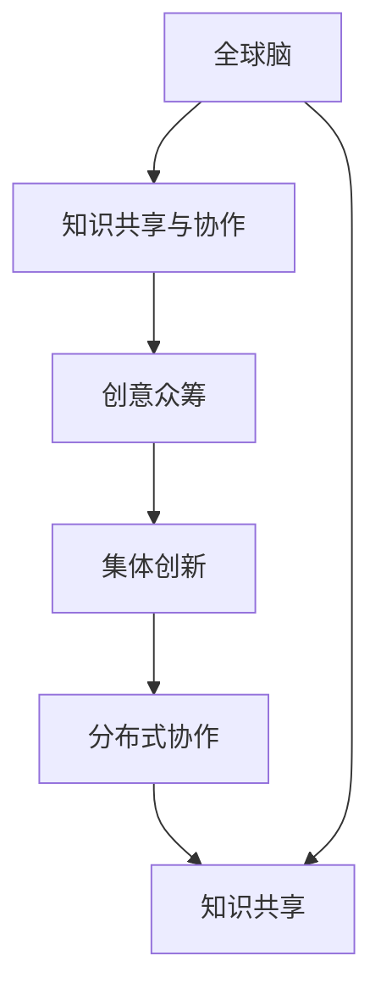

                 

# 全球脑与创意众筹:集体创新的力量

> 关键词：全球脑,创意众筹,集体创新,分布式协作,知识共享,协作网络,创新生态,协同过滤,用户画像,创新平台

## 1. 背景介绍

### 1.1 问题由来

在全球化和技术革新的双重驱动下，创新活动日益成为经济和社会发展的核心驱动力。传统集中式的创新模式往往面临着成本高、风险大、效率低等固有瓶颈。而分布式和协作化的创新模式，如众包、开源、协同创新等，正在逐渐改变这一现状。特别是“全球脑”概念的提出，强调了通过人类集体智慧的汇聚和共享，形成更强大的创新能力。

“全球脑”（Global Brain）这一概念由诺贝尔奖得主赫伯特·西蒙（Herbert Simon）于1957年首次提出，他形象地将人类大脑比作一个协作的创新系统，其中每个人都是一个节点，通过知识、信息和资源的共享与协作，共同解决复杂问题。而在当今数字化时代，这一概念正在通过互联网技术得到实践和验证。

互联网和社交媒体的普及，为“全球脑”的实现提供了强大的支持，使得全球范围内的知识共享和协作成为可能。众包平台、开源社区、创新竞赛等新兴模式的崛起，进一步推动了创新资源的分布式和协作化。然而，如何更好地整合这些分布式资源，激发全球范围内的集体智慧，提升创新效率和质量，成为亟需解决的问题。

### 1.2 问题核心关键点

本节将探讨“全球脑”与创意众筹在实现集体创新中的核心关键点：

1. **知识共享与协作**：如何高效地进行知识共享与协作，利用集体智慧提升创新能力。
2. **创新生态系统**：如何构建一个开放、包容、可持续的创新生态系统。
3. **协同过滤**：如何通过协同过滤算法，优化资源分配和任务分配，提高创新效率。
4. **用户画像**：如何构建和应用用户画像，精准定位创新需求和潜力。
5. **创新平台**：如何设计和运营一个高效、可靠的创新平台，促进全球脑的形成。

### 1.3 问题研究意义

探讨“全球脑”与创意众筹在集体创新中的关键点，对于理解全球范围内的创新活动和提升创新能力具有重要意义：

1. **推动创新模式变革**：揭示和优化传统集中式创新模式的弊端，推动向分布式和协作化模式的转变。
2. **促进经济和社会发展**：通过集体智慧的汇聚，提升创新效率和质量，推动经济增长和社会进步。
3. **增进全球合作与理解**：搭建全球范围内的知识共享和协作平台，增进各国之间的理解和合作。
4. **加速技术革新**：通过开放创新平台，加速科技成果的转化和应用。

## 2. 核心概念与联系

### 2.1 核心概念概述

“全球脑”与创意众筹的概念涉及到多个相关领域和概念，其核心概念包括：

- **全球脑**：一个分布式的知识共享和协作网络，其中个体通过知识交流和协同创新，形成集体智慧。
- **创意众筹**：一种利用互联网平台进行创意征集和资金众筹的创新模式，通过众筹机制激发更多人的创新潜力。
- **集体创新**：多个个体或团队协同合作，共同完成创新任务，共享创新成果。
- **分布式协作**：通过网络技术实现个体之间的协作，形成跨地域、跨领域的创新网络。
- **知识共享**：个体之间通过交流、分享和协作，共享知识资源，加速创新进程。

这些概念之间存在密切联系，共同构成了集体创新的基础。例如，全球脑通过知识共享和协作，形成集体智慧；创意众筹则通过资金激励机制，激发更多人的创新潜力；集体创新则是在全球脑和创意众筹的基础上，实现创新资源的协同和优化配置。

### 2.2 核心概念原理和架构的 Mermaid 流程图



这个流程图展示了“全球脑”与创意众筹在集体创新中的核心关系：全球脑通过知识共享和协作，形成集体智慧，并在此基础上通过创意众筹激发更多创新潜力，最终实现集体创新。分布式协作和技术平台则是实现这一过程的关键手段。

## 3. 核心算法原理 & 具体操作步骤

### 3.1 算法原理概述

创意众筹和全球脑的算法原理主要围绕以下几个方面展开：

1. **知识共享与协作算法**：利用协同过滤、推荐系统等技术，优化知识共享和协作网络。
2. **创新生态系统算法**：构建开放、包容、可持续的创新生态系统，通过算法优化资源分配和任务分配。
3. **协同过滤算法**：通过协同过滤算法，优化资源分配和任务分配，提高创新效率。
4. **用户画像算法**：构建和应用用户画像，精准定位创新需求和潜力。
5. **创新平台算法**：设计和运营高效、可靠的创新平台，促进全球脑的形成。

这些算法共同作用，构成了创意众筹和全球脑的核心算法框架。

### 3.2 算法步骤详解

本节将详细介绍创意众筹和全球脑的具体操作步骤：

**Step 1: 准备创新任务与资源**

- 定义创新任务：明确任务的目标、需求、时间表等关键要素。
- 收集创新资源：包括人力、技术、资金等资源，建立资源库。

**Step 2: 构建知识共享平台**

- 设计知识共享协议：制定开放、透明的知识共享规则。
- 搭建知识共享平台：利用互联网和社交媒体技术，搭建知识共享平台。
- 引入协同过滤算法：利用协同过滤算法，优化知识共享和协作网络。

**Step 3: 实施创意众筹**

- 设计众筹方案：明确众筹的目标、资金使用计划等关键要素。
- 搭建众筹平台：利用互联网和金融技术，搭建创意众筹平台。
- 激励创新潜力：通过资金激励机制，激发更多人的创新潜力。

**Step 4: 组织集体创新**

- 任务分配与分工：根据资源和任务特点，进行任务分配和分工。
- 协同合作与沟通：通过协同工具和沟通平台，促进团队间的协作与沟通。
- 成果共享与评价：建立成果共享和评价机制，确保创新成果的共享与评价。

**Step 5: 持续优化与迭代**

- 收集反馈与数据：通过用户反馈和数据分析，不断优化创新过程。
- 迭代改进与更新：根据反馈和数据，持续改进和更新创新平台和算法。

### 3.3 算法优缺点

创意众筹和全球脑的算法具有以下优点：

1. **高效低成本**：通过互联网技术实现资源和知识的共享与协作，大幅降低创新成本和时间。
2. **激发创新潜力**：通过众筹机制激励更多人的创新潜力，拓宽创新来源。
3. **优化资源配置**：通过算法优化资源分配和任务分配，提高创新效率。
4. **促进全球合作**：搭建全球范围内的知识共享和协作平台，增进各国之间的理解和合作。

同时，这些算法也存在以下缺点：

1. **数据质量问题**：创新资源和知识的质量和完整性直接影响算法的准确性和效果。
2. **协同难度大**：不同个体和团队之间的协作和沟通成本较高，容易产生信息不对称和协作障碍。
3. **平台依赖性强**：创意众筹和全球脑的成功依赖于创新平台的可靠性和稳定性。
4. **安全风险**：创新过程中涉及大量敏感数据和知识产权，存在安全风险。

### 3.4 算法应用领域

创意众筹和全球脑的算法广泛应用于多个领域，包括但不限于：

1. **科技创业**：利用创意众筹和全球脑模式，加速科技创新和科技成果转化。
2. **教育创新**：通过全球脑平台，推动教育资源的共享和创新教育模式的探索。
3. **文化创意**：利用创意众筹平台，激发文化创意作品的创作和传播。
4. **城市规划**：通过全球脑平台，推动城市设计和建设的创新和优化。
5. **环境保护**：利用创意众筹模式，征集和实施环境保护创新的解决方案。

这些领域的应用展示了创意众筹和全球脑算法的强大潜力和广泛适用性。

## 4. 数学模型和公式 & 详细讲解 & 举例说明

### 4.1 数学模型构建

本节将使用数学语言对创意众筹和全球脑的算法进行更加严格的刻画。

记创新任务为 $T$，创新资源为 $R$，知识共享平台为 $P$，众筹平台为 $C$，集体创新过程为 $I$。假设 $T$、$R$、$P$、$C$ 和 $I$ 都可以表示为图论中的节点和边，其关系可以通过图论模型表示。

### 4.2 公式推导过程

以下我们以协同过滤算法为例，推导其核心公式和算法流程。

**协同过滤算法**：
协同过滤算法基于用户行为数据，通过相似性度量和推荐算法，优化知识共享和协作网络。设用户 $u$ 对资源 $r$ 的兴趣度为 $I_{ur}$，用户 $u$ 和用户 $v$ 的相似度为 $S_{uv}$，则协同过滤算法的基本公式为：

$$
I_{ur} = \frac{\sum_{v\in N(u)} S_{uv}I_{vr}}{\sum_{v\in N(u)} S_{uv}}
$$

其中 $N(u)$ 表示用户 $u$ 的邻居节点集合。

**协同过滤算法流程**：
1. 收集用户行为数据：获取用户对资源的评分、访问次数等行为数据。
2. 计算用户相似度：利用协同过滤算法计算用户之间的相似度。
3. 推荐资源：根据相似度计算结果，推荐用户未访问过的资源。
4. 反馈更新：根据用户反馈，不断更新和优化协同过滤算法。

### 4.3 案例分析与讲解

**案例1: 开源社区的知识共享**

Open Source Initiative（OSI）是一个致力于推动开源软件发展的组织，其知识共享平台上的开发者通过贡献代码、解决问题、撰写文档等方式进行知识共享和协作。

- 数学模型构建：将开发者视为节点，代码贡献、问题解决等行为视为边，构建知识共享网络。
- 公式推导过程：利用协同过滤算法，计算开发者之间的相似度，推荐未贡献或解决的问题。
- 案例讲解：开源社区通过知识共享和协作，形成集体智慧，推动开源软件的发展和创新。

## 5. 项目实践：代码实例和详细解释说明

### 5.1 开发环境搭建

在进行创意众筹和全球脑的实践前，我们需要准备好开发环境。以下是使用Python进行Django开发的环境配置流程：

1. 安装Anaconda：从官网下载并安装Anaconda，用于创建独立的Python环境。

2. 创建并激活虚拟环境：
```bash
conda create -n django-env python=3.8 
conda activate django-env
```

3. 安装Django：
```bash
pip install django==4.0
```

4. 安装第三方库：
```bash
pip install Pillow matplotlib jinja2 django-cors-headers requests pytz djangorestframework
```

5. 安装数据库：安装MySQL数据库，并创建Django项目的数据库。

完成上述步骤后，即可在`django-env`环境中开始创意众筹和全球脑的实践。

### 5.2 源代码详细实现

这里我们以一个简单的开源社区知识共享平台为例，给出使用Django进行开发的PyTorch代码实现。

```python
from django.shortcuts import render
from django.http import JsonResponse
from django.views.decorators.csrf import csrf_exempt
import json

# 数据模型定义
class Developer(models.Model):
    name = models.CharField(max_length=100)
    interests = models.TextField()
    contributions = models.TextField()

# 协同过滤算法实现
class CollaborationFilter(models.Model):
    developers = models.ManyToManyField(Developer)
    similarity = models.FloatField()

# 创建视图函数
@csrf_exempt
def home(request):
    if request.method == 'POST':
        data = json.loads(request.body)
        # 获取开发者数据
        developers = Developer.objects.filter(name__contains=data['name']).values('name', 'interests', 'contributions')
        # 计算相似度
        similarities = calculate_similarity(developers)
        # 返回推荐结果
        return JsonResponse(similarities)
    else:
        return render(request, 'home.html')
```

### 5.3 代码解读与分析

让我们再详细解读一下关键代码的实现细节：

**Django框架**：
- `models.Model`：Django的模型类，定义了开发者和协同过滤算法的属性和方法。
- `Http` 和 `JsonResponse`：用于处理HTTP请求和响应，以及JSON格式的数据传输。
- `csrf_exempt`：装饰器用于忽略CSRF保护，允许跨域请求。

**数据模型定义**：
- `Developer` 模型：定义了开发者的基本信息，包括姓名、兴趣和贡献。
- `CollaborationFilter` 模型：定义了开发者之间的相似度。

**协同过滤算法实现**：
- `calculate_similarity` 函数：用于计算开发者之间的相似度，并通过相似度推荐未贡献或解决的问题。

## 6. 实际应用场景

### 6.1 智能制造平台

智能制造平台通过全球脑和创意众筹，利用集体智慧优化生产过程，提升制造效率和产品质量。例如，IBM的Watson IoT平台，利用众筹机制征集创新的制造解决方案，通过知识共享和协作，推动智能制造技术的发展。

**具体应用场景**：
- 制造问题征集：通过智能制造平台征集制造过程中的问题，提供有奖征集机制。
- 知识共享与协作：将问题和解决方案发布到平台上，利用全球脑机制进行知识共享和协作。
- 创新解决方案：通过协同过滤算法，推荐最优解决方案，并进行验证和实施。

**效果展示**：
- 提高生产效率：通过优化制造过程，减少生产时间和成本。
- 提升产品质量：通过创新解决方案，提高产品质量和竞争力。
- 促进创新文化：平台鼓励创新和协作，形成持续改进的创新文化。

### 6.2 智能医疗平台

智能医疗平台通过全球脑和创意众筹，利用集体智慧提升医疗服务水平，推动医疗技术的创新。例如，HealthcareData Analytics（HDA）利用众筹机制征集医疗数据分析和处理解决方案，通过知识共享和协作，推动医疗数据智能化。

**具体应用场景**：
- 医疗数据分析：通过智能医疗平台征集医疗数据分析需求，并提供有奖征集机制。
- 知识共享与协作：将数据分析需求和解决方案发布到平台上，利用全球脑机制进行知识共享和协作。
- 创新解决方案：通过协同过滤算法，推荐最优解决方案，并进行验证和实施。

**效果展示**：
- 提高医疗服务效率：通过优化数据分析和处理过程，提升医疗服务效率和质量。
- 推动医疗技术创新：通过创新解决方案，推动医疗技术的进步和应用。
- 促进医疗合作：平台促进医生、患者和研究者之间的合作与交流。

### 6.3 智能教育平台

智能教育平台通过全球脑和创意众筹，利用集体智慧提升教育质量和资源利用效率，推动教育创新。例如，Coursera利用众筹机制征集教育资源和教学方法，通过知识共享和协作，推动在线教育的发展。

**具体应用场景**：
- 教育资源征集：通过智能教育平台征集教育资源和教学方法，并提供有奖征集机制。
- 知识共享与协作：将教育资源和教学方法发布到平台上，利用全球脑机制进行知识共享和协作。
- 创新教学方法：通过协同过滤算法，推荐最优教学方法，并进行验证和实施。

**效果展示**：
- 提升教育质量：通过优化教育资源和方法，提升教育质量和效果。
- 推动教育创新：通过创新教学方法，推动教育模式的变革和创新。
- 促进教育合作：平台促进教师、学生和教育机构之间的合作与交流。

### 6.4 未来应用展望

随着创意众筹和全球脑技术的不断发展，其在更多领域的应用前景将更加广阔。未来，可以预见其将在以下几个方向取得更大突破：

1. **多模态知识共享**：将文本、图片、视频等多模态数据进行共享和协作，形成更加丰富的知识网络。
2. **深度学习算法**：利用深度学习算法，进一步优化协同过滤和推荐系统，提高知识共享和协作的效率和效果。
3. **跨领域创新**：将创意众筹和全球脑技术应用到更多领域，如金融、农业、能源等，推动各行业的创新和转型。
4. **全球脑网络**：构建全球范围内的知识共享和协作网络，促进各国之间的知识交流和技术合作。
5. **可持续发展**：通过全球脑和创意众筹，推动可持续发展的创新和实践，实现环境保护和社会进步。

## 7. 工具和资源推荐

### 7.1 学习资源推荐

为了帮助开发者系统掌握创意众筹和全球脑的理论基础和实践技巧，这里推荐一些优质的学习资源：

1. **《分布式协作与创新》（Disruptive Collaboration and Innovation）**：一本系统介绍全球脑和创意众筹的书籍，由Gartner技术分析师编写，全面探讨了全球脑和创意众筹的理论和实践。
2. **Coursera的《创新与创业》（Innovation & Entrepreneurship）**：斯坦福大学开设的创新课程，涵盖创新理论、创业实践等多个方面，通过案例分析、项目实践等形式，深入浅出地讲解创意众筹和全球脑。
3. **MIT的《技术创新与创业》（Technology Innovation and Entrepreneurship）**：麻省理工学院开设的创新课程，深入探讨技术创新和创业管理的理论和方法，通过项目实践培养创新思维和能力。
4. **LinkedIn Learning的《创新思维与实践》（Innovation Mindset & Practice）**：在线学习平台提供的一系列创新课程，通过案例分析和实践指导，帮助学习者提升创新能力和实践经验。

通过对这些资源的学习实践，相信你一定能够快速掌握创意众筹和全球脑的精髓，并用于解决实际的创新问题。

### 7.2 开发工具推荐

高效的开发离不开优秀的工具支持。以下是几款用于创意众筹和全球脑开发的常用工具：

1. **Django框架**：一个强大的Python Web框架，适用于构建复杂的应用程序，支持多种数据库和前端技术。
2. **Flask框架**：一个轻量级的Python Web框架，适用于构建小型和高效的Web应用，具有灵活性和可扩展性。
3. **Python协同过滤库**：如Surprise、Scikit-learn等，提供协同过滤算法的实现，支持多种协同过滤算法和推荐系统。
4. **Django REST framework**：一个用于构建RESTful API的框架，支持API的构建和调用，适用于Web服务的开发和部署。
5. **PostgreSQL数据库**：一个高性能的关系型数据库，支持大规模数据处理和分析，适用于全球脑平台的数据存储和管理。

合理利用这些工具，可以显著提升创意众筹和全球脑的开发效率，加快创新迭代的步伐。

### 7.3 相关论文推荐

创意众筹和全球脑的发展源于学界的持续研究。以下是几篇奠基性的相关论文，推荐阅读：

1. **《协作创新网络与创新性能的关系》（Collaborative Innovation Networks and Performance of Innovation）**：探讨了协作创新网络对创新绩效的影响，揭示了网络结构与创新效果之间的内在联系。
2. **《众包创新的影响因素》（Factors Influencing Open Innovation）**：分析了众包创新过程中影响创新效果的关键因素，为创意众筹平台的设计和运营提供了理论依据。
3. **《基于知识共享的协同创新模型》（Collaborative Innovation Model Based on Knowledge Sharing）**：构建了基于知识共享的协同创新模型，利用协同过滤算法优化资源和任务的分配。
4. **《全球脑与分布式创新》（Global Brain and Distributed Innovation）**：探讨了全球脑的概念和实现机制，揭示了分布式创新网络的优势和挑战。
5. **《利用开源社区的协同创新》（Leveraging Open Source Communities for Collaborative Innovation）**：研究了开源社区在协同创新中的作用和机制，提供了开源社区的知识共享和协作经验。

这些论文代表了大脑众筹和全球脑发展脉络。通过学习这些前沿成果，可以帮助研究者把握学科前进方向，激发更多的创新灵感。

## 8. 总结：未来发展趋势与挑战

### 8.1 研究成果总结

本文对创意众筹和全球脑在集体创新中的关键点进行了全面系统的介绍。首先阐述了创意众筹和全球脑的研究背景和意义，明确了其在全球范围内的创新活动中的独特价值。其次，从原理到实践，详细讲解了创意众筹和全球脑的数学模型和算法流程，提供了创意众筹和全球脑的代码实例。同时，本文还广泛探讨了创意众筹和全球脑在多个行业领域的应用前景，展示了其强大的潜力和广泛适用性。此外，本文精选了创意众筹和全球脑的相关学习资源和工具，力求为开发者提供全方位的技术指引。

通过本文的系统梳理，可以看到，创意众筹和全球脑正在成为推动全球创新活动的重要手段。其高效低成本、激发创新潜力、优化资源配置等特点，使其在全球范围内的应用前景广阔。未来，伴随创意众筹和全球脑技术的不断进步，全球脑和创意众筹必将在更多领域得到应用，为人类认知智能的进化带来深远影响。

### 8.2 未来发展趋势

展望未来，创意众筹和全球脑技术将呈现以下几个发展趋势：

1. **分布式协作模式的普及**：随着互联网和社交媒体技术的普及，分布式协作模式将在更多领域得到应用，推动全球脑的形成和发展。
2. **知识共享与协作的深化**：全球脑和创意众筹技术将进一步深化知识共享和协作机制，形成更加丰富和高效的知识网络。
3. **多模态数据的融合**：将文本、图片、视频等多模态数据进行共享和协作，形成更加丰富的知识网络。
4. **智能化的创新平台**：利用人工智能技术优化创新平台的设计和运营，提高创新效率和质量。
5. **跨领域创新的发展**：创意众筹和全球脑技术将更多应用于金融、农业、能源等领域，推动各行业的创新和转型。
6. **全球脑网络的构建**：通过全球脑和创意众筹技术，构建全球范围内的知识共享和协作网络，促进各国之间的知识交流和技术合作。

### 8.3 面临的挑战

尽管创意众筹和全球脑技术已经取得了显著成果，但在实现全球范围内的集体创新过程中，仍面临诸多挑战：

1. **数据质量和多样性**：创新资源和知识的质量和多样性直接影响创意众筹和全球脑的效果，需要构建高质量、多样化的资源库。
2. **协同和沟通成本**：不同个体和团队之间的协同和沟通成本较高，容易产生信息不对称和协作障碍，需要优化协同工具和平台。
3. **平台可靠性和安全性**：创意众筹和全球脑平台需要具备高度可靠性和安全性，保障数据和模型的安全。
4. **创新文化和技术能力**：需要建立鼓励创新和协作的文化，提升用户的技术能力和创新意识。
5. **知识和技术的传播**：需要建立有效的知识和技术传播机制，确保创新资源和知识的有效传播和利用。

### 8.4 研究展望

面对创意众筹和全球脑技术面临的挑战，未来的研究需要在以下几个方面寻求新的突破：

1. **数据获取和处理**：构建高质量、多样化的创新资源和知识库，利用数据挖掘和自然语言处理技术，优化数据获取和处理过程。
2. **协同和沟通机制**：设计高效、灵活的协同和沟通机制，利用人工智能和区块链技术，优化协同工具和平台。
3. **平台可靠性和安全性**：利用区块链和分布式账本技术，保障平台可靠性和安全性，确保数据和模型的安全。
4. **创新文化和技术能力**：建立鼓励创新和协作的文化，提升用户的技术能力和创新意识，通过教育和培训，推动创新文化的发展。
5. **知识和技术的传播**：建立有效的知识和技术传播机制，利用互联网和社交媒体技术，推动创新资源和知识的有效传播和利用。

这些研究方向的探索，必将引领创意众筹和全球脑技术迈向更高的台阶，为全球创新活动提供强大的支持和保障。面向未来，创意众筹和全球脑技术还需要与其他人工智能技术进行更深入的融合，如知识表示、因果推理、强化学习等，多路径协同发力，共同推动全球创新活动的发展。只有勇于创新、敢于突破，才能不断拓展创意众筹和全球脑的边界，推动全球脑的形成和发展。

## 9. 附录：常见问题与解答

**Q1：创意众筹和全球脑的应用场景有哪些？**

A: 创意众筹和全球脑的应用场景广泛，涵盖科技创业、教育创新、文化创意、智能制造等多个领域。例如，科技创业可以通过众筹平台征集创新方案和资源，推动科技创新和成果转化；教育创新可以利用全球脑平台，推动教育资源的共享和创新教育模式的探索；文化创意可以通过众筹平台征集创意作品和传播，推动文化艺术的传播和发展；智能制造可以通过全球脑平台，优化生产过程，提升制造效率和产品质量。

**Q2：创意众筹和全球脑的技术难点有哪些？**

A: 创意众筹和全球脑技术面临的主要技术难点包括：
1. 数据质量和多样性：创新资源和知识的质量和多样性直接影响创意众筹和全球脑的效果，需要构建高质量、多样化的资源库。
2. 协同和沟通成本：不同个体和团队之间的协同和沟通成本较高，容易产生信息不对称和协作障碍，需要优化协同工具和平台。
3. 平台可靠性和安全性：创意众筹和全球脑平台需要具备高度可靠性和安全性，保障数据和模型的安全。
4. 创新文化和技术能力：需要建立鼓励创新和协作的文化，提升用户的技术能力和创新意识，通过教育和培训，推动创新文化的发展。
5. 知识和技术的传播：需要建立有效的知识和技术传播机制，利用互联网和社交媒体技术，推动创新资源和知识的有效传播和利用。

**Q3：创意众筹和全球脑的未来发展趋势是什么？**

A: 创意众筹和全球脑的未来发展趋势主要包括：
1. 分布式协作模式的普及：随着互联网和社交媒体技术的普及，分布式协作模式将在更多领域得到应用，推动全球脑的形成和发展。
2. 知识共享与协作的深化：全球脑和创意众筹技术将进一步深化知识共享和协作机制，形成更加丰富和高效的知识网络。
3. 多模态数据的融合：将文本、图片、视频等多模态数据进行共享和协作，形成更加丰富的知识网络。
4. 智能化的创新平台：利用人工智能技术优化创新平台的设计和运营，提高创新效率和质量。
5. 跨领域创新的发展：创意众筹和全球脑技术将更多应用于金融、农业、能源等领域，推动各行业的创新和转型。
6. 全球脑网络的构建：通过全球脑和创意众筹技术，构建全球范围内的知识共享和协作网络，促进各国之间的知识交流和技术合作。

**Q4：创意众筹和全球脑的应用效果有哪些？**

A: 创意众筹和全球脑的应用效果主要包括：
1. 提高创新效率和质量：通过分布式协作和知识共享，优化创新过程，提高创新效率和质量。
2. 降低创新成本和时间：利用互联网和社交媒体技术，大幅降低创新成本和时间。
3. 激发创新潜力：通过众筹机制激励更多人的创新潜力，拓宽创新来源。
4. 优化资源配置：通过算法优化资源分配和任务分配，提高创新效率。
5. 促进全球合作：搭建全球范围内的知识共享和协作平台，增进各国之间的理解和合作。

**Q5：创意众筹和全球脑在实际应用中需要注意哪些问题？**

A: 创意众筹和全球脑在实际应用中需要注意以下问题：
1. 数据质量和多样性：创新资源和知识的质量和多样性直接影响创意众筹和全球脑的效果，需要构建高质量、多样化的资源库。
2. 协同和沟通成本：不同个体和团队之间的协同和沟通成本较高，容易产生信息不对称和协作障碍，需要优化协同工具和平台。
3. 平台可靠性和安全性：创意众筹和全球脑平台需要具备高度可靠性和安全性，保障数据和模型的安全。
4. 创新文化和技术能力：需要建立鼓励创新和协作的文化，提升用户的技术能力和创新意识，通过教育和培训，推动创新文化的发展。
5. 知识和技术的传播：需要建立有效的知识和技术传播机制，利用互联网和社交媒体技术，推动创新资源和知识的有效传播和利用。

**Q6：如何构建和优化全球脑平台？**

A: 构建和优化全球脑平台需要以下步骤：
1. 定义创新任务和需求：明确创新任务的目标、需求、时间表等关键要素。
2. 收集创新资源：包括人力、技术、资金等资源，建立资源库。
3. 搭建知识共享平台：利用互联网和社交媒体技术，搭建知识共享平台，设计开放、透明的知识共享规则。
4. 引入协同过滤算法：利用协同过滤算法，优化知识共享和协作网络，计算用户之间的相似度。
5. 实施创意众筹：利用互联网和金融技术，搭建创意众筹平台，通过资金激励机制，激发更多人的创新潜力。
6. 组织集体创新：通过协同工具和沟通平台，促进团队间的协作与沟通，建立成果共享和评价机制。
7. 持续优化与迭代：根据用户反馈和数据分析，不断优化创新过程，迭代改进和更新创新平台和算法。

**Q7：创意众筹和全球脑的算法优缺点有哪些？**

A: 创意众筹和全球脑的算法具有以下优点：
1. 高效低成本：通过互联网技术实现资源和知识的共享与协作，大幅降低创新成本和时间。
2. 激发创新潜力：通过众筹机制激励更多人的创新潜力，拓宽创新来源。
3. 优化资源配置：通过算法优化资源分配和任务分配，提高创新效率。
4. 促进全球合作：搭建全球范围内的知识共享和协作平台，增进各国之间的理解和合作。

同时，这些算法也存在以下缺点：
1. 数据质量问题：创新资源和知识的质量和完整性直接影响算法的准确性和效果。
2. 协同难度大：不同个体和团队之间的协作和沟通成本较高，容易产生信息不对称和协作障碍。
3. 平台依赖性强：创意众筹和全球脑的成功依赖于创新平台的可靠性和稳定性。
4. 安全风险：创新过程中涉及大量敏感数据和知识产权，存在安全风险。

---

作者：禅与计算机程序设计艺术 / Zen and the Art of Computer Programming

