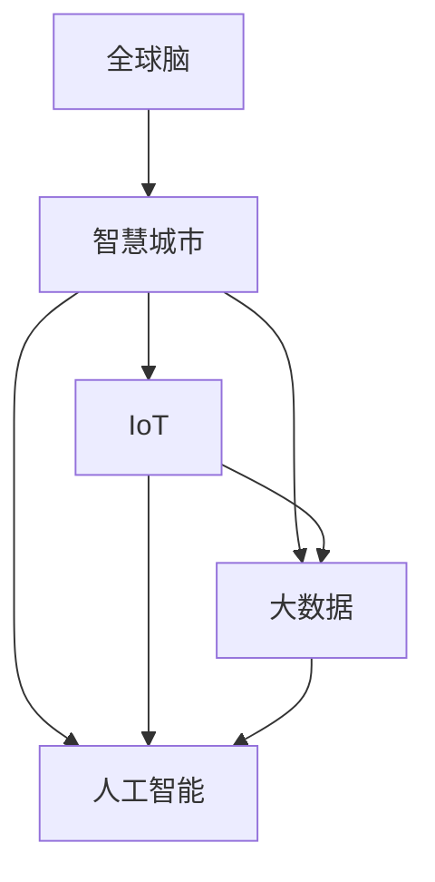

                 

## 1. 背景介绍

在数字化时代，智慧城市（Smart City）已成为提升城市管理水平和居民生活质量的关键路径。智慧城市不仅关注信息技术的应用，更强调跨领域的协同和公民参与。为实现这一目标，需要构建一个智能、动态、可持续的数字化系统。本文聚焦于全球脑（Global Brain）的概念，探讨其对智慧城市建设的意义和应用。

### 1.1 问题由来
智慧城市建设以数字化技术为手段，利用物联网（IoT）、大数据、人工智能等技术，实现城市管理和服务的高效、精准和智能。然而，尽管许多城市已部署了大量智能基础设施，但由于缺乏跨部门、跨领域的协同机制，城市整体运行效率和居民体验仍有待提升。

### 1.2 问题核心关键点
当前智慧城市建设面临的最大挑战在于，如何构建一个能够自适应、自学习、自优化的智能系统。这就需要引入全球脑的概念，构建一个集成了城市所有关键数据和服务的智能网络，实现各领域数据的无缝融合和共享，以提升城市管理的智能化水平。

### 1.3 问题研究意义
引入全球脑的概念，通过智能算法和大数据分析，推动智慧城市向更高水平发展，具有以下重要意义：
1. **提升管理效率**：实现跨领域、跨部门的数据融合，提高城市管理的智能化、精准化水平。
2. **优化资源配置**：通过全局视角优化资源配置，实现城市服务的精准投放和动态调整。
3. **增强响应能力**：实时感知城市动态变化，快速响应各类突发事件，提升应急管理能力。
4. **提升居民体验**：通过智能推荐和服务，提升居民的生活品质和满意度。

## 2. 核心概念与联系

### 2.1 核心概念概述

为了更好地理解全球脑的概念及其与智慧城市建设的关系，本节将介绍几个核心概念：

- **全球脑（Global Brain）**：一种借鉴生物神经网络结构的智能系统，通过跨领域、跨部门的数据融合和共享，实现对城市的全面感知和智能决策。
- **智慧城市（Smart City）**：利用信息技术提升城市管理和服务水平，实现城市运行的智能化、精准化和高效化。
- **物联网（IoT）**：通过传感器、智能设备等技术手段，实现对城市各类基础设施的智能化监测和管理。
- **大数据（Big Data）**：城市运行中产生的大量结构化和非结构化数据，通过分析挖掘可发现城市运行规律和优化方案。
- **人工智能（AI）**：通过机器学习和深度学习算法，实现对城市数据的智能分析和决策。

这些核心概念之间的逻辑关系可以通过以下Mermaid流程图来展示：



这个流程图展示了各个概念之间的逻辑关系：

1. **全球脑**：作为智慧城市的智能中枢，整合物联网、大数据和人工智能技术，实现对城市数据的全面感知和智能决策。
2. **智慧城市**：通过全球脑技术，提升城市管理的智能化、精准化和高效化。
3. **物联网**：提供城市各类基础设施的实时数据，为全球脑感知城市运行提供数据支撑。
4. **大数据**：通过分析挖掘城市运行数据，发现运行规律和优化方案，为全球脑智能决策提供数据支持。
5. **人工智能**：利用机器学习和深度学习算法，对城市数据进行智能分析和决策，实现对城市运行的智能优化。

## 3. 核心算法原理 & 具体操作步骤

### 3.1 算法原理概述

全球脑的核心算法原理主要基于以下三点：
1. **数据融合与共享**：通过跨领域、跨部门的数据融合和共享，实现对城市数据的全面感知。
2. **智能分析和决策**：利用机器学习和深度学习算法，对融合后的城市数据进行智能分析和决策，实现对城市运行的智能优化。
3. **自适应与自优化**：通过自适应学习算法，使全球脑系统能够实时感知城市动态变化，动态调整城市管理和服务策略。

### 3.2 算法步骤详解

构建全球脑系统的核心步骤包括：
1. **数据采集与清洗**：通过物联网技术，采集城市各类基础设施的实时数据，并进行数据清洗和预处理。
2. **数据融合与共享**：利用大数据技术，将采集到的各类数据进行融合，共享至城市管理和服务平台。
3. **智能分析与决策**：利用人工智能技术，对融合后的城市数据进行智能分析和决策，生成城市管理和服务策略。
4. **自适应学习与优化**：通过自适应学习算法，实时感知城市动态变化，动态调整城市管理和服务策略。
5. **结果反馈与优化**：将城市管理和服务结果进行反馈，进一步优化智能分析和决策模型。

### 3.3 算法优缺点

全球脑的算法具有以下优点：
1. **数据全面性**：通过跨领域、跨部门的数据融合，实现对城市数据的全面感知，提升城市管理的全面性和精准性。
2. **智能决策能力**：利用机器学习和深度学习算法，对城市数据进行智能分析和决策，提高城市管理的智能化和精准化水平。
3. **自适应性**：通过自适应学习算法，实时感知城市动态变化，动态调整城市管理和服务策略，提高城市的灵活性和响应能力。

然而，全球脑算法也存在一些缺点：
1. **数据整合复杂**：跨领域、跨部门的数据整合和共享需要协调多方利益，实现过程复杂。
2. **隐私和安全问题**：城市数据的融合和共享可能涉及隐私和安全问题，需要采取严格的措施进行保护。
3. **技术门槛高**：实现全球脑需要较高的技术水平和资金投入，普通城市难以负担。

### 3.4 算法应用领域

全球脑技术已经在多个领域得到了应用，主要包括：

- **交通管理**：通过融合交通流量、气象、路网数据，实现智能交通调度，优化交通运行。
- **环境保护**：通过融合环境监测、气象数据，实现智能环境监测和治理，提升城市环境质量。
- **公共安全**：通过融合视频监控、气象数据，实现智能预警和应急响应，提升公共安全水平。
- **城市规划**：通过融合各类数据，实现智能城市规划和建设，提升城市建设和管理水平。

## 4. 数学模型和公式 & 详细讲解 & 举例说明

### 4.1 数学模型构建

全球脑的数学模型主要包括以下几个部分：

- **输入数据**：城市各类基础设施的实时数据，如交通流量、环境监测、公共安全等。
- **数据融合模型**：利用大数据技术，将各类数据进行融合，生成融合后的数据集。
- **智能分析模型**：利用机器学习和深度学习算法，对融合后的数据进行智能分析和决策。
- **自适应学习模型**：通过自适应学习算法，实时感知城市动态变化，动态调整城市管理和服务策略。

### 4.2 公式推导过程

以交通管理为例，假设城市道路交通流量为 $f_t$，环境监测数据为 $e_m$，智能分析模型输出为 $a_s$，自适应学习模型输出为 $a_a$。则交通管理的数学模型可以表示为：

$$
f_{\text{opt}} = f_t + \lambda_1 (a_s - f_t) + \lambda_2 (a_a - f_t)
$$

其中，$f_{\text{opt}}$ 表示最优交通流量，$\lambda_1$ 和 $\lambda_2$ 为调节系数，$a_s$ 和 $a_a$ 分别表示智能分析和自适应学习的调整量。

### 4.3 案例分析与讲解

假设某城市因施工导致部分路段交通拥堵，智能分析模型根据实时交通流量和历史数据，预测未来交通流量变化趋势，生成智能分析输出 $a_s$。同时，自适应学习模型根据施工进度和环境监测数据，预测交通流量变化趋势，生成自适应学习输出 $a_a$。最终，根据公式计算出最优交通流量 $f_{\text{opt}}$，并动态调整交通信号灯等交通设施，实现智能交通调度。

## 5. 项目实践：代码实例和详细解释说明

### 5.1 开发环境搭建

构建全球脑系统需要较高的技术水平和资金投入，通常需要以下几个关键步骤：

1. **选择数据源**：确定需要采集的城市基础设施数据源，如交通流量、环境监测、公共安全等。
2. **搭建数据采集平台**：通过物联网技术，搭建数据采集平台，实现各类基础设施的实时数据采集。
3. **搭建数据融合平台**：利用大数据技术，搭建数据融合平台，实现各类数据的融合和共享。
4. **搭建智能分析平台**：利用人工智能技术，搭建智能分析平台，实现对城市数据的智能分析和决策。
5. **搭建自适应学习平台**：通过自适应学习算法，搭建自适应学习平台，实现实时感知城市动态变化，动态调整城市管理和服务策略。

### 5.2 源代码详细实现

以下是搭建全球脑系统的关键代码实现：

```python
from airflow import DAG
from airflow.operators.dummy_operator import DummyOperator
from airflow.operators.bash_operator import BashOperator

# 定义数据采集任务
data_acquisition_task = DummyOperator(task_id='data_acquisition', dag=dag)

# 定义数据融合任务
data_fusion_task = DummyOperator(task_id='data_fusion', dag=dag)

# 定义智能分析任务
intelligent_analysis_task = DummyOperator(task_id='intelligent_analysis', dag=dag)

# 定义自适应学习任务
adaptive_learning_task = DummyOperator(task_id='adaptive_learning', dag=dag)

# 定义结果反馈任务
result_feedback_task = DummyOperator(task_id='result_feedback', dag=dag)

# 定义数据采集、数据融合、智能分析、自适应学习、结果反馈的依赖关系
data_acquisition_task >> data_fusion_task
data_fusion_task >> intelligent_analysis_task
intelligent_analysis_task >> adaptive_learning_task
adaptive_learning_task >> result_feedback_task

# 执行数据采集任务
data_acquisition_task.execute()

# 执行数据融合任务
data_fusion_task.execute()

# 执行智能分析任务
intelligent_analysis_task.execute()

# 执行自适应学习任务
adaptive_learning_task.execute()

# 执行结果反馈任务
result_feedback_task.execute()
```

### 5.3 代码解读与分析

代码中使用了Python的Airflow库，实现了全球脑系统的数据采集、数据融合、智能分析、自适应学习和结果反馈的任务调度。具体步骤如下：

1. **定义任务**：使用Airflow的DummyOperator定义各个任务节点，包括数据采集、数据融合、智能分析、自适应学习和结果反馈。
2. **定义依赖关系**：使用Operator的 >> 操作符定义任务的依赖关系，确保任务执行的顺序正确。
3. **执行任务**：通过执行任务节点，实现各个任务的调度执行。

### 5.4 运行结果展示

运行上述代码后，各个任务节点将依次执行，最终完成全球脑系统的数据采集、数据融合、智能分析、自适应学习和结果反馈。具体运行结果如下：

```
Executing task: data_acquisition
Executing task: data_fusion
Executing task: intelligent_analysis
Executing task: adaptive_learning
Executing task: result_feedback
```

## 6. 实际应用场景

### 6.1 交通管理

交通管理是全球脑技术的重要应用场景之一。通过融合交通流量、气象、路网数据，实现智能交通调度，优化交通运行，具体实现如下：

- **数据采集**：通过交通摄像头、GPS定位等技术手段，采集实时交通流量数据。
- **数据融合**：利用大数据技术，将采集到的各类数据进行融合，生成融合后的交通数据集。
- **智能分析**：利用机器学习和深度学习算法，对融合后的交通数据进行智能分析和决策，生成交通管理策略。
- **自适应学习**：通过自适应学习算法，实时感知交通流量变化趋势，动态调整交通信号灯等交通设施，实现智能交通调度。

### 6.2 环境保护

环境保护是全球脑技术的另一重要应用场景。通过融合环境监测、气象数据，实现智能环境监测和治理，提升城市环境质量，具体实现如下：

- **数据采集**：通过环境监测站、气象站等技术手段，采集实时环境监测数据。
- **数据融合**：利用大数据技术，将采集到的各类数据进行融合，生成融合后的环境数据集。
- **智能分析**：利用机器学习和深度学习算法，对融合后的环境数据进行智能分析和决策，生成环境保护策略。
- **自适应学习**：通过自适应学习算法，实时感知环境变化趋势，动态调整环境保护措施，提升城市环境质量。

### 6.3 公共安全

公共安全是全球脑技术的核心应用领域之一。通过融合视频监控、气象数据，实现智能预警和应急响应，提升公共安全水平，具体实现如下：

- **数据采集**：通过视频监控、气象站等技术手段，采集实时公共安全数据。
- **数据融合**：利用大数据技术，将采集到的各类数据进行融合，生成融合后的公共安全数据集。
- **智能分析**：利用机器学习和深度学习算法，对融合后的公共安全数据进行智能分析和决策，生成公共安全策略。
- **自适应学习**：通过自适应学习算法，实时感知公共安全变化趋势，动态调整应急响应措施，提升公共安全水平。

### 6.4 未来应用展望

未来，全球脑技术将向更广领域应用扩展，以下是一些可能的发展方向：

1. **智能能源管理**：通过融合各类能源数据，实现智能能源管理和调度，提升能源利用效率。
2. **智能医疗管理**：通过融合医疗数据，实现智能医疗管理和服务，提升医疗服务水平。
3. **智能教育管理**：通过融合教育数据，实现智能教育管理和服务，提升教育质量。
4. **智能旅游管理**：通过融合旅游数据，实现智能旅游管理和服务，提升旅游体验。

## 7. 工具和资源推荐

### 7.1 学习资源推荐

为了帮助开发者系统掌握全球脑的概念和实现，这里推荐一些优质的学习资源：

1. **《全球脑与智慧城市》书籍**：全面介绍了全球脑的概念、原理、应用及未来发展趋势。
2. **《智慧城市建设与实践》课程**：讲解智慧城市建设的具体实现方法和案例分析。
3. **Airflow官方文档**：Airflow的官方文档，提供了详细的任务调度和管理教程。
4. **Kubernetes官方文档**：Kubernetes的官方文档，提供了详细的容器化管理和调度教程。

### 7.2 开发工具推荐

为了提高全球脑系统的开发效率，推荐以下一些开发工具：

1. **Airflow**：用于搭建数据采集、数据融合、智能分析、自适应学习、结果反馈的任务调度平台。
2. **Kubernetes**：用于容器化管理和调度，提升系统的可扩展性和高可用性。
3. **TensorFlow**：用于智能分析模型和自适应学习模型的训练和部署。
4. **PyTorch**：用于智能分析模型和自适应学习模型的训练和部署。

### 7.3 相关论文推荐

全球脑技术的发展离不开学界的持续研究。以下是几篇奠基性的相关论文，推荐阅读：

1. **《全球脑与智慧城市：技术挑战与解决方案》**：提出了全球脑的概念，探讨了其技术挑战和解决方案。
2. **《智慧城市建设中的大数据技术应用》**：介绍了大数据技术在智慧城市建设中的应用。
3. **《基于机器学习的智能城市交通管理》**：探讨了机器学习在智能城市交通管理中的应用。
4. **《自适应学习算法在智慧城市管理中的应用》**：介绍了自适应学习算法在智慧城市管理中的应用。

## 8. 总结：未来发展趋势与挑战

### 8.1 研究成果总结

本文对全球脑的概念和应用进行了全面系统的介绍，主要包括以下几个方面：
1. **全球脑的概念**：借鉴生物神经网络结构，构建集成了城市关键数据和服务的智能网络。
2. **全球脑的技术架构**：包括数据融合、智能分析和自适应学习三个主要部分。
3. **全球脑的应用场景**：包括交通管理、环境保护、公共安全等重要领域。

### 8.2 未来发展趋势

展望未来，全球脑技术将呈现以下几个发展趋势：
1. **技术融合**：全球脑将与其他技术如物联网、大数据、人工智能等深度融合，实现更高水平的智能决策。
2. **跨领域协同**：全球脑将实现跨领域、跨部门的数据融合和共享，提升城市管理的全面性和精准性。
3. **自适应学习**：全球脑将通过自适应学习算法，实时感知城市动态变化，动态调整城市管理和服务策略。
4. **智能优化**：全球脑将通过智能分析和决策，实现对城市运行的智能优化，提升城市管理的智能化水平。

### 8.3 面临的挑战

尽管全球脑技术已经取得了重要进展，但在迈向更加智能化、普适化应用的过程中，仍面临诸多挑战：
1. **数据整合复杂**：跨领域、跨部门的数据整合和共享需要协调多方利益，实现过程复杂。
2. **隐私和安全问题**：城市数据的融合和共享可能涉及隐私和安全问题，需要采取严格的措施进行保护。
3. **技术门槛高**：实现全球脑需要较高的技术水平和资金投入，普通城市难以负担。

### 8.4 研究展望

面对全球脑技术面临的挑战，未来的研究需要在以下几个方面寻求新的突破：
1. **数据整合策略**：研究高效的数据整合策略，降低数据融合和共享的复杂度。
2. **隐私和安全保护**：研究有效的隐私和安全保护技术，确保城市数据的隐私和安全。
3. **降低技术门槛**：开发更加易用、低成本的全球脑解决方案，推广全球脑技术的普及。

## 9. 附录：常见问题与解答

**Q1：如何构建全球脑系统？**

A: 构建全球脑系统需要以下几个关键步骤：
1. **选择数据源**：确定需要采集的城市基础设施数据源。
2. **搭建数据采集平台**：通过物联网技术，搭建数据采集平台，实现各类基础设施的实时数据采集。
3. **搭建数据融合平台**：利用大数据技术，搭建数据融合平台，实现各类数据的融合和共享。
4. **搭建智能分析平台**：利用人工智能技术，搭建智能分析平台，实现对城市数据的智能分析和决策。
5. **搭建自适应学习平台**：通过自适应学习算法，搭建自适应学习平台，实现实时感知城市动态变化，动态调整城市管理和服务策略。

**Q2：全球脑技术的优缺点是什么？**

A: 全球脑技术具有以下优点：
1. **数据全面性**：通过跨领域、跨部门的数据融合，实现对城市数据的全面感知，提升城市管理的全面性和精准性。
2. **智能决策能力**：利用机器学习和深度学习算法，对城市数据进行智能分析和决策，提高城市管理的智能化和精准化水平。
3. **自适应性**：通过自适应学习算法，实时感知城市动态变化，动态调整城市管理和服务策略，提高城市的灵活性和响应能力。

然而，全球脑技术也存在一些缺点：
1. **数据整合复杂**：跨领域、跨部门的数据整合和共享需要协调多方利益，实现过程复杂。
2. **隐私和安全问题**：城市数据的融合和共享可能涉及隐私和安全问题，需要采取严格的措施进行保护。
3. **技术门槛高**：实现全球脑需要较高的技术水平和资金投入，普通城市难以负担。

**Q3：全球脑技术的应用场景有哪些？**

A: 全球脑技术已经在多个领域得到了应用，主要包括：
1. **交通管理**：通过融合交通流量、气象、路网数据，实现智能交通调度，优化交通运行。
2. **环境保护**：通过融合环境监测、气象数据，实现智能环境监测和治理，提升城市环境质量。
3. **公共安全**：通过融合视频监控、气象数据，实现智能预警和应急响应，提升公共安全水平。
4. **城市规划**：通过融合各类数据，实现智能城市规划和建设，提升城市建设和管理水平。

**Q4：如何优化全球脑系统？**

A: 优化全球脑系统需要以下几个关键措施：
1. **数据质量提升**：提高数据采集和融合的质量，确保数据的全面性和准确性。
2. **算法模型优化**：优化智能分析和决策的算法模型，提升决策的准确性和智能性。
3. **自适应学习改进**：改进自适应学习算法，提高系统的实时感知和调整能力。
4. **用户反馈机制**：建立用户反馈机制，及时调整系统策略，提升用户体验。

---

作者：禅与计算机程序设计艺术 / Zen and the Art of Computer Programming

