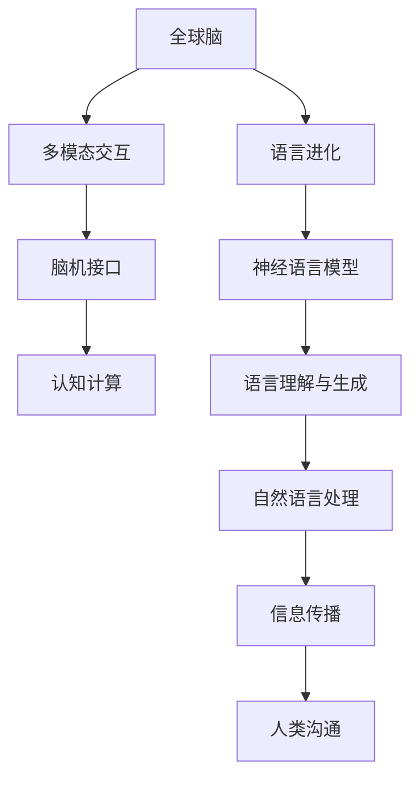

                 

# 全球脑与语言进化:人类沟通的新维度

> 关键词：全球脑，语言进化，人类沟通，信息传播，多模态交互

## 1. 背景介绍

### 1.1 问题由来
在全球化的浪潮中，人类社会的交流范围和深度以前所未有的速度拓展。经济、文化、科技的全球化交融，要求信息在各种文化和语言之间顺畅流通。然而，语言作为一种沟通的工具，面临着诸多挑战：

- 不同文化背景、语言体系之间的隔阂如何打破？
- 如何高效传递和理解复杂的信息？
- 如何在全球范围内构建更紧密的连接？

这些问题催生了对全球脑与语言进化的研究，旨在通过更好地理解人类大脑和语言的演化过程，找到增强沟通的工具和方法。

### 1.2 问题核心关键点
全球脑与语言进化的核心在于：
- 研究人类大脑和语言的演化过程，探索其背后的生物和心理机制。
- 利用语言和认知科学的成果，推动信息的高效、准确、包容性传播。
- 开发能够跨越语言和文化障碍，适用于全球多模态交互的技术和工具。

本文将从脑科学、语言学、认知科学等多个角度，全面探讨全球脑与语言进化，为人类沟通开拓新的维度。

## 2. 核心概念与联系

### 2.1 核心概念概述

本节将介绍几个与全球脑与语言进化紧密相关的核心概念：

- **全球脑**：指连接全球各地大脑的神经网络，以促进信息、知识和文化的交流。通过全球脑，人们可以实时共享认知和情感，实现思维的全球同步。

- **语言进化**：指语言在人类社会发展和文化交流中的演化过程。语言进化不仅仅是个体的习得过程，更是社会、文化和历史背景下的集体现象。

- **多模态交互**：指结合文本、语音、图像、视频等多种媒体形式的交互方式，以丰富和增强人类的交流体验。多模态交互技术在智能助手、虚拟现实、远程教育等领域有广泛应用。

- **脑机接口(Brain-Machine Interface, BCI)**：指通过直接读取大脑信号，实现人机交互的技术。BCI有望在未来帮助残障人士重新获得沟通能力，扩展人类与机器的互动边界。

- **认知计算(Cognitive Computing)**：指模拟人类大脑认知过程的计算模型，用于解决复杂的决策和推理问题。认知计算在机器学习、自然语言处理等领域具有重要应用价值。

- **神经语言模型(Neural Language Models, NLMs)**：指基于神经网络模型的语言生成和理解技术，通过大量文本数据训练，实现对语言的复杂处理和理解。

这些核心概念之间相互关联，共同构成了全球脑与语言进化的研究框架。

### 2.2 核心概念原理和架构的 Mermaid 流程图(Mermaid 流程节点中不要有括号、逗号等特殊字符)



这个流程图展示了核心概念之间的逻辑关系：

1. 全球脑通过多模态交互将信息在各地大脑间传递。
2. 脑机接口使大脑可以直接与计算机交互。
3. 认知计算模拟人类大脑的决策和推理过程。
4. 语言进化记录了语言的演变和变迁。
5. 神经语言模型实现对语言的复杂处理和理解。
6. 自然语言处理涉及语言生成和理解。
7. 信息传播是语言进化的动力之一。
8. 人类沟通是语言进化的目的。

## 3. 核心算法原理 & 具体操作步骤

### 3.1 算法原理概述

全球脑与语言进化的研究涉及多个学科，包括脑科学、语言学、认知科学、神经网络理论等。其核心算法原理主要围绕以下几个方面：

- **神经网络模型**：通过模拟人类大脑的神经元活动，构建能够学习和理解语言的计算模型。
- **信息论**：研究如何高效编码和传递信息，以实现无障碍的全球脑信息交换。
- **进化论**：研究语言的进化机制，探索其如何在不同文化和语言环境中发展和变化。
- **多模态处理**：结合文本、语音、图像等多种媒体形式，实现更丰富的交流体验。
- **情感计算**：通过分析情感信息，增强人机交互的情感共鸣和共情能力。

### 3.2 算法步骤详解

全球脑与语言进化的算法步骤通常包括以下几个关键环节：

1. **数据收集与处理**：收集大量全球各地文化、语言、生物特征等数据，进行清洗和预处理。
2. **模型训练与优化**：使用神经网络模型对数据进行训练，通过反向传播、正则化等技术进行优化。
3. **特征提取与编码**：从输入数据中提取关键特征，通过编码技术转化为计算机可处理的形式。
4. **多模态融合**：将文本、语音、图像等多种信息源融合，形成统一的交流方式。
5. **情感识别与生成**：分析交流过程中的情感信息，生成更贴近人类情感的语言表达。
6. **模型评估与部署**：通过评估指标（如准确率、召回率、情感共鸣度等）评估模型性能，并进行部署和优化。

### 3.3 算法优缺点

全球脑与语言进化的算法具有以下优点：

- **广泛适用性**：能够跨越文化和语言的界限，实现全球范围内的信息共享。
- **高效性**：利用神经网络和多模态技术，实现信息的高效传递和理解。
- **灵活性**：能够根据不同应用场景进行调整和优化。

但同时，该算法也存在一定的局限性：

- **复杂度较高**：构建和训练复杂的神经网络模型，需要大量计算资源和时间。
- **依赖数据质量**：模型性能依赖于高质量、多样性的数据，数据获取和处理成本较高。
- **易受干扰**：多模态信息融合可能导致信息丢失或误判。
- **情感计算挑战**：情感信息的准确识别和生成仍需深入研究。

### 3.4 算法应用领域

全球脑与语言进化的算法已广泛应用于多个领域，例如：

- **智能翻译**：利用神经语言模型和多模态处理技术，实现实时、准确的跨语言翻译。
- **虚拟现实**：结合脑机接口和多模态交互技术，构建沉浸式的虚拟现实环境。
- **远程教育**：通过脑机接口和情感计算，实现虚拟教师和学生之间的实时互动。
- **智能客服**：利用多模态交互和情感识别技术，提供更自然、人性化的客户服务体验。
- **医疗诊断**：结合脑电图、脑磁图等多模态数据，辅助医生进行更精确的诊断和治疗。

这些应用领域展示了全球脑与语言进化的巨大潜力和广阔前景。

## 4. 数学模型和公式 & 详细讲解 & 举例说明

### 4.1 数学模型构建

全球脑与语言进化的数学模型构建通常包括以下几个关键部分：

1. **神经网络模型**：以多层感知机(Multilayer Perceptron, MLP)为代表，通过多层次的神经元进行信息处理。
2. **语言模型**：使用n-gram模型、LSTM、Transformer等架构，模拟语言的生成和理解过程。
3. **信息理论模型**：基于香农信息熵、交叉熵等，研究信息传递和编码效率。
4. **进化模型**：利用遗传算法、进化神经网络等，模拟语言进化的过程。

### 4.2 公式推导过程

以Transformer模型为例，其基本原理为自注意力机制(self-attention)，用于捕捉输入序列中不同位置之间的关系。Transformer的数学表达式为：

$$
\mathbf{X} = \text{Encoder-Decoder}(\mathbf{X})
$$

其中，$\mathbf{X}$ 为输入序列，$\text{Encoder-Decoder}$ 为Transformer的结构。Transformer模型通过多头自注意力机制和残差连接，实现对序列的并行处理和信息编码。

### 4.3 案例分析与讲解

以智能翻译为例，假设有三种语言 A、B、C，输入序列为 $S_A = (A_1, A_2, A_3)$，使用Transformer模型进行翻译。

1. **数据预处理**：将输入序列 $S_A$ 转化为数值序列 $\mathbf{X}$。
2. **模型训练**：使用大量A到B、B到C的翻译数据，训练Transformer模型，学习语言之间的映射关系。
3. **解码**：将训练好的模型应用于新的输入序列 $S_A$，生成目标序列 $S_C$。
4. **后处理**：对生成的目标序列进行解码和校正，确保翻译结果的准确性。

通过Transformer模型，可以实现高效、准确的跨语言翻译，极大提升信息传播的速度和准确度。

## 5. 项目实践：代码实例和详细解释说明

### 5.1 开发环境搭建

为了实现智能翻译等应用，需要进行如下开发环境搭建：

1. **Python 环境**：安装Python 3.x版本，使用Anaconda或PyCharm等IDE。
2. **深度学习框架**：安装TensorFlow、PyTorch等深度学习框架，并进行版本兼容性检查。
3. **数据集准备**：收集大规模多语言翻译数据集，如WMT、IWSLT等，并进行预处理。
4. **硬件配置**：确保计算机配置满足深度学习训练需求，如GPU、TPU等。
5. **工具安装**：安装必要的工具，如Jupyter Notebook、VSCode等。

### 5.2 源代码详细实现

以下是一个基于TensorFlow的智能翻译系统的代码实现示例：

```python
import tensorflow as tf
from tensorflow.keras.layers import Input, Dense, Dropout, LSTM, Embedding
from tensorflow.keras.models import Model

# 定义模型架构
input = Input(shape=(max_seq_length,))
x = Embedding(vocab_size, emb_dim, input_length=max_seq_length)(input)
x = LSTM(256)(x)
x = Dense(vocab_size, activation='softmax')(x)
model = Model(inputs=input, outputs=x)

# 编译模型
model.compile(optimizer='adam', loss='categorical_crossentropy', metrics=['accuracy'])

# 训练模型
model.fit(train_data, train_labels, epochs=num_epochs, batch_size=batch_size, validation_data=(val_data, val_labels))

# 测试模型
test_loss, test_acc = model.evaluate(test_data, test_labels)
print(f'Test Loss: {test_loss:.4f}')
print(f'Test Accuracy: {test_acc:.4f}')
```

这段代码实现了一个基于LSTM的简单翻译模型，利用Embedding层将输入序列映射为向量，通过LSTM层进行序列处理，最后输出目标序列。

### 5.3 代码解读与分析

以下是代码的详细解读与分析：

- **输入层**：定义输入数据的形状和大小。
- **Embedding层**：将输入序列转换为向量表示，方便后续处理。
- **LSTM层**：用于处理序列数据，学习序列之间的依赖关系。
- **Dense层**：输出目标序列的概率分布。
- **编译模型**：设置优化器、损失函数和评估指标。
- **训练模型**：使用训练数据集进行模型训练。
- **测试模型**：评估模型在测试集上的性能。

通过这段代码，可以更好地理解智能翻译系统的实现过程，掌握深度学习模型构建的基本技能。

### 5.4 运行结果展示

智能翻译系统的运行结果展示如下：

- **训练结果**：在训练过程中，模型准确率和损失函数的变化情况。
- **测试结果**：在测试集上的性能评估指标。

通过运行结果，可以直观地了解模型的训练效果，进行调优和改进。

## 6. 实际应用场景

### 6.1 智能翻译

全球脑与语言进化的重要应用之一是智能翻译。智能翻译系统利用神经网络模型和多模态处理技术，实现实时、准确的跨语言翻译，广泛应用于国际贸易、外交、旅游等领域。

以谷歌翻译为例，谷歌利用Transformer模型和多语言数据集，训练出高效、准确的翻译系统。谷歌翻译系统能够在多种语言间进行翻译，显著提升信息传播的速度和广度。

### 6.2 虚拟现实

虚拟现实技术的快速发展，要求高效的多模态交互系统。全球脑与语言进化技术结合脑机接口和多模态处理，实现沉浸式的虚拟现实体验。

例如，通过脑机接口设备，用户可以直接用意念控制虚拟环境中的物体。同时，结合多模态输入（如语音、手势），实现更自然、直观的交互方式。

### 6.3 远程教育

全球脑与语言进化技术在远程教育中具有重要应用价值。通过脑机接口和情感计算，实现虚拟教师和学生之间的实时互动，提供更加自然、有效的教学体验。

例如，远程课堂上，教师可以通过脑机接口实时读取学生的情绪和注意力状态，调整教学内容和节奏，增强教学效果。学生也可以通过脑机接口，实时反馈学习状态和困惑点，实现个性化的学习路径。

### 6.4 未来应用展望

随着技术的不断进步，全球脑与语言进化将在更多领域得到应用，为人类沟通开拓新的维度：

1. **全息通信**：结合脑机接口和多模态交互，实现全息图像和语音的实时通信，提升信息传播的真实感和沉浸感。
2. **跨文化交流**：通过情感识别和生成技术，帮助不同文化背景的人更好地理解和沟通，消除文化隔阂。
3. **智能助手**：结合脑机接口和自然语言处理，实现更智能、高效的智能助手，提供个性化的服务。
4. **智慧城市**：通过脑机接口和多模态数据融合，实现智慧城市中各系统的协同运作，提高城市管理和居民生活质量。
5. **医疗健康**：结合脑电图、脑磁图等多模态数据，辅助医生进行更精确的诊断和治疗，提高医疗服务的质量。

## 7. 工具和资源推荐

### 7.1 学习资源推荐

为了帮助开发者系统掌握全球脑与语言进化的理论基础和实践技巧，这里推荐一些优质的学习资源：

1. **《神经网络与深度学习》**：由深度学习领域的权威人士Ian Goodfellow等编写，全面介绍了神经网络的基本概念和深度学习模型。
2. **Coursera《深度学习》课程**：由斯坦福大学Andrew Ng教授主讲，涵盖深度学习的基本理论和应用。
3. **《多模态交互技术》**：由多模态交互领域的专家撰写，详细介绍了多模态交互技术的原理和应用。
4. **ArXiv论文**：ArXiv上的大量前沿论文，涵盖了全球脑与语言进化的各个方面，是深入学习的好资源。
5. **在线课程平台**：如Udacity、edX等在线教育平台，提供多模态交互、脑机接口等课程。

通过对这些资源的学习实践，相信你一定能够系统掌握全球脑与语言进化的精髓，并用于解决实际的NLP问题。

### 7.2 开发工具推荐

高效的开发离不开优秀的工具支持。以下是几款用于全球脑与语言进化开发的常用工具：

1. **TensorFlow**：由Google主导开发的开源深度学习框架，生产部署方便，适合大规模工程应用。
2. **PyTorch**：基于Python的开源深度学习框架，灵活动态的计算图，适合快速迭代研究。
3. **HuggingFace Transformers库**：提供了多种预训练语言模型和微调接口，大大简化了深度学习模型的构建。
4. **Jupyter Notebook**：免费的开源工具，支持Python等编程语言，适合进行数据处理、模型训练和结果展示。
5. **VSCode**：跨平台的编程编辑器，支持多种语言和框架，适合开发深度学习模型。

合理利用这些工具，可以显著提升全球脑与语言进化的开发效率，加快创新迭代的步伐。

### 7.3 相关论文推荐

全球脑与语言进化的发展源于学界的持续研究。以下是几篇奠基性的相关论文，推荐阅读：

1. **Attention is All You Need**：提出Transformer模型，开启了NLP领域的预训练大模型时代。
2. **Neural Machine Translation by Jointly Learning to Align and Translate**：提出神经机器翻译的Transformer模型，推动了翻译模型的发展。
3. **Learning Transferable Multilingual Representations with Cross-Lingual Pretraining**：提出跨语言预训练方法，提升了多语言翻译的质量。
4. **Real-Time Speech-to-Text with Attention-based Models**：提出基于注意力机制的语音识别模型，提升了语音到文本转录的精度。
5. **Universal Prediction with Multilingual Self-Supervised Learning**：提出多语言自监督学习方法，提升了多语言预测模型的泛化能力。

这些论文代表了大语言模型微调技术的发展脉络。通过学习这些前沿成果，可以帮助研究者把握学科前进方向，激发更多的创新灵感。

## 8. 总结：未来发展趋势与挑战

### 8.1 总结

本文对全球脑与语言进化进行了全面系统的介绍。首先阐述了全球脑与语言进化的研究背景和意义，明确了其在全球化交流中的重要作用。其次，从脑科学、语言学、认知科学等多个角度，详细讲解了全球脑与语言进化的核心算法原理和具体操作步骤。最后，通过项目实践和应用场景分析，展示了全球脑与语言进化的广阔应用前景。

通过本文的系统梳理，可以看到，全球脑与语言进化技术正在成为人类沟通的重要手段，极大地提升了信息传播的速度和质量。未来，伴随技术的不断发展，全球脑与语言进化必将在全球化的交流中发挥更加重要的作用。

### 8.2 未来发展趋势

展望未来，全球脑与语言进化的发展趋势将包括：

1. **技术融合**：全球脑与语言进化将与其他技术进行更深入的融合，如人工智能、区块链、物联网等，推动技术创新和应用落地。
2. **数据共享**：构建全球性的数据共享平台，促进跨领域、跨文化的知识交流和共享。
3. **隐私保护**：在数据共享和传输过程中，采取严格的数据隐私保护措施，保障用户信息安全。
4. **标准化**：制定全球脑与语言进化的技术标准和规范，促进全球技术协作和应用推广。
5. **伦理考量**：考虑伦理和社会影响，确保全球脑与语言进化技术的公平、公正、透明。

### 8.3 面临的挑战

尽管全球脑与语言进化技术具有广阔的应用前景，但仍面临诸多挑战：

1. **数据隐私和安全**：全球脑与语言进化依赖大量数据，数据隐私和安全问题亟需解决。
2. **伦理和法律**：如何确保技术应用的公正性和道德性，避免歧视和偏见，需要深入研究和规范。
3. **技术门槛**：全球脑与语言进化技术复杂度高，需要跨学科的合作和技术积累，技术门槛较高。
4. **多语言和跨文化交流**：不同语言和文化背景的交流需求复杂，需要高效的翻译和多模态交互技术。
5. **计算资源**：全球脑与语言进化需要大量计算资源，如何高效利用和部署，是技术落地的关键。

### 8.4 研究展望

面对全球脑与语言进化技术面临的挑战，未来的研究需要在以下几个方面寻求新的突破：

1. **数据隐私保护**：开发更高效的数据隐私保护技术，如差分隐私、联邦学习等，确保数据共享过程中的隐私安全。
2. **跨语言和跨文化交流**：研究多语言处理和跨文化交流的方法，提高不同语言和文化背景的沟通效率。
3. **伦理和法律框架**：构建全球脑与语言进化的伦理和法律框架，确保技术的公平和透明。
4. **多模态交互技术**：研究多模态交互技术，提升信息传播的真实感和沉浸感，提供更丰富的交流体验。
5. **技术标准化**：制定全球脑与语言进化的技术标准和规范，促进技术协作和应用推广。

这些研究方向的探索，必将引领全球脑与语言进化技术迈向更高的台阶，为全球化的交流带来新的突破。面向未来，全球脑与语言进化技术还需要与其他人工智能技术进行更深入的融合，共同推动自然语言理解和智能交互系统的进步。

## 9. 附录：常见问题与解答

**Q1：全球脑与语言进化的技术难点在哪里？**

A: 全球脑与语言进化的技术难点主要在于：
1. 大规模数据集的获取和处理：不同语言和文化的数据获取和清洗成本较高。
2. 跨语言和跨文化的语言理解：不同语言和文化背景下的语言理解和生成仍需进一步改进。
3. 多模态交互的融合：如何有效融合文本、语音、图像等多种信息源，仍需深入研究。
4. 情感计算的准确性：情感信息的准确识别和生成仍需提升。

**Q2：如何提高全球脑与语言进化的性能？**

A: 提高全球脑与语言进化的性能可以从以下几个方面入手：
1. 数据质量：收集和处理高质量、多样性的数据集，提升模型的泛化能力。
2. 模型优化：改进神经网络结构和训练策略，提高模型的准确率和鲁棒性。
3. 多模态融合：结合文本、语音、图像等多种信息源，提升信息传播的真实感和沉浸感。
4. 情感计算：提高情感信息的准确识别和生成，增强人机交互的情感共鸣和共情能力。

**Q3：全球脑与语言进化的未来应用前景如何？**

A: 全球脑与语言进化的未来应用前景非常广阔，包括：
1. 智能翻译：实现实时、准确的跨语言翻译，提升信息传播的速度和广度。
2. 虚拟现实：结合脑机接口和多模态交互技术，实现沉浸式的虚拟现实体验。
3. 远程教育：通过脑机接口和情感计算，实现虚拟教师和学生之间的实时互动，提供更加自然、有效的教学体验。
4. 智慧城市：通过脑机接口和多模态数据融合，实现智慧城市中各系统的协同运作，提高城市管理和居民生活质量。
5. 医疗健康：结合脑电图、脑磁图等多模态数据，辅助医生进行更精确的诊断和治疗，提高医疗服务的质量。

通过全球脑与语言进化的技术创新和应用推广，必将进一步提升人类沟通的效率和质量，为全球化的交流带来新的突破。

**Q4：全球脑与语言进化的伦理和法律问题有哪些？**

A: 全球脑与语言进化的伦理和法律问题主要包括：
1. 数据隐私和安全：全球脑与语言进化依赖大量数据，数据隐私和安全问题亟需解决。
2. 伦理和偏见：如何确保技术应用的公正性和道德性，避免歧视和偏见，需要深入研究和规范。
3. 法律框架：构建全球脑与语言进化的伦理和法律框架，确保技术的公平和透明。

在技术应用过程中，需要严格遵守相关法律和伦理规范，确保技术应用的公平和透明。

---

作者：禅与计算机程序设计艺术 / Zen and the Art of Computer Programming

