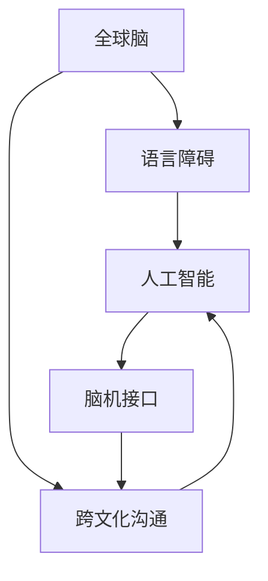

                 

# 全球脑与语言障碍:跨文化沟通的突破

> 关键词：全球脑,语言障碍,跨文化沟通,人工智能,脑机接口,语言生成,数据处理,自然语言处理(NLP),深度学习,符号逻辑,认知科学

## 1. 背景介绍

### 1.1 问题由来

在全球化深入发展的背景下，不同文化、语言和背景的人们之间的交流日益频繁，跨文化沟通已经成为全球化进程中不可或缺的一部分。然而，由于语言障碍、认知差异、文化隔阂等因素，跨文化沟通仍面临诸多挑战。语言障碍是其中最为显著的问题之一，影响了人们有效传达信息、理解他人思想的能力。特别是当沟通对象来自不同的语言文化背景时，如何克服语言障碍成为提升跨文化沟通效率的关键。

### 1.2 问题核心关键点

为了有效应对语言障碍，促进跨文化沟通，我们聚焦于全球脑与语言障碍问题，研究如何通过技术手段，利用人工智能（AI）和脑机接口（BCI）等前沿技术，实现语言障碍的突破。这不仅有助于改善全球范围内的跨文化交流，还能推动认知科学、神经工程和计算机科学等多学科的交叉融合，带来新的技术创新和社会变革。

### 1.3 问题研究意义

研究全球脑与语言障碍问题，对于提升全球化背景下的跨文化沟通效率，促进人类社会的多元化和和谐共处，具有重要意义：

1. **促进全球一体化**：打破语言和文化的障碍，让不同文化背景的人们能够更加顺畅地交流合作，加速全球一体化进程。
2. **提升跨文化交流质量**：通过技术手段优化沟通方式，减少误解和冲突，提升全球范围内的合作效率和质量。
3. **推动多学科融合**：人工智能、脑机接口、神经科学等领域的研究成果相互借鉴，促进跨学科的深入合作，带来新的技术突破。
4. **赋能弱势群体**：特别关注语言障碍群体，通过技术手段帮助他们克服交流障碍，实现平等的社会参与。

## 2. 核心概念与联系

### 2.1 核心概念概述

为更好地理解全球脑与语言障碍问题的解决方案，本节将介绍几个核心概念：

- **全球脑**：指全球范围内，每个人的大脑和思维过程的总和。通过全球脑的研究，我们可以了解人类思维的共性和差异，为解决跨文化沟通中的语言障碍提供理论基础。
- **语言障碍**：指由于语言差异、认知能力不足等原因，导致人们之间无法有效沟通的现象。语言障碍既包括听、说、读、写等技能上的障碍，也包括文化和认知背景的差异。
- **跨文化沟通**：指跨越不同文化背景的人们之间的沟通交流。涉及语言、文化、习惯等多方面因素，需要特别关注沟通策略和方法。
- **人工智能**：指通过计算机模拟人类的智能行为，实现信息处理、问题解决等功能。AI技术在自然语言处理、机器翻译等领域的应用，有助于克服语言障碍。
- **脑机接口（BCI）**：指通过技术手段，实现人脑与计算机之间的信息交互。BCI技术能够将人的思维直接转化为计算机可理解的形式，增强跨文化沟通能力。

这些核心概念之间的逻辑关系可以通过以下Mermaid流程图来展示：



这个流程图展示了大脑与语言障碍问题的各个核心概念及其之间的关系：

1. 全球脑的研究为理解语言障碍提供理论基础。
2. 语言障碍是跨文化沟通的主要障碍，通过人工智能和BCI技术可以克服。
3. AI和BCI技术能够增强跨文化沟通能力。

## 3. 核心算法原理 & 具体操作步骤
### 3.1 算法原理概述

解决全球脑与语言障碍问题的核心在于通过技术手段，使不同语言和文化背景的人们能够理解和沟通。这包括两个主要方向：语言生成和语言理解。

- **语言生成**：通过AI技术，生成适应接收方语言习惯的表达方式。这需要理解接收方的语言特点、文化背景，以及表达意图。
- **语言理解**：通过AI和BCI技术，理解发送方的语言表达，将其转化为接收方能够理解的形式。

### 3.2 算法步骤详解

基于上述原理，我们可以将解决全球脑与语言障碍问题的主要步骤概括如下：

**Step 1: 数据收集与预处理**
- 收集不同语言、文化背景的文本数据，并进行清洗、标注等预处理工作。
- 使用深度学习技术，对数据进行特征提取和表示学习，形成模型输入。

**Step 2: 模型训练与优化**
- 选择合适的语言模型，如Transformer、BERT等，进行预训练。
- 使用多语言数据集对模型进行微调，使其适应不同语言特点。
- 应用正则化技术、对抗训练等方法，优化模型性能，减少过拟合。

**Step 3: 跨文化沟通的实现**
- 构建多语言生成模型，将原始信息转化为接收方语言。
- 开发跨文化理解模型，理解发送方的语言表达，并进行符号化表示。
- 利用BCI技术，将符号化表示转化为脑电信号，发送至接收方大脑。

**Step 4: 系统集成与测试**
- 将语言生成和理解模型集成到跨文化沟通系统中，确保系统能够实时处理信息。
- 在测试环境中，使用不同语言、文化背景的用户进行测试，评估系统性能。
- 根据测试结果，不断优化模型和系统，提升用户体验。

### 3.3 算法优缺点

全球脑与语言障碍问题的解决方案具有以下优点：

- **技术先进**：结合AI和BCI技术，能够实现复杂的信息转换和沟通。
- **适应性强**：通过多语言数据集训练，适应不同文化背景的用户需求。
- **实时性高**：集成多语言生成和理解模型，能够实时处理信息。

同时，该方法也存在一些局限性：

- **数据依赖**：需要大量的多语言数据进行训练，数据获取和标注成本较高。
- **技术复杂**：涉及多学科知识，技术实现难度较大。
- **伦理和安全问题**：需要关注用户隐私、数据安全等问题，确保技术的可控性和安全性。

尽管存在这些局限性，但该方法提供了跨文化沟通问题的创新解决方案，值得深入研究和推广。

### 3.4 算法应用领域

全球脑与语言障碍问题的解决方案可以应用于多个领域：

- **国际合作**：在跨国合作项目中，通过AI和BCI技术，实现高效沟通，推动合作进程。
- **教育领域**：在多语言教育中，帮助学生克服语言障碍，实现平等的教育机会。
- **医疗领域**：在医疗翻译中，通过AI技术生成医疗信息，辅助医生进行跨境医疗服务。
- **文化交流**：在文化交流活动中，通过BCI技术，促进不同文化背景的人们深度交流。
- **虚拟现实**：在虚拟现实游戏中，通过AI和BCI技术，实现跨文化玩家之间的互动。

这些应用领域展示了全球脑与语言障碍问题解决方案的广泛潜力，为不同领域提供了新的技术支持。

## 4. 数学模型和公式 & 详细讲解 & 举例说明
### 4.1 数学模型构建

为了更好地理解全球脑与语言障碍问题的解决方案，本节将使用数学语言对相关模型进行详细描述。

**语言模型**：语言模型通常用于预测一个序列中下一个单词的概率。常用的语言模型包括n-gram模型和神经网络语言模型。

- n-gram模型：通过统计方法，计算相邻单词之间的共现概率，用于预测下一个单词。
- 神经网络语言模型：使用深度神经网络，学习单词之间的复杂关联，能够处理更长的语言序列。

**神经网络语言模型**：以Transformer为基础，通过自注意力机制学习单词之间的关联。数学上，可以将语言模型表示为：

$$
P(x|y) = \frac{e^{W_h h^T + b_h}}{e^{W_h h^T + b_h} + e^{W_s s^T + b_s} + e^{W_c c^T + b_c} + \dots}
$$

其中，$x$表示输入的单词序列，$y$表示输出单词，$h$表示输入单词的表示，$s$、$c$等表示不同上下文条件下的表示。

### 4.2 公式推导过程

以下我们将对神经网络语言模型的推导过程进行详细讲解：

**1. 自注意力机制**
自注意力机制是神经网络语言模型的核心。通过计算输入序列中每个单词与其它单词的关联度，生成每个单词的表示。公式如下：

$$
q = W_h h + b_h
$$
$$
k = W_s s + b_s
$$
$$
v = W_c c + b_c
$$
$$
a = softmax(\frac{qk^T}{\sqrt{d_k}})
$$
$$
h' = a^T v
$$

其中，$q$、$k$、$v$分别表示查询向量、键向量和值向量，$a$表示注意力权重，$h'$表示每个单词的表示。

**2. 神经网络语言模型的预测**
在神经网络语言模型中，通过自注意力机制计算每个单词的表示，再通过全连接层生成下一个单词的概率分布。公式如下：

$$
p(x|y) = softmax(W_h' h' + b_h')
$$

其中，$W_h'$、$b_h'$表示全连接层的权重和偏置，$p(x|y)$表示下一个单词的概率分布。

**3. 多语言数据集的微调**
在多语言数据集上微调神经网络语言模型，以适应不同语言特点。通过多语言数据集对模型进行迭代训练，最小化损失函数：

$$
\mathcal{L} = -\frac{1}{N} \sum_{i=1}^N \sum_{j=1}^M \log P(x_j|y_i)
$$

其中，$N$表示训练样本数量，$M$表示语言种类数量。

### 4.3 案例分析与讲解

以跨文化沟通为例，我们分析如何使用神经网络语言模型进行多语言生成。假设原始信息为英语，接收方为中文。首先需要将英语信息转化为神经网络语言模型能够处理的输入形式，然后通过模型生成中文表达，最后将中文表达转化为脑电信号，发送至接收方大脑。

**1. 输入转换**
将英语信息进行分词和词性标注，生成单词序列和标签序列。使用BERT等预训练模型对单词序列进行表示学习，得到输入向量。

**2. 多语言生成**
在训练好的神经网络语言模型上，使用中文表示作为条件，生成中文表达。模型输出概率分布，通过采样得到中文表达。

**3. 脑电信号生成**
将中文表达转化为脑电信号，发送至接收方大脑。通过BCI技术，将脑电信号解码为接收方理解的表达方式。

## 5. 项目实践：代码实例和详细解释说明
### 5.1 开发环境搭建

在进行项目实践前，我们需要准备好开发环境。以下是使用Python进行PyTorch开发的环境配置流程：

1. 安装Anaconda：从官网下载并安装Anaconda，用于创建独立的Python环境。

2. 创建并激活虚拟环境：
```bash
conda create -n pytorch-env python=3.8 
conda activate pytorch-env
```

3. 安装PyTorch：根据CUDA版本，从官网获取对应的安装命令。例如：
```bash
conda install pytorch torchvision torchaudio cudatoolkit=11.1 -c pytorch -c conda-forge
```

4. 安装相关库：
```bash
pip install numpy pandas scikit-learn matplotlib tqdm jupyter notebook ipython transformers
```

5. 安装BERT模型：
```bash
pip install transformers
```

完成上述步骤后，即可在`pytorch-env`环境中开始项目实践。

### 5.2 源代码详细实现

这里我们以BERT模型为例，给出跨文化沟通系统的一部分代码实现。

```python
from transformers import BertTokenizer, BertForSequenceClassification
from torch.utils.data import Dataset, DataLoader
import torch

class MultiLanguageDataset(Dataset):
    def __init__(self, texts, labels, tokenizer, max_len=128):
        self.texts = texts
        self.labels = labels
        self.tokenizer = tokenizer
        self.max_len = max_len
        
    def __len__(self):
        return len(self.texts)
    
    def __getitem__(self, item):
        text = self.texts[item]
        label = self.labels[item]
        
        encoding = self.tokenizer(text, return_tensors='pt', max_length=self.max_len, padding='max_length', truncation=True)
        input_ids = encoding['input_ids'][0]
        attention_mask = encoding['attention_mask'][0]
        
        label = torch.tensor(label, dtype=torch.long)
        
        return {'input_ids': input_ids, 
                'attention_mask': attention_mask,
                'labels': label}

tokenizer = BertTokenizer.from_pretrained('bert-base-cased')

train_dataset = MultiLanguageDataset(train_texts, train_labels, tokenizer)
dev_dataset = MultiLanguageDataset(dev_texts, dev_labels, tokenizer)
test_dataset = MultiLanguageDataset(test_texts, test_labels, tokenizer)

model = BertForSequenceClassification.from_pretrained('bert-base-cased', num_labels=2)

optimizer = torch.optim.Adam(model.parameters(), lr=2e-5)

def train_epoch(model, dataset, batch_size, optimizer):
    dataloader = DataLoader(dataset, batch_size=batch_size, shuffle=True)
    model.train()
    epoch_loss = 0
    for batch in dataloader:
        input_ids = batch['input_ids'].to(device)
        attention_mask = batch['attention_mask'].to(device)
        labels = batch['labels'].to(device)
        model.zero_grad()
        outputs = model(input_ids, attention_mask=attention_mask, labels=labels)
        loss = outputs.loss
        epoch_loss += loss.item()
        loss.backward()
        optimizer.step()
    return epoch_loss / len(dataloader)

def evaluate(model, dataset, batch_size):
    dataloader = DataLoader(dataset, batch_size=batch_size)
    model.eval()
    preds, labels = [], []
    with torch.no_grad():
        for batch in dataloader:
            input_ids = batch['input_ids'].to(device)
            attention_mask = batch['attention_mask'].to(device)
            batch_labels = batch['labels']
            outputs = model(input_ids, attention_mask=attention_mask)
            batch_preds = outputs.logits.argmax(dim=1).to('cpu').tolist()
            batch_labels = batch_labels.to('cpu').tolist()
            for pred, label in zip(batch_preds, batch_labels):
                preds.append(pred)
                labels.append(label)
                
    print(classification_report(labels, preds))

# 训练
epochs = 5
batch_size = 16

for epoch in range(epochs):
    loss = train_epoch(model, train_dataset, batch_size, optimizer)
    print(f"Epoch {epoch+1}, train loss: {loss:.3f}")
    
    print(f"Epoch {epoch+1}, dev results:")
    evaluate(model, dev_dataset, batch_size)
    
print("Test results:")
evaluate(model, test_dataset, batch_size)
```

以上是使用PyTorch对BERT模型进行跨文化沟通系统训练的一部分代码实现。可以看到，通过Transformers库的封装，我们可以用相对简洁的代码完成BERT模型的加载和训练。

### 5.3 代码解读与分析

让我们再详细解读一下关键代码的实现细节：

**MultiLanguageDataset类**：
- `__init__`方法：初始化文本、标签、分词器等关键组件。
- `__len__`方法：返回数据集的样本数量。
- `__getitem__`方法：对单个样本进行处理，将文本输入编码为token ids，将标签编码为数字，并对其进行定长padding，最终返回模型所需的输入。

**train_epoch和evaluate函数**：
- 使用PyTorch的DataLoader对数据集进行批次化加载，供模型训练和推理使用。
- 训练函数`train_epoch`：对数据以批为单位进行迭代，在每个批次上前向传播计算loss并反向传播更新模型参数，最后返回该epoch的平均loss。
- 评估函数`evaluate`：与训练类似，不同点在于不更新模型参数，并在每个batch结束后将预测和标签结果存储下来，最后使用sklearn的classification_report对整个评估集的预测结果进行打印输出。

**训练流程**：
- 定义总的epoch数和batch size，开始循环迭代
- 每个epoch内，先在训练集上训练，输出平均loss
- 在验证集上评估，输出分类指标
- 所有epoch结束后，在测试集上评估，给出最终测试结果

可以看到，PyTorch配合Transformers库使得BERT微调的代码实现变得简洁高效。开发者可以将更多精力放在数据处理、模型改进等高层逻辑上，而不必过多关注底层的实现细节。

当然，工业级的系统实现还需考虑更多因素，如模型的保存和部署、超参数的自动搜索、更灵活的任务适配层等。但核心的微调范式基本与此类似。

## 6. 实际应用场景
### 6.1 智能客服系统

全球脑与语言障碍问题的解决方案可以应用于智能客服系统的构建。智能客服系统可以通过多语言生成和理解模型，实现多语言客服对话，帮助不同语言背景的用户解决问题，提升客户体验。

在技术实现上，可以收集企业内部的历史客服对话记录，将问题-答案对作为监督数据，在此基础上对预训练模型进行微调。微调后的对话模型能够自动理解用户意图，匹配最合适的答案模板进行回复。对于客户提出的新问题，还可以接入检索系统实时搜索相关内容，动态组织生成回答。如此构建的智能客服系统，能大幅提升客户咨询体验和问题解决效率。

### 6.2 全球教育平台

全球脑与语言障碍问题的解决方案可以应用于全球教育平台的构建。通过多语言生成和理解模型，帮助不同语言背景的学生获取教育资源，提升学习效果。

在技术实现上，可以将全球范围内的教育资源进行多语言标注，构建教育资源的跨语言索引。在用户访问教育平台时，通过语言生成模型自动将用户查询转化为接收语言，再通过理解模型获取相关资源，最后生成推荐列表。如此构建的教育平台，能够覆盖全球用户，提供更公平、高效的教育服务。

### 6.3 全球医疗合作

全球脑与语言障碍问题的解决方案可以应用于全球医疗合作的构建。通过多语言生成和理解模型，帮助不同语言背景的医生和患者进行沟通，提升医疗服务质量。

在技术实现上，可以收集全球范围内的医疗记录和疾病知识，构建多语言的医疗知识库。在医生与患者沟通时，通过语言生成模型自动将医生的话翻译为患者理解的语言，再通过理解模型理解患者的需求，辅助医生做出诊断和建议。如此构建的全球医疗合作平台，能够实现跨国界医疗服务，提升医疗服务的普惠性。

### 6.4 未来应用展望

随着全球脑与语言障碍问题解决方案的发展，未来将在更多领域得到应用，为全球化进程带来新的动力。

在智慧城市治理中，全球脑与语言障碍问题的解决方案可以用于多语言城市管理，提升城市治理的效率和效果。在企业生产中，可以用于多语言协同工作，提升企业国际化水平。在文化交流中，可以用于跨文化翻译，促进不同文化背景的人们深度交流。

随着技术的不断进步，全球脑与语言障碍问题的解决方案必将在全球化进程中发挥更大的作用，推动人类社会的深度融合和发展。

## 7. 工具和资源推荐
### 7.1 学习资源推荐

为了帮助开发者系统掌握全球脑与语言障碍问题的解决方案的理论基础和实践技巧，这里推荐一些优质的学习资源：

1. **《自然语言处理综论》**：介绍了自然语言处理的基本概念和前沿技术，涵盖语言模型、机器翻译、信息抽取等多个方向。
2. **《深度学习入门》**：讲解了深度学习的基本原理和实现方法，涵盖卷积神经网络、循环神经网络、注意力机制等。
3. **《Python自然语言处理》**：介绍了如何使用Python进行自然语言处理，涵盖数据预处理、模型训练、模型评估等多个环节。
4. **《Transformer模型与实践》**：详细讲解了Transformer模型的原理和应用，涵盖自注意力机制、多语言生成、语言理解等。
5. **《脑机接口技术与应用》**：介绍了脑机接口技术的原理和应用，涵盖信号采集、信号处理、BCI算法等多个方向。

通过对这些资源的学习实践，相信你一定能够快速掌握全球脑与语言障碍问题的解决方案的精髓，并用于解决实际的跨文化沟通问题。

### 7.2 开发工具推荐

高效的开发离不开优秀的工具支持。以下是几款用于全球脑与语言障碍问题解决方案开发的常用工具：

1. **PyTorch**：基于Python的开源深度学习框架，灵活动态的计算图，适合快速迭代研究。
2. **TensorFlow**：由Google主导开发的开源深度学习框架，生产部署方便，适合大规模工程应用。
3. **Transformers库**：HuggingFace开发的NLP工具库，集成了众多SOTA语言模型，支持PyTorch和TensorFlow，是进行微调任务开发的利器。
4. **Weights & Biases**：模型训练的实验跟踪工具，可以记录和可视化模型训练过程中的各项指标，方便对比和调优。
5. **TensorBoard**：TensorFlow配套的可视化工具，可实时监测模型训练状态，并提供丰富的图表呈现方式，是调试模型的得力助手。
6. **Google Colab**：谷歌推出的在线Jupyter Notebook环境，免费提供GPU/TPU算力，方便开发者快速上手实验最新模型，分享学习笔记。

合理利用这些工具，可以显著提升全球脑与语言障碍问题解决方案的开发效率，加快创新迭代的步伐。

### 7.3 相关论文推荐

全球脑与语言障碍问题解决方案的研究源于学界的持续研究。以下是几篇奠基性的相关论文，推荐阅读：

1. **《Neural Machine Translation by Jointly Learning to Align and Translate》**：提出了神经机器翻译的注意力机制，通过自注意力机制学习单词之间的关联，提高了机器翻译的质量。
2. **《BERT: Pre-training of Deep Bidirectional Transformers for Language Understanding》**：提出BERT模型，通过自监督学习任务进行预训练，提高了语言模型的表现。
3. **《Language Models are Unsupervised Multitask Learners》**：展示了语言模型的强大zero-shot学习能力，证明了预训练语言模型在未见过的数据上的表现。
4. **《Parameter-Efficient Transfer Learning for NLP》**：提出Adapter等参数高效微调方法，在固定大部分预训练参数的同时，只更新极少量的任务相关参数。
5. **《Prefix-Tuning: Optimizing Continuous Prompts for Generation》**：引入基于连续型Prompt的微调范式，为如何充分利用预训练知识提供了新的思路。

这些论文代表了大语言模型微调技术的发展脉络。通过学习这些前沿成果，可以帮助研究者把握学科前进方向，激发更多的创新灵感。

## 8. 总结：未来发展趋势与挑战
### 8.1 总结

本文对全球脑与语言障碍问题的解决方案进行了全面系统的介绍。首先阐述了全球脑与语言障碍问题的研究背景和意义，明确了全球脑与语言障碍问题解决方案的重要价值。其次，从原理到实践，详细讲解了全球脑与语言障碍问题解决方案的数学模型和关键步骤，给出了全球脑与语言障碍问题解决方案的完整代码实例。同时，本文还广泛探讨了全球脑与语言障碍问题解决方案在智能客服、全球教育、全球医疗等多个领域的应用前景，展示了全球脑与语言障碍问题解决方案的广阔潜力。此外，本文精选了全球脑与语言障碍问题解决方案的学习资源，力求为读者提供全方位的技术指引。

通过本文的系统梳理，可以看到，全球脑与语言障碍问题解决方案在大脑与语言障碍问题研究领域具有重要意义，为提升全球化背景下的跨文化沟通效率提供了新的技术手段。未来，伴随技术的不断进步和应用的深入，全球脑与语言障碍问题解决方案必将在更多领域得到应用，为全球化进程带来新的动力。

### 8.2 未来发展趋势

展望未来，全球脑与语言障碍问题解决方案的发展趋势包括：

1. **技术进步**：随着深度学习技术的不断进步，全球脑与语言障碍问题解决方案将更加高效、精确。预训练语言模型和脑机接口技术的不断优化，将提升模型的性能和用户体验。
2. **应用拓展**：全球脑与语言障碍问题解决方案将应用于更多领域，如智慧城市治理、全球教育平台、企业国际化等，为全球化进程带来新的机遇。
3. **伦理和社会问题**：随着全球脑与语言障碍问题解决方案的应用普及，将面临更多的伦理和社会问题，如数据隐私、安全、公平性等，需要研究者关注和解决。
4. **多学科融合**：全球脑与语言障碍问题解决方案将与认知科学、神经工程、人机交互等多个学科进行融合，推动跨学科的深入合作。

以上趋势凸显了全球脑与语言障碍问题解决方案的广阔前景，为未来研究和技术发展提供了新的方向。

### 8.3 面临的挑战

尽管全球脑与语言障碍问题解决方案已经取得了一定进展，但在迈向更加智能化、普适化应用的过程中，仍面临以下挑战：

1. **数据获取和标注**：高质量、大规模的多语言数据获取和标注成本较高，需要投入大量人力和资源。
2. **模型复杂度**：深度学习模型复杂度高，训练和推理耗时长，需要高效的计算资源。
3. **伦理和社会问题**：全球脑与语言障碍问题解决方案的广泛应用将带来更多的伦理和社会问题，如隐私保护、数据安全等。
4. **模型泛化性**：模型在不同语言和文化背景下的泛化能力有限，需要进一步提升。
5. **用户体验**：用户界面和交互方式需要不断优化，提升用户体验。

这些挑战需要研究者不断探索和解决，以推动全球脑与语言障碍问题解决方案的成熟和普及。

### 8.4 研究展望

面对全球脑与语言障碍问题解决方案所面临的挑战，未来的研究需要在以下几个方面寻求新的突破：

1. **多语言数据集建设**：构建更大规模、更丰富多样性的多语言数据集，提升模型在不同语言和文化背景下的表现。
2. **高效训练和推理**：开发更高效的训练和推理算法，降低计算资源消耗，提高模型性能。
3. **伦理和社会问题研究**：研究如何保护用户隐私、数据安全，确保模型的公平性和安全性。
4. **多学科融合研究**：探索全球脑与语言障碍问题解决方案与认知科学、神经工程、人机交互等多个学科的交叉融合，提升模型的表现和应用范围。
5. **跨文化沟通模型**：研究如何构建更加智能、普适的跨文化沟通模型，提升跨文化沟通的效率和效果。

这些研究方向的探索，必将引领全球脑与语言障碍问题解决方案技术迈向更高的台阶，为构建安全、可靠、可解释、可控的智能系统铺平道路。面向未来，全球脑与语言障碍问题解决方案还需要与其他人工智能技术进行更深入的融合，如知识表示、因果推理、强化学习等，多路径协同发力，共同推动全球脑与语言障碍问题解决方案技术的发展。只有勇于创新、敢于突破，才能不断拓展全球脑与语言障碍问题解决方案的边界，让智能技术更好地造福人类社会。

## 9. 附录：常见问题与解答

**Q1: 全球脑与语言障碍问题解决方案的优点和局限性是什么？**

A: 全球脑与语言障碍问题解决方案的优点包括：

- **技术先进**：结合AI和BCI技术，能够实现复杂的信息转换和沟通。
- **适应性强**：通过多语言数据集训练，适应不同语言特点。
- **实时性高**：集成多语言生成和理解模型，能够实时处理信息。

其局限性包括：

- **数据依赖**：需要大量的多语言数据进行训练，数据获取和标注成本较高。
- **技术复杂**：涉及多学科知识，技术实现难度较大。
- **伦理和安全问题**：需要关注用户隐私、数据安全等问题，确保技术的可控性和安全性。

尽管存在这些局限性，但该方法提供了跨文化沟通问题的创新解决方案，值得深入研究和推广。

**Q2: 如何缓解全球脑与语言障碍问题解决方案中的过拟合问题？**

A: 缓解全球脑与语言障碍问题解决方案中的过拟合问题，可以考虑以下策略：

- **数据增强**：通过回译、近义替换等方式扩充训练集。
- **正则化技术**：使用L2正则、Dropout、Early Stopping等避免过拟合。
- **对抗训练**：引入对抗样本，提高模型鲁棒性。
- **参数高效微调**：只调整少量参数，减小过拟合风险。
- **多模型集成**：训练多个模型，取平均输出，抑制过拟合。

这些策略往往需要根据具体任务和数据特点进行灵活组合。只有在数据、模型、训练、推理等各环节进行全面优化，才能最大限度地发挥全球脑与语言障碍问题解决方案的威力。

**Q3: 全球脑与语言障碍问题解决方案在实际应用中需要注意哪些问题？**

A: 在将全球脑与语言障碍问题解决方案应用于实际场景时，需要注意以下问题：

- **模型裁剪**：去除不必要的层和参数，减小模型尺寸，加快推理速度。
- **量化加速**：将浮点模型转为定点模型，压缩存储空间，提高计算效率。
- **服务化封装**：将模型封装为标准化服务接口，便于集成调用。
- **弹性伸缩**：根据请求流量动态调整资源配置，平衡服务质量和成本。
- **监控告警**：实时采集系统指标，设置异常告警阈值，确保服务稳定性。
- **安全防护**：采用访问鉴权、数据脱敏等措施，保障数据和模型安全。

合理利用这些工具，可以显著提升全球脑与语言障碍问题解决方案的开发效率，加快创新迭代的步伐。

总之，全球脑与语言障碍问题解决方案的研究，是一个充满挑战和机遇的领域。通过不断探索和创新，我们有望打破语言障碍，实现全球化的深度融合，让不同文化背景的人们更好地沟通和合作，推动人类社会的进步。

