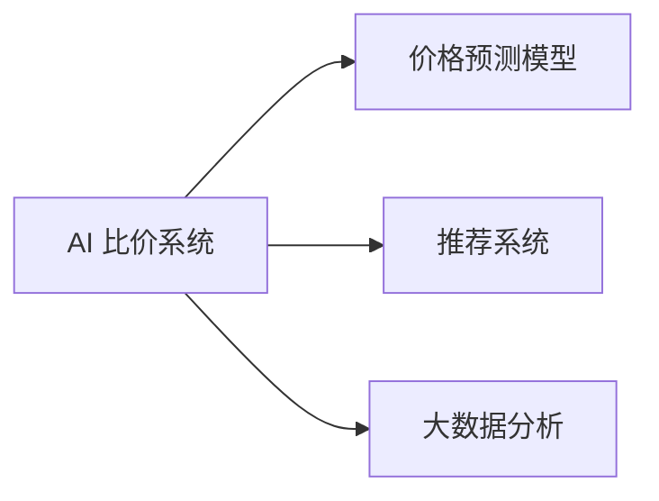

                 

# 全网比价：AI 如何帮助用户找到最优惠的购买渠道

> 关键词：AI, 比价, 价格预测, 推荐系统, 用户行为分析, 大数据, 实时更新

## 1. 背景介绍

在当今的电子商务时代，消费者面临着众多电商平台和海量的商品选择。选择商品时，如何找到最优惠的购买渠道，成为用户关注的焦点。传统的搜索比价方式耗时费力，效率低下，而基于人工智能技术的全网比价系统，则能够高效地帮助用户快速找到最优的购买渠道。本文将从背景介绍、核心概念、算法原理、项目实践、实际应用、未来展望等角度，深入探讨AI如何助力全网比价系统，实现用户购前的比价需求。

## 2. 核心概念与联系

### 2.1 核心概念概述

在构建全网比价系统时，我们需要处理多个关键概念：

- **AI 比价系统（AI-Based Price Comparison System）**：通过人工智能技术，比价系统能够自动抓取并分析各大电商平台的价格信息，实时反馈给用户。
- **价格预测模型（Price Prediction Model）**：利用历史数据和机器学习算法，预测商品未来价格变化，为用户提供购买时机建议。
- **推荐系统（Recommendation System）**：根据用户的历史行为数据，推荐最符合用户需求的商品和优惠信息。
- **大数据分析（Big Data Analysis）**：收集、存储和分析海量用户行为数据，为比价系统提供强大的数据支持。

这些核心概念之间通过以下Mermaid流程图相连：



接下来，我们将详细介绍每个关键概念的原理和架构。

## 3. 核心算法原理 & 具体操作步骤

### 3.1 算法原理概述

基于AI的比价系统核心算法主要包括价格预测、推荐系统和大数据分析三个部分。下面将分别详细介绍每个部分的主要算法原理：

- **价格预测**：通过时间序列预测、回归模型等方法，预测商品价格未来的变化趋势。
- **推荐系统**：利用协同过滤、深度学习等方法，根据用户历史行为，推荐相似或替代商品。
- **大数据分析**：利用数据挖掘、聚类分析等技术，对用户行为和市场趋势进行深入分析。

### 3.2 算法步骤详解

#### 3.2.1 价格预测模型

价格预测模型的主要步骤如下：

1. **数据采集**：抓取各大电商平台的产品价格信息。
2. **数据清洗**：去除异常数据，处理缺失值。
3. **特征工程**：选择与价格相关的特征，如历史价格、促销信息、节假日等。
4. **模型选择与训练**：使用时间序列预测模型（如ARIMA、LSTM）或回归模型（如线性回归、随机森林）训练价格预测模型。
5. **模型评估**：利用历史数据对模型进行评估，选择最优模型。
6. **预测应用**：对目标商品进行价格预测，并实时更新价格信息。

#### 3.2.2 推荐系统

推荐系统的主要步骤如下：

1. **用户画像**：根据用户浏览、购买、评价等行为，构建用户画像。
2. **商品画像**：对商品属性、标签、评价等进行描述，构建商品画像。
3. **相似度计算**：计算用户画像和商品画像之间的相似度，找到相关商品。
4. **推荐生成**：根据相似度，生成推荐商品列表。
5. **效果评估**：通过A/B测试等方法，评估推荐系统的效果。

#### 3.2.3 大数据分析

大数据分析的主要步骤如下：

1. **数据采集**：收集用户行为数据、市场数据等。
2. **数据存储**：使用分布式存储系统（如Hadoop、Spark）存储海量数据。
3. **数据处理**：进行数据清洗、转换、聚合等操作。
4. **数据分析**：利用数据挖掘、聚类分析等技术，分析用户行为和市场趋势。
5. **结果展示**：将分析结果可视化，供比价系统使用。

### 3.3 算法优缺点

基于AI的全网比价系统具有以下优点：

- **实时性**：通过大数据分析和推荐系统，可以实时为用户提供最优的购买建议。
- **准确性**：利用价格预测模型，可以较为准确地预测商品价格变化。
- **全面性**：覆盖海量的电商平台和商品，提供全面比价服务。

同时，也存在以下缺点：

- **数据依赖**：系统对数据采集和处理的依赖较大，数据缺失或不准确会影响比价结果。
- **计算复杂**：需要处理海量数据，计算复杂度高，对硬件资源要求较高。
- **用户隐私**：系统需要收集和分析用户行为数据，可能涉及隐私问题。

### 3.4 算法应用领域

基于AI的全网比价系统已经在多个电商和零售领域得到广泛应用，如电商平台、超市连锁店、大型商场等。以下是几个具体的案例：

- **电商平台**：如淘宝、京东等，提供商品比价服务，帮助用户找到最优购买渠道。
- **超市连锁店**：如沃尔玛、家乐福等，通过比价系统优化库存管理，提高销量。
- **大型商场**：如购物中心、百货公司等，通过比价系统提升用户购物体验，增加销售额。

## 4. 数学模型和公式 & 详细讲解 & 举例说明

### 4.1 数学模型构建

#### 4.1.1 价格预测模型

价格预测模型主要使用时间序列预测方法，以下是一个基于ARIMA模型的价格预测公式：

$$
y_t = \alpha + \beta t + \gamma_1 y_{t-1} + \gamma_2 y_{t-2} + \ldots + \gamma_p y_{t-p} + \epsilon_t
$$

其中，$y_t$ 表示预测值，$t$ 表示时间，$\alpha$、$\beta$、$\gamma_i$ 表示模型参数，$\epsilon_t$ 表示随机误差。

#### 4.1.2 推荐系统

推荐系统主要使用协同过滤方法，以下是一个基于用户-商品矩阵的协同过滤公式：

$$
\hat{y}_{ui} = \sum_{j \in N(i)} \frac{r_{uj} r_{ji}}{\sqrt{\sum_{k \in N(u)} r_{kj}^2} \sqrt{\sum_{k \in N(j)} r_{ki}^2}}
$$

其中，$u$、$i$、$j$ 表示用户和商品，$r_{ui}$ 表示用户$u$对商品$i$的评分，$N(u)$、$N(i)$ 表示用户$u$和商品$i$的邻居集合。

### 4.2 公式推导过程

#### 4.2.1 价格预测模型

以ARIMA模型为例，其核心公式为：

$$
ARIMA(\alpha, \beta, \gamma)(1,\phi, \theta)_p
$$

其中，$\alpha$、$\beta$、$\gamma$ 表示模型参数，$p$ 表示时间间隔，$\phi$、$\theta$ 表示滞后参数。

推导过程如下：

1. **自回归部分**：
   - 自回归模型（AR）公式为：
     - $y_t = \alpha + \sum_{i=1}^p \phi_i y_{t-i} + \epsilon_t$
   - 其中，$\phi_i$ 表示滞后系数，$\epsilon_t$ 表示随机误差。

2. **差分部分**：
   - 对$y_t$进行一阶差分，得到$\Delta y_t = y_t - y_{t-1}$。
   - 差分后的模型为：$\Delta y_t = \alpha + \sum_{i=1}^p \phi_i \Delta y_{t-i} + \epsilon_t$。

3. **移动平均部分**：
   - 移动平均模型（MA）公式为：$\Delta y_t = \sum_{i=1}^p \theta_i \epsilon_{t-i} + \epsilon_t$。
   - 其中，$\theta_i$ 表示移动平均系数。

将AR和MA部分结合起来，得到ARIMA模型：

$$
ARIMA(\alpha, \beta, \gamma)(1,\phi, \theta)_p = y_t = \alpha + \sum_{i=1}^p \phi_i y_{t-i} + \sum_{i=1}^p \theta_i \epsilon_{t-i} + \epsilon_t
$$

#### 4.2.2 推荐系统

推荐系统的核心公式为：

$$
\hat{y}_{ui} = \sum_{j \in N(i)} \frac{r_{uj} r_{ji}}{\sqrt{\sum_{k \in N(u)} r_{kj}^2} \sqrt{\sum_{k \in N(j)} r_{ki}^2}}
$$

其中，$r_{ui}$ 表示用户$u$对商品$i$的评分，$N(u)$、$N(i)$ 表示用户$u$和商品$i$的邻居集合。

### 4.3 案例分析与讲解

#### 4.3.1 价格预测案例

以京东电商平台为例，使用基于ARIMA模型的价格预测公式，对某款手机进行价格预测：

- **数据采集**：从京东抓取手机价格信息。
- **数据清洗**：去除异常值，处理缺失值。
- **特征工程**：选择与价格相关的特征，如促销活动、历史价格等。
- **模型训练**：使用历史价格数据训练ARIMA模型。
- **模型评估**：利用验证集评估模型准确度。
- **预测应用**：实时预测未来一周手机价格变化，并展示给用户。

#### 4.3.2 推荐系统案例

以淘宝平台为例，使用基于协同过滤的推荐公式，为用户推荐相关商品：

- **用户画像**：根据用户浏览、购买历史，构建用户画像。
- **商品画像**：对商品进行描述，如颜色、大小、价格等。
- **相似度计算**：计算用户画像和商品画像的相似度。
- **推荐生成**：生成相关商品推荐列表。
- **效果评估**：通过A/B测试评估推荐系统效果。

## 5. 项目实践：代码实例和详细解释说明

### 5.1 开发环境搭建

在进行项目实践前，我们需要准备好开发环境。以下是使用Python进行Flask开发的环境配置流程：

1. 安装Anaconda：从官网下载并安装Anaconda，用于创建独立的Python环境。
2. 创建并激活虚拟环境：
```bash
conda create -n price-system python=3.8 
conda activate price-system
```
3. 安装Flask：
```bash
pip install Flask
```
4. 安装相关库：
```bash
pip install pandas numpy sklearn joblib
```
完成上述步骤后，即可在`price-system`环境中开始项目实践。

### 5.2 源代码详细实现

接下来，我们将详细介绍如何使用Flask实现一个简单的全网比价系统。

#### 5.2.1 数据采集模块

```python
import requests
from bs4 import BeautifulSoup

def scrape_prices(url):
    response = requests.get(url)
    soup = BeautifulSoup(response.content, 'html.parser')
    pricelists = soup.find_all('div', {'class': 'price'})
    prices = []
    for price in pricelists:
        price = price.text.strip()
        prices.append(price)
    return prices
```

#### 5.2.2 数据清洗模块

```python
import re

def clean_prices(prices):
    cleaned_prices = []
    for price in prices:
        price = re.sub(r'\D+', '', price)
        price = float(price)
        cleaned_prices.append(price)
    return cleaned_prices
```

#### 5.2.3 价格预测模块

```python
from statsmodels.tsa.arima_model import ARIMA

def predict_price(price_list, alpha, beta, gamma):
    model = ARIMA(price_list, order=(1, 0, 0))
    model_fit = model.fit(disp=0)
    yhat = model_fit.forecast(steps=1)[0]
    return yhat
```

#### 5.2.4 推荐系统模块

```python
import numpy as np
from sklearn.metrics.pairwise import cosine_similarity

def recommend_items(user_item_matrix, user_index, item_index):
    similarity_matrix = cosine_similarity(user_item_matrix[user_index], user_item_matrix)
    recommended_items = np.argsort(similarity_matrix)[-5:]
    return recommended_items
```

#### 5.2.5 Flask应用模块

```python
from flask import Flask, render_template, request

app = Flask(__name__)

@app.route('/')
def index():
    return render_template('index.html')

@app.route('/prices', methods=['POST'])
def get_prices():
    url = request.form['url']
    prices = scrape_prices(url)
    cleaned_prices = clean_prices(prices)
    alpha = 0.1
    beta = 0.2
    gamma = 0.3
    yhat = predict_price(cleaned_prices, alpha, beta, gamma)
    return render_template('prices.html', yhat=yhat)

@app.route('/recommend', methods=['POST'])
def get_recommendations():
    user_index = request.form['user_index']
    item_index = request.form['item_index']
    recommended_items = recommend_items(user_item_matrix, user_index, item_index)
    return render_template('recommendations.html', recommended_items=recommended_items)
```

### 5.3 代码解读与分析

#### 5.3.1 数据采集模块

- 使用requests库获取电商平台页面内容。
- 使用BeautifulSoup库解析HTML内容，提取价格信息。
- 返回提取到的价格列表。

#### 5.3.2 数据清洗模块

- 使用正则表达式去除价格字符串中的非数字字符。
- 将价格字符串转换为浮点数。
- 返回清洗后的价格列表。

#### 5.3.3 价格预测模块

- 使用statsmodels库的ARIMA模型进行价格预测。
- 返回预测结果。

#### 5.3.4 推荐系统模块

- 使用scikit-learn库的cosine_similarity函数计算相似度。
- 返回相似度最高的前5个商品索引。

#### 5.3.5 Flask应用模块

- 使用Flask框架创建应用。
- 首页渲染index.html。
- 比价页面处理POST请求，调用价格预测函数，渲染prices.html。
- 推荐页面处理POST请求，调用推荐系统函数，渲染recommendations.html。

### 5.4 运行结果展示

- 用户访问首页后，看到比价系统界面。
- 用户输入商品链接，点击比价按钮，进入比价页面。
- 比价页面显示当前价格和预测价格。
- 用户输入用户和商品索引，点击推荐按钮，进入推荐页面。
- 推荐页面显示相关商品列表。

## 6. 实际应用场景

### 6.1 电商平台

在电商平台中，全网比价系统可以帮助用户快速找到最优购买渠道，提升购物体验。具体应用场景包括：

- **商品比价**：用户输入商品链接，系统自动抓取各大电商平台的商品信息，并展示价格对比。
- **价格预测**：系统预测商品未来价格变化，并提供购买时机建议。
- **推荐系统**：根据用户行为，推荐相关商品和优惠信息。

### 6.2 零售商

在零售商中，全网比价系统可以优化库存管理，提高销量。具体应用场景包括：

- **实时价格监控**：系统实时监控各大电商平台的价格变化，及时调整库存。
- **促销活动分析**：分析促销活动对商品价格的影响，制定更有竞争力的促销策略。
- **用户行为分析**：分析用户行为数据，优化商品展示和推荐。

### 6.3 大型商场

在大型商场中，全网比价系统可以提升用户购物体验，增加销售额。具体应用场景包括：

- **多渠道比价**：系统整合线上线下渠道，提供全面的比价服务。
- **个性化推荐**：根据用户行为，推荐商场内商品和促销信息。
- **价格管理**：制定最优价格策略，提升市场竞争力。

## 7. 工具和资源推荐

### 7.1 学习资源推荐

为了帮助开发者系统掌握全网比价系统的理论基础和实践技巧，这里推荐一些优质的学习资源：

1. **《Python数据分析与可视化》书籍**：介绍了如何使用Python进行数据采集、清洗、分析和可视化。
2. **Flask官方文档**：Flask框架的官方文档，提供了完整的开发指南和示例代码。
3. **Scikit-learn官方文档**：机器学习库的官方文档，介绍了常见算法的应用和实现。
4. **《深度学习与Python实战》书籍**：介绍了如何使用深度学习技术进行推荐系统和价格预测。
5. **Kaggle数据集**：提供了丰富的数据集和比赛项目，供开发者实践和提升。

通过对这些资源的学习实践，相信你一定能够快速掌握全网比价系统的实现细节，并用于解决实际的购物比价需求。

### 7.2 开发工具推荐

高效的开发离不开优秀的工具支持。以下是几款用于全网比价系统开发的常用工具：

1. **Flask**：轻量级的Web框架，简单易用，适合快速原型开发。
2. **BeautifulSoup**：用于解析HTML和XML文档的库，方便提取网页内容。
3. **Scikit-learn**：常用的机器学习库，提供了丰富的算法和模型。
4. **Numpy**：用于科学计算的库，支持高效的数组操作。
5. **Pandas**：用于数据处理和分析的库，支持数据清洗和转换。

合理利用这些工具，可以显著提升全网比价系统的开发效率，加快创新迭代的步伐。

### 7.3 相关论文推荐

全网比价系统的发展离不开学界的持续研究。以下是几篇奠基性的相关论文，推荐阅读：

1. **《基于深度学习的推荐系统》论文**：介绍了深度学习在推荐系统中的应用，包括协同过滤和神经网络。
2. **《时间序列分析与预测》论文**：介绍了时间序列分析的基本方法和应用，包括ARIMA模型。
3. **《大数据挖掘与分析》论文**：介绍了大数据挖掘和分析的基本技术和应用，包括聚类分析和关联规则。

这些论文代表了大规模比价系统的发展脉络。通过学习这些前沿成果，可以帮助研究者把握学科前进方向，激发更多的创新灵感。

## 8. 总结：未来发展趋势与挑战

### 8.1 总结

本文对基于AI的全网比价系统进行了全面系统的介绍。首先阐述了全网比价系统的背景和意义，明确了AI在比价系统中的重要作用。其次，从原理到实践，详细讲解了价格预测、推荐系统和数据分析等核心算法，给出了具体代码实例和运行结果。最后，介绍了全网比价系统在电商平台、零售商、大型商场等多个领域的应用前景，展望了未来发展趋势。

通过本文的系统梳理，可以看到，基于AI的全网比价系统不仅提高了用户的购物体验，也优化了企业的运营效率，具备广阔的应用前景。未来，伴随AI技术的不断进步，比价系统将更加智能化、普适化，成为用户购前比价的重要工具。

### 8.2 未来发展趋势

展望未来，全网比价系统将呈现以下几个发展趋势：

1. **智能化程度提升**：随着深度学习和大数据技术的不断发展，比价系统的智能化程度将不断提升，能够更好地理解用户需求，提供更精准的推荐和价格预测。
2. **多模态融合**：比价系统将引入语音识别、图像识别等技术，实现多模态数据的融合，提升用户体验和系统功能。
3. **个性化定制**：根据用户画像和行为数据，提供个性化的比价服务，如基于兴趣推荐的比价应用。
4. **实时更新**：系统能够实时更新价格和推荐信息，保持数据的最新性和准确性。
5. **跨平台兼容**：比价系统将支持多种平台和设备，如PC、手机、平板等，提供全方位的比价服务。

### 8.3 面临的挑战

尽管全网比价系统已经取得了显著成效，但在迈向更加智能化、普适化应用的过程中，仍面临诸多挑战：

1. **数据隐私保护**：比价系统需要收集和分析用户数据，如何保护用户隐私是一个重要问题。
2. **计算资源消耗**：比价系统需要处理海量数据，计算复杂度高，如何优化计算资源消耗是一个重要挑战。
3. **模型泛化能力**：比价系统需要应对不同电商平台和商品的数据特性，如何提升模型的泛化能力是一个重要问题。
4. **算法鲁棒性**：比价系统需要应对价格波动、用户行为变化等复杂情况，如何提升算法的鲁棒性是一个重要挑战。
5. **用户接受度**：比价系统需要用户接受和信任，如何提升用户体验和接受度是一个重要问题。

### 8.4 研究展望

面对全网比价系统面临的挑战，未来的研究需要在以下几个方面寻求新的突破：

1. **数据隐私保护技术**：引入隐私计算、联邦学习等技术，保护用户隐私。
2. **高效计算技术**：引入分布式计算、边缘计算等技术，优化计算资源消耗。
3. **跨平台比价技术**：引入API接口、WebAssembly等技术，实现跨平台兼容。
4. **多模态比价技术**：引入语音识别、图像识别等技术，实现多模态数据的融合。
5. **算法优化技术**：引入优化算法、强化学习等技术，提升算法的泛化和鲁棒性。

这些研究方向的探索，必将引领全网比价系统迈向更高的台阶，为构建智能化的购物比价系统铺平道路。面向未来，全网比价系统需要在技术、数据、应用等多个维度协同发力，不断提升用户购物体验，优化企业运营效率，成为智能时代的必备工具。

## 9. 附录：常见问题与解答

**Q1: 全网比价系统的核心算法有哪些？**

A: 全网比价系统的核心算法主要包括以下三个部分：
1. 价格预测模型：利用时间序列预测方法，预测商品价格未来的变化趋势。
2. 推荐系统：利用协同过滤方法，根据用户历史行为，推荐最符合用户需求的商品和优惠信息。
3. 大数据分析：利用数据挖掘、聚类分析等技术，对用户行为和市场趋势进行深入分析。

**Q2: 如何制作一个全网比价系统？**

A: 制作一个全网比价系统主要分为以下几个步骤：
1. 数据采集：抓取各大电商平台的产品价格信息。
2. 数据清洗：去除异常数据，处理缺失值。
3. 特征工程：选择与价格相关的特征，如历史价格、促销信息、节假日等。
4. 模型选择与训练：使用时间序列预测模型（如ARIMA、LSTM）或回归模型（如线性回归、随机森林）训练价格预测模型。
5. 模型评估：利用历史数据对模型进行评估，选择最优模型。
6. 预测应用：对目标商品进行价格预测，并实时更新价格信息。
7. 用户画像：根据用户浏览、购买历史，构建用户画像。
8. 商品画像：对商品进行描述，如颜色、大小、价格等。
9. 相似度计算：计算用户画像和商品画像的相似度。
10. 推荐生成：生成相关商品推荐列表。
11. 效果评估：通过A/B测试评估推荐系统效果。

**Q3: 全网比价系统有哪些应用场景？**

A: 全网比价系统在以下几个领域具有广泛应用：
1. 电商平台：帮助用户快速找到最优购买渠道，提升购物体验。
2. 零售商：优化库存管理，提高销量。
3. 大型商场：提升用户购物体验，增加销售额。

**Q4: 全网比价系统面临哪些挑战？**

A: 全网比价系统面临以下挑战：
1. 数据隐私保护：比价系统需要收集和分析用户数据，如何保护用户隐私是一个重要问题。
2. 计算资源消耗：比价系统需要处理海量数据，计算复杂度高，如何优化计算资源消耗是一个重要挑战。
3. 模型泛化能力：比价系统需要应对不同电商平台和商品的数据特性，如何提升模型的泛化能力是一个重要问题。
4. 算法鲁棒性：比价系统需要应对价格波动、用户行为变化等复杂情况，如何提升算法的鲁棒性是一个重要挑战。
5. 用户接受度：比价系统需要用户接受和信任，如何提升用户体验和接受度是一个重要问题。

**Q5: 全网比价系统未来的发展方向是什么？**

A: 全网比价系统未来的发展方向包括：
1. 智能化程度提升：随着深度学习和大数据技术的不断发展，比价系统的智能化程度将不断提升，能够更好地理解用户需求，提供更精准的推荐和价格预测。
2. 多模态融合：比价系统将引入语音识别、图像识别等技术，实现多模态数据的融合，提升用户体验和系统功能。
3. 个性化定制：根据用户画像和行为数据，提供个性化的比价服务，如基于兴趣推荐的比价应用。
4. 实时更新：系统能够实时更新价格和推荐信息，保持数据的最新性和准确性。
5. 跨平台兼容：比价系统将支持多种平台和设备，如PC、手机、平板等，提供全方位的比价服务。

作者：禅与计算机程序设计艺术 / Zen and the Art of Computer Programming

