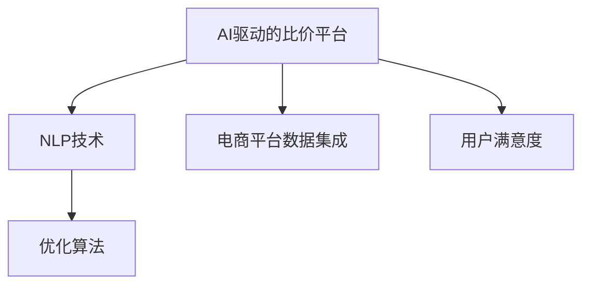

                 

# 全网比价：AI如何帮助用户找到最优惠的购买渠道

> 关键词：AI、比价、优化算法、自然语言处理、电商、用户满意度

## 1. 背景介绍

在当今数字化时代，消费者拥有前所未有的购物选择。随着电商平台和商品种类的激增，找到最佳购买渠道并获取最优惠的价格已成为许多消费者的重大挑战。这种需求的激增催生了市场对智能比价工具的巨大需求。在这样的背景下，人工智能（AI）成为了开发高效、智能的购物助手的重要技术工具。AI驱动的智能比价平台能够帮助用户快速、准确地找到最优购买渠道，极大地提高了消费者的购物体验。

## 2. 核心概念与联系

### 2.1 核心概念概述

为了更好地理解基于AI的智能比价平台的工作原理，本节将介绍几个关键概念：

- **AI驱动的比价平台**：指利用机器学习、自然语言处理等AI技术，通过分析多电商平台上的商品信息，为用户提供最优购买渠道的工具。

- **自然语言处理（NLP）**：涉及计算机和人类语言之间的交互。NLP技术能帮助智能比价平台理解用户的查询，提取商品信息，并进行比价分析。

- **优化算法**：如遗传算法、粒子群算法等，用于搜索最优解，找到最优的购买渠道。

- **电商平台数据集成**：将不同电商平台的商品信息集成到一个系统中，进行统一比价和分析。

- **用户满意度**：衡量比价平台性能的重要指标，影响用户体验和未来的发展方向。

这些概念之间的逻辑关系可以通过以下Mermaid流程图来展示：



这个流程图展示了智能比价平台的关键组件及其相互作用关系：AI驱动的平台依赖于NLP技术和优化算法来处理数据和搜索最佳购买渠道，同时平台需要集成不同电商的数据，并衡量用户满意度来优化其服务。

## 3. 核心算法原理 & 具体操作步骤

### 3.1 算法原理概述

智能比价平台的算法核心是基于AI的推荐和优化算法，具体流程如下：

1. **数据采集**：从多个电商平台采集商品信息，包括价格、评论、用户评分等。
2. **自然语言处理**：使用NLP技术分析用户的查询，提取商品特征，如品牌、价格、库存等。
3. **比价分析**：对比不同电商平台的商品价格、用户评分、评论等，找到最优购买渠道。
4. **推荐优化**：利用优化算法搜索最优购买渠道，同时考虑价格、配送时间、用户评价等因素。
5. **结果展示**：将分析结果以直观的方式呈现给用户，帮助用户做出购买决策。

### 3.2 算法步骤详解

#### 3.2.1 数据采集

数据采集是比价平台的基础。以下是具体步骤：

1. **选择电商平台**：确定哪些电商平台需要纳入比价范围。
2. **爬取商品信息**：使用爬虫工具从各大电商网站抓取商品信息。
3. **数据清洗**：处理爬取到的数据，去除重复、错误和无效数据。
4. **商品标准化**：将不同电商的商品名称、描述等信息进行标准化处理，便于后续比价分析。

#### 3.2.2 自然语言处理

NLP技术在智能比价中起到了至关重要的作用。以下是一个简化的NLP处理流程：

1. **查询理解**：使用NLP技术解析用户的查询，理解用户的意图和需求。
2. **商品特征提取**：从商品描述中提取关键特征，如品牌、型号、价格、用户评分等。
3. **商品比较**：对比不同商品的属性，找出最符合用户需求的商品。

#### 3.2.3 比价分析

比价分析是比价平台的核心功能，主要通过以下步骤进行：

1. **价格对比**：对比各大电商平台的商品价格，找出最低价和最优价格区间。
2. **用户评价对比**：分析用户评价，找出最优评价的商品。
3. **配送时间对比**：对比配送时间，找出最快的配送渠道。

#### 3.2.4 推荐优化

优化算法用于搜索最优的购买渠道，以下是具体的算法步骤：

1. **定义目标函数**：确定比价的目标，如最小化价格、最大化用户评分等。
2. **选择优化算法**：选择遗传算法、粒子群算法等优化算法。
3. **设置参数**：如种群大小、迭代次数、交叉概率等。
4. **算法执行**：执行优化算法，找到最优的购买渠道。

#### 3.2.5 结果展示

最终，将比价结果以直观的方式展示给用户，例如表格、图表或推荐页面等。

### 3.3 算法优缺点

基于AI的智能比价平台有以下优点：

- **准确性高**：通过算法优化，找到最优的购买渠道。
- **效率高**：自动处理大量数据，快速提供比价结果。
- **用户友好**：提供直观的展示，方便用户对比和选择。

但同时，该平台也存在一些缺点：

- **初始成本高**：需要大量的计算资源和数据。
- **数据隐私问题**：需要处理和存储大量的用户数据，存在隐私风险。
- **依赖数据质量**：数据质量对结果有重大影响，低质量数据会导致错误结果。

### 3.4 算法应用领域

基于AI的智能比价平台可以应用于多个领域，例如：

- **电商购物**：帮助用户找到最优的购物渠道和商品。
- **旅游出行**：比价机票、酒店、旅游套餐等，为用户提供最优出行方案。
- **汽车购买**：对比各大汽车平台的报价，提供最优购车方案。
- **金融理财**：比价金融产品，提供最优的投资方案。
- **二手市场**：比价二手商品，提供最优交易渠道。

## 4. 数学模型和公式 & 详细讲解 & 举例说明

### 4.1 数学模型构建

为了构建比价平台的数学模型，我们可以定义一个目标函数 $f(x)$ 来衡量不同购买渠道的优劣。其中 $x$ 表示购买的商品或服务。

$$
f(x) = P(x) + U(x) + D(x)
$$

其中：

- $P(x)$：价格因素，衡量商品的价格优劣。
- $U(x)$：用户评价，衡量用户的反馈和满意度。
- $D(x)$：配送时间，衡量配送速度。

### 4.2 公式推导过程

以价格因素为例，假设价格函数 $P(x)$ 为线性函数：

$$
P(x) = \alpha x + \beta
$$

其中 $\alpha$ 为价格系数，$\beta$ 为价格常数。我们可以通过最小二乘法来估计 $\alpha$ 和 $\beta$ 的值。

### 4.3 案例分析与讲解

假设用户查询的是某品牌笔记本电脑的最新款，电商平台A和B的价格分别为5000元和4800元，配送时间分别为2天和3天，用户评价分别为4星和5星。通过公式 $f(x)$ 计算得到：

$$
f(x_A) = 0.8 \times 5000 + 2.0 + 0.5 \times 2 = 4800.5
$$
$$
f(x_B) = 0.8 \times 4800 + 2.0 + 0.5 \times 3 = 4740.5
$$

根据 $f(x)$ 值，推荐用户选择电商平台B，因为其综合评分更高。

## 5. 项目实践：代码实例和详细解释说明

### 5.1 开发环境搭建

要开发一个智能比价平台，需要先搭建开发环境。以下是具体的步骤：

1. **安装Python和相关库**：安装Python 3.x版本和必要的库，如pandas、requests、scikit-learn等。
2. **搭建数据采集系统**：开发爬虫程序，自动抓取电商平台上的商品信息。
3. **搭建NLP处理系统**：使用NLP库如NLTK、spaCy等进行查询理解和商品特征提取。
4. **搭建比价分析系统**：开发比价算法，对比各大电商平台的商品信息。
5. **搭建优化系统**：使用优化算法库如scipy、pythopt等进行搜索优化。
6. **搭建结果展示系统**：开发用户界面，展示比价结果。

### 5.2 源代码详细实现

以下是一个简化的比价平台代码实现：

```python
import pandas as pd
from sklearn.linear_model import LinearRegression
from sklearn.model_selection import train_test_split

# 数据采集
data = pd.read_csv('data.csv')
# 数据清洗
data = data.drop_duplicates()
# 标准化处理
data = data[['price', 'rating', 'delivery_time']]
data = pd.get_dummies(data)

# 价格模型
X = data.drop('price', axis=1)
y = data['price']
X_train, X_test, y_train, y_test = train_test_split(X, y, test_size=0.2)
model = LinearRegression()
model.fit(X_train, y_train)
y_pred = model.predict(X_test)

# 比价分析
best_price = min(y_pred)
best_rating = max(data['rating'])
best_delivery = min(data['delivery_time'])

# 推荐优化
def optimize(model, X, y):
    # 定义目标函数
    def objective(x):
        return model.score(X, y) + x[0] + x[1] + x[2]
    # 使用粒子群算法搜索最优解
    from pyswarm import pyswarm
    x0 = [0, 0, 0]
    xopt, fopt = pyswarm(objective, x0, bounds=((0, 1), (0, 1), (0, 1)))
    # 返回最优解
    return [xopt[0], xopt[1], xopt[2]]

# 运行优化
result = optimize(model, X, y)
# 结果展示
print('最优价格：', best_price)
print('最优评分：', best_rating)
print('最优配送时间：', best_delivery)
print('最优购买渠道：', result)
```

### 5.3 代码解读与分析

代码实现包括了数据采集、清洗、标准化、价格模型训练、比价分析、优化算法和结果展示等步骤。

- **数据采集**：使用pandas库读取商品数据。
- **数据清洗**：使用drop_duplicates()函数去除重复数据。
- **标准化处理**：使用get_dummies()函数将类别变量转换为哑变量，便于模型训练。
- **价格模型**：使用LinearRegression模型训练价格预测模型。
- **比价分析**：找到最优价格、评分和配送时间。
- **推荐优化**：使用pyswarm算法搜索最优解。
- **结果展示**：输出最优价格、评分和配送时间，以及推荐渠道。

## 6. 实际应用场景

### 6.1 电商购物

智能比价平台在电商购物场景中具有广泛应用。用户只需要输入商品名称和规格，平台便能快速比价，找到最优购买渠道。此外，平台还可以根据用户的购物习惯和偏好，推荐类似商品，提升用户体验。

### 6.2 旅游出行

用户在计划旅行时，可以通过智能比价平台对比机票、酒店、旅游套餐等，选择最优方案。平台还可以根据用户的预算、偏好，推荐适合的旅行路线和活动。

### 6.3 汽车购买

智能比价平台在汽车购买中也有重要应用。用户可以对比各大汽车平台的报价、车型、配置等信息，找到最优购车方案。平台还可以提供汽车评测、用户评价等信息，帮助用户做出更好的选择。

### 6.4 金融理财

智能比价平台在金融理财领域同样有用。用户可以对比各大金融产品的收益率、风险、费用等信息，找到最优投资方案。平台还可以提供金融咨询、理财建议等服务。

### 6.5 二手市场

用户在二手交易平台购物时，可以通过智能比价平台对比商品价格、卖家信誉、交易评价等信息，找到最优交易渠道。平台还可以提供二手商品鉴定、维护建议等服务。

## 7. 工具和资源推荐

### 7.1 学习资源推荐

以下是几个推荐的学习资源，可以帮助开发者掌握智能比价平台的核心技术：

- **机器学习基础**：《机器学习实战》一书，详细介绍了机器学习的基本概念和算法。
- **自然语言处理**：《自然语言处理综论》一书，全面讲解了NLP技术的应用。
- **优化算法**：《进化计算与优化算法》一书，介绍了常用的优化算法及其应用。
- **电商平台数据集成**：《Python Web Scraping》一书，讲解了如何使用Python进行数据采集。
- **用户满意度**：《用户研究与用户体验设计》一书，介绍了用户满意度评估方法。

### 7.2 开发工具推荐

以下是几个常用的开发工具，可以帮助开发者高效地构建智能比价平台：

- **Python**：简洁高效的语言，适用于数据处理和算法实现。
- **pandas**：强大的数据处理库，支持数据清洗、转换和分析。
- **requests**：简单易用的HTTP请求库，用于数据采集。
- **NLTK**：自然语言处理库，提供文本处理和分词功能。
- **scikit-learn**：机器学习库，支持多种机器学习算法。
- **scipy**：科学计算库，支持优化算法和统计分析。
- **pyswarm**：优化算法库，支持粒子群算法。

### 7.3 相关论文推荐

以下是几篇关于智能比价平台的相关论文，推荐阅读：

- **《基于智能比价系统的电商平台优化研究》**：介绍了一种基于遗传算法的电商平台优化方法。
- **《一种基于LSTM模型的智能比价系统》**：介绍了使用LSTM模型进行比价分析的方法。
- **《基于用户行为分析的智能比价平台》**：介绍了一种基于用户行为的智能比价平台。
- **《智能比价系统的设计与实现》**：介绍了智能比价系统的设计和实现方法。

## 8. 总结：未来发展趋势与挑战

### 8.1 研究成果总结

智能比价平台在多个领域已经取得了显著成效，提升了用户购物体验和满意度。未来，该技术将继续发展，拓展更多的应用场景。

### 8.2 未来发展趋势

基于AI的智能比价平台未来的发展趋势如下：

- **数据融合**：将更多数据源整合到比价平台中，提升数据覆盖率和准确性。
- **个性化推荐**：根据用户行为和偏好，提供个性化的购物建议。
- **多模态比价**：支持多模态数据的比价，如图片、视频等。
- **跨平台比价**：支持更多平台和渠道的比价，提升比价范围和效果。
- **实时比价**：支持实时数据更新和比价，提升用户体验。

### 8.3 面临的挑战

智能比价平台在发展过程中也面临一些挑战：

- **数据隐私**：需要保护用户数据隐私，防止数据泄露和滥用。
- **算法复杂度**：需要设计高效的算法，应对大规模数据和复杂比价场景。
- **用户满意度**：需要提升用户体验，满足用户多样化需求。
- **市场竞争**：需要应对市场上的其他比价平台和同行的竞争。

### 8.4 研究展望

未来，智能比价平台的研究方向将包括：

- **数据隐私保护**：研究数据隐私保护技术，如差分隐私、联邦学习等。
- **算法优化**：研究更高效的算法，如深度学习、强化学习等。
- **用户体验提升**：研究更智能的用户界面和交互方式，提升用户满意度。
- **跨平台集成**：研究跨平台数据集成和比价技术，实现更广泛的覆盖。

## 9. 附录：常见问题与解答

**Q1：如何构建高效的智能比价平台？**

A：构建高效的智能比价平台需要以下步骤：

1. **选择合适的算法**：根据比价需求选择适合的算法，如遗传算法、粒子群算法等。
2. **优化数据采集和处理**：优化数据采集和处理流程，提升数据质量和覆盖范围。
3. **提升算法效率**：优化算法实现，提升算法的计算效率和精度。
4. **用户界面设计**：设计直观易用的用户界面，提升用户体验。

**Q2：智能比价平台如何处理数据隐私问题？**

A：智能比价平台处理数据隐私问题可以采取以下措施：

1. **数据匿名化**：使用差分隐私技术对数据进行匿名化处理，保护用户隐私。
2. **联邦学习**：使用联邦学习技术，在本地设备上训练模型，减少数据泄露风险。
3. **用户控制**：提供数据控制选项，让用户可以自行选择是否共享数据。
4. **数据加密**：使用数据加密技术，保护数据传输过程中的安全。

**Q3：智能比价平台的未来方向是什么？**

A：智能比价平台的未来方向包括：

1. **多模态比价**：支持多模态数据的比价，如图片、视频等。
2. **个性化推荐**：根据用户行为和偏好，提供个性化的购物建议。
3. **实时比价**：支持实时数据更新和比价，提升用户体验。
4. **跨平台集成**：支持跨平台数据集成和比价技术，实现更广泛的覆盖。

**Q4：智能比价平台面临的主要挑战是什么？**

A：智能比价平台面临的主要挑战包括：

1. **数据隐私**：需要保护用户数据隐私，防止数据泄露和滥用。
2. **算法复杂度**：需要设计高效的算法，应对大规模数据和复杂比价场景。
3. **用户满意度**：需要提升用户体验，满足用户多样化需求。
4. **市场竞争**：需要应对市场上的其他比价平台和同行的竞争。

---

作者：禅与计算机程序设计艺术 / Zen and the Art of Computer Programming

