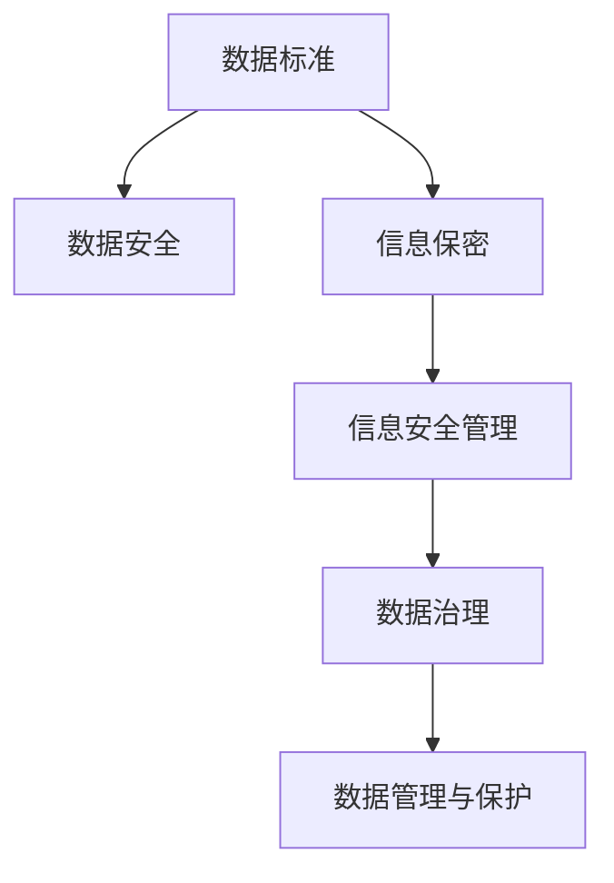

                 

## 1. 背景介绍

在当今数字化时代，数据成为企业核心资产之一，其妥善管理对企业的生存和发展至关重要。数据标准及信息保密制度的制定与实施，有助于提升企业的数据治理水平，保障数据安全，增强企业竞争力。本文旨在详细阐述公司数据标准及信息保密制度的核心内容，为相关领域提供有力的技术指导和实践参考。

### 1.1 问题由来

随着信息技术的发展，数据在企业的运营、决策、创新等方面发挥着越来越重要的作用。然而，数据的大量生成和存储也带来了数据标准不一、数据孤岛、数据安全问题等挑战。这些问题不仅影响了数据的有效利用，还可能带来严重的经济损失和信誉损害。因此，制定和实施一套完善的数据标准及信息保密制度，是企业数字化转型的迫切需求。

### 1.2 问题核心关键点

公司数据标准及信息保密制度的核心内容包括数据标准的制定、数据的管理与保护、信息保密策略的制定与执行等。这些关键点构成了企业数据治理的基石，确保数据的规范性、完整性、可用性和安全性。

## 2. 核心概念与联系

### 2.1 核心概念概述

为更好地理解公司数据标准及信息保密制度，本节将介绍几个密切相关的核心概念：

- **数据标准**：用于指导企业数据收集、存储、处理、共享和使用的规范性文件，确保数据的一致性、准确性和完整性。
- **信息保密**：指对敏感数据进行保护，防止未授权的访问、使用或泄露，以保障企业核心利益和用户隐私。
- **数据安全**：包括数据的保密性、完整性和可用性，是信息保密的重要组成部分。
- **数据治理**：指对数据的创建、管理、使用和销毁的全生命周期进行规范和控制，以确保数据的质量和可用性。
- **信息安全管理**：涉及信息技术系统的安全管理，包括安全策略、风险评估、安全审计等，保障系统的稳定运行。

这些核心概念之间的逻辑关系可以通过以下Mermaid流程图来展示：



这个流程图展示了这个概念之间的联系：

1. 数据标准是数据治理的起点，指导数据的规范使用。
2. 信息保密和数据安全是保障数据安全的重要手段。
3. 信息安全管理是信息技术系统的整体安全保障。
4. 数据管理与保护是数据治理的重要环节，确保数据的正确使用。

这些概念共同构成了公司数据标准及信息保密制度的核心内容，确保企业数据的完整性、可用性和安全性。

## 3. 核心算法原理 & 具体操作步骤

### 3.1 算法原理概述

公司数据标准及信息保密制度的制定与实施，本质上是一个多目标优化问题，旨在平衡数据的使用和保护，同时满足企业的数据治理需求。其核心思想是：

- **数据标准化**：通过制定统一的数据标准，确保数据的规范性、一致性和可理解性。
- **信息保密**：通过严格的信息保密策略，防止敏感数据泄露和滥用。
- **数据治理**：通过数据治理措施，确保数据的完整性、可用性和合规性。

### 3.2 算法步骤详解

基于以上思想，公司数据标准及信息保密制度的制定与实施通常包括以下几个关键步骤：

**Step 1: 数据需求分析**
- 识别企业内部和外部所需的数据类型、格式、质量和访问权限等需求。
- 分析数据的关键性能指标（KPI），如数据的完整性、准确性、及时性和可用性。

**Step 2: 制定数据标准**
- 制定统一的数据命名规范、数据结构、数据格式、数据类型、数据质量要求等标准。
- 确保数据标准的可操作性、可扩展性和可维护性。

**Step 3: 信息保密策略制定**
- 识别敏感数据的类型、存储位置、访问权限和传输要求等。
- 制定相应的信息保密策略，如数据加密、访问控制、权限管理等。

**Step 4: 实施数据安全措施**
- 部署数据安全技术，如防火墙、入侵检测系统、数据加密、身份验证等。
- 定期进行安全审计和风险评估，及时发现和修复安全漏洞。

**Step 5: 数据治理机制构建**
- 建立数据管理流程，包括数据收集、存储、处理、共享和销毁等环节。
- 制定数据治理政策和操作规程，确保数据使用的合规性和透明度。

**Step 6: 数据管理与保护**
- 对数据进行分类、标记和分级，确定不同等级数据的访问和使用规则。
- 对数据进行定期的备份和恢复测试，确保数据的完整性和可用性。

**Step 7: 持续改进**
- 定期评估和优化数据标准及信息保密制度，确保其适应企业发展和数据变化。
- 持续提升员工的数据治理意识和技能，促进制度的有效执行。

### 3.3 算法优缺点

公司数据标准及信息保密制度的制定与实施具有以下优点：
- **提升数据治理水平**：通过统一的数据标准和规范，确保数据的完整性、准确性和一致性。
- **保障数据安全**：通过严格的信息保密策略和技术措施，防止数据泄露和滥用。
- **增强企业竞争力**：通过高效的数据管理与保护，提升数据的使用价值，增强企业创新能力和市场竞争力。

同时，该制度也存在一定的局限性：
- **实施难度大**：需要投入大量资源进行数据标准的制定和实施，存在一定的管理难度。
- **灵活性不足**：标准化和规范化可能限制数据的灵活使用，特别是在创新和快速变化的市场环境中。
- **动态适应性差**：数据标准和信息保密策略可能难以快速适应数据环境和业务变化。

尽管存在这些局限性，但就目前而言，公司数据标准及信息保密制度仍是大数据治理和管理的重要范式。未来相关研究的重点在于如何进一步降低制度实施的成本，提高其灵活性和动态适应性，同时兼顾数据安全和企业创新需求。

### 3.4 算法应用领域

公司数据标准及信息保密制度在多个领域得到了广泛应用，例如：

- **金融行业**：通过统一的数据标准和严格的信息保密策略，保障客户数据的安全和合规使用。
- **医疗行业**：通过规范医疗数据的使用和共享，确保患者隐私和数据安全，促进医疗数据的高效利用。
- **电子商务**：通过数据标准化和保密措施，提升交易数据的可信度，保障用户和商家权益。
- **制造业**：通过数据治理和保护，优化生产数据的使用，提升生产效率和产品质量。
- **政府机构**：通过规范公共数据的使用和保护，提升政府数据的管理水平和透明度。

这些领域的数据治理需求各异，但通过实施公司数据标准及信息保密制度，都能显著提升数据治理水平和数据安全保障能力。

## 4. 数学模型和公式 & 详细讲解 & 举例说明

### 4.1 数学模型构建

公司数据标准及信息保密制度的数学模型主要涉及数据标准、信息保密和数据治理三个方面。这里将分别构建数学模型并进行推导。

**数据标准化模型**
假设企业需处理的数据类型为 $D$，数据标准为 $S$，数据标准化过程可以通过以下步骤建模：
1. 识别数据类型 $D$，定义数据标准 $S$。
2. 定义数据标准化的函数 $f$，将数据 $D$ 映射到符合标准 $S$ 的数据 $D'$。
3. 定义数据标准化的评估函数 $g$，评估数据标准化后的质量 $Q$。

数学表达形式为：
$$
D' = f(D,S)
$$
$$
Q = g(D',S)
$$

**信息保密模型**
假设企业需保护的数据为 $D$，信息保密策略为 $P$，保密技术为 $T$。信息保密过程可以通过以下步骤建模：
1. 识别需保护的数据 $D$，定义信息保密策略 $P$。
2. 定义信息保密函数 $h$，将数据 $D$ 转换为加密形式 $D''$。
3. 定义保密技术的性能函数 $m$，评估保密技术的安全性 $M$。

数学表达形式为：
$$
D'' = h(D,P)
$$
$$
M = m(D'',P)
$$

**数据治理模型**
假设企业需治理的数据为 $D'$，数据治理策略为 $G$，治理措施为 $A$。数据治理过程可以通过以下步骤建模：
1. 识别需治理的数据 $D'$，定义数据治理策略 $G$。
2. 定义数据治理函数 $i$，将数据 $D'$ 进行治理，生成符合策略 $G$ 的数据 $D'''$。
3. 定义治理措施的性能函数 $n$，评估治理措施的合规性 $N$。

数学表达形式为：
$$
D''' = i(D',G)
$$
$$
N = n(D''',G)
$$

### 4.2 公式推导过程

以下我们将对上述模型的公式进行推导。

**数据标准化公式推导**
数据标准化过程通常包括以下几个步骤：

1. 数据预处理：清洗、去重、格式转换等。
2. 数据映射：通过函数 $f$ 将原始数据 $D$ 映射到符合标准 $S$ 的数据 $D'$。

假设数据 $D$ 为文本数据，数据标准 $S$ 为固定长度、格式规范等。数据标准化的函数 $f$ 可以通过以下公式表示：
$$
f(D,S) = [D_{1}, D_{2}, ..., D_{n}]
$$
其中 $D_i$ 表示按照标准 $S$ 处理后的数据。

数据标准化后的质量评估函数 $g$ 可以通过以下公式表示：
$$
g(D',S) = \sum_{i=1}^n f_i(D_i, S)
$$
其中 $f_i$ 表示评估函数对每个数据 $D_i$ 进行评估，并加和计算总分。

**信息保密公式推导**
信息保密过程通常包括以下几个步骤：

1. 数据加密：通过函数 $h$ 将原始数据 $D$ 加密为加密形式 $D''$。
2. 加密技术评估：通过函数 $m$ 评估加密技术的安全性 $M$。

假设数据 $D$ 为文本数据，信息保密策略 $P$ 为密钥加密等。信息保密函数 $h$ 可以通过以下公式表示：
$$
h(D,P) = [D_{1}, D_{2}, ..., D_{n}]
$$
其中 $D_i$ 表示加密后的数据。

信息保密技术的安全性评估函数 $m$ 可以通过以下公式表示：
$$
M = \sum_{i=1}^n m_i(D_i, P)
$$
其中 $m_i$ 表示评估函数对每个加密数据 $D_i$ 进行安全性评估，并加和计算总分。

**数据治理公式推导**
数据治理过程通常包括以下几个步骤：

1. 数据分类：根据数据的重要性和敏感度，进行分类标记。
2. 数据治理：通过函数 $i$ 将数据 $D'$ 治理为符合策略 $G$ 的数据 $D'''$。
3. 治理措施评估：通过函数 $n$ 评估治理措施的合规性 $N$。

假设数据 $D'$ 为文本数据，数据治理策略 $G$ 为访问控制等。数据治理函数 $i$ 可以通过以下公式表示：
$$
i(D',G) = [D_{1}, D_{2}, ..., D_{n}]
$$
其中 $D_i$ 表示治理后的数据。

数据治理措施的合规性评估函数 $n$ 可以通过以下公式表示：
$$
N = \sum_{i=1}^n n_i(D_i, G)
$$
其中 $n_i$ 表示评估函数对每个治理数据 $D_i$ 进行合规性评估，并加和计算总分。

### 4.3 案例分析与讲解

**案例分析**：某大型金融企业的数据治理实践。

假设该企业需处理大量客户交易数据，这些数据涉及客户的个人信息、交易记录和财务数据等，属于敏感数据。

1. **数据标准化**：
   - 识别数据类型 $D$，定义数据标准 $S$，包括数据格式、字段名称、数据长度等。
   - 定义数据标准化的函数 $f$，将原始数据 $D$ 转换为符合标准 $S$ 的数据 $D'$。

   实施过程：清洗原始数据，去除重复和错误数据；定义固定长度、格式规范等标准；对数据进行格式化处理，生成符合标准的数据 $D'$。

   质量评估：通过函数 $g$ 对标准化后的数据 $D'$ 进行评估，确保数据的完整性和一致性。

2. **信息保密**：
   - 识别需保护的数据 $D'$，定义信息保密策略 $P$，包括数据加密、访问控制等。
   - 定义信息保密函数 $h$，将数据 $D'$ 转换为加密形式 $D''$。

   实施过程：对客户交易数据进行加密处理，使用AES算法加密；设置严格的访问控制，限制敏感数据的访问权限。

   安全性评估：通过函数 $m$ 对加密后的数据 $D''$ 进行安全性评估，确保数据的安全性。

3. **数据治理**：
   - 识别需治理的数据 $D''$，定义数据治理策略 $G$，包括数据分类、访问控制等。
   - 定义数据治理函数 $i$，将数据 $D''$ 进行治理，生成符合策略 $G$ 的数据 $D'''$。

   实施过程：对加密后的数据进行分类标记，标记敏感数据和普通数据；设置访问控制，限制敏感数据的访问权限；对数据进行定期备份和恢复测试。

   合规性评估：通过函数 $n$ 对治理后的数据 $D'''$ 进行合规性评估，确保数据治理的合规性和透明度。

## 5. 项目实践：代码实例和详细解释说明

### 5.1 开发环境搭建

在进行数据标准及信息保密制度的实践前，我们需要准备好开发环境。以下是使用Python进行开发的环境配置流程：

1. 安装Anaconda：从官网下载并安装Anaconda，用于创建独立的Python环境。

2. 创建并激活虚拟环境：
```bash
conda create -n data_std_env python=3.8 
conda activate data_std_env
```

3. 安装Python依赖包：
```bash
pip install pandas numpy scikit-learn transformers
```

4. 配置开发环境：
```bash
pip install conda-data-transfer-protocol conda-forge
```

完成上述步骤后，即可在`data_std_env`环境中开始实践。

### 5.2 源代码详细实现

下面我们以数据标准化为例，给出使用Python进行数据标准化的代码实现。

首先，定义数据标准化的函数：

```python
import pandas as pd

def data_standardize(df, schema):
    # 定义数据标准化函数
    def standardize_column(column):
        # 数据清洗
        column = column.apply(lambda x: x.strip() if isinstance(x, str) else x)
        # 数据转换
        if schema[column.name]['type'] == 'date':
            column = column.apply(lambda x: pd.to_datetime(x))
        elif schema[column.name]['type'] == 'number':
            column = column.apply(lambda x: x if isinstance(x, (int, float)) else x)
        return column

    # 按列进行标准化处理
    for column in df.columns:
        df[column] = standardize_column(df[column])

    return df
```

然后，定义数据治理的代码：

```python
from sklearn.preprocessing import LabelEncoder

def data_govern(df, policy):
    # 定义数据治理函数
    def govern_column(column):
        # 数据分类
        encoder = LabelEncoder()
        if policy[column.name]['type'] == 'categorical':
            column = encoder.fit_transform(column)
        # 数据加密
        elif policy[column.name]['type'] == 'sensitive':
            column = column.apply(lambda x: '*'*len(str(x)))
        return column

    # 按列进行治理处理
    for column in df.columns:
        df[column] = govern_column(df[column])

    return df
```

最后，定义信息保密的代码：

```python
from cryptography.fernet import Fernet

def data_secure(df, key):
    # 定义数据保密函数
    def secure_column(column):
        # 数据加密
        cipher_suite = Fernet(key)
        column = column.apply(lambda x: cipher_suite.encrypt(x.encode()))
        return column

    # 按列进行保密处理
    for column in df.columns:
        df[column] = secure_column(df[column])

    return df
```

### 5.3 代码解读与分析

让我们再详细解读一下关键代码的实现细节：

**数据标准化函数**：
- `data_standardize`函数：通过定义`standardize_column`函数，对每一列数据进行标准化处理。其中，对字符串类型数据进行去空格，对日期类型数据进行日期格式转换，对数字类型数据进行类型转换。最终返回标准化后的数据框`df`。

**数据治理函数**：
- `data_govern`函数：通过定义`govern_column`函数，对每一列数据进行治理处理。其中，对分类数据进行编码，对敏感数据进行加密处理。最终返回治理后的数据框`df`。

**数据保密函数**：
- `data_secure`函数：通过定义`secure_column`函数，对每一列数据进行加密处理。其中，使用AES算法加密数据。最终返回加密后的数据框`df`。

## 6. 实际应用场景

### 6.1 智能客服系统

基于数据标准及信息保密制度，智能客服系统可以更好地管理和保护客户数据，提高客户服务质量。系统通过标准化客户信息，确保数据的一致性和完整性；通过严格的信息保密策略，防止客户数据泄露；通过数据治理措施，确保数据的合规使用。这些措施使得智能客服系统能够更高效地响应用户咨询，提升用户体验。

### 6.2 金融行业

在金融行业中，数据标准及信息保密制度对保障客户数据安全和合规使用至关重要。通过标准化和治理客户交易数据，确保数据的完整性和一致性；通过严格的信息保密策略，防止敏感数据泄露；通过数据治理措施，确保数据的合规使用。这些措施使得金融企业能够更好地保护客户隐私，提升数据安全性，保障金融业务的安全和稳定。

### 6.3 医疗行业

在医疗行业中，数据标准及信息保密制度对保护患者隐私和数据安全至关重要。通过标准化和治理患者医疗数据，确保数据的完整性和一致性；通过严格的信息保密策略，防止敏感数据泄露；通过数据治理措施，确保数据的合规使用。这些措施使得医疗机构能够更好地保护患者隐私，提升数据安全性，保障医疗业务的安全和稳定。

## 7. 工具和资源推荐

### 7.1 学习资源推荐

为了帮助开发者系统掌握数据标准及信息保密制度的理论基础和实践技巧，这里推荐一些优质的学习资源：

1. 《数据治理指南》书籍：系统介绍了数据治理的基本概念、方法和实践，适合初学者入门。

2. 《数据隐私保护》课程：涵盖了数据隐私保护的理论基础和实际应用，由数据隐私领域的专家主讲。

3. 《Python数据处理与分析》书籍：通过丰富的案例和代码，详细讲解了数据标准化的实践方法。

4. 《信息安全管理》课程：系统介绍了信息安全管理的理论和实践，包括加密技术、访问控制等。

5. 《数据治理最佳实践》白皮书：提供了数据治理的实践案例和经验总结，适合企业和开发者参考。

通过对这些资源的学习实践，相信你一定能够快速掌握数据标准及信息保密制度的精髓，并用于解决实际的数据治理问题。

### 7.2 开发工具推荐

高效的开发离不开优秀的工具支持。以下是几款用于数据标准及信息保密制度开发的常用工具：

1. Python：作为数据处理和分析的流行语言，Python提供丰富的数据处理库和工具，如pandas、numpy、scikit-learn等，适合数据标准化和治理。

2. Apache Kafka：用于数据流处理和数据集成，适合高效的数据治理和访问控制。

3. AWS Glue：基于云的数据集成和数据治理平台，适合大规模数据的治理和管理。

4. Apache NiFi：用于数据流处理和数据治理，支持丰富的数据处理和治理功能。

5. OpenSSL：开源的加密库，支持多种加密算法和协议，适合数据加密和信息保密。

合理利用这些工具，可以显著提升数据标准及信息保密制度的开发效率，加快创新迭代的步伐。

### 7.3 相关论文推荐

数据标准及信息保密制度的研究源于学界的持续研究。以下是几篇奠基性的相关论文，推荐阅读：

1. "Data Governance Framework for Enterprises"：介绍了企业数据治理的框架和方法。

2. "Privacy-Preserving Data Mining"：研究了数据隐私保护的技术和应用。

3. "Information Security Management Systems"：介绍了信息安全管理的理论和实践。

4. "Data Standardization for Enterprise"：研究了企业数据标准化的技术和方法。

5. "Data Governance and Privacy Protection"：研究了数据治理和隐私保护的理论和实践。

这些论文代表了大数据治理和信息保密制度的发展脉络。通过学习这些前沿成果，可以帮助研究者把握学科前进方向，激发更多的创新灵感。

## 8. 总结：未来发展趋势与挑战

### 8.1 总结

本文对公司数据标准及信息保密制度的制定与实施进行了全面系统的介绍。首先阐述了数据标准及信息保密制度的核心内容，明确了其在数据治理和信息保密方面的重要作用。其次，从原理到实践，详细讲解了数据标准化、信息保密和数据治理的具体步骤和方法，给出了数据标准化的代码实例。同时，本文还广泛探讨了数据标准及信息保密制度在智能客服、金融、医疗等领域的实际应用，展示了其巨大的潜力。此外，本文精选了数据标准及信息保密制度的相关学习资源、开发工具和研究论文，力求为读者提供全方位的技术指引。

通过本文的系统梳理，可以看到，数据标准及信息保密制度在企业数字化转型的过程中扮演着至关重要的角色。其通过标准化和治理数据，保障数据的安全和合规使用，是企业数据治理的重要手段。未来，伴随数据治理技术的不断演进，基于数据标准及信息保密制度的管理体系将更加完善，为企业的数字化转型提供坚实的技术保障。

### 8.2 未来发展趋势

展望未来，数据标准及信息保密制度将呈现以下几个发展趋势：

1. **数据标准化规范**：随着数据治理技术的成熟，数据标准化规范将更加精细化和标准化，确保数据的可操作性和可维护性。

2. **信息保密技术**：随着加密技术的发展，数据保密技术将更加先进和安全，能够更好地保护敏感数据的隐私。

3. **数据治理工具**：随着数据治理工具的完善，企业能够更加高效地进行数据治理和保护，提升数据治理的效率和效果。

4. **数据隐私保护**：随着数据隐私保护意识的提升，数据隐私保护技术将更加严格和全面，保障数据的合规使用。

5. **数据治理模型**：基于大数据和人工智能技术，数据治理模型将更加智能和灵活，能够实时动态调整数据治理策略，适应企业的数据变化。

6. **数据合规性评估**：随着数据合规性要求的提升，数据治理措施将更加合规和透明，确保数据使用的合法性。

这些趋势凸显了数据标准及信息保密制度的广阔前景。这些方向的探索发展，必将进一步提升数据治理水平和数据安全保障能力，为企业的数字化转型提供更坚实的技术保障。

### 8.3 面临的挑战

尽管数据标准及信息保密制度的制定与实施取得了一定的成效，但在迈向更加智能化、普适化应用的过程中，它仍面临着诸多挑战：

1. **数据标准化难度大**：不同业务领域的标准化需求各异，制定统一的标准化规范存在一定的挑战。

2. **信息保密技术复杂**：加密技术需要高度的技术实现和实践经验，存在一定的实施难度。

3. **数据治理成本高**：数据治理需要投入大量的人力和资源，存在一定的管理难度。

4. **数据动态适应性差**：数据治理措施难以快速适应数据环境和业务变化，存在一定的灵活性不足。

5. **数据合规性复杂**：数据合规性要求复杂，需要持续关注和调整，存在一定的合规性风险。

尽管存在这些挑战，但就目前而言，数据标准及信息保密制度仍是大数据治理和管理的重要范式。未来相关研究的重点在于如何进一步降低制度实施的成本，提高其灵活性和动态适应性，同时兼顾数据安全和企业创新需求。

### 8.4 研究展望

面对数据标准及信息保密制度所面临的种种挑战，未来的研究需要在以下几个方面寻求新的突破：

1. **数据标准化方法**：探索更高效的数据标准化方法，如自动化标准化工具、自动化标准化流程等，降低标准化难度。

2. **信息保密技术**：开发更高效、更安全的数据保密技术，如同态加密、多方计算等，提升保密效果。

3. **数据治理工具**：开发更灵活、更智能的数据治理工具，如数据治理平台、智能治理引擎等，提升治理效率。

4. **数据隐私保护**：研究更严格、更全面的数据隐私保护技术，如差分隐私、联邦学习等，保障数据隐私。

5. **数据合规性评估**：研究更全面、更智能的数据合规性评估技术，如自动化合规检测、合规性自动调整等，提升合规性效果。

这些研究方向的探索，必将引领数据标准及信息保密制度技术迈向更高的台阶，为构建安全、可靠、可解释、可控的智能系统铺平道路。面向未来，数据标准及信息保密制度还需要与其他人工智能技术进行更深入的融合，如知识表示、因果推理、强化学习等，多路径协同发力，共同推动自然语言理解和智能交互系统的进步。只有勇于创新、敢于突破，才能不断拓展语言模型的边界，让智能技术更好地造福人类社会。

## 9. 附录：常见问题与解答

**Q1：数据标准化的目的是什么？**

A: 数据标准化的主要目的是确保数据的规范性、一致性和可理解性。通过统一数据格式、命名规则、编码方式等，使得数据能够方便地进行处理、分析和共享，提高数据的利用效率。

**Q2：信息保密策略包含哪些内容？**

A: 信息保密策略通常包括以下内容：
1. 数据的分类和标记。根据数据的敏感性和重要性，进行分类标记。
2. 访问控制。限制不同级别数据的访问权限，确保敏感数据不被未授权访问。
3. 数据加密。对敏感数据进行加密处理，防止数据泄露。
4. 数据备份和恢复。定期备份数据，确保数据在灾难情况下能够恢复。

**Q3：数据治理措施有哪些？**

A: 数据治理措施通常包括以下内容：
1. 数据收集和清洗。收集和清洗数据，确保数据的完整性和准确性。
2. 数据分类和标记。对数据进行分类和标记，确保数据的可理解性和可操作性。
3. 数据存储和保护。确保数据的存储和保护，防止数据泄露和损坏。
4. 数据使用和共享。制定数据使用和共享的规则，确保数据的安全和合规使用。

**Q4：如何评估数据治理的效果？**

A: 数据治理的效果评估通常包括以下内容：
1. 数据质量评估。评估数据的完整性、准确性和一致性。
2. 数据安全性评估。评估数据的安全性和隐私保护效果。
3. 数据合规性评估。评估数据使用的合规性和透明度。

**Q5：数据标准及信息保密制度的实施难点是什么？**

A: 数据标准及信息保密制度的实施难点主要包括：
1. 数据标准化的难度较大，不同业务领域的需求各异。
2. 信息保密技术复杂，需要高度的技术实现和实践经验。
3. 数据治理成本高，需要投入大量的人力和资源。
4. 数据动态适应性差，难以快速适应数据环境和业务变化。
5. 数据合规性复杂，需要持续关注和调整。

这些难点需要结合企业实际情况，通过合理的方法和措施进行克服。

---

作者：禅与计算机程序设计艺术 / Zen and the Art of Computer Programming

