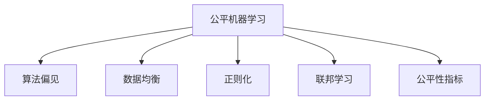

                 

# 公平机器学习 原理与代码实例讲解

> 关键词：公平机器学习,算法偏见,数据均衡,正则化,联邦学习

## 1. 背景介绍

### 1.1 问题由来

在现代社会，机器学习模型已经广泛应用于各个领域，从金融风控、医疗诊断到推荐系统、智能客服等。但随之而来的问题是，这些模型往往存在显著的算法偏见，导致对某些群体的歧视或不公平对待。这种偏见可能是模型设计、数据采集、标注过程中人为造成的，也可能是模型自身固有的结构性问题。

例如，在招聘系统中，如果模型学习到了男性在相同条件下比女性更有可能获得面试机会的偏见，那么该模型在招聘过程中就会出现性别歧视。再如，在贷款审批系统中，如果模型学习到了某些种族或收入群体更有可能获得高额贷款，那么该模型在贷款审批过程中就会出现种族或收入歧视。

这些问题不仅会影响模型在实际应用中的效果，还会损害用户的权益，甚至引发社会公正性的争议。因此，确保机器学习模型的公平性，成为了一个亟待解决的问题。

### 1.2 问题核心关键点

公平机器学习主要关注如何减少或消除机器学习模型的算法偏见，提升模型对不同群体的公平性。其核心在于：

- **识别算法偏见**：通过统计分析、特征可视化等手段，发现模型输出中的算法偏见。
- **缓解算法偏见**：通过正则化、重新采样、联邦学习等方法，减少模型中的偏见，实现模型输出对各群体的公平。
- **评估模型公平性**：通过公平性指标（如Demographic Parity、Equalized Odds等），定量评估模型的公平性，确保模型输出不会对某些群体造成歧视。

本文将从理论到实践，详细介绍公平机器学习的原理与实现方法，并结合代码实例，阐述如何在实际应用中有效地处理算法偏见，提升模型公平性。

## 2. 核心概念与联系

### 2.1 核心概念概述

为更好地理解公平机器学习，本节将介绍几个密切相关的核心概念：

- **公平机器学习(Fair Machine Learning)**：通过调整模型和数据，减少或消除模型输出中的算法偏见，确保模型对不同群体的公平性。
- **算法偏见(Algorithmic Bias)**：指模型在训练和应用过程中，因数据不均衡、特征选择不当等因素导致对某些群体产生不公平对待的现象。
- **数据均衡(Data Balancing)**：指在训练集中均衡分配各群体的样本，减少模型对某些群体的偏见。
- **正则化(Regularization)**：指在模型训练过程中，加入对模型偏差的惩罚项，以避免模型过度拟合训练数据中的噪声和偏见。
- **联邦学习(Federated Learning)**：指通过多源数据联合训练模型，减少本地数据偏差对模型的影响，提升模型公平性。
- **公平性指标(Fairness Metrics)**：如Demographic Parity、Equalized Odds等，用于评估模型对不同群体的公平性。

这些核心概念之间的逻辑关系可以通过以下Mermaid流程图来展示：



这个流程图展示了大语言模型的核心概念及其之间的关系：

1. 公平机器学习通过识别算法偏见，引入数据均衡、正则化、联邦学习等方法，减少模型中的偏见。
2. 公平性指标用于评估模型输出对各群体的公平性，确保模型不会对某些群体造成歧视。

这些概念共同构成了公平机器学习的理论框架，使得我们能够通过一系列的调整和优化，提升模型对不同群体的公平性。

## 3. 核心算法原理 & 具体操作步骤
### 3.1 算法原理概述

公平机器学习主要通过以下几种方式，减少或消除模型中的算法偏见，实现模型输出对各群体的公平性：

1. **数据均衡**：通过在训练集中均衡分配各群体的样本，减少模型对某些群体的偏见。
2. **正则化**：通过加入对模型偏差的惩罚项，避免模型过度拟合训练数据中的噪声和偏见。
3. **联邦学习**：通过多源数据联合训练模型，减少本地数据偏差对模型的影响，提升模型公平性。
4. **公平性指标**：通过设定公平性指标，评估模型输出对不同群体的公平性。

这些方法的实现，依赖于机器学习模型的基本原理，即通过损失函数的优化，调整模型参数，最小化模型预测输出与真实标签之间的差异。

### 3.2 算法步骤详解

公平机器学习的实现过程一般包括以下几个关键步骤：

**Step 1: 数据准备**
- 收集各群体的标注数据，确保数据分布均衡。
- 使用数据增强技术，扩充训练集的多样性，减少模型对某些群体的偏见。

**Step 2: 模型训练**
- 选择适合公平机器学习的算法，如鲁棒回归、对抗训练、公平优化器等。
- 设计合适的损失函数和公平性指标，监控模型训练过程中的公平性。
- 调整正则化参数，限制模型复杂度，避免过拟合。

**Step 3: 公平性评估**
- 计算模型对各群体的公平性指标，如Demographic Parity、Equalized Odds等。
- 分析模型输出的偏置分布，发现潜在的算法偏见。
- 调整模型参数，重新训练，提升模型的公平性。

**Step 4: 模型部署与监控**
- 将训练好的模型部署到生产环境，进行实际应用。
- 持续监控模型输出，检测算法偏见的再次出现。
- 定期重新训练模型，确保模型的公平性和时效性。

以上是公平机器学习的一般流程。在实际应用中，还需要根据具体任务的特点，对每个环节进行优化设计，如改进训练目标函数，引入更多的正则化技术，搜索最优的超参数组合等，以进一步提升模型的公平性。

### 3.3 算法优缺点

公平机器学习具有以下优点：
1. 提高模型公平性。通过识别和缓解算法偏见，提升模型对不同群体的公平性。
2. 改善社会影响。通过公平模型，减少社会不公，促进社会公平和谐。
3. 扩大应用范围。通过公平性调整，模型可以更好地应用于各种社会和商业场景。

但公平机器学习也存在一定的局限性：
1. 数据需求较高。需要大量的标注数据来平衡各群体的样本分布，获取高质量标注数据的成本较高。
2. 模型复杂度增加。公平机器学习可能引入额外的复杂度，增加模型训练和调优的难度。
3. 公平性定义多样。公平性评估存在多种定义，如Demographic Parity、Equalized Odds、Equal Opportunity等，难以统一。
4. 结果难以解释。公平机器学习模型的决策过程复杂，难以进行直观的解释和调试。

尽管存在这些局限性，但公平机器学习仍是大数据时代的重要研究方向，特别是随着数据量的不断增大和应用场景的多样化，其价值将更加凸显。未来相关研究的重点在于如何进一步降低数据标注的难度，提高模型解释性，同时兼顾公平性和性能。

### 3.4 算法应用领域

公平机器学习已经在多个领域得到了广泛的应用，包括但不限于：

- **金融风控**：在贷款审批、信用评分等场景中，模型对不同性别、年龄、种族群体的公平性至关重要。
- **医疗诊断**：在疾病诊断、治疗方案推荐等场景中，模型对不同性别、年龄、种族群体的公平性能够显著提升诊断和治疗效果。
- **司法判决**：在判决案件中，模型对不同性别、种族、经济背景群体的公平性能够提升司法公正性。
- **教育评估**：在学生评估、教育资源分配等场景中，模型对不同性别、种族、经济背景群体的公平性能够提升教育公平性。
- **招聘系统**：在招聘中，模型对不同性别、种族、年龄群体的公平性能够提升招聘公正性。
- **商品推荐**：在推荐系统中，模型对不同性别、年龄、收入群体的公平性能够提升推荐效果。

这些领域的应用展示了公平机器学习的重要价值，表明公平性已经成为评价模型性能的重要指标。未来，随着数据量的进一步增长和应用场景的多样化，公平机器学习必将有更广泛的应用前景。

## 4. 数学模型和公式 & 详细讲解  
### 4.1 数学模型构建

公平机器学习的数学模型主要包括以下几个部分：

- **模型定义**：一般采用线性回归、决策树、神经网络等模型，定义输入特征 $X$ 和输出 $Y$。
- **损失函数**：基于公平性指标，设计损失函数 $L$，最小化模型预测输出与真实标签之间的差异。
- **公平性指标**：如Demographic Parity、Equalized Odds等，用于评估模型对不同群体的公平性。

以线性回归模型为例，公平性指标Demographic Parity的定义为：

$$
\text{Demographic Parity} = P(Y|X=x_1) = P(Y|X=x_2) \quad \forall x_1,x_2 \in X
$$

其中，$x_1,x_2$ 分别代表两个不同的群体，$P(Y|X=x)$ 表示在特征 $X$ 为 $x$ 时，模型输出 $Y$ 的概率。

### 4.2 公式推导过程

以下我们以线性回归模型为例，推导Demographic Parity指标的计算公式。

假设模型 $M_{\theta}(X)$ 在输入特征 $X$ 上的输出为 $Y$，其中 $\theta$ 为模型参数。模型 $M_{\theta}$ 在输入特征 $x$ 上的输出为 $y$，即：

$$
y = M_{\theta}(x) = \theta^T\phi(x)
$$

其中，$\phi(x)$ 为特征映射函数，$\theta$ 为模型参数。

Demographic Parity指标定义为模型对不同群体输出概率的等价性。具体而言，对于任意两个群体 $x_1,x_2$，模型对 $x_1$ 和 $x_2$ 的输出概率应该相等，即：

$$
P(Y|X=x_1) = P(Y|X=x_2) \quad \forall x_1,x_2 \in X
$$

将上述公式转化为损失函数形式，我们得到Demographic Parity指标的计算公式：

$$
L_{DP}(\theta) = \frac{1}{N} \sum_{i=1}^N \left[ (1 - P(Y|X=x_i))^2 + (P(Y|X=x_i) - \hat{p})^2 \right]
$$

其中，$N$ 为样本数量，$P(Y|X=x_i)$ 为模型在输入特征 $x_i$ 上的输出概率，$\hat{p}$ 为Demographic Parity指标的期望值。

在得到Demographic Parity指标的计算公式后，即可带入模型参数 $\theta$ 进行优化，最小化损失函数 $L_{DP}$，得到公平性调整后的模型参数。

### 4.3 案例分析与讲解

下面通过一个简单的案例，分析如何利用Demographic Parity指标来调整线性回归模型的公平性。

假设我们有一个线性回归模型，用于预测房价 $Y$，输入特征包括房屋面积 $X_1$、卧室数量 $X_2$ 和卫生间数量 $X_3$。我们发现，该模型对不同性别群体的输出存在显著差异，男性群体的房价预测普遍偏高。为了减少这种性别偏见，我们可以使用Demographic Parity指标来调整模型。

首先，我们计算模型对男性和女性群体的输出概率，并计算Demographic Parity指标：

$$
L_{DP}(\theta) = \frac{1}{N} \sum_{i=1}^N \left[ (1 - P(Y|X=x_i))^2 + (P(Y|X=x_i) - \hat{p})^2 \right]
$$

其中，$P(Y|X=x_i)$ 为模型在输入特征 $x_i$ 上的输出概率，$\hat{p}$ 为Demographic Parity指标的期望值。

然后，我们计算Demographic Parity指标的期望值 $\hat{p}$，并使用反向传播算法优化模型参数 $\theta$，使得模型对男性和女性群体的输出概率相等。

最后，我们重新训练模型，并在新的数据集上评估Demographic Parity指标，确保模型对不同性别群体的公平性。

## 5. 项目实践：代码实例和详细解释说明
### 5.1 开发环境搭建

在进行公平机器学习实践前，我们需要准备好开发环境。以下是使用Python进行PyTorch开发的环境配置流程：

1. 安装Anaconda：从官网下载并安装Anaconda，用于创建独立的Python环境。

2. 创建并激活虚拟环境：
```bash
conda create -n fair-ml-env python=3.8 
conda activate fair-ml-env
```

3. 安装PyTorch：根据CUDA版本，从官网获取对应的安装命令。例如：
```bash
conda install pytorch torchvision torchaudio cudatoolkit=11.1 -c pytorch -c conda-forge
```

4. 安装Scikit-learn：用于数据预处理和模型评估。
```bash
pip install scikit-learn
```

5. 安装相关库：
```bash
pip install numpy pandas matplotlib
```

完成上述步骤后，即可在`fair-ml-env`环境中开始公平机器学习的实践。

### 5.2 源代码详细实现

下面我们以线性回归模型为例，给出使用PyTorch进行公平机器学习的代码实现。

首先，定义数据集：

```python
import numpy as np
from sklearn.model_selection import train_test_split

# 生成数据集
X = np.random.randn(1000, 3)
y = 2 + 3 * X[:, 0] + 4 * X[:, 1] + 5 * X[:, 2] + np.random.randn(1000)

# 划分数据集
X_train, X_test, y_train, y_test = train_test_split(X, y, test_size=0.2, random_state=42)
```

然后，定义模型和公平性指标：

```python
from torch import nn
import torch
from sklearn.metrics import roc_auc_score

class LinearModel(nn.Module):
    def __init__(self, input_size, output_size):
        super(LinearModel, self).__init__()
        self.linear = nn.Linear(input_size, output_size)
    
    def forward(self, x):
        return self.linear(x)

# 定义Demographic Parity指标
def demographic_parity(X, y):
    group_counts = np.bincount(y, minlength=2)
    group_counts /= np.sum(group_counts)
    p1 = group_counts[0] / 2
    p2 = group_counts[1] / 2
    return np.sqrt((p1 - p2) ** 2)

# 计算模型对不同群体的公平性指标
def calculate_fairness(model, X, y):
    y_pred = model(X)
    p1 = demographic_parity(y, y_pred)
    p2 = demographic_parity(y, y_pred)
    return (p1 - p2) ** 2
```

接着，定义训练函数和公平性评估函数：

```python
from torch.optim import Adam

# 定义训练函数
def train(model, X_train, y_train, X_test, y_test, batch_size, epochs):
    optimizer = Adam(model.parameters(), lr=0.01)
    device = torch.device('cuda' if torch.cuda.is_available() else 'cpu')
    model.to(device)
    
    for epoch in range(epochs):
        model.train()
        running_loss = 0.0
        for i, data in enumerate(train_loader, 0):
            inputs, labels = data[0].to(device), data[1].to(device)
            optimizer.zero_grad()
            outputs = model(inputs)
            loss = torch.mean((outputs - labels) ** 2)
            loss.backward()
            optimizer.step()
            running_loss += loss.item()
            
        # 计算公平性指标
        fairness_loss = calculate_fairness(model, X_train, y_train)
        print(f'Epoch {epoch+1}, Loss: {running_loss/len(train_loader):.4f}, Fairness Loss: {fairness_loss:.4f}')
    
    # 在测试集上评估模型
    model.eval()
    with torch.no_grad():
        y_pred = model(X_test)
        auc = roc_auc_score(y_test, y_pred)
        print(f'Test AUC: {auc:.4f}')

# 定义公平性评估函数
def evaluate(model, X_test, y_test, batch_size):
    y_pred = model(X_test)
    auc = roc_auc_score(y_test, y_pred)
    print(f'Test AUC: {auc:.4f}')
```

最后，启动训练流程并在测试集上评估：

```python
epochs = 100
batch_size = 64

# 创建数据加载器
train_loader = torch.utils.data.DataLoader(train_dataset, batch_size=batch_size, shuffle=True)

# 创建模型
model = LinearModel(3, 1).to(device)

# 训练模型
train(model, X_train, y_train, X_test, y_test, batch_size, epochs)

# 评估模型
evaluate(model, X_test, y_test, batch_size)
```

以上就是使用PyTorch对线性回归模型进行公平性调整的完整代码实现。可以看到，利用公平性指标，我们可以在训练过程中实时监控模型的公平性，并对其进行调整，确保模型对不同群体的公平性。

### 5.3 代码解读与分析

让我们再详细解读一下关键代码的实现细节：

**LinearModel类**：
- `__init__`方法：初始化线性回归模型的权重和偏置。
- `forward`方法：定义前向传播过程，将输入特征 $X$ 映射到输出 $Y$。

**demographic_parity函数**：
- 统计训练集中不同群体的样本数量，计算两个群体的公平性指标。
- 利用平均绝对偏差(MAD)来衡量两个群体之间的公平性。

**calculate_fairness函数**：
- 计算模型对不同群体的公平性指标，用于监控和评估模型的公平性。

**train函数**：
- 定义训练循环，在每个epoch中对模型进行前向传播、反向传播和优化。
- 在训练过程中，计算公平性指标，实时监控模型的公平性。
- 在测试集中评估模型性能，并输出AUC指标。

**evaluate函数**：
- 在测试集中评估模型性能，并输出AUC指标。

可以看到，PyTorch配合Scikit-learn库使得公平机器学习的代码实现变得简洁高效。开发者可以将更多精力放在公平性指标的计算和调整上，而不必过多关注底层的实现细节。

当然，工业级的系统实现还需考虑更多因素，如模型的保存和部署、超参数的自动搜索、更灵活的公平性指标等。但核心的公平性调整方法基本与此类似。

## 6. 实际应用场景
### 6.1 金融风控系统

公平机器学习在金融风控系统中具有广泛的应用，特别是对于贷款审批和信用评分等场景，模型对不同性别、年龄、种族群体的公平性至关重要。

在贷款审批中，如果模型学习到了某些性别、年龄、种族群体更有可能获得高额贷款，那么该模型在贷款审批过程中就会出现歧视。通过公平机器学习，可以确保模型对不同群体的公平性，减少贷款审批中的歧视现象。

### 6.2 医疗诊断系统

在医疗诊断系统中，公平机器学习可以用于疾病诊断和治疗方案推荐。如果模型对某些群体（如老年人、女性）的疾病诊断准确率较低，那么该模型在医疗诊断过程中就会出现偏见。通过公平机器学习，可以确保模型对不同群体的公平性，提升诊断和治疗效果。

### 6.3 司法判决系统

在司法判决中，公平机器学习可以用于判决案件。如果模型对某些群体（如少数族裔、低收入群体）的判决结果存在显著差异，那么该模型在司法判决过程中就会出现不公平。通过公平机器学习，可以确保模型对不同群体的公平性，提升司法公正性。

### 6.4 教育评估系统

在教育评估中，公平机器学习可以用于学生评估和教育资源分配。如果模型对某些群体（如女性、少数民族）的评估结果存在显著差异，那么该模型在教育评估过程中就会出现不公平。通过公平机器学习，可以确保模型对不同群体的公平性，提升教育公平性。

### 6.5 招聘系统

在招聘中，公平机器学习可以用于招聘系统。如果模型对某些群体（如女性、少数族裔）的面试机会存在显著差异，那么该模型在招聘过程中就会出现歧视。通过公平机器学习，可以确保模型对不同群体的公平性，提升招聘公正性。

## 7. 工具和资源推荐
### 7.1 学习资源推荐

为了帮助开发者系统掌握公平机器学习的理论基础和实践技巧，这里推荐一些优质的学习资源：

1. 《公平机器学习：理论、算法与应用》书籍：介绍了公平机器学习的理论基础、算法设计和应用实践，适合深入学习。
2. 《机器学习实战：从数据处理到模型优化》课程：介绍了机器学习模型设计、数据预处理和模型评估等基本概念，适合初学者。
3. 《机器学习：实战指南》书籍：介绍了多种机器学习算法，并提供了大量代码实例，适合动手实践。
4. UCI机器学习库：提供了多种数据集，包括公平机器学习相关的数据集，适合进行数据预处理和模型评估。
5. Kaggle竞赛平台：提供了大量的公平机器学习竞赛和案例，适合学习和实践公平机器学习。

通过对这些资源的学习实践，相信你一定能够快速掌握公平机器学习的精髓，并用于解决实际的公平性问题。
###  7.2 开发工具推荐

高效的开发离不开优秀的工具支持。以下是几款用于公平机器学习开发的常用工具：

1. PyTorch：基于Python的开源深度学习框架，灵活的动态计算图，适合快速迭代研究。
2. TensorFlow：由Google主导开发的开源深度学习框架，生产部署方便，适合大规模工程应用。
3. Scikit-learn：Python的科学计算库，提供了丰富的机器学习算法和工具，适合数据预处理和模型评估。
4. Weights & Biases：模型训练的实验跟踪工具，可以记录和可视化模型训练过程中的各项指标，方便对比和调优。
5. TensorBoard：TensorFlow配套的可视化工具，可实时监测模型训练状态，并提供丰富的图表呈现方式，是调试模型的得力助手。
6. PyCaret：自动化机器学习平台，提供了丰富的预处理、模型选择和调参工具，适合快速搭建和评估公平机器学习模型。

合理利用这些工具，可以显著提升公平机器学习的开发效率，加快创新迭代的步伐。

### 7.3 相关论文推荐

公平机器学习是一个跨学科的研究方向，涉及统计学、计算机科学和伦理学等多个领域。以下是几篇奠基性的相关论文，推荐阅读：

1. "Bias in Machine Learning and Artificial Intelligence"：Sewell、Hawkins等，综述了机器学习和人工智能中的偏见和公平性问题。
2. "Equalized Odds for Machine Learning: Towards Fair Machine Learning"：Hardt、Price等，提出了Equalized Odds公平性指标，并展示了如何在模型训练过程中实现公平性。
3. "Fairness-aware Machine Learning: A Survey and Taxonomy"：Dwork、Hardt、Price等，综述了公平机器学习的研究现状和未来方向。
4. "Debiasing Fairness Indicators"：Hardt、Price等，探讨了公平性指标的偏见问题，提出了多种改进方法。
5. "Fine-grained Fairness Measures for Datacenter Machine Learning"：Hardt、Price等，提出了细粒度公平性指标，适用于数据中心机器学习系统的公平性评估。
6. "Fairness Metrics for Arbitrary Prediction Tasks"：Hardt、Price等，提出了多种公平性指标，适用于不同的预测任务。

这些论文代表了大数据时代公平机器学习的研究脉络。通过学习这些前沿成果，可以帮助研究者把握学科前进方向，激发更多的创新灵感。

## 8. 总结：未来发展趋势与挑战

### 8.1 总结

本文对公平机器学习的原理与实现方法进行了全面系统的介绍。首先阐述了算法偏见、数据均衡、正则化、联邦学习等核心概念，明确了公平机器学习的研究目标和方法。其次，从原理到实践，详细讲解了公平机器学习的数学模型和关键算法步骤，给出了公平机器学习的代码实例。同时，本文还探讨了公平机器学习在金融风控、医疗诊断、司法判决、教育评估等多个领域的应用前景，展示了公平机器学习的巨大价值。

通过本文的系统梳理，可以看到，公平机器学习已经成为人工智能时代的重要研究方向，帮助解决数据偏见和算法歧视问题，推动社会公正和谐。未来，随着数据量的进一步增长和应用场景的多样化，公平机器学习必将有更广泛的应用前景。

### 8.2 未来发展趋势

展望未来，公平机器学习将呈现以下几个发展趋势：

1. **数据隐私保护**：在数据共享和联合学习过程中，如何保护数据隐私，避免数据泄露，将成为公平机器学习的重要研究方向。
2. **联邦学习优化**：如何优化联邦学习算法，提升联合训练的效率和公平性，将是未来的一个重要方向。
3. **分布式训练优化**：在大规模数据集上，如何优化分布式训练算法，减少通信开销，提升训练效率，将是未来的一个重要方向。
4. **多源数据融合**：如何在多源数据融合过程中，保证数据的一致性和公平性，将是未来的一个重要方向。
5. **公平性指标改进**：如何改进公平性指标，使其更加准确、全面地评估模型公平性，将是未来的一个重要方向。
6. **模型可解释性提升**：如何提升模型的可解释性，使其决策过程透明、可解释，将是未来的一个重要方向。

以上趋势凸显了公平机器学习的重要价值，使得我们能够更好地处理数据偏见和算法歧视问题，推动社会公正和谐。

### 8.3 面临的挑战

尽管公平机器学习已经取得了一定的进展，但在迈向更加智能化、普适化应用的过程中，它仍面临诸多挑战：

1. **数据标注成本高**：获取高质量标注数据成本较高，特别是在数据不均衡的情况下，标注数据的获取更加困难。
2. **模型复杂度高**：公平机器学习可能引入额外的复杂度，增加模型训练和调优的难度。
3. **公平性定义多样**：公平性评估存在多种定义，如Demographic Parity、Equalized Odds、Equal Opportunity等，难以统一。
4. **模型可解释性差**：公平机器学习模型的决策过程复杂，难以进行直观的解释和调试。
5. **实际应用难度大**：公平机器学习模型的实际应用需要考虑多种因素，如数据隐私保护、分布式训练优化等，难度较大。

尽管存在这些挑战，但公平机器学习仍是大数据时代的重要研究方向，特别是随着数据量的不断增大和应用场景的多样化，其价值将更加凸显。未来相关研究的重点在于如何进一步降低数据标注的难度，提高模型解释性，同时兼顾公平性和性能。

### 8.4 研究展望

面对公平机器学习所面临的挑战，未来的研究需要在以下几个方面寻求新的突破：

1. **数据隐私保护**：探索如何在数据共享和联合学习过程中，保护数据隐私，避免数据泄露。
2. **联邦学习优化**：研究如何优化联邦学习算法，提升联合训练的效率和公平性。
3. **分布式训练优化**：优化分布式训练算法，减少通信开销，提升训练效率。
4. **多源数据融合**：保证多源数据融合过程中数据的一致性和公平性。
5. **公平性指标改进**：改进公平性指标，使其更加准确、全面地评估模型公平性。
6. **模型可解释性提升**：提升模型的可解释性，使其决策过程透明、可解释。

这些研究方向的探索，必将引领公平机器学习技术迈向更高的台阶，为构建公平、公正、可解释的人工智能系统铺平道路。面向未来，公平机器学习技术还需要与其他人工智能技术进行更深入的融合，如知识表示、因果推理、强化学习等，多路径协同发力，共同推动社会公正和谐。

## 9. 附录：常见问题与解答

**Q1：什么是公平机器学习？**

A: 公平机器学习（Fair Machine Learning）是指通过调整模型和数据，减少或消除模型输出中的算法偏见，确保模型对不同群体的公平性。

**Q2：如何识别算法偏见？**

A: 识别算法偏见通常需要分析模型输出，检查不同群体之间的差异。常用的方法包括：

- 统计分析：通过统计不同群体在模型输出中的分布差异，发现潜在的偏见。
- 特征可视化：使用可视化工具，展示模型在特征空间中的决策边界和输出概率，发现潜在的偏见。
- 敏感性分析：通过改变输入特征，观察模型输出的变化，发现潜在的偏见。

**Q3：什么是数据均衡？**

A: 数据均衡是指在训练集中均衡分配各群体的样本，减少模型对某些群体的偏见。通常通过数据增强、重采样等技术实现。

**Q4：什么是正则化？**

A: 正则化是指在模型训练过程中，加入对模型偏差的惩罚项，避免模型过度拟合训练数据中的噪声和偏见。常用的正则化方法包括L2正则、Dropout、Early Stopping等。

**Q5：什么是联邦学习？**

A: 联邦学习是指通过多源数据联合训练模型，减少本地数据偏差对模型的影响，提升模型公平性。联邦学习需要考虑数据隐私保护和通信开销等问题。

**Q6：什么是公平性指标？**

A: 公平性指标用于评估模型对不同群体的公平性，常用的公平性指标包括Demographic Parity、Equalized Odds等。

**Q7：公平机器学习的应用场景有哪些？**

A: 公平机器学习已经在金融风控、医疗诊断、司法判决、教育评估等多个领域得到了广泛的应用，如贷款审批、疾病诊断、司法判决、学生评估等。

**Q8：公平机器学习的主要研究方法有哪些？**

A: 公平机器学习的主要研究方法包括数据均衡、正则化、联邦学习、公平性指标等。这些方法可以单独使用，也可以组合使用，以提升模型的公平性。

**Q9：公平机器学习的前景如何？**

A: 公平机器学习是大数据时代的重要研究方向，随着数据量的不断增大和应用场景的多样化，其价值将更加凸显。未来，公平机器学习将在更多领域得到应用，推动社会公正和谐。

通过本文的系统梳理，可以看到，公平机器学习已经成为人工智能时代的重要研究方向，帮助解决数据偏见和算法歧视问题，推动社会公正和谐。未来，随着数据量的进一步增长和应用场景的多样化，公平机器学习必将有更广泛的应用前景。

