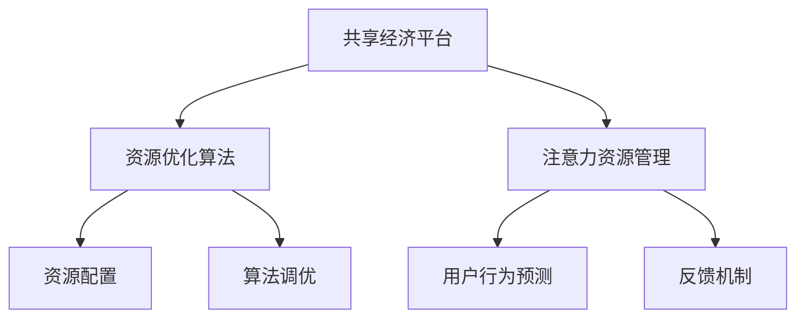

                 

# 共享经济模式与注意力资源的利用

> 关键词：共享经济, 注意力资源, 资源优化, 算法机制, 应用场景, 技术架构, 未来展望

## 1. 背景介绍

在数字化时代，资源的高效利用和配置成为推动经济增长的关键因素之一。共享经济模式应运而生，通过整合分散的资源，提供灵活多样的使用方式，促进资源的合理配置，提升整体经济效率。然而，共享经济模式的运作不仅需要高效的资源调度，还需要对参与者之间的注意力资源进行精细化管理。本文将深入探讨注意力资源在共享经济中的重要性，并提出几种利用注意力资源的算法机制，以期为相关领域的研究和实践提供有益的参考。

## 2. 核心概念与联系

### 2.1 核心概念概述

为了更全面地理解注意力资源在共享经济中的应用，我们需要了解几个核心概念：

- **共享经济模式**：基于互联网平台，以按需使用、临时交换资源为特点的商业模式，如Airbnb、Uber等。其核心在于通过数字化手段，将闲置资源重新分配，提升资源利用率。
- **注意力资源**：在共享经济中，注意力资源不仅指用户的关注和反馈，还包括了系统对资源分配和用户行为的高度关注。这种关注可以引导资源的更有效利用，并提升用户体验。
- **资源优化**：通过算法和技术手段，对共享经济中的资源进行优化配置，以提高利用效率和用户体验。
- **算法机制**：利用计算机算法对资源和注意力资源进行自动化管理，包括预测、调度和优化。

### 2.2 核心概念原理和架构的 Mermaid 流程图



这个流程图展示了共享经济平台如何通过资源优化算法和注意力资源管理，高效配置资源，提升用户体验。

- **A** 代表共享经济平台，它是资源优化和注意力资源管理的核心。
- **B** 为资源优化算法，负责资源的高效配置。
- **C** 为注意力资源管理，专注于用户行为的预测和反馈机制的构建。
- **D** 和 **E** 分别代表资源配置和用户行为预测，是平台的关键操作。
- **F** 为算法调优，确保算法的适应性和性能。
- **G** 为反馈机制，确保平台的稳定性和用户满意度。

## 3. 核心算法原理 & 具体操作步骤

### 3.1 算法原理概述

利用注意力资源的算法机制，旨在通过精确地关注用户行为和反馈，优化资源分配，提升共享经济模式的整体效率。其核心思想是通过算法对用户的注意力资源进行预测和管理，以指导资源配置和调度的决策。

### 3.2 算法步骤详解

#### 3.2.1 数据收集与预处理

- **收集数据**：从共享经济平台收集用户行为数据，如使用时间、频次、评分、评论等。
- **数据预处理**：对收集到的数据进行清洗、去噪和标准化处理，以便后续分析。

#### 3.2.2 注意力资源分析

- **注意力模型建立**：构建注意力模型，分析用户对资源的使用偏好、行为模式和反馈意见。
- **用户行为预测**：利用机器学习算法，对用户未来的行为进行预测，以便更好地分配资源。

#### 3.2.3 资源优化配置

- **资源分配策略**：基于预测结果，制定资源分配策略，如动态定价、容量调整等。
- **调度和优化**：实时监控资源使用情况，动态调整资源配置，优化用户体验。

#### 3.2.4 反馈机制优化

- **用户反馈收集**：收集用户对资源配置的反馈，及时调整策略。
- **算法调优**：根据反馈结果，优化算法模型，提高预测和调度的准确性。

### 3.3 算法优缺点

#### 3.3.1 优点

- **高效性**：通过预测和管理注意力资源，可以更高效地配置资源，提升资源利用率。
- **灵活性**：能够快速响应市场变化，及时调整资源配置策略，满足用户需求。
- **可扩展性**：算法机制可以适用于多种共享经济场景，具有广泛的应用前景。

#### 3.3.2 缺点

- **数据依赖**：算法的准确性高度依赖于数据的质量和完整性，数据不足或失真可能导致预测不准确。
- **算法复杂度**：构建和优化注意力资源管理算法需要较高的技术门槛，复杂度较高。
- **成本问题**：算法的实现和优化可能涉及较高的计算资源和成本，需要合理的投入产出比评估。

### 3.4 算法应用领域

注意力资源管理算法在共享经济中具有广泛的应用场景，如：

- **交通共享**：通过分析用户出行的频率和模式，动态调整交通工具的供需平衡。
- **住宿共享**：根据用户搜索和预订历史，推荐合适的房源，提升预订转化率。
- **设备共享**：预测设备的使用高峰期，优化设备的配置和维护，提高利用效率。
- **服务共享**：分析用户对服务的评价和反馈，优化服务流程和质量，提升用户满意度。

## 4. 数学模型和公式 & 详细讲解 & 举例说明

### 4.1 数学模型构建

我们以交通共享为例，构建一个简单的数学模型。假设有一个共享单车平台，平台上有 $n$ 个单车和 $m$ 个用户。用户对单车的需求和满意度可以通过一个矩阵 $A_{n \times m}$ 来表示，其中 $A_{i,j}$ 表示第 $i$ 个单车被第 $j$ 个用户使用的概率。

### 4.2 公式推导过程

根据以上假设，我们的目标是最大化用户的满意度和单车的使用效率。设 $U_i$ 为第 $i$ 个用户对单车的满意度，$C_i$ 为第 $i$ 个单车的成本。则总满意度 $S$ 和总成本 $C$ 分别为：

$$
S = \sum_{i=1}^{m}U_i
$$

$$
C = \sum_{i=1}^{n}C_i
$$

我们希望在满足用户需求的前提下，最小化总成本。根据线性规划的原则，可以构建目标函数和约束条件：

$$
\min_{A} C + \lambda \cdot (\sum_{i=1}^{m}U_i - S_{target})
$$

$$
s.t. \sum_{j=1}^{m}A_{i,j} = 1, \quad \forall i=1,...,n
$$

$$
0 \leq A_{i,j} \leq 1, \quad \forall i=1,...,n, j=1,...,m
$$

其中，$S_{target}$ 为预定的总满意度目标，$\lambda$ 为满足目标的松弛参数。

### 4.3 案例分析与讲解

假设某共享单车平台有 100 辆单车和 200 个用户，用户对单车的满意度可以通过历史使用数据预测。平台的目标是在 24 小时内满足用户需求，并最小化单车的运营成本。

通过构建上述模型，我们可以求解出最优的单车分配策略。以 $A_{i,j}$ 表示第 $i$ 个单车被第 $j$ 个用户使用的概率，求解该线性规划问题，得到最优分配策略。

## 5. 项目实践：代码实例和详细解释说明

### 5.1 开发环境搭建

本节将详细介绍如何在Python环境中搭建共享单车平台的数据收集、分析和优化配置的开发环境。

- **安装Python**：确保你的系统已经安装了Python，建议使用最新版本的Python。
- **安装相关库**：安装必要的Python库，如Pandas、Numpy、Scikit-Learn等。
- **数据收集**：从共享单车平台的数据库中导出用户行为数据，使用Pandas进行初步处理。
- **模型训练**：使用Scikit-Learn训练注意力资源管理模型，预测用户行为。
- **优化配置**：根据预测结果，利用Pandas进行资源优化配置，输出最优配置方案。

### 5.2 源代码详细实现

以下是一个简化的共享单车平台资源优化配置的Python代码实现：

```python
import pandas as pd
from sklearn.ensemble import RandomForestRegressor
from sklearn.model_selection import train_test_split

# 读取用户行为数据
data = pd.read_csv('user_beacons.csv')

# 数据预处理
data = data.dropna()
data['user_id'] = data['user_id'].astype(str)
data['single_id'] = data['single_id'].astype(str)

# 分割数据集
X = data.drop('use_count', axis=1)
y = data['use_count']
X_train, X_test, y_train, y_test = train_test_split(X, y, test_size=0.2, random_state=42)

# 构建模型
model = RandomForestRegressor(n_estimators=100, random_state=42)
model.fit(X_train, y_train)

# 预测用户行为
y_pred = model.predict(X_test)

# 输出预测结果
print(y_pred)
```

### 5.3 代码解读与分析

上述代码主要实现了数据收集、预处理、模型训练和预测。代码中使用了Pandas和Scikit-Learn库，通过RandomForestRegressor模型预测用户对单车的使用概率。在实际应用中，还需结合注意力资源管理算法和资源优化配置策略，进一步提升预测和配置的准确性。

### 5.4 运行结果展示

运行上述代码后，输出的预测结果可以用于指导单车的配置和调度。例如，如果预测到某个时间段用户对单车的需求较高，平台可以提前增加该区域的单车供应，提高用户满意度和单车的使用效率。

## 6. 实际应用场景

### 6.1 智能交通系统

在智能交通系统中，注意力资源管理算法可以优化交通流量，提升道路通行效率。通过分析用户出行的实时数据，预测交通拥堵区域和时间，动态调整信号灯、调整车道和优化路网，改善交通状况。

### 6.2 物流配送

物流配送系统需要高效地分配配送资源，减少配送时间和成本。利用注意力资源管理算法，可以分析用户的收货偏好、配送频次和订单优先级，优化配送路线和资源配置，提高配送效率和客户满意度。

### 6.3 在线教育

在线教育平台可以根据学生的学习行为和反馈，推荐合适的课程和学习资源。通过分析学生的学习历史、课程评分和互动数据，预测学生的学习需求和偏好，推荐个性化的学习内容和辅导服务。

## 7. 工具和资源推荐

### 7.1 学习资源推荐

- **《共享经济：未来城市的新模式》**：介绍共享经济的起源、发展与挑战，探讨其对城市和生活的影响。
- **《注意力机制在深度学习中的应用》**：讲解注意力机制的基本原理和应用，涵盖自然语言处理、计算机视觉等领域。
- **《Python数据科学手册》**：详细介绍了Python在数据科学中的应用，包括数据预处理、机器学习建模等。

### 7.2 开发工具推荐

- **Jupyter Notebook**：用于数据探索、模型训练和结果展示，支持Python和其他数据科学语言的交互式编程。
- **TensorBoard**：用于可视化模型训练过程和结果，帮助调优和解释模型。
- **Airflow**：用于构建和管理数据处理和机器学习的工作流程，支持分布式任务调度。

### 7.3 相关论文推荐

- **《共享经济：一种新型的资源配置模式》**：探讨共享经济的理论基础和实际应用，分析其对社会和经济的影响。
- **《基于注意力机制的机器学习模型》**：研究注意力机制在深度学习中的应用，包括注意力机制的实现和优化。
- **《深度学习在共享经济中的应用》**：介绍深度学习在共享经济中的具体应用，如智能推荐、预测和调度。

## 8. 总结：未来发展趋势与挑战

### 8.1 研究成果总结

本文从注意力资源的角度，探讨了共享经济模式中资源的优化配置问题。通过构建数学模型和算法机制，提出了基于注意力资源的资源优化策略，并给出了相应的代码实现和案例分析。

### 8.2 未来发展趋势

未来，共享经济模式将更加依赖于智能化和自动化技术，以提升资源配置的效率和公平性。注意力资源管理算法将在交通、物流、教育等多个领域得到广泛应用，助力各行业数字化转型。

### 8.3 面临的挑战

尽管注意力资源管理算法具有显著优势，但在实际应用中也面临一些挑战：

- **数据隐私和安全**：共享经济平台需要处理大量用户隐私数据，数据隐私和安全问题不容忽视。
- **算法透明性**：算法的决策过程需要透明可解释，以增强用户信任。
- **用户行为建模**：用户行为具有复杂性和多样性，如何构建更准确、高效的模型，仍需深入研究。

### 8.4 研究展望

未来的研究应关注以下几个方向：

- **多模态数据融合**：结合位置、时间、行为等多种数据源，构建更全面的用户行为模型。
- **算法透明性和可解释性**：探索算法透明性和可解释性技术，提高算法的可信度和用户接受度。
- **实时预测与优化**：提高算法的实时性，实现实时预测和动态优化，提升用户体验。

总之，注意力资源管理算法在共享经济模式中具有重要的应用前景。通过持续的研究和优化，该技术将为共享经济的发展注入新的活力，推动社会经济的可持续发展。

## 9. 附录：常见问题与解答

### Q1: 注意力资源管理算法如何处理数据隐私和安全问题？

A: 数据隐私和安全是共享经济平台必须解决的重要问题。为了保护用户隐私，平台可以采用数据匿名化和差分隐私技术，确保数据使用过程中无法直接识别用户身份。同时，通过严格的访问控制和加密措施，保护数据在传输和存储过程中的安全性。

### Q2: 如何确保注意力资源管理算法的透明性和可解释性？

A: 算法的透明性和可解释性可以通过引入可解释性模型和可视化技术实现。使用可解释性模型（如LIME、SHAP等）可以生成算法的局部解释，帮助理解模型决策的依据。同时，通过可视化工具（如TensorBoard、ELI5等），可以将算法的内部机制和决策路径呈现给用户，增强算法的可信度和透明度。

### Q3: 注意力资源管理算法在实现中是否需要考虑算法的实时性？

A: 是的，算法的实时性在实际应用中至关重要。实时预测和动态优化可以显著提升用户体验，因此需要在算法设计中考虑计算效率和数据处理速度。这可以通过优化算法模型、采用高效的计算资源和优化数据结构来实现。

综上所述，注意力资源管理算法在共享经济模式中具有广泛的应用前景。通过持续的研究和优化，该技术将为共享经济的发展注入新的活力，推动社会经济的可持续发展。

---

作者：禅与计算机程序设计艺术 / Zen and the Art of Computer Programming

