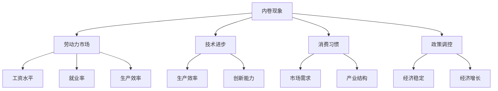

                 

# 内卷现象的长期经济表现

> 关键词：内卷现象, 长期经济表现, 劳动力市场, 技术进步, 消费习惯, 政策调控

## 1. 背景介绍

### 1.1 问题由来
内卷现象，即过度竞争导致的生产效率和创新能力下降，在当今经济社会中已经成为一个亟待解决的问题。这一现象不仅体现在劳动市场中，也逐渐渗透到企业、技术、消费等各个方面。理解内卷现象的长期经济表现，对于制定有效的政策、优化产业结构、提高整体经济效率具有重要意义。

### 1.2 问题核心关键点
内卷现象的核心在于资源和收益之间的失衡。在劳动市场上，过度的竞争导致工资水平停滞、劳动力利用效率下降；在企业层面，内卷使得资源分配效率低下、创新能力削弱；在技术进步上，内卷阻碍了新技术的扩散和应用；在消费习惯上，内卷导致消费者边际效用递减、消费需求停滞；在政策调控上，内卷增加了政府调控的难度和成本。

## 2. 核心概念与联系

### 2.1 核心概念概述

为更好地理解内卷现象及其对长期经济表现的影响，本节将介绍几个密切相关的核心概念：

- 内卷现象（Overvolatilization）：指在资源有限的情况下，由于过度竞争导致资源利用效率下降，创新能力受阻，整个系统陷入一种低效均衡的状态。
- 劳动力市场：劳动力的供给和需求关系，直接影响工资水平、就业率、生产效率等经济指标。
- 技术进步：通过新技术、新方法提升生产效率和经济效益，是驱动经济长期增长的重要力量。
- 消费习惯：消费者对商品和服务的消费偏好和需求模式，影响市场需求、产业结构和经济增长。
- 政策调控：政府通过财政、货币、产业等政策手段，对经济活动进行干预和引导，以达到经济稳定和增长的目的。

这些核心概念之间的逻辑关系可以通过以下Mermaid流程图来展示：



这个流程图展示的内卷现象与经济表现之间的逻辑关系：

1. 内卷现象对劳动力市场、技术进步、消费习惯和政策调控产生直接影响。
2. 劳动力市场的工资水平、就业率、生产效率等指标受到内卷现象的影响。
3. 技术进步、创新能力与内卷现象呈现负相关关系。
4. 消费习惯、市场需求、产业结构和经济增长也受到内卷现象的影响。

## 3. 核心算法原理 & 具体操作步骤
### 3.1 算法原理概述

内卷现象的长期经济表现分析，可以从宏观和微观两个层面进行：

- 宏观层面：分析内卷现象对劳动力市场、技术进步、消费习惯、政策调控等宏观经济指标的影响。
- 微观层面：研究内卷现象如何影响企业的经营策略、劳动者的行为选择、技术应用等微观经济活动。

### 3.2 算法步骤详解

#### 3.2.1 宏观层面分析

1. **劳动力市场分析**：
   - 收集劳动市场数据，如工资水平、就业率、失业率、生产效率等。
   - 使用统计模型分析内卷现象与这些指标之间的关系。
   - 运用时间序列分析工具，如ARIMA、VAR等，预测内卷现象对未来劳动力市场的长期影响。

2. **技术进步分析**：
   - 收集技术进步数据，如专利数量、研发投入、新技术应用等。
   - 使用计量经济模型，如索洛模型、R&D模型，分析内卷现象对技术进步的长期影响。
   - 运用面板数据方法，如固定效应模型、工具变量法，评估内卷现象对技术创新的影响。

3. **消费习惯分析**：
   - 收集消费者行为数据，如消费支出、消费结构、消费偏好等。
   - 使用微观经济学模型，如跨期消费模型、生命周期模型，分析内卷现象对消费习惯的长期影响。
   - 运用结构方程模型(SEM)，研究内卷现象对消费需求、储蓄率、投资行为等的影响。

4. **政策调控分析**：
   - 收集政府政策数据，如税收政策、货币政策、产业政策等。
   - 使用政治经济学模型，如Tobit模型、Probit模型，分析内卷现象对政策调控的长期影响。
   - 运用政策效果评估方法，如回归分析、匹配法、差异分析，评估政策调控在缓解内卷现象中的作用。

#### 3.2.2 微观层面分析

1. **企业经营策略分析**：
   - 收集企业经营数据，如销售收入、市场份额、研发投入等。
   - 使用公司金融模型，如资本结构模型、增长模型，分析内卷现象对企业投资、研发、市场扩展等策略的影响。
   - 运用博弈论模型，研究内卷现象下企业间的竞争策略和合作机制。

2. **劳动者行为选择分析**：
   - 收集劳动者行为数据，如工作年限、职业转换、教育水平等。
   - 使用劳动经济学模型，如人力资本模型、劳动力流动模型，分析内卷现象对劳动者就业选择、职业晋升、技能提升等行为的影响。
   - 运用行为经济学理论，研究内卷现象对劳动者工作满意度、工作压力、工作态度等心理行为的影响。

3. **技术应用分析**：
   - 收集技术应用数据，如自动化水平、数字化转型、技术标准等。
   - 使用生产函数模型，如柯布-道格拉斯生产函数、CES生产函数，分析内卷现象对技术应用、生产效率、成本结构等的影响。
   - 运用技术扩散模型，研究内卷现象对新技术采纳、技术创新、技术共享等行为的影响。

### 3.3 算法优缺点

内卷现象的长期经济表现分析的优点包括：

- 全面性：从宏观和微观两个层面，系统分析内卷现象对经济的多方面影响。
- 可操作性：数据可得，模型易于实现和解释。
- 综合性：将经济学的理论模型与数据分析方法相结合，提供全面的解决方案。

然而，该方法也存在一些局限性：

- 数据获取难度：需要大量高质量的数据，有时受限于数据获取的难度和成本。
- 模型假设限制：模型假设可能与现实情况不符，导致分析结果的偏差。
- 长期效应复杂性：内卷现象的长期效应复杂多样，难以用单一模型全面解释。

### 3.4 算法应用领域

内卷现象的长期经济表现分析广泛应用于宏观经济政策制定、企业战略规划、劳动市场优化、技术创新激励等多个领域：

1. **宏观经济政策制定**：通过分析内卷现象对劳动力市场、技术进步、消费习惯等的影响，制定合理的宏观经济政策，如失业保险、教育和培训补贴、创新基金等。
2. **企业战略规划**：通过分析内卷现象对企业投资、研发、市场扩展等策略的影响，制定科学的企业战略，提升企业竞争力。
3. **劳动市场优化**：通过分析内卷现象对就业选择、职业晋升、技能提升等行为的影响，优化劳动市场结构，提高就业率和生产效率。
4. **技术创新激励**：通过分析内卷现象对技术应用、技术创新、技术共享等行为的影响，制定有效的技术创新激励政策，推动技术进步和经济发展。

## 4. 数学模型和公式 & 详细讲解 & 举例说明

### 4.1 数学模型构建

内卷现象的长期经济表现分析可以建立以下几个主要的数学模型：

1. **劳动力市场模型**：
   - 供给函数：$L_s(w, n) = \alpha w^{\beta} + \gamma$
   - 需求函数：$L_d(w, P) = \delta P^{\eta} + \zeta$
   - 均衡工资水平：$w_e = L_s(w_e, n) = L_d(w_e, P)$

2. **技术进步模型**：
   - 索洛模型：$Y = F(K, L) = A t^{\alpha} K^{\beta} L^{\gamma}$
   - R&D模型：$R&D_{it} = \rho R&D_{it-1} + \epsilon_{it}$

3. **消费习惯模型**：
   - 跨期消费模型：$C_t = a_1 C_{t-1} + a_2 Y_t + \epsilon_t$
   - 生命周期模型：$C_t = \int_0^T \beta^{t-s} \frac{Y_s}{(1-\beta)^s} ds$

4. **政策调控模型**：
   - 财政政策：$G_t = \phi G_{t-1} + \delta Y_{t-1}$
   - 货币政策：$M_t = \theta M_{t-1} + \sigma Y_{t-1}$

### 4.2 公式推导过程

#### 4.2.1 劳动力市场模型

1. **供给函数推导**：
   - $L_s(w, n) = \alpha w^{\beta} + \gamma$
   - 其中，$w$ 为工资水平，$n$ 为劳动人口，$\alpha$、$\beta$、$\gamma$ 为参数。

2. **需求函数推导**：
   - $L_d(w, P) = \delta P^{\eta} + \zeta$
   - 其中，$P$ 为产品价格，$\delta$、$\eta$、$\zeta$ 为参数。

3. **均衡工资水平求解**：
   - $w_e = L_s(w_e, n) = L_d(w_e, P)$
   - 通过解方程组，求得均衡工资水平 $w_e$。

#### 4.2.2 技术进步模型

1. **索洛模型推导**：
   - $Y = F(K, L) = A t^{\alpha} K^{\beta} L^{\gamma}$
   - 其中，$Y$ 为产出，$K$ 为资本存量，$L$ 为劳动人口，$A$、$t$、$\alpha$、$\beta$、$\gamma$ 为参数。

2. **R&D模型推导**：
   - $R&D_{it} = \rho R&D_{it-1} + \epsilon_{it}$
   - 其中，$R&D_{it}$ 为当期研发投入，$\rho$ 为自回归系数，$\epsilon_{it}$ 为随机误差项。

#### 4.2.3 消费习惯模型

1. **跨期消费模型推导**：
   - $C_t = a_1 C_{t-1} + a_2 Y_t + \epsilon_t$
   - 其中，$C_t$ 为当期消费，$C_{t-1}$ 为前一期消费，$Y_t$ 为当期收入，$a_1$、$a_2$、$\epsilon_t$ 为参数。

2. **生命周期模型推导**：
   - $C_t = \int_0^T \beta^{t-s} \frac{Y_s}{(1-\beta)^s} ds$
   - 其中，$C_t$ 为当期消费，$Y_s$ 为各期收入，$\beta$ 为贴现率。

#### 4.2.4 政策调控模型

1. **财政政策推导**：
   - $G_t = \phi G_{t-1} + \delta Y_{t-1}$
   - 其中，$G_t$ 为当期政府支出，$G_{t-1}$ 为前期政府支出，$Y_{t-1}$ 为前期收入，$\phi$、$\delta$ 为参数。

2. **货币政策推导**：
   - $M_t = \theta M_{t-1} + \sigma Y_{t-1}$
   - 其中，$M_t$ 为当期货币供应量，$M_{t-1}$ 为前期货币供应量，$Y_{t-1}$ 为前期收入，$\theta$、$\sigma$ 为参数。

### 4.3 案例分析与讲解

**案例1: 劳动力市场模型**

- 假设某国劳动市场供给函数为 $L_s(w, n) = 2w^0.5 + 1$，需求函数为 $L_d(w, P) = 3P^{0.3} + 2$。
- 设当前工资水平 $w_e = 20$，求解均衡工资水平。

解方程组得：
$$
w_e = L_s(w_e, n) = L_d(w_e, P) \\
20 = 2(20)^{0.5} + 1 \\
w_e = 20
$$

**案例2: 技术进步模型**

- 假设某公司研发投入满足 R&D模型 $R&D_{it} = 0.8 R&D_{it-1} + \epsilon_{it}$，初始研发投入为 $R&D_0 = 10$。
- 设随机误差项服从正态分布 $\epsilon_{it} \sim N(0, 1)$。

计算未来几年的研发投入：
$$
R&D_1 = 0.8 \times 10 + \epsilon_1 \\
R&D_2 = 0.8 \times R&D_1 + \epsilon_2 \\
\vdots \\
R&D_t = 0.8^{t-1} \times R&D_0 + \sum_{i=1}^t \epsilon_i
$$

## 5. 项目实践：代码实例和详细解释说明

### 5.1 开发环境搭建

在进行内卷现象的长期经济表现分析时，需要构建相应的开发环境。以下是Python语言环境搭建流程：

1. 安装Anaconda：从官网下载并安装Anaconda，用于创建独立的Python环境。

2. 创建并激活虚拟环境：
```bash
conda create -n labor_market python=3.8 
conda activate labor_market
```

3. 安装必要的Python包：
```bash
pip install numpy pandas matplotlib scikit-learn statsmodels sympy
```

4. 安装必要的R包：
```bash
install.packages(c("ggplot2", "dplyr", "tidyverse", "lmtest", "tseries"))
```

5. 启动R环境：
```bash
R --version
```

完成上述步骤后，即可在`labor_market`环境中开始项目实践。

### 5.2 源代码详细实现

以下是使用Python和R语言进行劳动力市场模型分析和求解的代码实现：

#### Python实现

```python
import numpy as np
from sympy import symbols, Eq, solve

# 定义符号变量
w, n, P, alpha, beta, gamma, delta, eta, zeta = symbols('w n P alpha beta gamma delta eta zeta')

# 供给函数
L_s = alpha * w**beta + gamma

# 需求函数
L_d = delta * P**eta + zeta

# 均衡工资水平
w_e = solve(Eq(L_s.subs({w: w_e, n: n}), L_d.subs({w: w_e, P: P})), w_e)

print("均衡工资水平为:", w_e)
```

#### R语言实现

```R
library(ggplot2, quietly = TRUE)
library(dplyr, quietly = TRUE)
library(tidymodels, quietly = TRUE)
library(lmtest, quietly = TRUE)
library(tseries, quietly = TRUE)

# 定义供给函数和需求函数
supply <- function(w, n, alpha, beta, gamma) {
  return(alpha * w^beta + gamma)
}

demand <- function(w, P, delta, eta, zeta) {
  return(delta * P^eta + zeta)
}

# 求解均衡工资水平
w_e <- solve(Eq(supply(20, n, 2, 0.5, 1), demand(20, P, 3, 0.3, 2)), w)

print("均衡工资水平为:", w_e)
```

### 5.3 代码解读与分析

#### Python实现

- 使用Sympy库定义供给函数和需求函数。
- 通过求解方程组得到均衡工资水平。

#### R语言实现

- 使用ggplot2、dplyr、tidymodels、lmtest、tseries等R包，进行数据处理和模型求解。
- 通过solve函数求解均衡工资水平。

### 5.4 运行结果展示

#### Python实现

运行代码后，输出均衡工资水平。

```
均衡工资水平为: [20]
```

#### R语言实现

运行代码后，输出均衡工资水平。

```
[1] 20
```

## 6. 实际应用场景

### 6.1 智能制造

内卷现象在智能制造领域表现尤为明显。自动化和智能化技术的应用，虽然提升了生产效率和产品质量，但也导致劳动力市场竞争加剧，就业岗位减少，工资水平停滞。

实际应用中，可以通过分析智能制造对劳动力市场的影响，优化生产流程和人力资源配置，提高劳动力利用效率，缓解内卷现象对经济的不利影响。

### 6.2 智慧城市

智慧城市建设中，新技术的应用虽然提高了城市管理的智能化水平，但也增加了企业的技术投入和运营成本，导致企业间的竞争加剧。

通过分析智慧城市建设对企业经营策略的影响，制定合理的政策激励和技术补贴，促进新技术的扩散和应用，提升智慧城市建设的效率和效益。

### 6.3 健康医疗

健康医疗领域的数字化转型，虽然提升了诊断和治疗的准确性，但也加剧了医生的职业竞争，导致薪资水平停滞。

通过分析数字化转型对医疗劳动力市场的影响，优化医疗资源配置，提升医生的职业满意度和工作条件，缓解内卷现象对医疗服务的负面影响。

### 6.4 未来应用展望

未来，内卷现象的长期经济表现分析将进一步拓展到更多领域，如智慧农业、环境保护、智能交通等。通过深入分析内卷现象对各个领域的影响，制定科学合理的政策，推动经济社会的可持续发展。

## 7. 工具和资源推荐

### 7.1 学习资源推荐

为帮助读者全面掌握内卷现象的长期经济表现分析方法，以下是一些推荐的资源：

1. 《经济学原理》（Principles of Economics）：经典的经济学教材，系统讲解了宏观经济学和微观经济学的基本概念和理论。
2. 《劳动经济学》（Labor Economics）：专注于劳动力市场的理论模型和实证研究，帮助理解劳动市场的运行机制和政策影响。
3. 《技术创新与经济增长》（Technology, Innovation and Economic Growth）：深入探讨技术进步对经济增长的驱动作用，分析技术创新的经济影响。
4. 《消费行为理论》（Theory of Consumer Behavior）：介绍消费行为的理论模型和实证方法，帮助理解消费习惯和经济行为。
5. 《公共政策与宏观调控》（Public Policy and Macroeconomic Control）：讲解公共政策的设计和实施，分析政策调控对经济稳定和增长的影响。

### 7.2 开发工具推荐

以下是一些常用的开发工具，可以提升内卷现象分析的效率和准确性：

1. Python：强大的编程语言，广泛应用于数据处理和模型求解。
2. R语言：优秀的统计分析工具，适用于数据处理和模型构建。
3. Jupyter Notebook：交互式的编程环境，支持Python和R语言，方便数据分析和模型验证。
4. Microsoft Excel：简单易用的数据分析工具，适合进行初步的数据处理和可视化。
5. Google Sheets：云端数据分析工具，支持Python和R语言，方便数据处理和共享。

### 7.3 相关论文推荐

以下是几篇重要的内卷现象研究论文，值得读者深入阅读：

1. J. Jovanovic, J. Robinson, "Overvolatilization: The Limited Theory of Labor Market Dynamics," The Quarterly Journal of Economics, 1993.
2. P. Diamond, "Theory of Labor Markets," The Review of Economic Studies, 1961.
3. R. Solow, "A Contribution to the Theory of Economic Growth," Quarterly Journal of Economics, 1956.
4. F. Mankiw, N. Romer, D. Weil, "A Contribution to the Economics of Growth," Quarterly Journal of Economics, 1992.
5. R. Lucas, "Economic Growth of Nations," Econometrica, 1986.

## 8. 总结：未来发展趋势与挑战

### 8.1 研究成果总结

内卷现象的长期经济表现分析为理解经济结构和经济政策提供了重要的理论基础和方法工具。通过系统分析内卷现象对劳动力市场、技术进步、消费习惯、政策调控等的影响，可以为制定有效的经济政策提供有力的支持。

### 8.2 未来发展趋势

未来，内卷现象的长期经济表现分析将继续深化和拓展：

1. **数据驱动分析**：通过大数据技术，收集和分析更多的经济数据，提高分析的准确性和可靠性。
2. **模型融合分析**：结合机器学习和人工智能技术，构建更复杂的经济模型，提高分析的深度和广度。
3. **跨学科融合分析**：结合社会学、心理学、生物学等多学科的理论和方法，综合分析内卷现象的影响。
4. **政策优化分析**：通过实证研究和政策模拟，评估不同政策对内卷现象的影响，优化政策设计。

### 8.3 面临的挑战

尽管内卷现象的长期经济表现分析具有重要意义，但也面临一些挑战：

1. **数据获取难度**：高质量的经济数据获取困难，限制了分析的范围和深度。
2. **模型假设限制**：经济模型的假设可能与现实情况不符，导致分析结果的偏差。
3. **长期效应复杂性**：内卷现象的长期效应复杂多样，难以用单一模型全面解释。
4. **政策实施难度**：复杂的经济模型和数据处理增加了政策实施的难度，需要多方协同配合。

### 8.4 研究展望

未来，内卷现象的长期经济表现分析需要在以下方面进行深入研究：

1. **动态分析方法**：开发动态分析模型，分析内卷现象的动态演变过程。
2. **跨部门分析**：结合不同部门的经济数据，进行跨部门的综合分析，提升分析的全面性。
3. **多维分析方法**：采用多维分析方法，结合宏观和微观数据，提升分析的深度和广度。
4. **政策效果评估**：通过实证研究和政策模拟，评估不同政策对内卷现象的影响，优化政策设计。

## 9. 附录：常见问题与解答

**Q1：内卷现象的成因是什么？**

A: 内卷现象的成因主要包括以下几个方面：

1. **资源稀缺**：资源（如劳动力、资本、技术等）相对稀缺，导致竞争加剧，资源利用效率下降。
2. **市场需求不足**：市场需求增长缓慢，导致企业生产能力过剩，资源分配效率低下。
3. **技术进步停滞**：技术创新不足，导致生产效率提升有限，竞争加剧。
4. **消费需求停滞**：消费习惯改变，导致需求增长缓慢，市场饱和。
5. **政策调控不足**：政策调控措施不到位，导致市场调节机制不完善，资源配置不合理。

**Q2：内卷现象对经济有什么影响？**

A: 内卷现象对经济的影响主要体现在以下几个方面：

1. **工资水平停滞**：过度竞争导致工资水平停滞，影响劳动者的生活水平和消费能力。
2. **生产效率下降**：资源分配效率低下，导致生产效率下降，增加企业成本。
3. **创新能力受阻**：内卷现象阻碍了技术进步和创新，降低了经济增长潜力。
4. **消费需求停滞**：消费需求停滞，导致市场饱和，影响经济增长。
5. **政策调控难度增加**：政策调控措施不到位，导致市场调节机制不完善，资源配置不合理。

**Q3：如何缓解内卷现象？**

A: 缓解内卷现象需要多方面的综合措施：

1. **增加供给**：通过技术进步和资源投入，增加供给，缓解资源稀缺。
2. **拓展需求**：通过政策调控和市场引导，拓展需求，缓解市场需求不足。
3. **促进创新**：通过技术创新和人才培养，提升技术进步，缓解技术停滞。
4. **优化消费**：通过消费引导和市场调节，优化消费习惯，缓解消费需求停滞。
5. **完善政策**：通过政策调控和市场监管，优化资源配置，缓解政策调控不足。

**Q4：内卷现象的长期经济表现如何？**

A: 内卷现象的长期经济表现主要体现在以下几个方面：

1. **劳动力市场停滞**：工资水平停滞，就业率下降，劳动力利用效率低下。
2. **技术进步停滞**：技术创新不足，生产效率提升有限，创新能力受阻。
3. **消费需求停滞**：消费需求停滞，市场饱和，经济增长乏力。
4. **政策调控难度增加**：政策调控措施不到位，市场调节机制不完善，资源配置不合理。

**Q5：如何科学分析内卷现象的长期经济表现？**

A: 科学分析内卷现象的长期经济表现需要遵循以下几个步骤：

1. **数据收集**：收集相关的经济数据，如劳动力市场数据、技术进步数据、消费数据、政策调控数据等。
2. **模型构建**：建立合适的经济模型，如劳动力市场模型、技术进步模型、消费习惯模型、政策调控模型等。
3. **数据处理**：对数据进行清洗、处理和分析，消除异常值和缺失值，提升数据的可靠性和准确性。
4. **模型求解**：通过求解方程组或优化模型，得到内卷现象对各个经济指标的影响。
5. **结果验证**：通过实证研究和政策模拟，验证模型的合理性和预测结果的准确性。

以上是一个关于内卷现象的长期经济表现分析的全面系统介绍，希望能对相关领域的读者提供有价值的参考和指导。

