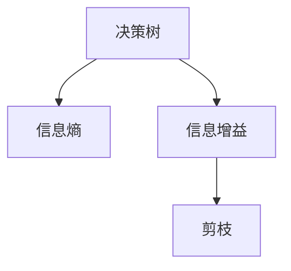
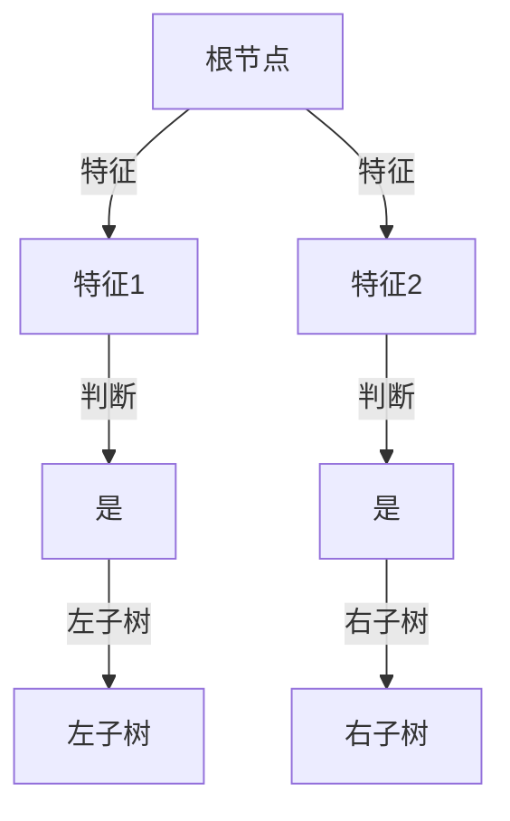

                 

## 1. 背景介绍

### 1.1 问题由来
决策树（Decision Tree）是一种经典的机器学习算法，广泛应用于分类、回归和特征选择等领域。它通过将数据划分为一系列的决策节点，最终生成一棵树形结构，以直观、易于理解的方式对数据进行建模和预测。决策树的优点包括易于解释、可处理非线性关系、不需要过多预处理等，因此在实际应用中具有很强的竞争力。

然而，决策树也有一些局限性。例如，对于具有高维度特征的数据集，决策树容易出现过拟合；决策树的稳定性和性能也受数据分布的影响较大。因此，研究人员不断探索优化决策树算法的方法，以提升其预测能力和鲁棒性。

### 1.2 问题核心关键点
本节将详细介绍决策树的核心理论、基本步骤和常见优化方法。通过理解这些核心概念，可以更好地把握决策树的本质和应用方向。

## 2. 核心概念与联系

### 2.1 核心概念概述

为更好地理解决策树，本节将介绍几个密切相关的核心概念：

- 决策树（Decision Tree）：基于树形结构对数据进行分类的算法。通过选择最优的特征和划分方式，将数据逐步划分到不同的叶子节点，最终形成对样本进行分类的决策路径。
- 信息熵（Entropy）：用于衡量样本集合的纯度。熵越小，样本集合越纯净。
- 信息增益（Information Gain）：用于衡量选择某个特征进行划分后样本集合的纯度变化。
- 剪枝（Pruning）：用于避免过拟合的策略，包括预剪枝和后剪枝。

这些概念之间的逻辑关系可以通过以下Mermaid流程图来展示：



这个流程图展示决策树的核心理论和常用技术：

1. 决策树通过计算信息熵来衡量样本集合的纯度。
2. 信息增益用于选择最优特征进行划分。
3. 剪枝用于避免过拟合。

这些概念共同构成了决策树的核心思想和实现框架。

### 2.2 核心概念原理和架构的 Mermaid 流程图



以上流程图展示了一棵简单的决策树。决策树从根节点开始，通过判断特征的值，逐步将样本分配到左子树或右子树，最终到达叶子节点。每个叶子节点对应一个分类结果。

## 3. 核心算法原理 & 具体操作步骤

### 3.1 算法原理概述

决策树的算法原理主要分为两个步骤：特征选择和树形结构构建。

**特征选择**：决策树的根节点需要选择一个最优的特征进行划分，以最大化样本集合的纯度。常用的特征选择方法包括信息熵、信息增益和基尼指数等。

**树形结构构建**：从根节点开始，决策树通过递归地选择最优特征和划分方式，将数据逐步划分到不同的叶子节点，最终形成一棵完整的决策树。

### 3.2 算法步骤详解

#### 3.2.1 数据准备

1. **数据集划分**：将数据集划分为训练集和测试集，通常将数据集的70%作为训练集，30%作为测试集。
2. **特征工程**：对数据进行预处理，如缺失值填充、特征归一化等。

#### 3.2.2 特征选择

1. **信息熵计算**：计算样本集合的熵值。熵值越小，样本集合的纯度越高。
2. **信息增益计算**：对每个特征计算其信息增益，选择信息增益最大的特征作为划分特征。
3. **特征选择**：从所有特征中，选择信息增益最大的特征作为划分特征。

#### 3.2.3 树形结构构建

1. **节点划分**：选择最优的划分特征和阈值，将样本划分为不同的子集。
2. **递归划分**：对每个子集重复步骤2，直到子集的纯度达到预设阈值，或者无法继续划分为止。
3. **叶子节点**：将无法进一步划分的子集作为叶子节点，并赋予其对应的分类标签。

### 3.3 算法优缺点

**决策树的优点**：

1. **易于解释**：决策树结构直观，易于理解和解释。
2. **处理非线性关系**：决策树可以处理非线性关系，适用于各种数据类型。
3. **不需要过多预处理**：决策树不需要进行复杂的特征选择和数据预处理。

**决策树的缺点**：

1. **过拟合风险**：决策树容易过拟合，特别是在数据量较小或特征维度较高的情况下。
2. **不稳定**：决策树对数据扰动敏感，不同的训练数据可能得到不同的决策树。
3. **维度灾难**：高维度特征可能会导致决策树的分支过于复杂，影响性能。

### 3.4 算法应用领域

决策树在诸多领域得到了广泛应用，包括但不限于：

- **金融风控**：用于风险评估、信用评分等。
- **医疗诊断**：用于疾病诊断、疗效预测等。
- **电商推荐**：用于用户行为分析、商品推荐等。
- **供应链管理**：用于需求预测、库存优化等。
- **自然语言处理**：用于文本分类、情感分析等。

## 4. 数学模型和公式 & 详细讲解 & 举例说明

### 4.1 数学模型构建

决策树的数学模型可以表示为：

$$
\begin{aligned}
\text{Node}_{i} &= \arg \max_{f \in \mathcal{F}} \frac{1}{|D|} \sum_{(x,y) \in D} I(y ; f(x)) \\
\text{Leaf}_{j} &= \arg \min_{y \in Y} \frac{1}{|D|} \sum_{(x,y) \in D} I(y ; y_j)
\end{aligned}
$$

其中，$\text{Node}_{i}$ 表示决策树的节点，$\text{Leaf}_{j}$ 表示叶子节点，$I(y ; y_j)$ 表示信息增益，$\mathcal{F}$ 表示所有可能的划分特征。

### 4.2 公式推导过程

信息熵（Entropy）：用于衡量样本集合的纯度，计算公式为：

$$
H(D) = -\sum_{y} \frac{|D_y|}{|D|} \log_2 \frac{|D_y|}{|D|}
$$

其中，$D$ 表示样本集合，$D_y$ 表示标签为 $y$ 的样本集合。

信息增益（Information Gain）：用于衡量选择某个特征进行划分后样本集合的纯度变化，计算公式为：

$$
\text{IG}(X;D) = H(D) - \sum_{v} \frac{|D_v|}{|D|} H(D_v)
$$

其中，$X$ 表示特征，$D_v$ 表示特征 $X$ 取值为 $v$ 的样本集合。

基尼指数（Gini Index）：类似于信息熵，用于衡量样本集合的纯度，计算公式为：

$$
G(D) = 1 - \sum_{y} \left(\frac{|D_y|}{|D|}\right)^2
$$

其中，$D$ 表示样本集合，$D_y$ 表示标签为 $y$ 的样本集合。

### 4.3 案例分析与讲解

以一个简单的决策树为例，假设有一个包含四个样本的数据集：

| 特征 | 分类标签 |
| --- | --- |
| A1 | A |
| A2 | A |
| A3 | B |
| A4 | B |

我们可以根据信息熵和信息增益来选择划分特征和阈值。

首先计算样本集合的信息熵：

$$
H(D) = -\left(\frac{2}{4}\log_2 \frac{2}{4} + \frac{2}{4}\log_2 \frac{2}{4}\right) = 1
$$

接着计算每个特征的信息增益：

- 特征 A 的信息增益：
  - $H(D_A) = 0$
  - $G(D_A) = 1$
  - $\text{IG}(A;D) = 1 - \frac{1}{4}(0+0) = 1$

- 特征 B 的信息增益：
  - $H(D_B) = 1$
  - $G(D_B) = 1$
  - $\text{IG}(B;D) = 1 - \frac{1}{4}(1+1) = 0.5$

由于信息增益最大的特征是 A，因此我们选择 A 作为划分特征。划分阈值为 1.5。将数据集分为两个子集：

| 特征 A | 特征 B |
| --- | --- |
| A1, A2 | A3, A4 |

继续对两个子集进行递归划分，直到无法进一步划分为止。最终得到的决策树如下：

```
    A (1.5)
     /     \
  A       B
 /  \     /  \
A1   B   A4   B
```

## 5. 项目实践：代码实例和详细解释说明

### 5.1 开发环境搭建

在进行决策树实践前，我们需要准备好开发环境。以下是使用Python进行Scikit-learn开发的环境配置流程：

1. 安装Anaconda：从官网下载并安装Anaconda，用于创建独立的Python环境。

2. 创建并激活虚拟环境：
```bash
conda create -n scikit-learn-env python=3.8 
conda activate scikit-learn-env
```

3. 安装Scikit-learn：从官网获取对应的安装命令。例如：
```bash
conda install scikit-learn
```

4. 安装其他必要库：
```bash
pip install numpy pandas matplotlib seaborn
```

完成上述步骤后，即可在`scikit-learn-env`环境中开始决策树实践。

### 5.2 源代码详细实现

下面是一个简单的决策树分类器的Python实现，使用Scikit-learn库进行数据处理和模型训练。

```python
from sklearn.datasets import load_iris
from sklearn.tree import DecisionTreeClassifier
from sklearn.metrics import accuracy_score

# 加载数据集
iris = load_iris()
X = iris.data
y = iris.target

# 构建决策树模型
clf = DecisionTreeClassifier()
clf.fit(X, y)

# 预测结果
y_pred = clf.predict(X)

# 计算准确率
acc = accuracy_score(y, y_pred)
print(f"Accuracy: {acc}")
```

在这个示例中，我们使用Scikit-learn库的`DecisionTreeClassifier`类来构建决策树模型。首先加载iris数据集，然后对数据进行预处理，构建决策树模型并训练。最后，使用训练好的模型对新数据进行预测，并计算预测结果的准确率。

### 5.3 代码解读与分析

让我们再详细解读一下关键代码的实现细节：

**load_iris函数**：
- 从Scikit-learn库加载iris数据集，返回包含数据和标签的实例。

**DecisionTreeClassifier类**：
- 用于构建和训练决策树模型。
- 常用参数包括criterion（划分标准）、splitter（划分策略）、max_depth（树的最大深度）等。

**fit函数**：
- 训练模型，通过迭代优化决策树参数，最小化预测误差。

**predict函数**：
- 对新数据进行预测，返回预测结果。

**accuracy_score函数**：
- 计算预测结果与真实标签的准确率。

可以看到，Scikit-learn库的决策树实现非常简洁高效，开发者可以灵活调整参数，快速迭代模型。

## 6. 实际应用场景

### 6.1 金融风控

决策树在金融风控领域应用广泛，主要用于风险评估和信用评分。例如，银行可以根据客户的信用历史、资产情况、收入状况等特征，构建决策树模型，对客户的信用等级进行评估，从而决定是否发放贷款和贷款额度。

### 6.2 医疗诊断

医疗诊断是决策树的一个重要应用领域。医生可以根据患者的病史、症状、检查结果等特征，构建决策树模型，对疾病进行诊断和治疗方案推荐。例如，可以根据病人的症状（如胸痛、气促等）构建决策树模型，判断其是否患有心脏病，并推荐相应的治疗方案。

### 6.3 电商推荐

电商推荐系统也常使用决策树进行用户行为分析和商品推荐。例如，根据用户的浏览历史、购买记录等特征，构建决策树模型，预测用户对某件商品的兴趣程度，从而进行个性化推荐。

### 6.4 未来应用展望

随着决策树算法的不断优化和普及，其应用范围将进一步扩展。以下是一些决策树未来可能的发展方向：

1. **深度学习融合**：决策树可以与深度学习技术进行结合，构建更加复杂的模型结构，提升预测性能。例如，决策树可以作为特征提取器，提取特征后输入到深度学习模型中进行进一步预测。

2. **特征选择优化**：决策树可以通过引入更先进的特征选择方法，如随机森林、梯度提升树等，提升特征选择的准确性和稳定性。

3. **多目标优化**：决策树可以应用于多目标优化问题，如资源分配、组合优化等，通过优化多个指标，获得更全面的解决方案。

4. **高维度数据处理**：决策树可以处理高维度数据，通过降维和特征选择，提升模型的泛化能力和预测精度。

5. **在线学习**：决策树可以应用于在线学习场景，如在线广告推荐、实时用户行为分析等，通过不断更新模型，适应数据分布的变化。

6. **集成学习**：决策树可以通过集成学习技术（如Bagging、Boosting等），提升模型的稳定性和预测精度。

## 7. 工具和资源推荐

### 7.1 学习资源推荐

为了帮助开发者系统掌握决策树的理论基础和实践技巧，这里推荐一些优质的学习资源：

1. 《Python机器学习》（原书第二版）：Python数据科学实践和机器学习算法的基础书籍，包含决策树的详细讲解和代码实现。

2. 《机器学习实战》：基于Scikit-learn库的决策树示例代码，适合初学者快速上手。

3. 《统计学习方法》：经典的机器学习教材，包含决策树的理论推导和应用实例。

4. Coursera上的《机器学习》课程：斯坦福大学提供的机器学习入门课程，包含决策树的相关内容。

5. Kaggle上的决策树竞赛：参与实际数据集上的决策树竞赛，提升实战能力。

通过对这些资源的学习实践，相信你一定能够快速掌握决策树的精髓，并用于解决实际的机器学习问题。

### 7.2 开发工具推荐

决策树算法的实现可以依赖Scikit-learn库，其提供了丰富的API接口，适合快速开发和实验。此外，以下是一些常用的决策树开发工具：

1. Scikit-learn：Python数据科学和机器学习库，提供简单易用的API接口，支持决策树的构建和训练。

2. Weka：Java机器学习库，支持决策树的可视化、优化和集成学习等功能。

3. CART：CART算法是决策树的经典实现之一，支持分类和回归任务，适合大规模数据处理。

4. TensorFlow：基于深度学习的开源框架，支持集成决策树等传统机器学习算法，适合高精度预测。

5. XGBoost：高效的梯度提升决策树算法，支持分布式计算，适合大数据处理和模型优化。

合理利用这些工具，可以显著提升决策树算法的开发效率，加快模型迭代和调优的步伐。

### 7.3 相关论文推荐

决策树算法的不断发展离不开学界的研究成果，以下是几篇奠基性的相关论文，推荐阅读：

1. "Decision Trees" （J. Ross Quinlan）：介绍决策树的构建算法和特征选择方法。

2. "A Decision-Theoretic Generalization of On-Line Learning and an Application to Boosting" （Y. Freund and R. Schapire）：介绍决策树的集成学习方法，如AdaBoost、Gradient Boosting等。

3. "Extremely Randomized Trees" （G. Breiman）：介绍随机森林算法，通过随机划分和随机特征选择，提升决策树的鲁棒性和泛化能力。

4. "A Random Survival Forest" （T. Hastie, R. Tibshirani, A. Friedman）：介绍随机生存森林算法，用于处理生存分析问题。

5. "Super Learners: Learning to Optimize Cross-Validated Performance on Multiple Data Sets" （S. Domestic et al.）：介绍超级学习器算法，通过集成多个学习器，提升决策树的泛化能力和预测精度。

这些论文代表了大决策树算法的发展脉络。通过学习这些前沿成果，可以帮助研究者把握学科前进方向，激发更多的创新灵感。

## 8. 总结：未来发展趋势与挑战

### 8.1 总结

本文对决策树算法进行了全面系统的介绍。首先阐述了决策树的核心理论和基本步骤，明确了决策树的本质和应用方向。其次，从原理到实践，详细讲解了决策树的数学模型和实际应用，给出了决策树任务开发的完整代码实例。同时，本文还广泛探讨了决策树在金融风控、医疗诊断、电商推荐等多个行业领域的应用前景，展示了决策树算法的巨大潜力。

通过本文的系统梳理，可以看到，决策树算法在各种机器学习任务中都能发挥重要作用，特别是在特征选择和数据处理方面表现优异。未来，伴随决策树算法的不断优化和普及，其应用领域将进一步拓展，为机器学习技术的发展带来新的动力。

### 8.2 未来发展趋势

展望未来，决策树算法将呈现以下几个发展趋势：

1. **深度融合**：决策树可以与深度学习技术进行融合，构建更加复杂的模型结构，提升预测性能。

2. **高维度数据处理**：决策树可以通过降维和特征选择，处理高维度数据，提升模型的泛化能力和预测精度。

3. **多目标优化**：决策树可以应用于多目标优化问题，通过优化多个指标，获得更全面的解决方案。

4. **在线学习**：决策树可以应用于在线学习场景，通过不断更新模型，适应数据分布的变化。

5. **集成学习**：决策树可以通过集成学习技术（如Bagging、Boosting等），提升模型的稳定性和预测精度。

这些趋势凸显了决策树算法的广阔前景。这些方向的探索发展，必将进一步提升决策树算法的预测能力和鲁棒性，为机器学习技术的发展注入新的活力。

### 8.3 面临的挑战

尽管决策树算法已经取得了一定的成果，但在迈向更加智能化、普适化应用的过程中，它仍面临着诸多挑战：

1. **过拟合风险**：决策树容易过拟合，特别是在数据量较小或特征维度较高的情况下。如何避免过拟合，提高模型的泛化能力，仍然是一个重要问题。

2. **模型复杂度**：决策树模型往往较为复杂，特别是在处理高维度数据时，模型的可解释性和可理解性较差。如何简化模型结构，提升模型的可解释性，仍是一个重要研究方向。

3. **数据依赖性**：决策树算法的性能很大程度上依赖于数据的质量和数量，如何在大规模数据集上构建稳定的决策树模型，仍是一个挑战。

4. **集成学习挑战**：决策树通过集成学习可以提升性能，但在构建集成模型时，如何选择合适的基模型，进行有效的融合，仍是一个重要问题。

5. **资源消耗**：决策树模型在处理大规模数据时，需要较大的计算资源和存储空间。如何在保证性能的同时，优化资源消耗，仍是一个重要问题。

这些挑战需要研究者从理论和实践两个方面进行深入研究，不断探索和优化决策树算法，以应对未来的应用需求。

### 8.4 研究展望

未来，决策树算法的发展方向可以从以下几个方面进行探索：

1. **深度融合**：通过深度学习技术，提升决策树的预测能力和鲁棒性。

2. **高维度数据处理**：通过降维和特征选择，提升决策树处理高维度数据的能力。

3. **多目标优化**：通过优化多个指标，提升决策树的应用范围和泛化能力。

4. **在线学习**：通过不断更新模型，提升决策树的适应能力和泛化能力。

5. **集成学习**：通过集成学习技术，提升决策树的稳定性和预测精度。

这些研究方向的探索，将推动决策树算法的发展，提升其在实际应用中的性能和鲁棒性。

## 9. 附录：常见问题与解答

**Q1：决策树的特征选择方法有哪些？**

A: 决策树的特征选择方法包括信息熵、信息增益和基尼指数等。其中，信息增益是最常用的特征选择方法，用于衡量特征对样本集合纯度的贡献。

**Q2：决策树是否适用于连续型数据？**

A: 决策树可以处理连续型数据，但需要进行离散化处理。常用的方法包括二分法和等宽法等。

**Q3：决策树是否可以处理缺失值？**

A: 决策树对缺失值有较好的处理能力，可以通过对缺失值进行填充或删除等方法进行处理。

**Q4：决策树是否适用于非平衡数据集？**

A: 决策树对非平衡数据集的处理能力较差，容易过拟合。常用的解决方法包括过采样、欠采样和调整权重等。

**Q5：决策树是否可以用于回归任务？**

A: 决策树可以用于回归任务，通过构建叶节点的均值或中位数等，实现对连续型变量的预测。常用的回归决策树算法包括CART等。

这些问题的解答，可以帮助开发者更好地理解决策树的特征选择、数据处理和应用范围，进一步提升决策树算法的应用能力。

---

作者：禅与计算机程序设计艺术 / Zen and the Art of Computer Programming

