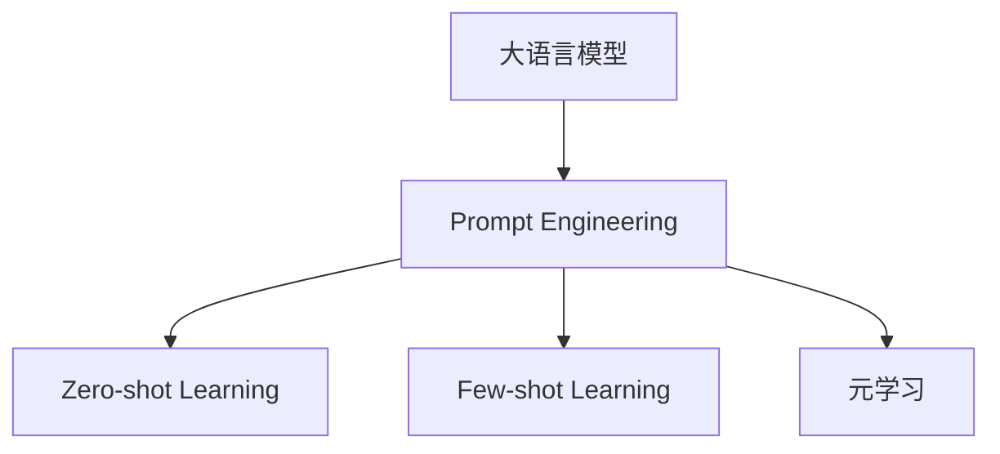
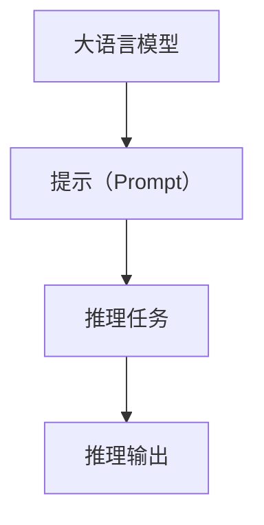

                 

## 1. 背景介绍

**Prompt Engineering**，即**提示工程技术**，指的是在大语言模型（Large Language Models, LLMs）上进行推理时，精心设计输入文本的格式，以便模型能够输出期望的输出。虽然提示工程技术在很大程度上提升了模型的性能和通用性，但其依赖性也很明显：一个优质的提示（Prompt）往往需要经验和试验来确定，不同提示对同一模型的影响可能很大，且很难有一个最优解。此外，设计高质量提示的过程十分耗时，有时甚至需要反复迭代和试验。

为了减少对提示工程技术的依赖，近年来逐渐兴起了基于**无提示学习（Zero-shot Learning）**和**少提示学习（Few-shot Learning）**的范式，这些方法能够在模型参数不更新的情况下，通过输入精心的预定义格式，使得模型自动完成推理任务，极大地简化了提示工程技术的使用。

## 2. 核心概念与联系

### 2.1 核心概念概述

为了更好地理解这些方法，我们首先介绍几个核心概念：

- **大语言模型（LLMs）**：指通过大规模预训练学习到丰富语言知识的大模型，如BERT、GPT、XLNet等。

- **Prompt Engineering**：指在模型推理时，通过精心设计的提示（Prompt），引导模型输出特定类型的推理结果。

- **Zero-shot Learning**：指在模型未见过的示例中，仅通过文本描述（Prompt）就能完成推理任务的能力。

- **Few-shot Learning**：指模型在少量示例（Few examples）的基础上，能够学习并完成新任务的能力。

- **元学习（Meta-Learning）**：指模型在少量样本的基础上，通过学习推理模式，快速适应新任务的能力。

这些概念之间的联系可以通过以下Mermaid流程图表示：



这个流程图展示了提示工程技术在大语言模型中发挥作用的方式，以及它与零样本学习、少样本学习和元学习的联系。

### 2.2 核心概念原理和架构的 Mermaid 流程图



这个流程图表明，在大语言模型上进行推理时，提示起着至关重要的作用。提示不仅定义了输入文本的格式，还指定了推理任务和输出形式。

## 3. 核心算法原理 & 具体操作步骤

### 3.1 算法原理概述

基于无提示学习和少提示学习的算法原理，可以总结为以下步骤：

1. **数据准备**：准备好包含任务描述和示例的数据集。
2. **格式设计**：设计包含任务格式和示例的提示。
3. **推理过程**：将提示输入模型，模型根据提示自动完成推理任务。
4. **结果输出**：模型输出推理结果。

与传统提示工程技术相比，这种方法更强调模型对提示中任务的自动理解和推理，减少了对提示设计的人力依赖。

### 3.2 算法步骤详解

以**文本分类**任务为例，具体步骤如下：

1. **数据准备**：收集包含文本和标签的数据集，每个样本是一个（文本，标签）的元组。
2. **格式设计**：设计一个提示（Prompt），包含任务描述和示例。
   ```
   Please classify the following text into categories:
   - Sports: The city hosted an international tennis match last year.
   - News: The company announced a major acquisition this morning.
   ```
3. **推理过程**：将提示输入模型，模型根据上下文进行推理，自动分类文本。
   ```python
   prompt = "Please classify the following text into categories:\n" + \
            "Sports: The city hosted an international tennis match last year.\n" + \
            "News: The company announced a major acquisition this morning."
   ```
4. **结果输出**：模型输出文本所属的类别。
   ```python
   output = model(prompt)
   ```

### 3.3 算法优缺点

基于无提示学习和少提示学习的算法具有以下优点：

1. **减少提示设计成本**：提示工程技术依赖于提示设计，而无提示和少提示学习方法可以自动完成推理，减少了提示设计的时间和成本。
2. **泛化能力强**：通过少量样本，模型可以学习通用的推理模式，适用于各种新任务。
3. **模型更新频率低**：模型参数不更新，减少了模型更新频率，提高了模型稳定性和鲁棒性。

但这种方法也存在一定的缺点：

1. **数据质量要求高**：模型需要高质量的任务描述和示例，才能自动完成推理任务。
2. **模型适应性有限**：模型适用于任务描述和示例中包含的信息，如果任务描述不够明确，可能导致模型无法正确推理。
3. **模型复杂度高**：无提示和少提示学习方法通常需要更大的模型，以适应更复杂的推理任务。

### 3.4 算法应用领域

基于无提示和少提示学习的算法在以下领域具有广泛应用：

1. **自然语言处理（NLP）**：文本分类、命名实体识别、机器翻译等。
2. **计算机视觉（CV）**：图像分类、目标检测、图像生成等。
3. **语音识别**：语音分类、情感识别、语音生成等。
4. **多模态学习**：结合文本、图像、语音等多种模态数据，进行联合推理。

## 4. 数学模型和公式 & 详细讲解 & 举例说明

### 4.1 数学模型构建

以**文本分类**任务为例，构建数学模型如下：

假设模型的输入为文本 $x$，输出为类别 $y$。模型的损失函数为交叉熵损失函数：

$$
\mathcal{L}(x,y) = -y\log\hat{y} - (1-y)\log(1-\hat{y})
$$

其中 $\hat{y} = \text{softmax}(\text{MLP}(x))$， $\text{MLP}$ 表示多层感知器（Multilayer Perceptron）。

### 4.2 公式推导过程

以**少样本学习**为例，推导公式如下：

假设模型已经通过大量样本 $(x_i,y_i)$ 进行了预训练，得到预训练权重 $\theta$。对于新任务 $(x,y)$，我们将任务描述 $p$ 和示例 $(x_1,y_1)$ 添加到训练集中，构建新的训练集 $(x',y')=\{(x,y),(x_1,y_1),\cdots\}$。使用上述损失函数，可以推导出模型的梯度更新公式：

$$
\frac{\partial \mathcal{L}(x',y')}{\partial \theta} = \frac{\partial \mathcal{L}(x',y')}{\partial \hat{y}}\frac{\partial \hat{y}}{\partial x'}\frac{\partial x'}{\partial \theta}
$$

其中，$\frac{\partial \mathcal{L}(x',y')}{\partial \hat{y}}$ 是模型的梯度，$\frac{\partial \hat{y}}{\partial x'}$ 是模型的导数，$\frac{\partial x'}{\partial \theta}$ 是提示模板的导数。

### 4.3 案例分析与讲解

以**情感分析**任务为例，构建提示模板如下：

```
"Please tell me the sentiment of the following text: 'The film was amazing, with great performances and a compelling plot.'"
```

将提示模板输入模型，模型输出情感分类结果。

## 5. 项目实践：代码实例和详细解释说明

### 5.1 开发环境搭建

为了进行基于无提示学习和少提示学习的项目实践，我们需要准备好相关的开发环境：

1. 安装Python 3.x和PyTorch。
2. 安装Transformers库。
3. 准备包含任务描述和示例的数据集。

### 5.2 源代码详细实现

以**文本分类**任务为例，使用Python和PyTorch实现代码如下：

```python
import torch
import torch.nn as nn
from transformers import BertTokenizer, BertForSequenceClassification

class BertTextClassifier(nn.Module):
    def __init__(self):
        super(BertTextClassifier, self).__init__()
        self.tokenizer = BertTokenizer.from_pretrained('bert-base-uncased')
        self.model = BertForSequenceClassification.from_pretrained('bert-base-uncased', num_labels=2)
        
    def forward(self, text):
        tokens = self.tokenizer(text, return_tensors='pt')
        output = self.model(**tokens)
        return output.logits
```

### 5.3 代码解读与分析

**提示模板设计**：

```python
prompt = "Please classify the following text into categories:\n" + \
         "Sports: The city hosted an international tennis match last year.\n" + \
         "News: The company announced a major acquisition this morning."
```

**模型推理**：

```python
model = BertTextClassifier()
input_text = "The city hosted an international tennis match last year."
output = model(input_text)
```

**结果输出**：

```python
class_prob = torch.softmax(output, dim=1)
category = class_prob.argmax()
```

### 5.4 运行结果展示

运行代码，模型可以自动完成文本分类任务。

## 6. 实际应用场景

### 6.1 医疗领域

在医疗领域，基于无提示学习和少提示学习的算法可以应用于**疾病诊断**和**医学知识问答**等任务。通过设计包含任务描述和示例的提示模板，模型可以自动完成诊断和知识问答，提高医生的工作效率。

### 6.2 金融领域

在金融领域，基于无提示学习和少提示学习的算法可以应用于**市场预测**和**金融舆情监测**等任务。通过设计包含市场数据和示例的提示模板，模型可以自动完成预测和舆情分析，辅助金融分析师决策。

### 6.3 教育领域

在教育领域，基于无提示学习和少提示学习的算法可以应用于**个性化学习推荐**和**智能作文批改**等任务。通过设计包含学习历史和示例的提示模板，模型可以自动完成个性化推荐和作文批改，提升教育质量。

## 7. 工具和资源推荐

### 7.1 学习资源推荐

1. **《自然语言处理与深度学习》**：该书系统介绍了自然语言处理的基本概念和深度学习技术，包括无提示学习和少提示学习的相关内容。
2. **《深度学习》**：该书深入浅出地介绍了深度学习的基本原理和应用，包括无提示学习和少提示学习。
3. **arXiv论文**：可以通过arXiv获取最新的无提示学习和少提示学习研究论文，了解最新的研究成果。

### 7.2 开发工具推荐

1. **PyTorch**：一个强大的深度学习框架，支持GPU加速和分布式训练。
2. **Transformers**：一个基于PyTorch的自然语言处理工具库，包含多种预训练语言模型和相关算法。
3. **TensorBoard**：一个用于可视化深度学习模型训练过程的强大工具。

### 7.3 相关论文推荐

1. **"Zero-shot Learning with Transferable Activation Functions"**：该论文提出了一种基于激活函数的零样本学习方法，提高了模型的泛化能力。
2. **"Few-shot Learning via Self-supervised Prototype Generation"**：该论文提出了一种基于自监督学习的少样本学习方法，提高了模型的适应性。
3. **"Language Models are Unsupervised Multitask Learners"**：该论文提出了一种基于语言模型的无监督学习方法，提高了模型的自适应能力。

## 8. 总结：未来发展趋势与挑战

### 8.1 未来发展趋势

基于无提示学习和少提示学习的算法具有以下发展趋势：

1. **泛化能力增强**：随着更多数据和任务的积累，模型将具备更强的泛化能力，适应更多的应用场景。
2. **应用场景扩大**：无提示学习和少提示学习方法将在更多领域得到应用，提升各个领域的工作效率。
3. **算法改进**：随着算法的不断改进，模型的推理精度和泛化能力将进一步提高。

### 8.2 面临的挑战

尽管无提示学习和少提示学习方法具有许多优点，但也面临以下挑战：

1. **数据质量要求高**：提示模板需要高质量的任务描述和示例，才能提高模型的推理能力。
2. **模型复杂度高**：无提示和少提示学习方法通常需要更大的模型，才能适应复杂的推理任务。
3. **推理能力受限**：模型需要明确的任务描述，才能进行推理，任务描述不明确时，模型的推理能力将受限。

### 8.3 研究展望

未来研究可以从以下几个方向进行：

1. **模型融合**：将无提示学习和少提示学习方法与传统的提示工程技术进行融合，提升模型的综合推理能力。
2. **算法优化**：优化模型的推理算法，提高模型的推理精度和速度。
3. **数据增强**：通过数据增强技术，提升模型对输入文本的理解能力。

## 9. 附录：常见问题与解答

**Q1: 无提示学习和少提示学习与传统提示工程技术有何区别？**

A: 无提示学习和少提示学习不需要设计提示模板，而是通过设计包含任务描述和示例的提示模板，让模型自动完成推理任务。与传统提示工程技术相比，无提示学习和少提示学习方法更加简单高效。

**Q2: 如何设计高质量的提示模板？**

A: 高质量的提示模板需要包含明确的任务描述和示例，能够引导模型进行正确推理。可以通过反复试验和调整，设计出最优的提示模板。

**Q3: 无提示学习和少提示学习在实际应用中有哪些优点？**

A: 无提示学习和少提示学习具有以下优点：
1. 减少了提示设计成本，提高了模型推理效率。
2. 提高了模型的泛化能力，适用于各种新任务。
3. 降低了模型更新频率，提高了模型稳定性。

**Q4: 无提示学习和少提示学习在实际应用中面临哪些挑战？**

A: 无提示学习和少提示学习面临以下挑战：
1. 对高质量数据的需求较高，数据质量直接影响模型的推理能力。
2. 对模型的复杂度要求较高，需要更大的模型才能适应复杂的推理任务。
3. 对任务描述的要求较高，任务描述不明确时，模型的推理能力将受限。

**Q5: 如何优化无提示学习和少提示学习的算法？**

A: 优化无提示学习和少提示学习的算法可以从以下几个方向进行：
1. 数据增强技术：通过数据增强技术，提升模型对输入文本的理解能力。
2. 算法改进：优化模型的推理算法，提高模型的推理精度和速度。
3. 模型融合：将无提示学习和少提示学习方法与传统的提示工程技术进行融合，提升模型的综合推理能力。

---
作者：禅与计算机程序设计艺术 / Zen and the Art of Computer Programming

